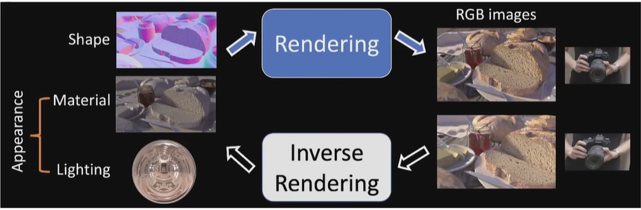
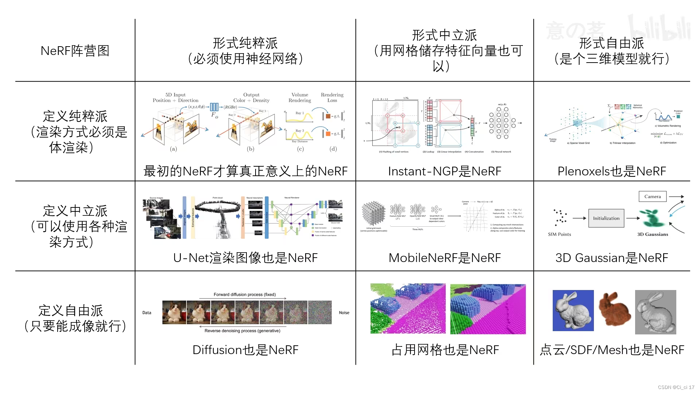
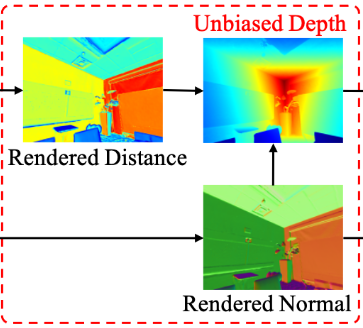

# nerf | 3DGS

render : 利用光照以及一些三维物体模型 - 输出RGB信息 | 反渲染就是从RGB图像转换成为三维世界中的物体模型 (跟我在r3live中理解的render有些不一样) | nerf成为“隐式”，就是没有明确的三维模型信息，模型参数直接保存在了网络中。

**nerf**

- 在给定视角上发出的射线上进行采样，采样点的xyz以及其对应射线上的位姿信息(一共5维)输入到模型中，然后输出该点对应的RGB以及不确定度信息，最后按照一定的策略将这条射线上面所有采样点融合成为图像上的一个点，即获取到RGB信息。
  - 从获取每一个采样的RGB信息以及融合过程中的参数应该都会根据损失函数计算出的结果进行反向传递，从而修正模型中的参数。
  - 从给定视角上进行采样应该就属于是从一个“场”上面进行采样了，所以采样就不可避免地出现采样噪声，这也是影响重建效果的一个因素

**3DGS**

3DGS 并不是一种隐式的场景表达方式，其会显示地表达场景模型(即使3D椭球)。在渲染的过程中一般是直接将三维数据直接投影到成像平面上。**高斯求谐函数**处理的是RGB渲染关系，  **光栅化** 就类似于在ImMesh中的处理，将场景中实际存在的部分投影到平面中(3D->2D)。

- 在实际的训练过程中，3D高斯中的三维高斯球 (创建的时候是初始化得到的)，训练过程中会不断地进行高斯球的分裂、变换等来实现对于整个场景的拟合
- 从三维高斯的等概率密度函数上分析，其对应的就是一个椭球体的二次型方程 | **具体的实现代码还不太确定**

参考:

1. http://www.yindaheng98.top/%E5%9B%BE%E5%BD%A2%E5%AD%A6/3D%E9%AB%98%E6%96%AF%E6%95%B0%E5%AD%A6%E6%8E%A8%E5%AF%BC.html#derivation-of-sampling
2. https://www.find.org.tw/index/tech_obser/browse/7eaa3e8ffc7876e74509befd5ed50b8a/
3. https://www.bilibili.com/video/BV11e411n79b/?spm_id_from=333.788&vd_source=a91f6b7dd00fe509f5a3c655fab71659

****

整理从Nerf到3DGS方法中的mesh重建 —— 是不是需要训练完之后实时重建，还是只是静态重建就可以

1. 3D LiDAR Mapping in Dynamic Environments Using a 4D Implicit Neural Representation

2. PGSR: Planar-based Gaussian Splatting for Efficient and High-Fidelity Surface Reconstruction
3. Periodic Vibration Gaussian: Dynamic Urban Scene Reconstruction and Real-time Rendering
4. SuGaR：Surface-Aligned Gaussian Splatting for Efficient 3D Mesh Reconstruction and High-Quality Mesh Rendering

- TSDF(https://blog.csdn.net/qq_39732684/article/details/105294993) 截断符号函数(Truncated Signed Distance Function) | 截断距离以及截断距离的加权平均 http://liuxiao.org/kb/3dvision/3d-reconstruction/tsdf-truncated-signed-distance-function/

    - TSDF就是计算体素到平面的距离然后进行均值化到[-1,1]这个区间中

    

    - TSDF 感觉就是通过计算每一个体素到物体表面的距离以及保存对应的RGB信息。多帧数据计算出来的TSDF值进行加权(能更好的表示一个体素到平面的距离) 。RGB也可以在RGB图上投影得到，多帧数据对应的RGB也按照一定策略融合。**感觉这个方法更适合对于静态物体的mesh重建，mesh表面的提取是基于其他算法实现的 (如等值面提取算法 Marching Cubes)**

- 4D TSDF —— 用于表示动态物体以及静态场景 **计算方式与传统完全不一样**

    - 相比与3D TSDF，这里TSDF值是直接通过基函数拟合得到的 —— 基函数的选择是DCT(类似于傅里叶变换)。基函数的权重是训练得到的 | 大部分基函数与时间有关，最基本的基函数与时间无关(静态)，所以基函数加权结果就应该是在t时刻该体素到最近平面的截断符号距离
    - 权重计算： 点落到哪一个体素中，使用该体素的顶点进行差值得到点的特征向量，经过MLP输出权重 —— 没有提及这个体素顶点的特征向量是如何得到的，总感觉要在特征向量中体现一些到平面的距离信息 **直接参考Instant_NCP计算顶点特征向量(要实际看一看)**

    

- 关于损失函数的设置

- 动态/静态函数区分 —— 动态物体直接可以通过对计算出来的权重设置阈值判断

**PGSR: Planar-based Gaussian Splatting for Efficient and High-Fidelity Surface Reconstruction**

normal 应该说的是法线贴图 —— 就是XYZ方向的法线颜色各不相同。即可以在一张图直接看出来法线变换(即平面的变化)。论文中提到的所谓 planar-based 就是说在使用3DGS的时候是将三维的椭球体转换成为了一个平面进行后续处理。

- unbiased depth rendering 

  - 3D 椭球 : 按照 短轴方向进行投影获取一个2D平面信息
  - 直接使用distance map以及normal map去生成depth信息

  

- single-view and multi-view regularization

  - 单视图规则化 | 保证生成的depth以及normal信息是正常的
  - 多视角中 即要保证几何上的一致性，又要保证光度上的一致性(光度就是在r3live上面看到的那样，一个点的rgb在不同图像上就应该基本没有差别) | 所以多视图既要保证几何一致又要保证光度一致

**pvg**

动态物体剔除 + 重建 +实时

PS: 为什么感觉这篇文章里面，即使用了image又使用了lidar来处理

**Query:**

1. 3DGS换场景是不是还需要训练 还是将模型信息保存在网络中么 | 能实时渲染么 —— GS实现的还是新视角的生成么
2. 3DGS是如何损失掉几何信息的，三维几何体难道不是直接可以获取到xyz信息么，还是说其在仿射变换的时候丢失掉了一部分几何信息

  

**PVG**

- 3D高斯重建整个static scene
- periodic vibration-based temporal dynamics 周期性 基于振动的动力学模型

- temporal smoothing mechanism
- position-aware adaptive control

3D Gaussian Splatting 是用于渲染RGB信息出来还是mesh的重建

lidar获取到的点云量应该比image更加稀疏
