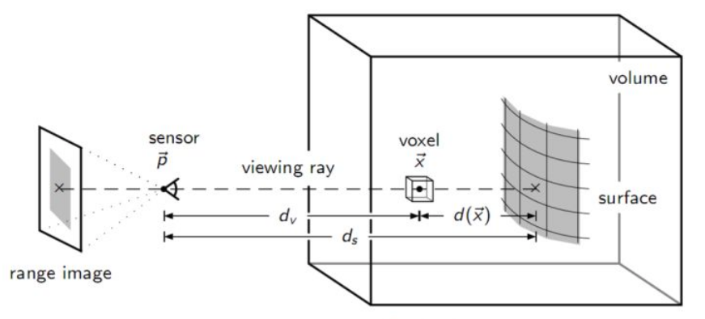
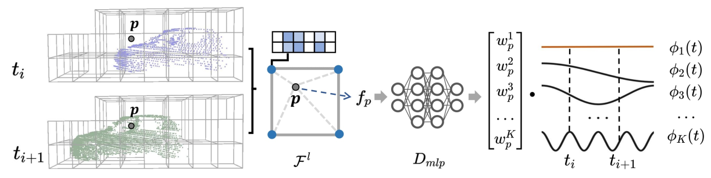

# 3DGS

整理从Nerf到3DGS方法中的mesh重建

1. 3D LiDAR Mapping in Dynamic Environments Using a 4D Implicit Neural Representation

2. PGSR: Planar-based Gaussian Splatting for Efficient and High-Fidelity Surface Reconstruction
3. Periodic Vibration Gaussian: Dynamic Urban Scene Reconstruction and Real-time Rendering

- TSDF(https://blog.csdn.net/qq_39732684/article/details/105294993) 截断符号函数(Truncated Signed Distance Function) | 截断距离以及截断距离的加权平均 http://liuxiao.org/kb/3dvision/3d-reconstruction/tsdf-truncated-signed-distance-function/

    - TSDF就是计算体素到平面的距离然后进行均值化到[-1,1]这个区间中

    

    - TSDF 感觉就是通过计算每一个体素到物体表面的距离以及保存对应的RGB信息。多帧数据计算出来的TSDF值进行加权(能更好的表示一个体素到平面的距离) 。RGB也可以在RGB图上投影得到，多帧数据对应的RGB也按照一定策略融合。**感觉这个方法更适合对于静态物体的mesh重建，mesh表面的提取是基于其他算法实现的 (如等值面提取算法 Marching Cubes)**

- 4D TSDF —— 用于表示动态物体以及静态场景 **计算方式与传统完全不一样**

    - 相比与3D TSDF，这里TSDF值是直接通过基函数拟合得到的 —— 基函数的选择是DCT(类似于傅里叶变换)。基函数的权重是训练得到的 | 大部分基函数与时间有关，最基本的基函数与时间无关(静态)，所以基函数加权结果就应该是在t时刻该体素到最近平面的截断符号距离
    - 权重计算： 点落到哪一个体素中，使用该体素的顶点进行差值得到点的特征向量，经过MLP输出权重 —— 没有提及这个体素顶点的特征向量是如何得到的，总感觉要在特征向量中体现一些到平面的距离信息 **直接参考Instant_NCP计算顶点特征向量(要实际看一看)**

    

- 关于损失函数的设置

- 动态/静态函数区分 —— 动态物体直接可以通过对计算出来的权重设置阈值判断

**PGSR: Planar-based Gaussian Splatting for Efficient and High-Fidelity Surface Reconstruction**

normal 应该说的是法线贴图 —— 就是XYZ方向的法线颜色各不相同。即可以在一张图直接看出来法线变换(即平面的变化)

- 基于3DGS的静态mesh重建  

**PVG**

- 3D高斯重建整个static scene
- periodic vibration-based temporal dynamics 周期性 基于振动的动力学模型

- temporal smoothing mechanism
- position-aware adaptive control

3D Gaussian Splatting 是用于渲染RGB信息出来还是mesh的重建

lidar获取到的点云量应该比image更加稀疏
