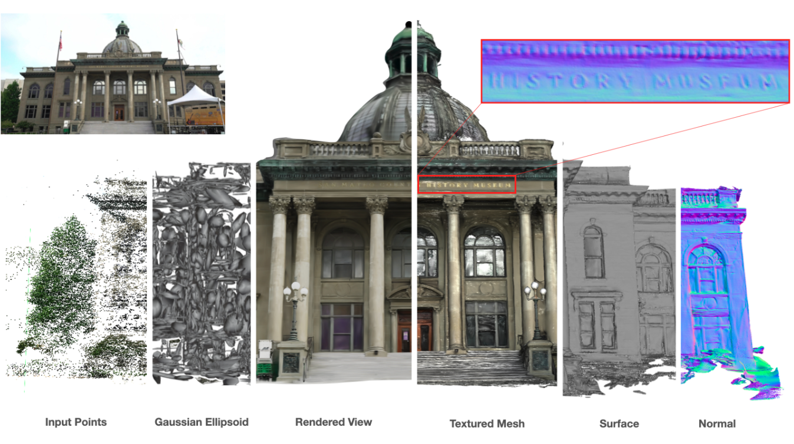
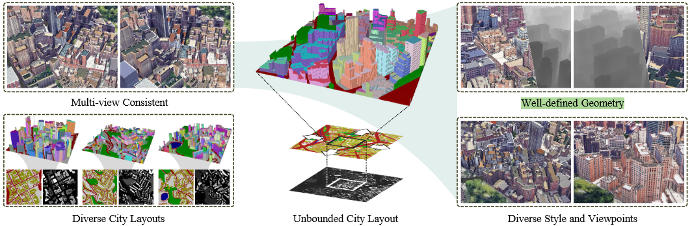

# nerf | 3DGS

render : 利用光照以及一些三维物体模型 - 输出RGB信息 | 反渲染就是从RGB图像转换成为三维世界中的物体模型 (跟我在r3live中理解的render有些不一样) | nerf成为“隐式”，就是没有明确的三维模型信息，模型参数直接保存在了网络中。

**nerf**

- 在给定视角上发出的射线上进行采样，采样点的xyz以及其对应射线上的位姿信息(一共5维)输入到模型中，然后输出该点对应的RGB以及不确定度信息，最后按照一定的策略将这条射线上面所有采样点融合成为图像上的一个点，即获取到RGB信息。
  - 从获取每一个采样的RGB信息以及融合过程中的参数应该都会根据损失函数计算出的结果进行反向传递，从而修正模型中的参数。
  - 从给定视角上进行采样应该就属于是从一个“场”上面进行采样了，所以采样就不可避免地出现采样噪声，这也是影响重建效果的一个因素

**3DGS**

3DGS 并不是一种隐式的场景表达方式，其会显示地表达场景模型(即使3D椭球)。在渲染的过程中一般是直接将三维数据直接投影到成像平面上。**高斯求谐函数**处理的是RGB渲染关系，  **光栅化** 就类似于在ImMesh中的处理，将场景中实际存在的部分投影到平面中(3D->2D)。

- 在实际的训练过程中，3D高斯中的三维高斯球 (创建的时候是初始化得到的)，训练过程中会不断地进行高斯球的分裂、变换等来实现对于整个场景的拟合
- 从三维高斯的等概率密度函数上分析，其对应的就是一个椭球体的二次型方程 | **具体的实现代码还不太确定**

参考:

1. http://www.yindaheng98.top/%E5%9B%BE%E5%BD%A2%E5%AD%A6/3D%E9%AB%98%E6%96%AF%E6%95%B0%E5%AD%A6%E6%8E%A8%E5%AF%BC.html#derivation-of-sampling
2. https://www.find.org.tw/index/tech_obser/browse/7eaa3e8ffc7876e74509befd5ed50b8a/
3. https://www.bilibili.com/video/BV11e411n79b/?spm_id_from=333.788&vd_source=a91f6b7dd00fe509f5a3c655fab71659

****

整理从Nerf到3DGS方法中的mesh重建 —— 是不是需要训练完之后实时重建，还是只是静态重建就可以

1. 3D LiDAR Mapping in Dynamic Environments Using a 4D Implicit Neural Representation

2. PGSR: Planar-based Gaussian Splatting for Efficient and High-Fidelity Surface Reconstruction
3. Periodic Vibration Gaussian: Dynamic Urban Scene Reconstruction and Real-time Rendering
4. SuGaR：Surface-Aligned Gaussian Splatting for Efficient 3D Mesh Reconstruction and High-Quality Mesh Rendering

- TSDF(https://blog.csdn.net/qq_39732684/article/details/105294993) 截断符号函数(Truncated Signed Distance Function) | 截断距离以及截断距离的加权平均 http://liuxiao.org/kb/3dvision/3d-reconstruction/tsdf-truncated-signed-distance-function/

    - TSDF就是计算体素到平面的距离然后进行均值化到[-1,1]这个区间中

    

    - TSDF 感觉就是通过计算每一个体素到物体表面的距离以及保存对应的RGB信息。多帧数据计算出来的TSDF值进行加权(能更好的表示一个体素到平面的距离) 。RGB也可以在RGB图上投影得到，多帧数据对应的RGB也按照一定策略融合。**感觉这个方法更适合对于静态物体的mesh重建，mesh表面的提取是基于其他算法实现的 (如等值面提取算法 Marching Cubes)**

- 4D TSDF —— 用于表示动态物体以及静态场景 **计算方式与传统完全不一样**

    - 相比与3D TSDF，这里TSDF值是直接通过基函数拟合得到的 —— 基函数的选择是DCT(类似于傅里叶变换)。基函数的权重是训练得到的 | 大部分基函数与时间有关，最基本的基函数与时间无关(静态)，所以基函数加权结果就应该是在t时刻该体素到最近平面的截断符号距离
    - 权重计算： 点落到哪一个体素中，使用该体素的顶点进行差值得到点的特征向量，经过MLP输出权重 —— 没有提及这个体素顶点的特征向量是如何得到的，总感觉要在特征向量中体现一些到平面的距离信息 **直接参考Instant_NCP计算顶点特征向量(要实际看一看)**

    

- 关于损失函数的设置

- 动态/静态函数区分 —— 动态物体直接可以通过对计算出来的权重设置阈值判断

**PGSR: Planar-based Gaussian Splatting for Efficient and High-Fidelity Surface Reconstruction**

normal 应该说的是法线贴图 —— 就是XYZ方向的法线颜色各不相同。即可以在一张图直接看出来法线变换(即平面的变化)。论文中提到的所谓 planar-based 就是说在使用3DGS的时候是将三维的椭球体转换成为了一个平面进行后续处理。

- unbiased depth rendering 

  - 3D 椭球 : 按照 短轴方向进行投影获取一个2D平面信息
  - 直接使用distance map以及normal map去生成depth信息

  

- single-view and multi-view regularization

  - 单视图规则化 | 保证生成的depth以及normal信息是正常的
  - 多视角中 即要保证几何上的一致性，又要保证光度上的一致性(光度就是在r3live上面看到的那样，一个点的rgb在不同图像上就应该基本没有差别) | 所以多视图既要保证几何一致又要保证光度一致

**pvg**

PS: 为什么感觉这篇文章里面，即使用了image又使用了lidar来处理

**Query:**

1. 3DGS换场景是不是还需要训练 还是将模型信息保存在网络中么 | 能实时渲染么 —— GS实现的还是新视角的生成么
2. 3DGS是如何损失掉几何信息的，三维几何体难道不是直接可以获取到xyz信息么，还是说其在仿射变换的时候丢失掉了一部分几何信息

**PVG**

动态物体剔除 + 重建 +实时

- 3D高斯重建整个static scene | periodic vibration-based temporal dynamics 周期性 基于振动的动力学模型
    - 3D 椭圆体的中心以及透明度都用使用时间函数来表示 

- position-aware adaptive control -> 大尺度的3D场景中 远处高斯球比较大，近处中点比较小 (这样可以方便重建)
- temporal smoothing mechanism

3D Gaussian Splatting 是用于渲染RGB信息出来还是mesh的重建

****

剩余几篇GS相关文章的整理 —— 都是场景重建任务 | 重点的四篇文章 scence dreamer， citydreamer，citygaussion，gaussioncity。前两篇之间的联系比较紧密一些

- 场景重建 最终能不能输出有明确几何信息的3D场景(比如mesh或者其他数据)，还是其只能输出简单的图像数据来代表3D场景
  - 前两种方法上应该有好的几何结构，Gaussian 的方法是没有的

- 模型的输入数据是什么，对于场景数据的描述形式应该是什么，以及最终的输出数据是什么(总是感觉这几种文章之间的区别很大程度是输入数据的不同以及模型的设计不同)

- 是不是所有的模型中都包含了场景的参数化的过程，这也是在nerf中常表现的一种方式，直接通过给模型输入数据，输出这个场景中某些信息

- 前两篇使用的方法为nerf，后面两篇为Gaussion | 前面的可以生成比较好的几何结构

- 需要关注一下其中的损失函数, 但是不是特别重要的部分

**SceneDreamer: Unbounded 3D Scene Generation from 2D Image Collections**

3D 自然场景的生成器 | 训练数据为2D图像集(并不需要相机参数) | 输入为2D的简单噪声(simplex noise)信息 | 实际场景的几何使用网络进行表示即使用体积渲染的方法(类似于nerf)做渲染，输出渲染后的图像。

**BEV : 作为整个模型开始部分**

- 输入 | 简单噪声即simplex noise —— 就是一个[-1,1]的标量值 , 但其是随机生成的。
- 输出 高度图+语义图 | 

- 对于高度：相同的2D噪声信号的里面按照不同的频率采样，最后插值形成一种高度图。对于语义：不同的2D噪声相同的采样率, 分别代表温度与降水。通过直接定义xx温度+xx降水对应着什么语义类别，后续只要输入噪声信息就可以直接输出高度图+语义图
  -  这里也是parameter-free way的方式，全是直接定义，不需要训练
  - 这里引入语义正则化，即对随机生成的语义图做处理，避免其出现混乱的语义分布 | 因为语义生成是直接使用2D噪声信号合成的，所以很可能出现一种语义区域中又嵌套一种语义，这里就是去掉这种情况，让语义分布均匀 (一个区域中的大部分点是什么类就是什么类)。

**Generative Neural Hash Grid**

​    hash表本身就是方便快速查找数据的一种结构，neural hash grid 是将 hash function 以及 hash 中储存的数据 (传统的是实际的物理数据，这里是feature向量) 都转换成为可学习的部分。

- scene feature 中包含了高度特征以及语义信息

- 做推理的时候，在 local scene windows 采样得到的部分直接获取局部数据对应的hash特征数据，这个数据可以直接送入渲染器中处理，获取渲染之后的image图像。 | 训练是训练 hash fuction以及 hash 对应的 feature数据。

  这部分介绍的时候可能得介绍一些与hash相关的模型做对比

**Unbounded 3D Scene GAN in the Wild**

​    这里实现的就是一个对抗模型，其中的fake图像是通过体积渲染器直接生成的(也就是类似于nerf的方法)，但是对于real image的获取我还需要看training的部分 —— 这里可能是真实的image训练集获取到的

- 利用 颜色 + 透明度 + 透射函数 三种计算 像素值

**trainning**

- real image 是直接用现有的方法合成出来的，在对抗学习中去优化参数 | 即encoder、hash还有render部分需要被训练实现

- 训练中 生成图像分辨率为256*256，并且采样只会从之前确定好的 local scene window中进行采样。  

**inference**

- 训练的时候直接使用低分辨率，但是在推理的时候可以使用高分辨率
-  生成这部分内容的时候是直接 使用一个滑动窗口去代表local scene window | 即跟随相机的运行，不断渲染新的图像。

数据集: 

- 网络搜集 | 并且过滤不合格图像
- 并且使用 ViT-Adapter 去生成语义分割图 —— 送入到对抗学习部分处

评估指标

- 多视图一致性就是通过实际给定的相机轨迹以及使用colmap生成的相机轨迹做比对比。

消融实验中:

- 在参数化方法的时候都是去使用整个建模场景去计算，但是这里的方法是只采样并渲染视角相关的一部分空间。
-  关于相机采样，证明了拒绝采样方案work

最后可以再补充一部分渲染数据

 如何解释 our semantic-conditioned GAN training framework  | 这里的condition代表什么? —— 估计就是说特别关注语义部分，从语义的角度对image数据进行训练 (使用真实图+语义图做训练，而不是仅仅只使用语义)

 还有我不太确定的事情是汇报的时候应该讲哪些内容 | 并且哪些内容是重点 

****

**CityDreamer: Compositional Generative Model of Unbounded 3D Cities**

- 城市场景的生成的难度要高于自然场景 | 生成3D城市场景，并且可以多角度观察 | 几何关系明确(深度图合理) |城市风格可以变化 —— 这里的很多功能都跟SceneDreamer实现差不多
  - 介绍下 building 这种类的语义标签虽然一样，但是彼此之前差别比较大，但是自然场景中的同语义标签的物体之间的外观差比比较小

- 这部分直接使用多个模块进行场景生成，最后讲所有的部分融合到一起 | pipeline的流程与SceneDreamer类似，先进行场景生成(输出成为 semantic map以及height map两种形式) ，然后进入场景的参数化表示，render渲染结果最后融合出最后的结果。本文的创新点在：
  - background与building单独生成 
  - 对不同的生成器采用不同的参数化 | generative hash grid +     periodic positional embedding

 注意解释这部分的创新点 | 以及实际使用的数据集在这里的作用是什么(怎么使用数据集并并且其去修正了哪些参数) 

- layout 城市排布 —— MaskGIT+VQVAE

  - MaskGIT 负责 生成 layout token T, 再使用一个滑动窗口不断地生成layout，生成出来的Token值再通过VQVAE解码成高度图+语义图 (VQVAE解码的数据是一个固定尺寸的数据，所以layout的生成是不断递推的)
  
    -  直接使用语义+高度图训练一个codobook  |  在实际生成的时候使用解码器计算出 语义+高度图  
    - VQVAE（Vector Quantized Variational Autoencoder）是一种离散潜在空间的生成模型。与传统的 VAE 不同，VQVAE 将输入数据映射到一个离散的码本（codebook）中，然后使用这些离散的码字来表示输入数据。这种方法非常适合处理图像块（patches），因为它可以将复杂的连续特征表示为离散的符号，从而简化了生成过程.。他就是使用height以及semantic数据训练得到的数据（实际输入的图像数据中也是包含这些高度图以及语义图)
  
  - 对于损失函数 —— 高度 + 语义 + 边缘(building与周围部分是快速变化的，生成的高度图中要体现这种特点，自然环境可能就没有这种限制)
  
    
  
- background 背景生成器

  - 有些类似于 SceneDreamer ， 同时也是取其中的局部区域处理

  - 在encode 部分 —— 还是会直接使用 语义+高度图进行处理的 (仿造在SceneDreamer中的处理方法) 

  - 输出 一张 image + Mask

  

- building 城市生成器

  - 输出多张 image + Mask | 数量不知道是哪里确定的
  - 首先在编码器上，这里使用的是 local encoder | 但是在background这里使用的是 global encoder来处理数据（两者的区别是什么）| 关于L的使用感觉在这里才显露出来，background部分也没有感受出来background的作用 

- 组合器

  - 组合器部分应该是偏向于直接叠加的形式，并没有使用什么高深的融合算法

  - 在融合器的时候不使用训练，那么整个过程的数据都在训练哪些部分

这里的数据集用于训练的部分的是什么

模型一共包括了四个环节，其中的background generator部分有点像是借鉴了sceneDreamer中的结构，hash+volumetric render部分的模型是有相似的，具体还是要看这为了实现city的部分做了什么。

最终

PS：

- 数据集在这里的作用是什么 | 上一篇中有没有使用数据集进行训练 | 

***

**CityGaussian: Real-time High-quality Large-Scale Scene Rendering with Gaussians**

​    这里实现了大尺度+实时渲染  |  在various scales中的渲染难度在哪里?

**大场景重建** ： (1) 3DGS更适合小场景，大场景下的GPU显存不够 (2) 不同场景下相同的 average visible Gaussian(即使用在渲染图像上面的高斯椭球) 对应的速度也是不一样的 FPS明显差异

**一些解释**

- 首先对COLMAP生成点做训练，这样保证目前生成的这些3DGS点所处于的位置都是对的，也就是说几何结构是对的，剩下的处理都是就基于这个先验信息来做 | 保证分块训练的时候，这些block的数据拼接起来几何上至少是一致的
- 那block实际使用到底是映射之前分开的还是映射之后分开的  | 只能做这种假设 —— block虽然是压缩之后形成的，但是压缩数据的作用只能是分配训练数据，实际训练的时候还是得使用压缩之前的部分进行训练
- 注意这里的前景区域是如何判定的，在后面的超参数设定上是有的

- 对比渲染结果这里有groundturth，但是在无界生成的时候是没有gt出现的，所以我感觉前两种方法是生成，但是这种方法更多的是拟合

  

主要部分:

1. divide-and-conquer

   主要实现的是 parallel trainning | 常规的GS并不适合大规模场景其会生成过多的3DGS点，导致trainning的时候显存不够，或者rendering的时候过于缓慢

- global scene prior

  - 其作为整个“分而治之”思想的基础，但是如果只对单一block中的数据进行处理(其将会导致不同block模块进行融合的时候，未必生成一致的结果)。这里对COLMAP中生成的点进行处理，获取当前整个场景中的几何关系(因为point天然对应几何信息)

- adaptive training data

  在该模块中处理数据时，首先要区分前景区域以及背景区域(前景区域中的数据背景重要，所以在处理的时候需要更加细致)

  - 无界转换有界: 前景区域中的高斯点位置转换到[-1,1], 并且是线性变换，而对于背景区域使用的是非线性变换

  - 训练数据选择：对于每一个block需要选择用于训练的数据 | 即判断使用该block与不使用该block生成的渲染图像上的结构性差异，如果差异比较大则人为该block与这个位姿相关性比较大

    

    - 对于始终贡献小的block，其可能一直没有数据训练，从而影响了整个渲染结果，所以这里会将相机Pose在block中的情况也考虑进来

- parallel trainning

​	block的分配以及训练数据的分配实现之后，剩余部分就是并行训练

2. Level-of-Detail

   其主要影响的部分是render, 方法的目的是去保证质量的同时提升效率

- multiple detail levels

  这里主要参考了 LightGaussian 中介绍的压缩方法 —— 将gaussian按照到相机平面的距离进行不同程度的压缩

- block-wise visible Gaussian selection

​	将之前的信息进行压缩后，生成渲染图像还需要进一步选择哪些高斯数据需要被使用

1. 

divide-and-conquer对于分而支之策略的操作不是很清楚

LoD(level of detail) 通过平衡细节程序来出来保证质量的同时，降低资源开销

1. 介绍常规的3DGS实现流程 —— 从设计3D椭球体开始，不断训练程序实现如下功能

- 

****

**GaussianCity: Generative Gaussian Splatting for Unbounded 3D City Generation**

输入-> BEV points -> 高斯

- feed-forward | 网络训练的时候是需要不断迭代的，但是在最后的inference部分是直接一次生成的

