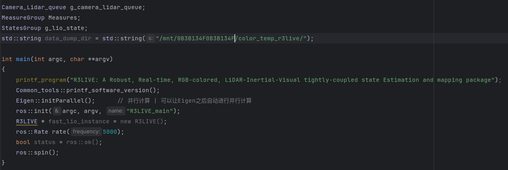
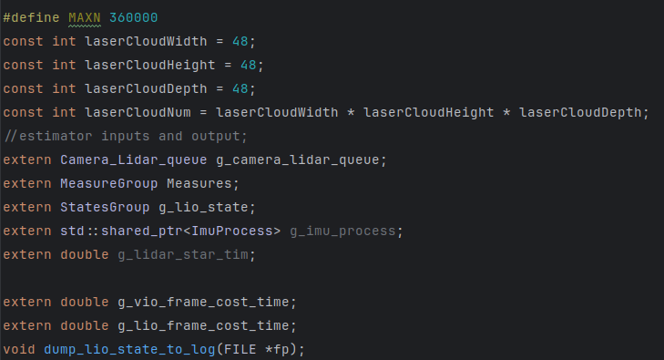

[TOC]

# Cpp

## 栈与队列

- 栈一般不认为是一种基础的数据结构，**栈是以底层容器完成其所有的工作，对外提供统一的接口，底层容器是可插拔的（也就是说我们可以控制使用哪种容器来实现栈的功能）。**stack栈可以由双向队列deque或者vector来实现。


容器

- 序列式容器（Sequence containers），此为可序群集，其中每个元素均有固定位置—取决于插入时机和地点，和元素值无关。如果你以追加方式对一个群集插入六个元素，它们的排列次序将和插入次序一致。STL提供了三个序列式容器：向量（vector）、双端队列（deque）、列表（list），此外你也可以把 string 和 array 当做一种序列式容器。
- 关联式容器（Associative containers），此为已序群集，元素位置取决于特定的排序准则以及元素值，和插入次序无关。如果你将六个元素置入这样的群集中，它们的位置取决于元素值，和插入次序无关。STL提供了四个关联式容器：集合（set）、多重集合（multiset）、映射（map）和多重映射（multimap）。


### 单调队列


****


std::atomic 原子类型 适用于多线程的情况，可以不使用显式的互斥🔓。

其实就是定义的一个变量，多线程的时候，每一个线程都能去使用这个变量值，读数据或者更改数据的时候还不用加锁 | 或者是主线程中更改这个原子值，让其他子线程停止while循环，退出。

PS: 使用的时候需要注意链接库文件Threads::Threads以及find_package(Threads REQUIRED)

```cpp
#include <iostream>
#include <thread>
#include <atomic>
#include <vector>

std::atomic<int> counter(0);

void increment_counter(int num_iterations) {
    for (int i = 0; i < num_iterations; ++i) {
        ++counter; // 原子操作，线程安全
    }
}

int main() {
    const int num_threads = 10;
    const int num_iterations = 1000;

    std::vector<std::thread> threads;
    for (int i = 0; i < num_threads; ++i) {
        threads.emplace_back(increment_counter, num_iterations);
    }

    for (auto& thread : threads) {
        thread.join();
    }

    std::cout << "Final counter value: " << counter << std::endl;

    return 0;
}
```

在实际使用中多线程还需要注意的一个部分就是上锁 - 即对于需要重复读取的数据需要上锁进行限制, 我发现有时候锁是定义在全局变量中的,有时候这个锁是定义在类的成变量中的。 **但是不论怎么定义,对于同一个数据,其对应的锁就只能是同一个(即对应的mutex的变量应该是同一个)**。 对于类中的成员函数，其中可能使用多线程来并行加速计算，这样就会使用定义在类中的锁进行控制 | 正好可以在ImMesh中的程序来佐证


****


.h文件中extern变量进行导入 | 在main.cpp对变量进行定义

但是如果变量定义在.h文件中，如果其他部分都include这个.h文件，这样就会导致变量的重复定义。所以一般定义在mian.cpp中，这样就不会导致重复定义。在这个.h中对应的函数中按顺序使用这些变量即可。


- main函数



- .h函数 中extern获取这些变量定义，在自己的成员函数中使用。 相当于在extern中只会实现




**inline** 

其可以用于修饰一个函数，这样可以让这个函数定义放在头文件中，但不用担心其违背一次定义原则 | 编译器会自动将多次的定义转换成一次


****


## 智能指针

智能智能放在中一直出现问题

首先全局的代码即不是放在堆上面，也不是放在栈上面的，其中声明变量的生命周期从程序开始到程序结束(这里还是很有可以看的部分)


## Eigen

Eigen本身就是一个C++的矩阵库，但eigen库中竟然是按列存储的方式。

C++数据转换到Eigen时(Eigen::Map)，要注意，Eigen默认按列优先存储。列优先因为存储位置相邻会比行优先更快些。注意：当用输入运算符<<时，都是一行一行输入，不管该矩阵是否是指定的行优先还是列优先.


## 补充

### 逆波兰表达式

一般我们使用的(1+2)*(3+4)这种表达式属于是中缀表达式，波兰表达式与逆波兰表达式是去掉括号也不会引起歧义的表达式，尤其是对于逆波兰表达式来说，特别适合栈来处理(碰到数就入栈，碰到运算符就弹出两个数进行计算)。

https://www.zhihu.com/question/41103160

- 逆波兰表达式对于计算机来说是方便的，处理起来巨方便。


## .hpp文件

.hpp文件在cmakelists.txt中只需要手动include文件目录即可，不需要手动使用add_library的形式将.h文件对应的.cpp文件进行打包(不需要)


而且我还看到了在hpp文件里面对类的成员函数进行定义(但是这里在使用上应该与.hpp还是.h文件都没有关系)

1是编译器的唯一命名规则，就是inline函数,class和模板类函数被多次包含的情况下，在编译的时候，编译器会自动把他们认为是同一个函数，不会发生二次定义的问题。前提是他们一模一样。

2是编译器会把class里面定义的函数当做inline函数，所以直接在类里面实现函数的定义没有关系。由上面的说明，他不会发生二次定义的问题。

3一般函数的声明和实现分开，在编译的时候，声明可以无数次，但是定义只能一份，只会生成一份函数的.obj，所以有函数调用的地方，编译器必须在调用的地方先保持现场，然后在花点时间去调用函数，然后回来，恢复现场。所以函数在头文件中实现，如果被包含二次。函数的实现就被编译了2次，如果单独写在一个.cpp中间，自然就编译成为一份.obj，不会产生二义性的问题。

3.inline函数在编译的时候直接复制在有该函数的地方，在空间上有消耗，但是在省去了时间上的消耗，是一个模板函数。也就是说在有这些函数的地方都不需要去调用函数，也就不涉及有2种函数可以调用产生的二义性问题。


lambda表达式


## hash


hash表使用的一个数据结构就是unorder_map，给定一个键值对，找到对应位置存放的数据。如果键值要使用自定义的数据类型的时候，就需要手动实现 

- 数据类型的定义
- hash函数的定义


```CPP
class VOXEL_LOC
{
  public:
    int64_t x, y, z;
    VOXEL_LOC( int64_t vx = 0, int64_t vy = 0, int64_t vz = 0 ) : x( vx ), y( vy ), z( vz ) {}
    bool operator==( const VOXEL_LOC &other ) const { return ( x == other.x && y == other.y && z == other.z ); }
};

// Hash value
namespace std
{
template <>
struct hash< VOXEL_LOC >
{
    int64_t operator()( const VOXEL_LOC &s ) const
    {
        using std::hash;
        using std::size_t;
        return ( ( ( ( s.z ) * HASH_P ) % MAX_N + ( s.y ) ) * HASH_P ) % MAX_N + ( s.x );
    }
};
} // namespace std
```

但是我现在觉得这种使用起来比较神奇 : Hash_map_3d在这里是一个模板类，int以及Triangle_ptr都是指定模板类型，下面的int完全不是hash表里面的key值, 真正的hash表是这个类自己的成员变量

Hash_map_3d< int, Triangle_ptr >        m_triangle_hash;


