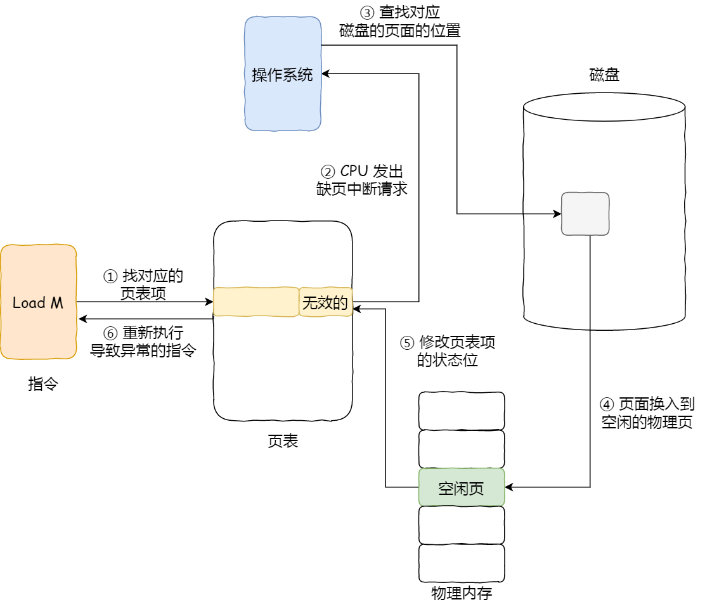
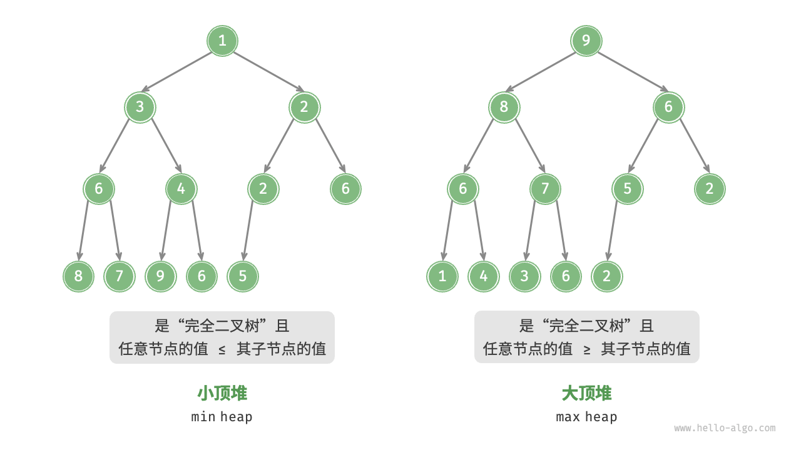

[TOC]


# Cpp八股

## C++内存

堆/栈/全局(静态)存储区/代码存储区

- 栈: 编译器自动分配回收

- 堆: 自行new/delete 容易忘记 故可以使用智能指针

- 全局(静态): 放置全局变量或者static定义的变量 - 这里对应变量的生命周期为整个程序运行期间 | 静态局部变量也是在这里保存。**但是编译期中能确定的全局const或者const static应该在常量区！！！**

- 常量区: 用于保存一些字面值与在编译期就能确定的常量 (部分const变量以及constexpr修饰的变量)

  - 这里说的常量是一些**字面值**，用const修饰的那些常量本质上应该属于是变量！！
  - 实际上只会保留一些字符的字面值会常量区，其他常量会直接优化到代码区

- 代码区: 代码区就是存放从硬盘中编译好的二进制代码

  ```cpp
  % '\041' 即为字面值
  char a = '\041';
  const char b = a; % a才属于是常量 看是全局还是局部变量决定其所在的位置
  ```


## 头文件/源文件

- 一个C++项目实际上是由**头文件以及源文件**组成的。在程序编译的时候，每一个源文件单独进行编译形成目标文件，对于不是在这个源文件中定义的部分是在链接阶段与其他文件链接起来 (假设该函数或者变量是在其他源文件中定义的，该文件想使用只需要进行声明，也就是使用#include引入头文件)
  - 在文件 a.cpp 中定义了一个全局函数 "void a(){}"，而在文件 b.cpp 中需要调用这个函数。即使这样，文件 a.cpp 和文件 b.cpp 并不需要相互知道对方的存在，而是可以分别地对它们进行编译，编译成目标文件之后再链接，整个程序就可以运行了
  - **避免重复定义：** 如果头文件中包含定义部分，这个头文件被多个源文件使用的话，就会导致一个变量或者其他部分被多次定义。
  - **避免多次include同一个头文件：**其主要是针对一个源文件，多次include同一个头文件会导致代码重复


- **头文件中的定义(特例)**
  - 头文件中可以写内联函数（inline）的定义。**由于inline函数会在编译的时候补充到调用该函数的部分**。所以在每一个源文件都需要知道内联函数的定义，这跟其他普通函数完全不一样。所以C++规定，inline函数可以在程序中定义多次。
  - 头文件中可以写类（class）的定义。**一般的做法是，把类的定义放在头文件中，而把函数成员的实现代码放在一个 .cpp 文件中**。但是如果想将函数成员写入类中也是可以的，即在 C++ 的类中，如果函数成员在类的定义体中被定义，那么编译器会视这个函数为内联的，等同于inline函数进行操作。但是要注意**如果把函数成员的定义写在类定义的头文件中，而没有写进类定义中，这是不合法的，因为这个函数成员此时就不是内联的了。**
    - 类的定义
    - 类的声明


- PS：static 成员变量并不限制仅本文件可见，所以如果头文件包含对于static成员变量定义的话，会直接未必一次定义原则，故static成员变量不能放在头文件中定义


## 模板类/常规类

- 模板类：这种模板本质上是一种代码蓝图，但是对于编译器来说，要想进行编译是需要明确类型的。当你在代码中使用 `Box<int>` 时，编译器必须能够看到模板的**完整定义**（包括成员函数的实现），才能为 `int` 类型生成实际的类代码。如果模板的成员函数定义在 `.cpp` 文件中，其他源文件（如 `main.cpp`）在编译时无法看到这些定义，导致**链接错误**。

  - 如果只存在模板类，编译器是不会去编译这部分内容的，编译必须要明确类型才能编译！！！

  ```cpp
  // Box.h（声明）
  template <typename T>
  class Box {
  public:
      Box(T value);
      T getContent();
  private:
      T content;
  };
  
  // Box.cpp（实现）| 这里是完全不知道目前要使用int类型的
  template <typename T>
  Box<T>::Box(T value) : content(value) {}
  
  template <typename T>
  T Box<T>::getContent() { return content; }
  
  // main.cpp（使用）
  #include "Box.h"
  int main() {
      Box<int> intBox(42); // 编译器看不到 Box<int> 的实现！
  }
  ```

- 常规类：主要是进行定义以及声明的一个区分，一般来说还是声明在.h文件，定义在一个.cpp文件中，其他.cpp想使用就直接include这个头文件


## C方法 (malloc/memset/memcpy)

- memset：给内存直接赋值，`memset` 的功能是**逐字节设置内存值**，无论 `buffer` 指向的数据类型是什么。它的行为可以总结为：

  - **按字节操作**：将 `buffer` 指向的内存区域的**前 `count` 个字节**，每个字节的值设置为 `ch` 的**低 8 位**（即 `ch & 0xFF`）。
  - **无视数据类型**：不关心 `buffer` 是 `int` 数组、`char` 数组还是其他类型，只是机械地按字节填充。

  ```cpp
  // buffer：为指向一片内存空间的指针（任意类型）
  // ch: 要被设置的值。该值以 int 形式传递
  // count：被设置为该值的字节数
  void *memset(void *buffer, int ch, int count)
  ```

- memcpy：给一块内存拷贝另一块内存的数据


## 智能指针

shared_ptr | weak_ptr | unique_ptr

- unique_ptr 保证指针独自占用一块内存

- shared_ptr 即利用一块引用计数来判断是否需要删除这块内存。**注意循环引用！！**

  ```cpp
  #include <memory>
  class A {
  public:
      std::weak_ptr<A> ptr; // 使用 weak_ptr 替代 shared_ptr
  };
  
  int main() {
      auto a1 = std::make_shared<A>(); // a1.ref_count = 1
      auto a2 = std::make_shared<A>(); // a2.ref_count = 1
  
      a1->ptr = a2; // a2.ref_count 仍为 1（weak_ptr 不增加计数）
      a2->ptr = a1; // a1.ref_count 仍为 1
  
      return 0;
  } // main 结束时，a1 和 a2 的引用计数归零，内存释放！
  ```

- weak_ptr 即保证其指向这块内存不会改变其对应的引用计数，就是使用时需要调用lock()转换成为shared_ptr使用


### 实现原理

- 对于shared_ptr而言，其要求这个类中既要保留一个指向数据内容的指针，还有一个指针要保留引用计数等数据。**后者就是使用一个控制块指针来实现的**。

  - 创建使用make_shared<T>()的方式要更加方便，一次操作就可以完成操作

  ```cpp
  /////////////////////////////////////////////////
  // 先创建对象指针(new), 然后再单独创建控制块指针
  auto ptr = new MyObject();
  std::shared_ptr<MyObject> sp(ptr); // 控制块单独分配
  /////////////////////////////////////////////////
  auto sp = std::make_shared<MyObject>();
  ```

  - 关于shared_ptr的实现原理:
    - 强引用计数与弱引用计数 —— 两者都被保留在控制块内存中，并且其都是**线程安全的原子类型**
      - 当强引用计数 shared_count 为 0时，释放指向对象的内存
      - 当弱引用计数 weak_count 为0 并且强引用计数为0时，才会释放掉控制块的内存
      - 注意: 因为weak_ptr是类似与"观察者"身份出现，其是不会影响指向对象的生命周期的，weak_count != 0 但是 shared_count = 0时，是没有办法再访问对象了(其已经被释放掉了，但是控制块仍然保留)

  ```cpp
  template<typename T>
  struct control_block {
      std::atomic<long> use_count;
      std::atomic<long> weak_count;
      Deleter deleter;
      T* ptr; // 仅当控制块与对象分离时存在
  };
  
  template<typename T>
  class shared_ptr {
      T* ptr;                // 指向实际对象
      control_block<T>* ctrl; // 指向控制块
  
      // 析构逻辑示例
      ~shared_ptr() {
          if (ctrl && ctrl->use_count.fetch_sub(1) == 1) {
              ctrl->deleter(ptr);     // 销毁对象
              if (ctrl->weak_count == 0) {
                  delete ctrl;       // 释放控制块
              }
          }
      }
  };
  ```

  

  - **误区：**引用计数并不是一个static类型，这样的话就会出现两个指针指向的对象不相同，但是由于其类型相同，其共享了这个引用计数


### 线程安全

- 一个对象是否是线程安全的，主要是要看这部分的对象是否是能否解决多线程同时访问时出现的问题 (不能在一个线程写的时候另一个线程又来写)
  - **shared_ptr 其指向的对象并不是线程安全的，但是其对应的引用计数是线程安全的** | 即引用计数表示存在多少指针指向这部分内存，**其是一个原子变量，故线程安全！！！**


### 原子变量

- 原子变量其对应的数据是线程安全的，其对应的操作在执行期间不会被其他线程打断，保证了这个操作要么指向要么不执行，一旦执行修改的值立刻对其他线程可见。


### 使用

- **注意这里智能指针指向的对象一般是堆上的内存开辟的，毕竟智能指针是利用RAII来安全管理数据，如果其保留在栈上，系统本身就可以自动管理**

  ```cpp
  std::unique_ptr<int> ptr = std::make_unique<int>(42);
  
  std::shared_ptr<std::vector<int>> data = 
  std::make_shared<std::vector<int>>(100);
  ```


## RAII 

- 所谓的RAII，从其对应的英文字符上就可以判断出来，资源获取即是初始化(resource acquisition is initialization) | Resource Acquisition Is Initialization（RAII）是C++中管理资源的重要范式。该模式的核心思想是**将资源获取与对象生命周期绑定，通过构造函数获取资源，析构函数释放资源**。这种机制可以确保即使在异常发生时，资源也能被正确释放
  - 很简单的例子就是智能指针与互斥锁
    - 如果通过new与delete手动开辟堆上面的内存, 很容易出现开辟但是忘记释放，可以使用智能指针解决这种问题。
    - 互斥锁即多线程中应该使用一个mutex变量调用lock()与unlock()来控制资源只能同时被一个线程进行修改，如果忘记释放也会导致死锁问题，故可以使用lock_guard()与unique_lock()解决


## 互斥锁

- C++标准库提供了**两种基于RAII的锁管理类：lock_guard和unique_lock。**理解它们的区别对编写高效、安全的并发代码至关重要

  ```cpp
  // 常规上锁:
  std::mutex mtx;
  void safe_increment() {
      mtx.lock();
      // 临界区操作
      mtx.unlock();
  }
  ```

  - lock_gurad 相当于是非常简单的锁使用，只是没有想到其是一种类对象，其声明时相当于上锁**(调用构造函数)**，生命周期结束即可以认为解锁**(调用析构函数)**，比前者更加安全。**lock_guard 最适合在明确定义的作用域内进行简单的锁管理, 使用非常简单**。注意下其这个lock_guard类对应的构造函数以及析构函数，其构造函数直接上锁，析构时释放锁。

  ```cpp
  std::mutex mtx;
  void safe_access() {
      {
          std::lock_guard<std::mutex> lock(mtx);
          // 临界区操作
      } // 自动解锁
      // 其他非临界区操作
  }
  ```

  ```cpp
  // 类对象直接创建使用
  template<class Mutex>
  class lock_guard {
  public:
      explicit lock_guard(Mutex& m) : mutex(m) {
          mutex.lock();
      }
      
      ~lock_guard() {
          mutex.unlock();
      }
      
      lock_guard(const lock_guard&) = delete;
      lock_guard& operator=(const lock_guard&) = delete;
  
  private:
      Mutex& mutex;
  };
  ```

- unique_lock 是C++中更加高级的锁管理器。相比于lock_guard，其可以延迟加锁、定时加锁与尝试加锁，并且可以转移锁的控制权。

  - 其在声明的时候，可以选择当前不获取锁，后续可以手动上锁或者使用一个定时器延迟一段时间之后上锁
  - 甚至其可以作为函数的返回值进行返回，相当于将这个锁继续后续使用，即延长了这个锁的使用时间，在最后析构的时候，其仍然会自动解锁。

  ```cpp
  int n;
  std::mutex some_mutex;
  
  void prepare_data()
  {
      cout << n++ << endl;
  }
  
  void do_something()
  {
      cout << n++ << endl;
  }
  
  std::unique_lock<std::mutex> get_lock()
  {
      std::unique_lock<std::mutex> lk(some_mutex);//与lock_guard相同，构造时获取锁
      cout << "owns_lock? " << lk.owns_lock() << endl;//1
      prepare_data();
      return lk;
  }
  
  int main()
  {
      //unique_lock基本使用
      std::mutex mutex2;
      std::unique_lock<std::mutex> lock2(mutex2, std::defer_lock);//告诉构造函数暂不获取锁
      cout << "owns_lock? " << lock2.owns_lock() << endl;//0
      lock2.lock();//手动获取锁
      std::cout << "owns_lock? " << lock2.owns_lock() << endl;//1
      lock2.unlock();//手动解锁
      cout << "owns_lock? " << lock2.owns_lock() << endl;//0
      //锁所有权转移到函数外部
      std::unique_lock<std::mutex> lk(get_lock());//
      do_something();
  }
  //析构
  //lock2未获取锁mutex2，因此不会调用unlock
  //lk对象持有锁some_mutex，调用unlock
  
  ```

  


## static 静态

- 对于局部变量: 增强了变量的生命周期，但是不会影响作用域 (注意其对应的内存地址会从栈变成静态存储区中)

  - **看看下面的例子，注意使用！！**

  

- 对于全局变量：静态全局变量的作用域为这个源文件中！！ 不可以像普通的全局变量使用extern之后，可以在其他源文件中使用。**类似的操作就是使用局部匿名空间来定义全局变量，此时这个全局变量也只能在这个源文件中使用，避免了其他源文件中有相同名字的变量导致冲突。**

  ```cpp
  void func() {
      static int count = 0; // 静态局部变量(注意这里只有第一次使用的时候才会初始化，之后就只剩下赋值了!!)
      count++;
      std::cout << count << std::endl;
  }
  
  int main() {
      func(); // 输出 1
      func(); // 输出 2（保留上一次的值）
      // std::cout << count; // 错误！count 的作用域仅在 func 内部
      return 0;
  }
  
  -----------------------------------------------------
  // 文件 A.cpp
  int global_var = 42;         // 普通全局变量（外部链接）
  static int static_var = 100; // 静态全局变量（内部链接）
  
  // 文件 B.cpp
  extern int global_var;       // ✅ 合法，链接到 A.cpp 的 global_var
  extern int static_var;       // ❌ 链接错误！static_var 仅在 A.cpp 可见
  ```

- 普通函数：static修饰的函数同样只能在该源文件中使用，不能在其他源文件中使用。由于C++是从上向下的编译过程，所以这里static函数虽然只能在这个源文件中使用，我们还是需要将其放在最前面定义比较好。

    - **普通函数使用static的好处在于static修饰的函数只能在这里源文件中使用，多个文件同名的static函数之间并不会有冲突。而普通的函数，默认是extern的，也就是说它可以被其它代码文件调用**

    ```cpp
    #include <stdio.h>
    static void bar() {  // ✅ 直接将 bar() 提前定义
        printf("Hello from bar()\n");
    }
    
    void foo() {
        bar();  // ✅ OK，因为 bar() 已经被定义
    }
    
    int main() {
        foo();
        return 0;
    }
    ```

- 类中使用的静态成员变量/函数：static 修饰类中变量或者函数时，其作为该类实例化对象共有的部分。**静态成员变量需要在类外单独定义！！或者在类的构造函数中直接定义(类内定义只能static const才可以，只有一个static不行)**

  - 类的静态成员变量是该类所有的对象共同拥有的类对象，并不是不能修改!!

  ```cpp
  // 头文件 MyClass.h
  class MyClass {
  public:
      static int static_var; // 声明（未定义）
  };
  
  // 正确：在 MyClass.cpp 中定义
  // 文件 MyClass.cpp
  #include "MyClass.h"
  int MyClass::static_var = 42; // ✅ 正确且唯一的定义(注意这里并没有实例化这类)
  
  // 错误：在多个源文件中定义
  // 文件 Another.cpp
  #include "MyClass.h"
  int MyClass::static_var = 100; // ❌ 重复定义，链接错误！
  ```

  ```cpp
  class MyClass {
  public:
      static const int static_const_var = 100; // ✅ 类内初始化（无需类外定义）
  };
  ```

- 注意： **类中的static函数只能访问static的成员变量**

  


## inline函数

inline函数主要是直接将函数插入到被调用部分。对于需要被频繁调用的函数，通过该操作提升性能。

- inline 如果只放在函数声明的部分是没有作用的，只有直接写入在函数的定义部分前才能声明一个内联函数

  ```cpp
  inline int functionName(int first, int secend,...) {/****/};
  ```

- inline函数在多个源文件中使用，需要保证多个多源文件中inline函数的定义全部相同。inline函数本身的可以作用域就是整个Cpp项目，所以需要保证多个源文件中的Inline函数定义完全相同，或者使用static inline函数来单独在一个源文件使用

- **在实际使用中一般会将小函数定义成为inline函数 (与调用这个函数本身相比，这个函数本身的执行过程所需要时间更短)**


## const与constexpr 

- const表示变量会是一个常量，而constexpr表示其修饰的是一个常量表达式。简单而言 const修饰的变量可以在运行期确定(也可以是编译期就确定)，**但是对于constexpr修饰的变量或者函数必须在编译期就确定下来，并且const并没有办法修饰函数**。

  ```cpp
  int getRuntimeValue() { return 42; }  // 普通函数，运行时计算
  
  int main() 
  {
      const int a = 10;            	 // ✅ 编译时常量（用字面量初始化）
      const int b = getRuntimeValue(); // ✅ 运行时常量（通过函数返回值初始化）
      const int c;                 // ❌ 错误！必须初始化
  }
  
  constexpr int getCompileTimeValue() { return 42; }  // constexpr 函数
  int main() 
  {
      constexpr int a = 10;                      // ✅ 编译时常量
      constexpr int b = getCompileTimeValue();   // ✅ 编译时调用函数
      constexpr int c = getRuntimeValue();       // ❌ 错误！函数非 constexpr
  }
  ```

- 关于const修饰的对象需要声明的时候就进行初始化

  ```cpp
  int x = 1;      // 普通变量，可以被修改
  const int y = x; // const 变量，值被初始化为 x 的值，之后不能被修改
  ```

- 指针常量与常量指针

  - 常量指针(const int* ptr )即指向一个常量的指针，不可以通过该指针对指向对象的值进行修改。
  - 指针常量(int* const ptr)即指针为一个常量，不可以改变指针的指向。
  - 指针常量与常量指针的结合(const int* const ptr) ptr的指向与ptr指向的变量都不可以被修改

  ```cpp
  const int getConstValue() {
      return 100;
  }
  
  int main() {
      int x = getConstValue(); // 正确：可以复制 const 值
      // getConstValue() = 200; // 错误：不能修改 const 临时对象
      return 0;
  }
  ```

- const 成员函数

  - const 成员函数是指在**类的成员函数声明和定义**后加上 const 关键字，表示该函数不会修改对象的状态(即不会修改对象的任何的非mutable成员变量)

  ```cpp
  class MyClass {
  public:
      int value;
      MyClass(int val) : value(val) {}
  
      // const 成员函数
      void printValue() const {
          // value = 100; // 错误：const 成员函数不能修改成员变量
          std::cout << "Value: " << value << std::endl;
      }
  
      // 非 const 成员函数
      void setValue(int val) {
          value = val;
      }
  };
  
  int main() {
      MyClass obj(10);
      obj.printValue(); 			// 正确：调用 const 成员函数
      const MyClass constObj(20);
      constObj.printValue(); 		// 正确：const 对象只能调用 const 成员函数
      // constObj.setValue(30); 	// 错误：const 对象不能调用非 const 成员函数
      return 0;
  }
  ```

- 关于类对象被声明成const之后，其只能调用const成员函数。**这个对象在初始化的时候对应的类成员变量就不能再修改(只有被mutable修饰的成员变量才能被修改)**。这里考虑到安全性设置的定义。当然普通的类对象也可以包含const成员函数，也可以调用其他的非const成员函数。

  ```cpp
  class MyClass {
  public:
      int x;
      mutable int y; // mutable 成员，允许在 const 对象中修改
      void modify() { x = 10; }        // 非 const 成员函数
      void read() const { /* ... */ }  // const 成员函数
  };
  
  // 定义 const 类对象
  const MyClass obj;
  ```

- 类的const成员变量要通过类的列表初始化直接定义

  ```cpp
  #pragma once
  class CConst
  {
  public:
  // 在初始化列表初始化const成员函数
      CConst(void): iValue(200)
      {
          // error
          // iValue = 300;
      }
  ~CConst(void);
  private:
      // const 成员变量
      const int iValue;
  };
  ```


## mutable

- 只能用在类中使用，被其修饰的变量可以被const成员函数进行修改 | **这里未必一定是在修饰const成员变量，只要是一个成员变量都能被mutable修饰**

  ```cpp
  class Time 
  {
  	public:
  		int hour;
  		int minute;
  		mutable int second;
  	public:
     		void noone() const{
  			second = 12;//正确
  			hour = 11;//报错
  		}
  };
  
  ```


## volatile

- 标记一个变量，后续编译器对访问该变量的代码不再进行优化，从而可以提供对该变量对应地址的稳定访问。**该关键值主要是在跟嵌入式相关的代码中使用比较多，硬件中还是会直接访问地址的操作还是比较多的。**
  - 参考: https://www.runoob.com/w3cnote/c-volatile-keyword.html


## 函数的值传递/引用传递/指针传递

- 值传递 - 形参相当于是在栈中开辟了一块内存来copy一份实参数据。形参修改与实参无关

- 引用传递 - 引用就是一种类型别名，其也是在栈中开辟一块内存用于保留形参，但是这个形参是对应实参的内存地址

- 指针传递 - 同样也是对应实参的内存地址

  - 指针与引用传递之间的区别为 指针可以随意更换指向的对象，但是引用不能不进行初始化，一旦进行初始化之后就无法更改指向对象。

  ```
  // 补充C++函数中经常使用的常量引用 - 避免通过引用修改引用对象的值
  void readData(const vector<int> &data) {  // 避免拷贝，且不能修改 data
      // 只能读取 data
  }
  ```

- **注意突出形参是否能进行修改，值传递并没有修改形参，后续两种方式都没有办法修改形参**


## 函数重载/重写/重定义

- **函数重载**

  - 函数形参的类型、数量以及顺序不同均可以构成重载，但是要保证**函数名相同**
  - 函数的返回值是否相同在函数重载中并不关心
  - 函数重载在实际使用中通过隐式转换寻找匹配的函数对象

  ```cpp
  void func(int a); // ok
  void func(char a); // ok
  void func(char a,int b); // ok
  void func(int a, char b); // ok
  char func(int a); // error 与第一个函数有冲突
  ```

- 函数重写

  - 函数重写相当于是实现多态的一种手段，通过首先定义的基类，在派生类中对基类函数进行重写。**类似的实现逻辑是direct_visual_lidar_calibration中用一个相机基类，派生类中实现多种相机模型的功能。**
  - **要求返回值，参数列表什么的都⼀定要完全相同(这里与函数重载完全不同)**

  ```cpp
  class Base {
  public:
      virtual void show() {  // 声明为虚函数
          std::cout << "Base class show" << std::endl;
      }
  };
  
  class Derived : public Base {
  public:
      void show() override {  // 重写基类的虚函数
          std::cout << "Derived class show" << std::endl;
      }
  };
  ```

- 函数重定义

  - 派⽣类重新定义⽗类中相同名字的非virtual 函数，参数列表和返回类型都可以不同。即⽗类中除了定义成 virtual 且**完全相同的同名函数**才不会被派⽣类中的同名函数所隐藏

​    

### C++函数重载

- C中没有函数重载

- C++的函数重载虽然函数名是相同的，但是重载函数中不同的形参是会影响函数编译之后的符号名。虽然重载函数名称相同，但是其对应的符号名都是唯一的。

  ```cpp
  void foo(int);    // 可能修饰为 _Z3fooi
  void foo(double); // 可能修饰为 _Z3food
  ```
  
  


## 指针/引用

- 野指针与悬空指针
  - 野指针 - 未进行初始化的指针
  - 悬空指针 - 指向已释放内存的指针

- 函数指针：同样是一种指针变量，但是其指向的对象是一个函数，在使用的时候需要手动指定这个函数指针所包含的参数

  > 返回类型 (*指针变量名)(参数列表);

  ```cpp
  int add(int a, int b) {
      return a + b;
  }
  
  int (*funcPtr)(int, int);  // 声明一个函数指针，指向返回类型为int、参数为两个int的函数
  funcPtr = add;  // 将函数指针指向 add 函数
  
  int result = funcPtr(3, 4);  // 通过函数指针调用 add 函数
  std::cout << "Result: " << result << std::endl;  // 输出：7
  ```
  
- 引用

  - **在使用引用中, 在定义的时候需要直接指定好对象，后续不可以修改 (这里与指针不一样)**

  ```cpp
  int a = 10;
  int& ref = a;   // 正确：引用绑定到变量a
  int& invalidRef; // 错误：引用未初始化，编译失败
  
  int a = 10, b = 20;
  int& ref = a;
  ref = b; // 实际是将a的值改为20，而非让ref指向b！
  ```

  - 引用中注意引用对象生命周期是否结束

  ```cpp
  int& createDanglingRef() {
      int local = 42;
      return local; // 返回局部变量的引用，函数结束后local被销毁
  }
  int& badRef = createDanglingRef(); // badRef是悬空引用
  std::cout << badRef; // 未定义行为！
  ```

  


## 堆空间分配 

new malloc delete free，其中new与delete是C++新引入的部分，malloc与free是C中使用的部分。

### malloc/free

- malloc：

  - malloc 需要手动确定需要分配的字节数，并返回指向这块内存的指针
  - malloc 的返回类型为void*, 需要手动转换其类型

  ```cpp
  void *malloc(long NumBytes);
  int *p = (int *) malloc(sizeof(int) * length);
  ```

  - 实际分配的内存是虚拟内存而不是物理内存，在实际使用中会跟据**缺页中断**将物理内存分配给虚拟内存

- free：给定需要释放内存的首地址的指针，并释放内存。

  - free释放的是内存并不是指针，释放之后指针变成悬空指针
  
  - 对一块内存多次调用 free与delete会导致**重复释放**
  
  - **既然malloc使用的时候需要指定的字节数量，为什么free不需要指定释放的字节数量**
  
    - 因为malloc实际分配的大小是要超过malloc所申请的内存大小的，编译器会在malloc申请的内存块附近储存的额外的元数据，这些元数据会保留分配的内存块大小等信息。这些元数据通常存储在用户请求的内存块的前面（或后面），形成一个“头部”（header）。例如，一个 `malloc(100)` 的实际内存分配可能如下所示：
  
    ```
    | 元数据（例如 16 字节） | 用户实际使用的 100 字节 |
    ```
  
    - free函数会将指针往前移动去寻找这个元数据对应的内存，然后决定释放几个字节的内存 
  
    ```cpp
    void free(void *ptr) 
    {
        struct mem_control_block *free;
        free = ptr - sizeof(struct mem_control_block);
        free->is_available = 1;
        return;
    }
    ```
  
    ```cpp
    #include <iostream>
    int main() {
        // 动态分配一个 int 类型的内存
        int* ptr = new int(42);
        std::cout << "指针地址: " << ptr << ", 值: " << *ptr << std::endl;
        // 第一次释放内存
        delete ptr;
        std::cout << "第一次释放内存成功。" << std::endl;
        // 重复释放同一块内存（危险操作！）
        delete ptr;
        std::cout << "第二次释放内存成功。" << std::endl;
        return 0;
    }
    ```
  
    
  
  

### new/delete

- new的使用要比malloc方便很多，其会先分配一块内存，再为分配的内存调用一个或多个构造函数构建对象
- delete为将被释放的内存调用一个或多个析构函数并释放内存(通过operator delete 函数)
  - 关于析构函数，调用析构函数实际上就可以为一个类释放其占用的资源，包括我动态分配给其的资源(堆内存)以及系统分配给其的资源，**析构函数一定不会释放内存！！！（内存是编译器自己干的事情，有堆内存与栈内存之间的区别）**。在调用delete或者是对象的生命周期结束的时候会自动调用析构函数进行资源的释放。


### 区别

- malloc/free是C/C++语言的标准库函数，new/delete是C++的运算符。它们都可用于申请动态内存和释放内存。但是new能够自动分配空间大小，而malloc需要计算字节数。
- 对于非内部数据类型的对象而言，光用malloc/free无法满足动态对象的要求。对象在创建的同时要自动执行构造函数，对象在消亡之前要自动执行析构函数。由于malloc/free是库函数而不是运算符，不在编译器控制权限之内，不能够把执行构造函数和析构函数的任务强加于malloc/free。
- new是类型安全的，而malloc不是
  - 这是由于new的实现中存在加锁机制，malloc作为早期的一种方法并没有加锁。


## 虚函数以及纯虚函数

- 虚函数/纯虚函数是实现多态的一种手段。**所谓多态：**是可以通过基类指针或引用可以直接调用派生类中重写的虚函数，但是不能调用派生类中的其他函数。

  - 在基类中使用**virtual**关键字表示，在派生类中使用**override**关键字
  - 包含虚函数对应的基类是可以实例化的，包含纯虚函数的基类不可以被实例化。

  - **在运行期中**，animal->speak() 才能确定被调用的哪一个派生类或者基类中的speak()函数

```cpp
class Animal 
{
public:
    virtual void speak() { 
        cout << "Animal sound" << endl; 
    }
};

class Dog : public Animal 
{
public:
    void speak() override {  // 重写基类虚函数
        cout << "Woof!" << endl; 
    }
};

int main() 
{
    Animal* animal = new Dog();
    animal->speak();  // 输出 "Woof!"（调用的是 Dog 的 speak）
    delete animal;
}
```

- 纯虚函数是在基类中声明的虚函数，它在基类中没有定义，但要求任何派生类都要定义自己的实现方法。在基类中实现纯虚函数的方法是在函数原型后加 **=0**
  - 包含纯虚函数的类没有办法被实例化， 只能成为一个抽象类。对应的派生类必须重写基类中的纯虚函数，否则会被直接当成抽象类，为下一层的派生类使用。
  - **override **关键字实际上可以表示目前在进行虚函数的重写，无论是纯虚函数还是普通的虚函数。override 都可以提供一种检查，即在重写的时候如果将函数写错，实际上编译器可能当在实现派生类的普通函数，加上override会提示编译器这是虚函数的重定义，函数名一定要一样。

```cpp
virtual void funtion1()=0;
```

```cpp
class Base {
public:
    virtual void virtualFunc() {}        // 普通虚函数
    virtual void pureVirtualFunc() = 0;  // 纯虚函数
};

class Derived : public Base {
public:
    void virtualFunc() override {}       // 重写普通虚函数
    void pureVirtualFunc() override {}   // 重写纯虚函数
};
```

​	


### 虚函数表/虚函数表指针

- 每一个包含虚函数的类都会有一个虚函数表，并且包含了一个指向虚函数表的指针。在调用虚函数时，需要通过虚函数表获取虚函数的函数指针再进行调用，故调用虚函数的效率会低一些。**对于非虚函数，其不会被保留在虚表中**

  

  - 对于派生类，其同样会保留一个虚函数表以及指向这个虚函数表的指针，并且这个虚函数表中保留的是指向虚函数的函数指针。在派生类中是会跟据其重写、补充或者继承的虚函数来修改其继承到的虚函数表。

    - 基类指针/引用调用派生类时，其访问的是这个派生类虚函数表，从而访问派生类虚函数实现多态。

    

  - 举例(这里的重写没有写明override，但实际上派生类还是对基类的函数进行了重写以及重定义 | 下图中的非虚函数B::func2()绘制错误，应为func1())

    ```cpp
    class A {
    public:
        virtual void vfunc1();
        virtual void vfunc2();
        void func1();
        void func2();
    private:
        int m_data1, m_data2;
    };
    class B : public A {
    public:
        virtual void vfunc1();
        void func1();
    private:
        int m_data3;
    };
    class C: public B {
    public:
        virtual void vfunc2();
        void func2();
    private:
        int m_data1, m_data4;
    };
    ```

    


- **补充: **经过虚表调用虚函数的过程称为动态绑定，其表现出来的现象称为运行时多态。

  - 为什么其在运行期才能确定而不是在编译期确定的

    - 虚函数调用不依赖编译期的具体类型，而是在运行期根据对象的实际类型查表调用。基类指针指向什么类型的数据就会调用该派生类的虚函数。

    ```cpp
    class Animal {
    public:
        virtual void speak() = 0;
    };
    
    class Dog : public Animal { void speak() override { /* ... */ } };
    class Cat : public Animal { void speak() override { /* ... */ } };
    
    int main() {
        int userChoice;
        cin >> userChoice;
        Animal* animal = (userChoice == 1) ? new Dog() : new Cat();
        animal->speak(); // 正确：运行期多态
    }
    ```

  - 为什么基类指针或引用不能直接调用派生类的非虚函数

    - 非虚函数不在虚函数表中，基类指针虽然可以指向一个派生类对象，但是由于其指针类型的限制，其只能访问基类中有的对象，所以只能访问派生类中重写的虚函数

  - 构造函数/析构函数/静态成员函数是否可以是虚函数

    - 构造不可以，虚函数表在类完成初始化之后才会被创建(实际上是初始化之间有顺序区别)
    - 析构可以，析构函数定义成虚函数，在基类指针指向派生类的时候，可以调用派生类的析构函数完成资源释放。
    - 静态成员不可以，静态成员函数里面并不包括this指针。虽然虚函数表对一个类而言只有一个，但是其需要通过this指针来调用这个类的成员函数。
    
  - 虚函数表以及虚函数表指针对应的内存位置：
  
    - 虚函数表指针是对每一个类的实例化对象都会包含的成员变量(会隐式定义一个)，所以其位置具体要看是在堆还是栈上定义这个类的实例化对象
    - **对于虚函数表因为其可以在编译的时候就确定这个虚函数表中对应的虚函数，所以其是一个只读常量，保存在常量区**。相当于这是一个所有的类实例化对象共有的量，类似于static成员变量，但是其不能修改，所以在常量区。


## 继承

继承即C++中一个类继承另一个类来实现功能。

- 一个类(派生类)可以继承多个类(基类)

- 继承方式可以有public, private以及protect三种，但是一般是只使用public

  ```cpp
  class derived-class: access-specifier base-class // 其中访问修饰符 access-specifier 是 public、protected 或 private 其中的一个
  ```

- **派生类可以访问基类中的成员函数以及变量(但具体需要看类的继承类型)。**

  - **虽然类的继承类型存在一些不同，但无论什么继承类型派生类都不能访问基类的private私有成员。**

  

- 派生类可以重写基类的虚函数以及纯虚函数 **(当然对于纯虚函数而言是必须实现)**

- **派生类**可以比基类中包含更多的成员变量以及成员函数

- 派生类中其余与基类名称相同的函数会覆盖基类中的同名函数，并且派生类中的同名函数在返回类型与参数列表上都可以与基类中的同名函数不一样。

  ```cpp
  #include <iostream>
  class Base
  {
  public:
  	virtual void print()
  	{
  		std::cout << "Base print" << std::endl;
  	}
  
  	void work()
  	{
  		std::cout << "Base do work..." << std::endl;
  	}
  };
  
  class Derived : public Base
  {
  public:
  	virtual void print()
  	{
  		std::cout << "Derived print!" << std::endl;
  	}
  	void work()
  	{
  		std::cout << "Derived do work..." << std::endl;
  	}
  };
  
  int main()
  {
  	Base* pBase = new Derived();
  	pBase->print();
  	pBase->work();
  	
  	getchar();
  	return 0;
  }
  
  ```

  - 这里pBase虽然是一个指向Base的指针, 但是通过 Base* pBase = new Derived() 其可以访问派生类Derived中对应的虚函数，可这里pBase->work();是无法调用派生类中对应的work()函数的，调用的还是自己基类中定义的work函数。当然可以使用dynamic_cast进行指针的转换，将基类指针转换成为派生类指针进行使用。
  - 派生类实际上可以不定义自己的work函数，直接使用基类中的work函数，即实现了继承。这里相当于是实现了派生类对基类函数的重定义


### 虚继承

- 解决多重继承中可能出现的问题，如下面中B,C类同时被D继承，导致最后在D中会包含了两种A中的数据，不仅冗余而且会有二义性的出现，对应的解决方法就是使用**虚继承**

  ```cpp
  class A {
  public:
      int data;
  };
  
  class B : public A {};  // 普通继承自A
  class C : public A {};  // 普通继承自A
  
  class D : public B, public C {}; // 多重继承自B和C
  ```

  ```cpp
  class B : virtual public A {}; // 虚继承自A
  class C : virtual public A {}; // 虚继承自A
  
  class D : public B, public C {}; // 多重继承自B和C
  ```

  

## pirvate/public/protected

在类中使用这三种修饰符互相之间的区别


## final 关键字

- 用于防止类中的虚函数被重写以及防止这个类被继承。

  ```cpp
  class Base final {
      // 类的实现
  };
  // 下面的代码会导致编译错误
  class Derived : public Base {
      // 编译错误：无法继承自 final 类
  };
  ```

  ```cpp
  class Base {
  public:
      virtual void func() final {  // 这个函数不能被重写
          std::cout << "Base::func()" << std::endl;
      }
  };
  
  // 下面的代码会导致编译错误
  class Derived : public Base {
  public:
      void func() override {  // 编译错误：无法重写 final 函数
          std::cout << "Derived::func()" << std::endl;
      }
  };
  ```

  


## Hash表


- Hash表中每个空位可以认为是一个**桶bucket (每一个桶中保留的是一个键值对)**，在hash表中查询操作(即Hash函数)，查找key值对应的桶位置，然后在桶中获取其对应的value。

  - 用于储存Hash表的结构 (即对应的桶的储存结构) 可以使用数组或者其他底层容器，如下图**使用一个数组来充当hash表的底层结构(桶数据被全部保存在桶中)**

    

  - **Hash冲突: **不同key值，但通过哈希函数后获取到的key值一样的，即输出索引一致导致的冲突(访问到了相同的桶位置处)

    - 负载因子：负载因子（load factor）是哈希表的一个重要概念，其定义为哈希表的元素数量除以桶数量，用于衡量哈希冲突的严重程度，**也常作为哈希表扩容的触发条件**。例如在 Java 中，当负载因子超过 0.75 时，系统会将哈希表扩容至原先的 2 倍。Hash表扩容是比较耗费时间的，需要将当前的所有元素都迁移至新的Hash表 —— 对于Hash表来说，存在冲突就进行扩容的方法是非常耗时的，所以引入了如下两种方法：
    - 链式地址

      - 将一个桶位置处只能储存一个键值对，将这里的单个元素转换成为了链表，即将发生Hash冲突的所有键值对都保存在同一链表中。但是由于链表是没有直接O(1)的查询操作的，所以在查找中会将链表遍历一边，其比较耗费时间

        
    
    
    
    
    - 开放寻址
      - 不引入额外的数据结构，而是通过多次探测来处理哈希冲突。探测方式主要包括线性探测、平方探测和多次哈希等。**其实就是在Hash函数计算出来的这个基本位置处，不断的向后继续查找**
        - 对于线性寻址，即在Hash函数计算处的结果处(定义为x)，剩下就是先查找 x + 1位置是否存在元素，没有元素就可以插入该元素，成为一个新的键值对。对于查找操作的话，这里就是不断的向后查找，如果先查找到空桶，就说明没有这个元素，可以直接返回。
        - 平方探测同理，只不过往后查找的从线性步长变为了平方步长。
      - **删除元素： **开放寻址中不能直接删除元素，因为删除带来的空桶会导致在查询中，如果找到空桶，系统就会自动返回或者直接在这个位置插入元素，导致一些元素本身在Hash表中但是不能被正确的查询到。
        - 对于删除元素可采用懒删除（lazy deletion）机制：它不直接从哈希表中移除元素，**而是利用一个常量 `TOMBSTONE` 来标记这个桶**。在该机制下，`None` 和 `TOMBSTONE` 都代表空桶，都可以放置键值对。但不同的是，线性探测到 `TOMBSTONE` 时应该继续遍历，因为其之下可能还存在键值对

### 使用

- unordered_map的使用 | 对于unordered_map<int, int>这种 如果insert的一个未出现过的元素(key值)，那么其对应的数据会自动定义成为0。

  - 初始化

    ```cpp
    // 基本声明
    std::unordered_map<std::string, int> umap;
    
    // 初始化列表（C++11+）
    std::unordered_map<std::string, int> umap = {
        {"Alice", 25},
        {"Bob", 30},
        {"Charlie", 35}
    };
    
    // 方法1：insert()
    umap.insert({"David", 40});
    
    // 方法2：emplace()（更高效，直接构造键值对）
    umap.emplace("Eve", 45);
    
    // 方法3：通过下标操作符[]
    umap["Frank"] = 50;  // 若键不存在，会创建新键值对
    ```

    

## explicit/noexcept/delete关键字

### explicit

- 防止类中进行隐式的构造函数调用，即防止了由于C++自身的隐式类型转换，导致调用其他的构造函数(从C++11开始，也可以作用在多参数的构造函数上)

  ```cpp
  class MyClass {
  public:
      explicit MyClass(int x) { 
          std::cout << "Constructed with " << x << std::endl; 
      }
  };
  
  int main() {
      // MyClass obj = 5;  // 错误：无法隐式转换
      MyClass obj(5);      // 正确：显式调用构造函数
      return 0;
  }
  ```

  ```cpp
  class Vec3 {
  public:
      explicit Vec3(int x, int y, int z) { /* ... */ }
  };
  
  void func(const Vec3& v) {}
  
  int main() {
      // func({1, 2, 3});  // 错误：explicit 禁止隐式转换
      func(Vec3{1, 2, 3}); // 正确：显式构造
      return 0;
  }
  ```

### delete

- 除去删除堆内存的操作，其在类中还可以禁止使用一些构造函数，即在函数的最后补充即可

  ```cpp
  HeapOnly(const HeapOnly&) = delete;
  ```

  

### noexcept

- noexcept 主要是用在移动构造函数跟移动语义重载的运算符上，其可以提示编译器正确使用移动语义构造而不是使用之前定义的拷贝构造函数

  ```cpp
  String(String&& other) noexcept : m_data(other.m_data), m_length(other.m_length)
  {
      cout << "Moving operation" << endl;
      other.m_data = nullptr;
      other.m_length = 0;
  }
  ```

  


## C++ 类型转换

### 隐式类型转换

#### Numeric promotions

- Integral promotion: 小整型转换成较大的整型

  - **signed char** or **signed short** can be converted to int;

  - **unsigned char** or **unsigned short** can be converted to int if it can hold(包括其所有的取值范围，没想到是使用hold) its entire value range, and unsigned int otherwise;

  - **char** can be converted to int or unsigned int depending on the underlying type: signed char or unsigned char (see above);

  - **wchar_t**, **char8_t** (since C++20), **char16_t**, and **char32_t** (since C++11) can be converted to the first type from the following list able to hold their entire value range: int, unsigned int, long, unsigned long, long long, unsigned long long (since C++11);

- Floating-point promotion: 

#### Numeric conversions

数值转换可能有数据精度的损失(整型与浮点型在计算机中的表示方式不一样)

- Integral conversion
- Floating-point conversion


### 显示类型转换

- C++经常使用的转换类型一般有四种，static_cast, dynamic_cast，const_cast以及reinterpret_cast类型之间的转换。**除去dynamic_cast是运行期确定的，其余都是编译期确定的**

  - static_cast : 基本类型之间的转换或者是**基类与派生类的指针或引用**之间的转换，可以进行向上转换以及向下转换

    - 向上转换是安全的 ，向上转换主要是派生类到基类的转换，由于派生类指向的对象是要多于基类的，使用指针或者引用的话，直接转换是安全的。
    - 向下转换是不安全的，因为基类指针可以指向派生类，但是也可以直接指向的基类，这种情况可以直接使用dynamic_cast进行分析

  - dynamic_cast : **多态类之间的转换，尤其是基类的指针或引用转换到派生类的指针或者引用**

    - 同样可以向上转换，与static_cast没有区别
    - 向下转换是安全的 —— 会进行安全检查，但是要求**基类必须包含虚函数**

  - const_cast : 用于去除常量性，但是其不会直接去除常量自身的常量性，去除的主要是其对应的指针或引用的常量性

    ```cpp
    const int a = 10;
    const int * p = &a;
    *p = 20;                  //compile error(p目前还是一个常量指针)
    int b = const_cast<int>(a);  //compile error(a的常量性不可以改变)
    ```

  - reinterpret_cast : 用于完全不相关变量类型的转换，比如从整形转换成为指针或者引用。


### 显式类型转换(这里还是不太明确)

Cpp的显示类型转换方式都会有一定的风险，所以能避免使用转换就避免掉，使用起来也要小心一些。

- static_cast<type>(expression) 将expression转换成type类型（**静态转换，即在编译期进行转换，不会影响到运行期** —— dynamic_cast是在运行期转换的，但安全性上要高于static_cast）。
  - 有一些转换也是做不到的 如"Hindoeiw"转换成int。（只要存在从expression 的类型到该 type 的隐式类型转换，那么static_cast这种方法基本就可以使用）
  - 对于一些隐式类型做不到的，该方法也可能可以做到。隐式类型转换不能将一个void* 的数据转换成int* ,可以通过static_cast<int*>(...) 进行转换。
  - 不能更改常量性（改变常量指针或者常量引用都不行）

```cpp
	int x = 3;
	int y = 4;
	std::cout<<3/4.0<<std::endl; // 一个常数除法，只需要其中一个是double，结果就是double类型
	std::cout<<(static_cast<double>(x)/y)<<std::endl;
```

- dynamic_cast —— 运行期中使用的类型转换，增加了安全性的判断
- const_cast —— 可以去除/增加常量性（但一定要注意去除常量性是一种很危险的行为，尤其是对一个const int类型的常量，使用const_cast去除指向其的指针或者对其的引用的常量性，来更改这个常量值——很危险）
- reinterpret_cast —— 重新解释（主要用于指针的重新解释上）
  - int指针改成double指针之后，指针解引用时会多读取本不属于int类型数据的四个字节(得到的结果很可能是错的)

```cpp
	int x = 3;
	int* ptr = &x;
	double* ptr2 = reinterpret_cast<double*>(ptr);
	std::cout<<*ptr2<<std::endl;
```

> [!CAUTION]
>
> **C类型显示转换： ** C类型（类似于 (double)a 这种 ）中的显示转换不太支持使用——因为在CPP中使用c类型的转换，系统还是会默认转换成const_cast、static_cast等方法来完成转换；而且如果直接使用C类型的转换，有可能系统中默认使用了reinterpret_cast这种方法，导致莫名其妙的错误。


## C++与C/Java之间的区别

- C++与C的区别 回答的方面有很多
  - 可以从面向过程(函数)还是面向对象来进行解释


- C++与Java的区别


## C++11新特征

- 自动类型推导 auto
- 智能指针
- RAII lock **锁封装**：相当于在之前锁的基础上(之前都是手动lock()与unlock())，这种可以自动释放锁
- std::thread: 管理C++多线程，锁是保护公共资源，线程是并行开发
- 右值引用：通过使用右值引用进而出现了移动语义与完美转发


## 深拷贝与浅拷贝

- **浅拷贝是指将一个对象的成员变量的值直接复制到另一个对象中**。对于基本数据类型（如`int`、`float`等），浅拷贝即实现直接赋值。然而，对于指针类型的成员变量，浅拷贝仅仅复制指针的值（即地址），而不是指针所指向的内存内容，即两个指针指向同一块内存。
  - 如果想安全地使用指针的浅拷贝，可以使用智能指针来保证安全性
- 对于深拷贝而言，相当于实现独立的内存空间来获取数据。**C++ 的默认都是浅拷贝，深拷贝需要自行实现**


## 类

- C++类的构造函数一共有五种，但是使用起来比较复杂。

### 五种常见构造函数

> [!IMPORTANT]
>
> **编译器只可能生成默认与拷贝构造函数, 并不会直接生成其他的构造函数**。当然，编译器自己也会生成默认的赋值运算符。自动生成的拷贝构造与赋值运算符里面实现的都是浅拷贝构造


- 默认构造函数

  - 在C++中，如果类没有显示定义任何构造函数，编译器会自动生成一个默认的无参数的构造函数。其对于基本类型是不会进行初始化，成员变量未定义。对于类类型的成员变量，其会调用这个类对象的默认构造函数对其进行初始化。

    ```cpp
    class A
    {
    public:
        string s; // 类类型的构造函数，s会自动初始化
        int a;	  // a没有进行初始化，是一个随机值
    };
    ```

  - 默认构造函数有两类:

    - 自己没有显式定义，系统会自动生成默认的构造函数
    - 自己定义的默认构造函数要求 要么没有参数 要么所有的参数都有默认值

    ```cpp
    // 前两者构造函数同理
    Student() = default; 
    Student(){};//没有参数
    
    Student(int num=0;int age=0);//所有参数均有默认值
    ```

  - **一定注意：一旦在类中自定义了类的构造函数，那么编译器就不会有默认的构造函数出现了，除非自己补充B() = default**

    ```cpp
    class B {
    public:
        B(int x) {} // 自定义构造函数（带参数）
        // 此时编译器不会生成默认构造函数 B()
    };
    
    int main() {
        B obj; // 错误：没有默认构造函数可用
        return 0;
    }
    ```

- 一般构造函数
  - 即包含一到多个参数的构造函数，即对应最常见的构造函数

- 拷贝构造函数

  - 一般是使用一个已经定义的类对象对当前对象进行初始化。**对于一个类没有显式定义拷贝构造函数的话，系统会自动生成一个默认的拷贝构造函数。**默认的拷贝构造函数一般使用的是**浅拷贝**，**如果出现指针变量对象即会出现两个指针指向同一块内存的情况，很容易出现悬空指针的情况。**

  - 显式调用/隐式调用拷贝构造函数

    ```cpp
    Complex c2(c1); 	// 显式调用
    Complex c2 = c1;	// 隐式调用
    
    // 两个已经声明过的对象使用赋值并不能调用拷贝构造函数
    Complex c1, c2;
    c1 = c2;
    ```

    ```cpp
    #include <iostream>
    using namespace std;
    
    class Complex {
    private:
        double real;
        double imag;
    
    public:
        Complex() : real(0), imag(0) {
            cout << "Default Constructor called!" << endl;
        }
    
        Complex(double r, double i) : real(r), imag(i) {
            cout << "Parameterized Constructor called!" << endl;
        }
    
        // 拷贝构造函数
        Complex(const Complex &other) : real(other.real), imag(other.imag) {
            cout << "Copy Constructor called!" << endl;
        }
    	
        void display() const {
            cout << "Real: " << real << ", Imag: " << imag << endl;
        }
    };
    
    int main() {
        Complex c1(3.0, 4.0); // 调用参数化构造函数
    
        Complex c2(c1);       // 直接初始化，调用拷贝构造函数
        Complex c3 = c1;      // 拷贝初始化，调用拷贝构造函数
    
        c2.display();
        c3.display();
    
        return 0;
    }
    ```

- 转换构造函数

  - 用于初始化的变量不是构造函数对应的形参类型，但是C++自己通过隐式转换将输入变量转换到类的构造函数所需要的形参类型进行初始化，如果想避免这种情况即可以使用**explicit**防止。

    ```cpp
    class MyClass {
    public:
        int value;
        MyClass(int v) : value(v) {} // 转换构造函数
    };
    
    void func(MyClass obj) {
        cout << "Value: " << obj.value << endl;
    }
    
    int main() {
        func(10); // 隐式调用转换构造函数，将int转换为MyClass
        return 0;
    }
    ```


- 移动构造函数

  - 主要使用是将其他对象的内存资源用在这个对象上，避免之前由于深拷贝内存需要重新设置一份影响执行效率

  - 函数的定义方式与拷贝构造函数相似，但是其对应的形参是一种右值引用

    ```cpp
    ClassName(ClassName &&other);
    ```

- 赋值运算符重载

  - **这里调用赋值运算符与拷贝构造函数中的赋值完全不一样，这里要求左右两边的对象都是被创建好了，如果没有显式实现一个赋值运算符的重载，系统本身也是会自动生成一个默认的赋值运算符来完成拷贝工作(当然也是浅拷贝)**

    ```cpp
    A a1, A a2; a1 = a2;//调⽤赋值运算符
    A a3 = a1;//调⽤拷⻉构造函数，因为进⾏的是初始化⼯作，a3在使用之前并未存在
    ```

  - 并且对于赋值运算符，其对应的返回值一般是这个类的引用

    ```cpp
    Person& operator=(const Person& p)
    {
        cout << "Assign" << endl;
        return *this;
    }
    ```


### 基本使用

#### 初始化

- 类定义的时候可以直接进行初始化，即所有类的实例化对象成员变量a都默认为0 (无论对象是栈上、堆上还是全局/静态存储)，**除非在类的构造函数中有对这个变量的重新定义**。

  ```cpp
  class A
  {
      public:
          A() = default;
          int a = 0;
  };
  ```

#### 自定义类

- 类声明的时候有时候会按照C的方法来进行构造，这个时候就需要注意一下C语言风格的字符串(最后一个元素是'\0')，其中strlen()被定义在string.h这个头文件中。

  - 虽然在这个String类中需要保留字符串，但是这里实际上保留的还是一个char\*的指针类型。输入数据也是char\*，是因为strlen这种函数可以直接获取到一个字符串的大小，输入参数是这个指针的起始位置(相当于strlen自己从开始找到最后的'\0'位置，但是其不会包含'\0')。

  - new/delete的时候实际上就决定了这个字符串指针指向元素的大小了，编译器自身应该会保存这种数据，所以在最后delete的时候使用的命令还是delete [] m_data.

  - **注意这里构造函数中用的也是const char* str**，这样可以直接接受一个右值对象进行构造。下面第一种写法是错误的，因为C++中的"123"这种字符串字面值是直接表示为const char[xx]类型的，char*不能直接指向该数据，只能使用后面的方法来接受该字符串的值。

    ```cpp
    char* p = "123";
    char p2[] = "123";
    const char* p3 = "123";
    ```

  - **移动语义的部分都需要加上noexcept，否则编译器可能还是会调用之前的拷贝构造而不使用移动语义**。

  ```cpp
  class String
  {
      char* m_data;
      size_t m_length;
  
  public:
      String(const char* str)
      {
          m_length = strlen(str);
          m_data = new char[m_length + 1];
          memcpy(m_data, str, m_length + 1);
      }
  
      ~String()
      {
          delete [] m_data;
      }
  
      // 跟据三五原则 实现析构函数就最好实现其对应的拷贝构造以及运算符重载的情况
      String(const String& other)
      {
          // 直接接受新输入的字符串
          cout << "Copying operation" << endl;
          m_length = strlen(other.m_data);
          m_data = new char[m_length + 1];
          memcpy(m_data, other.m_data, m_length + 1);
      }
  
      // 重载运算符
      String& operator=(const String& other)
      {
          if(this != &other)
          {
              delete [] m_data;
              m_length = strlen(other.m_data);
              m_data = new char[m_length + 1];
              memcpy(m_data, other.m_data, m_length + 1);
          }
          return *this;
      }
  
      // 在三法则之后 C++11由于引入了移动语义，所以这里有出现了五法则，尤其对应的移动语义构造函数以及重载的移动语义赋值运算符
      // note 移动语义函数/重载运算符 只有在定义成为noexcept之后才能被正确调用，否则编译器可能还是会默认调用拷贝构造函数
      String(String&& other) noexcept : m_data(other.m_data), m_length(other.m_length)
      {
          cout << "Moving operation" << endl;
          other.m_data = nullptr;
          other.m_length = 0;
      }
  
      String& operator=(String&& other) noexcept
      {
          // 这里应该对比的是this指针对应的地址是否是other的地址 所以这里不应该对比 *this == other
          if(this != &other)
          {
              delete [] m_data;
              m_data = other.m_data;
              m_length = other.m_length;
              other.m_data = nullptr;
              other.m_length = 0;
          }
          return *this;
      }
  };
  ```

  


### 特殊类

- 这里说的特殊类一般对应的是有特殊要求的类，比如这个类只能在堆上定义。

#### 只在堆上定义的类

- 首先需要将一些构造函数定义成为私有而非公有

  - **个人理解：**这里HeapOnly a; 编译器会自动去访问其对应构造函数，但是这里的构造函数是私有的话，编译器就不能通过这种方法来实现构造，就需要定义一个static函数，其定义为共有，通过这个静态成员函数才能去访问这个构造函数。对于所有的构造函数，其实都是编译器在类外去调用这个函数来初始化这个类的，定义成为私有后，编译器就无法操作。
  - **个人理解：**为什么这里使用static成员函数可以访问其他的非静态成员函数，是因为对于构造函数而言是不需要this指针的，因为在调用这个函数时，类中还没有this指针。所以该静态成员函数可以调用该构造函数。
  - HeapOnly(const HeapOnly&) = delete; 这里为了防止编译器生成默认的构造函数，这里就加上一个限制，直接禁止掉使用拷贝构造函数。该语句在public区比private要好一些。

  ```cpp
  #include <iostream>
  using namespace std;
  class HeapOnly {
      public:
          static HeapOnly* create()
          {
              return new HeapOnly;
          }
          void destroy() {
              delete this; // 通过成员函数释放对象
          }
      HeapOnly(const HeapOnly&) = delete;
      private:
          HeapOnly() {} // 私有构造函数
          ~HeapOnly() {} // 私有析构函数
  };
  
  int main()
  {
      HeapOnly* a = HeapOnly::create();
      system("pause");
      return 0;
  }
  
  ```

  


- **补充对于类的使用：**

    - 这里相当于使用A()后形成一个临时变量，再将这个临时变量赋值给a变量。当然在编译器优化中，这个临时变量的参与过程会被自动的优化掉。

    ```cpp
    struct A {
        A(int a = 0) {
            a_ = a;
        }
     
        int a_;
    };
    
    A a = A(); 
    ```

    


## 列表初始化

目前是一共有三种初始化方法(列表初始化/直接初始化/赋值初始化)

- 赋值初始化部分是最常见的，但是效率最低，其会直接创建一个临时对象进行赋值(一般编译器会自动优化掉这部分)

- 直接初始化 ()

- 列表初始化 {} 最安全，等效于直接初始化。如果出现类型精度损失的话会直接报错。如 `double` 到 `int`

  ```cpp
  // 对于基本类型 (){}基本没有区别, 都是对这个变量进行初始化
  int x = 10;  
  int y(10);
  int z{10};   
  
  //////////////////////////////////////////////////
  
  class MyClass {
  public:
      int value;
      MyClass(int v) : value(v) {}  // 构造函数
  };
  
  int main() {
      MyClass a = 10;  // 赋值初始化（可能涉及额外的构造和赋值）
      MyClass b(10);   // 直接初始化（通常是最优的）
      MyClass c{10};   // 列表初始化（等效于直接初始化）
  
      return 0;
  }
  ```

  - 补充在类中使用的初始化列表，即使用{}包含的数据可以直接对一个类进行初始化，但要求其对应的构造函数要包含如下：

  ```cpp
  // 其中member1与member2对应的是类的成员变量
  ClassName::ClassName(value1, value2) : member1(value1), member2(value2), ... {
      // 构造函数体
  }
  
  // 初始化 
  ClassName{1,2};
  ```

  


## 左/右值引用

- 左值与右值

    - 左值：能取地址的为左值
    - 右值：不能直接取地址的为右值
    - **补充: **在c++11之后出现了泛左值、将亡值以及纯右值
      - 泛左值 = 左值 + 将亡值
      - 右值 = 将亡值 + 右值
      - 纯右值: 即一些字面值以及不具名的临时对象(如int func()这种返回非引用类型函数的返回值)
      - 将亡值(即即将被销毁的值)，其与右值不一样的地方在于其可以被取地址，比如std::move()的返回值，虽然其是一个右值，但是其可以被取地址


```cpp

// a为左值 5为右值
int a = 5;
// a为左值 A()形成的临时变量是一个右值
struct A {
    A(int a = 0) {
        a_ = a;
    }
 
    int a_;
};
A a = A();
```

- 左值引用/右值引用

    - 左值引用 : **所谓的左值引用就是定义一个引用，其直接指向一个左值 (对于一个函数返回值如果其返回左值就能复制给左值引用)**

        - 除去const对应的左值引用是可以指向右值的

        ```cpp
        const int &ref_a = 5;  // 编译通过
        ```

        ```cpp
        int a = 5;
        int &ref_a = a; // 左值引用指向左值，编译通过
        int &ref_a = 5; // 左值引用指向了右值，会编译失败
        ```

    - 右值引用：使用 &&，其可以指向右值，但是不能指向左值

        ```cpp
        int &&ref_a_right = 5; // ok
         
        int a = 5;
        int &&ref_a_left = a; // 编译不过，右值引用不可以指向左值
         
        ref_a_right = 6; // 右值引用的用途：可以修改右值
        ```

    - **被声明出来的左值引用与右值引用都是左值，其都是可以取地址的，故其都是左值**。但是对于充当函数返回值的右引用值，其对应的数据就是右值。比如std::move()其返回都就是一个右值引用，其就是右值。

        ```cpp
        // 形参是个右值引用
        void change(int&& right_value) {
            right_value = 8;
        }
         
        int main() {
            int a = 5; // a是个左值
            int &ref_a_left = a; // ref_a_left是个左值引用
            int &&ref_a_right = std::move(a); // ref_a_right是个右值引用
         
            change(a); // 编译不过，a是左值，change参数要求右值
            change(ref_a_left); // 编译不过，左值引用ref_a_left本身也是个左值
            change(ref_a_right); // 编译不过，右值引用ref_a_right本身也是个左值
             
            // 之类std::move(xx)返回的是个临时变量，没有办法对其进行取地址，所以其是一个右值
            change(std::move(a)); // 编译通过
            change(std::move(ref_a_right)); // 编译通过
            change(std::move(ref_a_left)); // 编译通过
         
            change(5); // 当然可以直接接右值，编译通过
            cout << &a << ' ';
            cout << &ref_a_left << ' ';
            cout << &ref_a_right;
            // 打印这三个左值的地址，都是一样的
        }
        ```

- std::move() 

    - 其本身并不会改变程序的性能，其只会将一个左值转换成为右值引用，相当于C++中的static_cast<T &&>的类型转换，真正让程序效率提升的部分还是引用本身。

    - 以**移动构造函数为例**，使用右值引用从当函数的形参即可以读取左值又可以右值，虽然左值引用也属于引用，可以避免拷贝。但是右值引用更加方便！！！ 即**对象在需要拷贝且被拷贝者之后不再被需要的场景，建议使用**`std::move`**触发移动语义，提升性能！！！std::move()本身只是一种类型转换的功能**

        ```cpp
        /* 右值引用体现其优越性 */ 
        void f(const int& n) {
            n += 1; // 编译失败，const左值引用不能修改指向变量
        }
        
        void f2(int && n) {
            n += 1; // ok
        }
        
        int main() {
            f(5);
            f2(5);
        }
        ```

        ```cpp
        // 一个数组对象需要拷贝进行的初始化
        class Array {
        public:
            Array(int size) : size_(size) {
                data = new int[size_];
            }
             
            // 深拷贝构造
            Array(const Array& temp_array) {
                ...
            }
             
            // 深拷贝赋值
            Array& operator=(const Array& temp_array) {
                ...
            }
         
            // 移动构造函数，可以浅拷贝 —— 但是const对象没有办法修改，这里temp_array.data_ = nullptr;完全不能实现
            Array(const Array& temp_array, bool move) {
                data_ = temp_array.data_;
                size_ = temp_array.size_;
                // 为防止temp_array析构时delete data，提前置空其data_      
                temp_array.data_ = nullptr;
            }
             
         
            ~Array() {
                delete [] data_;
            }
         
        public:
            int *data_;
            int size_;
        };
        
        
        // 但是如何使用右值引用完全不需要担心，直接转换内存地址的所有权即可
        class Array {
        public:
            ......
         
            // 优雅
            Array(Array&& temp_array) {
                data_ = temp_array.data_;
                size_ = temp_array.size_;
                // 为防止temp_array析构时delete data，提前置空其data_      
                temp_array.data_ = nullptr;
            }
             
         
        public:
            int *data_;
            int size_;
        };
        
        // 具体使用
        // 例1：Array用法
        int main(){
            Array a;
         
            // 做一些操作
            .....
             
            // 左值a，用std::move转化为右值
            Array b(std::move(a));
        }
        ```

        ```cpp
        // 例2：std::vector和std::string的实际例子 因为std::move()会返回一个右值，故函数会匹配上这里的右值引用为参数的构造函数
        int main() {
            std::string str1 = "aacasxs";
            std::vector<std::string> vec;
             
            vec.push_back(str1); // 传统方法，copy
            vec.push_back(std::move(str1)); // 调用移动语义的push_back方法，避免拷贝，str1会失去原有值，变成空字符串
            vec.emplace_back(std::move(str1)); // emplace_back效果相同，str1会失去原有值
            vec.emplace_back("axcsddcas"); // 当然可以直接接右值
        }
         
        // std::vector方法定义
        void push_back (const value_type& val);
        void push_back (value_type&& val);
         
        void emplace_back (Args&&... args);
        ```
    
    
    
    
    
    ### 实现原理
    
    - std::move()的实现原理为: 即无论输入的参数是左值还是右值都同意转换成右值引用，其中 remove_reference<T>::type 即可以将输入的T类型(无论T后面有没有引用)都转换成为没有引用的T类型，最终返回的就是右值引用
    
      ```cpp
      template <typename T>
      typename remove_reference<T>::type&& move(T&& t)
      {
      	return static_cast<typename remove_reference<T>::type&&>(t);
      ```
    
    
    - 完美转换对应的函数原型如下，调用的时候需要使用std::forward<T>(x)，即forward函数并不像std::move()一样，还可以自动类型推导T的类型，这里T需要手动给定
    
      ```cpp
      template <typename T>
      T&& forward(typename std::remove_reference<T>::type& t) {
          return static_cast<T&&>(t);
      }
      ```
    
    - std::move(x)，不论x输入的是一个左值还是右值，std::move()返回的都是一个不具名的右值引用，那么其一定是一个右值而不是一个左值。只有具名的右值引用才是一个左值。
    
        - 参考：https://blog.csdn.net/weixin_39318565/article/details/131231149


## 移动语义与完美转发

- 移动语义 

  - 很典型的例子就是移动构造函数，通过使用这个构造函数将直接将一个数据从一个对象转换到该对象手里，**避免了使用拷贝(无论是深浅)导致的时间浪费**

    - std::move() 这里是直接将一个左值转换成为一个右值处理，转换成为右值之后会自动调用使用右值引用的函数处进行后续处理。**注意std::move()在使用中只相当于左值转换成为右值，在移动语义中真正让程序效率提升的部分还是后续操作提升程序的效率**
    - 这里获取到的 MyObject&& other 相当于是一个右值引用，其可以接受std::move()的返回结果，由于其是一个左值，所以可以通过它来改变其指向地址中的数据(即移动之后，清空原始对象中的数据)
    
    ```cpp
    #include <iostream>
    #include <vector>
     
    class MyObject {
    public:
        MyObject() {
            std::cout << "Default Constructor" << std::endl;
        }
     
        MyObject(const MyObject& other) {
            std::cout << "Copy Constructor" << std::endl;
        }
     
        MyObject(MyObject&& other) noexcept {
            std::cout << "Move Constructor" << std::endl;
        }
     
        MyObject& operator=(const MyObject& other) {
            std::cout << "Copy Assignment Operator" << std::endl;
            // 这里返回*this指针完全是赋值运算符自身要求，属于C++的特性之一
            return *this;
        }
     
        MyObject& operator=(MyObject&& other) noexcept {
            std::cout << "Move Assignment Operator" << std::endl;
            return *this;
        }
    };
     
    int main() {
        MyObject obj1;
        MyObject obj2(std::move(obj1));  // 移动构造函数
     
        MyObject obj3;
        obj3 = std::move(obj2);  // 移动赋值运算符 (这里相当于使用的是运算符重载，obj3与obj2都是已经定义的对象，并不会调用拷贝构造函数)
     
        std::vector<MyObject> vec;
        vec.push_back(std::move(obj3));  // 向容器中移动对象
     
        return 0;
    }
    ```

- 完美转发 std::forward

  - 在**模板函数**中可以保证输入参数的**值类别(左值/右值)**传递给其他函数
  
    - **通用引用(万能引用): **输入左值，T被推导为左值引用；输入右值，T被推导为常规类型 。但如果T被推导成为左值引用的话(假设是int &)，T &&即int& &&，会触发引用折叠 —— 即C++中并不支持&&&这么多引用符号，一个引用类型要么是&(左值引用)，要么是&&(右值引用)
  
    
  
    ```cpp
    #include <iostream>
    using namespace std;
    
    template <typename T>    // 函数模板
    void myfunc(T&& val)     // 万能引用
    {
    	cout << val << endl;
    	return;
    }
    
    int main()
    {
    	myfunc(120); // ok，自动类型推导，120是右值，T为int类型，val为int&&类型
    
    	int i = 180;
    	myfunc(i); // ok，自动类型推导，i是左值，T为int&类型，val为int&类型
    
        return 0;
    }
    ```
    
    - 对于forward<T>(x)而言，其返回值依赖与T，如果T为左值引用，则返回x的左值引用; 如果不是非引用类型，则返回x的右值引用。
  


## 运算符重载

- 大部分运算符是可以进行重载，但是还是有一些运算符不能进行重载。其需要使用**operator**运算符来进行实现，并且包含一个返回类型与函数形参。

  ```cpp
  Box operator+(const Box&);
  ```

- 用赋值运算符举例

  - **重载运算符有一个返回类型和一个参数列表**, 对于C++中的赋值运算符而言，其会直接支持 a = b = c 的连续赋值操作，其中b=c会返回b本身的值，即需要重载使用的运算符也得要能支持这种操作，故这里需要返回*this

  ```cpp
  MyObject& operator=(const MyObject& other) {
      std::cout << "Copy Assignment Operator" << std::endl;
      // 这里返回*this指针完全是赋值运算符自身要求，属于C++的特性之一
      return *this;
  }
  ```

  


## 万能引用

- 万能引用主要是使用auto&& 来进行实现的。如下面的例子中，如果H_T_H.block<6,6>(0,0); 返回左值就返回左值引用(即&&退化成为&)，如果其返回的是右值相当与实现的是右值引用。
  - **T && 同样也可以认为是一种万能引用**


```cpp
auto&& matrix_tmp = H_T_H.block<6,6>(0,0); 
```


## 优先级队列与cmp函数

- 优先级队列适用于分析n个元素中获取其中前k个最大元素，实现方式可以有两种

    - 大顶堆实现 - 对n个元素构建大顶堆(顶堆元素为n)，依次弹出前k个元素

    - 小顶堆实现 - 对n个元素构建小顶堆(顶堆)元素为k, 当队列元素大于k时，弹出队列前面的元素，这样队列中最终剩下的k个元素即对应的是最大的k个元素。**这种方法的好处在于顶堆元素构建数量变小了，时间复杂度降低了**

        ```cpp
        // 这里返回true说明是b的优先级高于a 完全与cmp函数是相反的 - true说明b的优先级高于a
        class myComparison {
        public:
            bool operator()(const pair<int, int>& a, const pair<int, int>& b) {
                // 这里a大于b 反而说明b的优先级高于a 即小顶堆
                return a.second > b.second;
            }
        };
        ```

        

- cmp函数是在sort函数中实现快排中的比较手段

    - cmp函数返回true说明在第一个元素的优先级高于第二个元素

        ```cpp
        #include <algorithm>
        #include <vector>
        #include <iostream>
        
        // a>b 说明a的优先级高于b，a在b前面
        bool cmp(int a, int b) {
            return a > b; // 降序排序
        }
        
        int main() {
            std::vector<int> vec = {5, 2, 9, 1, 5, 6};
        
            // 使用自定义比较函数
            std::sort(vec.begin(), vec.end(), cmp);
        
            for (int i : vec) {
                std::cout << i << " ";
            }
            // 输出：9 6 5 5 2 1
        
            return 0;
        }
        ```


## 二叉树的基本结构

- 满二叉树
- 平衡二叉树 : 其要求的是左右子树的高度差 
- 完全二叉树 
- 二叉搜索树 :  其要求的是左右节点的值

- 平衡二叉树搜索树
- 二叉树的存储方式(两种)

- 二叉树的遍历方式(四种) ：前序中序后序以及一种层次

- 二叉树的定义方式(每一个二叉树节点一般会被定义成为一个链表节点)

- 二叉树的高度与深度 - 这里会存在两种定义方法 一说是节点数量一说是边的数量
  - 高度: 高度是从叶子节点往上走，所以一个节点的高度是从叶子到该节点的最长边数或者节点数
  - 深度: 从根节点往下走，到该节点最长的节点数或者边数


## 排序

- 排序部分针对的主要是链表以及数组的排序方法，常见的就是冒泡、归并、桶排序以及快排。排序方法主要需要考虑时间复杂度以及稳定性。时间复杂度好理解，主要是**稳定性**，其对应着相同元素在比较之后，其相对顺序应该不发生改变

  ```cpp
  # 输入数据是按照姓名排序好的
  # (name, age)
    ('A', 19)
    ('B', 18)
    ('C', 21)
    ('D', 19)
    ('E', 23)
  
  # 假设使用非稳定排序算法按年龄排序列表，
  # 结果中 ('D', 19) 和 ('A', 19) 的相对位置改变，
  # 输入数据按姓名排序的性质丢失
    ('B', 18)
    ('D', 19)
    ('A', 19)
    ('C', 21)
    ('E', 23)
  ```

- 排序方法可以大致分为两种 （1）比较式排序方法 （2）非比较式的排序方法


## swap()函数

在C++中有一个非常方便交换两个变量值的函数 swap()，其对应的函数原型如下，从其就可以分析支持的变量类型基本上无限的。

```cpp
template<class T>
void swap(T &a,T &b)
{
    T c(a);
    a=b;
    b=c;
}
```


## define/using/typdef

- #define只是一个预处理命令，保证其在预处理阶段进行文本替换，并不会进行类型检查。相比const，const是实实在在定义了一个变量，所以会有语法检查，更加安全。

- typedef 相当于是一个已经存在的类型给一个类型别名

  ```cpp
  typedef int MyInt;                      // 基本类型别名
  typedef std::vector<float> FloatVec;    // 容器类型别名
  typedef void (*FuncPtr)(int);           // 函数指针别名
  ```

- using 可以成为类型别名，也可以成为引入命名空间

  ```cpp
  using MyInt = int;                      // 等价于typedef
  using FuncPtr = void (*)(int);          // 函数指针（更直观）
  
  // 模板别名（typedef无法实现）
  template<typename T>
  using Vec = std::vector<T>;            // Vec<int> 等价于 std::vector<int>
  
  // 引入命名空间
  using std::cout;
  using namespace std::literals;         // 引入字面量命名空间
  ```

  


## extern

- 一般对于变量使用，表示其他源文件中可以使用这个源文件中定义的变量，避免编译中出现的错误。
- **extern "C"** 主要是方便C++代码调用其他C语言的代码 —— 因为在实际编译器中，C++与C编译器不同，比如C++支持函数重载，其对应的函数编译之后的结果与C中编译函数之后的结果不同，所以在链接的时候C++是找不到C的编译结果的，故需要使用extern "C"可以将当前这个C++文件按照C的规则进行编译，故方便调用C代码。


## 内存对齐

**即数据储存的起始地址可以整除数据实际按照占据的字节数**——对应的好处就是方便CPU一次读取就尽可能地直接获取到这个数据


## Class/Struct/union

- classs与struct 的区别主要在默认的访问控制以及继承权限上，在内存对齐等方面上是没有区别的。
  - class默认是private私有(即默认所有的成员变量以及函数是私有的)，继承上是私有继承的，即基类中的公有对象与保护对象是会被继承成为派生类的私有变量。
  - struct的默认访问权限是public，在继承上默认也是public

- struct与union

  - union共用体类型，其中包含的数据一次只能使用一种，此时不能访问union中的其他数据，安全性较低。

    - union中的占据的字节数按照其中最大的数据占据字节数来定义

    ```cpp
    #include <iostream>
    using namespace std;
     
    union test
    {
         char mark;
         long num;
         float score;
    }a;
     
    int main()
    {
         // cout<<a<<endl; // wrong
         a.mark = 'b';
         cout<<a.mark<<endl; // 输出'b'
         cout<<a.num<<endl; // 98 字符'b'的ACSII值
         cout<<a.score<<endl; // 输出错误值
     
         a.num = 10;
         cout<<a.mark<<endl; // 输出换行 非常感谢suxin同学的指正
         cout<<a.num<<endl; // 输出10
         cout<<a.score<<endl; // 输出错误值
     
         a.score = 10.0;
         cout<<a.mark<<endl; // 输出空
         cout<<a.num<<endl; // 输出错误值
         cout<<a.score<<endl; // 输出10
     
         return 0;
    }
    
    ```

- enum与enum class

  - 枚举类型，但是由于enum导致的作用域污染的问题，通过enum class可以解决

  - 枚举类型中的每一个枚举常量都分配了其对应的常量值

  - C语言规定，枚举类型（enum）的成员的可见范围被提升至该枚举类型所在的作用域内。这被认为有可能污染了外部的作用域，为此，C++11引入了枚举类(enum class)解决此问题

    ```cpp
    // 如果这两个枚举类型的变量在同一个文件中出现问题 ！！ 只能定义成 enum class Sex以及Student
    enum Sex
    {
        Girl,  
        Boy 
    };
    // 错误，编译器提示 Girl，Boy重定义
    enum Student
    {
        Girl,  
        Boy 
    };
    
    ```


## emplace/ emplace_back

- 两者的主要区分在于使用对象是一个顺序容器还是一个非顺序的容器，对于vector/list/queue这种对应的是emplace_back()在容器最后补充一个元素，emplace主要用在set, map这种序列上主要是直接插入元素。

  - 两者都能避免直接先构造一个对象再进行数据的插入，现在是直接插入

    ```cpp
    #include <set>
    #include <string>
    
    class Student {
    public:
        Student(int id, const std::string& name) 
            : id_(id), name_(name) {}
        
        // set会根据operator<排序
        bool operator<(const Student& other) const {
            return id_ < other.id_;
        }
    
    private:
        int id_;
        std::string name_;
    };
    
    int main() {
        std::set<Student> students;
        // 直接传递Student的构造参数
        students.emplace(101, "Alice");  // 构造Student(101, "Alice")
        students.emplace(102, "Bob");    // 构造Student(102, "Bob")
        return 0;
    }
    //////////////////////////////////////////////////////////////////////////
    std::map<int, std::string> simpleMap;
    simpleMap.emplace(42, "hello");  // 等价于插入pair(42, "hello")
    ```

    

  

## 红黑树


## 编译期与运行期

- C++中编译期与运行期


## 其他

- strlen函数，计算一个C风格字符串的长度，头文件是string.h
- **sizeof**是一个关键字，在编译时就能确定结果，计算一个类型或者变量占用的字节数
  - **sizeof 运算符可用于获取类、结构、共用体和其他用户自定义数据类型的大小。**


## 常见错误

- 关于悬空指针的出现

  -  在下面这个例子中我忘记了如果在一个语句中直接定义一个变量，但是又定了一个指针指向该对象，在这个语句结束之后，这指针就变成了悬空指针，很容易出现未定义的操作

    ```cpp
    struct Node 
    {
        int nValue;
        Node* pNext;
        Node(int _nValue, Node* _pNext) 
        {
            nValue = _nValue;
            pNext = _pNext;
        }
    };
    	// 定义一个虚拟头节点
    	Node myHead(0, nullptr);
        Node* node_ptr = &myHead;
        for(int i = 0; i < res.size(); ++i)
        {
            // Node离开这个作用域之后就变成了未定义的对象，node_ptr就指向了一个被释放的部分 —— 程序自然出现了不可预料的错误
            Node tmp(res[i], nullptr);
            node_ptr->pNext = &tmp;
            node_ptr = &tmp;
        }
    
        node_ptr = myHead.pNext;
        while(node_ptr != nullptr)
        {
            cout << node_ptr->nValue << " ";
            node_ptr = node_ptr->pNext;
        }
    
    ```

  - 另一个可能导致悬空指针的部分即在delete部分，delete释放指针对应的内存之后。这个指针对象的生命周期并没有结束，但现在其指向的对象已经被释放了！！！该指针变成悬空指针

    ```cpp
    	// 将数组中的所有元素都转换成为了Node对应的结构体
    	Node* myHead = new Node(0, nullptr);
        Node* node_ptr = myHead;
        for(auto i : res)
        {
            // 堆内存不会自动被释放掉
            Node* tmp = new Node(i, nullptr);
            node_ptr->pNext = tmp;
            node_ptr = tmp;
        }
    
    	// 释放堆内存
        node_ptr = myHead->pNext;
        while(node_ptr != nullptr)
        {
            auto tmp = node_ptr;
            node_ptr = node_ptr->pNext;
            delete tmp;
        }
        delete myHead;
    ```

    


# 操作系统

## CPU 

- 两种架构 冯诺依曼以及哈佛结构 - 区别主要是指令与数据是否是并行读取的，前者指令与数据是共享
- 寄存器
  - 通用寄存器： 用来保存需要进行运算的数据
  - 程序计数器：保存下一条指令对应的内存地址

### 中断

- 中断是系统用来响应硬件设备请求的一种机制，操作系统收到硬件的中断请求，会打断正在执行的进程，然后调用内核中的中断处理程序来响应请求。

  

### 软中断


## 内存

- 虚拟内存: 这是一种操作系统层面的机制, 其与使用Java还是C++都没有关系。单片机上没有操作系统，其运行的程序是直接操作物理地址。

  - 单片机要想在内存中同时运行两个程序是不可能的。如果第一个程序在 2000 的位置写入一个新的值，将会擦掉第二个程序存放在相同位置上的所有内容，所以同时运行两个程序是根本行不通的。

  

  - 操作系统可以为每一个进程分配一套独立的虚拟内存，并且保证每个进程都不会去访问物理地址。**操作系统会提供一种机制，将不同进程的虚拟地址和不同内存的物理地址映射起来。**该机制主要是在MMU中实现的，其具体的实现逻辑是下面的**内存分段与内存分页**

    

### 内存分段

- 程序是由若干个逻辑分段组成的，如可由代码分段、数据分段、栈段、堆段组成。**不同的段是有不同的属性的，所以就用分段（\*Segmentation\*）的形式把这些段分离出来**。

  - 段选择因子:  对应了一个段表中的描述符，获取段基地址以及段界限
  - 段内偏移量：在当前段基地址 + 段内偏移量，其只要没有超出段界限即可以找到其对应的物理内存

  

  - 分段机制会将虚拟地址分成四个段，每一个段都能在段表中有一项，在这一项中找到段的基地址，再补充上偏移量就能找到物理内存地址

  

- **内存分段问题：**

  - PS: 我还是觉得这个例子稍微有些问题，因为一个游戏这种例子应该是包含了自己的段/堆/数据/代码的，如果按照上面的这个虚拟地址的分配方式，还是会出现内部内存碎片的 (**这里估计是上面这个例子提出的不够严谨，还是按内存分段方式中进程需要多少内存就会分配多少的内存段，不会出现内部内存碎片**)

  

  - 内存碎片
    - 内部内存碎片: 即给这个进程分配的内存多于其需要的内存，多余的这部分即为内部内存碎片。
    - 外部内存碎片: 给多个线程分配内存之后，如上面的例子，如果有进程终止，当前空闲内存并不连续，导致新的进程没有办法被加载，称其为**外部内存碎片**
  - 内存交换
    - 其主要是为了解决**外部内存碎片**设计的方法，仍然按照上述的案例：
      - 可以把音乐程序占用的那 256MB 内存写到硬盘上，然后再从硬盘上读回来到内存里。不过再读回的时候，我们不能装载回原来的位置，而是紧紧跟着那已经被占用了的 512MB 内存后面。这样就能空缺出连续的 256MB 空间，于是新的 200MB 程序就可以装载进来，这个内存交换空间，在 Linux 系统里，也就是我们常看到的 Swap 空间，用于内存与硬盘的空间交换。
      - **其对应的问题就是效率低： **硬盘与内存数据交互是非常耗费时间的，访问硬盘慢。


### 内存分页

- 内存分页由于内存空间都是预先划分好的，也就不会像内存分段一样，而**采用了分页，页与页之间是紧密排列的，所以不会有外部碎片**。分页就是把整个虚拟和物理内存空间切成一段段固定尺寸的大小(下下张图中可以看到，虚拟/物理内存都进行了分页)。页表实际上存储在 CPU 的**内存管理单元(MMU)** 中，于是 CPU 就可以直接通过 MMU，找出要实际要访问的物理内存地址。

  - 这样一个连续并且尺寸固定的内存空间，我们叫**页**,  其可以解决内存分段效率低的问题。

  - 在 Linux 下，每一页的大小为**4KB**

  - 类似与内存分段，虚拟地址与物理地址之间通过**页表**映射

    

- 如果内存空间不够，操作系统会把其他正在运行的进程中的「最近没被使用」的内存页面给释放掉，也就是暂时写在硬盘上，称为**换出**（*Swap Out*）。一旦需要的时候，再加载进来，称为**换入**（*Swap In*）。所以，一次性写入磁盘的也只有少数的一个页或者几个页，不会花太多时间，**内存交换的效率就相对比较高。**

  

- **虚拟地址与物理地址对应关系: **

  - 虚拟地址中保存了一个页号与偏移量，这个基地址与页内偏移的组合就形成了物理内存地址。跟据虚拟页号可得到其对应的物理页号，最后加上偏移量就可以获取到物理内存地址

  

  - 上述分页表示的问题在于操作系统可以运行非常多的线程，这种操作最终导致了页表非常庞大！！

    - 32位系统表示其可以使用32位来表示地址，即1GB = 1024MB | 1MB = 1024KB | 1KB = 1024B，合并起来是1G = $2^{30}$B, 所以32位对应4GB

    

    - 其对应的解决方法即为多级页表, 即将32位对应的虚拟地址分成一级页号、二级页号以及页内偏移三者。一级页号即查找对应的**二级页表**地址，从二级页号查找对应物理页号，再补充上地址偏移即可以完成查找。

      - **对于64位系统，其对应的这种内存分页的级数更多**

      

      


### 段页式内存管理

- 先将内存划分成为多段，再将这个段划分成页。对于每一段都对应一个页表，读取其对应的页内位移找到其对应的物理地址。地址结构就由**段号、段内页号和页内位移**三部分组成。

  

## Linux 内存


- 这里我的理解是这里将所有的段都定义在0~4GB的虚拟空间中，段的概念在这里只进行一些内存上的保护(还不是很清楚)


### 内核空间和用户空间

- 进程在用户态时，只能访问用户空间内存 | 只有进入内核态后，才可以访问内核空间的内存；


- 补充：用户在用户态其执行的代码会收到CPU检查，其只能访问用户态中能访问页面的虚拟地址。这些多进程实际上会映射到同一块物理内存，因为内核需要统一管理系统资源(设备驱动等等)，是不需要单独拷贝给多个进程。

  - **并且区分用户态以及内核态本质上是为了提升整个系统的稳定性！！！**

  

- 在用户空间中，其对应的数据可以表示为

  

- **注意：对于多进程环境而言，进程之间的内存地址不受影响，相互隔离，故操作系统可以为每个线程分配一套虚拟内存地址空间**

- 假设当前是一个32位的系统，其对应的虚拟内存大小是4GB, 那么在用户空间中的3GB空间中，堆是由程序员自行申请的，大小基本可以在2GB左右，栈的默认大小在8MB，当然栈的空间也可以在Linux中修改


## 内存回收

- 之前描述了在物理内存不够的情况下，会存在物理内存换出操作，但是其详细的内存回收过程可以分为三种，换出操作只是其中一种。
  - **后台内存回收: ** 在物理内存紧张的时候，会唤醒 kswapd 内核线程来回收内存。这个回收内存的过程**异步**的，不会阻塞进程的执行
  - **直接内存回收**（direct reclaim）：如果后台异步回收跟不上进程内存申请的速度，就会开始直接回收，这个回收内存的过程是**同步**的，会阻塞进程的执行。
  - OOM: 上述的内存回收还无法满足持此物理内存的申请，即执行OOM过程。OOM Killer 机制会根据算法选择一个占用物理内存较高的进程，然后将其杀死，以便释放内存资源，如果物理内存依然不足，OOM Killer 会继续杀死占用物理内存较高的进程，直到释放足够的内存。
- 可回收的内存：
  - 文件页: 内核缓存的磁盘数据（Buffer）和内核缓存的文件数据（Cache）都叫作文件页
    - 干净页:  如果这些数据没有被进程修改，即可以直接释放，有需要再重新读取
    - 脏页: 有部分数据被进程修改，需要先将其拷贝一份到磁盘中，然后才能释放这部分内存
  - 匿名页: 这部分内存没有实际载体，不像文件缓存有硬盘文件这样一个载体，比如堆、栈数据等，这部分内存很可能还要再次被访问，所以不能直接释放内存，它们**回收的方式是通过 Linux 的 Swap 机制**，Swap 会把不常访问的内存先写到磁盘中，然后释放这些内存，给其他更需要的进程使用。再次访问这些内存时，重新从磁盘读入内存就可以了。
- 回收方法 —— LRU算法，其实际上维护着 active 和 inactive 两个双向链表，越接近链表尾部，就表示内存页越不常访问，回收的时间就优先回收不活跃内存。
  - **active_list** 活跃内存页链表，这里存放的是最近被访问过（活跃）的内存页
  - **inactive_list** 不活跃内存页链表，这里存放的是很少被访问（非活跃）的内存页


## 页面置换




- 如果出现缺页异常并且没有找到多余的空闲页，即需要将物理内存中页换入到磁盘中，节约出的空闲页用于执行对应的指令。如果想使得换入换出的次数尽可能地少，存在如下几种页面置换方法:

  - 最佳页面置换

    - 分析未来谁最长时间不被访问，这种方法很理想，基本不会被实现

  - 先进先出置换

    - 谁先来谁先被换出去

  - 最近最久未使用置换 (LRU):

    - 跟据历史计算一个最近最久没有被访问的页面，依据是时间。LRU的消耗比较大

  - 时钟页面置换

    - 把所有的页面都保存在一个类似钟面的「环形链表」中，一个表针指向最老的页面。如果最近访问，则访问位为1，如果当前内存已经满了，并且还是新来的页，当前这个环形链表中的所有页访问位都是1，其类似于时钟指针移动的过程，如果当前页访问位是1，修改成0继续往前走。如果找到一个0，那么就直接将新页替换到这一页处。

      

  - 最不常用算法

    - 跟据历史计算一个访问频率最低没有的页面，依据是频率


## 补充

- 为什么需要虚拟内存

  - 首先虚拟内存是一个与系统位数有关的量，32位就对应4GB，其与实际物理内存无关。但对于一个进程而言，其直接相关的部分应该是虚拟内存，所以我认为**一个进程对应的虚拟内存不应该比实际运行该进程需要的内存数小**
  - 如果物理内存小于实际运行进程所需要的内存，操作系统会选择一些最近没有被使用的页面(也就是实际物理内存对应的部分)，将其数据换入到磁盘中（这时是会修改页表中的数据的）。当后续访问这个被换出部分对应的虚拟地址的时候，会触发**缺页中断**，操作系统从磁盘重新加载数据到物理内存，并更新页表数据，指向新的物理内存。
  - 如果当前处理的虚拟地址(其实就是虚拟内存)在页表中没有查询到，系统会产生一个**缺页异常(即一个中断操作)**，进入系统内核空间分配物理内存、更新进程页表，最后继续执行这个进程。

  

  

- malloc申请内存，实际上其申请的是虚拟内存，如果当前这个虚拟内存没有对应的物理内存，就触发缺页中断，如果有空闲内存则直接分配内存，如果没有就开始回收内存。


## 线程与进程

- 进程与线程实际上都是可以**并发执行的**，但是在实际使用中两者还是存在一定的区别
  - 进程：是程序的一次**动态执行实例**，拥有独立的**内存空间**和系统资源（如文件句柄、CPU 时间片等），操作系统以**进程**为单位分配资源（内存、CPU等），进程之间相互隔离，互不干扰。
    - 一般直接执行的main()函数是一个进程(简单程序, 不涉及手动开启子进程)，网页上多网页实际上也可以简单认为是一种多进程(因为多个网页上的内容互不影响，一个网页崩溃其他网页仍然正常)
  - 线程：是**进程内的一个执行单元**。一个进程可以包含多个线程，这些线程**共享进程的资源**（如内存、文件等），但每个线程有独立的**执行栈**和程序计数器。

- 并发与并行
  - 一般来讲，目前将并发与并行都称之为并发。如果要进行区分 
    - 并发可以认为多个任务交替使用处理器 
    - 并行是这些任务可以同时在处理器中同时执行 (**即该设备是一个多处理器设备**)


- 多线程/多进程
  - 多进程与多线程状态下，堆与栈内存是否可以被共享。
  
    - 对于多进程，默认内存是独立的即堆栈都是独立的，但是可以通过IPC显式进行**内存的共享**，栈内存是互相独立的
  
    - 对于多线程，栈内存也是独立的，但是对于堆内存而言，其可以直接被所有线程访问。
  
      - **对于多线程，所有线程共享一块堆内存，就算是能在每一个线程中shi用new开辟一块堆内存，但是其只能是在逻辑上属于这个线程，本质上开辟的堆内存还是多线程中共有的数据。当然也可以使用TLS技术实现堆内存的“逻辑私有“**
      
      ```cpp
      #include <thread>
      int* ptr = new int(0); // 堆内存
      void unsafe_increment() {
          for (int i = 0; i < 1000; ++i) {
              (*ptr)++; // 多线程同时修改同一块堆内存，导致未定义行为
          }
      }
      
      int main() {
          std::thread t1(unsafe_increment);
          std::thread t2(unsafe_increment);
          t1.join();
          t2.join();
          delete ptr;
          return 0;
      }
      ```
      
  
  - 切换以及安全性
  
    - 每个进程都有自己独立内存空间，所以其创建与销毁都比较耗费时间，切换也比较耗费时间。线程共享内存空间，创建与销毁线程的开销比较小，切换时间开销也小。
    - **一个进程崩溃不会影响其他进程，一个线程崩溃会影响整个进程的稳定性**


## 进程

- 进程状态有如下三种: 运行 就绪 等待(阻塞) ,还有两种基本状态 (1) 创建状态 (2) 结束状态 

  

  - 对于大量阻塞线程同时出现的情况，其可能导致物理内存空间被大量占用的情况。解决这种情况就可以将阻塞状态的物理内存空间换出到硬盘，等需要再次运行的时候，再从硬盘换入到物理内存。这种进程状态即可以称为**挂起状态**

    

### 进程控制结构

- 操作系统中使用**进程控制块(PCB)**这种数据结构来描述进程。PCB作为进程存在的唯一标识, 其可以包含:

  - 寄存器主要包含 (1) 通用寄存器 —— 用于保留进程运行的中间结果 (2) 程序计数器 —— 记录下一条执行指令的地址等等寄存器

  

  - PCB的组织结构

    - pcb通常是直接使用链表的方式进行组织，把具有相同状态的进程链接在一起，组成各种队列。
      - 就绪队列/阻塞队列 : 所有处于就绪状态的进程链表/所有处于阻塞状态的队列

    

    - **进程创建，销毁等调度导致进程状态发生变化，所以链表能够更加灵活的插入和删除**

- 进程上下文切换：**这里进程上下文切换中，一般会将需要交换的数据保存在进程的PCB中，运行另一个线程就需要在这个进程对应的PCB取出来对应的CPU上下文然后继续执行这个线程**

  

### 进程通信

- 进程中的用户空间是独有的，内核空间是每个进程共享的，故进程之间的通讯必须通过内核。其对应的进程通讯方法有多种：

  

  - 管道: 传递数据是单向的，可分为匿名管道以及命名管道。匿名管道是特殊的文件，只保存在内存中，不存在文件系统中。
  
    - 在创建子进程的时候，子进程会复制父进程的**文件描述符**，就可以实现两个进程中各有一个写端以及读端。管道只能从一端写入一端读出，所以一般来说父进程关闭读取，子进程关闭写入。
  
    - **匿名管道与命名管道之间的区别就是在于匿名管道只能在有关系的进程中使用 (相当于子进程继承父进程的文件描述符，从而实现利用管道在进程中通信)**。命名管道可以在不相关的进程之间互相通讯。
  
    - 不管是匿名管道还是命名管道，进程写入的数据都是缓存在内核中，另一个进程读取数据时候自然也是从内核中获取，同时通信数据都遵循**先进先出**原则。
  
      
  
  - 消息队列
  
    - **消息队列是保存在内核中的消息链表**，在发送数据时，会分成一个一个独立的数据单元，也就是消息体（数据块）。如果进程从消息队列中读取了消息体，内核就会把这个消息体删除。
  
    - **消息队列不适合比较大数据的传输**，因为在内核中每个消息体都有一个最大长度的限制，同时所有队列所包含的全部消息体的总长度也是有上限。
  
    - **消息队列通信过程中，存在用户态与内核态之间的数据拷贝开销**，因为进程写入数据到内核中的消息队列时，会发生从用户态拷贝数据到内核态的过程，同理另一进程读取内核中的消息数据时，会发生从内核态拷贝数据到用户态的过程。
  
  - 共享内存
  
    - 共享内存，即利用虚拟内存中的一块空间，将其映射到相同的物理内存中。这样该进程中写入的东西，另外一个进程立刻就观察到了，都不需要进行拷贝进行数据交互。
  
      
  
  - 信号量
  
    - 共享内存的问题在于如果两个进程同时写入一个地址，会出现安全上的问题！为了防止多进程竞争共享资源，就需要使用**信号量**实现保护机制。
  
    - 控制信号量主要是两种原子操作P以及V操作，两者是成对出现的。写操作之前进行P操作，结束的时候进行V操作。其可以保证共享内存在任何一个时刻只有一个进程进行访问，即完成共享内存的保护
  
      
  
  - 信号
  
    - 在异常情况下工作模式，就需要用信号的方式来通知进程。比如使用键盘上的ctrl+alt+C来杀死进程。**信号是进程间通信机制中的唯一的异步通讯机制**。所谓"异步"就是信号由内核主动向进程发送，其不依赖于接收进程的状态。
  
  - Socket
  
    - 跨网络与不同主机上的进程进行通讯，或者在同主机上的进程进行通讯，都可以使用socket.


### 线程开辟

- 一个进程能开辟的线程数是有限的，一个比较粗犷的方法就是一个线程对应的栈内存为8M, 对于一个32位系统，用户空间为3G，那么其可以分配的栈内存即可以认为是 3G/8M = 384.
  - 用户空间对应的内存段就可以直接保存线程开辟的栈数据。


### 进程调度

- 进程调度也成为CPU的调度算法，当 CPU 空闲时，操作系统就选择内存中的某个「就绪状态」的进程，并给其分配 CPU。

  - 时间片: 即CPU分配给各个进程的时间。一种进程调度算法即**时间片轮转调度算法**。每个进程被分配一个时间段，称作它 的时间片，即该进程允许运行的时间。如果在时间片结束时进程还在运行，则CPU将被剥夺并分配给另一个进程。如果进程在时间片结束前阻塞或结束，则CPU 当即进行切换。调度程序所要做的就是维护一张就绪进程列表，当进程用完它的时间片后，它被移到队列的末尾
    - 进程切换需要更新寄存器、表格队列等等数据，所以时间片设得太短会导致过多的进程切换，降低了CPU效率；而设得太长又可能引起对短的交互请求的响应变差。

  - **先来先服务**
  
    - 即谁先来运行，后来的不会抢占之前的进程
  
  - **最短作业优先** 
  
    - 有限处理短时间任务，其可能导致长时间进程的"饿死"，即短时间的任务一直在被优先执行，但是对于长时间的进程任务却一直没有执行
  
  - **高响应比优先**
  
    - 一种理想方法，主要是权衡需要的服务时间以及等待时间。
  
      
  
  - **最高优先级**
  
    - 可以是静态决定优先级，也可以是动态决定优先级。静态即创建的时候就确定好的优先级，动态即优先级随着等待时间的增加优先级变高
  
  - **多级反馈队列调度**
  
    - 时间片轮转算法和优先级算法的综合和发展。新进程来的时候进入优先级最高的队列中执行任务，如果在其对应的时间中没有执行完毕，其直接进入队列2中重新排队。以此类推，虽然一个进程的等待时间变成了，但是其对应的处理时间也变长了，最终实现平衡。
  
      
  
  
  
  

### 进程同步/互斥

- 进程同步是指多个并发执⾏的进程之间协调和管理它们的执行顺序。由于进程在执行时是异步执行的，但有时候我们需要多个进程按照一定的顺序来执行，如使用管道通信，只有写进程开始之后才能指向读进程。
- 互斥主要是避免多进程同时访问相同的资源。

#### 实现方法

- 信号量 - 即可以实现互斥又可以实现同步

  - 互斥：  s初始值定义为1，后执行PV操作即可
    - P操作 先执行s-1操作，如果s<0则阻塞当前进程/线程
    - V操作 先执行s+1操作，如果s<=0则唤醒一个进程/线程工作


  

  - 同步：需要定义两个信号量，进行同步处理 (具体实现比较复杂)

    - 一个典型的信号量实现案列就是**生产者-消费者问题**，既需要实现进程的同步(只有生产者生产完数据之后，在消费者进程才能读取这部分数据)，同时其也是一种互斥操作，即消费者生产者不能同时去操作缓冲区。参考链接: https://xiaolincoding.com/os/4_process/multithread_sync.html#%E4%BA%92%E6%96%A5%E4%B8%8E%E5%90%8C%E6%AD%A5%E7%9A%84%E5%AE%9E%E7%8E%B0%E5%92%8C%E4%BD%BF%E7%94%A8

    

    - 另外一个经典案例就是哲学家吃饭问题 - 如果直接使用信号量PV操作会导致死锁的问题出现 
    
      - 限定条件为只有哲学家同时拿起两边的叉子才能吃饭，如果直接使用信号量PV，会出现哲学家如果同时拿起左边叉子之后，在拿起右侧叉子时所有的P都小于0，则线程全部被堵塞，即导致死锁问题。
    
        
    
    - 另一个经典案例就是读者-写者问题 ：其主要是分为三种操作 (具体解决方法没有准备)
    
      - 读-读 其可以多线程同时处理
      - 读-写 其是互斥操作
      - 写-写 其也是互斥操作

- 互斥锁 (其在多线程以及多进程中均可以使用)

- 条件变量：其主要与互斥锁一起使用来实现同步。个人理解就是当条件变量不满足时，线程/进程会进入等待状态，并且释放自己的互斥锁，直到条件满足之后恢复，继续获取互斥锁执行。


### 死锁

- 互斥锁应用不当，导致线程互相等待对方释放锁，在没有外界干扰的情况下，线程一直互相等待，没有办法继续运行。但死锁需要满足下面四个条件才会发生：

  - 互斥条件：多个线程不能同时使用同一个资源

  - 持有并等待条件：A线程在占用资源后，B线程如果也想使用这部分资源，需要等待A的释放之后，才能使用这部分资源

  - 不可剥夺条件：A线程占用资源时，这部分资源在自己使用完之前不能被其他线程获取

  - 环路等待条件：即A线程占用资源1, 等待资源2； B线程占用资源2，等待资源1，这就形成了资源请求等待的环形图。

    

- 对应的解决方法最常见的就是解决环路等待，即AB线程都先去占用资源1，两者中只有一个能进行下一步的执行。**破坏这四个条件实际上是死锁问题的解决方法。**另外的解决方法就是**超时机制** 线程在指定时间内未能获得锁，或持有锁超过允许时间，系统会强制释放资源，避免无限等待。

  ```cpp
  #include <iostream>
  #include <thread>
  #include <mutex>
  #include <chrono>
  
  std::timed_mutex mtx;
  
  void worker(int id) {
      // 尝试获取锁，最多等待 1 秒
      if (mtx.try_lock_for(std::chrono::seconds(1))) {
          std::cout << "Thread " << id << " 成功获取锁\n";
          std::this_thread::sleep_for(std::chrono::seconds(2)); // 模拟耗时操作
          mtx.unlock(); // 手动释放锁
      } else {
          std::cout << "Thread " << id << " 获取锁超时，放弃操作\n";
      }
  }
  
  int main() {
      std::thread t1(worker, 1);
      std::thread t2(worker, 2);
      t1.join();
      t2.join();
      return 0;
  }
  ```

- PS: 线程使用互斥锁时忘记释放锁可能会间接导致死锁，死锁问题要满足以上四个条件。**面试的时候碰到了面试官让手写一种死锁的情况，这里进行代码部分的补充。** 忘记释放锁的这种情况一定不是面试官想看到的部分！！！

  - 关于头文件的使用主要是 <mutex>(对应着锁的头文件)， <thread>(对应着线程的使用)。mutex即互斥锁，为了避免忘记释放锁可以直接使用lock_guard<mutex>声明一个对象，这个对象的生命周期就是锁的占用时间。
  - **线程开辟：**std::thread t1(function_1, std::ref(log)); 这里是需要使用这个类对象的函数，所以这里不仅要给函数名称，还需要指定上对象的引用。
    - 线程开辟是需要一定时间的，所以这里会先执行主线程后面的代码，当然这里也可以让主线程等待一段时间之后才继续执行，即std::this_thread::sleep_for(std::chrono::milliseconds(10))。

  - **线程结束：**对应 join() 与 detech()
    - join() 主线程等待子线程执行完毕，即子线程可以直接使用主线程中的变量，不用担心主线程结束导致子线程不能使用

    - detech() 子线程与主线程没有关系，主线程自己执行完就结束掉自己的变量等等，子线程这时候绝不能使用主线程的数据，很有可能出现未定义的情况

  - **结束死锁：**结束死锁需要修改的是两个线程中对应函数的锁的抢占顺序。

  ```cpp
  #include <iostream>
  #include <thread>
  #include <string>
  #include <mutex>
  #include <fstream>
  using namespace std;
  
  class LogFile {
  public:
      LogFile() {
          f.open("log.txt");
      }
      ~LogFile() {
          f.close();
      }
      void shared_print(string msg, int id) {
          std::lock_guard<std::mutex> guard(_mu);
          std::lock_guard<std::mutex> guard2(_mu2);
          f << msg << id << endl;
          cout << msg << id << endl;
      }
      void shared_print2(string msg, int id) {
          std::lock_guard<std::mutex> guard(_mu2);
          std::lock_guard<std::mutex> guard2(_mu);
          f << msg << id << endl;
          cout << msg << id << endl;
      }
  
  private:
      std::mutex _mu;
      std::mutex _mu2;
      ofstream f;
  };
  
  void function_1(LogFile& log) {
      for(int i=0; i>-3000; i--)
          log.shared_print2(string("From t1: "), i);
  }
  
  int main()
  {
      LogFile log;
      std::thread t1(function_1, std::ref(log));
  //    std::this_thread::sleep_for(std::chrono::milliseconds(10));
  
      for(int i=0; i<3000; i++)
          log.shared_print(string("From main: "), i);
  
  
  
      // note join()作用是main线程等待子线程
      t1.join();
      system("pause");
      return 0;
  }
  ```

  - 一个不太好的死锁案例即忘记释放锁，虽然确实导致了死锁的出现... | 注意锁的状态与线程无关，线程结束之后不关锁一样会出现问题。

  ```cpp
  #include <iostream>
  #include <vector>
  #include <mutex>
  #include <thread>
  using namespace std;
  
  mutex a;
  void A()
  {
      a.lock();
      cout <<"A working"<< endl;
  
  }
  
  void B()
  {
      a.lock();
      cout <<"B working"<< endl;
      a.unlock();
  }
  
  // note 互斥锁的状态是独立于线程之外的, 即线程终止时如果没有释放锁, 行为时未定义的 - 通常表现为会导致其他线程的一个永久堵塞
  int main()
  {
      thread t1(A);
      thread t2(B);
      t1.join();
      t2.join();
      cout <<"Ending"<< endl;
      system("pause");
      return 0;
  }
  ```

  


## 线程

- 同一个进程内多个线程之间可以共享代码段、数据段、打开的文件等资源，**但是其有独立的寄存器以及栈，其可以确保线程是独立运行的**.
  - PS：我个人的理解就是程序执行就是需要寄存器保留一些中间结果或者是下一步需要执行的函数语句，栈内存其是每一个线程独有的部分


- 线程同样具有就绪、阻塞、执行三种基本状态，同样具有状态之间的转换关系 
- 线程创建/终止/切换都要更快, 同一个进程中的线程切换，该进程对应的虚拟内存这些资源都是共享的，只需要切换线程的寄存器数据等私有数据，相比进程切换其开销要小很多


### 线程通信

- 虽然这里说是在进行线程的通信，但是线程的通信实际上是为了实现线程同步, 其对应的常见方法主要是
  - 互斥锁 + 条件变量 
    - 条件变量可以将一个/多个线程在等待条件变量时保持阻塞状态(睡眠 此时不占用CPU资源), 当其他线程对条件变量发出信号时, 这些等待对应条件变量的线程就会被唤醒.
  - 信号量(还是PV操作)


### 锁类型

- 互斥/读写/悲观/乐观

  - 关于自旋锁与互斥锁，其在使用上是类似的，但两者的实现逻辑完全不同。两者都能保证只有一个线程能访问对应的资源，保证了一种互斥操作。
    - 自旋锁：当一个线程执行的时候发现资源被另外一个线程占用了，该线程直接进入忙等待状态，即不释放自己的CPU资源，不断地循环查询锁是否被释放。其一般用于**临界区代码执行时间极短的情况(临界区即这段能访问共享资源的代码块)**，线程的上下文切换时间要比线程持有锁的时间要更长才会使用自旋锁。
    - 互斥锁：当一个线程执行的时候发现资源被另外一个线程占用了，CPU会直接进行线程切换(即发生了上下文切换)，直到另外的线程释放资源之后才会去执行当前线程。
  
  
  


## 协程

- 协程相当于是用户态的线程（其对应的切换再只会在用户态切换，非常简洁）。因为对线程以及进程而言，切换线程与进程都会涉及到用户态与内核态的切换。
  - **协程并没有增加线程数量，只是在线程的基础之上通过分时复用的方式运行多个协程**，而且协程的切换在用户态完成，切换的代价比线程从用户态到内核态的代价小很多


## IO

- IO在操作系统中实际上就是一种数据的迁移过程，其包含了两个阶段 (1) IO调用 (2) IO执行 

  - IO调用：应用程序进程向操作系统内核发起调用
  - IO执行：操作系统内核完成IO操作
  - 操作系统完成IO操作还分为两个阶段 :准备数据阶段以及拷贝数据阶段
    - 准备数据阶段： 内核等待IO设别准备好数据，数据是进入到内核缓冲区
    - 拷贝数据阶段：数据从内核缓冲区拷贝到用于进程缓冲区

  

  - 常见的IO模型，下图解释的很清楚，IO操作的两个阶段(1) 准备阶段 (2) 拷贝阶段 是否是阻塞的

    

    - 阻塞IO：即用户程序等待IO操作结束，一直到数据从IO设备->内核->用户进程之后，用户程序才能继续执行。

    - 非阻塞IO：用户程序通过轮询的方式请求数据，直到内核准备好数据之后进行执行。

      - 其的问题在频繁地轮询一样会消耗CPU资源

      

    - 同步IO：即类似只能先完成第一个IO操作之后才能区进行第二个IO操作

    - 异步IO：可以同时进行多种IO操作，相当于不需要等待上一个IO操作的结果就进行另外的IO操作

    
    
    - 多路复用IO(select/epoll) :  其也是一种非阻塞式IO的方法(本质上还是同步IO)
    
      - **首先解释文件描述符FD的作用: ** 文件描述符是一种用于标识与管理进程打开资源的“句柄”，其可以认为是一种桥梁，进程通过FD向内核发起IO操作。其在打开资源时生成，数据就绪之后内核就可以通过FD状态变换通知进程。**FD实际上就能表示IO操作的情况，IO我个人就认为是系统所需要的资源**
    
      - 多路复用I/O是一种允许单个线程或进程同时监视多个文件描述符（FD）的机制，当其中任意一个FD就绪（可读、可写或异常）时，程序便能进行进行相应的操作（事件驱动），主要的实现手段是select与epoll
    
        - select只能水平触发。简要描述一下select的实现逻辑 (1) 用户进程对应的PCB数据中是保留了一个对应的文件描述符FD集合，每次查询的时候都需要将文件描述符集合从用户拷贝到内核中 (2) 内核遍历FD集合，检查是否有事件产生 —— 有事件产生则整个文件描述符集合都需要从内核拷贝到用户进程中 (3) 用户进程再遍历这个集合去确定找到可读或者可写的文件描述符
        - epoll的两种工作模式 : 水平触发以及边缘触发。其实现逻辑简单，其会在内核中维护一个红黑树(只需要最开始的时候注册一次)，并将检测到状态变化的FD数据组成链表给用户进程
          - 水平触发：只要FD处于就绪的状态，epoll_wait()每次都会通知用户，如果这次没有处理完数据，之后下次epoll_wait还会继续通知
          - 边缘触发：只会在FD状态变换的时候通知，只会通知一次，所以程序要一次性处理完所有的数据。但这种不会重复通知，效率比较高
    
        
    


## eBPF 

- 补充eBPF技术的介绍，其是Linux中一种无需重启内核即可以插入代码的技术，主要用于网络监控、性能调优等场景


# 计算机网络

- 首先补充一些基本的常识，关于IP地址/DNS/子网掩码/网关

  - IP地址其实一共有5类，分别有其使用的范围。IPv4的IP地址是32位的，可以将其分为网络部分与主机部分，其中ABC类的IP地址的网络号与主机号占用的位数是不一样的

    - 划分IP地址网络部分与主机部分是使用子网掩码来确定的，子网掩码中1的个数代表网络为，0代表主机位，常见的就是 255.255.255.0 | 255.0.0.0 | 255.255.0.0等等
    - 其中网络部分是直接通过分配得到的IP地址与子网掩码进行与计算得到的
    - 主机号对应能分配的设备个数。用八位举例，实际可以分为的个数为256(全0到全1)，但是实际可用的个数应该减去-2（去除网络地址与广播地址）

    

  - 但是即使这样ipv4能提供的ip地址数量还是不够，所以还划分了私网ip跟公网ip。用一个路由器对应的设备来说，其通过无线/有线连接的设备的ip地址都是私有ip，即在路由器形成的局域网中。常见的私网IP如下，包含了ABC三类(最常见的还是C类):

    ```cpp
        10.0.0.0-10.255.255.255 	// A
        172.16.0.0—172.31.255.255   // B
        192.168.0.0-192.168.255.255 // C
    ```

    

- mac地址 | 集线器 | 交换机 | 路由器
  - 交换机: 保存一个ARP缓存，其中包含了设备的ip地址与物理地址
    - ARP（Address Resolution Protocol）地址解析协议，是根据IP地址获取物理地址的一个TCP/IP协议。主机发送信息时将包含目标IP地址的ARP请求广播到局域网络上的所有主机，并接收返回消息，以此确定目标的物理地址；收到返回消息后将该IP地址和物理地址存入本机ARP缓存中并保留一定时间，下次请求时直接查询ARP缓存以节约资源
    - DHCP - 动态分配IP地址


- 路由的路由协议以及路径需要对应一定的原则

- mac地址 : 每一个网卡都有其对应的MAC地址，其是全世界唯一的一个编号

- 以太网协议：定义了数据帧的概念，即每一帧数据要包含head以及data部分，head中要包含mac地址，data部分最大字节数为1500，也就是MTU


- NAT设备
  - 内网设备的IP地址 + 端口转换到公网IP地址 + 端口，这样可以解约IPv4地址数量
  - 其中维护的是一个映射表，即内网IP/端口以及公网IP/端口的对应关系


- 公网映射
  - 公网映射实际上就是内网设备的**私有IP+端口**与**公网IP+端口**建立**静态映射规则**
- 内网穿透
  - 无公网IP的情况下，依赖第三方手段实现了外网访问内网，绕开了NAT技术。这种实际上是给内网设备分配了一个第三方IP，也不会直接实现


路由到公网的过程以及公网到路由的过程

TCP三次握手

单例模式的使用/工厂模式的使用


## 网络模型

- 对于不同设备上的进程间通信，就需要网络通信，而设备是多样性的，所以要兼容多种多样的设备，就协商出了一套**通用的网络协议**。并且这个网络协议是分层的，每一层都有其对应的作用。

  - 应用层：应用层是工作在操作系统中的用户态，传输层及以下则工作在内核态。应用层只负责将数据打包给传输层，并不关心数据是如何传输的。

    
  - 传输层：其对应两个**通讯协议TCP/UDP**，TCP 相比 UDP 多了很多特性，比如流量控制、超时重传、拥塞控制等，这些都是为了保证数据包能可靠地传输给对方。**UDP** 相对来说就很简单，简单到只负责发送数据包，不保证数据包是否能抵达对方。
    - TCP段：当传输层出传输的数据超过MSS(TCP最大报文段)，就需要将数据分段，这样即使中间有一个分块丢失或者损坏，只需要将这个一个分块重新发送。每一个分块为TCP段。
    - 端口： 因为应用可能很多，传输层需要将不同的数据给不同的应用，就需要定义一个端口来将应用进行区分，**由于传输层的报文中会携带端口号，因此接收方可以识别出该报文是发送给哪个应用。**

  - 网络层：主机到主机的通讯
  - 网络接口层

  

  - 在不同层之后对应的数据的变化为：

    

- 基础知识补充
  - 域名实际上是用户友好的名称，IP地址是一个标识符，用于网络之间的数据通信。域名需要经过DNS域名解析才能转换成为IP地址。


### URL到浏览器输出数据

- URL解析 - 首先需要获取服务器的域名以及需要的文件数据在服务器中的路径。跟据所需要的文件数据信息生成HTTP的数据请求，作为应用层发送的数据。

  

- DNS域名解析

  - 本地DNS服务器向各级的DNS服务器进行依次访问，最终获取对应的IP地址。

  - www是一种常见的表示web浏览器的三级域名，常见的三级域名还有mail等等。

  - **DNS域名解析过程中使用的是UDP/TCP协议** 域名请求查询时是UDP协议，其要求数据包小于512字节，但是如果返回的请求大小大于512字节，交互双方会协商使用TCP协议
  
    


- TCP部分: HTTP是基于TCP进行传输的，所以这里需要生成TCP报文，其包含了**目的端口号**以及**源端口号**(有端口号才能知道给哪一个进程发送数据)。TCP这里会自己进行三次握手建立连接。
- IP部分：在IP报文中保留 源地址IP与目标地址IP，
- MAC部分：


## TCP

- TCP 是**面向连接的、可靠的、基于字节流**的传输层通信协议。


### TCP与UDP区别

- TCP传输数据之前需要先建立连接 / UDP不提供复杂的控制机制，立刻传输数据。
- TCP是一对一的两点通讯，但是UDP支持一对一/一对多通讯
- TCP是可靠交付数据的，数据可以无差错，不丢失的到达，UDP是尽最大努力交付，不保证可靠交付数据。
- **应用场景: **
  - TCP用于ftp或者http等传输
  - UDP用于视频、音频等多媒体通讯


## HTTP/HTTPS

### HTTP

- HTTP 是超文本传输协议，其主要是web浏览器与web服务器通讯的一种协议。个人理解利用这种http协议，我们才能在使用浏览器中，借助浏览器来读取web服务器中数据，并在浏览器中可视化出来。

  - 其是应用层的协议，应用层常见协议还有ftp以及ssh等等

- 状态码

  - 1 比较少见，表示正常处理
  - 2 成功
  - 3 当前请求的资源目前不可用，需要客户端按照新的URL重新发送数据

  

- **字段**
  - 对于一个常见的web浏览器中使用URL网址，如 https://xiaolincoding.com/network/1_base/what_happen_url.html#%E5%AD%A4%E5%8D%95%E5%B0%8F%E5%BC%9F-http 其中xiaolincoding.com即对应服务器的域名，需要使用DNS域名解析将其转换成为web服务器的IP地址，其中这个服务器域名就保存在**host字段**中。

- GET 和 POST
  - GET: **GET 的语义是从服务器获取指定的资源**，这个资源可以是静态的文本、页面、图片视频等，GET 请求的参数位置一般是写在 URL 中，URL 规定只能支持 ASCII，所以 GET 请求的参数只允许 ASCII 字符。
    - 幂等性 : 多次执行get操作与单次指向get操作本身是一样的，不会因为重复操作导致副作用
  - POST: **POST**实际上是跟据请求负荷(报文body) 对指定的资源做出处理
    - 幂等性：多次执行post操作不安全，不是幂等的
- HTTP缓存
  - 强制缓存
  - 协商缓存

### HTTPS


## IP

- IP 在 TCP/IP 参考模型中处于第三层，也就是**网络层**
- 


# 数据库


****


# Cpp数据结构

算法基础部分参考：https://www.hello-algo.com/chapter_hello_algo/


## 刷题注意！！

刷题刷完leetcode之后需要刷一些ACM题，这些leetcode问题跟实际面试问题的输入输出不一样！！！ 笔试的时候需要考虑这些问题的输入与输出（比如这些问题都需要自己手动切割出来自己需要的数据，比如用getline什么的或者考虑输入数据有空格什么的）

- 补充一部分刷题笔记，其可以提供流程图方便观察代码逻辑 https://labuladong.online/algo/essential-technique/


### 数据的输入

- cin 输入数据，空格以及换行符作为其分隔符，不能用其读取包含空格的字符串

  ```cpp
  #include <iostream>
  #include <string>
  #include <vector>
  using namespace std;
  
  int main() {
  
      int i = 0;
      vector<string> res;
      while(cin >> i)
      {
          string tmp;
          //  cin的输入相当于只会去看当前的输入流中是否存在数据，如果没有数据输入，其会在while循环中进行等待
          while(cin>>tmp)
              res.push_back(tmp);
      }
  
      for(auto i : res)
          cout << i << " ";
  
      return 0;
  }
  ```

- cin.get() 其可以读取一个字符也可以读取一行字符，在实际使用中要注意其在读取一行字符的时候，最后一个元素是'\0'（读取一个字符不会出现'\0'） | 保留了C中对于字符串的表示风格 | **但是其缺点在于不会自动舍弃掉换行符！！！换行符会被直接保留在输入流缓冲区中，所以下面代码中的b会直接是一个换行符！！！**

  ```cpp
  #include <iostream>
  using namespace std;
  
  int main() {
  
      char a, b;
      cin.get(a);
      // cin.get(); 可以在这里在读取一次清楚多余的换行符
      cin.get(b);
      cout << a << ", " << b << ", " << endl;
      return 0;
  }
  ```

  ```cpp
  char c;
  c = cin.get(); // 读取一个字符
  
  char buffer[100];
  cin.get(buffer, 100); // 读取最多99个字符，会自动添加空字符'\0'
  ```

- cin.getline() 其会直接读取一行数据，但是其可以删除对应的换行符，不过仍然会保留'\0'。

  ```cpp
  istream& cin.getline(char* buffer, int size, char delimiter = '\n');
  ```

- getline其被定义在<string>头文件中，其不需要预先读取字符串的size。**不同方法如何混合使用的话比较麻烦，最好不要混合使用，getline()比起来前两者方法都更加安全**

  ```cpp
  // 全局函数，操作 std::string
  istream& getline(istream& is, string& str, char delimiter = '\n');
  ///////////////////////////////////////////
  #include <string>
  string str;
  getline(cin, str); // 读取一行到 string 对象
  
  ```

  ```cpp
  // 实现了一种在一行字符串中提取数据 所有的数据用空格进行间隔
  #include <iostream>
  #include <string>
  #include <vector>
  using namespace std;
  int main() {
  
      string a;
      vector<string> res;
      getline(cin, a);
  
      // 按照空格分割元素
      int last = 0;
      for(int i = 0; i < a.size(); ++i)
      {
          if(a[i] == ' ')
          {
              string tmp = a.substr(last, i - last);
              res.push_back(tmp);
              last = i + 1;
          }
      }
      // 最后一个元素
      string tmp = a.substr(last, a.size() - last);
      res.push_back(tmp);
  
      for(auto i : res)
          cout << i << endl;
  
      return 0;
  }
  ```

- 注意对于C++中的string而言，可以使用substr()方法来截取其对应的字符串。**注意这里对应的字符串本身其实并没有被删减，该方法其会返回子字符串**

  ```cpp
  s.substr(pos, n)    截取s中从pos开始（包括0）的n个字符的子串，并返回
  s.substr(pos)        截取s中从从pos开始（包括0）到末尾的所有字符的子串，并返回
  ```


### 常见数据类型的转换

- 一般来说，对于浮点类型与整型数据之间的转换是比较简单的，常见的转换工具都直接被定义在<string>这个头文件中，手动使用char可以计算字符0~9之间的转换，即一个数据加上'0'进行字符的转换，但是这种方式过于直白而且适用性2很差。常见的string与int之间的转换工具主要有两个(1) string 转 int (2) int 转string

  - std::to_string() 其中整形数据直接转换string
  - std::stoi() 字符串转换int类型  —— 除去直接转换成为整形数据，还可以转换成为std::stol以及std::stoll
  - std::istringstream 自动分割字符串数据 **注意其对应的头文件为<sstream>!!!**

  ```cpp
  #include <iostream>
  #include <sstream>
  #include <string>
  #include <vector>
  
  int main() {
      std::string line;
      std::cout << "请输入一行文字: ";
      std::getline(std::cin, line); // 读取整行输入
  
      std::istringstream iss(line);
      std::vector<std::string> words;
      std::string word;
  
      // 逐个提取单词
      while (iss >> word) {
          words.push_back(word);
      }
  
      // 输出分割后的单词
      std::cout << "分割后的单词：" << std::endl;
      for (const std::string &w : words) {
          std::cout << w << std::endl;
      }
  
      return 0;
  }
  ```

  


### 补充

- 首先补充一种在牛客网刷题系统中使用的输入逻辑，使用while(cin >> xx)来控制数据输入。

  - 每次都会在while中读取数据N，不断在这里重复循环 (**自己在编译器中不要使用这种方法**)。
  
  ```cpp
  int N;//学生总数
  while(cin>>N){ //while里面输入总数，然后在该循环里面处理
      for(int i=0;i<N;i++){ //用for循环输入N组数据
          cin>>stu[i].name>>stu[i].num;//输入姓名和学号
      }
  }
  ```
  
  

- 补充cin与getline同时使用中出现的问题 

  - cin会将换行符保留在输入区里面，如果直接使用getline可能会直接获取到一个空白行
  - **之前在clion里面很奇怪的出现了输入一个数据之后终端中有自动弹出了一个空白行**。后期将clion的内置终端设置成了弹出的格式，这种问题自然解决了，虽然这种弹出的时候需要在最后加上一个头文件#include <stdlib.h>与system("pause");来控制外部控制台。

  ```cpp
  #include <iostream>
  #include <vector>
  #include <stdlib.h>
  using namespace std;
  
  
  int main() {
      int n;
      cin >> n;
  	string s;
  	getline(cin, s);
  	cout << s;
      system("pause");
      return 0;
  }
  ```


## 初始化

C++中的对应的变量最好还是给一个初始值最好 (无论其是一些内置的数据类型 int/double/float等，还是class或者struct等这些人为定义的部分)

- 对于内置类型 
  - 在定义成全局变量 其值会进行默认初始化
  - 在函数体中定义 其值不会进行初始化

```cpp
    int res; 		// 全局变量按照0初始化
	if(...)
    {
        int res;	// 局部变量, 不进行初始化(随机值)
    }
```


## Vector向量

- 向量严格来说是一种容器，其底层实现使用的array(即数组），数据在内存上是顺序排列的。

### 初始化

```cpp
vector<vector<int>> res  = {};     // 这个二维数组是一个空数组

vector<vector<int>> res = {{}};   // 这个二维数组的size = 1，其第一个元素却是一个空的一维数组

vector<vector<int>> arr(3, vector<int>(4, 0));  // 二维数组的初始化方案
```

### 扩容

- 扩容部分主要处理的是vector中size与capcity的关系，当size到capcity大小的时候会触发二倍扩容。这里主要实现的方法还是拷贝。


### 函数方法

- **reserve | resize | assign**

    - reserve处理的是capcity本身，与当前vector的size没有关系

    - resize是调整size的大小，可能会截断或者增加size的大小

    - assign是改变当前vector中的元素的值，如果当前元素的数量不够(size大小不够)，其也会改变size的大小应对需求

    ```cpp
    // resize影响的是一个vector中的size, 只有在需要扩容的时候才会取改变当前vector对应的容量
    now_level.resize(path[0].size());
    // assign会vector中的部分分配值，并不需要手动resize大小 | assign如果captity不够会自动分配新的空间
    now_level.assign(path[0].size(),0);
    ```

    补充 :

    ```
    void resize(size_type n, value_type val = value_type());
    
    - 如果n<当前容器的size，则将元素减少到前n个，移除多余的元素(并销毁）
    - 如果n>当前容器的size，则在容器中追加元素，如果val指定了，则追加的元素为val的拷贝，否则，默认初始化
    - 如果n>当前容器容量，内存会自动重新分配
    (其中指定的val是可以给扩容之后的新数据进行赋值)
    
    void reserve(size_type n)
    
    - 如果n>容器的当前capacity，该函数会使得容器重新分配内存使capacity达到n
    
    - 任何其他情况，该函数调用不会导致内存重新分配，并且容器的capacity不会改变
    
    - 该函数不会影响向量的size而且不会改变任何元素
    ```


- **insert**
    - insert部分在使用的时候为指定插入位置后直接插入元素,但是其可能导致后续元素都往后移动一位, 即O(n)操作, 以及vector中的capcity需要扩容（这种操作比较消耗时间，谨慎使用）


### 补充

- **关于vector清空当前元素快速方法** | 生成一个与当前vector大小相同的vector，然后交换两个向量之间的元素(使用swap)
    - 因为vector中内存在整个数据没有被释放的时候是不会减小自己的内存的，也就是clear只能清理掉当前的元素，即改变size()的取值，但是对于整个vector的capcity，其是无法清除的。


### 常见问题

#### 二分查找

- 二分查找可以使用迭代或者递归来实现，其应用条件主要是**数组中元素是顺序排列的，并且其中无重复元素！！**，实际实现时需要对区间定义明确一下，是左闭右闭还是左闭右开。

    ```cpp
    class Solution {
    public:
        // 左闭右闭
        int binary(vector<int>& nums, int left, int right, int target)
        {
            int res = 0;
    
            // 判断单个元素 - 因为这里还没有对单个元素单不等于target的情况进行判断
            if(left == right)
            {
                if(target == nums[left]) return left;
                else
                    return -1;
            }
    		// 对于数据可能出现的越界情况进行处理 也可以写成 left + (right-left)/2
            unsigned mid = (left + right)/2;
            if(target == nums[mid])
                return mid;
            else if(target < nums[mid])
                res = binary(nums, left,mid, target);
            else
                // 注意这里要写成 mid+1
                res = binary(nums, mid + 1, right, target);
            return res;
        }
    
    
        int search(vector<int>& nums, int target)
        {
            int res = 0;
            int left = 0;
            int right = nums.size() - 1;
            res = binary(nums, left, right, target);
            return res;
        }
    };
    }
    ```

    

#### 移除元素

- 借助快慢指针来处理数据。fast指针寻找不等于val值的元素，slow在fast指针不等于val的时候一起前进。

    - fast与slow在没有找到val的时候一起移动
    - fast与slow之间的元素都是val

    ```cpp
    class Solution {
    public:
        // 移除元素 - 利用双指针处理
        int removeElement(vector<int>& nums, int val)
        {
            int slow = 0;
            // 使用fast指针搜索所有不等于val的值
            for(int fast = 0; fast < nums.size(); ++fast)
            {
                if(nums[fast] != val)
                    nums[slow++] = nums[fast];
            }
            // 由于返回的是数组的size，故可以直接返回
            return slow;
        }
    };
    ```


#### 元素去重

- 使用双指针方法可以直接给一个数组元素进行去重处理，即不断地查找相邻的相同元素然后再去判断用fast指针指向的数据覆盖slow位置处的数据。

  ```cpp
  int main()
  {
      // 对于一个长数组的去重
      vector<int> a = {1,1,1,1,2,2,2,2,2,3,4,4,5,6,6,6,6,6,6,8};
      // 双指针方法进行去重
      int slow = 0;
      int fast = 0;
      while(fast < a.size())
      {
          if(fast >= 1 && a[fast-1] == a[fast])
          {
              ++fast;
              continue;
          }
          else
              a[slow++] = a[fast++];
      }
  
      for(int i = 0; i < slow; ++i)
      {
          cout << a[i] << " ";
      }
  
      system("pause");
      return 0;
  }
  ```

  

#### 元素平方排序

- 主要是利用给定的数组元素是排序好，其最大值出现的位置是已知的。虽然额外利用了空间，但是其对应的时间复杂度从暴力的O(n+n*log(n))降低到O(n)。暴力方法主要是在使用排序的时候比较复杂

    ```cpp
    vector<int> sortedSquares(vector<int>& nums)
    {
        vector<int> result(nums.size(), 0);
        int i = 0;
        int j = nums.size() - 1;
        int k = nums.size() - 1;
        while(i <= j && k >= 0)
        {
            if(nums[i]*nums[i] < nums[j]*nums[j])
            {
                result[k--] = nums[j]*nums[j];
                j--;
            }
            else
            {
                result[k--] = nums[i]*nums[i];
                i++;
            }
        }
        return result;
    }
    ```


#### 长度最小的子数组

- 本问题主要是分析相加结果的一个子数组，找最小的元素和大于target的子数组。**找到符合条件的情况，应该用while循环去减去之前加上的元素，知道其和小于target为止。**

  ```cpp
  class Solution {
  public:
      int minSubArrayLen(int target, vector<int>& nums)
      {
          int left = 0;
          int right = 0;
          int sum = 0;
          int min_length = INT_MAX;
  
          for(; right < nums.size(); ++right)
          {
              sum += nums[right];
              while(sum >= target)
              {
                  // 不存在left与right相等的情况
                  min_length = min_length > right - left ? right - left : min_length;
                  sum -= nums[left];
                  ++left;
              }
          }
          
          if(min_length == INT_MAX) return 0;
          // 找元素个数要+1
          return min_length + 1;
      }
  };
  ```


#### 螺旋矩阵

- 其需要是不断遍历来给边上的数据赋值**(注意每一次遍历，边的长度要-2！！)，之后是对一些异常情况不断地进行特殊处理**

    ```cpp
    class Solution {
    public:
        int flag = 0;
        // 给定出发点以及每一条边的长度,以及开始遍历的值
        void traversal(vector<vector<int>>& grid, int start_x, int start_y, int n, int val)
        {
            if(n < 0)
                return;
            // 讨论奇偶变换
            if(n == 0)
            {
                if(flag == 0) return;
                grid[start_x][start_y] = ++val;
                return;
            }
    		// 这里对应的区间都是左闭右闭的
            for(int i = 0; i < n; ++i)
                grid[start_x][start_y + i] = ++val;
    
            for(int i = 0; i < n; ++i)
                grid[start_x + i][start_y + n] = ++val;
    
            for(int i = 0; i < n; ++i)
                grid[start_x + n][start_y + n - i] = ++val;
    
            for(int i = 0; i < n; ++i)
                grid[start_x + n - i][start_y] = ++val;
    
            // 指定下一层循环(注意这里边的长度是-2变化的)
            traversal(grid, start_x + 1, start_y + 1, n-2, val);
        }
    
    
        vector<vector<int>> generateMatrix(int n)
        {
            // 利用回溯方法解决
            vector<vector<int>> res(n, vector<int>(n,0));
            if(n == 1)
                return {{1}};
    
            if(n % 2 == 0) flag = 0;
            else
                flag = 1;
            traversal(res, 0, 0, n-1, 0);
    
            for(auto i : res)
            {
                for(auto j : i)
                    cout << j << " ";
                cout << endl;
            }
            return res;
        }
    };
    ```


#### 区间和

- 本题目是直接给定一个a,b区间，计算从a到b中这个区间的所有数据之和，不是使用一个滑动窗口求解一个滑动窗口中数据之和的问题。**该问题是直接使用了一个前缀表统计从0~i的所有数据之和，这样任意给定一个a,b组合都能很快的计算**

    ```cpp
    #include <iostream>
    #include <vector>
    using namespace std;
    /* 实际处理比较简单，就是使用前缀表的方法保留之前叠加的结果，实现O(1)的复杂度 */
    int main()
    {
        int n = 0;
        cin >> n;
        vector<int> vec(n,0);
        for(int i = 0; i < n; ++i)
            cin >> vec[i];
    
        // 生成前缀表
        int sum = 0;
        vector<int> next(n,0);
        for(int i = 0; i < n; ++i)
        {
            sum += vec[i];
            next[i] = sum;
        }
    
        // 接受输入的数据
        int a = 0, b = 0;
        while(cin >> a >> b)
        {
            if(a == 0) cout << next[b]<< endl;
            else
                cout << next[b] - next[a-1]  << endl;
        }
        
        return 0;
    }
    ```

    

#### 开发商土地问题

- 同样是穷举方法 + 前缀表来实现，穷举出所有可能取值情况，前缀表提前确定划分到哪一个位置后对应的数值。**这种一开始没有想到特别tricky的求解方法就只能一步一步地解决问题。**

    ```cpp
    // 卡码网 44 开发商购买土地
    #include <iostream>
    #include <vector>
    #include <cmath>
    using namespace std;
    
    /* 一开始解决这个问题的时候并没有考虑到前缀表, 只是说提前计算好所有区间的值之和 - 虽然确实可以简化二维前缀表成为一维，这里就不再实现了 */
    int main()
    {
        int n = 0, m = 0;
        cin >> n >> m;
        vector<vector<int>> vec(n, vector<int>(m, 0));
        int sum = 0;
        for(int i = 0; i < n; ++i)
            for(int j = 0; j < m; ++j)
            {
                cin >> vec[i][j];
                sum += vec[i][j];
            }
    
        // 使用前缀表分析问题
        vector<vector<int>> next_row(n, vector<int>(m,0));
        vector<vector<int>> next_col(n, vector<int>(m,0));
        // 行分析
        int tmp = 0;
        for(int i = 0; i < n; ++i)
        {
            for(int j = 0; j < m; ++j)
            {
                tmp += vec[i][j];
                next_row[i][j] = tmp;
            }
        }
    
        // 列分析
        tmp = 0;
        for(int i = 0; i < m; ++i)
        {
            for(int j = 0; j < n; ++j)
            {
                tmp += vec[j][i];
                next_col[j][i] = tmp;
            }
        }
    
        // 穷举分析应该如何选择
        int min = 1724835450;
        for(int i = 0; i < n; ++i)
            min = min > abs(sum - 2 * next_row[i][m-1]) ? abs(sum - 2 * next_row[i][m-1]) : min;
    
        for(int j = 0; j < m; ++j)
            min = min > abs(sum - 2 * next_col[n-1][j]) ? abs(sum - 2 * next_col[n-1][j]) : min;
    
        cout << min << endl;
        return 0;
    }
    ```

    

参考:

- https://blog.csdn.net/L2489754250/article/details/132892922?utm_medium=distribute.pc_relevant.none-task-blog-2~default~baidujs_baidulandingword~default-1-132892922-blog-22104421.235v43pc_blog_bottom_relevance_base9&spm=1001.2101.3001.4242.2&utm_relevant_index=4


## List 列表

- list的优势主要在于插入以及删除元素比较方便，但是想找一个元素的时候，需要使用按值索引的for循环或者是迭代器进行搜索。一定注意List并不是没有办法进行迭代！！！其只不过是进行迭代比较耗费时间。

    - 构造函数

        ```cpp
        // 单链表
        struct ListNode {
            int val;  // 节点上存储的元素
            ListNode *next;  // 指向下一个节点的指针
            ListNode(int x) : val(x), next(NULL) {}  // 节点的构造函数
        };
        ```

    - 单链表

        

    - 双链表


- 删除元素

```cpp
list<int> lst = {1, 2, 3, 4, 5};
// 正确做法：使用erase的返回值
for (auto it = lst.begin(); it != lst.end();) {
    if (*it == 3) {
        it = lst.erase(it);  // erase返回下一个有效位置的迭代器
    } else {
        ++it;
    }
}
```

- 插入元素

```CPP
list<int> lst = {1, 2, 3, 4, 5};
// 正确做法：插入时保存下一个位置
for (auto it = lst.begin(); it != lst.end();) {
    if (*it == 3) {
        it = lst.insert(it, 10);  // 在3前面插入10
        ++it;  // 移动到3的位置
        ++it;  // 移动到下一个位置
    } else {
        ++it;
    }
}
```

- 同时插入以及删除

```cpp
list<int> lst = {1, 2, 3, 4, 5};
for (auto it = lst.begin(); it != lst.end();) {
    if (*it == 3) {
        // 删除3，并在该位置插入6和7
        it = lst.erase(it);  // 删除3，返回下一个位置
        it = lst.insert(it, 7);  // 插入7
        it = lst.insert(it, 6);  // 插入6
        advance(it, 2);  // 移动迭代器跳过新插入的元素
    } else {
        ++it;
    }
}
```


****

### 常见问题

**对于链表问题，大部分问题都是直接使用双指针以及虚拟头节点来解决问题的，虚拟头节点可以很好的减轻整个任务的工作量**

#### 移除链表元素

- 给定一个链表，删除其与设定val相等的节点。重点是开始点存在等于val值的可能，解决方法是**创造一个虚拟的头节点来解决问题，这样在后续遍历中比较方便！！**

    ```cpp
    class Solution {
    public:
        ListNode* removeElements(ListNode* head, int val)
        {
            // 利用虚拟头节点
            if(head == nullptr) return nullptr;
            ListNode* myHead = new ListNode();
            ListNode* cur = head;
    
            myHead->next = head;
    
            ListNode* pre = myHead;
    
            while(pre->next != nullptr)
            {
                cur = pre->next;
                if(cur->val == val)
                    pre->next = cur->next;
                else
                {
                    pre = cur;
                    cur = cur->next;
                }
            }
    
    
            head = myHead->next;
            delete myHead;
            return head;
    
        }
    };
    ```


#### 设计链表

- 主要是使用单链表实现自定义链表的功能，关键在于如何遍历到index的位置处，**使用虚拟头节点确实可以显著减轻逻辑分析的工作量！！！** 没有虚拟头节点的话，遍历过程一般是判断当前节点是不是nullptr，使用虚拟头节点一般是判断当前节点的next节点是不是nullptr。

    ```cpp
    class MyLinkedList {
    public:
        MyLinkedList() {
            size = 0;
            myHead = new ListNode(0, nullptr);
        }
        
        int get(int index) {
            // index是从0开始计数的
            ListNode* cur = myHead;
            int count  = 0;
            while(cur->next != nullptr)
            {
                cur = cur->next;
                if(count == index)
                    return cur->val;
                ++count;
            }
            return -1;
        }
        
        void addAtHead(int val) {
            ListNode* tmp = new ListNode(val);
            tmp->next = myHead->next;
            myHead->next = tmp;
            ++size;
        }
        
        void addAtTail(int val) {
            // 遍历到尾部补充元素
            ListNode* tmp = new ListNode(val);
            ListNode* cur = myHead;
            while(cur->next != nullptr)
                cur = cur->next;
    
            cur->next = tmp;
            ++size;
        }
        
        void addAtIndex(int index, int val) {
            // 遍历到当前元素处，而且是在index之前加
            if(index < 0) return;
    
            ListNode* cur = myHead;
            ListNode* pre = myHead;
            int count = 0;
            while(cur->next != nullptr)
            {
                cur = cur->next;
                if(count == index)
                {
                    ListNode* node = new ListNode(val, pre->next);
                    pre->next = node;
                    ++size;
                    return;
                }
                ++count;
                pre = cur;
            }
    
            // 判断index是否等于元素size
            if(index == size)
            {
                ListNode* node = new ListNode(val, pre->next);
                pre->next = node;
                ++size;
            }
        }
        
        void deleteAtIndex(int index) {
            // 遍历到当前元素处，而且是在index之前加
            if(index < 0) return;
            ListNode* cur = myHead;
            ListNode* pre = myHead;
            int count = 0;
            while(cur->next != nullptr)
            {
                cur = cur->next;
                if(count == index)
                {
                    pre->next = cur->next;
                    --size;
                    return;
                }
                ++count;
                pre = cur;
            }
        }
    
        // 容量与虚拟头节点
        int size;
        ListNode* myHead;
    };
    ```


#### 合并两个链表

- 直接可以使用双指针方法解决链表的合并问题，通过比较两个指针指向节点的大小比较，来判断哪一个节点可以被放入到结果序列中

    ```cpp
    class Solution {
    public:
        ListNode* mergeTwoLists(ListNode* list1, ListNode* list2)
        {
            // 使用left与right两个指针遍历各个链表
            ListNode* left = list1;
            ListNode* right = list2;
            ListNode* myHead = new ListNode(0, nullptr);
            ListNode* res = myHead;
            while(1)
            {
                while(left != nullptr && right != nullptr)
                {
                    if(left->val > right->val)
                    {
                        res->next = right;
                        right = right->next;
                    }
                    else
                    {
                        res->next = left;
                        left = left->next;
                    }
    
                    // 变换指向
                    res = res->next;
                }
    
                // 后续分析发现其中至少有一个指针不为空 —— 由于right与left仍然能保留其对应的后续数据，所以可以直接赋值即可 res->next = left中right不为空的元素
                res->next = (left == nullptr) ? right : left;
    //            ListNode* tmp = (left == nullptr) ? right : left;
    //            while(tmp != nullptr)
    //            {
    //                res->next = tmp;
    //                res = res->next;
    //                tmp = tmp->next;
    //            }
                break;
            }
    
            ListNode* resu = myHead->next;
            delete myHead;
            return resu;
        }
    };
    ```

    

#### 合并K个链表

- 由于有k个链表，需要比较每一个链表节点的之间的大小关系，但是如果每次都要重复比较都比较消耗时间，故这里直接使用优先级队列(小顶堆)来解决问题

    ```cpp
    class myComprasion
    {
    public:
        bool operator()(ListNode* a, ListNode* b)
        {
            return a->val > b->val; // 小顶堆：值小的优先级更高
        }
    };
    
    class Solution {
    public:
        // TODO 没有想清楚之前的解决方法有什么问题 - 当然由于优先级队列中每输入以及弹出一个元素都有一个O(log n)的时间消耗，所以维持优先级队列的数量要越小越好，但是这不是之前方法内存泄漏的原因
        ListNode* mergeKLists(vector<ListNode*>& lists)
        {
            // 优先级队列：按节点值升序排列（小顶堆）
            priority_queue<ListNode*, vector<ListNode*>, myComprasion> que;
    
            // 将每个链表的头节点压入队列
            for (auto node : lists)
            {
                if (node) que.push(node);
            }
    
            // 创建结果链表的虚拟头节点
            ListNode dummy(0);
            ListNode* cur = &dummy;
    
            // 持续弹出优先队列的最小节点，构建结果链表
            while (!que.empty())
            {
                auto tmp = que.top(); // 取出堆顶节点
                que.pop();
                cur->next = tmp;      // 将堆顶节点连接到结果链表
                cur = cur->next;      // 移动结果链表指针
    
                if (tmp->next) que.push(tmp->next); // 将下一个节点压入队列
            }
    
            return dummy.next;
        }
    };
    ```

#### 反转链表

- 这里不能直接使用虚拟的头节点，因为反转链表之后，最后一个节点(也就是之前第一个节点的next位置应该是nullptr)的next却变成了新定义的虚拟偷节点。

    - 一种双指针实现，另一种方法为递归实现

    ```cpp
    class Solution {
    public:
        ListNode* reverseList(ListNode* head) {
        /*** 双指针方法 ***/
            // 给定虚拟的头节点来分析问题(这里是否使用虚拟头节点的意义不是很大)
    //        if(head == nullptr) return nullptr;
    //        ListNode* myHead = new ListNode(0, head);
    //        ListNode* pre = myHead;
    //        ListNode* cur = head;
    //
    //        while(cur != nullptr)
    //        {
    //            ListNode* tmp = cur->next;
    //            // 设置的虚拟头节点并不能满足我们的需求，反转之后是不能出现虚拟的头节点的
    //            if(pre == myHead)
    //                cur->next = nullptr;
    //            else
    //                cur->next = pre;
    //
    //            pre = cur;
    //            cur = tmp;
    //        }
    //
    //        delete myHead;
    //        return pre;
    
            /*** 递归方法(为避免使用虚拟头节点导致的程序还需一步判断的方法，这里可以直接设置pre一开始为nullptr) ***/
            return reverse(nullptr, head);
        }
    
        ListNode* reverse(ListNode* pre, ListNode* cur)
        {
            if(cur == nullptr) return pre;
            else
            {
                ListNode* tmp = cur->next;
                cur->next = pre;
                // 互换位置
                return reverse(cur, tmp);
            }
        }
    };
    ```

    

#### 两两交换链表中的点

- 两两交换可以定义个虚拟头节点分析，将具体就是定义一个pre与cur指针，交换其能指向的元素顺序最终完成输出

    ```cpp
    class Solution {
    public:
        ListNode* swapPairs(ListNode* head)
        {
            ListNode* pre = head;
            ListNode* cur = nullptr;
            ListNode* myHead = new ListNode(0, pre);
    
            ListNode* last = myHead;
    
            while(pre != nullptr)
            {
                cur = pre->next;
                if(cur == nullptr) break;
    
                // 均不为空，则可以进行交换
                pre->next = cur->next;
                cur->next = pre;
                last->next = cur;
                // 保留之前的头节点
                last = pre;
                pre = pre->next;
            }
    
            // 接受虚拟头节点的值
            ListNode* res = myHead->next;
            delete myHead;
            return res;
        }
    };
    ```

#### 链表相交

- 判断两个链表是否相交，就要看两者是否有相同的节点出现 (是内存地址上的相同，而不是链表对应数值上的相同)。即先遍历出来两个链表的长度，然后从两者长度一直的部分开始遍历，查找两者是否有相同元素出现

    ```cpp
    class Solution {
    public:
        ListNode *getIntersectionNode(ListNode *headA, ListNode *headB)
        {
            // 直接判断时间复杂度为O(n+n+n) 空间复杂度为O(1)
            int n1 = 0,  n2 = 0;
            ListNode* tmp = headA;
            while(tmp != nullptr)
            {
                tmp = tmp->next;
                n1++;
            }
    
            tmp = headB;
            while(tmp != nullptr)
            {
                tmp = tmp->next;
                ++n2;
            }
    
            // 判断更大值
            ListNode* left = headA;
            ListNode* right = headB;
    
            if(n1 > n2)
            {
                int a = n1 - n2;
                while(a--)
                    left = left->next;
            }
    
            else if(n1 < n2)
            {
                int a = n2 - n1;
                while(a--)
                    right = right->next;
            }
    
            ListNode* res = nullptr;
            while(right != nullptr && left != nullptr)
            {
                if(right == left) return right;
                right = right->next;
                left = left->next;
            }
            return nullptr;
        }
    };
    ```

#### 环形链表

- 思路很重要 —— 只要想明白了fast指针如果能追到slow指针话一定是有环形出来的，并且从两者相交处以及链表头同时出发一个指针，两者相遇的部分就是进入环形链表的头节点处

    ```cpp
    class Solution {
    public:
        ListNode *detectCycle(ListNode *head)
        {
            // 直接判断是否存在一个环的操作比较简单 - fast指针的速度为slow指针速度为两倍(其从原理上发现只会多走一圈) 随想录上有有一个数学解释 : 2(x+y) = x + y + (y+z) 那么 x = z, 故直接从链表相交的点与头节点开始移动既可
            ListNode* slow = head;
            ListNode* fast = head;
            while(slow != nullptr && fast != nullptr)
            {
                slow = slow->next;
                // 判断是否出现fast->next为空
                if(fast->next == nullptr) break;
                    fast = fast->next->next;
    
                if(fast == slow)
                {
                    // 证明有环出现
                    ListNode* tmp_1 = head;
                    ListNode* tmp_2 = fast;
                    while(tmp_1 != nullptr && tmp_2 != nullptr)
                    {
                        if(tmp_1 == tmp_2) return tmp_1;
                        else
                        {
                            tmp_1 = tmp_1->next;
                            tmp_2 = tmp_2->next;
                        }
                    }
                }
            }
            return nullptr;
        }
    };
    ```

#### 删除链表中的倒数第N个节点

- 思路很重要 —— 直接利用两个指针进行处理，fast指针比slow指针快N个节点，那么fast指针到链表末尾之后，slow指针也到了倒数第N个节点位置处

    ```cpp
    class Solution {
    public:
        ListNode* removeNthFromEnd(ListNode* head, int n)
        {
            /*** 双指针方法解决类似问题(fast先前进n， 然后slow与fast同时移动直到fast到链表的末尾，此时slow指针对应的下一个元素处即为待求元素) ***/
            // 创建虚拟头节点(利用一个偷节点处理问题确实方便)
            ListNode* myHead = new ListNode(0, head);
            ListNode* fast = myHead;
            ListNode* slow = myHead;
            while(n--)
            {
                if(fast != nullptr)
                    fast = fast->next;
            }
    
            // fast与slow同时移动，直到fast走到了最终的末尾元素处
            while(fast != nullptr)
            {
                fast = fast->next;
                if(fast == nullptr) break;
                slow = slow->next;
            }
    
            slow->next = slow->next->next;
            head = myHead->next;
            delete myHead;
            return head;
        }
    };
    ```


#### 链表排序 

- 目前只看了其中一种方法——归并排序，其是按照分而治之的思路来处理的，按照左闭右开的思路，不断地去将链表分割，然后最终合并。对应时间复杂度从O(n*2)变成了O(n*log(n))

  ```cpp
  class Solution {
  public:
  
  // 查找中间节点(我这种方法虽然可以解决头节点的问题，但是目前来看寻找中间节点的方法还是直接给定首尾元素之后去遍历比较简单)
  //    ListNode* searchMid(ListNode* head)
  //    {
  //        if(head == nullptr) return nullptr;
  //        ListNode* slow = head;
  //        ListNode* fast = head;
  //        while(fast->next != nullptr)
  //        {
  //            if(fast->next != nullptr) fast = fast->next->next;
  //            if(fast != nullptr)
  //                slow = slow->next;
  //            else
  //                break;
  //        }
  //        return slow;
  //    }
  
      // 寻找中间节点, 并递归完成合并
  //    ListNode* sortList(ListNode* head, ListNode* tail)
  //    {
  //        // 如果输入一个节点或者没有节点，即返回头元素即可
  //        if(head == nullptr) return head;
  //        // note 由于后面merge部分slow同时给了两个slowList函数, 说明这里其实是一个左闭右开的区间
  //            // 一开始给的tail是nullptr 但是后面tail在递归中会变成非空值, 所以这里需要手动切割 防止tail的元素被同时使用了两次
  //        if(head->next == tail)
  //        {
  //            head->next = nullptr;
  //            return head;
  //        }
  //        ListNode* slow = head;
  //        ListNode* fast = head;
  //        while(fast != tail)
  //        {
  //            slow = slow->next;
  //            fast = fast->next;
  //            if(fast != tail) fast = fast->next;
  //        }
  //        return merge(sortList(head, slow), sortList(slow, tail));
  //    }
  
          // note 这种思路比leetcode上给的思路更加清除 sortList()要遵循的一个原则就是要么都是左闭右开 要么都是左闭右闭 这两个不能同时出现出来!!
          ListNode* sortList(ListNode* head, ListNode* tail) {
              if (head == tail || !head->next) return head; // 修正终止条件
              ListNode *slow = head, *fast = head->next;
              while (fast != tail && fast->next != tail) {  // 确保fast可以移动两步
                  slow = slow->next;
                  fast = fast->next->next;
              }
              ListNode* mid = slow->next;
              slow->next = nullptr; // 正确断开链表
              ListNode* left = sortList(head, nullptr); // 递归排序左半部分
              ListNode* right = sortList(mid, nullptr);  // 递归排序右半部分
              return merge(left, right);
          }
      // note 这部分对应的合并部分相当于是最简单的部分 - 多链表合并也可以直接使用优先级队列实现
      ListNode* merge(ListNode* head1, ListNode* head2)
      {
          ListNode* myHead = new ListNode(0, nullptr);
          ListNode* tmp = myHead;
          while(head1 != nullptr && head2 != nullptr)
          {
              if(head1->val > head2->val)
              {
                  tmp->next = head2;
                  head2 = head2->next;
              }
              else
              {
                  tmp->next = head1;
                  head1 = head1->next;
              }
              tmp = tmp->next;
          }
          if(head1 != nullptr) tmp->next = head1;
          else
              tmp->next = head2;
          // 这里将虚拟头头节点作为返回值
          auto res = myHead->next;
          delete myHead;
          return res;
      }
  
      // note 主要解决的方法是插值排序 将整个链表不断先进行分割，之后再将其进行合并
      ListNode* sortList(ListNode* head) {
          return sortList(head, nullptr);
      }
  };
  ```


#### LRU

- 其主要是使用一个双向链表以及一个哈希表来实现，并且在链表节点中保留了一个可以指向map中key取值的成员变量，通过该值可以进行map中元素的删除操作。在实际处理中，只要被get或者新push的函数，其对应的位置都应该出现在链表的最后位置。这样在最开始的节点就是最长没有被使用的节点。

  ```cpp
  struct Node
  {
      // 因为需要从链表反推map中的元素(方便后续的删除map中的元素), 所以这里Node中也要保留key对应的元素，这样才能删除
      int key;
      int val;
      Node* next_ptr;
      Node* last_ptr;
      Node() = default;
      Node(int key, int val) : key(key), val(val)
      {
          next_ptr = nullptr;
          last_ptr = nullptr;
      }
  };
  
  class LRUCache {
  public:
  
      //  本问题实现O(1)的get与put：get即可以使用一个unordered_map进行快速地查找 |
      //      put需要将最近使用的元素快速的移动到链表的最后位置, 在快速改变这个链表元素的时候使用双向链表是最合适的,即如果这里是一个单向链表这里改变链表节点对应位置的时候时间复杂度就不再是O(1)
  
      LRUCache(int capacity) {
          m_capacity = capacity;
          header = new Node(0, 0);
          tailer = new Node(0, 0);
      }
  
      // 将一个Node移动到最后的位置 即tailor之前
      void move(int key)
      {
          auto tmp = m[key];
          if(tmp->last_ptr != nullptr && tmp->next_ptr != nullptr)
          {
              tmp->last_ptr->next_ptr = tmp->next_ptr;
              tmp->next_ptr->last_ptr = tmp->last_ptr;
              // 该元素被放置在最后的位置
              tailer->last_ptr->next_ptr = tmp;
              tmp->last_ptr = tailer->last_ptr;
              tailer->last_ptr = tmp;
              tmp->next_ptr= tailer;
          }
          else
          {
              tailer->last_ptr->next_ptr = tmp;
              tmp->last_ptr = tailer->last_ptr;
              tmp->next_ptr = tailer;
              tailer->last_ptr = tmp;
          }
  
      }
  
      int get(int key) {
          if(m.find(key) != m.end())
          {
              move(key);
              return m[key]->val;
          }
          else
              return -1;
      }
      
      void put(int key, int value)
      {
          if(m.find(key) != m.end())
          {
              m[key]->val = value;
              // 完成put之后，这个值应该被移动到最后
              move(key);
          }
          else
          {
              // 需要移除元素
              if(m.size() >= m_capacity && m.size() > 0)
              {
                  // 移除元素
                  m.erase(header->next_ptr->key);
                  header->next_ptr = header->next_ptr->next_ptr;
                  header->next_ptr->last_ptr = header;
              }
              // 创建新元素 并且将这个元素放在最后
              Node* tmp = new Node(key, value);
              m[key] = tmp;
              // 处理其创建的新节点的取值情况
              if(m.size() == 1)
              {
                  // 当前只有一个节点出现
                  header->next_ptr = tmp;
                  tmp->last_ptr = header;
                  tailer->last_ptr = tmp;
                  tmp->next_ptr = tailer;
              }
              else
                  move(key);
          }
      }
  
      unordered_map<int, Node*> m;
      int m_capacity;
      Node* header;
      Node* tailer;
  
  };
  ```


#### LFU 

- 相比于LRU，在LFU中需要统计的是最小使用次数的节点进行弹出，只有使用次数相同的时候才会直接将最长时间没有使用的节点进行弹出(类似于LRU的操作)。LFU整体的思路就是维护了两个unordered_map，一个map是维持key值直接访问Node节点，另一个map是维持访问次数直接访问一个双向链表，在其中保存的就是相同操作次数的节点值。

  - 每次get，其对应的节点都会从当前的cnt链表中进行取出，然后移动到cnt+1的链表中(需要判断这个链表是否存在)，并且判断该操作是否会影响最小的使用次数值
  - 每次push，就需要判断当前节点是否已经存在。如果需要新增，就判断是否需要弹出之前的节点(弹出需要看是否需要修改map结构，即是否要删除对应的节点，key_map是肯定要删除，freq_map只需要在双端队列消失的时候删除)，当前最小使用次数肯定下降到1。

  ```cpp
  struct Node
  {
      int val;
      int key;
      int cnt;
      Node* next;
      Node* last;
      Node() = default;
      Node(int _key, int _val, int _cnt) : key(_key), val(_val), cnt(_cnt)
      {
          next = nullptr;
          last = nullptr;
      }
  };
  
  struct twoList
  {
      int size;
      Node* head;
      Node* tail;
      twoList()
      {
          size = 0;
          head = new Node(0, 0, 0);
          tail = new Node(0,0,0);
          head->next = tail;
          tail->last = head;
      }
  
      twoList(Node* tmp)
      {
          size = 1;
          head = new Node(0, 0, 0);
          tail = new Node(0,0,0);
          head->next = tmp;
          tmp->last = head;
          tmp->next = tail;
          tail->last = tmp;
      }
  
      ~twoList()
      {
          delete head;
          delete tail;
      }
  };
  
  
  class LFUCache {
  public:
      // note 在这里使用优先级队列时不能实现O(1)的push操作的, 这里的思路是补充一个unordered_map, 其中保存的是freq(使用次数)到一个双向链表的索引(因为对于相同使用次数的Node，需要按照LRU中的最近最少使用来清理内存)
      int min_freq = 0;
      int m_size = 0;
      int m_capacity = 0;
      unordered_map<int, twoList*> freq_map;
      unordered_map<int, Node*> key_map;
  
      // 将当前cnt对应的双向链表中移除该元素, 并将其移动到下一个cnt值对应的链表中, 判断当前是否会影响最小索引值
      void move(Node* tmp)
      {
          tmp->next->last = tmp->last;
          tmp->last->next = tmp->next;
          freq_map[tmp->cnt]->size--;
          if(freq_map[tmp->cnt]->size == 0 && tmp->cnt == min_freq)
              ++min_freq;
  
          auto a = ++ tmp->cnt;
          if(freq_map.find(a) != freq_map.end())
          {
              // 放到tail位置
              auto cur_list = freq_map[a];
              cur_list->size++;
              auto _node = cur_list->tail->last;
              _node->next = tmp;
              tmp->last = _node;
              tmp->next = cur_list->tail;
              cur_list->tail->last = tmp;
          }
          else
          {
              // 创建新的双向链表并导入数据
              auto new_list = new twoList(tmp);
              freq_map[a] = new_list;
          }
      }
  
      LFUCache(int capacity) {
          m_capacity = capacity;
      }
      
      int get(int key) {
          if(key_map.find(key) != key_map.end())
          {
              // 更新当前节点
              auto tmp = key_map[key];
              move(tmp);
              return tmp->val;
          }
          else
              return -1;
      }
      
      void put(int key, int value)
      {
          if(key_map.find(key) != key_map.end())
          {
              key_map[key]->val = value;
              move(key_map[key]);
          }
          else
          {
              // 判断是否超过了元素上限
              if(key_map.size() >= m_capacity)
              {
                  // 弹出元素 list 与 key_map都要进行数据删除 - 最小值对应的双向队列中head的下一个元素直接删除
                  auto _list = freq_map[min_freq];
                  _list->size--;
                  auto _node = _list->head->next;
                  _list->head->next = _node->next;
                  _node->next->last = _list->head;
  
                  key_map.erase(_node->key);
                  if(_list->size == 0)
                      freq_map.erase(min_freq);
              }
  
              auto _node = new Node(key, value,1);
              min_freq = 1;
              // 判断是否有 cnt = 1的双端队列
              if(freq_map.find(_node->cnt) != freq_map.end())
              {
                  auto _list = freq_map[_node->cnt];
                  _list->size++;
                  auto a = _list->tail->last;
                  a->next = _node;
                  _node->last = a;
                  _list->tail->last = _node;
                  _node->next = _list->tail;
              }
              else
              {
                  // 创建队列
                  auto _list = new twoList(_node);
                  freq_map[_node->cnt] = _list;
              }
              // 为key_map补充元素
              key_map[key] = _node;
          }
      }
  };
  ```

  


## Hash表

即在输入键值与数据储存位置相互关联起来的一种结构

- 哈希表的查找效率是O(1)，因为其通过一个散列函数将输入的key值转换到数据的储存位置(即散列表中)。
    - 根据散列函数的选取不同，键值与数据储存位置的对应关系就有所不同。**理想情况下，其应该是一个键值独立对应一个散列表中的位置，但是如果出现异常的冲突情况，就得需要将对应关系进行一定的修改** (这里只看链表法，因为这是C++ STL <unorder_map>中使用的方法)
    - 链表法: 将具有相同存储地址的关键字链成一单链表， m个存储地址就设m个单链表，然后用一个数组将m个单链表的表头指针存储起来，形成一个动态的结构，假设散列函数为 Hash(key) = key %13，其拉链存储结构如右图


- 注意set与map中Key值是不能修改的，而且unordered_set与unordered_map都是基于hash表实现的，查找效率都是O(1), 增删效率都是O(1)。而对于这些基于树的结构，实现起来都是O(log n)的效率。


### 属性

- hash结构一般直接使用unordered_map与unordered_set两种数据

> [!NOTE]
>
> 1. 对于unordered_map: 用一个key值访问对应的数据部分
>
>     - first, second都是这个容器对应的成员变量: first对应key值，second对应数据
>
>     - find() 返回的是对于当前这个map的迭代器，如果当前map中查找不到当前对应的key值，那么find()返回值为map.end()。如果当前查询的key值在map中，利用返回的迭代器可以直接读取对应元素(假设it = map.find(xxx))，那么it->first就是key值，it->second就是对应的数据
>
>     - **插入数据**：可以使用insert或者不使用insert
>
>         ```cpp
>             std::unordered_map<std::string, int> umap;
>             // 插入键值对
>             umap["apple"] = 3;           // 使用下标操作符
>             umap.insert({"banana", 5});  // 使用 insert 方法
>         ```
>
>     - **相同数据**：对于unordered_map其中key具有唯一性，如果在已经有这个key值的情况下，还继续使用insert() 插入key值以及其对应的元素, 此时map会直接不执行插入操作。
>
>         
>
> 2. 对于unordered_set: 快速查找一个元素是否在当前集合中，使用方法大致与unordered_map类似，都包含了find()方法
>
>     


****

### 常见问题

#### 两数之和

- 这里一个非常好的解决思路就是每遍历到一个元素 (之前遍历的元素放入到一个unordered_map中)，只会在unordered_map中进行查找对应的元素，这样保证了不会出现{a,b}, {b,a}不会同时出现。**同时发现unordered_map中如果插入了相同key值，不同的插入方式对应的解决方法不同，insert方法是直接不会再进行插入，只会保留第一次插入key值时对应的数据**

    ```cpp
    class Solution {
    public:
        vector<int> twoSum(vector<int>& nums, int target)
        {
            // note 这里是使用 map 保留遍历之后的元素(一开始的想法是直接遍历完整个数组之后再开始处理) | 判断两个元素的加和是否等于target这个元素 - 并且只会输出一个vector结果
            unordered_map<int, int> search;
            vector<int> res = {};
            for(int i = 0; i < nums.size(); ++i)
            {
                    auto a = search.find(target - nums[i]);
                    if(a != search.end())
                    {
                        return {a->second, i};
                    }
                    // 这里对一个map插入了相同的元素，但是map中insert方法并不是覆盖原有的值，而且本问题只需要一组返回结果故这部分可以直接忽略 ！！！
                    search.insert({nums[i], i});
            }
            return {};
        }
    };
    ```

    

#### 四数之和2

- 本问题没有取考察从四个数组中分别选取元素加和为0的下表的所有排列方法，只取考察了其可能性。所以整体思路从先考察A+B两个数组元素所有可能的加和结果开始，再分析C+D两个数组元素所有可能的加和值，寻找A+B加和对应的结果以及次数。最后将次数累积之后就是最终的可能性。

    ```cpp
    class Solution {
    public:
        int fourSumCount(vector<int>& nums1, vector<int>& nums2, vector<int>& nums3, vector<int>& nums4)
        {
    //        // TODO 最终这部分对应的时间是超时的... 正常结果是可以直接优化成为O(n^2)但是我只优化到了O(n^3)
    //        // HASH表可以将O(n^4)转换成为O(n^3) 遍历其中三种情况然后分析最后一种对应的情况
    //
    //        unordered_map<int, vector<int>> search; // first为值 second为index下标
    //        // 这里是直接使用unordered_map的属性直接处理，并不需要判断当前这nums[i]的取值问题
    //        for(int i = 0; i < nums4.size(); ++i)
    //        {
    ////            if(search.find(nums4[i]) != search.end())
    //                search[nums4[i]].push_back(i);
    ////            else
    ////                search.insert({nums4[i], {i}});
    ////                search[nums4[i]].push_back(i);
    ////                search.insert({nums4[i], {i}});
    //        }
    //
    //        for(auto i : search)
    //        {
    //            cout << i.first << ": ";
    //            for(auto j : i.second)
    //            {
    //                cout << j << " ";
    //            }
    //            cout << endl;
    //        }
    //
    //        int count = 0;
    //        for(int i = 0; i < nums1.size(); ++i)
    //        {
    //            for(int j = 0; j < nums2.size(); ++j)
    //            {
    //                for(int k = 0; k < nums3.size(); ++k)
    //                {
    //                    if(search.find( -(nums1[i] + nums2[j] + nums3[k]) ) != search.end())
    //                    {
    //                        for(auto a : search[-(nums1[i] + nums2[j] + nums3[k])])
    //                            ++count;
    //                    }
    //                }
    //            }
    //        }
    //
    //        return count;
    
        // 根据随想录上的思路 ： 先分析其A+B的所有可能取值对应的次数 后再遍历C+D结果中计算其最终结果对应的可能数量 这样确实将一个O(n^4)的算法降低到了O(n^2)
            int count = 0;
            unordered_map<int, int> search_map;
            for(auto i : nums1)
            {
                for(auto j : nums2)
                    search_map[i + j]++;
            }
    
            for(auto i : nums3)
            {
                for(auto j : nums4)
                {
                    if(search_map.find( -(i+j) ) != search_map.end())
                        count += search_map[-(i+j)];
                }
            }
            return count;
        }
    };
    ```

    


#### 三数之和

- 这个问题在于降重，使用hash表的话降重比较麻烦，随想录中双指针解决该问题的思路降重比较简单

  ```
  class Solution {
  public:
      /* 使用hash方法没有解决该问题 */
  //    vector<vector<int>> threeSum(vector<int>& nums)
  //    {
  //        // int, vector<int> 前面数值 后面下标(可能出现相同元素下标)
  //        unordered_map<int, vector<int> > search;
  //        for(int i = 0; i < nums.size(); i++)
  //        {
  //          if(search.find(nums[i]) == search.end()){
  //            search[nums[i]] = vector<int>{i};
  //          }
  //          else
  //            search[nums[i]].push_back(i);
  //        }
  //
  //        // 这里只能实现有关于不同下标的组合逻辑
  //        vector<vector<int> > res = {};
  //        for(int i = 0; i < nums.size(); ++i)
  //        {
  //            for(int j = i + 1; j < nums.size(); ++j)
  //            {
  //                int tmp = - nums[i] - nums[j];
  //                if(search.find(tmp) != search.end())
  //                {
  //                    // note 这里不仅要求下标不同，还限制了数据不能相同 所以这样方法不能使用(这里最复杂的部分在于没有办法进行去重)
  //                    for(auto k : search[tmp])
  //                        if(k != i && k != j) res.push_back({nums[i], nums[j], nums[k]});
  //                }
  //            }
  //        }
  //        return res;
  //    }
      /* 随想录中给定的方法是直接使用双指针解决 */
      vector<vector<int>> threeSum(vector<int>& nums)
      {
          // 首先进行排序
          sort(nums.begin(), nums.end());
          vector<vector<int>> res = {};
          for(int i = 0; i < nums.size(); ++i)
          {
              if(nums[i] > 0) return res;
              // 除去第一次i可以直接使用, 下一次的i需要去重
  //            if(i > 0 && nums[i] == nums[i-1]) continue;
              // note 之前这里用的是++i而不是continue 问题在于去重不够
              while(i > 0 && nums[i] == nums[i-1])
              {
                  ++i;
                  if(i > nums.size() - 1) return res;
              }
              int left = i + 1;
              int right = nums.size() - 1;
  
              while(left < right)
              {
                  if(nums[i] + nums[left] + nums[right] > 0 ) --right;
                  else if(nums[i] + nums[left] + nums[right] < 0 ) ++left;
                  else
                  {
                      // 确定等于0那么即进行去重
                      while(left < right && nums[left] == nums[left + 1]) ++left;
                      while(left < right && nums[right] == nums[right - 1]) --right;
                      // 去重之后一定要同时收缩
                      res.push_back({nums[i], nums[left], nums[right]});
                      ++left;
                      --right;
                  }
              }
          }
          return res;
      }
  };
  ```

  

#### 四数之和

- 跟三数之和的思路相同，不过多了一层for循环

  ```cpp
  class Solution {
  public:
      vector<vector<int>> fourSum(vector<int>& nums, int target)
      {
          // note 思路与 15三树之和 非常相似
          sort(nums.begin(), nums.end());
          vector<vector<int>> res = {};
  
          for(int i = 0; i < nums.size(); ++i)
          {
              if(nums[i] > target && target >= 0) return res;
              if(i > 0 && nums[i] == nums[i-1]) continue;
              for(int j = i + 1; j < nums.size(); ++j)
              {
                  if(j - i > 1 && nums[j] == nums[j-1]) continue;
                  int left = j + 1;
                  int right = nums.size() - 1;
                  while(left < right)
                  {
                      // note 最大的问题是数值直接相加可能导致的越界
                      long long int temp = nums[i] + nums[j];
                      temp = temp + nums[left] + nums[right];
                      if(temp < target) ++left;
                      else if(temp > target) --right;
                      else
                      {
                          while(left < right && nums[left] == nums[left+1]) ++left;
                          while(left < right && nums[right] == nums[right-1]) --right;
                          res.push_back({nums[i], nums[j], nums[left], nums[right]});
                          ++left;
                          --right;
                      }
                  }
              }
          }
          return res;
      }
  };
  ```

  

## 字符串

C与C++中保存字符串，前者使用字符数组，后者使用string来进行表示

### 常见问题

#### 反转字符串

- 直接使用双指针解决该问题，两个指针一个从头一个从尾进行遍历，最后获取到结果。

  ```cpp
  class Solution {
  public:
      void reverseString(vector<char>& s)
      {
          // 即直接使用两个指针进行交互
          if(s.empty()) return;
          int left = 0;
          int right = s.size()-1;
          while(left < right)
          {
              int temp = s[right];
              s[right] = s[left];
              s[left] = temp;
              ++left;
              --right;
          }
      }
  };
  ```

  

#### 反转字符串2

-  在前面的基础上增加了k的条件，即2k个元素中只有前k个需要反转，后k个不变。如果整体不够2k个元素，那么再分类进行讨论

  ```cpp
  class Solution {
  public:
      void trans(string & s, int left, int right)
      {
          while(left < right)
          {
              char temp = s[right];
              s[right] = s[left];
              s[left] = temp;
              --right;
              ++left;
          }
      }
  
      string reverseStr(string s, int k)
      {
          if(s.empty()) return s;
          int left = 0;
          int right = k - 1; // k个字符
  
          while(right < s.size())
          {
              trans(s, left, right);
              left = left + 2*k;
              right = right + 2*k;
          }
  
          // 最后剩余的字符数量判断是否大于k
          if(left < s.size() - 1) trans(s, left, s.size()-1);
          return s;
      }
  };
  ```


#### 替换数字

- 对于一个包含数字以及字符的字符串，将其中的数字字符替换成"number"。整体的流程主要是首先确定整个字符串中应该有多少个字符，left与right指针一个指向原始字符串，另一个指向新字符串，从后往前不断拷贝字符。

    ```cpp
    #include <iostream>
    #include <string>
    using namespace std;
    
    //  替换元素 思路是使用双指针 | 从后往前进行替换
    int main()
    {
        string s;
        cin>>s;
        // 相当于没有重新申请一个string字符串，而是直接在原始字符串的基础上进行修改 | 从字符串的前面开始修改的话对应的时间复杂度都太高了
        int count = 0;
        for(auto i : s)
        {
            if(i >= '0' && i <= '9')
                count++;
        }
        // 判断有没有在s中找到数字
        if(count == 0) cout<<s;
        else
        {
            int left = s.size();
            // 重新设置s的大小
            s.resize(s.size()+count*5);
            int right = s.size();
            while(left < right)
            {
                if(s[left] < '0' || s[left]>'9') s[right--] = s[left];
                else
                {
                    s[right--] = 'r';
                    s[right--] = 'e';
                    s[right--] = 'b';
                    s[right--] = 'm';
                    s[right--] = 'u';
                    s[right--] = 'n';
                }
                left--;
            }
            cout << s;
        }
        return 0;
    }
    
    ```

    

#### 反转字符串中的单词

- 本问题的难点在于去除整个字符串中的多余空格，最开始的空格与最后的空格是最简单处理的，单词之间的多余空格是最难处理的。

    - 在多个空格中，fast指针直接跳过多余空格！！这个处理非常合理！！

    ```cpp
    class Solution {
    public:
        void trans(string & s, int left, int right)
        {
            while(left < right)
            {
                swap(s[left], s[right]);
                ++left;
                --right;
            }
        }
    
        string reverseWords(string s)
        {
            // 反转字符串中的每个单词
            int left = 0;
            while(s[left] == ' ') ++left;
            // 先使用双指针对中间空格进行去除(无法保留单词之间的一个空格)
            int slow = left;
            int fast = left;
            // note 这里可以修改双指针赋值的情况，只需要认为出现多空格的时候fast前进就好了
            for(; fast < s.size(); ++fast)
            {
                if(fast >= 1 && s[fast] == ' ' && s[fast-1] == s[fast]) continue;
                else
                    s[slow++] = s[fast];
            }
    
            // note 该问题最为复杂的部分就是如何判断什么时候s字符串的substr应该截取到哪里为止 这里极有可能出问题！！！
            if(slow > 0 && s[slow - 1] == ' ') s = s.substr(left,  slow - left - 1);
            else
              s = s.substr(left,  slow - left);
    
            trans(s, 0, s.size()-1);
            // 剩余对单词之间进行单独转换
            slow = 0;
            fast = 0;
            while(fast < s.size())
            {
                if(s[fast] == ' ')
                {
                    trans(s, slow, fast-1);
                    // slow这种定义可以保留一个空格
                    slow = fast + 1;
                }
                ++fast;
            }
            // 最后一个单词没有反转 - right这里对应的最后一个正常字符
            trans(s, slow, fast-1);
            return s;
        }
    };
    ```


#### 右转字符串

- 右转字符串的处理过程类似于上一道问题，先整体转换，再将两段字符串再进行反转

    ```cpp
    #include <iostream>
    #include <string>
    #include <algorithm>
    using std::cout;
    using std::endl;
    using std::string;
    using std::cin;
    
    // note 实际的操作流程是借鉴了 leetcode151中的思路 先反转整体的字符串，再按照设定的字符进行反转(类似的左转字符串也是类似的处理思路)
    void reverse(string& s, int start, int end)
    {
      while (start < end)
      {
        std::swap(s[start], s[end]);
        ++start;
        --end;
      }
    }
    
    int main()
    {
      string s;
      int n;
      cin >> n;
      cin >> s;
      reverse(s, 0, s.size()-1);
      reverse(s,0,n-1);
      reverse(s,n,s.size()-1);
      cout << s << endl;
      return 0;
    }
    
    ```


#### 实现strstr()

- 本问题是需要使用next数组来计算的KMP算法，即如何解决如何快速的进行字符串的匹配。

- next数组的生成流程如右图所示

    - 新来一个字符t(设有一个指针i指向t), 先判断其是否可以继承之前的对称性——即去找前一个元素的next的取值
        - 字符相等，即能继承。就可以给next[i]赋值
        - 不相等，不能继承。就去找之前的子字符串，判断能不能继承之前的对称性

    - 得到一个新的字符串 “agctagc”+“t”，再去判断能不能这个字符串的对称关系——即再去找前一个元素的next取值(也就是c位置的next取值)
        - 字符相等，即可以继承。就可以给next[i]赋值
        - 不相等，不能继承。就去找之前的子字符串，判断能不能继承之前的对称性

    - 不断循环上述的步骤，直到找到继承关系或者直到回到第一个元素处。


- 对于该问题的解决：同理如果当前两个字符匹配不上，需要通过next数组往前遍历，继续找之前的字符是否能匹配上(可能在与子字符串匹配上)

    ```cpp
    class Solution {
    public:
    
      // 基于s字符串计算 next数组
      void computeNext(std::vector<int>& next, string & s)
      {
        next.resize(s.size());
        int i = 0;
        next[0] = 0;
        while(i < s.size())
        {
          if(i != 0)
          {
            int tmp = next[i-1];
            while(tmp > 0 && s[i] != s[tmp])
              tmp = next[tmp-1];
    
            if(s[i] == s[tmp]) next[i] = tmp+1;
            else
              next[i] = 0;
          }
          ++i;
        }
      }
    
      int strStr(string haystack, string needle)
      {
      // note 这里是需要利用KMP方法进行实现的 - 需要手动构建一个next数组 | 本问题的难点还是在于手动构建这个next数组，并且使用这个数组去实现匹配
            vector<int> next;
            computeNext(next,needle);
    
            for(auto i : next)
              cout << i << " ";
    
            // 匹配
            int left = 0, right = 0;
            while(left < haystack.size())
            {
                if(haystack[left] == needle[right]) ++right;
                else
                {
                    while(right > 0 && haystack[left] != needle[right])
                    {
                        right = next[right-1];
                    }
                    if(haystack[left] == needle[right]) right = right + 1;
                    else
                        right = 0;
                }
              if(right >= needle.size()) return left - needle.size() + 1;
              ++left;
            }
            return -1;
      }
    };
    ```

    


#### 重复字符串

- 类似于KMP算法来实现


****


## 栈与队列

- 栈一般不认为是一种基础的数据结构，**栈是以底层容器完成其所有的工作，对外提供统一的接口，底层容器是可插拔的（也就是说我们可以控制使用哪种容器来实现栈的功能）。**stack栈可以由双向队列deque或者vector来实现。所以STL中栈往往不被归类为容器，而被归类为container adapter（容器适配器）。

- 队列同样如此，其也是一种容器适配器，一般STL中实现queue队列使用的容器类型也是deque双端队列，当然也可以在创建queue的时候人为指定构造类型。
    - 对于双端队列deque，其是一个C++ STL中的容器类型.
    
        

**还需要注意: 在栈与队列中相邻数据的存储位置不一定是连续的，这是由于deque的实现方式，其对应的内存就不是连续分布的，所以按照deque实现的栈以及队列，其中存放的数据对应的内存就不是连续分布的**

- 所以对于栈与队列，其都不会提供遍历的方法


### 容器

- 序列式容器（Sequence containers），此为可序群集，其中每个元素均有固定位置—取决于插入时机和地点，和元素值无关。如果你以追加方式对一个群集插入六个元素，它们的排列次序将和插入次序一致。STL提供了三个序列式容器：向量（vector）、双端队列（deque）、列表（list），此外你也可以把 string 和 array 当做一种序列式容器。
- 关联式容器（Associative containers），此为已序群集，元素位置取决于特定的排序准则以及元素值，和插入次序无关。如果你将六个元素置入这样的群集中，它们的位置取决于元素值，和插入次序无关。STL提供了四个关联式容器：集合（set）、多重集合（multiset）、映射（map）和多重映射（multimap）。


### 单调队列

- 单调队列解决就是按照方便去一个区间的最大/小值的问题，
  - 对于n个元素的数组，如果求解连续k个数中的最大值，所使用的时间复杂度为O(n*k)，即n个元素基本上每一个元素都得与其后k-1个元素进行比较（近似计算）

PS：感觉有一些像大小顶堆


## 二叉树

- 满二叉树(也可以称之为完美二叉树) | 完全二叉树 ： 满就是所有左右子树都有（除了底层，并且底层也是满的），完全二叉树除了底层都是满的，底层从左到右是来连续的。


- 二叉搜索树 | 平衡二叉搜索树
    - 二叉搜索树：二叉树中的左子树的值小于中间节点，右子树的值大于中间节点。但是对于数据；排列非常不平衡的情况下，即虽然是二叉树但是数据过于特殊，将这个二叉树退化成了一个链表形状 —— 其对应的搜索效率就从 O(log n)退化成 O(n)，所以需要一种平衡二叉树来解决问题
    - 平衡二叉搜索树：解决上述二叉搜索树中的左右子树差距过大的情况而产生的数据结构，可以保证搜索数据基本可以维持在O(log n) —— **C++中的set、map、multi-set、multi-map都是类似的方式 **

- 高度 | 深度 (但是在leetcode中节点的深度与高度都是从1开始的) **这里有两种说法，一种是计算边的数量，一种是计算顶点的数量**
    - 节点的深度（depth）：从根节点到该节点所经过的边的数量。
    - 节点的高度（height）：从距离该节点最远的叶节点到该节点所经过的边的数量

- 度
  - 节点的度（degree）：节点的子节点的数量。在二叉树中，度的取值范围是 0、1、2 


### 存储方式

- 线性存储 | 顺序存储 ： 使用数组储存表中元素
- 链性存储 : 用链表节点的方式实现

```cpp
struct TreeNode {
    int val;
    TreeNode *left;
    TreeNode *right;
    TreeNode(int x) : val(x), left(NULL), right(NULL) {}
};
```


### 遍历方式

这里的遍历方式与图论中的遍历方式是类似的，深度优先就是按照一个方向遍历完再去遍历其他方向，对于广度优先搜索就是一层一层搜索。**对于二叉树中的左中右三种遍历方式，其都属于是深度优先搜索方式, 并且这里说的前中后的意思都是针对中结点而言的**

- 深度优先搜索：左中右说的是 左子树 + 中间节点 + 右子树。可以使用**迭代**以及**递归**方式实现，不过主要使用的方式还是递归方式 —— leetcode上面也有题目是基于递归方法实现
- 广度优先搜索：主要使用迭代方式实现


**递归方法相比于迭代方法的好处在于：通过函数不断返回值可以获取到二叉树中上一层的数据，迭代方法需要自行保存这个数据(比如使用stack或者queue来快速的实现迭代遍历)**


### 使用

一般使用二叉树的时候需要先确定返回值，确定输入参数以及函数中执行的操作

**递归法**

- 二叉树在实现递归的时候更像是一种分而治之的思路，将一个二叉树中的数据不断地进行分解，一直分解到左/右子树中一个不能再继续分解到部分开始实现计算，然后不断地在进行返回处理(返回处理的顺序就看使用的是前序/中序/后序哪一种了)。

**二叉搜索树**

- 二叉搜索树中不会有相同元素
- 二叉搜索树按照中序遍历的方式，将遍历到的节点都直接表示在数组中，获取到的数组是一个升序排列的数组。

**平衡二叉搜索树**

- 这个部分属于是比较困难点 —— 在其上面无论是插入节点还是删除节点都是比较复杂的部分

**刷题**

- 代码随想录中给出来的方法一般都是在递归开始的时候确定这个节点是不是为nullptr(应对node为叶子节点的左右子树) | 这种表示方法在一定程度上是比在进入递归的时候先去判断node->left或者node->right是不是为空要更方便一些(至少在代码上是简化的)


对于二叉树的问题来说，要么把数据作为函数形参一起输入进入，要么是二叉树设定一个返回值，在后续过程中直接将数据进行返回**(这相当于就是一种后序遍历，将左右子树中遍历得到的数据)**


### 常见问题

#### 递归遍历

- 对应的三种遍历方式都是非常好进行实现的，只不过是中间节点的位置有些不同。

  ```cpp
  // 前序遍历
  class Solution {
  public:
  
      void traverse(TreeNode* node, vector<int>& res)
      {   
          if(node == nullptr) return;
          res.push_back(node->val);
          traverse(node->left, res);
          traverse(node->right, res);
      }
  
  
      vector<int> preorderTraversal(TreeNode* root) 
      {
          // 前序遍历 说明中在前 再左至右
          if(root == nullptr) return {};
          vector<int> res = {};
          traverse(root, res);
          return res;
      }
  };
  ```

  ```cpp
  // 中序遍历
  class Solution {
  public:
  
      void traverse(TreeNode* node, vector<int>& res)
      {
          if(node == nullptr) return;
          traverse(node->left, res);
          res.push_back(node->val);
          traverse(node->right, res);
      }
  
      vector<int> inorderTraversal(TreeNode* root) {
          if(root == nullptr) return {};
          vector<int> res = {};
          traverse(root, res);
          return res;
      }
  };
  ```

  ```cpp
  // 后序遍历
  class Solution {
  public:
  
      void traverse(TreeNode* node, vector<int>& res){
          // 后序遍历, 中间节点最后读取
          if(node == nullptr) return;
          traverse(node->left, res);
          traverse(node->right, res);
          res.push_back(node->val);
      }
  
      vector<int> postorderTraversal(TreeNode* root) {
          vector<int> res = {};
          if(root == nullptr) return res;
          traverse(root, res);
          return res;
      }
  };
  ```


#### 迭代遍历

- 除去这三种递归遍历，还可利用栈进行迭代遍历 - 元素放入栈中的顺序是从上到下的，对于前序遍历比较简单，但是对于中序以及后序遍历，遍历到的元素并不能直接放入结果中，可以直接利用一个set判断这个元素是否被遍历过

  ```cpp
  void myTravsel(TreeNode* node, vector<int>& res)
  {
      if(node == nullptr) return;
      stack<TreeNode*> st;
      st.push(node);
      while(!st.empty())
      {
          auto temp = st.top();
          st.pop();
          res.push_back(temp->val);
          if(temp->right != nullptr) st.push(temp->right);
          if(temp->left != nullptr) st.push(temp->left);
      }
  }
  ```

  ```cpp
  // 包含了对于一些节点重入栈与出栈，保证整体的流程还是左中右
  void myTravseral(TreeNode* root, vector<int>& res)
  {
      if(root == nullptr) return;
      stack<TreeNode*> st;
      unordered_set<TreeNode*> used;
      st.push(root);
      while(!st.empty())
      {
          auto temp = st.top();
          st.pop();
          if(used.find(temp) == used.end()) used.insert(temp);
          else
          {
              res.push_back(temp->val);
              continue;
          }
          if(temp->right != nullptr) st.push(temp->right);
          st.push(temp);
          if(temp->left != nullptr) st.push(temp->left);
      }
  }
  ```

  ```cpp
  // 相对随想录上面的方法，这种就直接按照从上到下的顺序进行分析，中间节点重复一次输入栈的过程
  void myTraversal(TreeNode* root, vector<int>& res)
  {
      if(root == nullptr) return;
      stack<TreeNode*> s;
      unordered_set<TreeNode*> used;
      s.push(root);
      while(!s.empty())
      {
          auto tmp = s.top();
          s.pop();
  
          if(used.find(tmp) == used.end()) used.insert(tmp);
          else
          {
              res.push_back(tmp->val);
              continue;
          }
  
          s.push(tmp);
          if(tmp->right) s.push(tmp->right);
          if(tmp->left) s.push(tmp->left);
  
      }
  }
  ```

  

#### 层次遍历

- 关于层次遍历主要借助的数据结构为**单向队列**，使用一个size去判断当前遍历层中元素是否已经全部被获取到了

  ```cpp
  class Solution {
  public:
    // 主要是使用size进行处理 | size只有等这一层的数据全部被处理之后才会更新
      vector<vector<int>> levelOrder(TreeNode* root)
      {
          if(root == nullptr) return {};
          vector<vector<int>> res;
          vector<int> res_temp;
          int size = 1;
          // 单项队列 FIFO
          queue<TreeNode*> s;
          s.push(root);
  
          while(!s.empty()){
              TreeNode* p = s.front();
              s.pop();
              res_temp.push_back(p->val);
              size--;
  
              if(p->left != nullptr){
                  s.push(p->left);
              }
              if(p->right != nullptr){
                  s.push(p->right);
              }
  
              if(size == 0){
                  size = s.size();
                  res.push_back(res_temp);
                  res_temp.clear();
              }
          }
          return res;
      }
  };
  ```

#### 层次遍历II

- 相比原始的层次遍历，这里不过是想让整个层次遍历从上到下变成了从下到上，即可以直接将输出的res数组进行反转处理。

  ```cpp
  class Solution {
  public:
      vector<vector<int>> levelOrderBottom(TreeNode* root) {
          queue<TreeNode*> que;
          if (root != NULL) que.push(root);
          vector<vector<int>> result;
          while (!que.empty()) {
              int size = que.size();
              vector<int> vec;
              for (int i = 0; i < size; i++) {
                  TreeNode* node = que.front();
                  que.pop();
                  vec.push_back(node->val);
                  if (node->left) que.push(node->left);
                  if (node->right) que.push(node->right);
              }
              result.push_back(vec);
          }
          reverse(result.begin(), result.end()); // 在这里反转一下数组即可
          return result;
  
      }
  };
  ```

  

#### 翻转二叉树

- 将整个树中的左右子树都需要进行转换，可以直接使用后序进行处理，每一个节点的左右子树进行转换，最后再将root节点的左右转换即认为处理完毕

  ```cpp
  class Solution {
  public:
  
      void travsersal(TreeNode* node)
      {
          if(node == nullptr) return;
          travsersal(node->left);
          travsersal(node->right);
          swap(node->right, node->left); 
      }
  
      TreeNode* invertTree(TreeNode* root) {
          // 直接使用中序遍历进行互换操作
          travsersal(root);
          return root;
      }
  };
  ```

#### 对称二叉树

- 对称二叉树解决起来比较tricky, 但是整体思路还是要借助递归，这样才可以不断地返回到上一层中进行处理。从root的左右子树的头节点开始分析left的left跟right的right，如果相同用去继续left的right跟right的left，最终如果均可以相同才可以最终认定相同。**这里可以直接画图观察一下**

  ```cpp
  class Solution {
  public:
      // 本问题还是需要使用递归的原因是需要能返回上一级节点处，借助其就可以直接分析取值情况
      bool travsersal(TreeNode* left, TreeNode* right)
      {
          // 手动判断是否同时为空
          if(left == nullptr && right == nullptr) return true;
          else if(left == nullptr && right != nullptr) return false;
          else if(left != nullptr && right == nullptr) return false;
          // 同时存在值可以判断值是否相同
          if(left->val != right->val) return false;
          else
          {
              // bool a = true, b = true;
              bool a = travsersal(left->left, right->right);
              if(!a) return false;
              bool b = travsersal(left->right, right->left);
              if(!b) return false;
          }   
          return true;
      }
      bool isSymmetric(TreeNode* root) {
          if(root == nullptr) return true;
          // if(root->left != nullptr &&)
          return travsersal(root->left, root->right);
  
      }
  };
  ```

#### 二叉树最大深度

- 如果使用递归解决的话，就是左右子树各自返回一个深度值，然后去其大者+1即可

- 如果使用层次解决的话，就遍历完所有的层直接返回一个最大值

  ```cpp
  class Solution {
  public:
  
      /* 递归方法 */
      // int travsersal(TreeNode* node)
      // {
      //     if(node == nullptr) return 0;
      //     int left = travsersal(node->left);
      //     int right = travsersal(node->right);
      //     return left >= right ? left + 1 : right + 1;
      // }
      
      // int maxDepth(TreeNode* root) {
      //     // 最大深度 直接前序遍历 到叶子节点之后直接弹出结果
      //     if(root == nullptr) return 0;
      //     return travsersal(root);
      // }
  
      /* 类似的问题还可以使用层次遍历解决 */
      int maxDepth(TreeNode* root)
      {
          if(root == nullptr) return 0;
          queue<TreeNode*> q;
          int size = 1;
          int depth = 0;
          q.push(root);
  
          while(!q.empty())
          {
              depth++; 
              while(size--)
              {
                  TreeNode* tmp = q.front();
                  q.pop();
                  if(tmp->left) q.push(tmp->left);
                  if(tmp->right) q.push(tmp->right);
              }  
              size = q.size();
          }
          return depth;
      }
  };
  ```

#### 二叉树最小深度

- **最小深度一定要注意，如果左右子树如果是空的话，一定不可以直接用0，可以先给左右子树的返回值设置为非常大**

  - 递归遍历：注意左右子树为空即可	
  - 层次遍历：找到第一个叶子节点即认为是最小深度

  ```cpp
  class Solution {
  public:
  
      // 需要注意的是，这里要特别分析叶子节点为nullptr的情况 —— 这种时候的返回值是不能充当对比对象的 
      int traversal(TreeNode* node)
      {            
          int left = 1000000 ; int right = 1000000;
          if(node->left != nullptr) left = traversal(node->left);
          if(node->right != nullptr) right = traversal(node->right);
          
          if(left == 1000000 && left == right) return 1;
          return left > right ? right + 1 : left + 1;
      }
  
      int minDepth(TreeNode* root) {
          /*递归方法解决问题(递归就相当于左右两个子树同时返回最小值最后一并输出)*/
          if(root == nullptr) return 0;
          return traversal(root);
  
          /*层次遍历中找到第一次找到叶子节点即可以认为是最小深度*/ 
          // if(root == nullptr) return 0;
          // queue<TreeNode*> q;
          // q.push(root);
          // int size = 1;
          // int depth = 0;
          // while(!q.empty())
          // {
          //     ++depth;
          //     while(size--)
          //     {
          //         TreeNode* tmp = q.front();
          //         q.pop();
          //         if(tmp->left) q.push(tmp->left);
          //         if(tmp->right) q.push(tmp->right);
          //         if(tmp->left == nullptr && tmp->right == nullptr) return depth;
          //     }
          //     size = q.size();
          // }
          // return depth;
      }
  };
  ```


#### 二叉搜索树中的插入操作

- 给定一个二叉搜索树中的根节点以及插入的值，需要将这个值转换成为节点之后放入到该二叉搜索树中

  - 递归遍历解决类似的问题，不断左右分开进行搜索，直到寻找到对应的位置，递归返回值就是当前节点。

    ```cpp
    class Solution {
    public:
        // 该问题比想象中要简单一些, 思路就是不断地往下查找, 直到找到其应该出现的位置然后新建节点放上去
        TreeNode* traversal(TreeNode* node, int val)
        {
            // 将当前节点保留成新的叶子节点上
            if(node == nullptr)
            {
                auto tmp = new TreeNode(val);
                node = tmp;
                return node;
            }
    
            if(val > node->val)
            {
                node->right = traversal(node->right, val);
            }
            else if(val < node->val)
            {
                node->left = traversal(node->left, val);
            }
            return node;
        }
    
        TreeNode* insertIntoBST(TreeNode* root, int val) 
        {
            return traversal(root, val);
            // return root;
        }
    };
    ```


#### 删除二叉搜索树中的节点

- 其实思路还是借助二叉搜索树的性质，然后按照当前查找到的node值进行分类讨论，分析其左侧节点与右侧节点的取值情况，最后利用一个while循环查找到需要移动子树的位置

  ```cpp
      TreeNode* traversal(TreeNode* node, int key)
      {
          if(node == nullptr) return node;
          if(node->val > key)
          {
              node->left = traversal(node->left, key);
              return node;
          }
  
          else if(node->val < key)
          {
              node->right = traversal(node->right, key);
              return node;
          }
  
          else
          {
              if(node->right == nullptr) return node->left;
              if(node->left == nullptr) return node->right;
  
              auto tmp = node->right->left;
              while(tmp != nullptr && tmp->left != nullptr)
                  tmp = tmp->left;
              if(tmp == nullptr) node->right->left = node->left;
              else
                  tmp->left = node->left;
  
              return node->right;
          }
  
      }
  
      TreeNode* deleteNode(TreeNode* root, int key)
      {
          return traversal(root, key);
      }
  ```

  


## 回溯

- 回溯就是使用递归方法，用于解决组合、切割、排列、棋盘等问题。回溯问题本质上就是一种暴力地穷举方法，其对应地就是不断地更换取值，直接获取符合题目条件的方法。
- 回溯算法可以抽象成为树形结构进行分析（n叉树）
- 既然回溯是一种递归操作，所以记得一些操作需要进行退回操作

```cpp
/* 函数模板(也存在有返回值的回溯函数, 需要看整个算法是需要将所有的情况全部分析一遍, 还是找到其中一种情况就可以返回)
	对于找到一种情况就可以返回的情况，其只需要将函数提前返回，不断退回直接退出整个递归
*/
void backtracking(参数) {
    if (终止条件) {
        存放结果;
        return;
    }

    for (选择：本层集合中元素（树中节点孩子的数量就是集合的大小）) {
        处理节点;
        backtracking(路径，选择列表); // 递归
        回溯，撤销处理结果
    }
}
```


**后续部分分别讨论针对不同问题的套路**

### 组合

- 组合由于不能重复，需要给定一个start_index参数，让下一次递归不能使用前面使用过的参数。并且对于一些不太方便的选取问题，可以使用排序的方法简化流程 | **使用start_index主要是让后续选择数只能往大不能取小 (排列中前后不一致是新情况，但是组合不是，相当于要少了一半的取值可能)**
- 对于去重问题的结果：如果设计到重复的可能性，基本上有两种去重方式 
  - sort排序 —— 这样如果当前元素于前一个元素相同，就可以跳过，实现同一层元素的去重
  - 不能改变元素顺序，可以设计unordered_set，确定当前这一层中已经使用了那些元素，unordered_set中能find到这个变量，则跳过 

```cpp
/**给定两个整数 n 和 k，返回 1 ... n 中所有可能的 k 个数的组合。
示例: 输入: n = 4, k = 2 输出: [ [2,4], [3,4], [2,3], [1,2], [1,3], [1,4], ] **/

// 使用回溯处理(回溯等效成为二叉树,输入参数中加入path,记录当前路径) | 处理组合逻辑并不能在时间复杂度上获取到提升，只是在使用逻辑上获取到优化(只可能在一些处理中加入剪枝操作)
vector<vector<int>> res = {};
vector<int> path = {};
void backtracking(int n, int k, int start_index)
{
    // 判断终止条件
    if(path.size() == k)
    {
        res.push_back(path);
        return;
    }
    // 从start_index开始，遍历到n | 增加剪枝操作 —— 这样整个算法的时间复杂度为 k* (C_n)^k 与需要遍历二叉树的深度有关(k也是整个问题中定义的k值)
    for(int i = start_index; i <= n; ++i)
    {
        // 判断 当前剩余元素 + 当前元素量(也就是1) + 已元素量(path.size()) 要大于等于k, 才说明后面还必要继续去遍历元素
        if( (n - i + path.size() + 1) >= k )
        {
            path.push_back(i);
            backtracking(n,k,i+1);
            path.pop_back();    // 增加这里部分的主要作用就是满足下一次循环开始的时候, path去除上一次的影响
        }
    }
}
```


### 分割

对于分割问题，经常遇到的就是分割字符串，则需要每一层中从start_index处不断改变切割字符串的长度，实现对所有切割方法的遍历

```cpp
    /*** 这里复杂的部分主要有:
     *   1. 遍历切割方案(使用回溯) —— 这里的切割方法相当于对每次输入进来的字符串都判断到底切割几个字符(从少到多所有的切割方案都确定一下)
     *   2. 关于string的使用 —— 如何使用string中的substr方法
     *   3. 判断回溯
     * ***/
    vector<vector<string>> res = {};
    vector<string> path = {};
//    string temp = {};           // 保存临时结果

    bool isValid(string& s)
    {
        if(s.empty()) return false;
        int left = 0;
        int right = s.size()-1;
        while(left <= right)
        {
            if(s[left] != s[right])
                return false;
            left++;
            right--;
        }
        // 说明遍历完成, 都是正常
        if(left > right) return true;
        return false;
    }

    /** 我一开始的思路是将整个字符串无脑切割了,然后从切割结果中判断其是不是回文串然后返回 —— 但这个实际使用应该要处理每一套切割方案中的所有字符串, 要求其必要全部都是子字符串 **/
    // substr() 两个参数 开始位置以及截止长度
    void backtracking(string& s, int start_index)
    {
        // 全部字符串都已经判断完成了, 这里才会将结果放置进去
        if(start_index >= s.size())
        {
            res.push_back(path);
            return;
        }

        for(int i = 0; (start_index+i) < s.size() ;i++)
        {
            // start_index为本次字符串开始的位置 | i+1表示开始copy从start_index位置的字符(包含start_index)
            auto b = s.substr(start_index,i+1);
            if(isValid(b))
            {
                path.push_back(b);
                backtracking(s, start_index+i+1);
                path.pop_back();
            }
        }
    }
```


### 子集

子集问题与组合问题很类似，组合问题可能需要遍历到n叉树的叶子节点上，但是对于子集问题需要在每一层上都进行结果输出

- 对于集合中有相同元素处理手段与组合问题相同 （1）unordered_set （2）sort排序

```cpp
    vector<vector<int>> res = {};
    vector<int> path ={};
    /*** 1.个人方法(与随想录中的方法类似), 之前忽略的一点是 —— 由于这里不能将原始数组进行排序，这就导致了之前的去重方法不能再次使用，现在使用的去重方法只能对每一层设置一个数组或者哈希表来处理
     *  PS: {1,2,3,4,5,6,7,8,9,10,1,1,1,1,1} 之前就是再这个数组上出了错
     *
     *
     * ***/
    void backtracking(vector<int>& nums, int start_index)
    {
        unordered_set<int> used = {};
        for(int i = start_index; i<nums.size() ;++i)
        {
            // 这里没有想到可以写的这么简洁，只需要path中的前一个永远小于新来的数就可以了 | 而且只需要这个nums[i]数据没有进入path, 那么路径中其余与nums[i]相同的元素也不需要放进来
            if((path.size() != 0 && path.back() > nums[i]) || used.find(nums[i]) != used.end()) continue;
            else
            {
                used.insert(nums[i]);
                path.push_back(nums[i]);
                if(path.size() >= 2) res.push_back(path);
                backtracking(nums, i+1);
                path.pop_back();
            }
        }
    }
```


### 排列

排列问题不需要start_index，毕竟start_index只是一种防止往前取值导致结果重复的手段。**这里出现了另一种去重需求，同一层上不能相同，同一列上也不能相同，需要使用两个unordered_set或者一个vector一个unordered_set等等的这种方式来进行去重**

```cpp
// 这里需要同层之间也进行去重 | 在46(nums中没有重复元素的情况中), used数组可以表示整条路线上有什么数据被使用
vector<vector<int>> res = {};
vector<int> used = {};
vector<int> path = {};

/** 这里的解决思路就是设置两个used,用于分析同层的相同性以及同一树枝上的取值 **/
void backtracking(vector<int>& nums)
{
    if(path.size() == nums.size())
    {
        res.push_back(path);
        return;
    }

    unordered_set<int> level_use = {};
    for(int i = 0; i < nums.size(); ++i)
    {
        // used 判断当前位置其是否已经被使用
        if( used[i] == 0 )
        {
            used[i] = 1;
            // 判断同一层中是否有相同元素
            if(level_use.find(nums[i]) == level_use.end())
            {
                path.push_back(nums[i]);
                level_use.insert(nums[i]);
                backtracking(nums);
                path.pop_back();
            }
            used[i] = 0;
        }
    }

}
```


### 棋盘问题

都是先确定一行，再去确定列。

- N皇后就是常规的递归，第一行确定皇后Q的位置，再去找下一行的Q的位置，不断递归。
- 解数独为二维递归，每一行都需要调用递归，处理完一行的取值再去确定下一行的递归。


### 常见问题

- 发现在回溯中其实很喜欢保留一个start位置给下一次递归做提示

#### 电话号码的字母组合

- 其实就是找每一个数字字符对应的字符串类型，然后不断递归组合结果字符串

  ```cpp
  string path;
  vector<string> res; 
  void traversal(unordered_map<char, string>& m, string& s, int start)
  {
      if(start == s.size())
      {
          res.emplace_back(path);
          return;
      }
  
      auto tmp = m[s[start]];
      for(int i = 0; i < tmp.size(); ++i)
      {
          path += tmp[i];
          traversal(m, s, start + 1);
          path.pop_back();
      }
  }
  
  vector<string> letterCombinations(string digits) 
  {
      if(digits == "") return {};
      // 2~9的字符对应
      unordered_map<char, string> m;
      m.emplace('2',"abc");
      m.emplace('3',"def");
      m.emplace('4',"ghi");
      m.emplace('5',"jkl");
      m.emplace('6',"mno");
      m.emplace('7',"pqrs");
      m.emplace('8',"tuv");
      m.emplace('9',"wxyz");
      traversal(m, digits, 0);
      return res;
  }
  ```

  

#### 分割回文串

- 这是一个分割的典型问题，即处理逻辑是判断在什么进行分割。这里是保留了一个start + i的操作来获取到每一个需要切割出来的字符串，通过处理这个字符串是否是回文子串才能分析出对应的结果。

  ```cpp
  class Solution {
  public:
  
      /*** 这里复杂的部分主要有:
       *   1. 遍历切割方案(使用回溯) —— 这里的切割方法相当于对每次输入进来的字符串都判断到底切割几个字符(从少到多所有的切割方案都确定一下)
       *   2. 关于string的使用 —— 如何使用string中的substr方法
       *   3. 判断回溯
       * ***/
      vector<vector<string>> res = {};
      vector<string> path = {};
  //    string temp = {};           // 保存临时结果
  
      bool isValid(string& s)
      {
          if(s.empty()) return false;
          int left = 0;
          int right = s.size()-1;
          while(left <= right)
          {
              if(s[left] != s[right])
                  return false;
              left++;
              right--;
          }
          // 说明遍历完成, 都是正常
          if(left > right) return true;
          return false;
      }
  
      /** 我一开始的思路是将整个字符串无脑切割了,然后从切割结果中判断其是不是回文串然后返回 —— 但这个实际使用应该要处理每一套切割方案中的所有字符串, 要求其必要全部都是子字符串 **/
      // substr() 两个参数 开始位置以及截止长度
      void backtracking(string& s, int start_index)
      {
          // 全部字符串都已经判断完成了, 这里才会将结果放置进去
          if(start_index >= s.size())
          {
              res.push_back(path);
              return;
          }
  
          for(int i = 0; (start_index+i) < s.size() ;i++)
          {
              // start_index为本次字符串开始的位置 | i+1表示开始copy从start_index位置的字符(包含start_index)
              auto b = s.substr(start_index,i+1);
              if(isValid(b))
              {
                  path.push_back(b);
                  backtracking(s, start_index+i+1);
                  path.pop_back();
              }
          }
  
  
      }
  
  
      vector<vector<string>> partition(string s)
      {
          if(s.empty()) return {};
          backtracking(s, 0);
          return res;
      }
  ```

  


## 贪心

- 贪心即局部最优，按此逻辑进行整个问题求解，实现一种自定义的全局最优 | 这里具体是不是最优并不需要严格证明，另外求解最优问题的方法即动态规划。
  - **贪心算法相比于二叉树、回溯算法并没有明确的模板进行套用，需要具体条件具体分析**


## 动态规划

- 背包问题 | 打家截舍 | 股票问题 | 子序列问题等等一般都是属于动态规划问题。**动态规划问题中的下一步是需要基于上一步中的状态实现出来的，即需要确定递推公式，DP数组以及DP数组的初始化方法**
    - DP数组debug的时候一般需要将整个DP数组打印出来


**动态规划中的处理模板**

```
1. 确定dp数组（dp table）以及下标的含义
2. 确定递推公式
3. dp数组如何初始化
4. 确定遍历顺序
5. 举例推导dp数组
```


### 背包问题

#### 01背包

- 背包问题中主要分析的是01背包，完全背包，对于更困难的多重背包问题，leetcode上面还没有类似的问题。背包问题都是需要自行分析题目确实是背包问题才可以继续处理。


#### 完全背包

完全背包就是元素的个数可以是无限的，可以重复选择同一个元素。**主要是修改了遍历背包容量的时候，将倒叙遍历转换成为正序遍历**

```cpp
// n为物体种类 v背包的总容量
for(int i = 0; i < n; ++i)
{
    for(int j = weight[i]; j <= v; ++j)
    {
        dp[j] = max(dp[j], dp[j-weight[i]] + value[i]);
    }
}
```


**遍历顺序**

- 主要是看问题转换成为背包问题之后，是求解一种组合还是一种排列。如果是组合，就可以先遍历物体，再遍历背包。对于排序问题的话，就需要先去背包再去遍历物体


### 买卖股票问题

- 需要分析是否有买卖次数的限制

****


### 子序列问题 

- 个人感觉在分析子序列问题中，递推的感觉只要初始状态正确，递推分析只需要符合逻辑，就可以直接得到结果。比如分析子序列问题中，虽然是提供删除字符串中的可能，但是只需要手动去执行这种推导过程，就可以不去直接分析各种字符串可能出现的情况。


## 单调栈

- 单调栈解决的是寻找左侧比自己大/小 或者 右侧比自己大/小的元素。常见解决方法就是保留一个元素递增或者元素递减的栈元素。

### 常见问题

#### 每日温度

#### 接雨水

- 接雨水问题在单调栈问题上，还需要找到另一个边界。遍历height数组的时候可以找到右侧边界，还得从栈中获取另外的左侧边界。当前也可以使用双指针方法解决该问题，三次O(n)遍历操作也能解决类似问题。

  ```cpp
  int trap(vector<int>& height) {
              stack<int> s;
              // 栈中存放的数据是index 存在index才能计算整个雨水的容量, 并且在实际的计算中, 需要计算的是下一个stack中的top()值到当前height[i]的一个差值
              s.push(0);
              int res = 0;
  
              for(int i = 1; i < height.size(); ++i)
              {
                  while(!s.empty() && height[s.top()] < height[i])
                  {
                      if(s.size() <= 1)
                          s.pop();
                      else
                      {
                          auto tmp = s.top();
                          s.pop();
                          // 注意这里的凹槽计算容积来处理数据
                          res += ( min(height[s.top()], height[i]) - height[tmp] ) * (i - 1 - s.top());
                      }
                  }
                  s.push(i);
              }
              return res;
          }
  ```

  ```cpp
      int trap(vector<int>& height)
      {
          vector<int> left(height.size(), 0);
          vector<int> right(height.size(), 0);
          for(int i = 0; i < left.size(); ++i)
          {
              if(i == 0) left[i] = height[i];
              else
                  left[i] = max(left[i-1], height[i]);
          }
          for(int j = right.size()-1; j >= 0; --j)
          {
              if(j == right.size()-1) right[j] = height[j];
              else
                  right[j] = max(right[j+1], height[j]);
          }
  
          int res = 0;
          for(int i = 0; i < height.size(); ++i)
          {
              res += min(left[i], right[i]) - height[i];
          }
          return res;
      }
  ```

  


## 图论

图论这部分主要是深度优先以及广度优先两种解决方法


### 并查集问题

浅显来看，并查集就是一种使用简单的结构，可以用于将两个元素放到同一个集合中或者查询两个元素能否在同一个集合中。**更神奇的，无论是对有向图还是无向图结构，都能利用并查集表示元素是否在同一个集合中，join()函数创建边的时候与其并没有关系。并查集本身就是有方向的多层的多叉树结构，转换成为了单层的多叉树结构，故其在描述有向图时并不需要单独操作。**

- 并查集中保存的结构并不是图结构，调用join()之后，其只能保证元素在一个集合中，原始的图结构被破坏了。

- 个人感觉如果两个元素可以在同一个连通图中，就可以认为其在同一个集合中，利用并查集中提供的方法就可以直接查找到。

- 后续对应着整个并查集的基本原理，其中利用find()函数进行递归操作，最后将father[i]对应根节点，根节点的father为自己本身。不在该集合中的节点的father对应自己，所以isSame()函数就直接判断是否是同一个根节点。并且find()函数的返回值还是直接使用C++赋值语句返回左值，即赋值左侧的元素。

```Cpp
int n = 1005; // n根据题目中节点数量而定，一般比节点数量大一点就好
vector<int> father = vector<int> (n, 0); // C++里的一种数组结构

// 并查集初始化
void init() {
    for (int i = 0; i < n; ++i) {
        father[i] = i;
    }
}
// 并查集里寻根的过程
int find(int u) {
    return u == father[u] ? u : father[u] = find(father[u]); // 路径压缩
}

// 判断 u 和 v是否找到同一个根
bool isSame(int u, int v) {
    u = find(u);
    v = find(v);
    return u == v;
}

// 将v->u 这条边加入并查集
void join(int u, int v) {
    u = find(u); // 寻找u的根
    v = find(v); // 寻找v的根
    if (u == v) return ; // 如果发现根相同，则说明在一个集合，不用两个节点相连直接返回
    father[v] = u;
}
```


### 最小生成树

- 最小生成树的方法主要有prim以及Kruskal方法。前者主要是从点的角度，后者是从边的角度。其与最短路径的区别是**最小生成树**要求是整个树的边的权值和最小，而最短路径是要求从start到end的距离最小。

#### prim

- 其主要是维护**每一个点到当前最小生成树的距离**，所以实际计算时只需要比较到当前点的边权值


### 最短路径

- 主要使用的方法为Dijkstra与Bellman_ford，其都是分析单出发点的方法，针对其计算性能/是否出现负权回路/是否对经过的顶点数量有限制，都有改进版本。

#### Dijstra

- 其解决的是非负权值图中的最短路径问题，主要是维护一个**从start开始到其余各个顶点**的距离值数组minDistance[] 

#### Bellman_ford

- 其可以解决非负权值的问题，并且是从边的角度来处理问题
- **"松弛"**的概念主要是分析每一个点从出发点到当前点的距离，不断地取最小值

- 该方法本身就可以解决**负权值**问题，但如果其出现负权值回环的话，可以通过增加松弛次数的方法来判断

- 对于限制经过的顶点次数的问题，可以通过严格限制收敛次数的方法来解决


#### floyd

- 主要用于解决多开始点的分析，其利用动态规划的思想，借助来一个dp [i] [j] [k]的三维数组表示从i到j中间可能经历1...k点后对应的最短路径。


#### Astar

- 使用一个启发函数，计算当前到起始点已经走过的距离以及到终点的预估距离。借助优先级队列优先读取启发函数中得分较低的元素作为下一步的可能出发点。**需要注意并不是从队列中弹出一个元素其对应的路径就+1，而是从一个出发点对应的所有方向上的可能到达的下一个位置都属于是+1的路径位置**


## 大/小顶堆

大小顶堆都是完全二叉树，不同的地方在于左右子节点是大于还是小于父节点。



一般来说大小顶堆是为了优先级队列的。所谓优先级队列，即利用大小顶堆“模拟”出一个队列，其中的元素顺序是递增或者递减的。大顶堆就是大的元素在队列的前面，小顶堆是小的元素在队列前面。

- 堆中放入一个元素与弹出一个元素，实际上都是一个O(logn)的操作，即数据弹出/放入时，堆都要自动进行一种维护处理，继续保证整体的二叉树结构 https://www.hello-algo.com/chapter_heap/heap/ 

- 若使用自定义的数据结构，需要自定义堆中元素的排序方法 | **整体元素的定义方法为: **priority_queue<Typename, Container, Functional> typename为其中的元素类型(即自定义的数据结构或者基本数据结构)。container对应的是实现这个大小顶堆的数据结构，一般都是vector（因为一个完全二叉树是可以直接用一个一维数组来表示的），functional对应的是排序函数，其返回true的时候表示优先级的先后顺序，如func(a,b)返回true的时候表示b的优先级高于a

  - 默认结构 

    ```cpp
    //小顶堆
    priority_queue <int,vector<int>,greater<int>> pri_que;
    //大顶堆
    priority_queue <int,vector<int>,less<int>> pri_que;
    //默认大顶堆
    priority_queue<int> pri_que;
    ```

  - 自定义结构

    ```cpp
    class student
    {
    public:
    	string name;
    	int score;
    };
    
    //大顶堆
    class myComparison
    {
    public:
    	bool operator () (student s1, student s2)
    	{
            // s2大于s1返回true，表明这里是谁大谁的优先级高
    		return s1.score < s2.score;
    	}
    };
    
    //此时优先队列的定义应该如下
    priority_queue<student, vector<student>, myComparison> pri_que;
    ```

****

## 多线程与mutex

std::atomic 原子类型 适用于多线程的情况，可以不使用显式的互斥🔓。

- 其实就是定义的一个变量，多线程的时候，每一个线程都能去使用这个变量值，读数据或者更改数据的时候还不用加锁 | 或者是主线程中更改这个原子值，让其他子线程停止while循环，退出。

PS: 使用的时候需要注意链接库文件Threads::Threads以及find_package(Threads REQUIRED)

```cpp
#include <iostream>
#include <thread>
#include <atomic>
#include <vector>

std::atomic<int> counter(0);

void increment_counter(int num_iterations) {
    for (int i = 0; i < num_iterations; ++i) {
        ++counter; // 原子操作，线程安全
    }
}

int main() {
    const int num_threads = 10;
    const int num_iterations = 1000;

    std::vector<std::thread> threads;
    for (int i = 0; i < num_threads; ++i) {
        threads.emplace_back(increment_counter, num_iterations);
    }

    for (auto& thread : threads) {
        thread.join();
    }

    std::cout << "Final counter value: " << counter << std::endl;

    return 0;
}
```


#### mutex

​	多线程还需要注意的一个部分就是上锁 - 即对于需要重复读取的数据需要上锁进行限制(防止出现多个线程同时修改变量)。

​	我发现有时候锁是定为全局变量,有时候定义为类的成员变量。 **但是不论怎么定义,对于同一个数据,其对应的锁就只能是同一个(即对应的mutex的变量是同一个)**。 对于类中的成员函数，其中可能使用多线程来并行加速计算，这样就会使用定义在类中的锁进行控制。


#### condition variable

​	条件变量就是多线程中进行控制线程执行的变量，通过notify_one()以及notify_all()来让当前正在被wait()的函数继续执行。在wait()状态中的线程会释放其占用的锁

- cv为条件变量，所有的wait() 以及 notify_one() notify_all() 都是针对这个条件变量操作的

- cv.wait(lck, []{ return ready; }); 相当于是一种双重验证 即cv被通知之后，线程被唤醒之后就会取判断ready变量的值，只有这里返回true之后才会正常让线程工作，否则还是休眠状态

```cpp
#include <iostream>
#include <thread>
#include <mutex>
#include <condition_variable>

std::mutex mtx;
std::condition_variable cv;
bool ready = false;

void print_id(int id) {
    std::unique_lock<std::mutex> lck(mtx);
    // 当ready为false时，wait将阻塞当前线程并释放锁，直到ready变为true
    cv.wait(lck, []{ return ready; });
    std::cout << "Thread " << id << '\n';
}

void go() {
    std::unique_lock<std::mutex> lck(mtx);
    ready = true;
    cv.notify_all();  // 通知所有等待的线程
}

int main() {
    std::thread threads[10];
    for (int i = 0; i < 10; ++i)
        threads[i] = std::thread(print_id, i);

    std::cout << "10 threads ready to race...\n";
    std::this_thread::sleep_for(std::chrono::seconds(1));
    go();  // 开始通知

    for (auto& th : threads) th.join();
    return 0;
}
```


PS: 关于ros中的使用

​	**现在有一个疑惑，如果不使用多线程的时候，ros中在处理数据的时候遇到了数据的写入怎么办 | 或者是ros中多个回调函数都会对同一个数据执行写入操作怎么办**

​	在ros中调用回调函数的部分是使用ros::spinOnce()或者ros::spin()进行处理的，即只有执行到这里才会去执行回调函数，其他时间都可以在进行数据的处理，所以不会出现同时读取与同时写入数据的烦恼。ros自己肯定会回调函数的执行顺序进行整理，不会出现同时写入写出的情况。

- 如果使用ros::spin()的就是一直在这里使用回调函数处理数据，调用其他线程来继续处理数据


多个线程访问同一块shared_ptr的时候,需要上锁. 并且现在在使用智能指针的时候, 如果这个指针本身会作为一个实参传递给另一个函数的形参.这种操作本身就会延长这个智能指针的生命周期(相当于如果在执行函数的时候又部分指向了这个智能指针指向的内存,即会导致引用计数不会1, 不会删除这个内存部分)

https://blog.csdn.net/weixin_43850474/article/details/106328641

关于互斥锁的颗粒度的问题 - 以及互斥锁是如何保护线程资源的 —— 总感觉我现在设置的锁完全是不应该上锁的时候上锁，该上锁的部分又没有设置上锁


感觉这种lock的方式并不能很好的保护资源,至少在颗粒度上是不够细的


关于锁对应的是一种机制，即当前持有这个锁的线程在操作的时候，其余线程是不能修改这个锁保护的资源的


### 线程池

为一些任务提前创建好线程，避免使用的时候重复创建以及销毁线程。一个线程池里面包含着提前创建好的线程，必然是为了执行多种任务来创建的(为了一种任务创建多线程显然不是那么划算)，所以线程池的封装比较好(一个比较简单的多线程的操作 : https://github.com/progschj/ThreadPool )


### 异步操作

异步操作是一种目的，C++中的多线程就是一种异步操作，还有异步操作的方法就是使用std::future<>来实现。

https://yilingui.xyz/wiki/c++/cxx11_multi_thread_and_async.html


- future(即unique future)对象就相当于是一种异步操作，其会与async以及pormise一起使用，async就是会直接启动一个函数，返回一个future对象，使用这个future对象就可以将这个函数的返回值在另一个线程直接读取到，不需要使用全局变量。promise的作用也是类似的(因为async会隐式创建一个future对象)，promise主要用于设置future的返回值，future对象本身可以使用wait或者get, 让其他线程(只能是一个)等待这个线程的执行结果

- shared_future就是future对象的升级版，可以让多个线程获取或者等待这个线程的执行结果。


因为在使用promise对象的时候，如果这个promise的生命周期结束了，future对象还调用get函数来获取函数返回值就会出错。geth( )或者wait( )都会堵塞其他线程(future堵塞一个, shared_future堵塞多个线程的执行)

https://www.limerence2017.com/2023/09/17/concpp07/


opencv自己也有一个tbb进行多线程的计算

我感觉这里对应的tbb库中lambda表达式对应形参应该就是前面指定的范围 即对应每一个RGB_Voxel

```cpp
tbb::parallel_for_each( voxels_recent_visited->begin(), voxels_recent_visited->end(), [ & ]( const std::shared_ptr< RGB_Voxel > &voxel )
```


****

## 全局变量 | main | 其他源文件

全局变量的初始化是要在main函数执行之前处理的 (无论是什么cpp文件中的全局变量，分为静态初始化与动态初始化)

- 静态初始化： 用常量来对全局变量进行初始化
- 动态初始化： 对于需要使用构造函数的类等变量进行初始化

初始化一般在main函数执行之前进行。并且全局变量说的是在所有cpp文件中的全局变量，并且不同文件中的全局变量的初始化执行顺序是不一定的。想使用其他文件中定义的全局变量只要extern就行。但是要注意如果全局变量要是有依赖关系的话，需要写在同一个cpp文件中，这样可以保证初始化的顺序(同一个文件中的全局变量执行起来是按照写的顺序执行的)


**.h文件中extern变量进行导入 | 在cpp中对变量进行定义**

- 但是如果变量定义在.h文件中，如果其他部分都include这个.h文件，这样就会导致变量的重复定义。所以一般定义在一个cpp文件中，这样就不会导致重复定义。在这个.h中对应的函数中按顺序使用这些变量即可。

- .hpp在使用上与.h文件没有大的区别


- main函数


- .h函数 中extern获取这些变量定义，在自己的成员函数中使用。 相当于在extern中只会实现


**inline** 

其可以用于修饰一个函数，这样可以让这个函数定义放在头文件中，但不用担心其违背一次定义原则 | 编译器会自动将多次的定义转换成一次


****


## string

- 注意在C++中对于一个string数据进行遍历，遍历得到的数据实际上是char类型的数据
- 字符串转换成int类型的数据可以使用 stoi以及stoll，分别是转换成为int或者long long int类型的数据

**回文字符串**: 对应的是正读反读都是一样的字符串


## 智能指针

全局变量的生命周期是 从程序开始到程序结束(但是其他文件想使用这个变量需要extern)


在C++中，全局变量既不是保存在堆上，也不是保存在栈上。全局变量是存储在静态存储区（有时也称为数据段或BSS段）中的。具体来说，C++中的变量可以根据它们的存储持续时间（storage duration）分类为以下几种类型：

- 自动存储持续时间（Automatic Storage Duration）：通常是局部变量，保存在栈上。
- 静态存储持续时间（Static Storage Duration）：包括全局变量、静态局部变量以及在文件范围内声明的静态变量。它们在程序的生命周期内存在，保存在静态存储区。
- 动态存储持续时间（Dynamic Storage Duration）：由程序员在堆上动态分配，使用new或malloc等函数。


智能指针在生命周期结束的时候会自动释放自身占据的空间(shared_ptr最后一个结束的时候释放) | 一般要是在函数中使用的话，函数结束之后就会停止使用。


在使用共享指针的时候，会使用make_shared<>这个函数, 其对应的效果就是创建一个对象，后面括号里面的就是新对象需要的一些基本信息。**要注意的是一块内存，如果在创建对象的时候使用的智能指针来创建的，那么就不要使用new/delete 这种操作再操作这块内存了** https://www.cnblogs.com/secondtonone1/p/15818945.html

```cpp
m_render_thread = std::make_shared< std::shared_future< void > >( m_thread_pool_ptr->commit_task(render_pts_in_voxels_mp, img_pose, &m_map_rgb_pts.m_voxels_recent_visited, img_pose->m_timestamp ) );
```


unqiue_ptr与互斥锁一起使用: 可以防止使用者忘记开锁，这个函数执行完之后，unique_str指针自己进行析构的时候就可以结束锁 ( 注意其他部分想使用这部分的数据的时候也需要使用同一个mutex_image_callback变量来设置锁 )。

```cpp
std::mutex mutex_image_callback;
void R3LIVE::image_callback( const sensor_msgs::ImageConstPtr &msg )
{
    std::unique_lock< std::mutex > lock( mutex_image_callback );
    if ( sub_image_typed == 2 )
    {
        return; // Avoid subscribe the same image twice.
    }
    sub_image_typed = 1;

    if ( g_flag_if_first_rec_img )
    {
        g_flag_if_first_rec_img = 0;
        m_thread_pool_ptr->commit_task( &R3LIVE::service_process_img_buffer, this );
    }

    cv::Mat temp_img = cv_bridge::toCvCopy( msg, sensor_msgs::image_encodings::BGR8 )->image.clone();
    process_image( temp_img, msg->header.stamp.toSec() );
}
```


## 虚函数

- 虚函数主要是在基类中实现逻辑，那么基于这些基类实现的子类中如果想使用这些函数，就需要每一个子类自行创建自己对应的函数来调用。

https://blog.csdn.net/i_chaoren/article/details/77281785


## Eigen

Eigen本身就是一个C++的矩阵库，但eigen库中竟然是按列存储的方式。

C++数据转换到Eigen时(Eigen::Map)，要注意，Eigen默认按列优先存储。列优先因为存储位置相邻会比行优先更快些。注意：当用输入运算符<<时，都是一行一行输入，不管该矩阵是否是指定的行优先还是列优先.


## 常用函数

### **sort() 函数**

- 关于sort排序算法的使用 (有时候会针对自己想使用的数据结构，提供一种排序方案) | 自定义比较函数中比较的是a 与 b的位置先后，true(a的位置在b前面)  | false 则为b的位置在a前面

```cpp
// 自定义比较函数
bool compareByAbsoluteValue(int a, int b) {
    // 按绝对值降序排序
    return std::abs(a) > std::abs(b);
}
std::sort(numbers.begin(), numbers.end(), compareByAbsoluteValue);
```

- 如果在类中定义类似的compare函数，需要将这个compare函数定义成static类型，要么就是定义在class之外，否则提示Reference to non-static member function must be called.

```cpp
class Solution 
{
public:
    static bool compare(vector<int>& a, vector<int>& b)
    {
        if(a[0] > b[0]) return true;  // 进行比较(降序排列)
    }

    vector<vector<int>> reconstructQueue(vector<vector<int>>& people)
    {
        sort(people.begin(), people.end(), compare);
    }
};
```


### **find() 函数**

对于vector容器进行元素查找，查到之后返回该元素的迭代器，否者返回end迭代器


## 补充

### 逆波兰表达式

一般我们使用的(1+2)*(3+4)这种表达式属于是中缀表达式，波兰表达式与逆波兰表达式是去掉括号也不会引起歧义的表达式，尤其是对于逆波兰表达式来说，特别适合栈来处理(碰到数就入栈，碰到运算符就弹出两个数进行计算)。

https://www.zhihu.com/question/41103160

- 逆波兰表达式对于计算机来说是方便的，处理起来巨方便。


## .hpp文件

.hpp文件在cmakelists.txt中只需要手动include文件目录即可，不需要手动使用add_library的形式将.h文件对应的.cpp文件进行打包(不需要)


而且我还看到了在hpp文件里面对类的成员函数进行定义(但是这里在使用上应该与.hpp还是.h文件都没有关系)

1是编译器的唯一命名规则，就是inline函数,class和模板类函数被多次包含的情况下，在编译的时候，编译器会自动把他们认为是同一个函数，不会发生二次定义的问题。前提是他们一模一样。

2是编译器会把class里面定义的函数当做inline函数，所以直接在类里面实现函数的定义没有关系。由上面的说明，他不会发生二次定义的问题。

3一般函数的声明和实现分开，在编译的时候，声明可以无数次，但是定义只能一份，只会生成一份函数的.obj，所以有函数调用的地方，编译器必须在调用的地方先保持现场，然后在花点时间去调用函数，然后回来，恢复现场。所以函数在头文件中实现，如果被包含二次。函数的实现就被编译了2次，如果单独写在一个.cpp中间，自然就编译成为一份.obj，不会产生二义性的问题。

3.inline函数在编译的时候直接复制在有该函数的地方，在空间上有消耗，但是在省去了时间上的消耗，是一个模板函数。也就是说在有这些函数的地方都不需要去调用函数，也就不涉及有2种函数可以调用产生的二义性问题。


## hash

**C++中封装好的hash**

- C++中的unorder_map就是基于hash表实现的，map是基于红黑树实现的(也就是二叉搜索树)

1. 对于unorder_map

```cpp
    map<string, int> dict;
    // 插入数据的三种方式
    dict.insert(pair<string,int>("apple",2));
    dict.insert(map<string, int>::value_type("orange",3));
    dict["banana"] = 6;
```


2. 对于map初始化 (由于其底层使用的是红黑树，其实际对应的数据保存的时候可以实现有顺序的保存)

```cpp
	unordered_map<string, int>  dict; // 声明unordered_map对象
	// 插入数据的三种方式
	dict.insert(pair<string,int>("apple",2));
	dict.insert(unordered_map<string, int>::value_type("orange",3));
	dict["banana"] = 6;
```


hash表使用的一个数据结构就是unorder_map，给定一个键值对，找到对应位置存放的数据。如果键值要使用自定义的数据类型的时候，就需要手动实现 

- 数据类型的定义
- hash函数的定义


```CPP
class VOXEL_LOC
{
  public:
    int64_t x, y, z;
    VOXEL_LOC( int64_t vx = 0, int64_t vy = 0, int64_t vz = 0 ) : x( vx ), y( vy ), z( vz ) {}
    bool operator==( const VOXEL_LOC &other ) const { return ( x == other.x && y == other.y && z == other.z ); }
};

// Hash value
namespace std
{
template <>
struct hash< VOXEL_LOC >
{
    int64_t operator()( const VOXEL_LOC &s ) const
    {
        using std::hash;
        using std::size_t;
        return ( ( ( ( s.z ) * HASH_P ) % MAX_N + ( s.y ) ) * HASH_P ) % MAX_N + ( s.x );
    }
};
} // namespace std
```

但是我现在觉得这种使用起来比较神奇 : Hash_map_3d在这里是一个模板类，int以及Triangle_ptr都是指定模板类型，下面的int完全不是hash表里面的key值, 真正的hash表是这个类自己的成员变量

Hash_map_3d< int, Triangle_ptr >        m_triangle_hash;


多线程里面如果每个线程里面都会使用ros中的回调函数接受数据，其对应的多个线程应该都要使用ros::spin()或者ros::spinOnce()来处理数据


关于ros句柄

- ros::NodeHandle 是访问 ROS 参数服务器的接口。
- 任何有效的 ros::NodeHandle 实例都可以读取和设置参数(这里可能就是说一个整个程序中可能有多个ros句柄或者ros节点——虽然可以设置多个，但是正常的设置一般都是只使用ros进行数据读取以及话题发布，其余部分都是最好不使用ros)。
- 参数的命名空间和节点的命名空间会影响参数的解析。


指针常量以及常量指针

const T* ptr = &a 这种是常量指针 指向的对象a的数值不可以被修改ia

T* const ptr = &a 指针常量 a的数值是可以修改的, 但是指向的对象不能被修改


## lambda表达式

lambda表达式又可以称为lambda函数，获取作用域中变量的匿名函数。

lambda表达化自动获取函数中的变量，或者是自动定义形参，然后在函数体中完成计算返回 

```cpp
[函数对象参数] (操作符重载函数参数) mutable 或 exception 声明 -> 返回值类型 {函数体}
```

- 获取函数对象参数有两种方法 1. 值传递(相当于重新copy一份，类似于C++函数中常规定义的形参与实参之间的关系) 2. 引用传递( 就是引用 )


https://www.cnblogs.com/jimodetiantang/p/9016826.html

https://blog.csdn.net/gongjianbo1992/article/details/105128849


## 宏定义

在Cpp项目中可以直接使用宏定义的方法选择能那些程序被使用，常用方法可以分为在cpp文件以及在cmakelists.txt中设定。

- define 如果定义就执行#ifdef后对应的代码，else后对应的代码被删除，最后使用endif表示该代码终止

    ```cpp
    #define USE_IKFOM
    #ifdef USE_IKFOM
        // state_ikfom transfer_state = kf.get_x();
        V3D p_global( state_point.rot * ( state_point.offset_R_L_I * p_body + state_point.offset_T_L_I ) + state_point.pos );
    #else
        V3D p_global( state.rot_end * ( m_extR * p_body + m_extT ) + state.pos_end );
    #endif
    ```

- cmakelists.txt中设定宏定义之后，可以直接使用#ifdef等命令来操作

    ```cpp
    add_definitions(-DUSE_IKFOM)
    # 或
    target_compile_definitions(target_name PRIVATE USE_IKFOM)
    ```


**补充关于 #define的使用**

- #define VEC_FROM_ARRAY(v) v[0], v[1], v[2] 其可以将一个数组的前三维数据输出出去


## 其他

1. 匿名命名空间

​	匿名空间主要是为了防止在多个cpp文件中设置全局变量之后，不同cpp中的全局变量可能命名相同，导致命名冲突。匿名空间相当于是在整个cpp中定义了一个只属于这个cpp中的变量/函数/结构体等等。这种方法比直接使用static的效果要更好一些。


2. boost库

    boost库的主要作用就是为C++标准库开发更多的功能，也有很多在boost的内容不断地被选到c++标准库中，所以只需要查看一些boost的内容添加到c++标准库中即可。

    https://blog.csdn.net/qq_41868108/article/details/105778022


3. 关于using namespace std； 由于这种使用方法可能会直接不想要的命名空间中的内容全部引入，导致对一个大型项目中的命名空间被污染，所以可以使用其他方法来解决这种问题。**eg: 使用using std::string可以将后续中的所有的std::string都简化成为string。**
