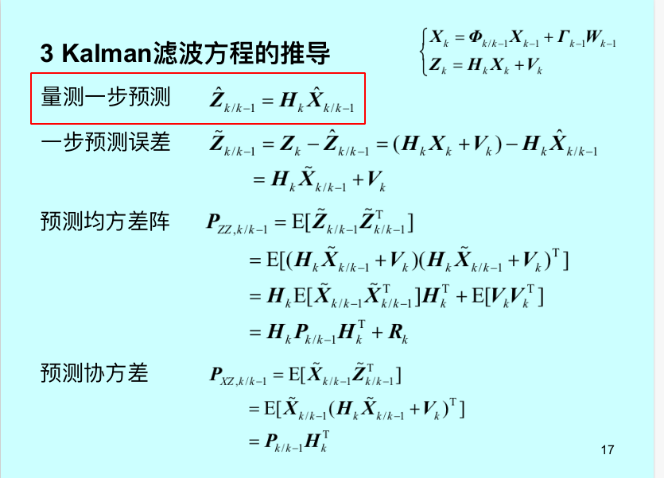

# Kalman filter

整理关于kalman滤波有关的内容，毕竟这是一个很经典的滤波器。按照西工大自己的课程内容来整理。

### 最小二乘 | 最小方差

​	通过测量值Z来计算实际的状态向量X，这就是估计。通过使用的估计指标不同，计算出来的x就有所不同。

​	最小二乘估计的对象是一个固定不变的状态向量X，使用的指标就是测量值Z与估计值X的误差要尽可能的小

**最小二乘**是对一个不变的状态向量来进行估计，也就是这个模型中只有观测模型，没有预测模型(这是kalman filter中的一个概念)，可以将模型简单写为Z=HX+V。

​	既然是最小方差估计，那么实际找到一个估计值让其使估计的噪声方差最小。因为已经假设了是白噪声，所以Cov(Z-HX) = E(Z-HX的转置乘以Z-HX)

开始一定是得到了关于状态向量的观测值Z，但是观测值与实际值还是有些区别，这个对应的就是误差。

PS: 无论是最小二乘还是卡尔曼滤波，本质上都是一种估计，提到估计就不得不知道这个估计是不是无偏估计(判断的方式很简单)，就是去判断这个估计量的均值是不是与真实值X相等即可。

参考链接：

1. https://blog.csdn.net/weixin_41558411/article/details/123585534 (关于最小二乘是无偏的证明)

    

    

对于kalman中提到的一些基本概念的补充(不知道这个概念是不是严老师独创的)，后面所提到的所有的变量都是多元的，毕竟kalman很少对一维系统进行分析。

- 协方差矩阵: 这是一个常见的概念，也就是多元变量中方差的拓展表示。这个矩阵中的对角线元素对应的是每一个分量自己的方差，其余部分就是分量与分量之间的协方差——计算方式为$E((x-x^-)(y-y^-))$，整体就是一个大的矩阵。

    - 实际对信号建模的时候，一般都会给出变量自己的协方差矩阵

        

- 均方误差矩阵：**均方误差实际上是真实值与预估值之间的差值的平方的均值**(虽然我不知道为什么对于一个预估值还存在这均值这种概念，从另一个角度来想，估计就是在测量值逐渐变多的情况下，估计量也会收敛到一个值左右，即为均值)。类比于协方差矩阵，对于一个多维变量，均方差误差的计算就可以认为是 $E\left( \left( X-\hat{X} \right) \left( X-\hat{X} \right) ^T \right) $​，有点类似协方差矩阵的计算，计算形式上非常接近，但是统计含义上还是有很大区别的。有些估计方法是将待估计变量所有分量的均方误差之和取最小，也就是将这个均方误差矩阵的迹取最小。而且使用这种矩阵计算而不是直接计算的好处是不是会引入更多的一些信息，即X自己的分量与其他分量之间计算了一个方程，物理意义不明确。

    

- 协均方误差矩阵：基于上述两种矩阵的进一步拓展，表示形式为$E\left( \left( X-\hat{X} \right) \left( Z-\hat{Z} \right) ^T \right) $，上面的均方误差对角线元素就是每一个分量自己与估计的均方误差，现在用协方差的表示来改写这个矩阵。实际上这个矩阵中的每一项都不是之前定义出来的均方误差。可以假设这种说法有一定意义，看看这一项在实际中如何使用的即可。这里与均方误差矩阵中的物理意义还不明确。

为什么量测一步预测用的是状态一步预测的结果来计算的。

