# Kalman filter

整理关于kalman滤波有关的内容，毕竟这是一个很经典的滤波器。按照西工大自己的课程内容来整理。

### 最小二乘 | 最小方差

最小方差的部分稍等整理，先来看最小二乘的部分。因为最小二乘法是kalman滤波中的特例，而kalman又是一种最小方差的无偏估计方法。

1. 最小二乘
   - 最小二乘法计算起来比较简单，就是从均方误差来的，推导过程就是找到一个预估向量值，让整个均方误差取最小值。对$(z-H\hat{x})(z-H\hat{x})^T$求导，得出 $\hat{x}$取值
2. 加权最小二乘
   - 在最小二乘的基础上使用了权重(就是对预估向量值的不同分量，给定不同) -> 经过证明之后才能说明


​	通过测量值Z来计算实际的状态向量X，这就是估计。通过使用的估计指标不同，计算出来的x就有所不同。

​	最小二乘估计的对象是一个固定不变的状态向量X，使用的指标就是测量值Z与估计值X的误差要尽可能的小

**最小二乘**是对一个不变的状态向量来进行估计，也就是这个模型中只有观测模型，没有预测模型(这是kalman filter中的一个概念)，可以将模型简单写为Z=HX+V。

​	既然是最小方差估计，那么实际找到一个估计值让其使估计的噪声方差最小。因为已经假设了是白噪声，所以Cov(Z-HX) = E(Z-HX的转置乘以Z-HX)

开始一定是得到了关于状态向量的观测值Z，但是观测值与实际值还是有些区别，这个对应的就是误差。


PS: 无论是最小二乘还是卡尔曼滤波，本质上都是一种估计，提到估计就不得不知道这个估计是不是无偏估计(判断的方式很简单)，就是去判断这个估计量的均值是不是与真实值X相等即可。

参考链接：

1. https://blog.csdn.net/weixin_41558411/article/details/123585534 (关于最小二乘是无偏的证明)

    

    


对于kalman中提到的一些基本概念的补充(不知道这个概念是不是严老师独创的)，后面所提到的所有的变量都是多元的，毕竟kalman很少对一维系统进行分析。

- 协方差矩阵: 这是一个常见的概念，也就是多元变量中方差的拓展表示。这个矩阵中的对角线元素对应的是每一个分量自己的方差，其余部分就是分量与分量之间的协方差——计算方式为$E((x-x^-)(y-y^-))$，整体就是一个大的矩阵。

    - 实际对信号建模的时候，一般都会给出变量自己的协方差矩阵

        

- 均方误差矩阵：**均方误差实际上是真实值与预估值之间的差值的平方的均值**(虽然我不知道为什么对于一个预估值还存在这均值这种概念，从另一个角度来想，估计就是在测量值逐渐变多的情况下，估计量也会收敛到一个值左右，即为均值)。类比于协方差矩阵，对于一个多维变量，均方差误差的计算就可以认为是 $E\left( \left( X-\hat{X} \right) \left( X-\hat{X} \right) ^T \right) $​，有点类似协方差矩阵的计算，计算形式上非常接近，但是统计含义上还是有很大区别的。有些估计方法是将待估计变量所有分量的均方误差之和取最小，也就是将这个均方误差矩阵的迹取最小。而且使用这种矩阵计算而不是直接计算的好处是不是会引入更多的一些信息，即X自己的分量与其他分量之间计算了一个方程，物理意义不明确。

    

- 协均方误差矩阵：基于上述两种矩阵的进一步拓展，表示形式为$E\left( \left( X-\hat{X} \right) \left( Z-\hat{Z} \right) ^T \right) $，上面的均方误差对角线元素就是每一个分量自己与估计的均方误差，现在用协方差的表示来改写这个矩阵。实际上这个矩阵中的每一项都不是之前定义出来的均方误差。可以假设这种说法有一定意义，看看这一项在实际中如何使用的即可。这里与均方误差矩阵中的物理意义还不明确。


为什么量测一步预测用的是状态一步预测的结果来计算的。


****

## kalman 基础

最简单的kalman filter肯定是线性方程的kalman。**一般使用kalman的时候，都是从连续方程开始建立，最后离散化成为离散kalman进行处理。连续方程引入的是状态变量的导数(类似于现代控制中的状态方程)**。在slam中对IMU测量方程进行处理的时候，也是先将整个方程从连续转到离散再进行处理——这样会导致噪声的协方差发生变化(感觉是从信号功率的角度做了一个等效,会在采样的时间段做积分平均)。**kalman实际使用中都应该对于量测与状态方程都进行连续到离散转换。**

- KF中的转换

  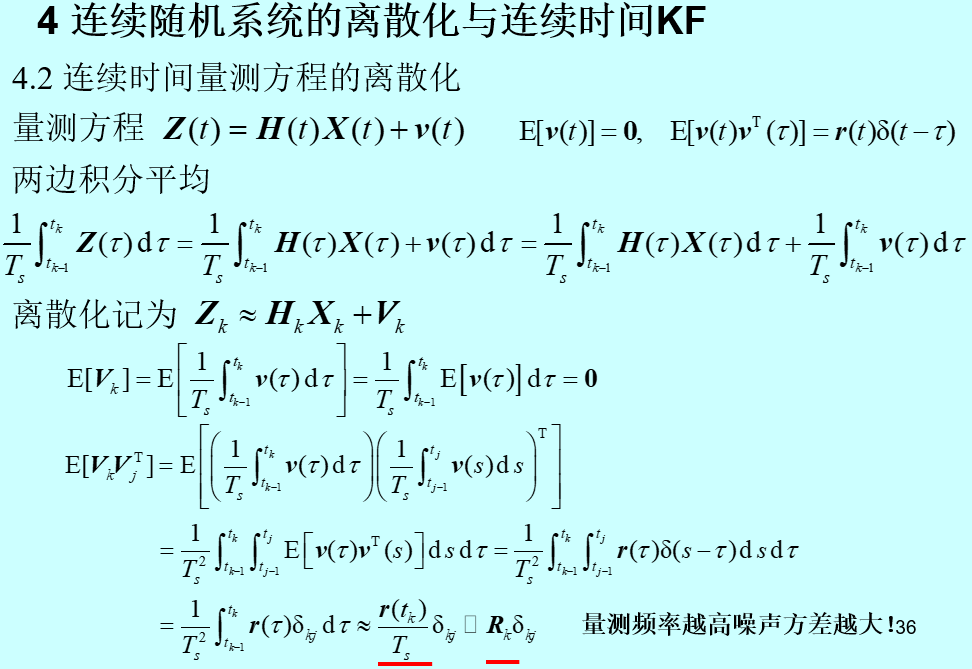

- SLAM连续离散转换

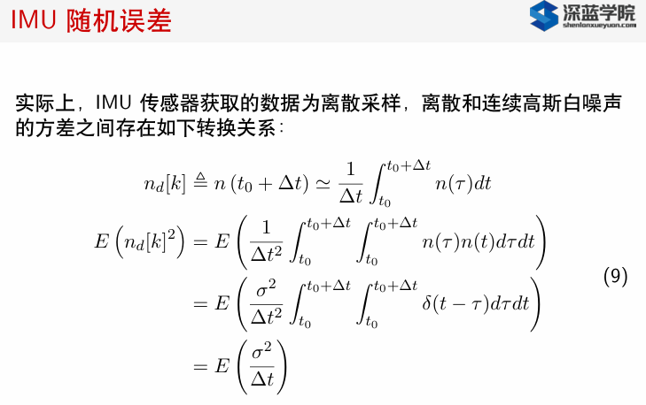


顺便给一个kalman的例子。这个题目给出的题干中的状态方程是需要手动转换成离散形式，雷达观测是直接写成了离散形式(均方差的单位有误)

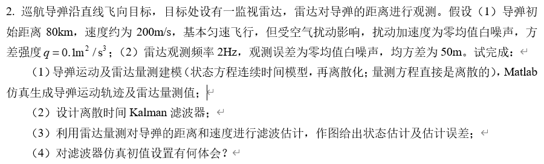

- 使用matlab对于信号进行可视化

```matlab
clc;
clear;
close all;
x =zeros(1,1000);
x(1) = 25;
for i = 1:1000-1
    w = normrnd(0,sqrt(0.4)); % 每一次测量都加入噪声信息
    x(i+1) = x(i)+ w;
end
% 绘制图像
plot(1:1000, x(1,:));
```

随机运行两次之后，本身一个固定在25的数值由于累计误差的影响，数据值的飘移情况很大。这也说明了如果一个系统只使用状态递推，每一次递推中加入的随机变量(噪声)会让这个系统推向一个未知的位置上，这就是累积误差。就像一个IMU的输出会随着累积误差逐渐离谱，如果这个时候再加入一个量测信息，当前时刻的状态估计就可以有一定的修正。IMU的递推再以这个估计出来的状态进行，这样累积误差就会受到一定的修正。**但是状态递推本身的误差以及量测误差还是包含在最后的估计量中，再往下的分析我就不明白了，不知道什么时候这个误差会让整个系统崩溃。**


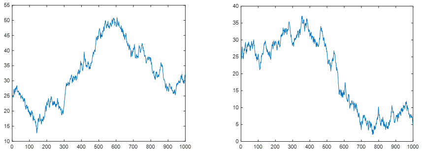

根据上述题目设置一个滤波器

```matlab
clc;
clear;
close all;
%% 生成运动方程与测量方程
Ts = 0.5;
F = [1,Ts; 0,1];
G = [0;1];
q = 0.1;

Q = q*Ts;
R = 50;
x = zeros(2,400/Ts);
x(:,1) = [-80000;200];
% 生成运动方程
for i = 2:400/Ts   
    w = normrnd(0,sqrt(Q));
    x(:,i)=F*x(:,i-1)+G*w;
end

H = [1,0];
z = zeros(1,400/Ts);
% 测量方程 | 对应的测量方程一定是从真实状态得到的(真实状态也是会受到噪声影响的)
for i = 1:400/Ts
    v =  normrnd(0,R);
    z(i) = H*x(:,i)+v;
end


%% kalman filter

x_kalman = zeros(2,400/Ts);

x_kalman(:,1) = x(:,1);     % 初始状态为真实值
P_pre = [100,0 ; 0,1];      % 这里设置的第一次估计的均方误差
I = eye(2);

for i = 2:400/Ts
    x_temp = F*x_kalman(:,i-1);  % 状态一步预测
    P_temp = F*P_pre*F' + G*Q*G'; 
    K = P_temp*H'*pinv(H*P_temp*H'+R);
    x_kalman(:,i) = x_temp + K*(z(i)-H*x_temp);
    P_pre = (I-K*H)*P_temp;
        
end

% 只进行状态递推 | 每一步都是最优估计，但真实值受到噪声影响 —— 真实值与测量值差值就体现出来了
x_pure(:,1) = x(:,1);
for i = 2:400/Ts
    w = normrnd(0,sqrt(Q));
    x_pure(:,i) = F*x_pure(:,i-1);
end


%% 绘制结果
% 绘制图像 | 对于真实位移的图像就是一条直线 | 计算结果为估计与实际测量误差比测量与实际测量误差 | 黄线为只进行递推得到的误差曲线
figure(1);
plot(1:400/Ts, x(1,:)-x_kalman(1,:),'-b'); hold on;
plot(1:400/Ts, x(1,:)-x_pure(1,:),'-y'); hold on;
plot(1:400/Ts, x(1,:)-z,'-r');

```

出来的结果比较 真实值 | KF估计值 | 纯递推估计值 | 测量值 之间的区别

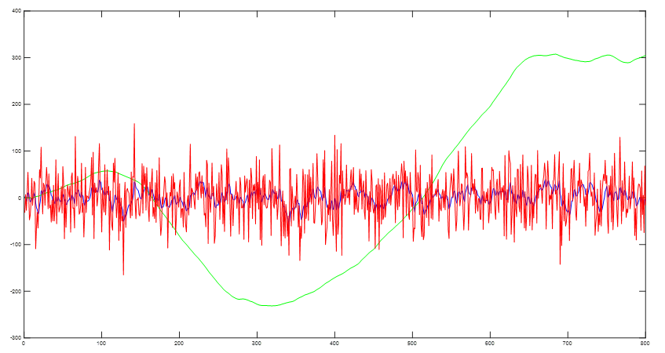


> [!IMPORTANT]
>
> **为什么kalman滤波引入量测信息可以对累计误差进行一定的修正**
>
> 1. 累计误差: 每一次状态方程递推，都有一个随机变量加入进来(上面的图中也有展示)，这个随机出现的噪声不知道会将整个系统的状态递推到哪里去。假设只有状态方程，那么其的预估值是不考虑噪声的，估计值对应的均方误差矩阵越来越大，说明估计的不确定性会越来越大，即对应 $P_{k/k-1}$ 的递推公式。
>    $$
>    \hat{x}_{k/k-1}=\phi _{k/k-1}\hat{x}_{k-1}
>    \\
>    P_{k/k-1}=\phi _{k/k-1}P_{k-1}\phi _{k/k-1}^{T}+\varGamma _{k-1}Q_{k-1}\varGamma _{k-1}^{T}
>    $$
>
> 2. 当获得一帧量测时，量测本身也具有一定的不确定性。但是其测量的是当前时刻真实状态，不会受到状态累计误差影响。在这里是对两种信息(或者是两种方法得到的状态量进行结合)。**新引入的量测会降低状态估计的均方误差值，让当前时刻的估计更准了**。重点就是虽然状态状态递推中协方差会一直在变大，但是如果使用了其他量测信息，类似于电阻的并联公式，最后生成的误差阵是会减小的 (**这里的感觉不对——根据下面的公式是不论新来的量测信息的协方差大小，最后估计对应的均方误差阵都是会减小。感觉有点反常识，按道理应该是一个波动的过程才对，这里有点小疑惑但是不影响理解——可能是因为矩阵乘法很难说是正数负数**)。


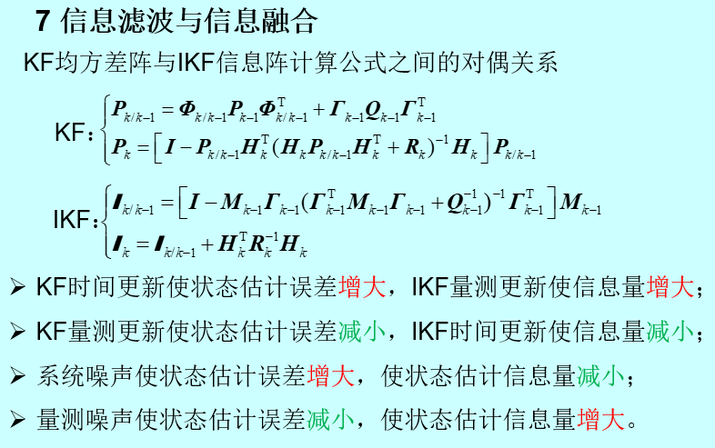


## 信息滤波与序贯滤波

- 序贯滤波: 量测信息过多，导致KF计算量增加。为了减少计算复杂度，采用分步处理量测的思路——但最后的输出结果与集中滤波(也就是经典的KF)效果一样，两者本质上没有区别。这也可以说明如果对于一个状态量有多种量测的情况下，可以直接使用集中滤波进行计算。想降低复杂度，就使用序贯滤波。

  ```matlab
  clc;
  clear;
  close all;
  %% 生成运动方程与测量方程
  
  Ts = 0.1;
  F = [1,Ts; 0,1];
  G = [0;1];
  q = 0.01;
  Q = q*Ts;
  
  x = zeros(2,150/Ts);
  x(:,1) = [-1500;10];
  % 生成运动方程
  for i = 2:150/Ts   
      w = normrnd(0,sqrt(Q));
      x(:,i)=F*x(:,i-1)+G*w;
  end
  
  
  % 生成两种测量方程 (1)Z1 气压高度  (2) 雷达高度 
  H = [1,0];
  R1 = 10*10;
  z1 = zeros(1,150/Ts);
  for i = 1:150/Ts
      v =  normrnd(0,sqrt(R1));
      z1(i) = H*x(:,i)+v;
  end
  
  R2 = 5*5;
  z2 = zeros(1,150/Ts);
  for i = 1:150/Ts
      v =  normrnd(0,sqrt(R2));
      z2(i) = H*x(:,i)+v;
  end
  
  % 定义整体测量方程用于集中滤波
  H_a = [1,0; 1,0];
  R_a = [R1,0;0,R2];
  
  % 整体的测量与分别测量结果保持一致，不重复生成
  z_a = zeros(2,150/Ts);
  z_a(1,:) = z1;
  z_a(2,:) = z2;
  
  
  
  
  %% kalman filter(集中滤波)
  
  x_kalman = zeros(2,150/Ts);
  x_kalman(:,1) = x(:,1);     % 初始状态为真实值
  P_pre = [100,0 ; 0,1];      % 这里设置的第一次估计的均方误差(虽然这里应该是无偏的，但是还是给一个估计本身可能存在的误差)
  I = eye(2);
  
  for i = 2:150/Ts
      x_temp = F*x_kalman(:,i-1);  % 状态一步预测
      P_temp = F*P_pre*F' + G*Q*G';
  
      K = P_temp*H_a'*pinv(H_a*P_temp*H_a'+R_a);
      x_kalman(:,i) = x_temp + K*(z_a(:,i)-H_a*x_temp);
      P_pre = (I-K*H_a)*P_temp;
  
      
  end
  
  % 绘制集中滤波结果
  figure(1);
  plot(1:150/Ts, x(1,:)-x_kalman(1,:),'-b'); hold on;
  plot(1:150/Ts, x(1,:)-z_a(1,:),'-g'); hold on;
  plot(1:150/Ts, x(1,:)-z_a(2,:),'-r'); hold on;
  
  
  
  %% kalman filter(序贯滤波)
  
  x_kalman = zeros(2,150/Ts);
  x_kalman(:,1) = x(:,1);     % 初始状态为真实值
  P_pre = [100,0 ; 0,1];
  
  for i = 2:150/Ts
      % 状态不变
      x_temp = F*x_kalman(:,i-1);  % 状态一步预测
      P_temp = F*P_pre*F' + G*Q*G';
          
      K1 = P_temp*H'*pinv(H*P_temp*H'+R1);
      x_1 = x_temp + K1*(z1(i)-H*x_temp);
      P_1 = (I-K1*H)*P_temp;
     
      K2 = P_1*H'*pinv(H*P_1*H'+R2);
      x_kalman(:,i) = x_1 + K2*(z2(i)-H*x_1);
      P_pre = (I-K2*H)*P_1;
  
  end
  
  % 绘制序贯滤波结果
  figure(2);
  plot(1:150/Ts, x(1,:)-x_kalman(1,:),'-b'); hold on;
  plot(1:150/Ts, x(1,:)-z_a(1,:),'-g'); hold on;
  plot(1:150/Ts, x(1,:)-z_a(2,:),'-r'); hold on;
  ```

  输出结果完全一样

  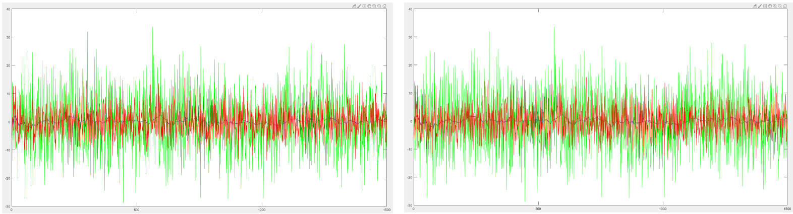

  

- 信息滤波: IKF(information kalman filter) 。信息矩阵就是均方误差矩阵P的倒数，信息即表示状态估计中含有真实状态信息(information)大小。


## 平方根滤波

- 平方根滤波就是为了保证均方误差P的精度 | 也就是P中数据如果有效位数多的话，可以使用其平方根之后的结果来保存。平方根结果的需要的有效位数比较少，这样就可以保证实际使用中的P精度不会下降。


如图: 平方根滤波只改变了增益计算回路，对于左侧回路没有被修正。在右侧回路递推都是使用平方根结果进行递推，只有在滤波计算回路需要使用增益K的时候，增益计算回路才会输出一个P用于计算(这里输出的P有效位数不高，但是足够使用)。在增益计算回路里面递推的时候，有效位数没有损失。

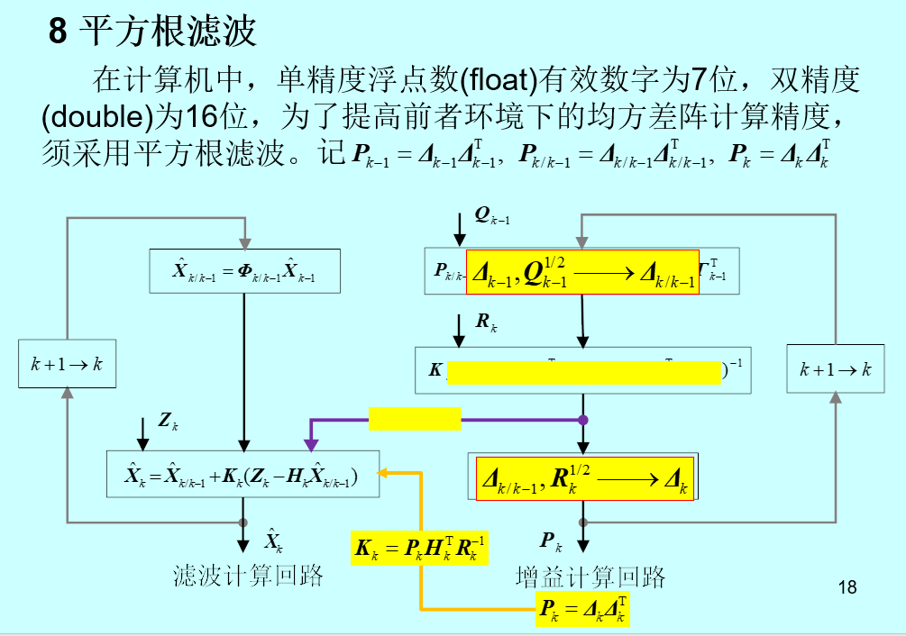

PS：现在很难说平方根滤波的work程度——因为目前计算机计算能力比之前增强了不少。


## 遗忘滤波

在实际使用遗忘滤波的时候，发现与传统kalman的区别就只有在P矩阵k-1到k的递推中乘一个s。作用就是认为之前估计不准(相当于对之前的量测噪声以及系统噪声乘以一个s的放大倍数)。使用起来比较简单。

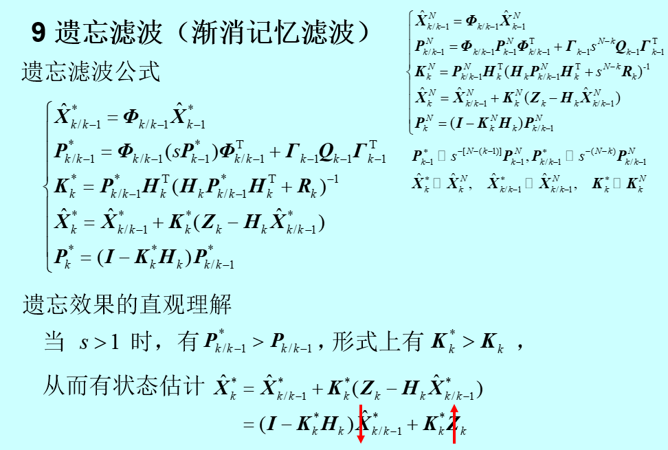


(1) 别人的飞机还是处于未知的状态(比如其存在着一步机动，但是我们自己估计的还是匀速运动，所以就需要使用遗忘滤波来处理问题) —— 所以我们这里设置的状态模型还是与原来的一样。这样的话，使用遗忘滤波就可以比常规kalman更好的去估计出未知状态变换的对象。可以从实验结果上看到效果。

- 这里问题的处理也可以尝试将模型再扩维 —— 加入对于加速度的估计 —— 虽然可能会导致估计误差变大，但是可以跟踪好对应的状态(有变化，可以很快的追踪上)


自适应滤波中 只有R方便使用自适应 | 两个均值直接扩维状态向量就可以 | 由于期望未知所以Rk也是未知的

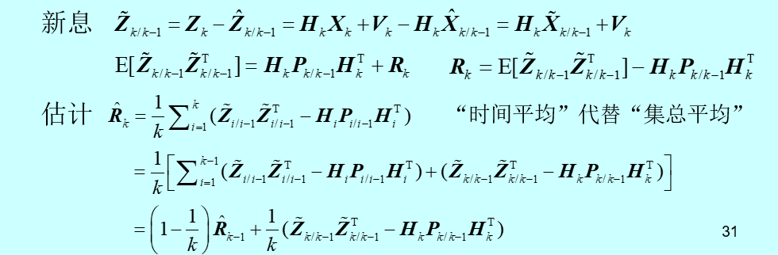


这里 左侧的一次矩也会影响到右侧的回路了 | 线性系统变成了非线性 

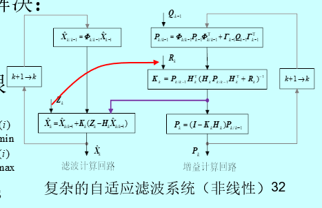


故障检测 —— 测量新息出现问题 | 一般认为由于惯性，所以会认为是量测出现问题导致


单重因子与多重因子在实际使用中都很难用 | 自适应滤波很不稳定，使用起来效果很不好 | 强跟踪滤波也是一种扯淡


区间平滑 

平滑是向后分析 预测是向前 

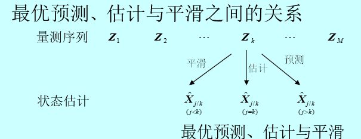


反向滤波 是到 j+1 时刻，然后从j+1到j做反向一步滤波 最后在j时刻平滑 —— 这样就能让所有的量测只用一次

(平滑滤波可以让均方误差减小) | 只有直接/间接受到系统噪声影响的部分进行区间平滑才会work.


联邦滤波也不能work，基本没有人使用了。虽然这里提到了一些信息分配方式等等，但是实际使用起来很难去判断哪一种效果很差

分散滤波 —— 可以增强可靠性？？什么是公共状态以及私有状态？
