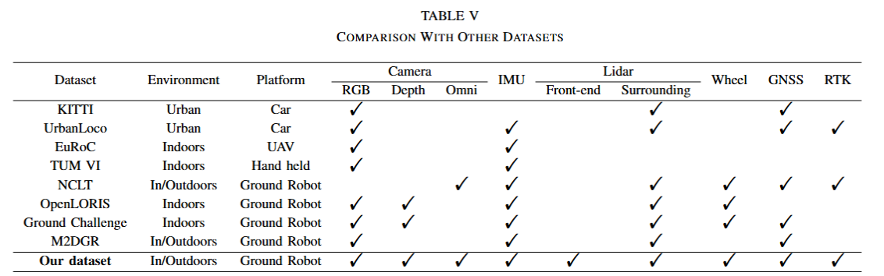

# Latex

- 该部分用于整理latex中的语法，方便后续使用


## 注意：

- IEEE文章中基本上都是双栏的模板，如果想让绘制的表格以及图像横跨两栏，可以在将\begin{figure}以及\begin{table}换成\begin{figure\*}以及\begin{table\*}。


## 表格

```latex
 \begin{table*}[ht]
    \caption{Comparison With Other Datasets}
    \label{Comparison}
    \renewcommand{\arraystretch}{1.2} 
    \begin{adjustbox}{width=2\columnwidth}
    \centering
        \begin{tabular}{*{14}c}
            \hline
            \multirow{2}{*}{\makecell{Dataset}} & \multirow{2}{*}{\makecell{Environment}} & \multirow{2}{*}{\makecell{Platform}} & \multicolumn{3}{c}{\makecell{Camera}} & \multirow{2}{*}{\makecell{IMU}}  & \multicolumn{2}{c}{\makecell{Lidar}} & \multirow{2}{*}{\makecell{Wheel}} & \multirow{2}{*}{\makecell{GNSS}} & \multirow{2}{*}{\makecell{RTK}} \\
            \cline{4-6} \cline{8-9}
            & & & RGB & Depth & Omni &  & Front-end & Surrounding \\
            \hline
            % Car对应的数据集
            \makecell{KITTI} & \makecell{Urban} & \makecell{Car} & \makecell{\Checkmark} & \makecell{ } & \makecell{ } & \makecell{ } & \makecell{ } & \makecell{\Checkmark} & \makecell{} & \makecell{\Checkmark} & \makecell{ } \\ 
            \makecell{UrbanLoco} & \makecell{Urban} & \makecell{Car} & \makecell{\Checkmark} & \makecell{ } & \makecell{ } & \makecell{\Checkmark} & \makecell{ } & \makecell{\Checkmark} & \makecell{} & \makecell{\Checkmark} & \makecell{\Checkmark} \\ 

            % UAV对应的数据集 
            \makecell{EuRoC} & \makecell{Indoors} & \makecell{UAV} & \makecell{\Checkmark} & \makecell{ } & \makecell{ } & \makecell{\Checkmark} & \makecell{ } & \makecell{ } & \makecell{} & \makecell{ } & \makecell{ } \\ 


            % Handheld对应的数据集 
            \makecell{TUM VI} & \makecell{Indoors} & \makecell{Hand held} & \makecell{\Checkmark} & \makecell{ } & \makecell{ } & \makecell{\Checkmark} & \makecell{ } & \makecell{ } & \makecell{} & \makecell{ } & \makecell{ } \\ 

            % Ground Robot对应的数据集 
            
            \makecell{NCLT} & \makecell{In/Outdoors} & \makecell{Ground Robot} & \makecell{ } & \makecell{ } & \makecell{\Checkmark} & \makecell{\Checkmark} & \makecell{ } & \makecell{\Checkmark} & \makecell{\Checkmark} & \makecell{\Checkmark} & \makecell{\Checkmark} \\
            \makecell{OpenLORIS} & \makecell{Indoors} & \makecell{Ground Robot} & \makecell{\Checkmark} & \makecell{\Checkmark} & \makecell{ } & \makecell{\Checkmark} & \makecell{ } & \makecell{\Checkmark} & \makecell{\Checkmark} & \makecell{ } & \makecell{ } \\     
        
            \makecell{Ground Challenge} & \makecell{Indoors} & \makecell{Ground Robot} & \makecell{\Checkmark} & \makecell{\Checkmark} & \makecell{ } & \makecell{\Checkmark} & \makecell{ } & \makecell{\Checkmark} & \makecell{\Checkmark} & \makecell{\Checkmark} & \makecell{ } \\ 
            
            \makecell{M2DGR} & \makecell{In/Outdoors} & \makecell{Ground Robot} & \makecell{\Checkmark} & \makecell{ } & \makecell{ } & \makecell{\Checkmark} & \makecell{ } & \makecell{\Checkmark} & \makecell{} & \makecell{\Checkmark} & \makecell{ } \\ 

            \hline
            \makecell{\textbf{Our dataset}} & \makecell{In/Outdoors} & \makecell{Ground Robot} & \makecell{\Checkmark} & \makecell{\Checkmark} & \makecell{\Checkmark} & \makecell{\Checkmark} & \makecell{\Checkmark} & \makecell{\Checkmark} & \makecell{\Checkmark} & \makecell{\Checkmark} & \makecell{\Checkmark} \\

            \hline
        \end{tabular}
    \end{adjustbox}
  \end{table*}
```




- 关于在一个表格中加入注释部分，在表格中插入 $^1$ 并且在latex的\end{table*}之前的部分写如 {\footnote xxx}，其中xxx就为整个表格对应的注释部分


## 配色

- 由于自己选择颜色比较麻烦，故直接去查找一种提供配色的网站，直接从里面选择出需要的颜色信息(可以直接读取16进制数据)。在PPT、Google earth以及axGlyph中都可以直接使用取色器进行取值。


## 绘制图像

- 主要使用的宏包为 \usepackage{subfigure} 虽然其比较老，但是使用起来还是比较方便的 - **碰到一个bug就是图像如果直接转换成为pdf文件之后由于选择的是A4格式，图像会多出来很多空白的部分，不如直接将图像按照固定的分辨率处理过之后导入到AxGlxph中再转换成pdf文件(这样可以保证没有对于空白出现)**

    \begin{figure*}
        \small
        \begin{center}
            \begin{tabular}{ccc}
            \includegraphics[scale=0.3]{fig/light02.pdf} &
            \includegraphics[scale=0.3]{fig/dark01.pdf}  &
            \includegraphics[scale=0.3]{fig/dynamic02.pdf}  \\
            (a) & (b) & (c)  \\
    
            \includegraphics[scale=0.3]{fig/occlusion01.pdf} &
            \includegraphics[scale=0.3]{fig/GNSS_Denied.pdf} &
            \includegraphics[scale=0.3]{fig/lift01.pdf}   \\
            (d)  & (e)  & (f) \\
    
            \includegraphics[scale=0.3]{fig/corridor01.pdf} & 
            \includegraphics[scale=0.3]{fig/grass01.pdf} & 
            \includegraphics[scale=0.3]{fig/rough_road02.pdf} \\
            (g)  & (h)  & (i) \\
            % 还可以补充遮挡环境 - 或者这里使用的图像全部从D435i的相机上读取 可能说服力更强一些
            % 话可以补充动态物体
            \end{tabular}
        \end{center}
        % \vspace{-3mm}
        \caption{Diverse scenarios included in our datasets: (a) Normal lighting conditions. (b) Low-light environment. (c) A park with significant pedestrian dynamics. (d) A scene with intermittent partial camera occlusion. (e) An area without GNSS signal coverage. (f) An elevator. (g) A narrow corridor. (h) A grassy terrain. (i) A road with abrupt elevation changes.}
        % \vspace{-5mm}
        \label{point}
    \end{figure*}

