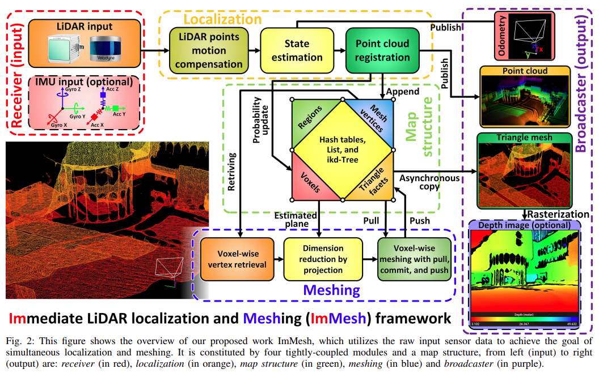
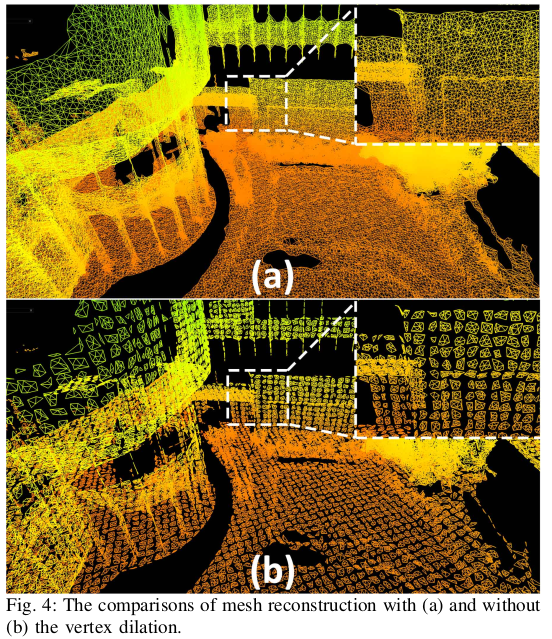
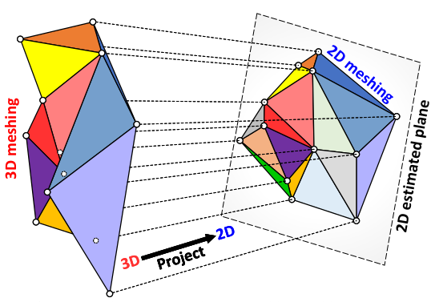

# Lidar + Camera

这部分主要是用于调研Lidar与Camera联合建图

## ImMesh(lidar + imu)

建图部分使用的是 voxel + mesh，可以直接用其生成depth图像。

- 定位：将lidar scan转换到了一个global frame中，雷达的点云数据就可以作为新的三角mesh的顶点(具体的方法在VoxelMap文章中)。主要作用是 (1)保证lidar点云的准确 (2)提供一个plane方便3D点投影到2D点提高速率
- 建图：以voxel为单位进行处理

首先就先介绍一个voxel中的mesh平面的形成

- 顶点的选取：对于一个voxel来说(体素就是在3D空间中的最小空间，类似与2D平面中的像素点)，会有很多Lidar扫描到的点落到这个voxel中，这些点本身就是通过反射得到的，所以点的位置如果准确的话(这里就需要依靠odometry的准确度)，是可以描述出一种轮廓来的。对这些点进行处理(downsample以及限制距离)可以选择出一些点可以作为mesh的顶点，这也是后续处理的基础。
    - 注意：这里一个voxel中顶点不是仅仅选取落到整个voxel中的点，这种会导致的情况是voxel中的mesh平面与其他mesh平面之间是没有边连接的，如下图。所以本文使用的方法是选择与这个voxel中的点距离小于一个固定值的点(会降重)，最后形成一个顶点集合$V_i$

- voxel级别的mesh/facet的形成
    - 直接使用上面的点进行生成mesh。
    - 3D点转到2D平面: 2D Delaunay triangulation方法可以直接在2D 平面上生成三角形(我一直将这里的mesh认为是三角形的面，即facet)。顶点集合$V_i$中的点会全部投影到平面上(localization系统中找到了这个2D平面)，之后将2D的mesh转换到3D中形成3D mesh。时间效率可以从O(n^2)变成O(nlog(n))。

- 更新

    ​	所谓的更新就是在lidar不断工作的过程中，会不断地得到新的点。这些新的点如何去更新已经建立好的mesh图。本文给出来的方法就是 pull + commit + push过程。

    - pull : 将之前的点生成的mesh/facet全部读取出来。对于一个voxel中的所有点(包括新得到的点/以及一些扩张的边缘点)也会读取，重新生成mesh(是重新生成voxel中的所有mesh)。
    - commit：根据新生成mesh与之前的比较，没有的增添，消失的删除。
    - push 将要删除的面与增加的面得到之后，将他们对应的顶点进行删除/增加之后即可。

****

## R3live(lidar + camera + imu)

- 

1. texture rendering 纹理渲染 -> 难道这里对于这个纹理信息的说明仅仅只是一个对于点云颜色的增加么
2. photometric error 光度误差指的又是什么(是重投影误差么) 应该不是重投影误差，这个是在r2live中使用的
3. Motion  compensation Immesh与R3live中都提到了这个运动补偿的说法

## RTabMap

## Kimera | Kimera2

目前关于这个lidar与imu一起使用的调研

- r3live
- immesh

https://blog.csdn.net/lovely_yoshino/article/details/126572997

ROS中的tf工具 

https://blog.csdn.net/wilylcyu/article/details/51724966

这个对于体素解释的很清楚

https://blog.csdn.net/a_eastern/article/details/107508861?spm=1001.2101.3001.6650.3&utm_medium=distribute.pc_relevant.none-task-blog-2%7Edefault%7ECTRLIST%7ERate-3-107508861-blog-121698677.235%5Ev43%5Epc_blog_bottom_relevance_base1&depth_1-utm_source=distribute.pc_relevant.none-task-blog-2%7Edefault%7ECTRLIST%7ERate-3-107508861-blog-121698677.235%5Ev43%5Epc_blog_bottom_relevance_base1&utm_relevant_index=6

这个也是对于voxel的解释

https://blog.csdn.net/m0_47163076/article/details/121698677