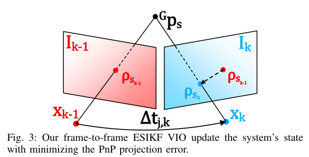
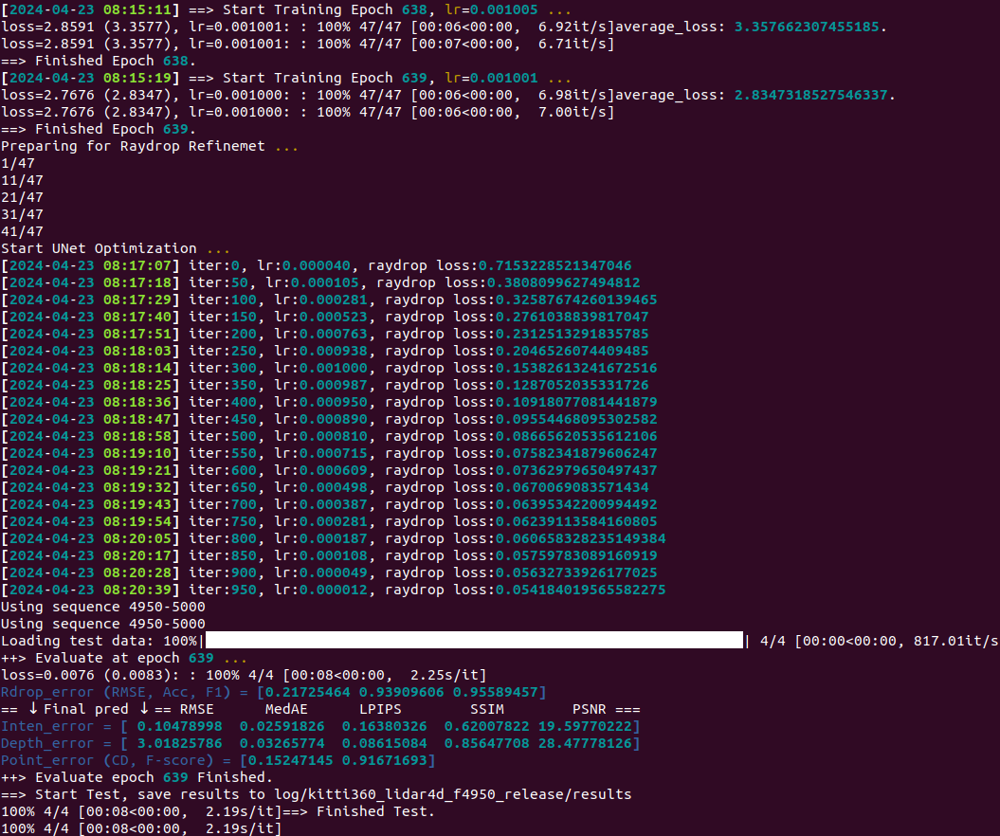

[TOC]


# Lidar + Camera

这部分主要是用于调研Lidar与Camera联合建图


## ImMesh(lidar + imu)

整理ImMesh中的demo以及实现思路


ImMesh

- real-time的mesh重建
- 运行效率+mesh重建的准确率 与现有方法的对比 ( 这里不知道mesh重建的精确度是如何对比的 )
- 潜在应用: (1) 点云强化 (2) mesh图的渲染


其他mesh的重建方法

- offline
  1. 基于Possion方法
  2. 三角剖分方法

- online


关于ImMesh上面与其他重建方法的对比

- 数据集的选择 真实数据 + 虚拟数据(包括 结构化场景+非结构化场景)
- 评价指标
  - 平衡性 fairness - 检测生成的三角triangle图形中是不是都是等边三角形(等边三角形占比比较大的Mesh图能够运行更多的下游任务，所以这也可以成为一种检测指标)
  - 准确性 correctness - 准确性就是在生成的Mesh图上进行采样，用其去对比groundtruth的点云数据，用其来计算重建的准确性


在评价中没有关于色彩信息是否准确的衡量标准,只有原版的ImMesh重建结果的检测精度的指标

ImMesh中的上色部分可以直接基于height来实现，在加色彩信息的ImMesh只有实际的渲染时间，以及最后的结果图，并没有给出实际结论证明其能够work。


建图部分使用的是 voxel + mesh，可以直接用其生成depth图像。voxel即体素(体素就是在3D空间中的最小空间，类似与2D平面中的像素点)，mesh我的个人理解就是一个面，跟论文中说的trianglar facet是一个东西(三角形的面)


- 定位：将lidar scan转换到了一个global frame中，雷达的点云数据就可以作为新的三角mesh的顶点(具体的方法在VoxelMap文章中)。主要作用是 (1)保证lidar点云的准确 (2)提供一个plane方便3D点投影到2D点提高建图速率
- 建图：以voxel为单位进行处理

首先就先介绍一个voxel中的mesh平面的形成

- 顶点的选取：对于一个voxel来说，会有很多Lidar扫描到的点落到这个voxel中，这些点本身就是通过反射得到的，所以点的位置如果准确的话(这里就需要依靠odometry的准确度)，是可以描述出一种轮廓来的。对这些点进行处理(downsample以及限制距离)可以选择出一些点可以作为mesh的顶点，这也是后续处理的基础。
    - 注意：这里一个voxel中顶点不是仅仅选取落到整个voxel中的点，这种会导致的情况是voxel中的mesh平面与其他mesh平面之间是没有边连接的，如下图。所以本文使用的方法是选择与这个voxel中的点距离小于一个固定值的点(会降重)，最后形成一个顶点集合$V_i$


- voxel级别的mesh/facet的形成(直接使用上面的点进行生成，并且是现在2D平面中生成)
    - 3D点转到2D平面: 2D Delaunay triangulation方法可以直接在2D 平面上生成三角形(我一直将这里的mesh认为是三角形的面，即facet)。顶点集合$V_i$中的点会全部投影到平面上(localization系统中找到了这个2D平面)，之后将2D的mesh转换到3D中形成3D mesh。时间效率可以从O(n^2)变成O(nlog(n))。


- 更新

    ​	所谓的更新就是在lidar不断工作的过程中，会不断地得到新的点。这些新的点如何去更新已经建立好的mesh图。本文给出来的方法就是 pull + commit + push过程。

    - pull : 将之前的点生成的mesh/facet全部读取出来。对于一个voxel中的所有点(包括新得到的点/以及一些扩张的边缘点)也会读取，重新生成mesh(是重新生成voxel中的所有mesh)。
    - commit：根据新生成mesh与之前的比较，没有的增添，消失的删除。
    - push 将要删除的面与增加的面得到之后，将他们对应的顶点进行删除/增加之后即可。


**1/2.  结果展示**

pcd文件读取使用pcl, mesh文件使用meshlab读取

- Immesh中 点云(pcd文件) mesh(ply文件)
- r3live 保存成为pcd文件


**plane色彩信息对应的为不确定性**

**voxelmap:**

- m2DGR walk.bag

蓝色平面为确定性比较高的平面(生成的plane基本都在地面上，其他区域plane数量比较少)


**完整一帧运行时间(ms)**

feats size:39029, down size:7048
[ Time ]: average undistort: 0.00733234 (没有使用imu，直接使用匀速模型)
[ Time ]: average down sample: 1.60856
[ Time ]: average calc cov: 0.48117
[ Time ]: average scan match: 12.4769
[ Time ]: average solve: 4.21935
[ Time ]: average map incremental: 23.0096
[ Time ]:  average total 41.803


**voxelmap++**


**完整一帧的运行时间(ms)**

feats size:38777, down size:6441
pos:197.299 42.9551 4.75867
[ Time ]: average undistort: 2.80849 (使用imu去畸变)
[ Time ]: average down sample: 1.69304
[ Time ]: average calc cov: 0.409475
[ Time ]: average scan match: 5.89106
[ Time ]: average solve: 2.3585
[ Time ]: average map incremental: 6.0728
[ Time ]:  average total 19.2334


**ImMesh**

在ImMesh中的其中一个线程也使用了相同的平面生成过程, 相比于原版，其在匹配位姿以及地图更新上面的耗时增加

(1) 位姿计算 ：6.54092 ms

(2) 总时间(包含发布点云以及增加地图时间) : 9.95822 ms


****


**3. mesh重建**

rqt中node关系: 说明发布的话题只会进行可视化，内部数据的交换都是经过线程来进行处理的，并且没有使用图像信息


ImMesh(原版) hku_park_01.bag

- 发布点云+plane平面


- 最终生成的mesh图形


ImMesh(lvi-sam做里程计) 

- handheld.bag(lvisam自身提供数据集)| 完成一帧的运行速度在0.2ms处理 (i9-13900) 相当于只负责地图的更新


- garden.bag(lvisam自身提供数据集)


m2DGR walk01.bag

- 开始部分


- 结束部分


在录制数据的时候将后面的人录制上去，导致在最后生成的mesh图中也包含了人的信息


**算法改动**

- 增加cloudVoxel.msg文件 将lvisam中计算出来的 xyz+row/pitch/yaw + 原始的点云信息 + timestamp全部打包
- ImMesh中获取数据之后，将数据赋值给voxelmap的类成员变量，以及位姿角度转换成位姿矩阵,  更新点的不确定度 

```cpp
     	// 获取位姿信息(其余部分不会使用协方差数据 所以只需要将对应的位姿信息输入到state中即可)
            Eigen::Affine3f tmp = pcl::getTransformation(temp->x, temp->y, temp->z, temp->roll, temp->pitch, temp->yaw);
            Eigen::Affine3d transCur = tmp.cast<double>();

            state.pos_end = transCur.translation();
            state.rot_end = transCur.rotation();

            if(m_lidar_en)
            {
                m_euler_cur(0,0) = temp->roll;
                m_euler_cur(0,1) = temp->pitch;
                m_euler_cur(0,2) = temp->yaw;
            }
			
			// 降采样
            m_downSizeFilterSurf.setInputCloud( m_feats_undistort );
            m_downSizeFilterSurf.filter( *m_feats_down_body );
            m_feats_down_size = m_feats_down_body->points.size();
            // 新建地图
			if ( m_use_new_map )
            {
                if ( !m_init_map )
                {
                    // 进行voxelmap的建立 —— 这里没有使用将采样的点云数据 使用的是去畸变数据
                    m_init_map = voxel_map_init();
                    if ( m_is_pub_plane_map )
                        pubPlaneMap( m_feat_map, voxel_pub, state.pos_end );
                    frame_num++;
                    LOG(INFO)<<"Build the voxelMap";
                    continue;
                }
            }
			// 地图增长
           if ( m_lidar_en )
               map_incremental();
			// 发布信息
            if ( m_is_pub_plane_map )
                pubPlaneMap( m_feat_map, voxel_pub, state.pos_end );
            t2 = omp_get_wtime();

            frame_num++;
            LOG(INFO) << "[service_lvisam_odometry]: " << (t2-t0)/frame_num;
            cloud_Buffer.pop_front();
        }

        rate.sleep();
    }
```


**数据结构**

1. Voxel_mapping 与平面相关的类，管理一个八叉树地图 | 八叉树的第一层代表一个初始voxel_size，子结点对应着更加精细的空间，一个空间生成一个平面 | mesh重建中使用的数据与这里保存的数据没有关系(所以mesh重建可以相当于一个独立部分)

2. RGB_Voxel 管理空间中一个体素中的数据

   - voxel中的所有点云 ( 点位置直接对应grid的id )

   - 二维平面(应该是用于mesh生成的部分)

   - 以及三个向量来代表三个轴信息(short/mid/long)

   - <font color='blue'>在RGB_Voxel中都没有保存其对应的triangle信息 - 因为每一次voxel中的triangle都是被重新生成的，所以不需要在voxel中保留信息</font>

3. Global_map  管理所有的点云+RGB_Voxel+KD_tree

   - 所有RGB_ptr(即所有的点云数据)

   - 所有的RGB_Voxel索引

   - Kd_tree 用于快速搜索最近点云数据

   - Hash表 方便快速查找 点与voxel

4. Triangle_manager 管理与三角平面相关的部分
   - ImMesh中模仿了git中的commit/push/pull的过程，其中的push以及pull过程都是针对Triangle_manager而言。获取当前已经存在的triangle信息，补充新增的triangle信息，删除不再需要的triangle信息。


**service_LiDAR_update 线程**

地图的表示方式为: std::unordered_map< VOXEL_LOC, OctoTree * > 对于输入的点云信息按照自定义的hash函数映射到实际体素位置，使用OctoTree来管理这一块区域中的所有数据(点云+平面+更精细的区域信息)

- voxel_map_init() 地图的建立
  - 新建OctoTree| 生成平面 | 不能生成的点放到子结点中继续判断能不能生成平面

- map_incremental_grow() 对应地图更新
  - 开始mesh的线程
  - updateVoxelMap() 为地图更新最重要的部分 | 设置条件来继续生成平面
  - 将点云+位姿打包 输入到g_rec_mesh_data_package_list


**service_reconstruct_mesh**

调用线程池不断处理数据 

- 在service_reconstruct_mesh这个子线程上启动线程池, 线程池中提交incremental_mesh_reconstruction()任务即调用线程池中的一个空闲线程来处理

注意: 这里的global map不是上面说的OctoTree


**incremental_mesh_reconstruction** 

点云数据融入到Global map + 判断哪一个体素部分的triangle mesh需要被更新。

- 计算新增点其对应的grid以及voxel | grid为更加精细的空间划分(系统中所有点云的位置信息都用其对应的grid表示)

  - 查找grid有没有存在
  - 查找voxel是否存在(这里获取voxel编号与voxelMap中获取voxel编号的方法不一样 —— 这里使用的方法更简单)。但无论这个voxel是新建/原来就有 ，这个voxel都会被认为是voxels_recent_visited (最近被新增点的体素——新增了点那么意味着对应的voxel也是需要被更新的)
- 点云信息 补充到 RGB_ptr | RGB_voxel_ptr | Kd_tree | Hash(grid)等等一堆保存点云的部分

```cpp
	// 这里使用std::round() 将 xyz的值转换成为靠近的整数 -1.3为-1 -1.5为-2转换其靠近的整数范围内

// m_minimum_pts_size对应的大小为0.05,即对应着grid中的大小划分为0.05(估计是滤波相关操作) | 相当于是把xyz转换是grid的编号
        int  grid_x = std::round( pc_in.points[ pt_idx ].x / m_minimum_pts_size );
        int  grid_y = std::round( pc_in.points[ pt_idx ].y / m_minimum_pts_size );
        int  grid_z = std::round( pc_in.points[ pt_idx ].z / m_minimum_pts_size );
        // 将xyz转换成voxel对应的编号
        int  box_x = std::round( pc_in.points[ pt_idx ].x / m_voxel_resolution );
        int  box_y = std::round( pc_in.points[ pt_idx ].y / m_voxel_resolution );
        int  box_z = std::round( pc_in.points[ pt_idx ].z / m_voxel_resolution );
        auto pt_ptr = m_hashmap_3d_pts.get_data( grid_x, grid_y, grid_z );
```


- 调用tbb并行计算

  因为incremental_mesh_reconstruction函数本身就是在线程池中commit的任务，相当与是在线程池中的一个子线程里面又调用tbb开辟新的线程进行并行计算(加速这个线程的处理数据，防止这个线程占用数据的时间过长) 

  - tbb并行处理: 自动将需要处理的voxel分配线程进行处理 (一次只处理一个voxel，但是会使用多个线程进行处理)

    - 获取该voxel中的所有点 ( retrieve_pts_in_voxels直接获取voxel中的m_pts_in_grid输入数据 ) + 周围一定距离中的点(借助Global map中的KDtree | retrieve_neighbor_pts_kdtree )
    - 投影计算 | 根据点云分布 - 按照点云的协方差矩阵对应的特征向量划分三个轴(long/short/mid)
    - 计算三角形, 记录其对应的顶点
    - 在 Triangle_manager 中获取当前点云对应的所有三角，与上一步中计算出来的三角形进行对比，确定需要增加/删除的三角以及
    - 其对应的顶点  


- 数据打包 - 用于可视化部分  - 这些数据会在GUI mesh展示的时候表现

    

每一个voxel中并没有保留其中对应triangle数据 - 所有的triangle都使用Triangle_manager自己来管理的


**service_refresh_and_synchronize_triangle**

ImMesh中使用openGL+ImGUI界面的可视化部分有关

- 主要是调用 synchronize_triangle_list_for_disp() 函数进行数据转换 | 将需要同步的triangle的顶点数据拿到之后，然后进行渲染

- 几何结构的表示主要使用CGAL库进行可视化


PS：

- 因为在线程池中提交的是相同的任务(都是对voxelmap中的线程进行处理)，说明线程池中的子线程需要访问相同的数据容器(vetor或者deque)进行处理(包括取数据以及储存的数据)，这里就需要上锁以及解锁。其次，在子线程中使用tbb可以加速数据处理，好处就是减小这个子线程上锁的时间，可以避免子线程运行时间过长，导致其他子线程都没有办法进行数据的读取以及运算结果的储存。并且在tbb调用过程中，因为也是多个线程处理数据，也需要存储结果，所以这里的处理过程也需要上锁解锁.

- grid是比voxel中更精细的空间表示方式 - 设置为0.05m | 一个网格中只会有一个点(属于是变相滤波)


****


## R3live(lidar + camera + imu)


LIO(FAST-LIO)用于构造点云地图(也就是描述整个场景的几何形状)，VIO用于地图渲染(也就是给点云提供色彩信息)。点云地图中最小单位是point,其保存在voxel(voxel作为一个小的容器可以包含一部分的点云数据)。一帧新的点云获取之后，会将其分到对应的voxel中。

- LIO 使用的是降低point-to-plane的残差来估计状态(在FAST-LIO2中提出的概念)。新来一帧数据，估计出位姿之后，其包含的点在实际环境中的哪一个voxel就被确定了。

**PS: 文章中没有明确写后面的tracked map points是怎么得到的，但是看流程图上面的解释应该是从LIO生成的点云地图中读取的，毕竟LIO是要比VIO先开始工作的。**


**重点是VIO的使用**

依据是一个点的色彩是这个点的固有属性，相机的旋转与平移不会影响色彩。估计位姿采用流程为两步 (1) 最小化 frame-to-frame 的重投影误差 (2) 最小化 frame-to-map 光度误差

- frame-to-frame

  光流找帧与帧之间的特征点，然后PnP最小化投影误差

  

  上面是使用visual方式得到的R,t观测值，IMU得到一个先验的状态值，用ESIKF卡尔曼滤波做了一个融合即VIO的位姿估计。

- frame-to-map(这里通过VIO的计算就应该可以得到了当前图像的R，t。那么就可以使用这个信息将global map中的信息投影到当前图像上，知道其对应的像素点，即可以得到颜色信息)

  - 所谓的光度误差就是点在global map中的颜色(即使用之前帧渲染出来的颜色)与当前帧中观测到的颜色之间的差值。下图就是将上一步上得到的Tracked map point投影到当前帧，即得到了这个点对应的像素位置，用周围像素点的RGB值做插值就可以得到在当前帧中这个点的颜色信息。

    

  - 对误差表达Taylor展开-因为其中包含了(1) 当前帧位姿 (2)地图点位置 (3)地图点颜色，所以最小化误差的时候可以将这三者进行一个联合优化。这样即实现了地图点颜色的更新，并且当前帧的位姿与地图点位置更加准确。被优化后的当前帧位姿作为下一帧VIO/LIO的起始状态。


r3live以及imMesh中对于点云地图的管理方式 | 都是使用grid + voxel来进行处理的

- 两个程序都维护了一个全局地图，这个全局地图中包含的点云数据都是经过grid来做降采样得到的

- r3live中的更新思路也与ImMesh中更新mesh的思路类似，都是从新获得到的点云找最近被更新的voxel，然后会去更新这些voxel中的所有点的RGB信息(但是还不知道用于更新的颜色信息的协方差是如何得到的)

- r3live的VIO部分使用了两步来实现功能:

  - VIO中光流法 —— 光流跟踪 + PnP + IMU(使用ESIKF进行计算)
  - VIO中使用观测到的点云RGB与全局地图中已经存在的RGB信息 —— 两者之间的光度误差可以被认为是更新位姿的依据 + 最后再加上IMU对位姿信息进行更新(这里对应的也是ESIKF)

- r3live中的点云颜色获取 —— 都是使用点云在当前帧中的投影位置(周围RGB像素差值得到的)。除去第一帧之外的所有点的RGB更新都是利用贝叶斯公式进行的更新(render的部分倒是比较简单)。


LIO部分在程序启动的时候就已经完成了启动，但是VIO是接受到图像信息之后才会直接使用(所以会在回调函数中使用)

- 关于线程池的使用——同一个线程池中不断commit多种任务
  - LIO更新
  - VIO的更新 
  - service_pub_rgb_maps RGB地图发布
  - 对于点云信息投影的设置


## LVI-SAM

Vins mono与LIO-SAM的结合体，使用起来的效果还不错。

1. VIO使用LIO获取深度信息
2. 回环检测 VIO先检测再使用LIO辅助判断


LVI-SAM的初始化部分


## Kimera | Kimera2(camera+imu)

框架不断地在更新中，但是没有使用lidar数据，主要解决如下三个问题

1. 机器人位置		->      定位
2. 机器人周围环境       ->       建图(3d mesh)
3. 周围环境中有什么   ->       在mesh中加入语义标识(即度量语义)


## RTabMap

RTAB-MAP是经典的工作，并且已经开源。前端做的不够好，但是后端做的相当可以。由于RTAB-Map可以针对大场景+长时间任务，提出的部分要求是:

- Multisession mapping : 
- Online processing : (1) 新的传感器信息输入之后 -> output的时间相对输入时间要有最大的延迟 （2）由于可能存在其他模块，所以实际使用中还需要考虑其占用的计算资源


RTAB‐Map的核心是内存管理，独立于使用的里程计 —— 无论是视觉、雷达、还是wheel里程计亦或者是混合输入都是可以的。所以其是可以直接lidar数据输入的


## FC-Hetero

Fast and Autonomous Aerial Reconstruction Using a LiDAR-Visual Heterogeneous Multi-UAV System。一个很好的框架，2024的IROS，但是论文还是没有发出来。多机多传感器并且还是异构的形式。


这里还提到了一种新的数据结构

https://www.ncbi.nlm.nih.gov/pmc/articles/PMC8838740/


## LiDAR4D (Lidar-only)

​	用nerf(神经辐射场)去做了一个动态场景的视角合成(时空视角) - 即可以显示一个物体在场景中的位置信息与时间信息。

特点主要有如下三种: 

- multi-planar
- grid
- ray-drop 


文章需要解决的问题主要有三个

1. 动态场景重建

2. 雷达数据是大尺度的并且稀疏

3. 为了最后生成场景的真实 - 需要保留强度与射线特性(虽然不理解但是消融实验中其表现的确实好)


- 输入: 雷达点云(每一帧点云有对应的位姿信息以及时间戳信息)，点云上对应的点包含了xyz以及强度信息。

- 输出: (1)对于整个动态场景的重建(但是这里没有形成一套完整的重建流程 即一个数据集中的车辆在前进，其周围的所有的场景都可以被重建出来) (2) 输入一个位姿以及时间 可以输出对应的雷达点云信息


补充信息:

​	在这种论文中会提到一个camera与lidar之间稀疏性的比较: 因为camera扫描到的信息更多(因为相机扫描方式得到的点数据会被雷达扫描得到的更加稠密，但是相机受到基线影响比较大，在距离上不能与雷达相比，精度也不算高)


### 运行教程

1. 安装conda https://www.eriktse.com/technology/1008.html

2. 之后按照github上面的教程进行

​	在运行的时候提示了本机安装的cuda11.3与conda中使用的cuda12.1不匹配，故删除cuda11.3，再次运行时提示nvcc: not found，个人感觉应该是没有cuda导致，在本机重新安装cuda11.8(对应的命令应该为pip install torch==2.1.0 torchvision==0.16.0 torchaudio==2.1.0 --index-url https://download.pytorch.org/whl/cu118)。

```python
git clone https://github.com/ispc-lab/LiDAR4D.git
cd LiDAR4D

conda create -n lidar4d python=3.9
conda activate lidar4d

# PyTorch
# CUDA 12.1
pip install torch==2.1.0 torchvision==0.16.0 torchaudio==2.1.0 --index-url https://download.pytorch.org/whl/cu121
# CUDA 11.8
# pip install torch==2.1.0 torchvision==0.16.0 torchaudio==2.1.0 --index-url https://download.pytorch.org/whl/cu118
# CUDA <= 11.7
# pip install torch==2.0.0 torchvision torchaudio

# Dependencies
pip install -r requirements.txt
```

- 但是我本机环境中为了运行其他SLAM算法将gcc降低到了7.5，在安装tiny-cuda-nn出现了fatal error: filesystem: No such file or directory       #include <filesystem>的错误，将其修改为<experimental/filesystem>也解决不了问题，故继续将整体算法更改到docker环境中，避免了修改gcc版本后影响其他算法运行。
    - 使用<experimental/filesystem>的错误如下:[**error: no instance of constructor nlohmann::basic_json::basic_json [with ObjectType=std::map, ArrayType=std::vector, StringType=std::string, BooleanType=__nv_bool, NumberIntegerType=int64_t, NumberUnsignedType=uint64_t, NumberFloatType=double, AllocatorType=std::allocator, JSONSerializer=nlohmann::adl_serializer, BinaryType=std::vector>\] matches the argument list argument types are: (__nv_bool) detected during: instantiation of void __gnu_cxx::new_allocator<_Tp>::construct(_Up \*, _Args &&...) [with _Tp=nlohmann::basic_json>>, _Up=nlohmann::basic_json>>, _Args=<__nv_bool &>]**](https://www.google.com/search?sca_esv=fa55d09ee79ad1d1&sca_upv=1&sxsrf=ACQVn0_FSQTqJZQR1b3LQoHJwmFA1_jcEQ:1713791914932&q=error:+no+instance+of+constructor+nlohmann::basic_json::basic_json+[with+ObjectType%3Dstd::map,+ArrayType%3Dstd::vector,+StringType%3Dstd::string,+BooleanType%3D__nv_bool,+NumberIntegerType%3Dint64_t,+NumberUnsignedType%3Duint64_t,+NumberFloatType%3Ddouble,+AllocatorType%3Dstd::allocator,+JSONSerializer%3Dnlohmann::adl_serializer,+BinaryType%3Dstd::vector>]+matches+the+argument+list+argument+types+are:+(__nv_bool)+detected+during:+instantiation+of+void+__gnu_cxx::new_allocator<_Tp>::construct(_Up+*,+_Args+%26%26...)+[with+_Tp%3Dnlohmann::basic_json>>,+_Up%3Dnlohmann::basic_json>>,+_Args%3D<__nv_bool+%26>]&sa=X&ved=2ahUKEwj6rruy9NWFAxUdr1YBHQlwBU0QgwN6BAg0EAE)

```python
git clone --recursive https://github.com/nvlabs/tiny-cuda-nn
cd tiny-cuda-nn/bindings/torch
python setup.py install
```

- docker选用nvidia/cuda:11.8.0-cudnn8-devel-ubuntu20.04。在docker中安装conda来方便python库的下载(因为我没怎么运行过python算法，想着在docker中继续使用conda可以方便配置环境)。docker中安装conda与本机安装没有区别。docker中运行剩余命令基本没有问题，除了在运行preprocess_data.sh文件中出现了libX11.so.6与OSError: libGL.so.1的错误，通过下面的命令可以解决：

    - apt-get install libx11-dev 解决 OSError: libX11.so.6: cannot open shared object file: No such file or directory

    - apt-**get** **update** && apt-**get** install libgl1  解决 OSError: libGL.so.1: cannot open shared object file: No such file or directory

        

- 运行bash run_kitti_lidar4d.sh后开始训练数据(我还以为是直接有pt文件可以直接输出，难道是nerf里面不能直接使用.pt文件么，本人也是对于整个python以及nerf一窍不通，哈哈)，这是正常的情况么？总之一共训练了639轮，然后输出结果。




下载数据集，即方框中给出来的部分，然后放到data对应的文件夹中。


相关的nerf/3DGS https://zhuanlan.zhihu.com/p/690749208

https://arxiv.org/pdf/2403.11367v1.pdf 3DGS使用在重定位上


## Else 剩余资料


##  7.01~7.07

### Immesh+r3live 可视化


### 文献阅读


**DAMS-LIO (ICRA2023)** 退化环境下的激光SLAM 

1. 出现lidar的退化环境之后才会使用其他里程计的Pose信息，其余部分应该都是直接使用正常的lidar里程计 (在多种传感器数据融合以及退化模块检测上存在改进)
2. CRLB 量化里程计性能

直接使用海塞矩阵来检测LIO是否碰上了退化场景


**LVIO-Fusion (RAL 2024)**

Tightly-Coupled LiDAR-Visual-Inertial Odometry and Mapping in Degenerate Environments

- LIO: 完全是voxelmap，甚至生成平面以及点云配准的过程都没有修改...
- VIO: 点云信息投影到image平面进行光流(使用PnP计算出位姿信息)，计算光度误差(相当于2次修正位姿) —— 在r3live中都有类似的操作 | 光度误差上使用的是radiance辐射度，代表是实际上亮度信息(这里还增加了对于每一帧图像亮度的修正)。 
- 借鉴了 LVI-SAM 的方法，使用一个滑动窗口对imu的bias进行修正


整体框架: 


光度误差：


 目前问题

1. 什么情况可以认为是Tightly-coupled 什么是loosely-coupled | r3live这种可以认为是紧耦合的么?

2. 点云没有颜色信息

3. 对比实验并不是SOTA的算法

4. 关于退化场景 都没有退化环境检测、只是在实验里面自己想象了一个退化场景
5. 没有消融实验
6. 为什么lidar里程计在长直道容易出现问题


**Degradation Resilient LiDAR-Radar-Inertial Odometry(ICRA 2024)**

使用的传感器有些不一致，但是这里对于退化场景也没有专门的detection用来检测，使用GTSAM做了因子图的优化。没有开源。很迷惑的操作，感觉就是直接使用了GTSAM把lidar + imu + radar的因子项全部融合进去，最终输出的结果就是一个优化之后的对象。


- - -


#### 目前进度

- 图像+lidar数据的同步 
    -  图像的帧率要比lidar快，这里就直接删除了多余的图像数据，一帧点云对应一帧图像。 图像 15HZ | 点云 10HZ | IMU 200HZ

- 连续帧的点云上色已经完成


问题:

- 没有考虑到image与lidar数据之间小的位姿变换

- 使用纯lidar点云进行处理(效果还是可以的)  | 因为immesh里程计(也就是voxelmap)没有对velodyne雷达提供imu的里程计，为了方便直接没有修改直接使用了。

- 尝试使用室内数据集，纯lidar的稳定性效果很差，直接出现了漂移(因为velodyne的雷达只设置了这一种纯lidar的里程计信息，所以这里需要改变里程计进行处理——在github上有直接使用lidar+imu的voxelmap版本，voxelmap++以及pv-lio都提供了velodyne雷达+imu的里程计设置)


- 图像fov大小太小了，一帧雷达的点只有1/6左右的点能投影到图像上进行上色


