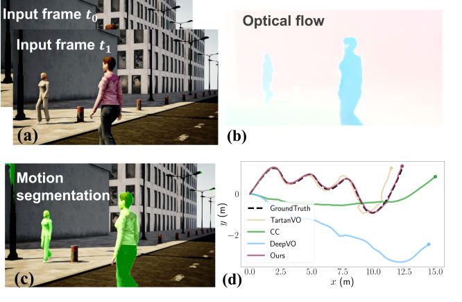

# Network_VO

这部分整理使用网络来辅助slam的论文，首先整理的部分是对于动态物体的处理(对于动态物体除去使用语义网络的方式，还有其他计算资源更小一些的方法来实现)

## TartanVO

泛化能力比较好，但是没有看出来这种模型对于dynamic的处理比较好(但是其作为端到端实现SLAM的作用还是比较work的)

## DytanVO

It is the first supervised learning-based VO method that deals with dynamic environments.(是基于TartanVO的处理方法，并且是第一个直接处理动态环境中的端到端的SLAM网络)

- 具体的思路就是两帧相邻的图像，去除相机本身的运动之后，现在图像上做光流的跟踪，残差大的部分就会认为是已经移动的部分(即可以做出来运动物体的剔除) - 提取特征点的时候只要不考虑这部分上面的特征点即可。

​	**网络的细节没有看，但是思路大致了解了。我感觉可以做一个小的尝试，如果将这个思路使用传统的方法来解决的化，会不会也可以将这些动态物体处理除去，实现更robust的效果 —— 这样在初始化的时候是不是会更稳定。**

- 这种方法在LEAP-VO中被称为trajectory-based方法，那些使用语义对动态物体进行分割的方法被成为基于视觉表面的方法(个人感觉肯定是第二种方法要更好一些)。但是这种方法的效率不是很高(因为要计算稠密光流才能判断出动态物体)

## LEAP-VO

虽然没有被开源 —— 但是这个方法主要用在处理当前场景中出现动态物体/相机存在被遮挡的情况(在Ground-challenge数据集上也专门录制了这种视觉corner case存在情景) | **另外一点是本文说是结合了segmentaion-based与trajectory-based两种方法的优点，但具体不知道是怎么结合的**

下图里面就解释了本文使用的方法与之前方法的区别: long-term point tracker中的特征点没有被跟踪到就认为这个点应该是被遮挡了。这种在pairwise里面可能会被认为是没有匹配的情况，这些点就不要了。

PS: 提出了一个新的概念 Long-term point tracker(TAP)，但是其余的部分真的没有理解。因为不知道这些anchor是怎么得到的。而且这篇论文的feature是不仅能处理动态物体，还能解决有遮挡的情况。

