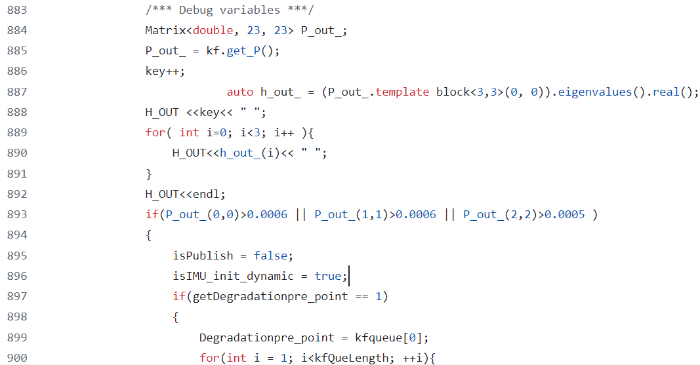

# SLAM

整理看到的Paper思路

## corner case detection

整理各种传感器的退化场景的检测方法 ——主要整理开源算法，相当于找到多种传感器失灵的情况。定性分析各种传感器失效比较简单，定量分析比较复杂

### lidar

主要由于insufficient geometric constraint(可能是某一个方向上的几何约束)

 **数据集**

1. Heterogeneous LiDAR Dataset for Benchmarking Robust Localization in Diverse Degenerate Scenarios | **将退化分成了平移退化以及旋转退化，但是没有定量分析一个场景是不是退化场景（都是强制指定一个场景中导致的退化形式）**
   - Waterways 水路 : 针对水面反射产生退化
   - Flat ground ：直接将lidar对应地面，这样其在平面足够大的情况，xy平移或者绕z轴旋转lidar会导致退化
2. 

**检测方法**

1. MM-LINS

   

2. 

### multi-sensor calibration

1. Heterogeneous LiDAR Dataset中包含了livox lidar以及 Ouster lidar与相机、imu进行了标定
   - **joint-lidar-camera-calib ：标定livox 与 camera**
   - imu_utils 标定imu

2. 

