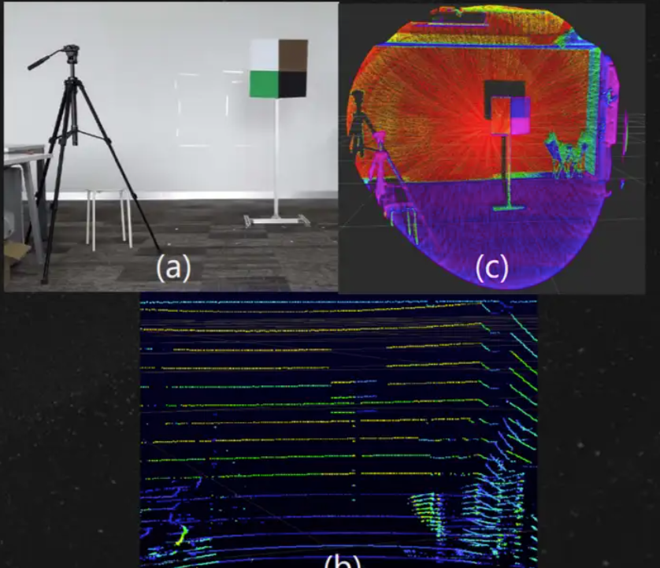

# SLAM

整理看到的Paper思路

## corner case detection

整理各种传感器的退化场景的检测方法 ——主要整理开源算法，相当于找到多种传感器失灵的情况。定性分析各种传感器失效比较简单，定量分析比较复杂。

### lidar

关于lidar匹配方法主要有两种：scan-to-scan的以及scan-to-local_map。不过由于scan一帧对应的点云量比较少，所以这里主要研究的是后者。整理关于lidar退化的检测方法，但是这里对应的开源代码很少，论文大部分都是24年的

- 2016年的开山之作(这里可以直接充当baseline) On degeneracy of optimization-based state estimation problems，目前在lvisam上可以运行m3DGR，这说明可以直接打印其对应的矩阵特征值指标进行分析.

- MM-LINS: a Multi-Map LiDAR-Inertial System for Over-Degenerate Environments
  - 开源 - 整体的处理逻辑以及复现都很简单，即检测fastlio中的关于旋转与平移的协方差矩阵，若其对应的特征值小于之前设置的阈值，即认为发生了退化

- A Point-to-distribution Degeneracy Detection Factor for LiDAR SLAM using Local Geometric Models

    - 部分开源 - 自适应变换voxel尺寸没有开源

    - **方法针对scan-to-scan的退化检测，但是在实际运行的过程中出错 (使用原始程序给定的数据集都会出错)**

- Switch-SLAM: Switching-Based LiDAR-Inertial-Visual SLAM for Degenerate Environments

- Probabilistic Degeneracy Detection for Point-to-Plane Error Minimization

    - 开源

- AdaLIO: Robust adaptive LiDAR-inertial odometry in degenerate indoor environments

    - 检测退化环境后修改参数 | **检测voxel在自身周边即认为退化，处理过于草率**

- DARE-SLAM: Degeneracy-Aware and Resilient Loop Closing in Perceptually-Degraded Environments

- GenZ-ICP: Generalizable and Degeneracy-Robust LiDAR Odometry Using an Adaptive Weighting

    - 算法开源

- Informed, constrained, aligned: A field analysis on degeneracy-aware point cloud registration in the wild

- An intensity-augmented LiDAR-inertial SLAM for solid-state LiDARs in degenerated environments

- DR-SLAM: Vision-Inertial-Aided Degenerate-Robust LiDAR SLAM Based on Dual Confidence Ellipsoid Oblateness

- Range-Aided LiDAR-Inertial Multi-Vehicle Localization and Mapping in Degenerate Environments

- Adaptive Denoising-Enhanced LiDAR Odometry for Degeneration Resilience in Diverse Terrains

- Dams-lio: A degeneration-aware and modular sensor-fusion lidar-inertial odometry

- Relead: Resilient localization with enhanced lidar odometry in adverse environments

- X-icp: Localizability-aware lidar registration for robust localization in extreme environments

    - 将lidar的定位判定为三类 (1) 完全可定位 (2) 部分可定位 (3) 不可定位

- Complementary Intensity-Augmented LiDAR Inertial Odometry

- ### [Complementary multi–modal sensor fusion for resilient robot pose estimation in subterranean environments](https://ieeexplore.ieee.org/abstract/document/9213865/)(这个主要是名字起的很好，我觉得可以用在我的小论文名字上)

- LVIO-Fusion: Tightly-Coupled LiDAR-Visual-Inertial Odometry and Mapping in Degenerate Environments

- NV-LIOM: LiDAR-Inertial Odometry and Mapping Using Normal Vectors Towards Robust SLAM in Multifloor Environments

- Fast and Accurate Deep Loop Closing and Relocalization for Reliable LiDAR SLAM(貌似跟退化环境没有关系)

- RA-LIO: A Robust Adaptive Tightly-Coupled Lidar-Inertial Odometry

- [PV-LIO](https://github.com/HViktorTsoi/PV-LIO) 这种方法是基于voxelmap的改进工作

- Graph-MSF: Graph-based Multi-sensor Fusion for Consistent Localization and State Estimation


主要由于insufficient geometric constraint(可能是某一个方向上的几何约束)

最好是实现几种lidar退化的判断方法 - 玻璃水面这种场景还是不确定是不是属于退化..至少建图上是没有分析出来


 **数据集**

1. Heterogeneous LiDAR Dataset for Benchmarking Robust Localization in Diverse Degenerate Scenarios | **将退化分成了平移退化以及旋转退化，但是没有定量分析一个场景是不是退化场景（都是强制指定一个场景中导致的退化形式）**
   - Waterways 水路 : 针对水面反射产生退化
   - Flat ground ：直接将lidar对应地面，这样其在平面足够大的情况，xy平移或者绕z轴旋转lidar会导致退化


**检测方法**

补充几篇关于激光雷达的退化检测方法（主要是A Point-to-distribution Degeneracy Detection Factor for LiDAR SLAM using Local Geometric Models这篇文章中进行分析整理的方法

- Estimating the localizability in tunnel-like environments using lidar and uwb
- Uwb/lidar coordinate matching method with anti-degeneration capability
- Detection and compensation of degeneracy cases for imu-kinect integrated continuous slam with plane features
- Robust localization and localizability estimation with a rotating laser scanner
- A localizability estimation method for mobile robots based on 3d point cloud feature
- Localizability estimation based on occupancy grid maps


看到了一种退化检测方法 VGICP 这个在GICP对应的方法中在之前使用的direct_visual_lidar_calib这个代码包的原作者中也被整理了


退化检测 —— 整体来看有一些复杂，主要感觉这里不应该出现camera这个坐标系

```cpp
bool LMOptimization(int iterCount)
    {
        // This optimization is from the original loam_velodyne by Ji Zhang, need to cope with coordinate transformation
        // lidar <- camera      ---     camera <- lidar
        // x = z                ---     x = y
        // y = x                ---     y = z
        // z = y                ---     z = x
        // roll = yaw           ---     roll = pitch
        // pitch = roll         ---     pitch = yaw
        // yaw = pitch          ---     yaw = roll

        // lidar -> camera
        float srx = sin(transformTobeMapped[1]);
        float crx = cos(transformTobeMapped[1]);
        float sry = sin(transformTobeMapped[2]);
        float cry = cos(transformTobeMapped[2]);
        float srz = sin(transformTobeMapped[0]);
        float crz = cos(transformTobeMapped[0]);

        int laserCloudSelNum = laserCloudOri->size();
        if (laserCloudSelNum < 50) {
            return false;
        }

        cv::Mat matA(laserCloudSelNum, 6, CV_32F, cv::Scalar::all(0));
        cv::Mat matAt(6, laserCloudSelNum, CV_32F, cv::Scalar::all(0));
        cv::Mat matAtA(6, 6, CV_32F, cv::Scalar::all(0));
        cv::Mat matB(laserCloudSelNum, 1, CV_32F, cv::Scalar::all(0));
        cv::Mat matAtB(6, 1, CV_32F, cv::Scalar::all(0));
        cv::Mat matX(6, 1, CV_32F, cv::Scalar::all(0));

        PointType pointOri, coeff;

        for (int i = 0; i < laserCloudSelNum; i++) {
            // lidar -> camera
            pointOri.x = laserCloudOri->points[i].y;
            pointOri.y = laserCloudOri->points[i].z;
            pointOri.z = laserCloudOri->points[i].x;
            // lidar -> camera
            coeff.x = coeffSel->points[i].y;
            coeff.y = coeffSel->points[i].z;
            coeff.z = coeffSel->points[i].x;
            coeff.intensity = coeffSel->points[i].intensity;
            // in camera
            float arx = (crx*sry*srz*pointOri.x + crx*crz*sry*pointOri.y - srx*sry*pointOri.z) * coeff.x
                      + (-srx*srz*pointOri.x - crz*srx*pointOri.y - crx*pointOri.z) * coeff.y
                      + (crx*cry*srz*pointOri.x + crx*cry*crz*pointOri.y - cry*srx*pointOri.z) * coeff.z;

            float ary = ((cry*srx*srz - crz*sry)*pointOri.x 
                      + (sry*srz + cry*crz*srx)*pointOri.y + crx*cry*pointOri.z) * coeff.x
                      + ((-cry*crz - srx*sry*srz)*pointOri.x 
                      + (cry*srz - crz*srx*sry)*pointOri.y - crx*sry*pointOri.z) * coeff.z;

            float arz = ((crz*srx*sry - cry*srz)*pointOri.x + (-cry*crz-srx*sry*srz)*pointOri.y)*coeff.x
                      + (crx*crz*pointOri.x - crx*srz*pointOri.y) * coeff.y
                      + ((sry*srz + cry*crz*srx)*pointOri.x + (crz*sry-cry*srx*srz)*pointOri.y)*coeff.z;
            // camera -> lidar
            matA.at<float>(i, 0) = arz;
            matA.at<float>(i, 1) = arx;
            matA.at<float>(i, 2) = ary;
            matA.at<float>(i, 3) = coeff.z;
            matA.at<float>(i, 4) = coeff.x;
            matA.at<float>(i, 5) = coeff.y;
            matB.at<float>(i, 0) = -coeff.intensity;
        }

        cv::transpose(matA, matAt);
        matAtA = matAt * matA;
        matAtB = matAt * matB;
        cv::solve(matAtA, matAtB, matX, cv::DECOMP_QR);

        if (iterCount == 0) {

            cv::Mat matE(1, 6, CV_32F, cv::Scalar::all(0));
            cv::Mat matV(6, 6, CV_32F, cv::Scalar::all(0));
            cv::Mat matV2(6, 6, CV_32F, cv::Scalar::all(0));

            cv::eigen(matAtA, matE, matV);
            matV.copyTo(matV2);

            isDegenerate = false;
            float eignThre[6] = {100, 100, 100, 100, 100, 100};
            for (int i = 5; i >= 0; i--) {
                if (matE.at<float>(0, i) < eignThre[i]) {
                    for (int j = 0; j < 6; j++) {
                        matV2.at<float>(i, j) = 0;
                    }
                    isDegenerate = true;
                } else {
                    break;
                }
            }
            matP = matV.inv() * matV2;
        }

        if (isDegenerate)
        {
            cv::Mat matX2(6, 1, CV_32F, cv::Scalar::all(0));
            matX.copyTo(matX2);
            matX = matP * matX2;
        }

        transformTobeMapped[0] += matX.at<float>(0, 0);
        transformTobeMapped[1] += matX.at<float>(1, 0);
        transformTobeMapped[2] += matX.at<float>(2, 0);
        transformTobeMapped[3] += matX.at<float>(3, 0);
        transformTobeMapped[4] += matX.at<float>(4, 0);
        transformTobeMapped[5] += matX.at<float>(5, 0);

        float deltaR = sqrt(
                            pow(pcl::rad2deg(matX.at<float>(0, 0)), 2) +
                            pow(pcl::rad2deg(matX.at<float>(1, 0)), 2) +
                            pow(pcl::rad2deg(matX.at<float>(2, 0)), 2));
        float deltaT = sqrt(
                            pow(matX.at<float>(3, 0) * 100, 2) +
                            pow(matX.at<float>(4, 0) * 100, 2) +
                            pow(matX.at<float>(5, 0) * 100, 2));

        if (deltaR < 0.05 && deltaT < 0.05) {
            return true; // converged
        }
        return false; // keep optimizing
    }

```


## wheel

直接使用小组中分享的论文来解决问题。大部分时候wheel出现问题都是由打滑(即空转，wheel前进距离大于实际距离)

- Pose Estimation Based on Wheel Speed Anomaly Detection in Monocular Visual-Inertial SLAM : wheel的detection方案 + 指定wheel失灵的场景进行测试

- 


## GPS

- [A high-precision vehicle navigation system based on tightly coupled PPP-RTK/INS/odometer integration](https://ieeexplore.ieee.org/abstract/document/9946857/)

- 

### multi-sensor fusion


## Paper reading

### VINS-fusion

整理在vins中遇到的处理逻辑，并且后续阅读groundfusion


### Ground-fusion


### MINS

mins支持的传感器数量很多，并支持延迟测量以及在线标定


- 多传感器的思路，并且已经开源。其使用imu作为核心部分，其他传感器作为测量值，并且加入了传感器的时空标定。**状态估计部分有些复杂**
  - **该算法的lidar部分并没有使用livox的lidar...目前本算法是只支持了机械式的lidar算法**

- 因为是使用的open_vins的标准，所以这里的四元数是JPL格式的四元数，VINS（Visual Inertial Navigation System） 中通常使用的是 Hamilton 四元数标准。这里会存在一定的区别。
    - 初始化： 静态初始化 (IMU only) + 动态初始化  (IMU+wheel)
    - 坐标系：一开始没有GNSS的时候，在初始化确定下来的world系中进行处理。当存在GNSS的时候，world系直接转移到东北天坐标系中。


关于其中clone策略: 需要被clone的数据只会是imu数据，其他传感器数据并不会执行clone。本文中的clone频率是动态改变的一种过程中，所支持的最高频率在20HZ(慢速运动的时候会降低clone频率，高速运动提高clone频率)。

- 这里最复杂的地方是如何取判断clone_time | clone_time对应的数据

- 期望clone_time与上一次使用的clone_time之间如果没有测量值的话是不会加入clone的

获取clone时间的函数为get_next_clone_time() 返回clone_time 正常情况下输出的是其他传感器对应的sensor_time(考虑到传感器上的时间延迟)应该作为下一次的clone_time(保证传感器测量时刻应该对应着imu数据保留时间)

- 主要得分析一下什么时候clone这个数组中加入新的元素...这部分比较重要


[PPCA-VINS](https://github.com/lnexenl/PPCA-VINS) 基于先验点云地图实现的vins-fusion，也是用一个作者团队开发的


目前就看到一个开源了比较多传感器数据集的dataset论文

### Ground-challenge

当前关于ground robot的数据集分析

- M2DGR

- M2DGR-plus

- OpenLORIS

- groundchallenge: 使用fastlio2充当真实值数据 | 关于录制的数据集按照场景进行划分（正常场景以及一些corner case下录制的数据集）| **并没有严格证明一个corner case就一定对定位算法产生多少影响**

    - office/room 对应的是正常场景，用于测试在正常环境中的SLAM算法
    - Visual Challenge: 亮度较低｜不同程序下的遮挡（甚至出现了全遮挡）| 快速运动（拍摄到的图像有一些模糊）
    - Wheel Odometer Challenge:  光滑平面 | rough road 运动路径出现震动
    - Motion Challenge:  提供了一些只旋转或者是之字形向前运动的场景，即认定整个运动变得困难

    

    在groundchallenge中展示视觉上的障碍(**可以将室内室外录制出来的数据集都进行一种整理, 视觉上是最容易进行展示的情况**) 


### Task-driven SLAM Benchmarking 

Task-driven SLAM Benchmarking(主要是针对benchmark文章结构的整理) —— 这里也提到了一些其他的benckmark是如何实现的

- Task-driven
- 自身录制了数据集进行处理


### PO-VINS: An Efficient and Robust Pose-Only Visual-Inertial State Estimator With LiDAR Enhancement

武大这里提供了开源代码将livox雷达融合到了vins中，但是具体的实现逻辑还不太清楚


### Coco-lic阅读


### Research on Multi-sensor Fusion Localization of Mobile  Robot Based on ROS 

viw-fusion对应的硕士论文


https://github.com/botlowhao/vwio_eskf 这部分表示的就是eskf实现定位方法


### Are We Ready for Service Robots? The OpenLORIS-Scene Datasets for Lifelong SLAM


### Heterogeneous LiDAR Dataset for Benchmarking Robust Localization in Diverse Degenerate Scenarios

多种lidar传感器


***


## Basic 

整理一些比较基础的内容

### JPL |Hamilton

- 两者都是四元数的表示方法，在vins中使用的都是Hamilton格式的四元数，但是在MSCKF以及openvins中使用的都是JPL格式的四元数。不过目前来看，Eigen 这种通用线性代数运算库用的是 Hamilton，Matlab 使用的是 Hamilton（[MathWorks: Quaternion](https://www.mathworks.com/discovery/quaternion.html)），ROS、Google Ceres Solver 也用的是 Hamilton。两者区别如下，一种是左手系一种是右手系(导致状态更新存在左乘与右乘的区别)，四元数中的w的位置还有所区别。


https://blog.csdn.net/cg129054036/article/details/119703694

https://zhuanlan.zhihu.com/p/76793847


**代码阅读**

整体上是依赖与之前的ov_core部分，但是不知道什么没有include  ov_core上面的头文件。

## 传感器

### IMU

1. 6轴传感器 三个轴的加速度+三个轴的角速度 -> 这样可以积分得到三个轴的上面的欧拉角

2. 9轴传感器 在6轴的基础上，多了三个磁力计 -> 在室内使用的效果很差

​	https://zhuanlan.zhihu.com/p/344884686


### lidar

一般来说lidar通过扫描出来的数据在尺度上比图像更大，但是数据没有相机稠密。

- 雷达数据一般包含了四个方面，也可以称其为四维即xyz+反射强度。xyz代表了扫描到的点的几何结构，反射强度可以从侧面解释物体的材质与距离。PCL的库中就有XYZI这种点云的数据格式(点云数据的整体反射率也可以衡量一个雷达性能好坏，一般会用10%的反射率的探测距离来说明)


Lidar的种类是很多的，并且Lidar的扫描结果是离散的——也就是使用lidar进行扫描的过程中，面对的物体轮廓上面只有一部分被扫描的到，每个点之间有一定的距离，所以称为离散扫描。所以在进行点云配准的时候，并不是point to point的对准(这一帧扫描到的点在下一帧中未必会被扫描到)。 

机械式雷达与livox这种非重复性的固态雷达相比： 机械式雷达生成一帧的过程中需要将探测部分旋转之后才能得到scan结果，故需要进行云哦的嗯补偿，否则会出现重影。还有一个很重要的点在与livox雷达在扫描过程中，是非重复性扫描——其意义就是机械式雷达静止在那里，每一次scan获取到的点云位置不变，而非重复扫描得到的点云数量会越来越多。




关于雷达线数的说明(主要是针对机械雷达而言，固态雷达没有传统意义上的线数)

- 线数是在垂直分布的，而且并不是均匀分布，越靠近中间部分雷达的数据量就越多。


参考连接：

1. https://zhuanlan.zhihu.com/p/102621881


#### lidar的退化环境

- 因为lidar是靠几何结构进行计算，在长直道的这种情况下, 几何结构又是很相似的部分。既计算出来的结果 —— body明显移动了，但是计算显示body没有移动


不同型号雷达 最后对应的pcl中的点云信息有什么区别

现在正在使用的雷达有如下三种

(1) m2DGR 数据集/ lvisam数据集/kitti/跨越险阻/groundchallenge  velodyne 

(2) m2DGR-plus 数据集 Robosense 16(怎么感觉没有看过关于其的调研) 速腾型号的雷达

(3) mid70(固态雷达)即livox 主要分布在港大Immesh/voxelmap/r3live这种数据集上面，在开源代码中的处理基本完成可 

(4) mid360(暂时不需要-不需要调研这部分)


rs为国内的雷达厂家, 输出的雷达数据貌似只有XYZI，缺少了 ring以及timestamp. velodyne的数据类型好看，只需要看对应的源码里面是在怎么处理并且包含了什么信息即可。

- velodyne

  ​    

- livox


这个对于体素解释的很清楚

https://blog.csdn.net/a_eastern/article/details/107508861?spm=1001.2101.3001.6650.3&utm_medium=distribute.pc_relevant.none-task-blog-2%7Edefault%7ECTRLIST%7ERate-3-107508861-blog-121698677.235%5Ev43%5Epc_blog_bottom_relevance_base1&depth_1-utm_source=distribute.pc_relevant.none-task-blog-2%7Edefault%7ECTRLIST%7ERate-3-107508861-blog-121698677.235%5Ev43%5Epc_blog_bottom_relevance_base1&utm_relevant_index=6

这个也是对于voxel的解释

https://blog.csdn.net/m0_47163076/article/details/121698677


在fast-lio中一帧点云并不是直接用到odom的递推方程中的。因为Lidar扫描一帧点云是有一个time的偏差的，在实际使用时会将一段时间的点云数据转换成一镇SCAN，然后给odom做递推（以固定采样时间间隔作为一个SCAN进行处理，而不是将整个激光帧作为一个处理单位
如一帧点云采样时间为100ms，将20ms作为一个SCAN，即将一帧激光点云变成5个SCAN）


关于pcd中保存的数据，这里对应的xyz rgb信息，其中的rgb对应的是一个无符号整数类型，然后对应的是整个部分的rgb信息。

```
# .PCD v0.7 - Point Cloud Data file format
VERSION 0.7
FIELDS x y z rgb
SIZE 4 4 4 4
TYPE F F F U
COUNT 1 1 1 1
WIDTH 3925315
HEIGHT 1
VIEWPOINT 0 0 0 1 0 0 0
POINTS 3925315
DATA ascii
6.4672627 78.574593 -0.25317496 4282730555
10.256534 77.851814 1.1185876 4283524917
2.9052517 79.031265 0.20551738 4278453252
2.9047186 79.014641 -1.6342744 4281545532
```


