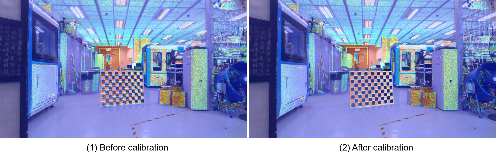

# mySLAM

整理我准备的两部分 1. benckmark  2. 车辆定位


## 前端

主要关于corner case的检测以及处理方式 

### 1. 视觉

- 特征点(光照不够或者低纹理)：无非就是特征点数量不够或者完全没有特征点
- 

### 2. 轮计

在groundfusion涉及到了两种wheel odometer的缺点 —— 1. 其测量的角速度不准确 2. 打滑状态

- 对于角速度不准确，就直接使用相邻的IMU测量结果对于wheel测量结果进行插值

    

- 并且通过比较IMU预积分与wheel预积分之间的区别解决打滑问题

### 3. 雷达

**[LiDAR_IMU_Init](https://github.com/hku-mars/LiDAR_IMU_Init)** IROS 2022 一种直接使用lidar imu进行初始化的方法

### 4. GPS


## 后端


## 标定

### lidar camera标定

一共就尝试了两种方法,后面那种方法使用起来特别方便,而且计算出来的结果也是比较准确的

1. livox_camera_calib

    - 标定最后结果是lidar到相机的变换关系

    - 环境中不能存在太多平行线条（最好是在室外中录制数据集，整个场景的结构信息足够明确）

    - 可以使用单一场景点云，也可以使用多种场景下的点云

    - mid360雷达需要先累积然后再使用(单帧mid360点云过于稀疏)，**github issue中存在不少关于Mid360标定的问题**

    - 对于纹理与几何信息比较明确的场景，在标定前后可以发现几何关系上存在一个对齐关系，即可以在最后的结果中比较标定结果，很直观地判断标定结果是否合理。**但是在实际使用中感觉投影结果比较差，计算出来的位姿也是不准确的**



2. direct_visual_lidar_calibration 

    - 直接使用docker中安装的方式进行使用，因为算法本身需要ceres-solver的版本在2.10，但是本机中安装的ceres一般在1.14。而且不同版本的ceres对于glog版本的需求也是不一样的，弄起来特别麻烦，直接在docker中使用是最简单的方法了。

    - 本方法相当于是将lidar点云累积出来形成一张图像，相机获取的图像与点云图像上选择对应点，使用对应点计算变换关系。**可以拖动三个轴上面的取值去裁剪点云（即下图黑色区域就是被裁剪的点云）**
    
    - 在选择图像与点云的对应点上只需要选择5~10个点即可


##　评价指标

### 室内数据集

室内数据集: 利用aruco marker进行室内数据集真实值的比较。aruco属于一种用黑白块生成的标志，又很多type类型(比如 DICT_6X6_250 属于是6*6的黑白块形成这个aruco标志，一种有250中排列)。一般以左下角为aruco板的坐标系原点，往右x，往上y，从纸面向外射出为z。每一个aurco都是唯一的


**标定板生成**

- 首先定义A4纸大小的标定板, 人为认定实际物理中的尺寸对应的像素点的数量（1英寸对应300像素点）。因为是需要打印出来，尺寸难免有偏差，这里直接定义个一个board先生成出来。**打印机或者opencv算法都有可能出现缩放，所以这里参数设定只能设置大概**

```python
# import cv2
# import numpy as np
#
# # Aruco板参数
# markersX = 3           # X轴上标记的数量
# markersY = 4           # Y轴上标记的数量
# markerLength = 0.04      # 标记的长度，单位是米
# markerSeparation = 0.01  # 每个标记之间的间隔，单位是米
# margins = markerSeparation  # 标记与边界之间的间隔(最小边距)
# borderBits = 1         # 标记的边界所占的bit位数(这个参数感觉作用不是很大)
#
# # A4纸的大小（单位：像素，300 DPI下）
# # A4_width_px = 2480
# # A4_height_px = 3508
#
# A4_width_px = 800 * 8.27  # 8.27英寸宽 (A4)
# A4_height_px = 800 * 11.69  # 11.69英寸高 (A4)
#
# # 使用Aruco的6x6字典
# dictionary = cv2.aruco.Dictionary_get(cv2.aruco.DICT_6X6_250)
#
# # 创建网格标定板
# board = cv2.aruco.GridBoard_create(
#     markersX, markersY, float(markerLength), float(markerSeparation), dictionary
# )
#
# # 画出标定板 # 最终图像尺寸大小为board，并且输出一张图像，图像要大于board的区域，并且保证board会出现在图像中心 |  这里应该直接指定了输出图像的大小
# img = board.draw((int(A4_width_px), int(A4_height_px)), marginSize=int(margins), borderBits=borderBits)
#
# # 保存图像
# cv2.imwrite('aruco_A4.png', img)
```


**位姿计算**

- 首先计算每一帧中aruco board相对于相机系的变换关系 —— 相当于在相机光心那个位置观察aruco board，计算这个变换关系。那么就可以以这个相机为世界系，计算其中两个位置处的aruco board标定板之间的变换关系。
    - 这里需要依赖之前创建好的board对象，以及检测出来的aruco的顶点

```python
retval, rvec, tvec = cv2.aruco.estimatePoseBoard(corners, ids, board, cameraMatrix, distCoeffs[, rvec[, tvec]])
```

- 最终代码如下，**其中定义的board按照打印出来的尺存写入即可，board = cv.aruco.GridBoard_create(3, 4, 0.044, 0.006, markerDict) 分别为x轴marker数量，y轴marker数量，每一个marker大小，marker之间的间隔，单位都是m**

    ```python
    import cv2 as cv
    import numpy as np
    
    # 初始化变量：前一帧的旋转和平移向量
    previous_rvec = None
    previous_tvec = None
    
    # 函数：计算两帧之间的相对变换
    def compute_relative_transform(current_rvec, current_tvec, previous_rvec, previous_tvec):
        # 将旋转向量转换为旋转矩阵
        R_current, _ = cv.Rodrigues(current_rvec)  # 当前帧的旋转矩阵
        R_previous, _ = cv.Rodrigues(previous_rvec)  # 上一帧的旋转矩阵
    
        # 计算相对旋转矩阵
        R_relative = R_current @ R_previous.T  # R_current * R_previous^T（矩阵乘法）
    
        # 计算相对平移向量
        t_relative = current_tvec - R_relative @ previous_tvec
    
        return R_relative, t_relative
    
    def process_image(image_path, cameraMatrix, distCoeffs, board, markerDict):
        # 读取图像
        inputImg = cv.imread(image_path)
        if inputImg is None:
            print(f"无法读取图像文件: {image_path}")
            return None, None
    
        # 转换为灰度图像
        gray = cv.cvtColor(inputImg, cv.COLOR_BGR2GRAY)
    
        # 检测 Aruco 标记
        corners, ids, reject = cv.aruco.detectMarkers(gray, markerDict, cameraMatrix=cameraMatrix, distCoeff=distCoeffs)
    
        # 如果检测到至少一个标记
        if len(corners) > 0 and len(ids) > 0:
            # 估计标定板的位姿，传递 None 让 OpenCV 生成 rvec 和 tvec
            success, rvec, tvec = cv.aruco.estimatePoseBoard(corners, ids, board, cameraMatrix, distCoeffs, None, None)
            if success > 0:
                # 绘制检测到的标记和坐标轴
                cv.aruco.drawAxis(inputImg, cameraMatrix, distCoeffs, rvec, tvec, 0.1)
                cv.aruco.drawDetectedMarkers(inputImg, corners, ids)
                # 显示图像用于调试
                cv.imshow(f"Image: {image_path}", inputImg)
                cv.waitKey(0) # 等待按键关闭窗口
                return rvec, tvec
            else:
                print(f"无法估计标定板的位姿: {image_path}")
        else:
            print(f"未检测到任何标记: {image_path}")
    
        return None, None
    
    def mainFunc():
        global previous_rvec, previous_tvec
    
        # 相机内参矩阵（假设已知）
        cameraMatrix = np.array([[384.930755615234, 0, 323.768859863281],
                                 [0, 384.930755615234, 233.164978027344],
                                 [0., 0., 1.0]], np.float32)
    
        # 畸变系数（假设已知）
        distCoeffs = np.array([0.0, 0.0, 0.0, 0.0, 0.0])
    
        # Aruco标记字典和标定板
        markerDict = cv.aruco.getPredefinedDictionary(cv.aruco.DICT_6X6_250)
        # 这里与之前创建处的board对象进行对应
        board = cv.aruco.GridBoard_create(3, 4, 0.044, 0.006, markerDict)
    
        # 读取两帧图像
        image1_path = 'image_1.png'  # 替换为第一帧的图像路径
        image2_path = 'image_2.png'  # 替换为第二帧的图像路径
    
        # 处理第一帧图像
        previous_rvec, previous_tvec = process_image(image1_path, cameraMatrix, distCoeffs, board, markerDict)
    
        if previous_rvec is None or previous_tvec is None:
            print("无法处理第一帧图像")
            return
    
        # 处理第二帧图像
        current_rvec, current_tvec = process_image(image2_path, cameraMatrix, distCoeffs, board, markerDict)
    
        if current_rvec is None or current_tvec is None:
            print("无法处理第二帧图像")
            return
    
        # 计算两帧之间的相对变换
        R_relative, t_relative = compute_relative_transform(current_rvec, current_tvec, previous_rvec, previous_tvec)
    
        print("两帧之间的相对旋转矩阵：\n", R_relative)
        print("两帧之间的相对平移向量：\n", t_relative)
    
    if __name__ == "__main__":
        print("注意这里使用cv.imshow()弹出来的图像需要按0之后,整个程序才能继续往下执行")
        print("每一张图像都首先计算其到相机的变换矩阵")
        mainFunc()
    
    # 关闭所有窗口
    cv.destroyAllWindows()
    ```

 

## 常用脚本

### 获取图像数据

```cpp
#include <ros/ros.h>
#include <image_transport/image_transport.h>
#include <cv_bridge/cv_bridge.h>
#include <sensor_msgs/image_encodings.h>
#include <opencv2/opencv.hpp>
#include <sstream>  // 用于生成文件名
#include <iomanip>  // 用于格式化文件名中的时间戳

// 用于跟踪接收到的图像数量
int image_count = 0;

void imageCallback(const sensor_msgs::ImageConstPtr& msg)
{
    // try
    // {
        // 打印接收到的图像信息
        ROS_INFO("Received image with encoding: %s, width: %d, height: %d",
                 msg->encoding.c_str(), msg->width, msg->height);

        // 将ROS图像消息转换为OpenCV格式
        cv_bridge::CvImagePtr cv_ptr;
        cv_ptr = cv_bridge::toCvCopy(msg, sensor_msgs::image_encodings::BGR8);

        // 获取当前时间作为时间戳
        ros::Time current_time = ros::Time::now();
        std::stringstream ss;
        ss << "image_" << std::setfill('0') << std::setw(4) << image_count << "_"
           << current_time.sec << "_" << current_time.nsec << ".png";

        // 保存图像到本地
        cv::imwrite(ss.str(), cv_ptr->image);
        ROS_INFO("Saved image to %s", ss.str().c_str());

        // 增加图像计数
        image_count++;
    // }
    // catch (cv_bridge::Exception& e)
    // {
    //     ROS_ERROR("cv_bridge exception: %s", e.what());
    //     return;
    // }
}
int main(int argc, char** argv)
{
    // 初始化ROS节点
    ros::init(argc, argv, "image_saver");
    ros::NodeHandle nh;

    // 使用image_transport来订阅图像话题
    image_transport::ImageTransport it(nh);
    image_transport::Subscriber sub = it.subscribe("/camera/color/image_raw", 1, imageCallback);

    // 进入ROS事件循环
    ros::spin();

    return 0;
}

```


