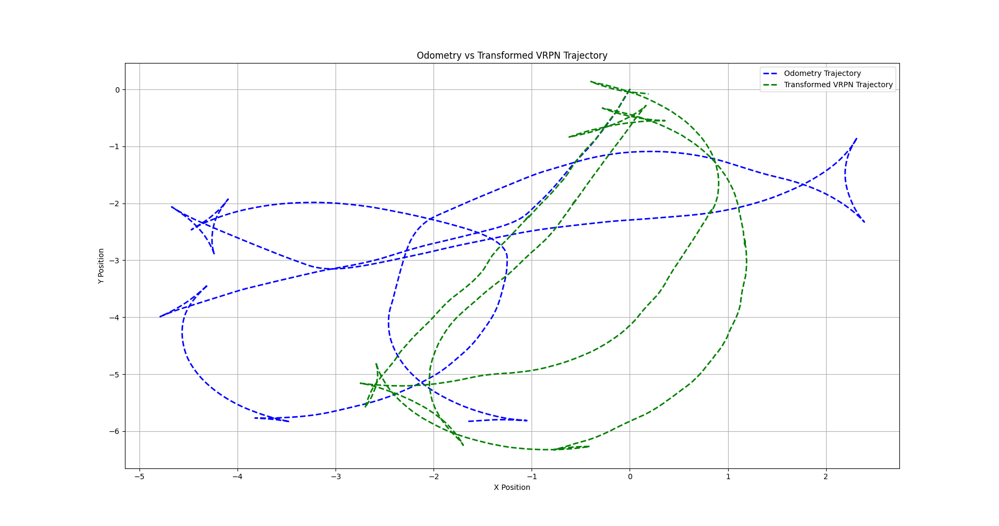

# mySLAM

整理我准备的两部分 1. benckmark  2. 车辆定位


## 前端

主要关于corner case的检测以及处理方式 

### 1. 视觉

- 特征点(光照不够或者低纹理)：无非就是特征点数量不够或者完全没有特征点
- 

### 2. 轮计

在groundfusion涉及到了两种wheel odometer的缺点 —— 1. 其测量的角速度不准确 2. 打滑状态

- 对于角速度不准确，就直接使用相邻的IMU测量结果对于wheel测量结果进行插值

    

- 并且通过比较IMU预积分与wheel预积分之间的区别解决打滑问题

### 3. 雷达

**[LiDAR_IMU_Init](https://github.com/hku-mars/LiDAR_IMU_Init)** IROS 2022 一种直接使用lidar imu进行初始化的方法

### 4. GPS


## 后端


## 数据集

记录数据集录制的相关信息

- wheel odometer 话题为 /odom 对应的消息类型为nav_msgs/Odometry，其分别对应了pose以及twist信息(即速度)
    - pose中对应的xyz分别代表 前后位移，左右位移，以及绕z轴的旋转 | **这里是基于阿卡曼模型计算出来的**
    - orientation只有zw部分有数据 | **不知道这里是如何计算得到的...可能是直接利用角速度计算累积出来的，只有绕z轴上的姿态变换**
    - twist中只有后轮驱动轮，因为其固连到车体上，故只有x方向上的速度。从xy平面的角度，可以得知其只有z轴上的角速度。

```
header: 
  seq: 2591
  stamp: 
    secs: 1731834267
    nsecs: 388571525
  frame_id: "odom_combined"
child_frame_id: "base_footprint"
pose: 
  pose: 
    position: 
      x: 1.9640908241271973
      y: -0.4447060227394104
      z: -0.16158169507980347
    orientation: 
      x: 0.0
      y: 0.0
      z: -0.08070298707328265
      w: 0.9967381942503506
  covariance: [0.001, 0.0, 0.0, 0.0, 0.0, 0.0, 0.0, 0.001, 0.0, 0.0, 0.0, 0.0, 0.0, 0.0, 1000000.0, 0.0, 0.0, 0.0, 0.0, 0.0, 0.0, 1000000.0, 0.0, 0.0, 0.0, 0.0, 0.0, 0.0, 1000000.0, 0.0, 0.0, 0.0, 0.0, 0.0, 0.0, 1000.0]
twist: 
  twist: 
    linear: 
      x: 0.2619999945163727
      y: 0.0
      z: 0.0
    angular: 
      x: 0.0
      y: 0.0
      z: 0.07900000363588333
  covariance: [0.001, 0.0, 0.0, 0.0, 0.0, 0.0, 0.0, 0.001, 0.0, 0.0, 0.0, 0.0, 0.0, 0.0, 1000000.0, 0.0, 0.0, 0.0, 0.0, 0.0, 0.0, 1000000.0, 0.0, 0.0, 0.0, 0.0, 0.0, 0.0, 1000000.0, 0.0, 0.0, 0.0, 0.0, 0.0, 0.0, 1000.0]

```


分析轮计部分对应的轨迹(进行了坐标系变换以及原点对齐)

- 第一张图对应wheel退化场景，分析当前录制的wheel与真实值vrpn之间的区别，可以发现这个轨迹差别非常大
- 第二张对应的是wheel应该正常的场景，但是轨迹差别同样差别很大，在第一次转弯之后整个wheel就直接漂移了




### 录制结果

首先分析真值是否会出现丢帧的问题

**visual**

**wheel**

- 空转的第一个数据明显出现丢帧问题，在分析vrpn数据中明显有一个波动


## 标定

### lidar camera标定

一共就尝试了两种方法,后面那种方法使用起来特别方便,而且计算出来的结果也是比较准确的

1. livox_camera_calib

    - 标定最后结果是lidar到相机的变换关系

    - 环境中不能存在太多平行线条（最好是在室外中录制数据集，整个场景的结构信息足够明确）

    - 可以使用单一场景点云，也可以使用多种场景下的点云

    - mid360雷达需要先累积然后再使用(单帧mid360点云过于稀疏)，**github issue中存在不少关于Mid360标定的问题**

    - 对于纹理与几何信息比较明确的场景，在标定前后可以发现几何关系上存在一个对齐关系，即可以在最后的结果中比较标定结果，很直观地判断标定结果是否合理。**但是在实际使用中感觉投影结果比较差，计算出来的位姿也是不准确的**


2. direct_visual_lidar_calibration 

    - 直接使用docker中安装的方式进行使用，因为算法本身需要ceres-solver的版本在2.10，但是本机中安装的ceres一般在1.14。而且不同版本的ceres对于glog版本的需求也是不一样的，弄起来特别麻烦，直接在docker中使用是最简单的方法了。

    - 本方法相当于是将lidar点云累积出来形成一张图像，相机获取的图像与点云图像上选择对应点，使用对应点计算变换关系。**可以拖动三个轴上面的取值去裁剪点云（即下图黑色区域就是被裁剪的点云）**
    
    - 在选择图像与点云的对应点上只需要选择5~10个点即可


##　评价指标

### evo使用

- 原点对齐

    ```cpp
    evo_ape tum pose_output_tum.txt odom_output_tum.txt  --plot --plot_mode xyz --align_origin
    ```

- 输出对齐中使用的旋转平移关系 —— 输出的旋转矩阵一定是相似变换。**这里感觉在对齐中计算出来的R矩阵应该是让两个轨迹整体的误差最小，所以对于轨迹相差非常大的情况下，计算出来的R成为两个轨迹之间的变换关系**

    - -a 为对齐: 对应从odom到pose的变换关系
    - -v 将变换关系显示出来
    - -p 绘制图像 
    - --save_as_tum: 将两个对齐之后的轨迹转换成为tum格式输出

    ```cpp
    evo_traj tum odom_output_tum.txt --ref pose_output_tum.txt-vap  --save_as_tum
    ```

    


PS: 参考

1. https://blog.csdn.net/qq_49561752/article/details/141506803?spm=1001.2101.3001.6650.3&utm_medium=distribute.pc_relevant.none-task-blog-2%7Edefault%7EYuanLiJiHua%7EPosition-3-141506803-blog-131771589.235%5Ev43%5Epc_blog_bottom_relevance_base9&depth_1-utm_source=distribute.pc_relevant.none-task-blog-2%7Edefault%7EYuanLiJiHua%7EPosition-3-141506803-blog-131771589.235%5Ev43%5Epc_blog_bottom_relevance_base9
2. https://blog.csdn.net/OrdinaryMatthew/article/details/131771589


### 室内

***

**python环境配置**

```
pip install numpy==1.21.0 opencv-python==4.5.1.48 opencv-contrib-python==4.5.1.48
```

每次想直接使用这部分代码的时候需要修改bashrc将conda对应的部分开启，并且重新source ~/.bashrc

***

室内评价指标: 利用aruco marker进行室内数据集真实值的比较。aruco属于一种用黑白块生成的标志，又很多type类型(比如 DICT_6X6_250 属于是6*6的黑白块形成这个aruco标志，一种有250中排列)。一般以左下角为aruco板的坐标系原点，往右x，往上y，从纸面向外射出为z。每一个aurco都是唯一的


**标定板生成**

- 首先定义A4纸大小的标定板, 人为认定实际物理中的尺寸对应的像素点的数量（1英寸对应300像素点）。因为是需要打印出来，尺寸难免有偏差，这里直接定义个一个board先生成出来。**打印机或者opencv算法都有可能出现缩放，所以这里参数设定只能设置大概**

```python
# import cv2
# import numpy as np
#
# # Aruco板参数
# markersX = 3           # X轴上标记的数量
# markersY = 4           # Y轴上标记的数量
# markerLength = 0.04      # 标记的长度，单位是米
# markerSeparation = 0.01  # 每个标记之间的间隔，单位是米
# margins = markerSeparation  # 标记与边界之间的间隔(最小边距)
# borderBits = 1         # 标记的边界所占的bit位数(这个参数感觉作用不是很大)
#
# # A4纸的大小（单位：像素，300 DPI下）
# # A4_width_px = 2480
# # A4_height_px = 3508
#
# A4_width_px = 800 * 8.27  # 8.27英寸宽 (A4)
# A4_height_px = 800 * 11.69  # 11.69英寸高 (A4)
#
# # 使用Aruco的6x6字典
# dictionary = cv2.aruco.Dictionary_get(cv2.aruco.DICT_6X6_250)
#
# # 创建网格标定板
# board = cv2.aruco.GridBoard_create(
#     markersX, markersY, float(markerLength), float(markerSeparation), dictionary
# )
#
# # 画出标定板 # 最终图像尺寸大小为board，并且输出一张图像，图像要大于board的区域，并且保证board会出现在图像中心 |  这里应该直接指定了输出图像的大小
# img = board.draw((int(A4_width_px), int(A4_height_px)), marginSize=int(margins), borderBits=borderBits)
#
# # 保存图像
# cv2.imwrite('aruco_A4.png', img)
```


**位姿计算**

- 首先计算每一帧中aruco board相对于相机系的变换关系 —— 相当于在相机光心那个位置观察aruco board，计算这个变换关系。那么就可以以这个相机为世界系，计算其中两个位置处的aruco board标定板之间的变换关系。
    - 这里需要依赖之前创建好的board对象，以及检测出来的aruco的顶点

```python
retval, rvec, tvec = cv2.aruco.estimatePoseBoard(corners, ids, board, cameraMatrix, distCoeffs[, rvec[, tvec]])
```

- 最终代码如下，**其中定义的board按照打印出来的尺存写入即可，board = cv.aruco.GridBoard_create(3, 4, 0.044, 0.006, markerDict) 分别为x轴marker数量，y轴marker数量，每一个marker大小，marker之间的间隔，单位都是m**

    ```python
    import cv2 as cv
    import numpy as np
    
    # 初始化变量：前一帧的旋转和平移向量
    previous_rvec = None
    previous_tvec = None
    
    # 函数：计算两帧之间的相对变换
    def compute_relative_transform(current_rvec, current_tvec, previous_rvec, previous_tvec):
        # 将旋转向量转换为旋转矩阵
        R_current, _ = cv.Rodrigues(current_rvec)  # 当前帧的旋转矩阵
        R_previous, _ = cv.Rodrigues(previous_rvec)  # 上一帧的旋转矩阵
    
        # 计算相对旋转矩阵
        R_relative = R_current @ R_previous.T  # R_current * R_previous^T（矩阵乘法）
    
        # 计算相对平移向量
        t_relative = current_tvec - R_relative @ previous_tvec
    
        return R_relative, t_relative
    
    def process_image(image_path, cameraMatrix, distCoeffs, board, markerDict):
        # 读取图像
        inputImg = cv.imread(image_path)
        if inputImg is None:
            print(f"无法读取图像文件: {image_path}")
            return None, None
    
        # 转换为灰度图像
        gray = cv.cvtColor(inputImg, cv.COLOR_BGR2GRAY)
    
        # 检测 Aruco 标记
        corners, ids, reject = cv.aruco.detectMarkers(gray, markerDict, cameraMatrix=cameraMatrix, distCoeff=distCoeffs)
    
        # 如果检测到至少一个标记
        if len(corners) > 0 and len(ids) > 0:
            # 估计标定板的位姿，传递 None 让 OpenCV 生成 rvec 和 tvec
            success, rvec, tvec = cv.aruco.estimatePoseBoard(corners, ids, board, cameraMatrix, distCoeffs, None, None)
            if success > 0:
                # 绘制检测到的标记和坐标轴
                cv.aruco.drawAxis(inputImg, cameraMatrix, distCoeffs, rvec, tvec, 0.1)
                cv.aruco.drawDetectedMarkers(inputImg, corners, ids)
                # 显示图像用于调试
                cv.imshow(f"Image: {image_path}", inputImg)
                cv.waitKey(0) # 等待按键关闭窗口
                return rvec, tvec
            else:
                print(f"无法估计标定板的位姿: {image_path}")
        else:
            print(f"未检测到任何标记: {image_path}")
    
        return None, None
    
    def mainFunc():
        global previous_rvec, previous_tvec
    
        # 相机内参矩阵（假设已知）
        cameraMatrix = np.array([[384.930755615234, 0, 323.768859863281],
                                 [0, 384.930755615234, 233.164978027344],
                                 [0., 0., 1.0]], np.float32)
    
        # 畸变系数（假设已知）
        distCoeffs = np.array([0.0, 0.0, 0.0, 0.0, 0.0])
    
        # Aruco标记字典和标定板
        markerDict = cv.aruco.getPredefinedDictionary(cv.aruco.DICT_6X6_250)
        # 这里与之前创建处的board对象进行对应
        board = cv.aruco.GridBoard_create(3, 4, 0.044, 0.006, markerDict)
    
        # 读取两帧图像
        image1_path = 'image_1.png'  # 替换为第一帧的图像路径
        image2_path = 'image_2.png'  # 替换为第二帧的图像路径
    
        # 处理第一帧图像
        previous_rvec, previous_tvec = process_image(image1_path, cameraMatrix, distCoeffs, board, markerDict)
    
        if previous_rvec is None or previous_tvec is None:
            print("无法处理第一帧图像")
            return
    
        # 处理第二帧图像
        current_rvec, current_tvec = process_image(image2_path, cameraMatrix, distCoeffs, board, markerDict)
    
        if current_rvec is None or current_tvec is None:
            print("无法处理第二帧图像")
            return
    
        # 计算两帧之间的相对变换
        R_relative, t_relative = compute_relative_transform(current_rvec, current_tvec, previous_rvec, previous_tvec)
    
        print("两帧之间的相对旋转矩阵：\n", R_relative)
        print("两帧之间的相对平移向量：\n", t_relative)
    
    if __name__ == "__main__":
        print("注意这里使用cv.imshow()弹出来的图像需要按0之后,整个程序才能继续往下执行")
        print("每一张图像都首先计算其到相机的变换矩阵")
        mainFunc()
    
    # 关闭所有窗口
    cv.destroyAllWindows()
    ```

 


## 常用脚本

### 获取图像数据

```cpp
#include <ros/ros.h>
#include <image_transport/image_transport.h>
#include <cv_bridge/cv_bridge.h>
#include <sensor_msgs/image_encodings.h>
#include <opencv2/opencv.hpp>
#include <sstream>  // 用于生成文件名
#include <iomanip>  // 用于格式化文件名中的时间戳

// 用于跟踪接收到的图像数量
int image_count = 0;

void imageCallback(const sensor_msgs::ImageConstPtr& msg)
{
    // try
    // {
        // 打印接收到的图像信息
        ROS_INFO("Received image with encoding: %s, width: %d, height: %d",
                 msg->encoding.c_str(), msg->width, msg->height);

        // 将ROS图像消息转换为OpenCV格式
        cv_bridge::CvImagePtr cv_ptr;
        cv_ptr = cv_bridge::toCvCopy(msg, sensor_msgs::image_encodings::BGR8);

        // 获取当前时间作为时间戳
        ros::Time current_time = ros::Time::now();
        std::stringstream ss;
        ss << "image_" << std::setfill('0') << std::setw(4) << image_count << "_"
           << current_time.sec << "_" << current_time.nsec << ".png";

        // 保存图像到本地
        cv::imwrite(ss.str(), cv_ptr->image);
        ROS_INFO("Saved image to %s", ss.str().c_str());

        // 增加图像计数
        image_count++;
    // }
    // catch (cv_bridge::Exception& e)
    // {
    //     ROS_ERROR("cv_bridge exception: %s", e.what());
    //     return;
    // }
}
int main(int argc, char** argv)
{
    // 初始化ROS节点
    ros::init(argc, argv, "image_saver");
    ros::NodeHandle nh;

    // 使用image_transport来订阅图像话题
    image_transport::ImageTransport it(nh);
    image_transport::Subscriber sub = it.subscribe("/camera/color/image_raw", 1, imageCallback);

    // 进入ROS事件循环
    ros::spin();

    return 0;
}

```


### 绘制轨迹

将vrpn轨迹转换到wheel坐标系下(转换关系从转换evo轨迹的脚本，读取前面一段误差比较小的轨迹中计算出来的转换矩阵获取)，转换完轨迹之后将两个轨迹在原点对齐，并绘制轨迹

```python
#!/usr/bin/env python3
import rospy
from nav_msgs.msg import Odometry
from geometry_msgs.msg import PoseStamped
import csv
import matplotlib.pyplot as plt
import numpy as np

# 初始化里程计轨迹和真实轨迹列表
odom_trajectory = []
vrpn_trajectory = []
transformed_vrpn_trajectory = []  # 存储转换后的VRPN轨迹

# 旋转矩阵 (3x3) 和平移向量 (3x1)
# 假设 VRPN 坐标系到里程计坐标系的旋转和平移
R = np.array([[-0.97143256, -0.23731577, 0],   # 旋转矩阵（根据实际情况修改）
              [0.23731577, -0.97143256, 0],
              [0, 0, 1]])

t = np.array([3.31531503, 0.56754849, 0])  # 平移向量（根据实际情况修改）

# 将 VRPN 坐标转换到里程计坐标系
def transform_vrpn_to_odom(vrpn_point):
    vrpn_point_np = np.array(vrpn_point).reshape(3, 1)  # 将点转为列向量
    transformed_point = np.dot(R, vrpn_point_np) + t.reshape(3, 1)
    return transformed_point.flatten()  # 将结果展平成一维数组

# 平移轨迹的起点到 (0, 0)
def shift_trajectory_to_origin(trajectory):
    if len(trajectory) == 0:
        return trajectory  # 如果轨迹为空，直接返回
    start_point = trajectory[0]  # 取第一个点
    shift_x, shift_y, shift_z = start_point  # 获取需要平移的量
    shifted_trajectory = [(x - shift_x, y - shift_y, z - shift_z) for (x, y, z) in trajectory]
    return shifted_trajectory

# 回调函数：处理接收到的里程计数据 (Odometry)
def odometry_callback(data):
    # 提取里程计中的位置信息
    x = data.pose.pose.position.x
    y = data.pose.pose.position.y
    z = data.pose.pose.position.z
    
    # 将位置信息添加到里程计轨迹中
    odom_trajectory.append((x, y, z))
    
    # 打印提示信息
    rospy.loginfo(f"Received Odometry data: x = {x:.2f}, y = {y:.2f}, z = {z:.2f}")

# 回调函数：处理接收到的真实值数据 (geometry_msgs/PoseStamped)
def vrpn_callback(data):
    # 提取真实值中的位置信息 (VRPN)
    x = data.pose.position.x
    y = data.pose.position.y
    z = data.pose.position.z
    
    # 将真实位置信息添加到 VRPN 轨迹中
    vrpn_trajectory.append((x, y, z))
    
    # 打印提示信息
    rospy.loginfo(f"Received VRPN data: x = {x:.2f}, y = {y:.2f}, z = {z:.2f}")

# 主函数：订阅 /odom 和 /vrpn_client_node/uav1/pose 话题
def listener():
    # 初始化 ROS 节点
    rospy.init_node('trajectory_listener', anonymous=True)
    
    # 订阅里程计数据
    rospy.Subscriber("/odom", Odometry, odometry_callback)
    
    # 订阅真实值数据 (VRPN)
    rospy.Subscriber("/vrpn_client_node/uav1/pose", PoseStamped, vrpn_callback)
    
    # 保持节点运行，直到按下 Ctrl+C
    rospy.spin()

# 保存轨迹到文件 (覆盖模式)
def save_trajectory_to_file(filename, trajectory):
    with open(filename, mode='w') as file:  # 使用 'w' 模式覆盖内容
        writer = csv.writer(file)
        writer.writerow(["x", "y", "z"])  # 写入表头
        writer.writerows(trajectory)  # 写入轨迹点

# 从文件读取轨迹
def read_trajectory_from_file(filename):
    loaded_trajectory = []
    with open(filename, mode='r') as file:
        reader = csv.reader(file)
        next(reader)  # 跳过表头
        for row in reader:
            x, y, z = map(float, row)
            loaded_trajectory.append((x, y, z))
    return loaded_trajectory

# 绘制轨迹对比（转换后的 VRPN 轨迹与里程计轨迹）
def plot_trajectory(odom_trajectory, transformed_vrpn_trajectory):
    # 提取里程计轨迹中的 x 和 y 坐标
    odom_x_coords = [point[0] for point in odom_trajectory]
    odom_y_coords = [point[1] for point in odom_trajectory]

    # 提取转换后 VRPN 轨迹中的 x 和 y 坐标
    vrpn_x_coords = [point[0] for point in transformed_vrpn_trajectory]
    vrpn_y_coords = [point[1] for point in transformed_vrpn_trajectory]

    # 绘制里程计轨迹
    plt.plot(odom_x_coords, odom_y_coords, label='Odometry Trajectory', linestyle='--', color='b', linewidth=2)
    
    # 绘制转换后的 VRPN 轨迹
    plt.plot(vrpn_x_coords, vrpn_y_coords, label='Transformed VRPN Trajectory', linestyle='--', color='g', linewidth=2)

    # 图表设置
    plt.title('Odometry vs Transformed VRPN Trajectory')
    plt.xlabel('X Position')
    plt.ylabel('Y Position')
    plt.legend()
    plt.grid(True)
    plt.show()

if __name__ == '__main__':
    try:
        # 启动节点并开始监听
        listener()
    except rospy.ROSInterruptException:
        pass
    finally:
        # 收到所有数据后进行 VRPN 轨迹的转换
        rospy.loginfo("Transforming VRPN data to Odometry coordinate system...")
        transformed_vrpn_trajectory = [transform_vrpn_to_odom(point) for point in vrpn_trajectory]
        
        # 修正里程计轨迹和转换后的 VRPN 轨迹，使起点为 (0, 0)
        rospy.loginfo("Shifting trajectories to start at (0, 0)...")
        odom_trajectory = shift_trajectory_to_origin(odom_trajectory)
        transformed_vrpn_trajectory = shift_trajectory_to_origin(transformed_vrpn_trajectory)
        
        # 保存修正后的轨迹
        odom_trajectory_file = "/home/supercoconut/Myfile/tool/plot/src/plot/result/odom_trajectory.txt"
        transformed_vrpn_trajectory_file = "/home/supercoconut/Myfile/tool/plot/src/plot/result/vrpn_trajectory.txt"
        
        save_trajectory_to_file(odom_trajectory_file, odom_trajectory)
        save_trajectory_to_file(transformed_vrpn_trajectory_file, transformed_vrpn_trajectory)
        
        # 从文件读取轨迹数据
        loaded_odom_trajectory = read_trajectory_from_file(odom_trajectory_file)
        loaded_transformed_vrpn_trajectory = read_trajectory_from_file(transformed_vrpn_trajectory_file)
        
        # 绘制轨迹对比
        plot_trajectory(loaded_odom_trajectory, loaded_transformed_vrpn_trajectory)
    # 只绘制轨迹，不开启ros节点
    # odom_trajectory_file = "/home/supercoconut/Myfile/tool/plot/src/plot/result/odom_trajectory.txt"  # 请替换为实际路径
    # transformed_vrpn_trajectory_file = "/home/supercoconut/Myfile/tool/plot/src/plot/result/vrpn_trajectory.txt"  # 请替换为实际路径

    # # 从文件读取轨迹数据
    # loaded_odom_trajectory = read_trajectory_from_file(odom_trajectory_file)
    # loaded_transformed_vrpn_trajectory = read_trajectory_from_file(transformed_vrpn_trajectory_file)
    
    # # 绘制轨迹对比
    # plot_trajectory(loaded_odom_trajectory, loaded_transformed_vrpn_trajectory)

```


### 转换evo轨迹

从ros中直接接受话题，然后转换成为能直接使用的evo轨迹进行对比

- 读取ros话题并且转换成为evo中能直接使用的tum格式，其中z轴直接赋值为0处理

```python
#!/usr/bin/env python3
import rospy
from nav_msgs.msg import Odometry
from geometry_msgs.msg import PoseStamped
import time

# 为两个话题打开不同的 TUM 文件
odom_tum_file = open("/home/supercoconut/Myfile/tool/plot/src/plot/result/odom_output_tum.txt", "w")  # 保存 /odom 话题的数据
pose_tum_file = open("/home/supercoconut/Myfile/tool/plot/src/plot/result/pose_output_tum.txt", "w")  # 保存 /vrpn_client_node/uav1/pose 话题的数据

def odom_callback(msg):
    # 获取时间戳
    timestamp = msg.header.stamp.to_sec()

    # 获取当前位置数据，z 轴设置为 0
    x = msg.pose.pose.position.x
    y = msg.pose.pose.position.y
    z = 0.0  # z 轴固定为 0

    # 获取四元数 (旋转)
    qx = 0.0
    qy = 0.0
    qz = 0.0
    qw = 0.0

    # 输出到 odom 对应的 TUM 文件，位置已归一化
    odom_tum_file.write(f"{timestamp:.6f} {x:.6f} {y:.6f} {z:.6f} {qx:.6f} {qy:.6f} {qz:.6f} {qw:.6f}\n")
    # rospy.loginfo("Received and saved /odom data - Timestamp: %.2f, Position(x_normalized,y_normalized): (%.2f, %.2f)", timestamp, x_normalized, y_normalized)

def pose_callback(msg):
    # 获取时间戳
    timestamp = msg.header.stamp.to_sec()

    # 获取位置数据，z 轴设置为 0
    x = msg.pose.position.x
    y = msg.pose.position.y
    z = 0.0  # z 轴固定为 0

    # 获取四元数 (旋转)
    qx = 0.0
    qy = 0.0
    qz = 0.0
    qw = 0.0

    # 输出到 pose 对应的 TUM 文件
    pose_tum_file.write(f"{timestamp:.6f} {x:.6f} {y:.6f} {z:.6f} {qx:.6f} {qy:.6f} {qz:.6f} {qw:.6f}\n")
    rospy.loginfo("Received and saved /vrpn_client_node/uav1/pose data - Timestamp: %.2f, Position(x,y): (%.2f, %.2f)", timestamp, x, y)

def main():
    # 初始化 ROS 节点
    rospy.init_node('odom_pose_to_tum_node', anonymous=True)
    rospy.loginfo("Node initialized: odom_pose_to_tum_node")

    # 订阅 /odom 话题
    rospy.Subscriber("/odom", Odometry, odom_callback)
    rospy.loginfo("Subscribed to /odom topic")

    # 订阅 /vrpn_client_node/uav1/pose 话题
    rospy.Subscriber("/vrpn_client_node/uav1/pose", PoseStamped, pose_callback)
    rospy.loginfo("Subscribed to /vrpn_client_node/uav1/pose topic")

    # ROS 主循环
    rospy.spin()

    # 关闭文件
    odom_tum_file.close()
    pose_tum_file.close()
    rospy.loginfo("Files closed")

if __name__ == '__main__':
    try:
        main()
    except rospy.ROSInterruptException:
        odom_tum_file.close()
        pose_tum_file.close()
        rospy.loginfo("Node interrupted, files closed")
```


### 特征点提取

这里看到了两种方法，一种是直接调用opencv中的ORB特征点提取函数，另一种方法是直接利用orb-slam2/3中的特征点提取方法，直接利用图像金字塔与八叉树将整张图像分割，设置掩码之后再提取特征点。


### 获取GPS数据

从RTK对应的ros话题中读取数据，将数据按照时间 - 经纬高的方式保存成为xlsx文件，并且在中科图新软件中打包成为可以直接导入到google earth对应的轨迹图

- 这里输出rtk_trajectory.html(可以直接在浏览器中打开，也是获取卫星图上面的轨迹)以及rtk_data.xlsx进行后续处理
- GPS时间是根据UTC时间与unix时间做了一种转换关系 (个人感觉在绘制轨迹的时候该数据并不重要)

```python
#!/usr/bin/env python3
import rospy
from sensor_msgs.msg import NavSatFix
import folium
import pandas as pd
from datetime import datetime, timedelta

class RTKPlotter:
    def __init__(self):
        self.map = folium.Map(location=[0, 0], zoom_start=15)
        self.first_fix = True
        self.rtk_points = []
        self.data = []

        rospy.init_node('rtk_plotter', anonymous=True)
        rospy.Subscriber('/mavros/global_position/raw/fix', NavSatFix, self.gps_callback)
        rospy.on_shutdown(self.save_data)

    def ros_to_gps_time(self, rostime):
        """
        将 ROS 时间戳转换为 GPS 时间。
        ROS 时间基于 Unix 纪元，而 GPS 时间从 1980年1月6日开始。
        """
        # GPS 时间从 1980年1月6日开始，Unix 时间从 1970年1月1日开始
        unix_to_gps_offset = 315964800  # GPS epoch - Unix epoch in seconds
        gps_time = rostime.to_sec() - unix_to_gps_offset
        return gps_time

    def gps_callback(self, data):
        # GPS 数据
        lat = data.latitude
        lon = data.longitude
        alt = data.altitude

        # 获取 ROS 时间戳并转换为 GPS 时间
        gps_time = self.ros_to_gps_time(data.header.stamp)

        if self.first_fix:
            self.map.location = [lat, lon]
            self.first_fix = False

        # 将 GPS 点添加到地图和数据列表
        self.rtk_points.append((lat, lon))
        self.data.append([gps_time, lon, lat, alt])
        rospy.loginfo(f"Received RTK data: gps_time={gps_time}, lat={lat}, lon={lon}, alt={alt}")

    def save_data(self):
        # 使用 PolyLine 绘制完整轨迹
        folium.PolyLine(
            locations=self.rtk_points,
            color='blue',
            weight=5,
            opacity=0.7
        ).add_to(self.map)

        # 保存地图
        self.map.save("rtk_trajectory.html")
        rospy.loginfo("Map has been saved as rtk_trajectory.html")

        # 保存数据到 Excel，包含 GPS 时间戳
        df = pd.DataFrame(self.data, columns=['GPSTime', 'Longitude', 'Latitude', 'Altitude'])
        df.to_excel('rtk_data.xlsx', index=False)
        rospy.loginfo("Data has been saved as rtk_data.xlsx")

    def spin(self):
        rospy.spin()

if __name__ == '__main__':
    plotter = RTKPlotter()
    plotter.spin()
```

