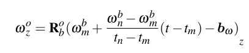

# mySLAM

这里整理毕设中的算法相关部分，首先是关于研究问题的解释，即为什么需要使用的提出的这种方法:

- 退化检测 - 关于轮计，GNSS，视觉(全景相机)以及雷达传感器的退化检测
- 多传感器融合 - 在传感器正常/不正常的场景中，如何合理选择传感器进行融合定位
- 建图部分 - 最终可以实现较为仔细的彩色点云地图或mesh地图


1. 常规的SLAM算法一般只会解决常规环境中的定位问题，其并没有直接考虑传感器异常或者对特定环境中的某传感器不适用的问题，故其算法在适用性以及鲁棒性上存在一定的缺陷。所以解决何时以及融合什么传感器进行融合是需要非常必要的。

2. 而现有退化环境中的SLAM算法一般只会解决单一传感器失灵的问题，如基于雷达的SLAM算法一般只会考虑激光雷达退化的情况


## 前端

主要关于corner case的检测以及处理方式 

### 1. 视觉

#### 全景相机Omni

- 前后两个超广角的鱼眼相机，最后拼接成为一张图像，分析其对应的相机模型，对于商业使用的全景相机其投影模型比较简单，是将三维世界全部投影到一个球面上，然后将这个球面展开成为一张图像(实际表现方式与地球地图比较类似，但是其在南北极处的畸变比较严重) **并且在标定部分都不会给定相机的内参与误差**


#### 普通相机RGBD

- 特征点(光照不够或者低纹理)：无非就是特征点数量不够或者完全没有特征点

    

### 2. 轮计

在groundfusion涉及到了两种wheel odometer的缺点 —— 1. 其测量的角速度不准确  2. 打滑状态

- 对于角速度不准确，就直接使用相邻的IMU测量结果对于wheel测量结果进行插值。

  

- 并且通过比较IMU预积分与wheel预积分之间的区别解决打滑问题(直接从线速度的角度来说，轮计出现打滑，一般都是轮子多转了导致。即跟imu在xyz上进行比较就可以直接得出结论)


- 但是在mins中也支持wheel-imu的KF定位方法(应该可以直接提取出来使用)

- ESKFbased IMU-wheel fusion odometry 这里实现基本逻辑，并且使用ESKF模型，计算起来更简单 (ESKF方法其实主要是想清楚这里对应状态方程是什么，主要就是测量值与预测值的实现逻辑) | fastlio在知乎上也有使用ESKF模型实现的情况


### 3. 雷达

**[LiDAR_IMU_Init](https://github.com/hku-mars/LiDAR_IMU_Init)** IROS 2022 一种直接使用lidar imu进行初始化的方法

### 退化检测

目前尝试了多种退化检测方法,但是效果都不太好, 这些方法计算出来的退化率指标都不太好(甚至是都没有计算出这个退化率出来)


### 4. GPS


## 后端


备份

```
#version 330 core
layout (location = 0) in vec3 aPos;
layout (location = 1) in vec3 aNormal;
layout (location = 2) in vec3 aColor;

out vec3 FragPos;
out vec3 Normal;
out vec3 objectColor;

uniform mat4 view;
uniform mat4 projection;

void main()
{
    // FragPos = vec3(model * vec4(aPos, 1.0));
    FragPos = aPos;
    Normal = aNormal;  
    int color_int = int(aColor);  // I Don't know why here need a cast
    objectColor = vec3( ( ( color_int >> 16 ) & 0xff ), 
                        ( ( color_int >> 8 ) & 0xff  ),
                        ( ( color_int >> 0 ) & 0xff ) ) / 255.0; 
    gl_Position = projection * view * vec4(FragPos, 1.0);
}
```
