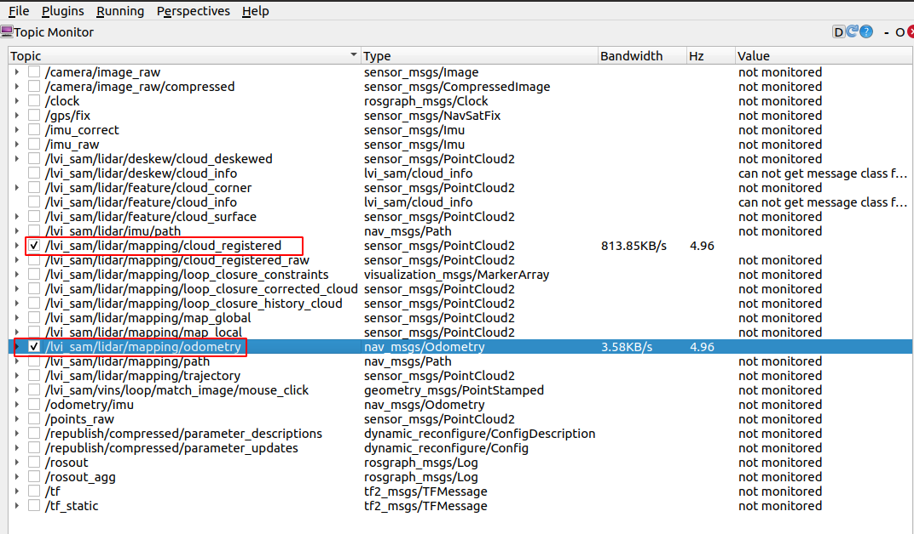
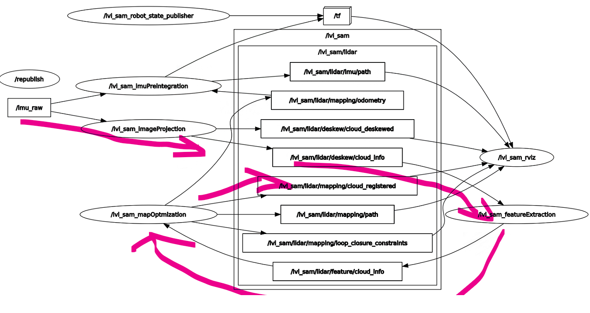
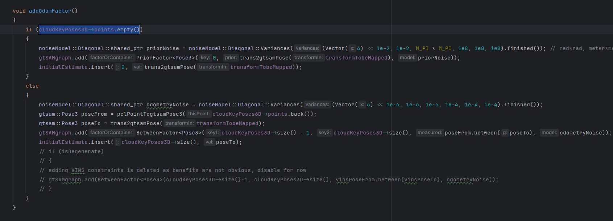
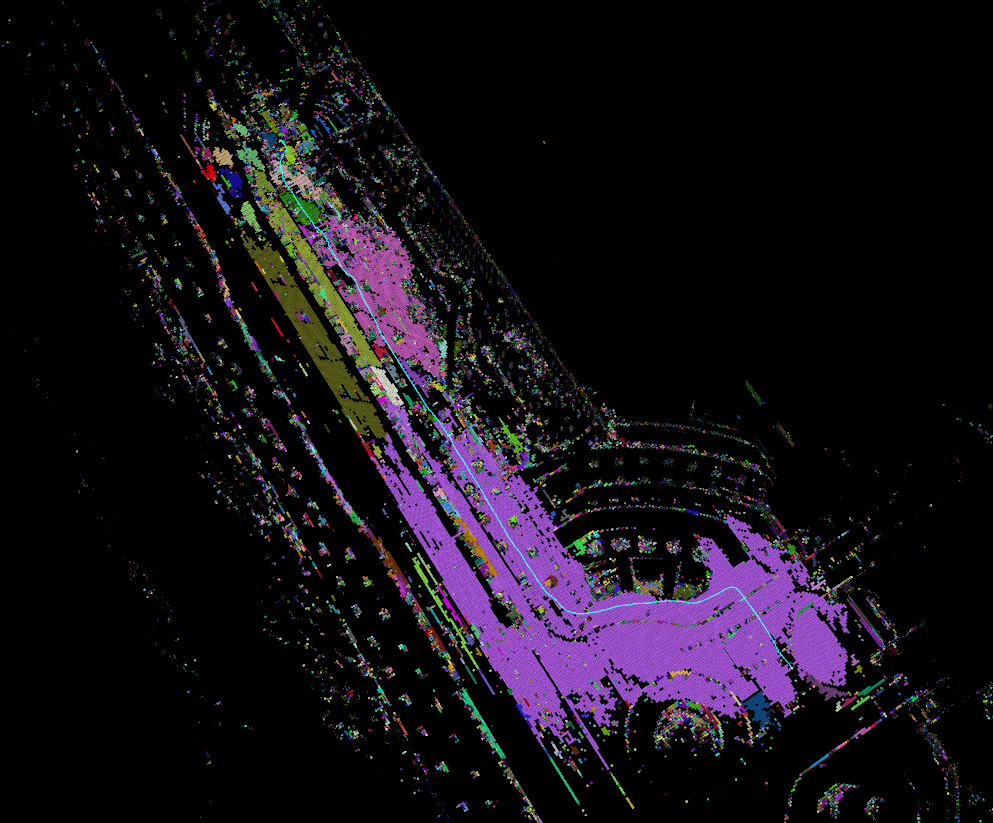
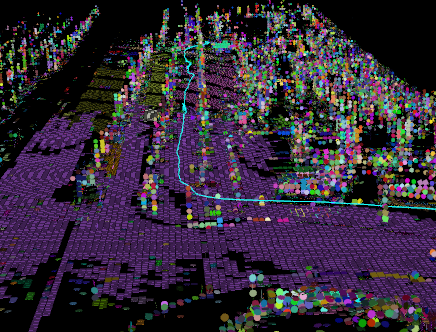
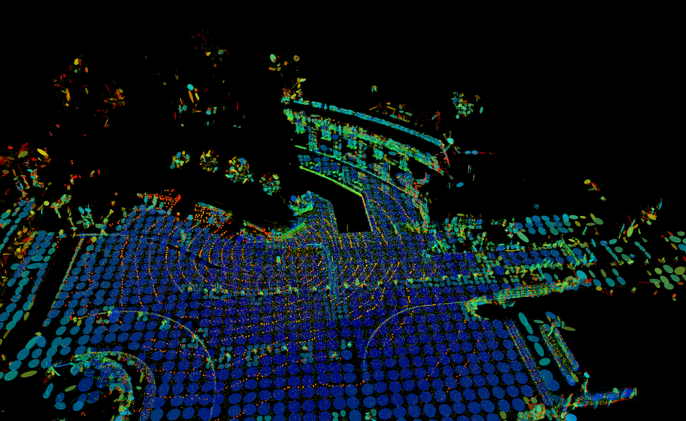
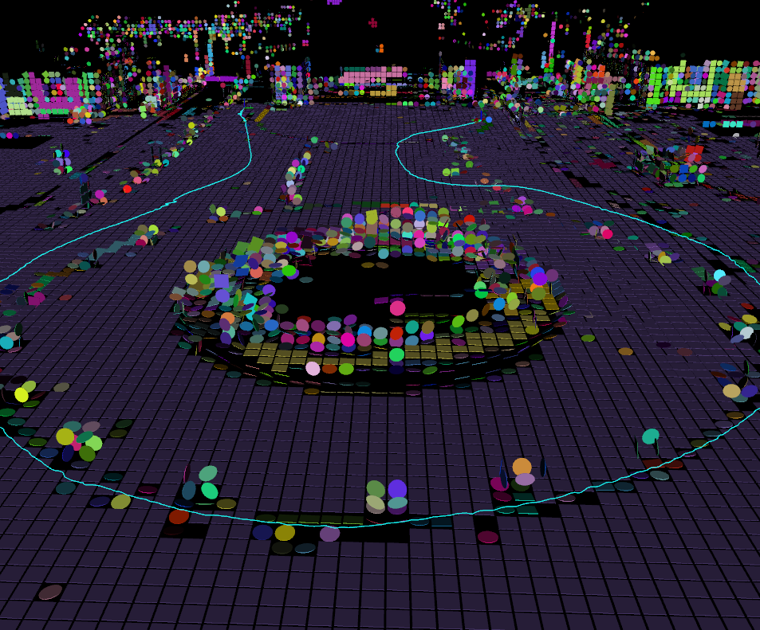

# Todo-lists

专门找一个写Todo的文档，省的写在其他地方不够清晰。

## corner case

- [ ] 对于传感器故障的情况，一般是怎么检测出来的？是不是跟师兄说的一样，要上升到信号处理的程度。

### wheel

- [x] ground-fusion论文(看过了，但是还是剩下的还是看源码)
- [ ] Pose estimation based on wheel speed anomaly detection in monocular visual-inertial slam即ground-fusion中的[19]
- [ ] Tightly-coupled monocular visual-odometric slam using wheels and a mems gyroscope即ground-fusion中的[18]
- [ ] 剑sir的论文还没有看

### vision

- [ ] let-net(这个还是我看到上一篇论文中看到的部分) | 这篇论文直到现在还是在更新，而且作者也知道是谁，github上他们也在写设计的逻辑是什么，感觉学习起来应该会更全面一些。对应的数据集全部都在下载了，我2T的硬盘估计里面装载的全部是数据集了。而且这里面提到的Tensorboard是什么东西(https://github.com/linyicheng1/LET-NET-Train/wiki/%E4%BB%A3%E7%A0%81%E9%80%BB%E8%BE%91%E4%BB%8B%E7%BB%8D)

## superpoint + superglue

- [ ] 这里就是分析如何提升精度+鲁棒性了，之前不是说了先提取一些点来看看效果么(现在有只使用sp提出来的点的方法，看起来效果还是不错的)

## vins-fusion 

- [ ] 代码逻辑还没有看完，这个初始化到底能不能与剩余部分进行分离(openvins中应该是分离的吧，因为有一个模块是ov_init)
- [ ] vins-fusion正好在淘宝上看到了类似的课程，这两天赶紧把所有的内容听完，这样就不耽误后续的进度了
- [ ] lvi-sam中的视觉部分到底是怎么实现的 \| ImMesh中的生成点云的部分是要依赖与lidar来实现的 —— 但是两者的实现原理并不是一样的，lidar里程计实现的效果完全是不一样的。 (那个不确定的平面对应的部分是协方差么)

## Multi-SLAM

- [ ] 多机初始化部分(下一次汇报估计就得汇报这个部分的内容)

    - kimera

    - vins那个课题组使用的方法

## else

- [ ] 想想自己之前的那个多机联合初始化的实验应该怎么做

  

1. 确定lvisam中的lidar作用
2. 确定相机中lvisam中的作用
3. ImMesh中所使用的里程计与lvisam中lidar的区别

参考链接

1. https://www.zhihu.com/people/gao-li-dong-62/posts
2. voxelmap中没有使用IMU —— 是只使用了lidar里程计的方法(看看点云地图转换成voxelmap——我感觉这一部分应该是转换成voxelmap的效率肯定是从0去修改这个lidar里程计更方便)

- [x] voxelmap与immesh中关于lidar数据的处理方式是不是一样的 | 其与lvisam中lidar odometry中使用的数据差距有多少

    - voxelmap与immesh中lidar数据的处理方式是一样的，但是livox的数据包含时间戳，但是velodyne没有时间戳信息 -- 没有找到合适的livox数据来运行voxelmap,单单从kitti数据集来看的话，都是可以直接运行的**(velodyne雷达数据中没有time属性，但程序可以运行)**

        

- [x] lvisam使用的里程计能不能直接使用voxelmap处理后的点云数据进行运行，这涉及到我能不能使用该方法来直接进行voxelmap的生成(这还不涉及到两者的优化方法不一样，一个是滑动窗口中非线性优化，另一个是直接ikf进行递推)
    - 不行，点云的配准方法是不一样的，在voxelmap里面，形成的这个体素+plane的地图应该是可以辅助scan-to-map的配准，然后计算出来位姿的，所以在这里要么从位姿估计到建图都使用voxelmap的操作，要么是即进行点云建图又进行voxelmap的操作

- [x] 尝试一下使用kitti的那个数据集运行 vins mono (感觉使用M2DGR会稍微好一些)

    - kitti数据集因为有odometry以及raw两种，odom数据集里面的点云数据只有10HZ, raw里面的imu数据会产生跳变，所以这两种方法都没有去进行测试**(raw+odom 都有转换好的数据集——进行了voxelmap的测试，都是ok的)**

    

- [ ] voxelmap++ 是不是能符合的要求 从生成的odom后才会进行plane的生成 —— 这里对于lvisam的lidar部分的改进起来是不是更简单一些，但是这种方法最不放心的再于其能不能进行mesh图的重建 | 但是voxelmap上有一个很大的问题是如果将其可视化，那么对应的rviz很卡，估计是有部分占用了很大计算资源(程序本身还在运行，但是可视化部分是不行了, voxelmap++本身没有这种限制)

    - 在读voxelmap++的论文上面，我感觉可以单独使用里程计进行voxel map的重建 + plane的生成 以及更新，这样里程计使用原始的lio-sam

- [x] 阅读 lvisam中lio对应代码，找在在哪里或者订阅什么话题可以进行voxelmap的重建

    - 初步阅读lvisam，感觉是可以使用lvisam中mapOptimization中发布的话题，直接 cloud_registeredRaw 就可以使用了，这里肯定是已经从lidar坐标系转换到自定义的world frame中了(rviz里面可视化之后可以看到点云信息基本可以正常使用)

    - 目前的问题是cloud_registeredRaw 是完全够用的，但是在voxelmap++中需要先得到R,t变换也就是配准之前的点云以及转换之后的点云去计算uncertainty信息，公式里面都是使用配准之前的信息来做的。从下面的lvisam node+topic tree可以看出来一些这部分的话题。
    
    - 现在准备使用cloud_registered的点云来进行voxel重建，因为raw的数据发布时间要比前者晚100s。
    
      

- 从这个逻辑开始看lvisam中的topic递推

- [ ] 能不能在lvisam中同时进行点云地图+voxelmap的重建，voxelmap形成的点云地图只用于生成plane信息，进而使用这个信息来做mesh的重建。

  - 目前在做的就是这个，正好点云地图能与生成的voxelmap信息相互对应，可以分析当前是不是出现了问题。

  

  参考

  https://blog.csdn.net/xiaoma_bk/article/details/125446967

  

  

  之前的voxelmap中的odom是通过kf直接得到的，但是这里是通过gtsam的因子图得到的，这就导致在生成voxel的时候，如果因子图对应的部分发现了回环检测或者是关键帧的优化策略，这样pose变换了对应的voxel理应是变换的，这里暂时不考虑这种变换 ——immesh里面是不是会存在这种变换我还不确定

- [ ] 这里涉及到一个将初始协方差所设置的特别大的情况，但是现在我还不知道为什么要在这里这么设置? 尤其是这个初始条件cloudKeyPoses3D对应的点为空的情况！
    - 一开始设置出来这个数据之后，误差一直没有降低，并且后面实际计算中的过程中，这个odomNoise的误差加上去之后，按道理我感觉是有量测状态下，状态的估计误差总是会下降的，但是这里总感觉其是觉得里程计在实际运动的过程中，里程计的误差总是在逐渐变大的，我感觉这里有一些反常识——但是xyz的估计上这个误差一直是动态变化的过程，对应的三个角度却是波动过程。
    - 又发现一bug....lvisam中估计协方差应该是roll picth yaw角的协方差，但是voxelmap++中使用的确是R旋转矩阵的协方差...这个也是要进行转换的吧..先舍弃旋转的不确定度运行程序试试

- [x] 新的bug - 平面信息没有被成功更新
    - TM的玄学问题，把更新平面的函数从普通C++函数换成类的成员函数之后程序就没有问题了。

- [ ] 学一下gstam的使用
- [ ] 尝试用原版的voxel来进行lvisam的适配

https://gtsam.org/2021/02/23/uncertainties-part1.html

使用的数据集可以改为kitti或者M2DGR的数据集，lvisam自己的数据集在voxelmap上的运行一直出现问题，运行lvisam自身的数据集会出现很严重的漂移，所以按照voxelmap自己指出的数据集类型，运行kitti自带的数据集(即kitti_2011_09_26_drive_0084_synced.bag这个数据集 - 包含了单目图像 IMU 以及 lidar points数据)

voxelmap++ M2DGR walk.bag

从中间过去，两边全是树

从视觉上看貌似voxelmap没有voxelmap++效果好，but...voxelmap的可视化永远都在崩

继续进行测试，可以发现voxelmap++的鲁棒性好像不是很好，再尝试使用M2DGR 的数据集继续测试voxelmap++

(1) M2DGR street08.bag 在前40s能正常一下，但是40s之后漂移很严重

(2) gate03.bag 也存在漂移

虽然不知道为什么出现了这么严重的漂移问题，但是gate03.bag的后半段还是可以得到一个大致的plane地图。中间是一个花坛，车是沿着花坛运动。

目前voxelmap++做其他里程计的适配，发现效果不好，尤其是对于一个平面的拟合上都有问题

