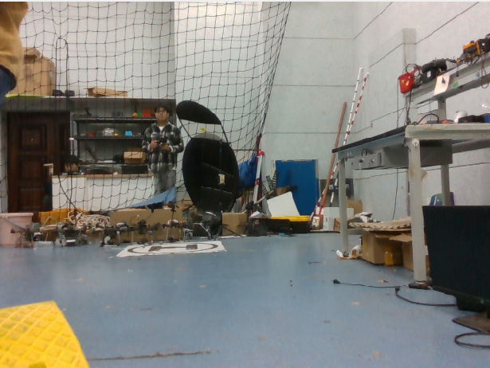

- # Todo-lists

专门找一个写Todo的文档，省的写在其他地方不够清晰。


### wheel

- [x] ground-fusion论文(看过了，但是还是剩下的还是看源码)
- [ ] Pose estimation based on wheel speed anomaly detection in monocular visual-inertial slam即ground-fusion中的[19]
- [ ] Tightly-coupled monocular visual-odometric slam using wheels and a mems gyroscope即ground-fusion中的[18]
- [ ] 剑sir的论文还没有看

### vision

- [ ] let-net(这个还是我看到上一篇论文中看到的部分) | 这篇论文直到现在还是在更新，而且作者也知道是谁，github上他们也在写设计的逻辑是什么，感觉学习起来应该会更全面一些。对应的数据集全部都在下载了，我2T的硬盘估计里面装载的全部是数据集了。而且这里面提到的Tensorboard是什么东西(https://github.com/linyicheng1/LET-NET-Train/wiki/%E4%BB%A3%E7%A0%81%E9%80%BB%E8%BE%91%E4%BB%8B%E7%BB%8D)


## vins-fusion 

- [ ] 代码逻辑还没有看完，这个初始化到底能不能与剩余部分进行分离(openvins中应该是分离的吧，因为有一个模块是ov_init)
- [x] vins-fusion正好在淘宝上看到了类似的课程，这两天赶紧把所有的内容听完，这样就不耽误后续的进度了
- [ ] lvi-sam中的视觉部分到底是怎么实现的 \| ImMesh中的生成点云的部分是要依赖与lidar来实现的 —— 但是两者的实现原理并不是一样的，lidar里程计实现的效果完全是不一样的。 (那个不确定的平面对应的部分是协方差么)


## Multi-SLAM

- [ ] 多机初始化部分(下一次汇报估计就得汇报这个部分的内容)

    - kimera

    - vins那个课题组使用的方法

## else


- [ ] 想想自己之前的那个多机联合初始化的实验应该怎么做

  


去年寒假的时候就看到了这个taichi语言，但是直到现在也只有一个SLAM方面的demo: taichiSLAM。我之前只是想使用这个工具来实现是一个可视化的工具，而且目前大家都在使用C++中的ros的rviz，不知道这个taichi 能不能实现我的需求

PS： taichi好像可以与mesh联动，但是不知道效果怎么样(反正效果很好玩，看起来不错的样子)


关于数据集中的标定算法


Canny-VO: Visual Odometry with RGB-D Cameras based on Geometric 3D-2D Edge Alignment


r3live中关于mesh部分应该有两步，一步是打包数据部分，另一种就是生成mesh部分，但生成mesh部分是不太正常的（主要是感觉是r3live这个算法本身地效果不太好导致mesh重建的效果不好，或者是因为r3live里面生成mesh的时候一些clean操作导致最终地展示效果不好，或者是直接将整体地点云全部给mesh重建的话会导致问题）


OpenGL 不提供和 GUI 相关的 API，所以 OpenGL 不能处理诸如创建窗口、处理用户的键盘鼠标输入这样的任务。这时，我们需要 GLFW。使用 GLFW 库，我们可以简化搭建 OpenGL 程序框架的任务，同时还可以轻松获得跨平台的功能。


在安装openGL以及cgal库的时候已经安装上了很多其他部分 

```cmake
sudo apt-get install -y libcgal-dev pcl-tools
sudo apt-get install -y libgl-dev libglm-dev libglfw3-dev libglew-dev libglw1-mesa-dev 
sudo apt-get install -y libcgal-dev libxkbcommon-x11-dev
```

参考链接: https://www.cnblogs.com/youxia/p/cg002.html


使用openGL时不仅仅会使用核心库，还会使用其他很多库


glad的作用应该与glew差不多


glfwSwapBuffers(window); 前后缓冲区互换: 是用于管理双缓冲机制的关键函数。它确保每一帧的完整图像被显示在屏幕上，而用户不会看到绘制过程中的中间状态，从而避免了图像撕裂和闪烁现象。理解和使用这个函数是实现平滑图形渲染的基础。


关于gl中的shader，其对应的是运行在GPU的程序部分，CPU数据给GPU之后，将这些数据进行转换然后在屏幕上进行显示，这部分就是shader。

很奇怪的部分就是我感觉这里说道的shader，应该都不是正儿八经上色的部分，而是一种把输入更换成为输出的操作(输出应该就是在屏幕上的显示)。

mesh重建的时候，是不是也都要包含了顶点位置、法系这些数据


渲染过程 —— 实际的3D物体投影到2D屏幕上显示


一个非常粗暴的解释: 物体表面的颜色与光的颜色


PS：openGL就是一种利用GPU进行处理的图像化API工具

所谓的引擎就是已经被开发好的图像化工作，可以直接使用鼠标什么的拖拽，最后直接形成所需要的图形

taichi语言给我的感觉是其更像是一种针对图形操作的编程语言，更关心对于图形的各种操作，而不是直接从原始点云或者图像数据中去生成一种mesh结构出来。


什么是OpenMP 是专门用于写多线程的工具么？


immesh中使用的了imGUI : 一个在github上开发出来的C++可视化程序，使用其做为UI还是不错的。

immesh里面估计有不少的程序是直接在r3live上面的做的移植，以及一些部分是在github上直接找的源码

关于imgui的基本操作估计就是将本身是glfw创建出来的图像数据转换成为imgui中的显示工具，并且自己可以创建出来一些控件来进行操作。基本语法看完了剩下就是查找每一条命令的作用然后进行显示


如何在OpenGL中创建出一相机窗口，然后显示出来当前的image  | 通过下视相机获取图像，并且在窗口部分将这个相机显示出来。但是这里使用的里程计部分是使用的r3live++, 但是这里为什么将r3live++以及mesh重建的部分为什么时间是分开计算的


这里实现的逻辑就是 1. r3live计算相机的位姿 2. Immesh用于mesh重建 3. 然后使用openGL进行渲染(这里是直接使用image进行渲染 是分开渲染的)


Immesh里面处理数据

- lidar + imu + camera的打包处理(随便写了一个)

- 关于传感器之间的内外参矩阵 - 目前是在voxelmap里面写死了 即在 init_ros_node()函数中

   


新学期

- 确定QGC与PX4的使用

1. 实验部分

   - imu测试 —— 由于imu获取到的数据波动较大，imu递推获取到的轨迹还是不对
     - [ ] vins中的初始化方法
     - [ ] fastlio中的初始化方法

   - 测试录制的传感器数据
     - [ ] 测试 GVINS  —— 需要将硬件触发信号屏蔽
     - [x] 测试 fastlio 
     - [x] 测试 viw-fusion —— 需要手动读取wheel与odom外参
     - [x] 测试 vinsrgbd

   - [x] 确定轮趣底盘中的话题数据都有什么作用

   - [ ] Switch-SLAM 论文

   - [x] 确定odom中的内参数据都有什么 —— 这些数据直接设置成1就OK 

2. 关于退化场景
   - [ ] 计算机视觉上有关于激光雷达退化场景中的分析博文 —— 这里退化场景的分析到底能不能直接更加明显的获取的，就算是这样自由度下降的场景，能不能精确定位一下 MM-LINS上也是有对应部分的


目前存在的一些可以进行标定的方案:

1. https://github.com/TouchDeeper/VIW-Fusion/tree/master 这个star最多
2. 直接使用evo进行计算 | 但是这种方法是无法标定出相机内参的 | 后续在ROS论坛上找到了与我相似的问题 https://answers.ros.org/question/360302/imu-and-wheel-encoder-calibration/
3. https://github.com/TakuOkawara/full_linear_wheel_odometry_factor 这个使用上 
4. 殷哥给的部分论文里面不少都是在线外参标定数据（groundfusion内部应该有在线的外参标定，所以在实际使用的时候，我只需要考虑给定一个大致外参就OK了）


wheeltec 中 odom话题中的position的z 单位为rad而不是m。 其对应的四元数信息为绕z轴的旋转变换 (只有orientation对应的z,w有数据，xy没有数据波动)


avia imu的单位为g 所以对于这些数据都需要乘以一个g值，在linear_acceleration的取值方面，其对应的数据值的模长之和的根号结果基本都是0.996左右，即基本为1。这里说明imu对应的z轴上的重力加速度G在另外两个轴上都有分布, 但对于这种mems的陀螺仪数据，得使用SLAM里面自己定义的初始化方法进行z轴重力加速度的对齐。


##### 

采集数据集的过程

- 尺寸 坐标系 以及传感器位置、以及配置（类型、具体型号以及频率）


- 传感器可视化 + 介绍场景
  - lidar点云 —— 可以直接使用点云显示
  - 侧重点也可以放到corner case部分，比如第二张图，把所有的corner case都展示一下(比较关键)
  - 第三章图 我们的表现应该是各种corner case都包含，比如轮式计打滑等等什么


- 对不同数据集序列的分别介绍 + 传感器真值的提供方式 | 第二张图是直接展示自己轨迹

  


- 算法结果的绘制 —— 主要是使用绘制


录制数据的时候　rosbag record xxtopioc -b 0 防止数据丢失

ubuntu USB的传输限制需要设置  来防止掉帧

https://blog.csdn.net/qq_42928559/article/details/121717914?spm=1001.2014.3001.5502


***


## 本周安排

- [x] 上午基本上都是刷题时间 6天至少刷12道题
  - 周二 已经完成了 4道 (回溯真的很简单，就是二叉树的逻辑来处理)

  - 周三 上午完成 3道(有一个比较困难的问题，解决了就比较简单)

  - 周四 也是一共4道 上午弄完了2.5，最后一道有些小bug没有解决（跟同学吃饭去了）下午回来弄完了第三道，晚上吃完饭之后弄完了第四道

  - 周五 上午一道 晚上一道(碰到一道hard问题，解决起来费了不少时间)
  
  - 周六 晚上一道 hard的N皇后 花了块两个小时debug
  
  - 周天 下午一道 hard的求解数独 也差不多两个小时 —— 完成了代码随想录上面的所有回溯问题！！！ 又整理了一遍回溯对应的问题，基本上都处理完毕，可以开始新章节了
- [x] 数据集录制 —— 都是先录制几个大场景的(5~10分钟来验证 lidar - imu - odom - camera - depth - GPS 这些部分的有效性) | 这个最好在2天之内录制完毕 | lidar与camera外参标定最近也看到方法了
  - 周二 录制的数据集一开始有点问题...竟然没有odom，这几乎就等于要我重新再录制一份...

  - 周三  重新录制了一份数据集, 有几个序列，可以证明Groundfusion是真的稳定！！

  - 周四  将lidar也录制了一份，也是相当的稳定(Groundfusion一开始初始化可能会有一个异常角，以及在运行的时候可能会出现高度上的漂移，但是xy基本都是对的)
- [ ] 关于退化检测至少看三篇论文跟一种方法代码(首先要明白退化到底是什么，那什么计算出来的自由度降低啥的)
  - 周三 MM-lins这篇文章上面有些介绍，也开源了检测代码 | 并且还介绍其他几种检测方法（至少三种，从16年开始介绍）
- [x] GPS的部分还没有弄完，数据就是不给数传发 | 是不是基站端有问题，查一下XBpro的供电跟实际应该怎么使用电台 —— 为什么配置出来不正常
  - 周三 赵老师那边的人帮我已经验证过了，XB pro可以直接实现数据的传输(至少是可以使用XB pro将整个GPS进入到RTK模式下)，一个XB pro连接电脑，一个XBpro连接飞控数据 —— 但要是这么说的话，我其实也可以一个连接电脑，电脑发RTCM数据，然后让另一个XB pro模块连接另一台电脑，在另一台电脑的串口助手中看发来的数据
  - 周六 测试完毕，之前那个F9p损坏了，更换之后数据已经可以正常发送
- [ ] vins-fusion代码阅读，这个真的很重要 | 尤其是groundfusion中的改进——以后就用这个，绝对比vins-fusion的效果要好
  - 周四 开始理了理之前的逻辑
- [ ] 多机之间的配准方法, 回环检测方法这个与单机框架可以解耦，先看这个(看单机的论文然后整理)
- [ ] lidar与camera之间的标定方法
  - 周四 标定的时候注意 —— 不要只有平移，录制每一帧数据的时候需要静止，录制的每一帧之间在yaw角上差距5°，xy上的平移至少要10cm左右。大致外参保证误差不要大于5°，平移向量误差不要大于0.5m，只需要录制6~8帧数据。
- [ ] 在overleaf上面需要整理整理论文 | 这里需要阅读m2DGR文章上面写的数据啥的, 主要是还可以分别找几篇datasets的文章来抄一抄，最后交给GPT润色一下 —— 先抄出来再说
  - 周四 传感器配置图的大致模型已经完成了，然后写了一部分关于dataset安装以及采集方面的工作
  - 周五 简单写了一些整理上的工作 关于 setup | 标定 | 同步还是有部分东西可以写的


## 本周安排

- [ ] 绘制图片任务
  - [ ] 绘制轨迹真值(利用RTK)将这种数据在google map上面绘制出来
  - [x] 绘制车辆的三视图(需要使用CAD模型进行绘制) 
    - 周一完成三视图绘制
- [ ] 录制任务（**重要**）
  - [x] 测试数传RTK真值数据产出
      - 周五 测试，但是RTK受到干扰导致不能正常工作
  - [ ] 录制视觉失灵数据集
  - [ ] 录制轮计失灵数据集
  - [ ] 录制标定数据集
- [ ] 标定任务
  - [ ] imu标定
  - [ ] 相机内参标定(不太重要)
- [ ] 写材料
  - [x] 传感器标定/set up/时间同步等等
  - [ ] 批判其他数据集与本文数据集之间的区别
- [ ] 查资料/阅读代码（**重要**）
  - [ ] 关于vins改进 
  - [ ] vinsfuison逻辑学习 | groundfusion程序阅读
  - [x] 关于跨越险阻数据集处理
      - 周四 有6个传感器数据集是不需要丢失真值的 —— 但是感觉意义不大，如果想做丢帧的数据集是存在更好的方案的
  - [ ] 传感器退化检测论文 (>=3)
- [x] leetcode (1 day >= 2)
  - [x] 单调队列 
    - 周二 滑动窗口最大值
  - [x] 单调栈
    - 周三 每日温度
    - 周三 下一个最大数
    - 周三 下一个最大数 2
    - 周四 下雨
    - 周四  柱状图
  - [x] 贪心
      - 周四 小孩饼干
      - 周五 最大子数组和
      - 周五 摆动序列
      - 周六 买卖股票
      - 周六 跳跃游戏
      - 周六 跳跃游戏2
- [ ] 论文
  - [ ] 视觉/轮计 corner case退化场景
  - [x] m2DGR | groundchallenge论文
  - [ ] 下下周汇报的多机论文


## 本周安排

- [x] leetcode 贪心问题刷完，已经超额完成！！从贪心的部分更新到动态规划

  - 周二 134 加油站
  - 周二 135 分发糖果
  - 周三 406 根据身高重建队列
  - 周三 860 柠檬水找零
  - 周三 452 最小数量的箭引爆气球
  - 周四 435 无重叠区间
  - 周四  763 划分字母区间
  - 周四 56 合并区间
  - 周五 738 单调递增数字
  - 周五 968 监控二叉树
  - 周六 509 斐波那契数
  - 周六 70 爬楼梯
  - 周六 746 最小花费爬楼梯
- [ ] 查资料/阅读代码
  - [ ] vins (主要是vins-fusion以及groundfusion的代码逻辑哦 —— 至少一天看一小时)
      - 注释掉了groundfusion中对应的初始化逻辑，但是groundfusion上面发现加入wheel之后，整个代码对于z轴上的稳定性下降了
  - [ ] mins 学习一下其中的KF逻辑
  - [ ] fastlio 有一个从零开始的fastlio逻辑，这个可以学习（https://zhuanlan.zhihu.com/p/635702243 这里介绍的就是从零开始fastlio）
  - [ ] tartonVO 这个配置跟实际使用都是不错的
- [ ] 论文
  - [ ] 下周汇报的多机SLAM论文
  - [ ] 继续找corner case处理相关的论文
- [ ] 录制数据集
  - [x] 室内 视觉 wheel (这周先完成这个部分就很不错)
      - 周三 录制了室内视觉传感器出现问题的data，但是其在使用fastlio的时候会出现异常状态，需要进一步判断是不是lidar太靠近墙壁导致的问题。
      - 周四 测试完周三的动补以及lidar中出现的问题 (1) 动补确实会出现一边高一边低的情况 (2) 所使用的lidar在1m之内是无法识别物体，1~3m之内的数据是会出现点云畸变
      - 周五 重新弄录一个mid360车辆上，并且重新标定了动补以及重新选择了动补小球，只能说已经完成了干完了所有能继续修正误差的部分，只能说实验室中确实存在高度误差。
      - 周六 录制完了室内的视觉数据集以及wheel数据集，一共六个视觉失灵的场景以及一个wheel失灵的条件
  - [ ] 关于室内没有办法提供的真值数据 - 使用 aruco marker进行判断(二维码，第一帧与最后一帧进行比较) 
  - [ ] 确认一下GPS以及RTK，这里需要再进行测试
- [ ] overleaf 
  - [x] 整理这段时间了解到的论文结构
  - [ ] 重新整理图片以及论文内容 | 图片的文字格式以及绘制上(最好再加一张图，绘制一张大的图像 — 即不要直接给每一张图像的名字，直接再最下面写出来即可)
- [ ] 图像绘制
  - [ ] 绘制轨迹真值(利用RTK)将这种数据在google map上面绘制出来

PS 后续补充任务...

- [x] 需要阅读groundfusion的代码，因为其中设计到录修改初始化方案(需要注释掉一部分代码来实现整体逻辑)


## 本周安排

- [ ] leetcode 20道动态规划即可
- [ ] 确定《大话数据结构》以及《大话设计模式》
- [ ] vinsfusion以及groundfusion逻辑
- [ ] 上周没有实现出来的一些小问题
- [ ] 录制室外数据（两周之内要完成所有数据集的录制工作，这样可以保留足够的时间冲刺算法改进）
- [ ] 想起来还有SB的PPT没有弄..


**corner case**

- 视觉 (大致按照一条录制两组)
  
  重复特征 —— 工业场景可能有一些应用 
  
  - 室内（动补）：
  
      - 微光
      - 曝光变化 (强行创造一个过曝光场景)
      - 灯光闪烁（明暗交替）
      - 剧烈运动 （不断转弯即sharp turn - 更改一下车的灵敏度即可）
      - 动态物体 （有在图像中占据半个画幅的人物出现）持续出现，一直干扰
      - 全闭塞 即突然出现物体将整个相机界面全部挡住
  
  - 室外
  
      - 光照较差 (夜晚) 
      - 过曝光 (白天，对着太阳)
      - 动态物体 (白天/夜晚 上下课阶段)   
      - 剧烈运动 (迅速转角)
      - 全闭塞 突然遮挡整个车的数据
  
      
  
- wheel

  - 室内

      - 光滑地板
      - 车轮打滑（前轮过去，但是后轮没有过去）

  - 室外

      - 松软草地

      - 震动地面 (即用鹅卵石或者一些路况不好的地面) 

      室外的这两个也可以认为是打滑 | 角速度估计不准以及打滑 | 减速带

- lidar

    - 水面区域(测试一下对着水面lidar会不会被反射干扰)
    - 玻璃 大面积比例 | 镜子 以及吸光材料
    - 长廊（定型评估）—— 跑一个圈，评估最后的回环算法的误差 
    - 下完雨的场景 ，下雪，起雾 
    - 重复场景 (很像之前在清华录制出来的数据集部分)

    

    

- GPS（但是这种GPS出现问题的区域使用RTK感觉效果也不行）

    - 靠墙环境 - 出现进入以及出去

    - 树下

      


目前录制的场景

室内正常场景 


1. 视觉(室内，共6组) 

    - dynamic_person_1.bag | dynamic_person_2.bag 人不断出现在图像中，并且占据半个画幅
    - over_exposure_normal_light.zip  过曝，场地中是正常光 | over_exposure_slight_light.zip 过曝，场地中是微光环境
    - sharp_turn_1.bag | sharp_turn_2.bag 运动较为剧烈
    - turn_light_night_3.bag  3s更换一次开关灯 | turn_light_night_5.bag 5s更换一次开关灯
    - slight_light.zip | slight_light_2.zip 微弱灯光
    - normal_need_process.bag | normal_need_process_2.bag 准备模拟全闭塞 即更换其中的图像数据变成全黑

2. wheel(室内，共1组)

    

    - indoor_wheel_occlusion.bag | indoor_wheel_occlusion_2.bag 车辆前进过程中，突然遭遇不能正常前进的障碍，导致车轮打滑以及车辆颠簸。相当于是面前又一个辅助上坡的部分


单一场景3条，室内1~3 | 室外5分钟

接触面突然移动，类似于履带


运行一下，需要判断是否真的打换 | wheel 

(1) 初始化出现的问题(鲁班初始化)

(2) wheel的故障检测 是不是在这些场景中都能检测出来呢 | 借助其他传感器去分析wheel上出现的故障方案 | 碰到


RTK能不能输出可信度 | groundchallenge 真值不准 m2DGR plus GNSS 帧率太低 1HZ  | 基于RTK原始报文信息的SLAM算法，GPT或者github | RTK与GPS对应的ｒｏｓ话题格式是否一样？

（１）ＧＰＳ

（２）再确认一下　RTK那边录制的数据格式或者类型

 


- imu(感觉这种传感器很难出现异常状态)


github搜索词 vins, 到31页

PS：关于vins改进

- ic-gvins 2023 以ins为中心的 GNSS-visual-imu系统

- [SchurVINS](https://github.com/bytedance/SchurVINS) CVPR 2024

- DynaVINS RAL 2022  动态环境改进vins

- **VINS-GPS-Wheel 2021**  | Visual-Inertial Odometry Coupled with Wheel Encoder and GNSS

- Dynamic-VINS 

- **[VINS-RGBD-FAST ](https://github.com/jianhengLiu/VINS-RGBD-FAST)**2023 主要是做一些加速处理的工作

- VINS_Lite_GPU 融合GPU处理

- Tightly Coupled GNSS-Visual-Inertial Positioning System Using GTSAM 一个实验相性质的工作，主要应对有些传感器失效之后使用其他传感器顶上(这里与我之前想在跨越险阻中使用的方法有些相似)

- SuperVINS 2023 axciv 融合深度学习提取体征来进行处理

- EPLF-VINS  2023开源 Real-Time Monocular Visual-Inertial SLAM With Efficient Point-Line Flow Features

- VINS-Fusion for For Vehicle dense mapping and navigation 融入建图

- LE-VINS

- **MINS** 重点看这个（这里使用的传感器跟车上的传感器一摸一样）有论文 有代码 感觉不错

- RAFT-VINS 又是一种关于动态光照变换下的处理过程

- Mono-VINS-DenseMapping Public 稠密重建

- UVINS: An Ultra-Wideband assisted VIO Correction System 结合UWB提升vins

- mrs_vins_imu_filter 第一次看到有人可以给imu数据做过滤


目前想实现的还是一个大一统的框架，将这些传感器的数据都融合到一起，以应对其中一些传感器失灵的情况

(1) 初始化 —— 传感器出现故障之后是不是需要重新初始化 —— 感觉只需要做好切换工作之后是不需要初始化的 | vins自己存在一套初始化流程我是知道的，其需要定义坐标系并且优化其他参数


 PS：

1. IMU-Wheel Dynamic Initialization既然是动态初始化方法 用于在lidar出现异常问题时进行模式切换
2. ground-fusion中已经给出来了如何切换初始化逻辑来提供给 vins(这样就可以应对初始坐标系静态确定以及动态确定的问题)


关于 mins上面的处理流程

看看这个文章的逻辑，尤其是递推的时候，是获取到一阵数据就进行递推还是什么其他情况

1. get_IMU_Wheel_data() 在一个与imu数据相同的时间段中获取wheel数据, 并且按照wheel的类型将其转换成为三轴角速度以及加速度(**这里不知道groundfusion中是如何实现的**) | wheel上面的时间与imu的时间差也做了处理

2. 在imu+wheel已经实现初始化的基础上，将gnss以及lidar拉进来做优化

    


pipeline流程

- 多传感器初始化 lidar与camera相互之间都要完成对应的初始化策略
    - 定义初始时间
    - 定义初始状态
    - 设定一些初始参数


vinsmono，fastlio，r3live 这些算法一般在SLAM岗上进行问答，可能需要看一下其中的技术细节

优先考虑使用激光SLAM 代码层面需要多读多看

- 调研SLAM算法针对corner case提出的
- 以及这些算法如何适配到当前算法上
