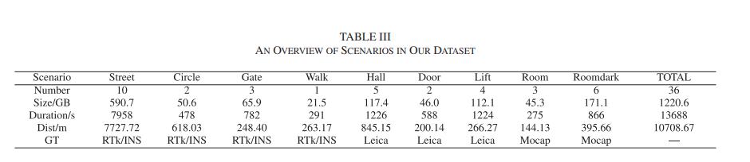

# Todo-lists

专门找一个写Todo的文档，省的写在其他地方不够清晰。

## corner case

- [ ] 对于传感器故障的情况，一般是怎么检测出来的？是不是跟师兄说的一样，要上升到信号处理的程度。

### wheel

- [x] ground-fusion论文(看过了，但是还是剩下的还是看源码)
- [ ] Pose estimation based on wheel speed anomaly detection in monocular visual-inertial slam即ground-fusion中的[19]
- [ ] Tightly-coupled monocular visual-odometric slam using wheels and a mems gyroscope即ground-fusion中的[18]
- [ ] 剑sir的论文还没有看

### vision

- [ ] let-net(这个还是我看到上一篇论文中看到的部分) | 这篇论文直到现在还是在更新，而且作者也知道是谁，github上他们也在写设计的逻辑是什么，感觉学习起来应该会更全面一些。对应的数据集全部都在下载了，我2T的硬盘估计里面装载的全部是数据集了。而且这里面提到的Tensorboard是什么东西(https://github.com/linyicheng1/LET-NET-Train/wiki/%E4%BB%A3%E7%A0%81%E9%80%BB%E8%BE%91%E4%BB%8B%E7%BB%8D)


## vins-fusion 

- [ ] 代码逻辑还没有看完，这个初始化到底能不能与剩余部分进行分离(openvins中应该是分离的吧，因为有一个模块是ov_init)
- [x] vins-fusion正好在淘宝上看到了类似的课程，这两天赶紧把所有的内容听完，这样就不耽误后续的进度了
- [ ] lvi-sam中的视觉部分到底是怎么实现的 \| ImMesh中的生成点云的部分是要依赖与lidar来实现的 —— 但是两者的实现原理并不是一样的，lidar里程计实现的效果完全是不一样的。 (那个不确定的平面对应的部分是协方差么)


## Multi-SLAM

- [ ] 多机初始化部分(下一次汇报估计就得汇报这个部分的内容)

    - kimera

    - vins那个课题组使用的方法

## else


- [ ] 想想自己之前的那个多机联合初始化的实验应该怎么做

  


去年寒假的时候就看到了这个taichi语言，但是直到现在也只有一个SLAM方面的demo: taichiSLAM。我之前只是想使用这个工具来实现是一个可视化的工具，而且目前大家都在使用C++中的ros的rviz，不知道这个taichi 能不能实现我的需求

PS： taichi好像可以与mesh联动，但是不知道效果怎么样(反正效果很好玩，看起来不错的样子)


关于数据集中的标定算法


Canny-VO: Visual Odometry with RGB-D Cameras based on Geometric 3D-2D Edge Alignment


r3live中关于mesh部分应该有两步，一步是打包数据部分，另一种就是生成mesh部分，但生成mesh部分是不太正常的（主要是感觉是r3live这个算法本身地效果不太好导致mesh重建的效果不好，或者是因为r3live里面生成mesh的时候一些clean操作导致最终地展示效果不好，或者是直接将整体地点云全部给mesh重建的话会导致问题）


OpenGL 不提供和 GUI 相关的 API，所以 OpenGL 不能处理诸如创建窗口、处理用户的键盘鼠标输入这样的任务。这时，我们需要 GLFW。使用 GLFW 库，我们可以简化搭建 OpenGL 程序框架的任务，同时还可以轻松获得跨平台的功能。


在安装openGL以及cgal库的时候已经安装上了很多其他部分 

```cmake
sudo apt-get install -y libcgal-dev pcl-tools
sudo apt-get install -y libgl-dev libglm-dev libglfw3-dev libglew-dev libglw1-mesa-dev 
sudo apt-get install -y libcgal-dev libxkbcommon-x11-dev
```

参考链接: https://www.cnblogs.com/youxia/p/cg002.html


使用openGL时不仅仅会使用核心库，还会使用其他很多库


glad的作用应该与glew差不多


glfwSwapBuffers(window); 前后缓冲区互换: 是用于管理双缓冲机制的关键函数。它确保每一帧的完整图像被显示在屏幕上，而用户不会看到绘制过程中的中间状态，从而避免了图像撕裂和闪烁现象。理解和使用这个函数是实现平滑图形渲染的基础。


关于gl中的shader，其对应的是运行在GPU的程序部分，CPU数据给GPU之后，将这些数据进行转换然后在屏幕上进行显示，这部分就是shader。

很奇怪的部分就是我感觉这里说道的shader，应该都不是正儿八经上色的部分，而是一种把输入更换成为输出的操作(输出应该就是在屏幕上的显示)。

mesh重建的时候，是不是也都要包含了顶点位置、法系这些数据


渲染过程 —— 实际的3D物体投影到2D屏幕上显示


一个非常粗暴的解释: 物体表面的颜色与光的颜色


PS：openGL就是一种利用GPU进行处理的图像化API工具

所谓的引擎就是已经被开发好的图像化工作，可以直接使用鼠标什么的拖拽，最后直接形成所需要的图形

taichi语言给我的感觉是其更像是一种针对图形操作的编程语言，更关心对于图形的各种操作，而不是直接从原始点云或者图像数据中去生成一种mesh结构出来。


什么是OpenMP 是专门用于写多线程的工具么？


immesh中使用的了imGUI : 一个在github上开发出来的C++可视化程序，使用其做为UI还是不错的。

immesh里面估计有不少的程序是直接在r3live上面的做的移植，以及一些部分是在github上直接找的源码

关于imgui的基本操作估计就是将本身是glfw创建出来的图像数据转换成为imgui中的显示工具，并且自己可以创建出来一些控件来进行操作。基本语法看完了剩下就是查找每一条命令的作用然后进行显示


如何在OpenGL中创建出一相机窗口，然后显示出来当前的image  | 通过下视相机获取图像，并且在窗口部分将这个相机显示出来。但是这里使用的里程计部分是使用的r3live++, 但是这里为什么将r3live++以及mesh重建的部分为什么时间是分开计算的


这里实现的逻辑就是 1. r3live计算相机的位姿 2. Immesh用于mesh重建 3. 然后使用openGL进行渲染(这里是直接使用image进行渲染 是分开渲染的)


Immesh里面处理数据

- lidar + imu + camera的打包处理(随便写了一个)

- 关于传感器之间的内外参矩阵 - 目前是在voxelmap里面写死了 即在 init_ros_node()函数中

   


新学期

- 确定QGC与PX4的使用

1. 实验部分

   - imu测试 —— 由于imu获取到的数据波动较大，imu递推获取到的轨迹还是不对
     - [ ] vins中的初始化方法
     - [ ] fastlio中的初始化方法

   - 测试录制的传感器数据
     - [ ] 测试 GVINS  —— 需要将硬件触发信号屏蔽
     - [x] 测试 fastlio 
     - [x] 测试 viw-fusion —— 需要手动读取wheel与odom外参
     - [x] 测试 vinsrgbd

   - [x] 确定轮趣底盘中的话题数据都有什么作用

   - [ ] Switch-SLAM 论文

   - [x] 确定odom中的内参数据都有什么 —— 这些数据直接设置成1就OK 

2. 关于退化场景
   - [ ] 计算机视觉上有关于激光雷达退化场景中的分析博文 —— 这里退化场景的分析到底能不能直接更加明显的获取的，就算是这样自由度下降的场景，能不能精确定位一下 MM-LINS上也是有对应部分的


目前存在的一些可以进行标定的方案:

1. https://github.com/TouchDeeper/VIW-Fusion/tree/master 这个star最多
2. 直接使用evo进行计算 | 但是这种方法是无法标定出相机内参的 | 后续在ROS论坛上找到了与我相似的问题 https://answers.ros.org/question/360302/imu-and-wheel-encoder-calibration/
3. https://github.com/TakuOkawara/full_linear_wheel_odometry_factor 这个使用上 
4. 殷哥给的部分论文里面不少都是在线外参标定数据（groundfusion内部应该有在线的外参标定，所以在实际使用的时候，我只需要考虑给定一个大致外参就OK了）


wheeltec 中 odom话题中的position的z 单位为rad而不是m。 其对应的四元数信息为绕z轴的旋转变换 (只有orientation对应的z,w有数据，xy没有数据波动)


avia imu的单位为g 所以对于这些数据都需要乘以一个g值，在linear_acceleration的取值方面，其对应的数据值的模长之和的根号结果基本都是0.996左右，即基本为1。这里说明imu对应的z轴上的重力加速度G在另外两个轴上都有分布, 但对于这种mems的陀螺仪数据，得使用SLAM里面自己定义的初始化方法进行z轴重力加速度的对齐。


##### 

采集数据集的过程

- 尺寸 坐标系 以及传感器位置、以及配置（类型、具体型号以及频率）


- 传感器可视化 + 介绍场景
  - lidar点云 —— 可以直接使用点云显示
  - 侧重点也可以放到corner case部分，比如第二张图，把所有的corner case都展示一下(比较关键)
  - 第三章图 我们的表现应该是各种corner case都包含，比如轮式计打滑等等什么


- 对不同数据集序列的分别介绍 + 传感器真值的提供方式 | 第二张图是直接展示自己轨迹

  


- 算法结果的绘制 —— 主要是使用绘制


录制数据的时候　rosbag record xxtopioc -b 0 防止数据丢失

ubuntu USB的传输限制需要设置  来防止掉帧

https://blog.csdn.net/qq_42928559/article/details/121717914?spm=1001.2014.3001.5502


***


## 本周安排

- 上午基本上都是刷题时间 6天至少刷12道题

- 数据集录制 —— 都是先录制几个大场景的(5~10分钟来验证 lidar - imu - odom - camera - depth - GPS 这些部分的有效性) | 这个最好在2天之内录制完毕 | lidar与camera外参标定最近也看到方法了
- 关于退化检测至少看三篇论文跟一种方法代码(首先要明白退化到底是什么，那什么计算出来的自由度降低啥的)
- GPS的部分还没有弄完，数据就是不给数传发 | 是不是基站端有问题，查一下XBpro的供电跟实际应该怎么使用电台 —— 为什么配置出来不正常
- vins-fusion代码阅读，这个真的很重要 | 尤其是groundfusion中的改进——以后就用这个，绝对比vins-fusion的效果要好
- 多机之间的配准方法, 回环检测方法这个与单机框架可以解耦，先看这个(看单机的论文然后整理)


