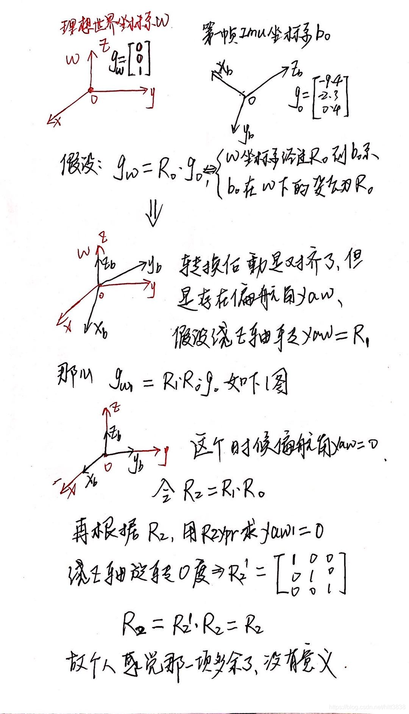

# Current_work

##  superpoint 使用

在feature tracker部分将光流替换成为superpoint+superglue作为工程上的尝试。使用方法是使用superpoint+supointglue上面来实现。因为是在vins为基础进行修改，所以应该先确定光流本身的使用以及在vins中光流的功能。

- 光流法

    - 输入 prev_img |  cur_img  | prev_pts  | cur_pts (cur_pts维数应该与prev_pts的size相同)

        ```CPP
        /*
          使用的opencv函数为:calcOpticalFlowPyrLK()
            1.对于存在预测的情况(这里给的cur_pts_一定不能是空)
            cv::calcOpticalFlowPyrLK(prev_img, cur_img, prev_pts, cur_pts_ /*输出的追踪结果，允许给出初值*/, 
                lk_status, lk_err, cv::Size(21, 21) /*指定金字塔每层上的搜索窗口的size*/, 1 /*指定金字塔层数为2层*/, 
                cv::TermCriteria(cv::TermCriteria::COUNT+cv::TermCriteria::EPS, 30, 0.01) /*指定搜索的终止条件*/, 
                cv::OPTFLOW_USE_INITIAL_FLOW /*指定启用cur_pts_中给定的初值，以便加速搜索*/ );
        	
            2.不存在预测(对于cur_pts_的数据就没有要求)
            cv::calcOpticalFlowPyrLK(prev_img, cur_img, prev_pts, cur_pts_, 
                                     lk_status, lk_err, cv::Size(21, 21), 3);
        
                
          基本输入参数
          	cv::Mat prev_img cur_img
            vector<cv::Point2f> prev_pts cur_pts
            vector<uchar> status;
            vector<float> err;
        */ 
          
        
        
        ```

    - 光流的使用

        1. status 用于表示上一帧中的特征点在这当前帧中有没有被跟踪到 (对应的一定是上一帧!!)，所以status中的size应该与prev_pts相同
        2. 对于没有跟踪到的点 status=0，并且cur_pts对应的特征点的位置也被计算出来了
        3. status prev_pts cur_pts 的size大小是一样的 | 这样逻辑上是通顺的 -> 当前帧上的特征点就应该是包含成功被跟踪到的点，但不是所有点都被跟踪到了，随着运行时间越来越长，跟踪到的特征点数量会不够，所以为了保证特征点数量需要再从这帧图像中读取一些角点来保证数量


## vins_node

定义节点, 所有发布的话题都自动加上本节点的名称

```cpp
ros::Subscriber sub_imu = n.subscribe(IMU_TOPIC, 5000, imu_callback, ros::TransportHints().tcpNoDelay()); // ros::TransportHints().tcpNoDelay()提示要ros快速处理，方便实时操作
```

自己设置一个rviz，然后保存下来，想使用的时候直接加载就好了 | 这样就直接可以加载之前保存好的rviz，不需要手动输入坐标系、需要订阅的话题等等

```
<node name="rvizvisualisation" pkg="rviz" type="rviz" output="log" args="-d /home/supercoconut/Myfile/have_a_try.rviz" />
```


使用ros::NodeHandle nh("~"),发布的话题名字为:节点名字+话题名字


没来得及看的链接

- https://github.com/castacks/tartanvo
- https://github.com/sair-lab/AirVO?tab=readme-ov-file
- https://github.com/ercbunny/open_vins?tab=readme-ov-file


目前关于这个lidar与imu一起使用的调研

- r3live
- immesh

https://blog.csdn.net/lovely_yoshino/article/details/126572997

ROS中的tf工具

https://blog.csdn.net/wilylcyu/article/details/51724966


这个对于体素解释的很清楚

https://blog.csdn.net/a_eastern/article/details/107508861?spm=1001.2101.3001.6650.3&utm_medium=distribute.pc_relevant.none-task-blog-2%7Edefault%7ECTRLIST%7ERate-3-107508861-blog-121698677.235%5Ev43%5Epc_blog_bottom_relevance_base1&depth_1-utm_source=distribute.pc_relevant.none-task-blog-2%7Edefault%7ECTRLIST%7ERate-3-107508861-blog-121698677.235%5Ev43%5Epc_blog_bottom_relevance_base1&utm_relevant_index=6

这个也是对于voxel的解释

https://blog.csdn.net/m0_47163076/article/details/121698677


## Vins-fusion 整理

现在基本上是使用vins-fusion进行改进，所以先整理这个模块。


1. 第一次处理IMU数据的时候，依靠IMU测量得到的重力加速度，将IMU系转换到world系中([参考链接](https://blog.csdn.net/hltt3838/article/details/109514591?ops_request_misc=%257B%2522request%255Fid%2522%253A%2522171342390616800215050781%2522%252C%2522scm%2522%253A%252220140713.130102334..%2522%257D&request_id=171342390616800215050781&biz_id=0&utm_medium=distribute.pc_search_result.none-task-blog-2~all~baidu_landing_v2~default-1-109514591-null-null.142^v100^pc_search_result_base6&utm_term=Eigen%3A%3AQuaterniond%3A%3AFromTwoVectors%28ng1%2C%20ng2%29.toRotationMatrix%28%29%3B&spm=1018.2226.3001.4187) ) | 这是我能找到的最详细的解释了




2. 边缘化就是在滑动窗口删除图像帧的时候，删除之前帧的时候，让这些帧提供的约束信息保留，帧自己被删除。


补充一点我疑惑点

1. all_image_frame_   对应的 滑动窗口中所有的image 的信息(IMU预积分、2D的feature点等等信息)—— 存在insert以及erase，所以感觉就是在滑动窗口中
2. f_manger的feature果然就是整个滑动窗口中的feature, start_frame就是第一帧观测到这个特征点的帧

 


## LVI-SAM + VoxelMap

将voxelmap部分替换调lio-sam,这样在生成的plane平面的基础上，可以完成mesh图的生成。

- voxelmap中velodyne的lidar数据可以没有time+ring属性，程序也可以运行。但是lio-sam本身不可以。


time为offset_time 形成该lidar point与本帧lidar_scan的一个时间值 | ring就是这个点在哪一个线上被发现的


1. https://blog.csdn.net/qq_42731705/article/details/128344179


