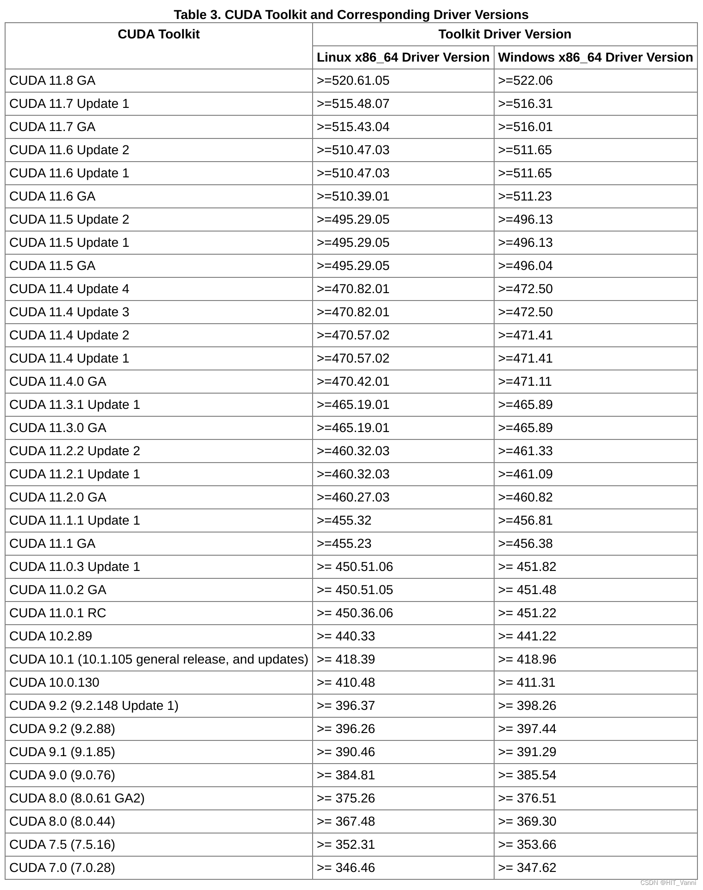

# Ground_fusion 指南

- darknet 网络模型 c+cuda实现，用于在cpu | gpu上实现yolo模型的部署(ground-fusion中实现的yolo模型就是github中已经写好的方式，所以如果想实现superpoint只需要直到实现的方法是什么，然后使用现成的方法来加速功能实现——性能不好最后再优化就完事了，先实现比较重要)

    

- 之前看的那个report使用的是wrapper library 直接将要处理的部分转换为api进行操作。但是本文使用的时候也没有用Libtorch这些看起来比较复杂的库，而是直接去弄了一个库与其对应的msg

- 在图像的回调函数中使用input_image -> feature tracker 


### 关于 nvidia驱动 | cuda | cudnn 安装

1. nvidia驱动一直是一个比较简单的安装项。只需要自己在设置里找到对应的位置就可以直接安装。在安装过程中需要设置一个boot的密码，然后reboot。在reboot之后一定不要选择continue boot(也就是第一项)
    - 反正是reboot之后会出现四个选项，选择第一项就是continue boot(选择之后重新启动也没有完成显卡驱动安装 | 这次安装选择的是第二项) 
2. 安装cuda以及cudnn可以选择deb或者.run文件的安装方式，但是一定要注意对应的版本问题。这次安装的是cuda-11.8以及cudnn8(cuda的路径/usr/local/cuda-11.8)



参考链接:

1. [安装教程(但是缺少了最后在bashrc中需要添加的内容)](https://blog.csdn.net/qq_34972053/article/details/127689332?utm_medium=distribute.pc_relevant.none-task-blog-2~default~baidujs_baidulandingword~default-8-127689332-blog-119003405.235^v43^pc_blog_bottom_relevance_base5&spm=1001.2101.3001.4242.5&utm_relevant_index=11)
2. https://blog.csdn.net/h3c4lenovo/article/details/119003405

cuda| cudnn官方教程

1. cudnn https://developer.nvidia.com/rdp/cudnn-archive 
2. cuda https://developer.nvidia.com/cuda-11-8-0-download-archive?target_os=Linux&target_arch=x86_64&Distribution=Ubuntu&target_version=20.04&target_type=deb_local


目前的思路是使用github中已经写好的libtorch模型来操作

- nvcc -V 显示cuda版本是10.2版本的


一个小的提示: 显卡驱动与cuda还是两个东西的，毕竟不是所有人都是用来跑模型的


https://blog.51cto.com/u_15905131/5918429 卸载方法

我在使用过的过程中删除了自己安装的显卡驱动

- 这个还是可以写的，关于如何使用如何更新

https://blog.csdn.net/weixin_41010198/article/details/109367449


## vins_node

定义节点, 所有发布的话题都自动加上本节点的名称

```cpp
ros::Subscriber sub_imu = n.subscribe(IMU_TOPIC, 5000, imu_callback, ros::TransportHints().tcpNoDelay()); // ros::TransportHints().tcpNoDelay()提示要ros快速处理，方便实时操作
```

自己设置一个rviz，然后保存下来，想使用的时候直接加载就好了 | 这样就直接可以加载之前保存好的rviz，不需要手动输入坐标系、需要订阅的话题等等

```
<node name="rvizvisualisation" pkg="rviz" type="rviz" output="log" args="-d /home/supercoconut/Myfile/have_a_try.rviz" />
```


使用ros::NodeHandle nh("~"),发布的话题名字为:节点名字+话题名字


没来得及看的链接

- https://github.com/castacks/tartanvo
- https://github.com/sair-lab/AirVO?tab=readme-ov-file
- https://github.com/ercbunny/open_vins?tab=readme-ov-file


