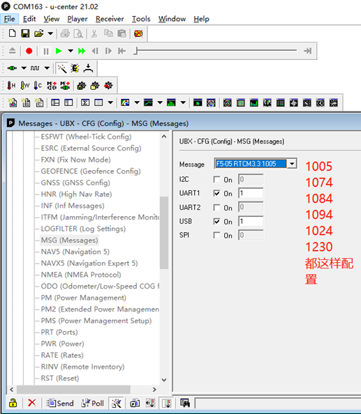

# Sensor

## GPS

GPS协议有 NMEA 和 UBlox

- 主流 GPS 分为两种协议 NMEA 和 UBlox。NMEA 以 $ 开头 * 结束以字符串类型输出，UBlox 主要是以二进制输出，有专门的帧头，具体的协议解析要看相关文档。输出信息主要有用的数据是位置也就是经纬度、海拔高度、速度和相关精度。协议中一般会把这些关键数据放在一帧中方便使用。

对于RTK，其对应的协议为 RTCM

- 个人对于RTK的理解是 —— 基站端 gnss模块 决定发送RTCM数据 (对于CRTK 9ps，其中的GPS芯片是zed-9p，在ucenter中的message view确定数据即可)。对于移动端的gnss模块(不走飞控)，其需要通过一定的方式接受到RTCM数据，并与自己获取的GPS数据一起解算，最终将数据发送给飞控。飞控从串口中获取数据，并发送给电脑
  - **飞控本身并不会做GPS数据计算，只是作为数据中转**

1. 对于CRTK 9ps, 设置RTK模式，所需要的数据如下

2. 两个9ps之间使用串口uart2通讯，这也需要设置
3. 将之前移动端的uart1给PX4的数据，可以设置给USB端口，即可以实现在ucenter中监控数据的输出，只要正常就OK

- poe提供了一些方法来帮助判断模块是否进入了RTK模式 | PX4相当于在移动端只做数据的转发，不做计算
- 对于QGC而言，这是一个跟px4相关的部分，不用px4就不走QGC | 并且在QGC不管连接的是基站还是移动端的9ps，只要机载电脑启动了px4对应的launch文件，参数正常，其通过网络将传输给QGC，这样QGC上显示的就是机载电脑上面的设置

