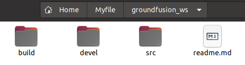
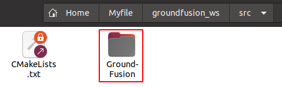
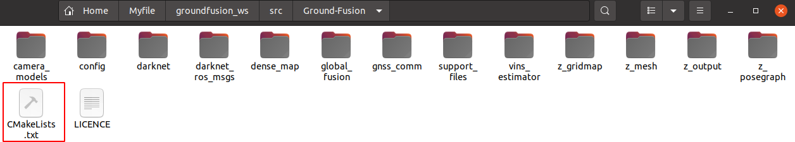
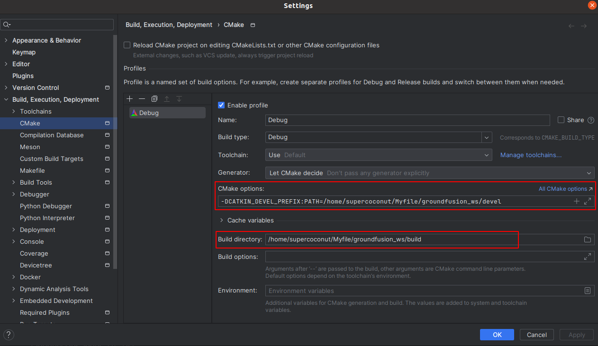
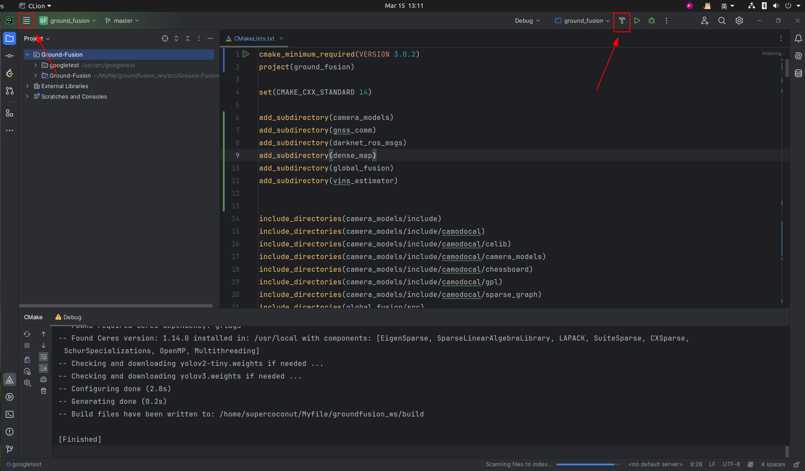

[TOC]


# Tutorial of mySLAM


​    从零构建一个SLAM系统。具体的流程肯定是仿造OpenVins的框架来进行的，因为他们的代码框架比较清晰，而且在看一个关于SuperPoint+SuperGlue+OpenVins的report中发现OpenVins的可修改性比较高，所以这里使用OpenVins开始研究。

*****


## 运行环境设置(ROS1)


### ROS工作目录

- 在一个ROS中的工作空间中，src下包含着多个功能包。并且需要注意在src的顶层目录下，需要设计一个top-level的CMakeLists.txt(即使用中央集权的方式来管理整个ROS工作空间下的功能包——这就是Clion中使用管理ROS项目的方式)
    - 每一个功能包中必须包含了一个CMakeLists.txt以及package.xml文件

- 使用catkin tools以及catkin build来编译ROS项目，最终在工作空间下生成的文件夹与catkin_make生成的稍微有一些不一样，但是即使是使用caktin build编译过的ROS项目，也可以设置一个top-level的CMakeLists.txt在clion中管理整个项目**(正常来说catkin build不需要这个top-level的CMakeLists.txt来编译)**

    

简单的工作空间的目录格式为:

```
workspace_folder/          -- WORKSPACE  
  src/                             
    CMakeLists.txt           -- 'Toplevel' CMake file, provided by catkin  
    
    package_1/  
      CMakeLists.txt         -- CMakeLists.txt file for package_1  
      package.xml            -- Package manifest for package_1  
    ...  
    package_n/  
      CMakeLists.txt        -- CMakeLists.txt file for package_n  
      package.xml           -- Package manifest for package_n 
```

对于package中的内容解释的更详细一些，基本上大型的开源项目中框架都是按照这种方式

```
workspace --- 自定义的工作空间

    |--- build:编译空间，用于存放CMake和catkin的缓存信息、配置信息和其他中间文件。

    |--- devel:开发空间，用于存放编译后生成的目标文件，包括头文件、动态&静态链接库、可执行文件等。

    |--- src: 源码

        |-- package：功能包(ROS基本单元)包含多个节点、库与配置文件，包名所有字母小写，只能由字母、数字与下划线组成

            |-- CMakeLists.txt 配置编译规则，比如源文件、依赖项、目标文件

            |-- package.xml 包信息，比如:包名、版本、作者、依赖项...(以前版本是 manifest.xml)

            |-- scripts 存储python文件

            |-- src 存储C++源文件

            |-- include 头文件

            |-- msg 消息通信格式文件

            |-- srv 服务通信格式文件

            |-- action 动作格式文件

            |-- launch 可一次性运行多个节点 

            |-- config 配置信息

        |-- CMakeLists.txt: 编译的基本配置

```


### Package.xml文件

catkin_create_pkg直接生成的package.xml文件，目前来说由于没有弄明白整体的依赖关系，所以暂时依赖项只写了roscpp与rospy。并且package.xml现在有老/新版本两种，虽然有点不一样，但是本质上差别不大。关于指定这个<buildtool_depend>,如果不是交叉编译的话,基本上就是catkin。

- **使用run_depend以及build_depend(新版本中变成了depend，这就是旧/新版本的区别)**将库文件引入到了这个Cpp项目中。如果是一个静态库，在编译的时候内容就已经被拷贝一份到项目中了，动态库就是需要运行的时候才到项目中。run_depend以及build_depend就是指定编译以及运行时对库的依赖关系。新版本中的一个depend就同时指定了编译与运行的依赖关系.

- 每一个包中的package.xml是需要与CMakeLists.txt中对应上(具体是哪里对应上后面再看，不碰到问题不用考虑)

<font color=green>**官方文档:**</font>

> The package manifest with minimal tags does not specify any dependencies on other packages. Packages can have six types of dependencies:
>
> - **Build Dependencies** specify which packages are needed to build this package. This is the case when any file from these packages is required at build time. This can be including headers from these packages at compilation time, linking against libraries from these packages or requiring any other resource at build time (especially when these packages are *find_package()*-ed in CMake). In a cross-compilation scenario build dependencies are for the targeted architecture.
> - **Build Export Dependencies** specify which packages are needed to build libraries against this package. This is the case when you transitively include their headers in public headers in this package (especially when these packages are declared as (CATKIN_)DEPENDS in *catkin_package()* in CMake).
> - **Execution Dependencies** specify which packages are needed to run code in this package. This is the case when you depend on shared libraries in this package (especially when these packages are declared as (CATKIN_)DEPENDS in *catkin_package()* in CMake).
> - **Test Dependencies** specify only *additional* dependencies for unit tests. They should never duplicate any dependencies already mentioned as build or run dependencies.
> - **Build Tool Dependencies** specify build system tools which this package needs to build itself. Typically the only build tool needed is catkin. In a cross-compilation scenario build tool dependencies are for the architecture on which the compilation is performed.
> - **Documentation Tool Dependencies** specify documentation tools which this package needs to generate documentation.
>
> These six types of dependencies are specified using the following respective tags:
>
> - `<depend>` specifies that a dependency is a build, export, and execution dependency. This is the most commonly used dependency tag.
> - `<build_depend>`
> - `<build_export_depend>`
> - `<exec_depend>`
> - `<test_depend>`
> - `<buildtool_depend>`
> - `<doc_depend>`


PS：

<font color=blue>1. 在生成ov_msckf的package.xml中还应该ov_core与ov_init的依赖，这里不知道写的对不对</font>


****


### CMakeLists.txt文件

这里openvins中是直接包含了一些.cmake文件用于CMakeLists.txt文件中

- 关于.cmake文件: 在openvins以及vins mono项目中其实都包含.cmake文件, .cmake文件就是一些重复频率比较高的cmake命令，直接include到CMakeLists.txt可以简化文件的内容。

#### Top-level CMakeLists.txt

- 最顶层的CMakeLists.txt只需要将所有功能包使导入该文件中就行(用add_subdirectory)，其余部分不需要操心 
    - **add_subdirectory(source_dir [binary_dir] [EXCLUDE_FROM_ALL] [SYSTEM])**  这里指定的source_dir对应的子文件夹(其中包含了CMakeLists.txt和代码文件) 


```cmake
cmake_minimum_required(VERSION 3.3)
project(open_vins)
ADD_SUBDIRECTORY(ov_core)   # 对应这一个名为ov_core的文件夹
ADD_SUBDIRECTORY(ov_data)
ADD_SUBDIRECTORY(ov_eval)
ADD_SUBDIRECTORY(ov_init)
ADD_SUBDIRECTORY(ov_msckf)
```


#### ROS 功能包 CMakeLists.txt

​	在一个单独的cpp文件中，开始的部分就是#include头文件到该文件。但是这个头文件的路径在程序中是未知的，故需要在CMakeLists.txt中使用**include_directories()**指定头文件的路径。但是大部分的头文件都只包含着函数声明，变量定义等等——但函数不仅仅需要声明还需要定义，即需要使用 **target_link_libraries()**将头文件对应着的库文件链接到可执行文件上。CMakeLists.txt剩下的内容都是在这个基础上的修改，主体框架没有大幅度的变化。

- 导入头文件时还会有第二种方法 target_include_directories: 这种方式需要指定一个可执行文件后，再设置一个头文件的搜索目录(这种指定头文件的方式是专门为一个可执行文件指定路径的，第一种方法是对所有的都指定)


对于库文件，除了第三方库，还有自己使用源文件生成的静态/动态库，但是我只看见生成库文件的时候都只使用了source源文件，没有指定.h文件


**信息输出**

```cmake
# 对于一些未知的路径或者CMakeLists.txt中对应变量值，都可以使用这种方式进行输出
message(STATUS  "BOOST: " ${Boost_VERSION} )
```


**catkin_package | find_package**

- find_package 即找一个库文件对应的头文件路径与库文件路径，即下表中对应的路径。但是每一个库的include与库文件对应的路径变量名可能是不一样。如Boost就是Boost_INCLUDE_DIRS但是Eigen3就是EIGEN3_INCLUDE_DIR，这与开发者有关系。如果想判断是否成功对应上就使用message(...)来判断一下 **message(STATUS "Eigen3 include dir: ${EIGEN3_INCLUDE_DIR}")**有正常输出就可以认为是正确的!!

```cmake
_FOUND
_INCLUDE_DIR
_LIBRARY or _LIBRARIES
```

```cmake
# find_package() 找四个库 | 后面对应的就是其对应的头文件、库文件路径
find_package(Eigen3 REQUIRED)
find_package(OpenCV 3 QUIET)
find_package(Boost REQUIRED COMPONENTS system filesystem thread date_time)
find_package(Ceres REQUIRED)

include_directories(
        ${EIGEN3_INCLUDE_DIR}
        ${Boost_INCLUDE_DIRS}
        ${CERES_INCLUDE_DIRS}
        ${catkin_INCLUDE_DIRS}
)
```


- catkin_package 相当于是让其他导入该文件生成的库文件 | 这里主要是与包与包之间的互相调用有用


还有问题，就是感觉直接这么写没有报错 | 按理来说只改变这一处地方应该不对

调用其他功能包应该改 package.xml | catkin_package 以及find_package三个部分。

```cmake
find_package(catkin REQUIRED COMPONENTS
  roscpp
  rospy
  ov_core
)
```


**node 节点**

- launch中设置ROS node 节点 | 关于节点的名称在Cpp文件的ros::init(argc, argv, "run_subscribe_msckf");第三个参数就指定了该node的节点名称(但是这个node的名称会被launch文件中的node name中名称覆盖)
    - pkg 功能包名称
    - type 可执行文件(就是在CMakeLists.txt中add_executable中生成的可执行文件)
    - name 看起来是一个没用的参数，如果使用rosrun的话，只需要指定功能包与可执行文件名就可以了 | 但如果想在一个launch文件中执行多个相同的node节点，就可以通过改变name的方式实现(很多multi-slam的框架就是这么使用的)

```cmake
# 设置多个slam节点 对应的pkg与type都是相同的
<node pkg="ccmslam" type="ccmslamClientNode" name="ccmslamClientNode0"  output="screen">
<node pkg="ccmslam" type="ccmslamClientNode" name="ccmslamClientNode1"  output="screen">
```


****


### Clion 调试 ROS

clion编辑器主要是在debug比较方便，但是配置上需要稍微注意下。  

#### 项目打开目录

对于使用catkin_make编辑的项目，需要一个top-level的CMakeLists.txt文件，其打开的目录有两种

- 项目的最顶层目录

    

- src中的功能包目录-这里的功能包都放在了Ground-Fusion里面，这里需要在终端中打开此文件夹，再输入clion ./




​	对应的Top-level的CMakeLists.txt就与这些功能包在同一级别




​	**对于使用catkin tools/build这些方法进行编译管理的ros项目，其实是没有top-level对应的CMakeLists.txt，这样clion的打开目录就只能直接在单个功能包中单独打开。**或者也可以直接自己新建一个top-level的CMakeLists.txt。


#### CMake | Build | Run

​	一个程序写好之后，到最后的运行过程： **在clion中reload/load cmake project(右键CMakeLists.txt文件)，这就生成了makefile文件，之后再build the project，才会生成一些可执行文件**，最后才是run. 

- cmake设置： 就是设置一些cmake的参数与生成信息的路径 | 主要是build与devel文件



- build设置 | run

    运行左侧就有一个“T”字符代表着编译文件，需要先编译，然后再去运行(或者是去setting里面找build the porject)




#### clion | roslaunch

- roslaunch : clion中不能直接像在终端中一样直接实现roslaunch的功能。但是roslaunch中不仅可以启动多个node节点，而且可以设置一些参数直接进行参数的传递(很方便)。因为clion是直接启动一个节点的编辑器，所以一个即能启动ros节点，又能进行参数传递的方法是:

> 1. 重新建立一个roslaunch，将节点
>
> ```xml
> <node name="**" pkg="pose_graph" type="**" output="**">
> ```
>
> ​	改为
>
> ```xml
> <group ns="pose_graph">
> ```
>
> ​	就可以实现加载参数和运行其他不需要调试节点的目的
>
> 2. 在终端运行roslaunch 
>
> 3. 在clion里面直接运行/调试节点


参考链接:

1. http://www.autolabor.com.cn/book/ROSTutorials/ ROS的教程

2. https://blog.csdn.net/qq_38410730/article/details/102677143 .cmake文件

3. https://blog.csdn.net/wangxiao7474/article/details/109840779 package.xml文件

4. https://blog.csdn.net/jinzhu1911/article/details/104940277 Boost库的使用

     


****


## 运行环境设置 ROS2

ROS2现在主要是工业届在使用，这里先使用ros2来进行环境的编译


****


Debug过程中的设置

1. https://github.com/HKUST-Aerial-Robotics/VINS-Mono/pull/385/files?w=1 关于vins mono的程序如何从18.04到20.04

2. https://blog.csdn.net/m0_53271135/article/details/131115002 fmt的设置出现问题(这个与Sophus设置有关)

3. https://zhuanlan.zhihu.com/p/678604386 也就是模板类的sophus库的安装方式

    


## Bash文件 

想设计一个bash文件，可以一键将这个slam环境中需要的第第三方库都完成安装


## Docker 环境配置

- docker环境的配置 除去clion远程来控制docker中的程序进行调试，还有就是直接将本地的目录挂载到docker中进行开发

    


