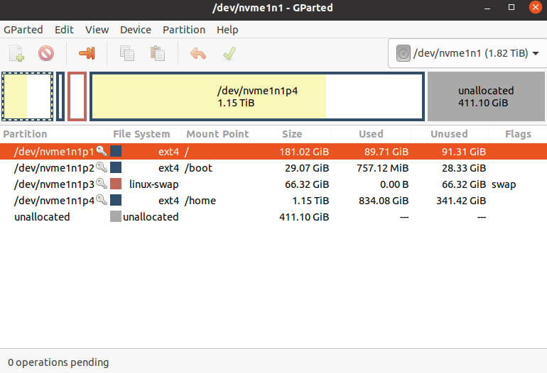
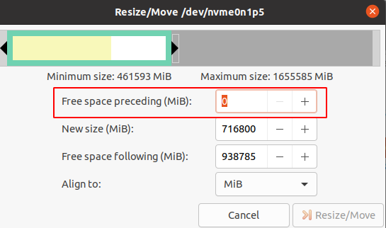
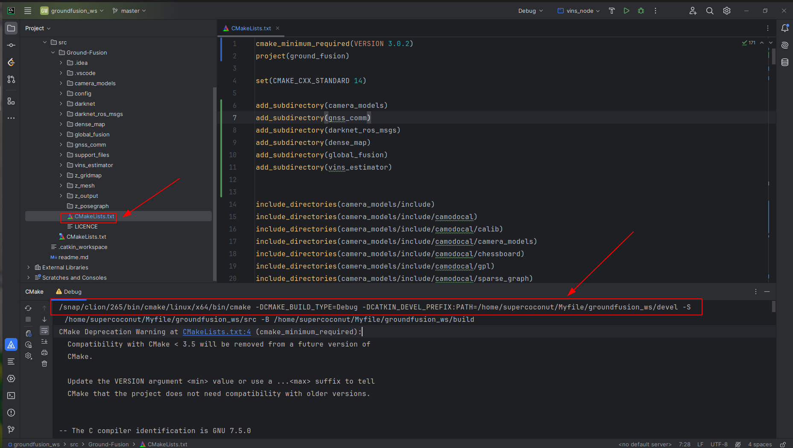
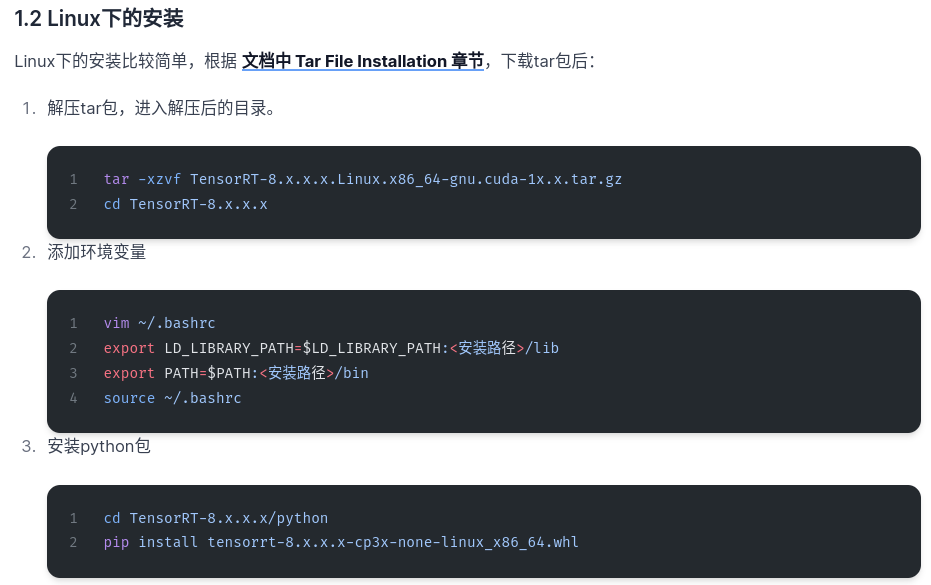

[TOC]


# Tutorial of mySLAM


​    从零构建一个SLAM系统。具体的流程肯定是仿造OpenVins的框架来进行的，因为他们的代码框架比较清晰，而且在看一个关于SuperPoint+SuperGlue+OpenVins的report中发现OpenVins的可修改性比较高，所以这里使用OpenVins开始研究。

*****


## Linux 设置

- 安装第三方库的时候，如果使用的是源码安装，一般都是直接使用git下载之后，mkdir build && cd build，然后最后sudo make install。这种安装方式，会将文件安装到 /usr/local/bin.
- 使用apt-get的安装方法，系统安装软件一般在/usr/share，可执行的文件在/usr/bin，配置文件可能安装到了/etc下等。文档一般在 /usr/share；可执行文件 /usr/bin；配置文件 /etc；lib文件 /usr/lib

### Gparted 更改硬盘分区

在使用ubuntu的过程中，看到之前分配的空间不够了。我使用的分区是 /(根目录) | /home | swap area | /boot四个区，但是经常被大量使用的区是/以及/home。但是 /根目录对应的空间是不够了，但是查看Blog的时候都是设置软链接(这种方法我感觉很复杂，有些花里胡哨)，不如直接使用剩余未分配的空间转移给/。下面是我使用的方法:

- 更换挂载 使用一个ubuntu20.04的启动盘，进入BIOS再进入这个系统中(不是使用器重装系统，是选择try ubuntu)，再进入到Gparted(自带的分盘工具)。这么做是因为在使用系统的时候，没法对这个系统的分区进行操作。



- 从上图的右往左来分配，先选择最右侧的区域(这里对应的是/home，如果其后面没有未分配空间的话，需要先resize这个区的大小，再进行剩余操作)。



- 最主要的操作就是设置每一个区域的 Free space preceeding，能在这个区域前面生成出来一部分的未分配空间，如此反复，直到在根目录/之后出现一块未分配空间，然后直接扩展/的大小即可。
- 剩余就是保存设置，等待Gparted完成设置(我2TB的硬盘操作了巨长时间，但是不需要那种软链接的方式)。


****


## 运行环境设置(ROS1)


### ROS工作目录

- 在一个ROS中的工作空间中，src下包含着多个功能包。并且需要注意在src的顶层目录下，需要设计一个top-level的CMakeLists.txt(即使用中央集权的方式来管理整个ROS工作空间下的功能包——这就是Clion中使用管理ROS项目的方式)
    - 每一个功能包中必须包含了一个CMakeLists.txt以及package.xml文件

- 使用catkin tools以及catkin build来编译ROS项目，最终在工作空间下生成的文件夹与catkin_make生成的稍微有一些不一样，但是即使是使用caktin build编译过的ROS项目，也可以设置一个top-level的CMakeLists.txt在clion中管理整个项目**(正常来说catkin build不需要这个top-level的CMakeLists.txt来编译)**

    

简单的工作空间的目录格式为:

```
workspace_folder/          -- WORKSPACE  
  src/                             
    CMakeLists.txt           -- 'Toplevel' CMake file, provided by catkin  
    
    package_1/  
      CMakeLists.txt         -- CMakeLists.txt file for package_1  
      package.xml            -- Package manifest for package_1  
    ...  
    package_n/  
      CMakeLists.txt        -- CMakeLists.txt file for package_n  
      package.xml           -- Package manifest for package_n 
```

对于package中的内容解释的更详细一些，基本上大型的开源项目中框架都是按照这种方式

```
workspace --- 自定义的工作空间

    |--- build:编译空间，用于存放CMake和catkin的缓存信息、配置信息和其他中间文件。

    |--- devel:开发空间，用于存放编译后生成的目标文件，包括头文件、动态&静态链接库、可执行文件等。

    |--- src: 源码

        |-- package：功能包(ROS基本单元)包含多个节点、库与配置文件，包名所有字母小写，只能由字母、数字与下划线组成

            |-- CMakeLists.txt 配置编译规则，比如源文件、依赖项、目标文件

            |-- package.xml 包信息，比如:包名、版本、作者、依赖项...(以前版本是 manifest.xml)

            |-- scripts 存储python文件

            |-- src 存储C++源文件

            |-- include 头文件

            |-- msg 消息通信格式文件

            |-- srv 服务通信格式文件

            |-- action 动作格式文件

            |-- launch 可一次性运行多个节点 

            |-- config 配置信息

        |-- CMakeLists.txt: 编译的基本配置

```


### Package.xml文件

catkin_create_pkg直接生成的package.xml文件，目前来说由于没有弄明白整体的依赖关系，所以暂时依赖项只写了roscpp与rospy。并且package.xml现在有老/新版本两种，虽然有点不一样，但是本质上差别不大。关于指定这个<buildtool_depend>,如果不是交叉编译的话,基本上就是catkin。

- **使用run_depend以及build_depend(新版本中变成了depend，这就是旧/新版本的区别)**将库文件引入到了这个Cpp项目中。如果是一个静态库，在编译的时候内容就已经被拷贝一份到项目中了，动态库就是需要运行的时候才到项目中。run_depend以及build_depend就是指定编译以及运行时对库的依赖关系。新版本中的一个depend就同时指定了编译与运行的依赖关系.

- 每一个包中的package.xml是需要与CMakeLists.txt中对应上(具体是哪里对应上后面再看，不碰到问题不用考虑)

<font color=green>**官方文档:**</font>

> The package manifest with minimal tags does not specify any dependencies on other packages. Packages can have six types of dependencies:
>
> - **Build Dependencies** specify which packages are needed to build this package. This is the case when any file from these packages is required at build time. This can be including headers from these packages at compilation time, linking against libraries from these packages or requiring any other resource at build time (especially when these packages are *find_package()*-ed in CMake). In a cross-compilation scenario build dependencies are for the targeted architecture.
> - **Build Export Dependencies** specify which packages are needed to build libraries against this package. This is the case when you transitively include their headers in public headers in this package (especially when these packages are declared as (CATKIN_)DEPENDS in *catkin_package()* in CMake).
> - **Execution Dependencies** specify which packages are needed to run code in this package. This is the case when you depend on shared libraries in this package (especially when these packages are declared as (CATKIN_)DEPENDS in *catkin_package()* in CMake).
> - **Test Dependencies** specify only *additional* dependencies for unit tests. They should never duplicate any dependencies already mentioned as build or run dependencies.
> - **Build Tool Dependencies** specify build system tools which this package needs to build itself. Typically the only build tool needed is catkin. In a cross-compilation scenario build tool dependencies are for the architecture on which the compilation is performed.
> - **Documentation Tool Dependencies** specify documentation tools which this package needs to generate documentation.
>
> These six types of dependencies are specified using the following respective tags:
>
> - `<depend>` specifies that a dependency is a build, export, and execution dependency. This is the most commonly used dependency tag.
> - `<build_depend>`
> - `<build_export_depend>`
> - `<exec_depend>`
> - `<test_depend>`
> - `<buildtool_depend>`
> - `<doc_depend>`


PS：

<font color=blue>1. 在生成ov_msckf的package.xml中还应该ov_core与ov_init的依赖，这里不知道写的对不对</font>


****


### CMakeLists.txt文件

这里openvins中是直接包含了一些.cmake文件用于CMakeLists.txt文件中

- 关于.cmake文件: 在openvins以及vins mono项目中其实都包含.cmake文件, .cmake文件就是一些重复频率比较高的cmake命令，直接include到CMakeLists.txt可以简化文件的内容。

#### Top-level CMakeLists.txt

- 最顶层的CMakeLists.txt只需要将所有功能包使导入该文件中就行(用add_subdirectory)，其余部分不需要操心 
    - **add_subdirectory(source_dir [binary_dir] [EXCLUDE_FROM_ALL] [SYSTEM])**  这里指定的source_dir对应的子文件夹(其中包含了CMakeLists.txt和代码文件) 


```cmake
cmake_minimum_required(VERSION 3.3)
project(open_vins)
ADD_SUBDIRECTORY(ov_core)   # 对应这一个名为ov_core的文件夹
ADD_SUBDIRECTORY(ov_data)
ADD_SUBDIRECTORY(ov_eval)
ADD_SUBDIRECTORY(ov_init)
ADD_SUBDIRECTORY(ov_msckf)
```


#### ROS 功能包 CMakeLists.txt

​	在一个单独的cpp文件中，开始的部分就是#include头文件到该文件。但是这个头文件的路径在程序中是未知的，故需要在CMakeLists.txt中使用**include_directories()**指定头文件的路径。但是大部分的头文件都只包含着函数声明，变量定义等等——但函数不仅仅需要声明还需要定义，即需要使用 **target_link_libraries()**将头文件对应着的库文件链接到可执行文件上。CMakeLists.txt剩下的内容都是在这个基础上的修改，主体框架没有大幅度的变化。

- 导入头文件时还会有第二种方法 target_include_directories: 这种方式需要指定一个可执行文件后，再设置一个头文件的搜索目录(这种指定头文件的方式是专门为一个可执行文件指定路径的，第一种方法是对所有的都指定)


对于库文件，除了第三方库，还有自己使用源文件生成的静态/动态库，但是我只看见生成库文件的时候都只使用了source源文件，没有指定.h文件


**CMAKE_PREFIX_PATH 查找路径**

​	给cmake指定了路径去进行查找-相当于为find_package()`，`find_program()`，`find_library()`，`find_file()`和`find_path()指定了路径。并且其可以指定的路径有很多个，每一个互相之间用;隔开。同时也三可以指定list命令(其相当于在一个变量的最后再加上一个值，再这里就可以拓宽CMAKE_PREFIX_PATH指定的路径)

```cmake
list(APPEND CMAKE_PREFIX_PATH "/opt/eigen-3.4.0")
```


**message 信息输出**

```cmake
# 对于一些未知的路径或者CMakeLists.txt中对应变量值，都可以使用这种方式进行输出
message(STATUS  "BOOST: " ${Boost_VERSION} )
```


**catkin_package | find_package**

- find_package 即找一个库文件对应的头文件路径与库文件路径，即下表中对应的路径。但是每一个库的include与库文件对应的路径变量名可能是不一样。如Boost就是Boost_INCLUDE_DIRS但是Eigen3就是EIGEN3_INCLUDE_DIR，这与开发者有关系。如果想判断是否成功对应上就使用message(...)来判断一下 **message(STATUS "Eigen3 include dir: ${EIGEN3_INCLUDE_DIR}")**有正常输出就可以认为是正确的!!

```cmake
_FOUND
_INCLUDE_DIR
_LIBRARY or _LIBRARIES
```

```cmake
# find_package() 找四个库 | 后面对应的就是其对应的头文件、库文件路径
find_package(Eigen3 REQUIRED)
find_package(OpenCV 3 QUIET)
find_package(Boost REQUIRED COMPONENTS system filesystem thread date_time)
find_package(Ceres REQUIRED)

include_directories(
        ${EIGEN3_INCLUDE_DIR}
        ${Boost_INCLUDE_DIRS}
        ${CERES_INCLUDE_DIRS}
        ${catkin_INCLUDE_DIRS}
)
```


- catkin_package 相当于是让其他导入该文件生成的库文件 | 这里主要是与包与包之间的互相调用有用


还有问题，就是感觉直接这么写没有报错 | 按理来说只改变这一处地方应该不对

调用其他功能包应该改 package.xml | catkin_package 以及find_package三个部分。

```cmake
find_package(catkin REQUIRED COMPONENTS
  roscpp
  rospy
  ov_core
)
```


**其余**

- set的作用是 设置变量值 —— 这里设置变量来代表路径 —— 并且使用add_definitions()来做宏定义 这样可以在代码中使用类似于#ifdef xx来判断是否定义了这个宏

    


**node 节点**

- launch中设置ROS node 节点 | 关于节点的名称在Cpp文件的ros::init(argc, argv, "run_subscribe_msckf");第三个参数就指定了该node的节点名称(但是这个node的名称会被launch文件中的node name中名称覆盖)
    - pkg 功能包名称
    - type 可执行文件(就是在CMakeLists.txt中add_executable中生成的可执行文件)
    - name 看起来是一个没用的参数，如果使用rosrun的话，只需要指定功能包与可执行文件名就可以了 | 但如果想在一个launch文件中执行多个相同的node节点，就可以通过改变name的方式实现(很多multi-slam的框架就是这么使用的)

```cmake
# 设置多个slam节点 对应的pkg与type都是相同的
<node pkg="ccmslam" type="ccmslamClientNode" name="ccmslamClientNode0"  output="screen">
<node pkg="ccmslam" type="ccmslamClientNode" name="ccmslamClientNode1"  output="screen">
```


****


### Clion 调试 ROS

​	clion编辑器主要是在debug比较方便，但是配置上需要稍微注意下。与在终端中直接使用catkin_make来编译程序相比，clion在编译程序中使用的还是cmake(catkin只是一种包装好的cmake方式，本质上还是cmake) | 这里加载CMakeList.txt文件的时候就会出现如下提示，说明clion中的编辑方式是cmake，只不过修改了一些文件的输出路径到ros程序中的devel与build文件夹中



#### 项目打开目录

对于使用catkin_make编辑的项目，需要一个top-level的CMakeLists.txt文件，其打开的目录有两种

- 项目的最顶层目录

    

- src中的功能包目录-这里的功能包都放在了Ground-Fusion里面，这里需要在终端中打开此文件夹，再输入clion ./


​	对应的Top-level的CMakeLists.txt就与这些功能包在同一级别


​	**对于使用catkin tools/build这些方法进行编译管理的ros项目，其实是没有top-level对应的CMakeLists.txt，这样clion的打开目录就只能直接在单个功能包中单独打开。**或者也可以直接自己新建一个top-level的CMakeLists.txt。


#### CMake | Build | Run

​	一个程序写好之后，到最后的运行过程： **在clion中reload/load cmake project(右键CMakeLists.txt文件)，这就生成了makefile文件，之后再build the project，才会生成一些可执行文件**，最后才是run. 

- cmake设置： 就是设置一些cmake的参数与生成信息的路径 | 主要是build与devel文件


- build设置 | run

    运行左侧就有一个“T”字符代表着编译文件，需要先编译，然后再去运行(或者是去setting里面找build the porject)


#### clion | roslaunch

- roslaunch : clion中不能直接像在终端中一样直接实现roslaunch的功能。但是roslaunch中不仅可以启动多个node节点，而且可以设置一些参数直接进行参数的传递(很方便)。因为clion是直接启动一个节点的编辑器，所以一个即能启动ros节点，又能进行参数传递的方法是:

> 1. 重新建立一个roslaunch，将节点
>
> ```xml
> <node name="**" pkg="pose_graph" type="**" output="**">
> ```
>
> ​	改为
>
> ```xml
> <group ns="pose_graph">
> ```
>
> ​	就可以实现加载参数和运行其他不需要调试节点的目的
>
> 2. 在终端运行roslaunch 
>
> 3. 在clion里面直接运行/调试节点

- 在后续分析中看到了clion虽然一次只能调试一个节点，如果这个节点信息需要使用其他节点的话，同样也可以把其他节点信息写到roslaunch中预加载——都是一样的，roslaunch毕竟也只是一次启动多个可执行文件——所以这里将要调试的节点与其他节点分开的方法也是可以使用的(还没测试过)

    

### rosrun | roslaunch

​	这里使用的都是 package_name - 之前碰到了一个tab没有补全(已经source过了)，多打几个字符就能正常的tab补全了。package_name都能在package.xml中查到，launch文件在哪个package下都能找到对应。 

```cmake
rosrun package_name executable_file_name
```


```cmake
roslaunch package_name  launch_file_name
```


### rqt 使用

rqt可以方便监视话题信息以及tf树


参考链接:

1. http://www.autolabor.com.cn/book/ROSTutorials/ ROS的教程

2. https://blog.csdn.net/qq_38410730/article/details/102677143 .cmake文件

3. https://blog.csdn.net/wangxiao7474/article/details/109840779 package.xml文件

4. https://blog.csdn.net/jinzhu1911/article/details/104940277 Boost库的使用

     


****


## 运行环境设置 ROS2

ROS2现在主要是工业届在使用，这里先使用ros2来进行环境的编译


****


Debug过程中的设置

1. https://github.com/HKUST-Aerial-Robotics/VINS-Mono/pull/385/files?w=1 关于vins mono的程序如何从18.04到20.04

2. https://blog.csdn.net/m0_53271135/article/details/131115002 fmt的设置出现问题(这个与Sophus设置有关)

3. https://zhuanlan.zhihu.com/p/678604386 也就是模板类的sophus库的安装方式

    


## Nvidia 相关

### nvidia驱动 | cuda | cudnn | libtorch | conda安装

**最需要注意的部分：可以在安装cuda | cudnn | libtorch之前先安装conda —> 这样可以在一个虚拟环境中完成环境的管理，后期想进行环境的替换或者移植到另一台设别上，也都是很方便的(给我一种docker的感觉—>但是conda更像是管理学习相关的虚拟环境，对于其他情况，其效果应该没有docker方便)**

首先是关于显卡驱动 | cuda | cudnn方面的解释(这里没有去使用anaconda去管理环境)

- 显卡驱动明显就是让图形化界显示的更好一些的手段——安装之后就可以使用nvidia-smi来获取driver以及支持的cuda最高版本信息(并不代表安装上了cuda)
- cuda 就是让系统更好的利用显卡设备
- cudnn 更好地利用显卡设备来处理深度学习
- libtorch 就是提供一种C++的方式来搭建模型来处理输数据(模型搭建好之后还是需要python自己训练好的模型权重)


在安装上：

1. nvidia驱动一直是一个比较简单的安装项。只需要自己在设置(ubuntu自带的那种)里找到对应的位置就可以直接安装。在安装过程中需要设置一个boot的密码，然后reboot。在reboot之后一定不要选择continue boot(也就是第一项)
    - 反正是reboot之后会出现四个选项，选择第一项就是continue boot(选择之后重新启动也没有完成显卡驱动安装 | 这次安装选择的是第二项 enroll那种) 
    - 但是在后续使用的过程中出现了显卡驱动失效的情况，具体原因是因为系统内核升级了，导致了内核kernel与驱动版本不对应从525升级到了545之后，nvidia-smi可以正常输出
2. 安装cuda以及cudnn可以选择deb或者.run文件的安装方式，但是一定要注意对应的版本问题。这次安装的是cuda-11.8以及cudnn8(cuda的路径/usr/local/cuda-11.8)

    - cuda的安装完成之后要在bashrc中加入一些语句

    - cudnn的安装之后要发现查找cudnn.h或者cudnn_version.h都没有正常时，需要使用这个[教程](https://blog.csdn.net/weixin_39518984/article/details/120881546)中的命令sudo cp cuda/include/cudnn_version.h /usr/local/cuda/include/ 


3. libtorch的安装——这里的安装简单，-d即指定了安装路径，我已经习惯将其安装到/usr/local中了

```CPP
#! /bin/bash
wget -O LibTorch.zip https://download.pytorch.org/libtorch/cu102/libtorch-cxx11-abi-shared-with-deps-1.6.0.zip
sudo unzip LibTorch.zip -d /usr/local
```

4. conda 安装 + 使用

    - 安装 —— 之前在使用conda是在~/.bashrc中设置的环境变量，现在变成在/etc/profile中使用。如果在安装完之后conda命令(command not found),可以使用source /etc/profile，之后就能使用conda。剩余问题可以看这个https://blog.csdn.net/qq_33825817/article/details/88959785。

    


参考链接:

1. [安装教程(但是缺少了最后在bashrc中需要添加的内容)](https://blog.csdn.net/qq_34972053/article/details/127689332?utm_medium=distribute.pc_relevant.none-task-blog-2~default~baidujs_baidulandingword~default-8-127689332-blog-119003405.235^v43^pc_blog_bottom_relevance_base5&spm=1001.2101.3001.4242.5&utm_relevant_index=11)

2. https://blog.csdn.net/h3c4lenovo/article/details/119003405

3. [cuda 卸载](https://blog.csdn.net/2301_77554343/article/details/134376103?utm_medium=distribute.pc_relevant.none-task-blog-2~default~baidujs_baidulandingword~default-0-134376103-blog-121158255.235^v43^pc_blog_bottom_relevance_base5&spm=1001.2101.3001.4242.1&utm_relevant_index=3)

4. [卸载教程](https://blog.51cto.com/u_15905131/5918429)

5. [libtorch使用教程](https://blog.51cto.com/u_15088375/5735740)

6. [conda安装使用](https://www.eriktse.com/technology/1008.html)

      

cuda| cudnn官方教程

1. cudnn https://developer.nvidia.com/rdp/cudnn-archive 
2. cuda https://developer.nvidia.com/cuda-11-8-0-download-archive?target_os=Linux&target_arch=x86_64&Distribution=Ubuntu&target_version=20.04&target_type=deb_local


****


还是有很多不理解的地方的——conda中安装的环境怎么管理，cmakelists.txt如何去找conda中的安装的cuda 


将模型运行到Cpp上还有的方法：onnx以及tensorRT

现在还有一个人的博客写的挺精彩的 

https://arxiv.org/pdf/1711.02508.pdf

https://zhuanlan.zhihu.com/p/96465592

https://zhuanlan.zhihu.com/p/269257787

就是这个博客，很好看

https://sjtu-robotics.com/zh/blog/2024/hello-jacobian/


### pycharm 

将自己解压好的数据转换一下然后打开对应文件夹进行处理

sudo mv pycharm-2024.1 /opt/

cd /opt/pycharm-2024.1/

如果想启动pycharm就可以使用如下命令

sh /opt/pycharm-2024.1/bin/pycharm.sh


参考链接:

https://zhuanlan.zhihu.com/p/457328760


### libtorch

- 尝试使用libtorch的superpoint来运行程序->结果无论在CPU/GPU上都是几百ms一帧，正常的速度应该是几十ms一帧。出现的问题就是需要频繁地更换版本来满足在github中程序所需要的版本 (删除起来其实也很简单的)。使用的版本：

    - cuda 11.3

      ​    


  

ncnn 专门使用CPU来进行推理的模型（这个是我在看let-net中发现他们使用的网络部署模型）

- 如果要ONNX模型部署到Android设备上，也需要NCNN来进行部署，而不是直接部署ONNX

  ​    

pybind11: C++ 工程如何提供 Python 接口


### onnx

​	对于tensorRT  如果想部署pytorch的模型，就需要将模型的pt文件转换为onnx模型

- onnx 有两个版本的onnxruntime，一个叫onnxruntime，只能使用cpu推理，另一个叫onnxruntime-gpu，既可以使用gpu，也可以使用cpu。


### TensorRT

​	之前看到的博客中提到了tensorRT的推理速度提升的比传统方法好一些,所以这里会尝试使用tensorRT方法。github上面代码使用的tensorRT的版本是8.4.1.5。但是这个版本只能使用30系列的GPU，40系列的GPU使用的框架与30系列不相同，所以会导致版本的不对应，需要重新进行转换。


**关于tensorRT的安装**

(1) 只安装到这里就可以了,官网后面还有一堆onnx的安装wheel。 使用方法为https://suborbit.net/posts/tensorrt-tutorial/



- 但是添加环境变量可使用这种方法 https://blog.csdn.net/qq_46111138/article/details/131686150


参考链接: https://blog.csdn.net/qq_41938005/article/details/132846925


****


## Bash文件 

​	想设计一个bash文件，可以一键将这个slam环境中需要的第三方库都完成安装(这种功能不复杂) | 太复杂的功能实现不了，但是安装第三方库没问题。

- 输入 ./install.sh 需要加上thirdparty的路径 使用的内核数

```bash
#!/bin/bash

# 开始安装过程 依次为 | ceres 1.14.0 | eigen 3.3.7 | pcl 1.11 | Sophus
chmod +x install.sh

echo "-------------------------------------------------------------------Starting the install process-------------------------------------------------------------------"

# 调用脚本文件是 需要加上thirdparty的路径 作为bash文件的第一个参数
#THIRDPARTY_PATH=/home/supercoconut/Myfile/thirdparty
THIRDPARTY_PATH=$1
echo "The directory of thirdparty is " $1
# make使用的内核数 作为bash文件的第二个参数
NR_JOBS=${2:-$(nproc)}
set -e

echo "-------------------------------------------------------------------Installing the Ceres-------------------------------------------------------------------"
sudo apt-get update						# 在docker中出现无法定位一些安装包的时候，使用update可以解决
sudo apt-get install -y liblapack-dev libsuitesparse-dev libgflags-dev
sudo apt-get install -y libgoogle-glog-dev libgtest-dev
sudo apt-get install -y libcxsparse3
cd ${THIRDPARTY_PATH}/ceres-solver-1.14.0/
mkdir build && cd build
cmake ..
make -j${NR_JOBS}
sudo make install


echo "-------------------------------------------------------------------Installing the Eigen-------------------------------------------------------------------"
cd ${THIRDPARTY_PATH}/eigen-3.3.7/
mkdir build && cd build
cmake ..
sudo make install


echo "-------------------------------------------------------------------Installing the pcl-------------------------------------------------------------------"
sudo apt-get update
sudo apt-get install -y build-essential linux-libc-dev cmake cmake-gui libusb-1.0-0-dev libusb-dev libudev-dev
sudo apt-get install -y mpi-default-dev openmpi-bin openmpi-common
sudo apt-get install -y libflann1.9 libflann-dev  # ubuntu20.4对应1.9
sudo apt-get install -y libboost-all-dev libqhull* libgtest-dev freeglut3-dev pkg-config libxmu-dev libxi-dev
sudo apt-get install -y mono-complete libopenni-dev libopenni2-dev
cd ${THIRDPARTY_PATH}/pcl/
mkdir build && cd build
cmake  -DCMAKE_BUILD_TYPE=None ..
make -j${NR_JOBS}
sudo make install


echo "-------------------------------------------------------------------Installing the fmt-------------------------------------------------------------------"
cd ${THIRDPARTY_PATH}/fmt/
mkdir build && cd build
cmake ..
make -j${NR_JOBS}
sudo make install


echo "-------------------------------------------------------------------Installing the Sophus-------------------------------------------------------------------"
cd ${THIRDPARTY_PATH}/Sophus/
mkdir build && cd build
cmake ..
make -j${NR_JOBS}
sudo make install

# 结束
exit 0

```


参考链接

1. https://wangdoc.com/bash/script bash脚本入门


****


## Docker 环境配置

### 常用docker命令

- 设置显示 | 设置网络

```dockerfile
docker run --privileged -it \
           -e NVIDIA_DRIVER_CAPABILITIES=all \
           -e NVIDIA_VISIBLE_DEVICES=all \
           --volume=/home/supercoconut/Myfile/lvisam_ws/src:/home/catkin_ws/src \
           --volume=/tmp/.X11-unix:/tmp/.X11-unix:rw \
           --net=host \
           --ipc=host \
           --shm-size=1gb \
           --name=lvisam \
           --env="DISPLAY=$DISPLAY" \
           tyoung96/lvi_sam:1.0 /bin/bash
```

​      

补充缺少的文件:

docker cp /home/supercoconut/groundfusion 6a961944a2b6:/home


参考链接

1. [docker的使用中配置clion的远程开发](https://blog.csdn.net/maogeweiwu/article/details/135818633?spm=1001.2101.3001.6650.3&utm_medium=distribute.pc_relevant.none-task-blog-2%7Edefault%7EYuanLiJiHua%7EPosition-3-135818633-blog-116946321.235%5Ev43%5Epc_blog_bottom_relevance_base5&depth_1-utm_source=distribute.pc_relevant.none-task-blog-2%7Edefault%7EYuanLiJiHua%7EPosition-3-135818633-blog-116946321.235%5Ev43%5Epc_blog_bottom_relevance_base5&utm_relevant_index=6)


### **目前使用中的docker容器**

1. 17debbbc36f1 包含了安装好的 tensorRT 8.6.1 本身的镜像是cuda11.8-cudnn8.9的nvidia镜像，其中还按照openvins的方法安装了ros。挂载的程序是一个superpoint+superglue的模型，已经成功运行了。

     

2. 18ae66131be1 里面是Lidar4D模型的复现，使用的是conda来管理整个环境，整个程序是ok的。


3. 33cdbaacddbf 中保留的是lvi-sam以及groundfusion两个模型的环境，在实际使用中是导入的thirdparty环境中的bash环境进行安装，但是在实际使用中由于Sophus版本的问题，所以使用的时候需要将在本地的一个Sophus.so文件cp到docker环境中。使用命令为: docker cp /usr/local/lib/libSophus.so 6a961944a2b6:/usr/local/lib/


4. 0fa77a622e0b 中使用的r3live以及immesh的环境，但是在使用中livox驱动存在一定的问题，所以将一个Livox-SDK复制到需要使用的livox驱动中。并且如果想使用immesh中的launch文件，需要在终端中使用export MESA_GL_VERSION_OVERRIDE=3.3即可以成功使用可视化文件

    

    

****


## 传感器

### IMU

1. 6轴传感器 三个轴的加速度+三个轴的角速度 -> 这样可以积分得到三个轴的上面的欧拉角

2. 9轴传感器 在6轴的基础上，多了三个磁力计 -> 在室内使用的效果很差

​	https://zhuanlan.zhihu.com/p/344884686


### lidar

一般来说lidar通过扫描出来的数据在尺度上比图像更大，但是数据没有相机稠密。

- 雷达数据一般包含了四个方面，也可以称其为四维即xyz+反射强度。xyz代表了扫描到的点的几何结构，反射强度可以从侧面解释物体的材质与距离。PCL的库中就有XYZI这种点云的数据格式(点云数据的整体反射率也可以衡量一个雷达性能好坏，一般会用10%的反射率的探测距离来说明)


ROS中的tf工具 

https://blog.csdn.net/wilylcyu/article/details/51724966


这个对于体素解释的很清楚

https://blog.csdn.net/a_eastern/article/details/107508861?spm=1001.2101.3001.6650.3&utm_medium=distribute.pc_relevant.none-task-blog-2%7Edefault%7ECTRLIST%7ERate-3-107508861-blog-121698677.235%5Ev43%5Epc_blog_bottom_relevance_base1&depth_1-utm_source=distribute.pc_relevant.none-task-blog-2%7Edefault%7ECTRLIST%7ERate-3-107508861-blog-121698677.235%5Ev43%5Epc_blog_bottom_relevance_base1&utm_relevant_index=6

这个也是对于voxel的解释

https://blog.csdn.net/m0_47163076/article/details/121698677


