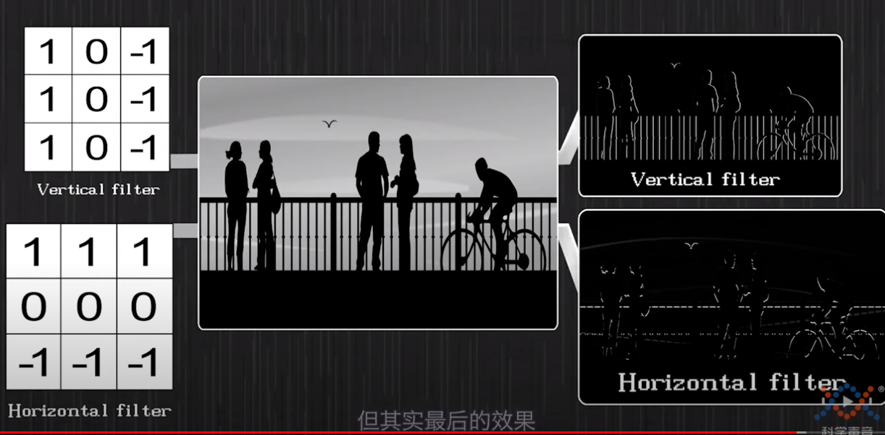

# tutorial_NN

整理网络部分的内容(现在最重要的可能是CNN以及transformer)

## CNN

- 卷积可以从信号的角度来理解(毕竟不是数学专业，不需要从泛函这种方向来了解卷积)。卷积就可以理解为一个信号之前的所有输入值对当前输出值(或者当前状态)的影响，即可以表示为 $\int_{0}^{t}f(x)g(t-x)dx $, 其中f(x)为输入信息，g(t-x)相当于x时刻的输入对t时刻输出的影响（积分区间从负无穷到正无穷也可以理解，这是因为变量的物理意义不同，如果是时间肯定是从0开始，如果是距离那就是从负无穷开始）。

- 对于图像处理中的卷积：图像的卷积就是周围像素与卷积核进行计算，最后生成feature map。在Youtube上看到一个解释是，使用卷积核对图像卷积提取特征的过程就可以理解是 卷积核(假设是3x3大小)与图像像素之间的乘积可以转换为卷积核与图像像素向量之间的点积。在图像中会存在一些区域与卷积核之间的点积值最大，在训练的过程就是计算出一个合适的卷积核，能找到图像中最重要的区域即点积值最大的部分 (后续就可以利用这一部分来进行图像分类等工作)

    - 不同卷积核大小，能看到的图像区域就不一样。这也可以理解成attention注意力机制，3x3大小的卷积核只能观察3x3大小的像素区域。不同大小的卷积核可以是看成不相同的注意力机制。

    

这里的卷积核也可以被认为是filter: (1) 如果在不断训练的过程中，kernel(卷积核)发生变化，这时候kernel转换成的向量与图像中最具有代表性的区域转换成的向量点积结果是最大的，其他部分点积结果小 -> 可以认为是一种滤波。(2) 如果是人为指定的kernel，那就更是滤波了，即提取人为想要的像素特征，如垂直滤波与水平滤波——使用手动设定的卷积核来只提取边缘。

剩余可以继续看的部分:

1. https://zh.d2l.ai/chapter_convolutional-neural-networks/why-conv.html（这里说到的一个平移不变性 | 之前也看到其说CNN具有平移不变性，但是我没有理解出来其含义）
2. https://www.youtube.com/watch?v=GGLr-TtKguA 继续看这个人的新手讲解(一个知识又不是一次能看懂的，肯定是反复的过程，不懂就慢慢看)

## Transfomer

