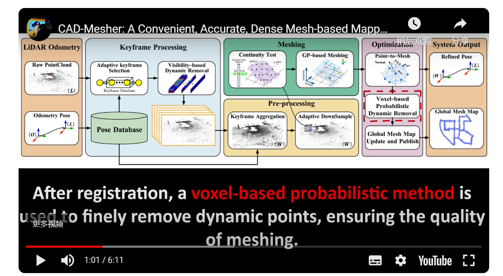
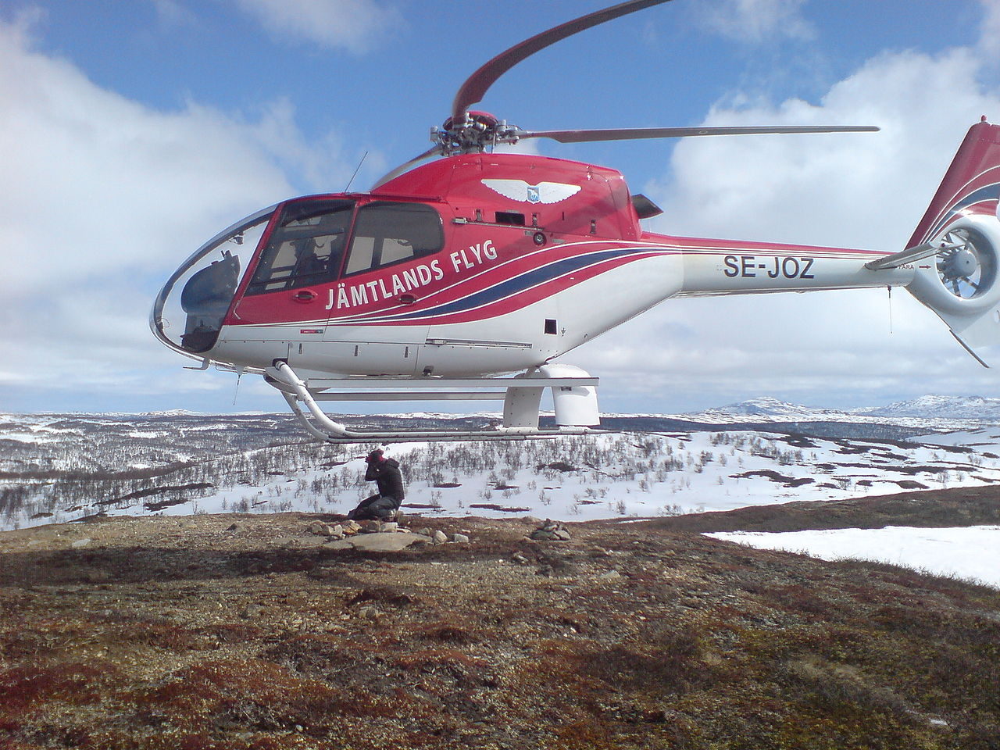

[TOC]


# Single-SLAM

对于单机SLAM，主要是调研一下其在处理corner case的应对策略。主要是针对跨越险阻中提供的数据。但是使用这个数据首先要处理的就是将对rosbag的读取换成读取excel数据读取(在vins上面是有这设置的，因为kitti数据集就是excel格式)

- vins mono 初始化 需要IMU的充分激励以及视觉变化

## 初始化

目前的一个思路是在暑假之前实现出一个多机系统的初始化框架出来-但是首先要完成的是关于vins-fusion框架初始化部分的观看-需要直到这种开源框架中的初始化部分是怎么实现的，之前有关于这个部分实现了open3D的colorICP的使用，实现了相对位姿的计算。


## 视觉

视觉上主要的使用有两个 (1) 定位上使用，使用特征点来定位 (2)


### 开源数据集

- M2DGR 数据集: 分析了当前slam算法可能存在的问题 (在采集的数据上运行SOTA的slam算法来测试结果，并且分析出现误差的原因)
  - 数据集包含的内容很多，六个环绕的鱼眼相机以及红外相机、事件相机都有。GNSS、IMU、雷达数据都包含了，但是没有/odom (M2DGR-plus也已经出来了)
- Ground-Challenge

# Multi-SLAM

## 初始化

多机之间的初始化

- 假定传感器是视觉+IMU传感器+UWB+lidar
- 场景为室内与室外环境


需要实现功能为 (都是一些常规任务，在这里很难提到自己的创新点——但是相比于多机系统，这也算是相当简单的框架了)

1. 常规的SLAM初始化 —— 传感器之间的对齐 | 建立自己的坐标系等等
2. 全局坐标系生成 得到global frame（PGO）可能要去看kimera-multi了(人家确实生成了一个global frame)
3. 点云等信息配准 —— 最后肯定是实现全局建图(目前在做的还是直接点云配准 ——这个思路太简单了)

4. 计算出来的相对位姿与什么真值做比较？

   


(1) 通讯

(2) 计算速度

(3) 场景中是否存在动态物体/或者纹理信息缺少/点云匹配时的Overlap信息缺少


后期每一个agent的累计误差的处理暂时不考虑 —— 先做实验判断哪个部分出现了问题(即先做实验尝试多机初始化会在哪里出现问题 )


还没有来的及看的链接

1. 一个我个人觉得非常好的链接 https://github.com/VIS4ROB-lab/decoSLAM 也是一个有名的实验室的产品 | 但是这里写的关于slam系统的东西有一点难写 | 但是对于slam通讯占用资源的检测、地图的冗余度、以及多机之间构造的这个优化框架是可以看的 —— 这里提到了shared map来避免每一架机的资源浪费
2. 如果想生成类似与众包地图的功能，这是不是多机应该有的东西
3. 手里还是有几个多机的框架没有仔细看的


eigen单独进行优化——在soc-cheap上实现功能(不使用ceres以及GTSAM)

UWB来解决尺度方面上的drift(比如在有GPS以及无GPS环境切换的过程中，使用1到多个UWB来降低drift)

- 之前的定位肯定是一直有误差存在的，在系统运行的过程中，不断地会加入量测信息，这时候的状态估计是结合两者(状态估计与量测)的协方差，使最终得出来的协方差信息一定是两者协方差的结合量。如果量测信息不准，就继续使用状态进行递推。如果新来的量测是准的，那么就可以使用该量测去降低当前状态估计的协方差，让当前状态更准——这不就让整个系统的不确定性下降了么。因为协方差代表的是真实值与估计值之间的误差，所以有效地使用量测可以抑制状态估计中的累积误差。


先验地图生成

- HCTO: Optimality-Aware LiDAR Inertial Odometry with Hybrid Continuous Time Optimization for Compact Wearable Mapping System(没开源)


基于先验地图的SLAM

- RAL 2023 SLICT: Multi-input Multi-scale Surfel-Based Lidar-Inertial Continuous-Time Odometry and Mapping(貌似之前看到过) | 已经开源了


动态光照

- AirVO —— 竟然也是应对动态光照的，还是存视觉的 (点线结合的)


全局回环+全局匹配(貌似比港大的 STD 效果还要好) | 全局定位很容易就会使用语义信息

- Outram: One-shot Global Localization via Triangulated Scene Graph and Global Outlier Pruning(也开源了)
- Segregator: Global Point Cloud Registration with Semantic and Geometric Cues(也开源了)


超出SLAM系统之外再上层——竟然还会出现防止绳子打结的论文(主要是发了TRO以及RSS )。

关于地图融合的——比如在多机任务中，会存在着很多重复区域

Magnetic Field-Aided Global Localization in Repetitive Environments(但是磁场辅助定位是不是太扯了) 


MCD 数据集 —— 用于解决不同区域特征不相同的情况 —— 提供先验点云 | 提供IMU UWB Lidar camera数据

- 雷达数据使用的是Livox 输出


PS:

（1）SLAM交流会里面关于三维重建的时候 有人提到了用realsense信息标定的效果不好，使用colmap这种自己可以估计出来相机外参的效果会更好一些。（2）关于d435i转换得到的深度图是不是精准的问题 —— 可以先直接观察一些是不是稳定的，如果depth图像本身就抖动比较大的话，应该怎么处理这方面。


(2) 之前这个SLAM-craft中的部分还提到了一些雷达里程计设置 | STD+fastlio用作回环检测 | 

或者可以使用一些简单的网络进行特征提取 | Khronos: A Unified Approach for Spatio-Temporal Metric-Semantic SLAM in Dynamic Environments使用语义信息进行high-level任务的处理 | 无人机的巡检任务(IROS 2024以及CARIC任务)


可以阅读论文:

（1）omniColor [https://doi.org/10.48550/arXiv.2404.04693](https://doi.org/10.48550/arXiv.2404.04693)

（2）Mean-shift exploration in shape assembly of robot swarms 非常好的nature工作

（3）Detection, Localization, and Tracking of Multiple MAVs With Panoramic Stereo Camera Networks (TRO)  但是这种跟定位的关系还不是跟紧密

（4）Keypoint-Guided Efficient Pose Estimation and Domain Adaptation for Micro Aerial Vehicles (TRO)

（5）Swarm-SLAM : Sparse Decentralized Collaborative Simultaneous Localization and Mapping Framework for Multi-Robot Systems (RAL)

（6）LIVER: A Tightly Coupled LiDAR-Inertial-Visual State Estimator With High Robustness for Underground Environments (RAL)

（7）DAMS-LIO: A Degeneration-Aware and Modular Sensor-Fusion LiDAR-inertial Odometry（这里我又重复的看到了这个）

（8）Efficient LoFTR: Semi-Dense Local Feature Matching with Sparse-Like Speed (关系不是很大的部分) 

（9）剩下的就看完之前殷哥在群里发的论文

（10）XFeat 比ORB

（11）LTA-OM - 实时长期关联建图

（12）再看一下Automerge

（13）还有在上面说的很多方法

KinectFusion

TSDF


整理corner case detection的部分中发现的论文

1. Map Management Approach for SLAM in Large-Scale Indoor and Outdoor Areas
2. Test your slam! the subt-tunnel dataset and metric for mapping
3. Description of corner cases in automated driving: Goals and challenges
4. Rgb-d inertial odometry for a resource-restricted robot in dynamic environments
    - 关于动态物体的剔除 —— 使用的是object detection and depth information
    - 在nvidia AGX部署的算法
5. Gvins: Tightly coupled gnss–visual–inertial fusion for smooth and consistent state estimation
6. Fast-livo: Fast and tightly-coupled sparse-direct lidarinertial-visual odometry

7. Radio SLAM: A Review on Radio-Based Simultaneous Localization and Mapping
8. X-icp: Localizability-aware lidar registration for robust localization in extreme environments

但是这几篇都不是corner case detection相关的部分


剩余部分

1. Laser–visual–inertial odometry and mapping with high robustness and low drift
2. Resilient and Distributed Multi-Robot Visual SLAM: Datasets, Experiments, and Lessons Learned
3. Swarm-SLAM: Sparse Decentralized Collaborative Simultaneous Localization and Mapping Framework for Multi-Robot Systems
4. LIVER: A Tightly Coupled LiDAR-Inertial-Visual State Estimator With High Robustness for Underground Environments

5. mVLINS: A Multilevel Visual-LiDAR-Inertial Navigation System with Completely Decoupled Odometry and Adaptive Environmental Mapping
6. Locus: A multi-sensor lidar-centric solution for highprecision odometry and 3d mapping in real-time


GroundFusion中没有lidar出现异常状态下的检测

退化场景相关的部分 : 

1. Degeneration-Aware Localization with Arbitrary Global-Local Sensor Fusion （不是好的期刊文章，看起来很烂）
2. Single-Line LiDAR Localization via Contribution Sampling and Map Update Technology
3. Camera Localization with Heterogeneous Sensor Aided Lidar Mapping
4. A Robust LiDAR SLAM Method for Underground Coal Mine Robot with Degenerated Scene Compensation
5. Lidar/UWB fusion based SLAM with anti-degeneration capability
   - DEALING WITH DEGENERATION(TIV的论文，其中一个章节就是用于介绍这部分的内容) —— 使用FIM来进行corner case的数据
6. Range-Aided LiDAR-Inertial Multi-Vehicle Localization and Mapping in Degenerate Environments
7. Dense normal based degeneration-aware 2-D lidar odometry for correlative scan matching
8. Adaptive Denoising-Enhanced LiDAR Odometry for Degeneration Resilience in Diverse Terrains
9. An intensity-augmented LiDAR-inertial SLAM for solid-state LiDARs in degenerated environments
10. UV-SLAM: Unconstrained line-based SLAM using vanishing points for structural mapping
11. An adaptive scheme for degradation suppression in Lidar based SLAM
12. LiDAR SLAM based multivehicle cooperative localization using iterated split CIF
13. Degeneration-aware outlier mitigation for visual inertial integrated navigation system in urban canyons
14. MM-LINS: a Multi-Map LiDAR-Inertial System for Over-Degenerate Environments <font color='blue'>24年的trans, 谢老师组里面做出来的，开源了代码以及数据集，第一作者相当nice, 在github上回复问题回复的相当快</font>
15. MM-Gaussian: 3D Gaussian-based Multi-modal Fusion for Localization and Reconstruction in Unbounded Scenes
16. Mimosa: A multi-modal slam framework for resilient autonomy against sensor degradation
17. LVIO-Fusion: Tightly-Coupled LiDAR-Visual-Inertial Odometry and Mapping in Degenerate Environments (RAL 2024 貌似跟我们做的部分完全一样...fuck，先看这篇论文) <font color='blue'>已经看完，没开源，思路非常简单，对于我的影响不大</font>
18. Degradation Resilient LiDAR-Radar-Inertial Odometry  <font color='blue'>(ICRA) 2024 没有退化检测的部分，但是实验结果给了视频，没有开源代码，实现的步骤是使用GTSAM做的因子图的优化</font>
19. Ct-LVI: A Framework Towards Continuous-time Laser-Visual-Inertial Odometry and Mapping
20. LIC-Fusion
21. Switch-SLAM: Switching-Based LiDAR-Inertial-Visual SLAM for Degenerate Environments (这个才是真撞大车了, hhhh, 要死了，需要赶紧推进度了，但是其没有开源，所以问题不是那么严重)


- 关于可视化的部分有找到了一种方法 Voxblox: Incremental 3D Euclidean Signed Distance Fields for On-Board MAV Planning(IROS 2017),以及其的改进版本Voxblox++


- 这里也提到了一种 openMVG与openMVS一起实时处理数据的部分

https://blog.csdn.net/weixin_51580530/article/details/132448588


 **注意**

既然现在使用KF计算的算法还挺多的，那么可以使用KF做处理，其中这个 FAST-LIO-Multi-Sensor-Fusion 就是在iKFom的基础上完成的整个里程计的递推处理。

- 主要是看KF在这里的作用是什么，数据是如何被融合起来的

- 基于流形的KF使用起来还是很复杂的

不清楚回环检测是如何实现的，但是感觉还是看目前已经存在的算法来实现整个功能

- 基于多传感器优化的时候，发现传感器退化之后是不是需要调试一 下


- 虽然这个地方使用了高斯部分的内容，但是我感觉感觉这里只是使用GS做了mesh重建部分的内容，后面的操作好像都与GS没有关系，变成了纯优化部分的内容




- 关于退化场景的检测工作

  在激光slam中如何判断退化环境。使用表达式、设定阈值这种方法？(此为计算机视觉上面的推荐博文)


**MM-LINS: a Multi-Map LiDAR-Inertial System for Over-Degenerate Environments**

IEEE Transactions on Intelligent Vehicles | 开源 | 谢老师组里面的工作，开源数据集使用的m2DGR(还有一些其他的数据集)。关于lidar点云退化场景，这里是直接设计出一种塑料袋包裹lidar的场景来进行模拟退化场景。右侧图中给出的轨迹应该是目前lidar数据中有一段数据缺失之后，目前开源的程序会出现的问题。


遇到退化场景之前生成的地图在检测到lidar退化之后转换sleep map, 然后不断地进行动态初始化在出退化场景之后生成重新建图，即active map。使用Scan Context描述子去判断sleep与active map之间地相似性，认为两者之间存在重复场景就进行场景地拼接

- 在保留之前地图（sleep map）与生成新地图（active map）之间是退化场景，根据原作者的思路，退化场景的地图是没有办法生成的，里程计部分应该是直接使用imu来做退化场景的过度。

- LIO: 基于fast-lio2进行改进，加入了退化检测以及动态初始化
    - 退化检测 
        - 基于状态的协方差进行判断(特征向量什么的)
    - 动态初始化 
        - 出现退化场景之后对系统进行重新初始化(相比于静态初始化的方法，这里初始化的部分也初始化了速度信息)，方便脱离退化场景之后直接生成新地图(新的active map)
        - 是直接用的vins mono的初始化部分，但是忽略掉了vins mono里面的scale initialization部分


 做关于退化检测的处理 —— 判断在什么时候会出现退化场景


****

### 关于openMVS的整理

openMVS的具体实现 | 主要使用四个部分来进行工作

- **dense point-cloud reconstruction** 先从输入的图像中获取稠密点云

- **mesh重建** 这里负责实现mesh结构

- **mesh refinement**

- **mesh texturing** 纹理信息

输入信息为 多帧图像 + 位姿 (所以这里一般会跟一些SFM的方法联合使用，从这些方法中来生初始的稀疏点云)


OpenMVS 的 TextureMesh 负责实现mesh上纹理信息的叠加，并且使用库也包含了CGAL库，所以我感觉这里的方法会跟Immesh中方法存在一个结合的可能性


****


**DAMS-LIO (ICRA2023)** 退化环境下的激光SLAM 

1. 出现lidar的退化环境之后才会使用其他里程计的Pose信息，其余部分应该都是直接使用正常的lidar里程计 (在多种传感器数据融合以及退化模块检测上存在改进)
2. CRLB 量化里程计性能

（这论文让人看的不是很懂 —— 就连怎么进行退化检测也没有写出来）


## 关于相机果冻效应

D435i 的红外为全局快门，RGBD是卷帘

D455 RGBD是全局快门

果冻效应: 在拍摄物体的时候会讲物体出现倾斜或者扭曲 —— 机桨应该是直直的而不是这种扭曲形状 | 在使用D435i的时候发现这种扭曲部分出现比较严重，但是D455不会出现这么严重的扭曲。拍摄物体高速运动的或者在拍摄时相机的晃动比较严重就容易出现这种果冻效应 —— 可以提高相机的帧率来减小这种情况的发生，或者使用D455这种全局快门的相机



相机模型 

折返光学系统


# 方便使用的小tool

- 直接从rosbag包获取pcd文件以及图像文件 - 只需要手动指定bag包以及话题名称即可

```cpp
// 直接从rosbag包中获取pcd文件以及其时间戳靠近的点云数据
#include <ros/ros.h>
#include <rosbag/bag.h>
#include <rosbag/view.h>
#include <sensor_msgs/PointCloud2.h>
#include <sensor_msgs/CompressedImage.h>
#include <cv_bridge/cv_bridge.h>
#include <opencv2/highgui/highgui.hpp>
#include <sensor_msgs/point_cloud2_iterator.h>
#include <boost/filesystem.hpp>
#include <vector>
#include <fstream>

// 保存图像到文件
void saveImage(const cv::Mat& image, const std::string& filename)
{
    cv::imwrite(filename, image);
}

// 保存点云数据到PCD文件
void savePointCloud(const sensor_msgs::PointCloud2::ConstPtr& pc_msg, const std::string& filename)
{
    std::ofstream ofs(filename);
    ofs << "# .PCD v0.7 - Point Cloud Data file format\n";
    ofs << "VERSION 0.7\n";
    ofs << "FIELDS x y z intensity normal_x normal_y normal_z curvature\n";
    ofs << "SIZE 4 4 4 4 4 4 4 4\n";
    ofs << "TYPE F F F F F F F F\n";
    ofs << "COUNT 1 1 1 1 1 1 1 1\n";
    ofs << "WIDTH " << pc_msg->width << "\n";
    ofs << "HEIGHT " << pc_msg->height << "\n";
    ofs << "VIEWPOINT 0 0 0 1 0 0 0\n";
    ofs << "POINTS " << pc_msg->width * pc_msg->height << "\n";
    ofs << "DATA ascii\n";

    sensor_msgs::PointCloud2ConstIterator<float> iter_x(*pc_msg, "x");
    sensor_msgs::PointCloud2ConstIterator<float> iter_y(*pc_msg, "y");
    sensor_msgs::PointCloud2ConstIterator<float> iter_z(*pc_msg, "z");
    sensor_msgs::PointCloud2ConstIterator<float> iter_intensity(*pc_msg, "intensity");

    for (; iter_x != iter_x.end(); ++iter_x, ++iter_y, ++iter_z, ++iter_intensity)
    {
        // 读取xyzi，normal_x, normal_y, normal_z, curvature都设为0
        ofs << *iter_x << " " << *iter_y << " " << *iter_z << " "
            << *iter_intensity << " 0 0 0 0\n";
    }

    ofs.close();
}

int main(int argc, char** argv)
{
    ros::init(argc, argv, "read_bag");
    ros::NodeHandle nh;

    std::string bag_file = "/home/supercoconut/Myfile/datasets/m2DGR/walk_01.bag";
    std::string output_dir = "/home/supercoconut/Myfile/datasets/m2DGR/output";

    if (!boost::filesystem::exists(output_dir))
    {
        boost::filesystem::create_directories(output_dir);
    }

    rosbag::Bag bag;
    bag.open(bag_file, rosbag::bagmode::Read);

    std::vector<std::string> topics;
    topics.push_back("/camera/color/image_raw/compressed");
    topics.push_back("/velodyne_points");

    rosbag::View view(bag, rosbag::TopicQuery(topics));

    sensor_msgs::CompressedImage::ConstPtr last_image_msg = nullptr;
    sensor_msgs::PointCloud2::ConstPtr last_pc_msg = nullptr;

    int index = 0;

    for (const rosbag::MessageInstance& m : view)
    {
        sensor_msgs::CompressedImage::ConstPtr img_msg = m.instantiate<sensor_msgs::CompressedImage>();
        if (img_msg != nullptr)
        {
            last_image_msg = img_msg;
            continue;
        }

        sensor_msgs::PointCloud2::ConstPtr pc_msg = m.instantiate<sensor_msgs::PointCloud2>();
        if (pc_msg != nullptr)
        {
            last_pc_msg = pc_msg;
        }

        // 如果同时存在图像和点云数据，且时间间隔小于或等于0.1秒，则保存
        if (last_image_msg != nullptr && last_pc_msg != nullptr)
        {
            ros::Time img_time = last_image_msg->header.stamp;
            ros::Time pc_time = last_pc_msg->header.stamp;
            double time_diff = fabs((img_time - pc_time).toSec());

            if (time_diff <= 0.1)
            {
                try
                {
                    cv_bridge::CvImagePtr cv_ptr = cv_bridge::toCvCopy(last_image_msg, sensor_msgs::image_encodings::BGR8);

                    std::string img_filename = output_dir + "/image_" + std::to_string(index) + ".jpg";
                    saveImage(cv_ptr->image, img_filename);
                    ROS_INFO("Saved image %s", img_filename.c_str());

                    std::string pc_filename = output_dir + "/pointcloud_" + std::to_string(index) + ".pcd";
                    savePointCloud(last_pc_msg, pc_filename);
                    ROS_INFO("Saved point cloud %s", pc_filename.c_str());

                    // 增加index
                    index++;
                }
                catch (cv_bridge::Exception& e)
                {
                    ROS_ERROR("cv_bridge exception: %s", e.what());
                }

                // 重置消息指针，确保不会重复使用相同的消息
                last_image_msg = nullptr;
                last_pc_msg = nullptr;
            }
        }
    }

    bag.close();
    return 0;
}
```


