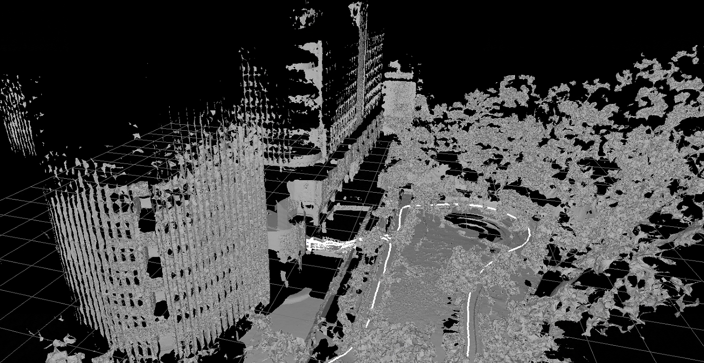
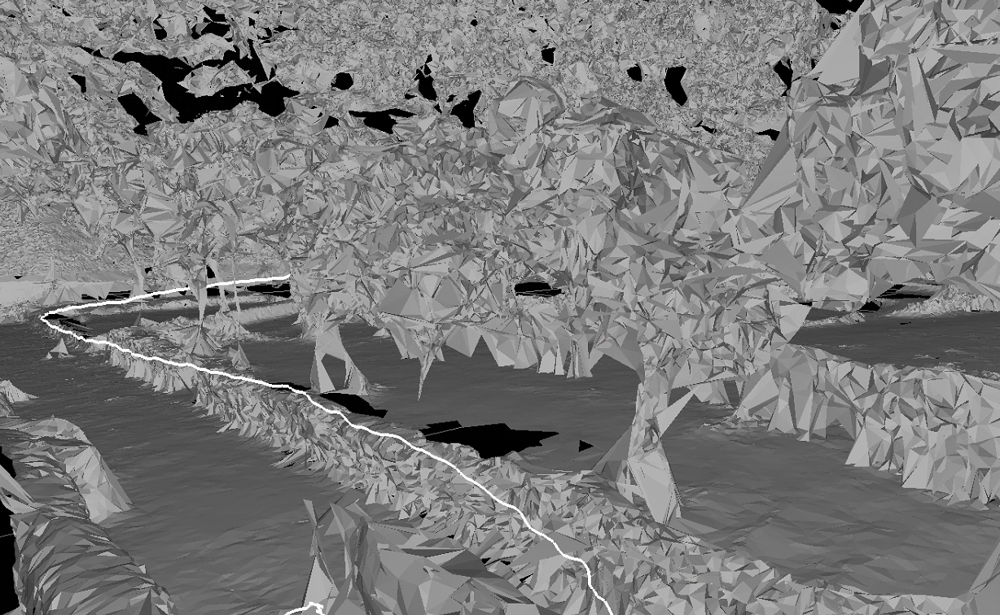
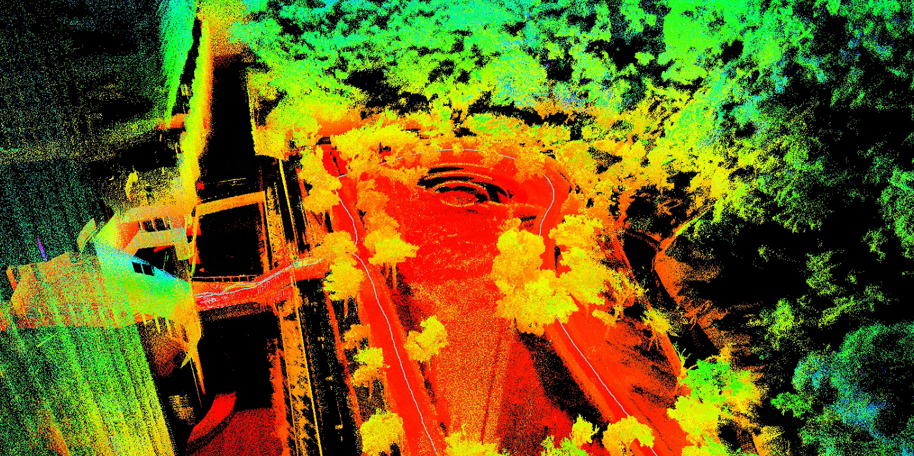

## pointcloud to mesh

尝试使用r3live与immesh进行mesh图的生成。r3live可以离线生成mesh，immesh可以在线/离线生成mesh.

1. 使用hku提供的数据集测试

   immesh重建——对于树木的重建结果较差，对大环境的重建效果比较好
   
    

对应的rviz点云地图

PS: 会不会出现 在mesh中行人 柱子 等等分不出来的情况

r3live的可视化结果与渲染结果非常好

