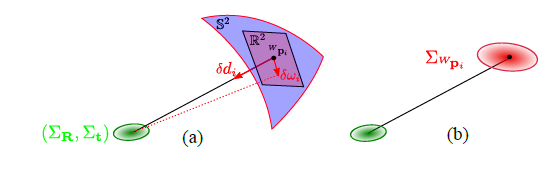
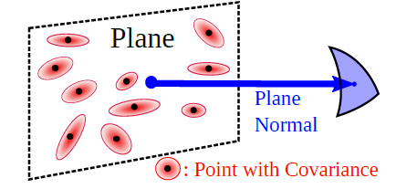
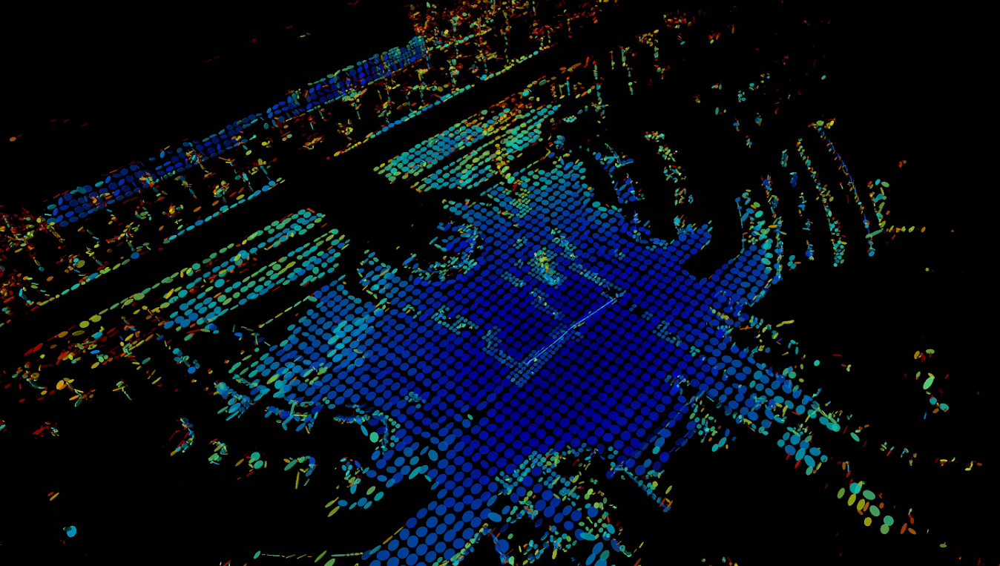
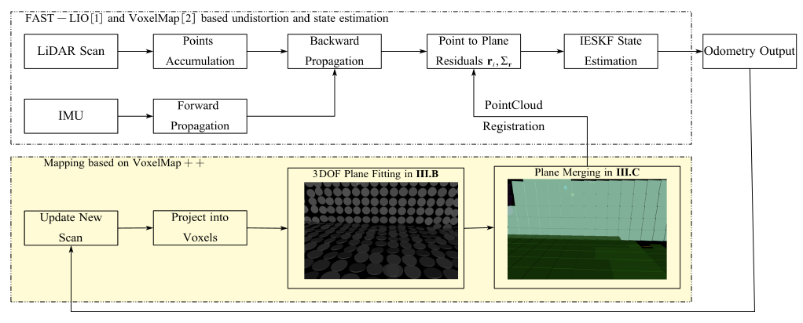
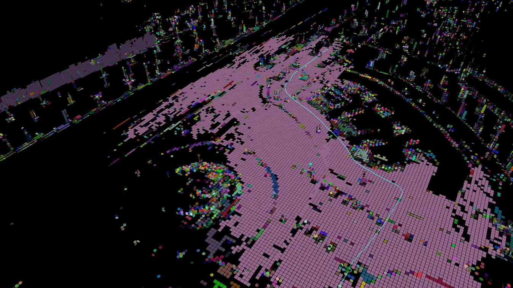
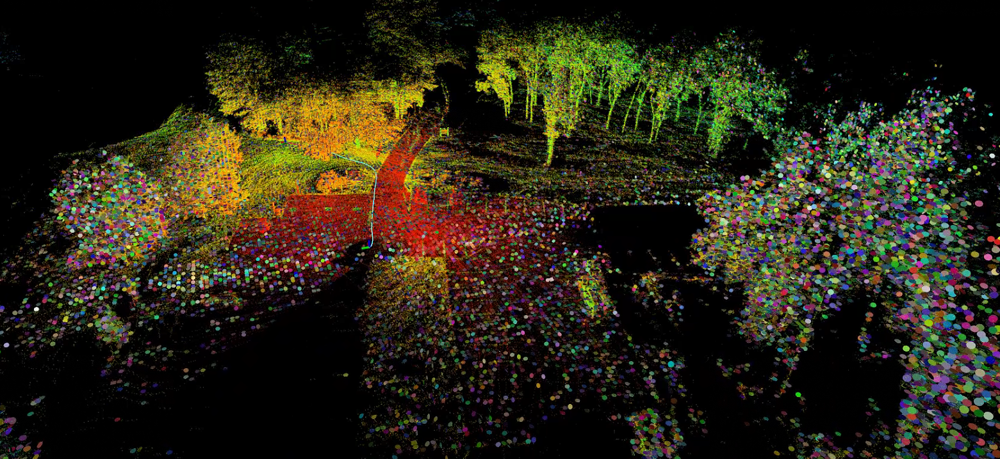

点云地图 - 体素地图 - mesh图重建

- 为下游任务进行 mesh重建

## Mesh construction

3D mesh重建计算复杂度高，转换2Dmesh计算。以体素为单位进行操作，需要选择一个平面进行投影。

## voxelmap (lidar)

- 对Lidar测量模型中的不确定性进行建模，通过不确定性形成平面

  

  落在平面上面的点的不确定性转换成整个平面的不确定性 —— 使用6D表示一个完整平面(中心点位置+法向量)

​	在点云匹配上带来的好处就是 可以快速判断这个点是否落到这个平面上 （先找对应体素再找对应平面）

- 结果展示(velodyne雷达) : 不使用imu充当先验 - 使用匀速模型做先验

  

​	

- 问题：

  总感觉算法占用内存太多，可视化上面效果很差，常用的可视化工具都很难长时间工作

## voxelmap++ (lidar+imu)

- 基于voxelmap的改进，增加Imu做先验，平面描述更紧凑(6D->3D)
- 实际使用上的体验更好，可视化效果很好

大致流程借鉴了fastlio，可以适配到其他里程计

- 结果
  - 虽然里程计的稳定性还不是很好，但是建图的效果不错。

## ImMesh (lidar+imu)

 借助voxelmap中生成的平面信息，将3d点投影到2d平面上，形成三角形之后再反投影到3d空间中 O(n^2)变成O(nlog(n))。

- 定位直接使用之前的工作
- 纯CPU进行实时高频重建(发布频率很快)

- 实验

  

## 目前进展

在lvisam上进行voxelmap的适配，遇到了不少bug，虽然可以建图，但是效果很差，还没有定位问题。

