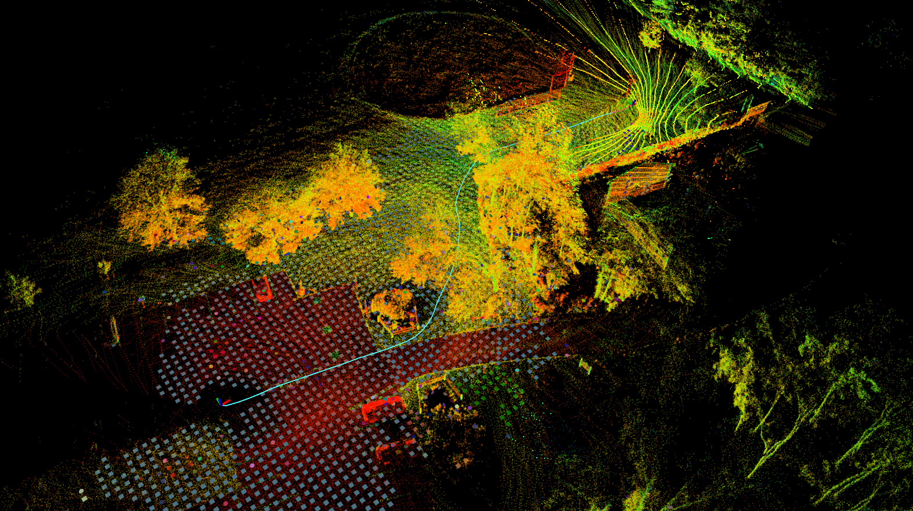
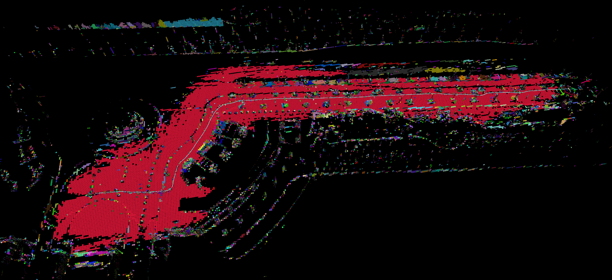

lvisam + voxelmap的适配(换一个其他的里程计也是可以使用的)

- 原版voxelmap设置体素代谢比较大，变小之后处理速度明显下降，这里换成了voxelmap++之后变好了

目前问题

- gstam上面关于协方差的输出很奇怪
- 将voxelmap部分与lvisam写在一起之后，处理速率变慢(这里出现了是否要可视化效果与处理速度的矛盾)

可视化效果

- 树上的平面比较少，平面还可以

- 对于结构清晰的数据集效果还是不错的

