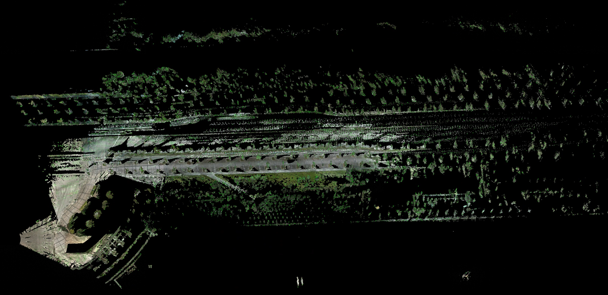

**下一周的todo-lists**

- [x] r3live或者immesh、voxelmap、voxelmap++的可展示文件 | 在voxelmap以及plus版本里面，plane的色彩信息表示什么? 
- [ ] voxelmap与voxelmap++这两个算法在 里程计精度以及运行时间上面的比较 | 以及这两个算法是不是都提到了关于精度的改进工作
- [x] 视觉建图与lidar建图的融合

  - r3live中视觉渲染部分能不能单独取出来(形成一个独立的模块) | 还要读完整个r3live中利用视觉进行渲染的 pipeline

  - **本周最重要的工作是完成实时mesh图的重建工作**
- [ ] 调研一下mesh的重建工作 | 需要其与RGB-D融合

现在的两个方案 (1) 生成mesh之后在贴图做优化 (2) 还是在生成mesh的时候就直接使用color信息融合

- lvisam(直接使用m2DGR-plus数据集运行) —— 现在可以将lvisam与Immesh结合作为下一步工作的baseline (但是需要确定其效果不好的部分是什么原因导致的-是一些参数没有调整好，还是算法本身的问题 - 这部分最重要!! ) | 使用的数据集最好是m2DRG-plus 

1. https://github.com/HViktorTsoi/rs_to_velodyne 关于m2DGR-plus数据集中的lidar处理
2. https://github.com/Livox-SDK/LIO-Livox livox中有一个动态点云剔除的操作(做的还是比较好) | 无论是定位还是建图都是需要使用的部分
3. 骏杰之前提到了一种泊松分布的方法其对应的Mesh的重建结果会好一些 (现在这个方法暂时有一点问题)
4. 小六的学习小组里面会有在m2DGR数据集中使用的lvisam算法 (比之前使用的lvisam_easy_used的效果要好一些) | 这样的好处是能再运行更多的序列测试算法的效果

ImMesh中使用本身的方法与当前存在的mesh重建方法： 

- TSDF-based(PCL中使用的)
- OpenMVS
- Poisson surface reconstruction

ImMesh中的对比实验：mesh重建对比都使用Ground-truth的位姿进行offline reconstruction。

****

##  7.01~7.07

### Immesh+r3live 可视化

### 文献阅读

**DAMS-LIO (ICRA2023)** 退化环境下的激光SLAM 

1. 出现lidar的退化环境之后才会使用其他里程计的Pose信息，其余部分应该都是直接使用正常的lidar里程计 (在多种传感器数据融合以及退化模块检测上存在改进)
2. CRLB 量化里程计性能

直接使用海塞矩阵来检测LIO是否碰上了退化场景

**LVIO-Fusion (RAL 2024)**

Tightly-Coupled LiDAR-Visual-Inertial Odometry and Mapping in Degenerate Environments

- LIO: 完全是voxelmap，甚至生成平面以及点云配准的过程都没有修改...
- VIO: 点云信息投影到image平面进行光流(使用PnP计算出位姿信息)，计算光度误差(相当于2次修正位姿) —— 在r3live中都有类似的操作 | 光度误差上使用的是radiance辐射度，代表是实际上亮度信息(这里还增加了对于每一帧图像亮度的修正)。 
- 借鉴了 LVI-SAM 的方法，使用一个滑动窗口对imu的bias进行修正

整体框架: 

光度误差：

 目前问题

1. 什么情况可以认为是Tightly-coupled 什么是loosely-coupled | r3live这种可以认为是紧耦合的么?

2. 点云没有颜色信息

3. 对比实验并不是SOTA的算法

4. 关于退化场景 都没有退化环境检测、只是在实验里面自己想象了一个退化场景
5. 没有消融实验
6. 为什么lidar里程计在长直道容易出现问题

**Degradation Resilient LiDAR-Radar-Inertial Odometry(ICRA 2024)**

使用的传感器有些不一致，但是这里对于退化场景也没有专门的detection用来检测，使用GTSAM做了因子图的优化。没有开源。

**MM-LINS: a Multi-Map LiDAR-Inertial System for Over-Degenerate Environments(感觉这篇论文还得再看一边，有部分细节还不太清楚)**

IEEE Transactions on Intelligent Vehicles | 开源 | 谢老师组里面的工作，开源数据集使用的m2DGR。

在退化环境中的处理是什么，既然碰到了退化，为什么要在离开退化的时候生成一种新地图，原始地图与新地图的融合过程岂不是没有中间退化场景中的部分

- LIO: 基于fast-lio2进行改进，加入了退化检测以及动态初始化
  - 退化检测 
    - 基于状态的协方差进行判断(特征向量什么的)
  - 动态初始化 
    - 出现退化场景之后对系统进行重新初始化(相比于静态初始化的方法，这里初始化的部分也初始化了速度信息)
    - 是直接用的vins mono的初始化部分，但是忽略掉了vins mono里面的scale initialization部分

不明白为什么要进行动态的初始化（为什么静态初始化出问题之后，使用动态初始化就能解决问题——静态初始化出现问题又不是因为初始化参数有问题而是碰到了退化场景） | new map是在什么才开始启动的

PS：ig-lio: An incremental gicp-based tightly-coupled lidar-inertial odometry

关于退化场景又专门的detectin modular

至少介绍了三篇方法来帮助使用退化场景的detection，本文自己也使用了一种方法来实现退化场景的检测

#### 目前进度

- 图像+lidar数据的同步 
  -  图像的帧率要比lidar快，这里就直接删除了多余的图像数据，一帧点云对应一帧图像。 图像 15HZ | 点云 10HZ | IMU 200HZ

- 连续帧的点云上色已经完成

问题:

- 没有考虑到image与lidar数据之间小的位姿变换

- 使用纯lidar点云进行处理(效果还是可以的)  | 因为immesh里程计(也就是voxelmap)没有对velodyne雷达提供imu的里程计，为了方便直接没有修改直接使用了。

- 图像大小太小了，一帧雷达的点只有1/6左右的点能投影到图像上进行上色

PS: 对比一下voxelmap以及immesh中的plane生成，为什么这里有这么大的区别(原版的voxelmap非常不好用) | 而且进行图像信息生成的时候, 应该先从一帧中读取

### ImMesh

- depth信息是如何获取的

r3live中的渲染线程处理 

thread_render_pts_in_voxel(r.start, r.end, img_ptr, &g_voxel_for_render, obs_time)

里面处理数据 直接将voxel上面的点云投影到图像上面 然后进行上色操作(这里的上色操作就是跟之前的部分是一样的数据)

- 这样的start_service的作用就不明显了, 到底情况是什么还是需要后续处理

