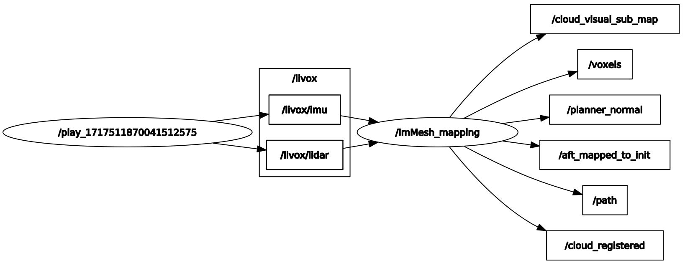
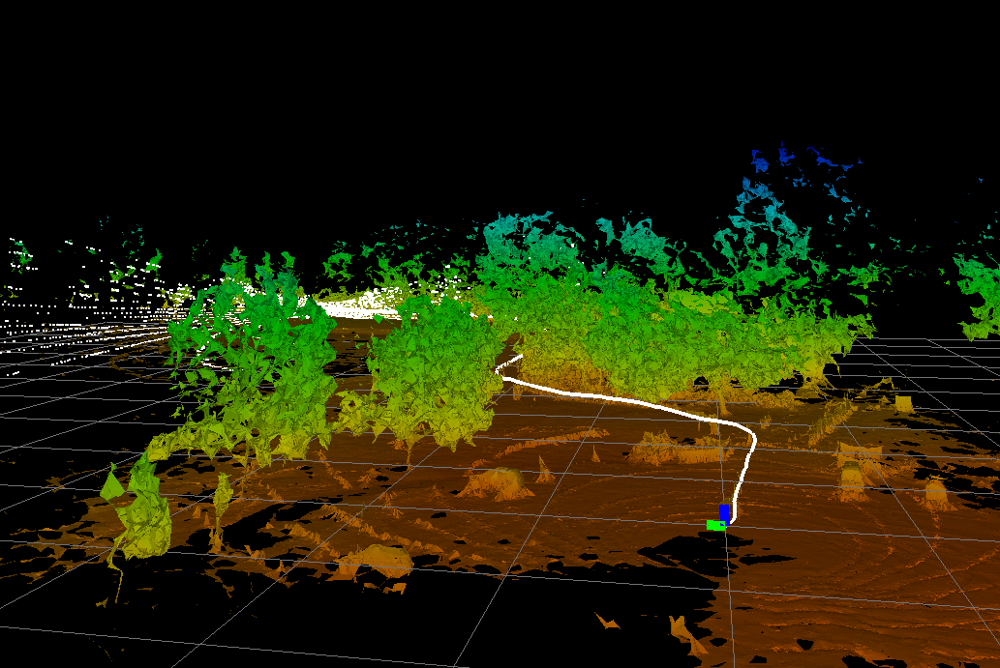
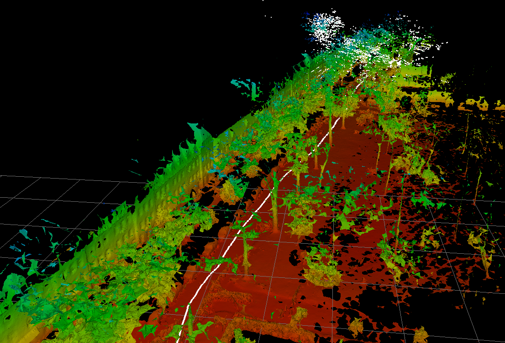
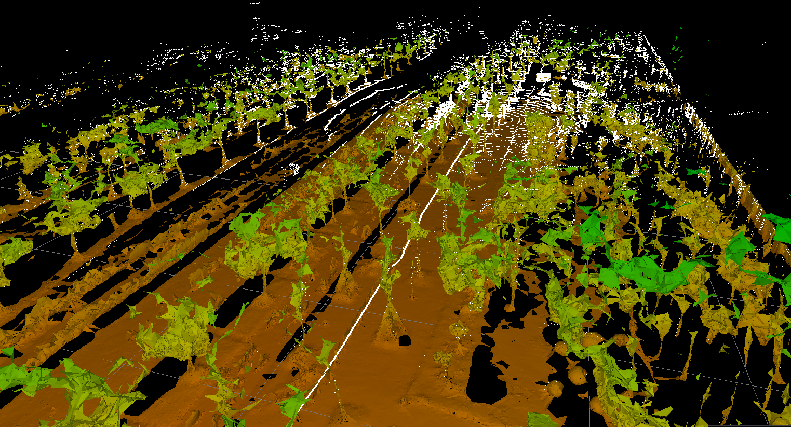
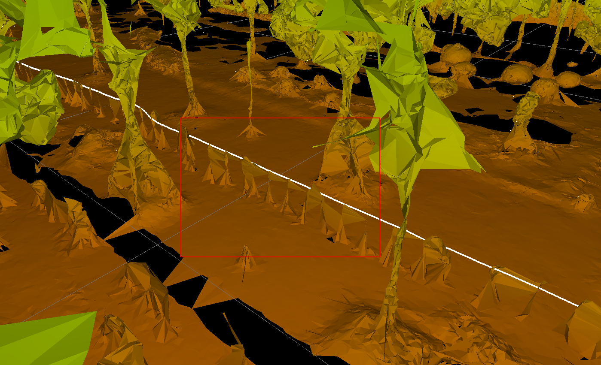

**下一周的todo-lists**

- [x] r3live或者immesh、voxelmap、voxelmap++的可展示文件 | 在voxelmap以及plus版本里面，plane的色彩信息表示什么? 
- [ ] voxelmap与voxelmap++这两个算法在 <font color=blue>里程计精度</font>以及运行时间上面的比较 | 以及这两个算法是不是都提到了关于精度的改进工作
- [ ] 视觉建图与lidar建图的融合

  - r3live中视觉渲染部分能不能单独取出来(形成一个独立的模块) | 还要读完整个r3live中利用视觉进行渲染的 pipeline

  - **本周最重要的工作是完成实时mesh图的重建工作**
- [ ] 调研一下mesh的重建工作 | 需要其与RGB-D融合


现在的两个方案 (1) 生成mesh之后在贴图做优化 (2) 还是在生成mesh的时候就直接使用color信息融合

- lvisam(直接使用m2DGR-plus数据集运行) —— 现在可以将lvisam与Immesh结合作为下一步工作的baseline (但是需要确定其效果不好的部分是什么原因导致的-是一些参数没有调整好，还是算法本身的问题 - 这部分最重要!! ) | 使用的数据集最好是m2DRG-plus !!!


1. https://github.com/HViktorTsoi/rs_to_velodyne 关于m2DGR-plus数据集中的lidar处理
2. https://github.com/Livox-SDK/LIO-Livox livox中有一个动态点云剔除的操作(做的还是比较好) | 无论是定位还是建图都是需要使用的部分
3. 骏杰之前提到了一种泊松分布的方法其对应的Mesh的重建结果会好一些
4. 小六的学习小组里面会有在m2DGR数据集中使用的lvisam算法 (比之前使用的lvisam_easy_used的效果要好一些) | 这样的好处是能再运行更多的序列测试算法的效果


ImMesh中使用本身的方法与当前存在的mesh重建方法： 

- TSDF-based(PCL中使用的)
- OpenMVS
- Poisson surface reconstruction

ImMesh中的对比实验：mesh重建对比都使用Ground-truth的位姿进行offline reconstruction。


PS: clion 中如果想做处理的话，需要将ros的接口换成读取excel文件中的结果,这样debug的效果会好一些 (方便debug)


****


**1/2.  结果展示**

pcd文件读取使用pcl, mesh文件使用meshlab读取

- Immesh中 点云(pcd文件) mesh(ply文件)
- r3live 保存成为pcd文件


**plane色彩信息对应的为不确定性**

**voxelmap:**

- m2DGR walk.bag

蓝色平面为确定性比较高的平面(生成的plane基本都在地面上，其他区域plane数量比较少)


**完整一帧运行时间(ms)**

feats size:39029, down size:7048
[ Time ]: average undistort: 0.00733234 (没有使用imu，直接使用匀速模型)
[ Time ]: average down sample: 1.60856
[ Time ]: average calc cov: 0.48117
[ Time ]: average scan match: 12.4769
[ Time ]: average solve: 4.21935
[ Time ]: average map incremental: 23.0096
[ Time ]:  average total 41.803


**voxelmap++**


**完整一帧的运行时间(ms)**

feats size:38777, down size:6441
pos:197.299 42.9551 4.75867
[ Time ]: average undistort: 2.80849 (使用imu去畸变)
[ Time ]: average down sample: 1.69304
[ Time ]: average calc cov: 0.409475
[ Time ]: average scan match: 5.89106
[ Time ]: average solve: 2.3585
[ Time ]: average map incremental: 6.0728
[ Time ]:  average total 19.2334


**ImMesh**

在ImMesh中的其中一个线程也使用了相同的平面生成过程, 相比于原版，其在匹配位姿以及地图更新上面的耗时增加

(1) 位姿计算 ：6.54092 ms

(2) 总时间(包含发布点云以及增加地图时间) : 9.95822 ms


****


**3. mesh重建**

rqt中node关系: 说明发布的话题只会进行可视化，内部数据的交换都是经过线程来进行处理的，并且没有使用图像信息




ImMesh(原版) hku_park_01.bag

- 发布点云+plane平面


- 最终生成的mesh图形


ImMesh(lvi-sam做里程计) 

- handheld.bag(lvisam自身提供数据集)| 完成一帧的运行速度在0.2ms处理 (i9-13900) 相当于只负责地图的更新



- garden.bag(lvisam自身提供数据集)



m2DGR walk01.bag

- 开始部分


- 结束部分



在录制数据的时候将后面的人录制上去，导致在最后生成的mesh图中也包含了人的信息




**算法改动**

- 增加cloudVoxel.msg文件 将lvisam中计算出来的 xyz+row/pitch/yaw + 原始的点云信息 + timestamp全部打包
- ImMesh中获取数据之后，将数据赋值给voxelmap的类成员变量，以及位姿角度转换成位姿矩阵,  更新点的不确定度 

```cpp
     	// 获取位姿信息(其余部分不会使用协方差数据 所以只需要将对应的位姿信息输入到state中即可)
            Eigen::Affine3f tmp = pcl::getTransformation(temp->x, temp->y, temp->z, temp->roll, temp->pitch, temp->yaw);
            Eigen::Affine3d transCur = tmp.cast<double>();

            state.pos_end = transCur.translation();
            state.rot_end = transCur.rotation();

            if(m_lidar_en)
            {
                m_euler_cur(0,0) = temp->roll;
                m_euler_cur(0,1) = temp->pitch;
                m_euler_cur(0,2) = temp->yaw;
            }
			
			// 降采样
            m_downSizeFilterSurf.setInputCloud( m_feats_undistort );
            m_downSizeFilterSurf.filter( *m_feats_down_body );
            m_feats_down_size = m_feats_down_body->points.size();
            // 新建地图
			if ( m_use_new_map )
            {
                if ( !m_init_map )
                {
                    // 进行voxelmap的建立 —— 这里没有使用将采样的点云数据 使用的是去畸变数据
                    m_init_map = voxel_map_init();
                    if ( m_is_pub_plane_map )
                        pubPlaneMap( m_feat_map, voxel_pub, state.pos_end );
                    frame_num++;
                    LOG(INFO)<<"Build the voxelMap";
                    continue;
                }
            }
			// 地图增长
           if ( m_lidar_en )
               map_incremental();
			// 发布信息
            if ( m_is_pub_plane_map )
                pubPlaneMap( m_feat_map, voxel_pub, state.pos_end );
            t2 = omp_get_wtime();

            frame_num++;
            LOG(INFO) << "[service_lvisam_odometry]: " << (t2-t0)/frame_num;
            cloud_Buffer.pop_front();
        }

        rate.sleep();
    }
```


**数据结构**

1. Voxel_mapping 与平面相关的类，管理一个八叉树地图 | 八叉树的第一层代表一个初始voxel_size，子结点对应着更加精细的空间，一个空间生成一个平面 | mesh重建中使用的数据与这里保存的数据没有关系(所以mesh重建可以相当于一个独立部分)

2. RGB_Voxel 管理空间中一个体素中的数据

    - voxel中的所有点云 ( 点位置直接对应grid的id )

    - 二维平面(应该是用于mesh生成的部分)

    - 以及三个向量来代表三个轴信息(short/mid/long)

3. Global_map  管理所有的点云+RGB_Voxel+KD_tree

    - 所有RGB_ptr(即所有的点云数据)

    - 所有的RGB_Voxel索引

    - Kd_tree 用于快速搜索最近点云数据

    - Hash表 方便快速查找 点与voxel

4. Triangle_manager 管理与三角平面相关的部分
    - ImMesh中模仿了git中的commit/push/pull的过程，其中的push以及pull过程都是针对Triangle_manager而言。获取当前已经存在的triangle信息，补充新增的triangle信息，删除不再需要的triangle信息。


**service_LiDAR_update 线程**

地图的表示方式为: std::unordered_map< VOXEL_LOC, OctoTree * > 对于输入的点云信息按照自定义的hash函数映射到实际体素位置，使用OctoTree来管理这一块区域中的所有数据(点云+平面+更精细的区域信息)

- voxel_map_init() 地图的建立
    - 新建OctoTree| 生成平面 | 不能生成的点放到子结点中继续判断能不能生成平面

- map_incremental_grow() 对应地图更新
    - 开始mesh的线程
    - updateVoxelMap() 为地图更新最重要的部分 | 设置条件来继续生成平面
    - 将点云+位姿打包 输入到g_rec_mesh_data_package_list


**service_reconstruct_mesh**

调用线程池不断处理数据 

- 在service_reconstruct_mesh这个子线程上启动线程池, 线程池中提交incremental_mesh_reconstruction()任务即调用线程池中的一个空闲线程来处理

注意: 这里的global map不是上面说的OctoTree


**incremental_mesh_reconstruction** 

点云数据融入到Global map + 判断哪一个体素部分的triangle mesh需要被更新。

- 计算新增点其对应的grid以及voxel | grid为更加精细的空间划分(系统中所有点云的位置信息都用其对应的grid表示)

    - 查找grid有没有存在
    - 查找voxel是否存在(无论这个voxel是新建/原来就有)，这个voxel都会被认为是voxels_recent_visited(最近被新增点的体素——新增了点那么意味着对应的voxel也是需要被更新的)

    - 点云信息 补充到 RGB_ptr | RGB_voxel_ptr | Kd_tree | Hash(grid)等等一堆保存点云的部分

- 调用tbb并行计算

    因为incremental_mesh_reconstruction函数本身就是在线程池中commit的任务，相当与是在线程池中的一个子线程里面又调用tbb开辟新的线程进行并行计算(加速这个线程的处理数据，防止这个线程占用数据的时间过长) 

    - tbb并行处理: 自动将需要处理的voxel分配线程进行处理 (只处理一个voxel)

        - 获取该voxel中的所有点 + 周围一定距离中的点(借助Global map中的KDtree)

        - 投影计算 | 根据点云分布 - 按照点云的协方差矩阵对应的特征向量划分三个轴(long/short/mid)

        - 计算三角形, 记录其对应的顶点

        - 在 Triangle_manager 中获取当前点云对应的所有三角，与上一步中计算出来的三角形进行对比，确定需要增加/删除的三角以及

        - 其对应的顶点
        
            


**service_refresh_and_synchronize_triangle**

ImMesh中使用openGL设计的GUI界面的可视化部分有关

- 主要是调用 synchronize_triangle_list_for_disp() 函数进行处理


- 几何结构的表示主要使用CGAL库进行可视化


(1) rosbag 中的多帧数据转 pcd (ok)

(2) 尝试读取一个小的体素部分进行mesh重建 

(3) 在这块小的部分实现RGBD+camera融合


ImMesh :  mesh中的所有参数设置在程序中中对应的部分是什么


PS：

- 因为在线程池中提交的是相同的任务(都是对voxelmap中的线程进行处理)，说明线程池中的子线程需要访问相同的数据容器(vetor或者deque)进行处理(包括取数据以及储存的数据)，这里就需要上锁以及解锁。其次，在子线程中使用tbb可以加速数据处理，好处就是减小这个子线程上锁的时间，可以避免子线程运行时间过长，导致其他子线程都没有办法进行数据的读取以及运算结果的储存。并且在tbb调用过程中，因为也是多个线程处理数据，也需要存储结果，所以这里的处理过程也需要上锁解锁.

- grid是比voxel中更精细的空间表示方式 - 设置为0.05m | 一个网格中只会有一个点(属于是变相滤波)


PS: 对比一下voxelmap以及immesh中的plane生成，为什么这里有这么大的区别(原版的voxelmap非常不好用) | 而且进行图像信息生成的时候, 应该先从一帧中读取


****


## mesh + RGBD

### kimera

与mesh相关的部分有三个

- Per-frame mesh
- Multi-frame mesh
- global mesh


### OpenMVS

openMVS的具体实现 | 主要使用四个部分来进行工作

- **dense point-cloud reconstruction** 先从输入的图像中获取稠密点云

- **mesh重建** 这里负责实现mesh结构

- **mesh refinement**

- **mesh texturing** 纹理信息(这里对应的就是在mesh中融合图片信息的过程)

输入信息为 多帧图像 + 位姿 (所以这里一般会跟一些SFM的方法联合使用，从这些方法中来生初始的稀疏点云)


### ImMesh

- depth信息是如何获取的


