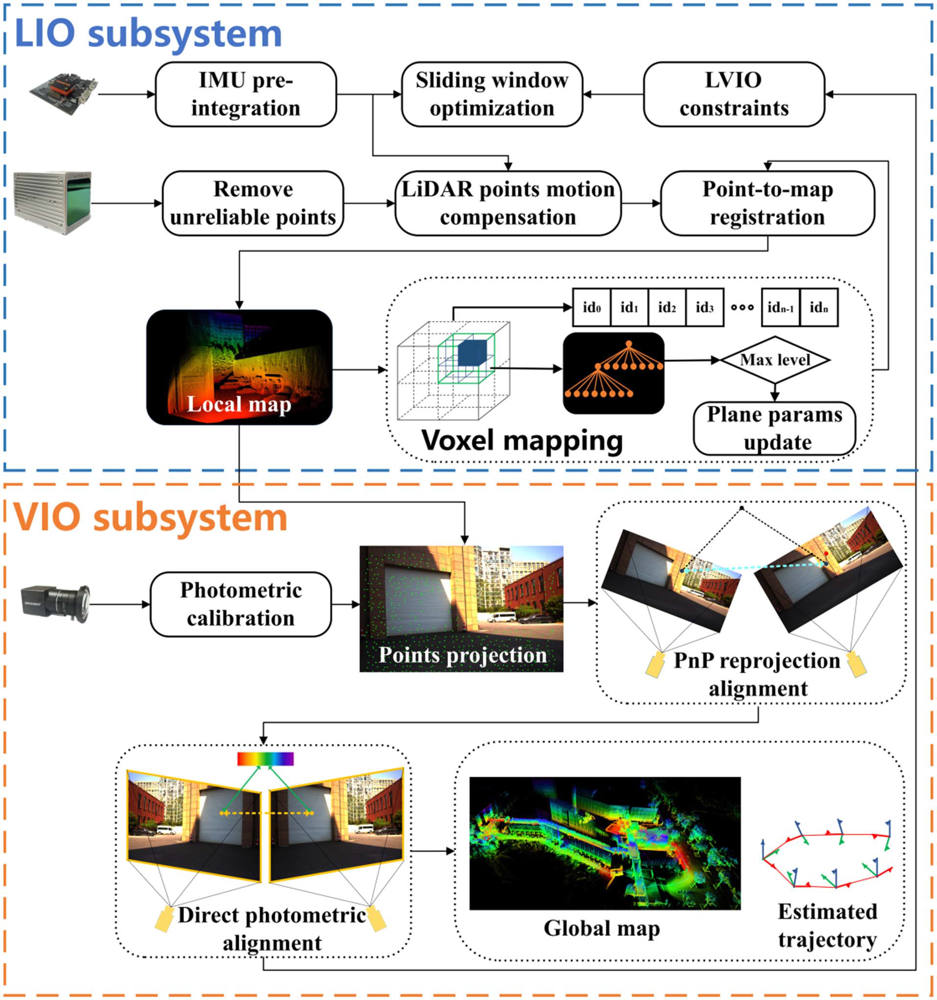

**下一周的todo-lists**

- [x] r3live或者immesh、voxelmap、voxelmap++的可展示文件 | 在voxelmap以及plus版本里面，plane的色彩信息表示什么? 
- [ ] voxelmap与voxelmap++这两个算法在 里程计精度以及运行时间上面的比较 | 以及这两个算法是不是都提到了关于精度的改进工作
- [x] 视觉建图与lidar建图的融合

  - r3live中视觉渲染部分能不能单独取出来(形成一个独立的模块) | 还要读完整个r3live中利用视觉进行渲染的 pipeline

  - **本周最重要的工作是完成实时mesh图的重建工作**
- [ ] 调研一下mesh的重建工作 | 需要其与RGB-D融合

现在的两个方案 (1) 生成mesh之后在贴图做优化 (2) 还是在生成mesh的时候就直接使用color信息融合

- lvisam(直接使用m2DGR-plus数据集运行) —— 现在可以将lvisam与Immesh结合作为下一步工作的baseline (但是需要确定其效果不好的部分是什么原因导致的-是一些参数没有调整好，还是算法本身的问题 - 这部分最重要!! ) | 使用的数据集最好是m2DRG-plus 

1. https://github.com/HViktorTsoi/rs_to_velodyne 关于m2DGR-plus数据集中的lidar处理
2. https://github.com/Livox-SDK/LIO-Livox livox中有一个动态点云剔除的操作(做的还是比较好) | 无论是定位还是建图都是需要使用的部分
3. 骏杰之前提到了一种泊松分布的方法其对应的Mesh的重建结果会好一些 (现在这个方法暂时有一点问题)
4. 小六的学习小组里面会有在m2DGR数据集中使用的lvisam算法 (比之前使用的lvisam_easy_used的效果要好一些) | 这样的好处是能再运行更多的序列测试算法的效果

ImMesh中使用本身的方法与当前存在的mesh重建方法： 

- TSDF-based(PCL中使用的)
- OpenMVS
- Poisson surface reconstruction

ImMesh中的对比实验：mesh重建对比都使用Ground-truth的位姿进行offline reconstruction。

****

##  7.01~7.07

### Immesh+r3live 可视化

### 文献阅读

**DAMS-LIO (ICRA2023)** 退化环境下的激光SLAM 

1. 出现lidar的退化环境之后才会使用其他里程计的Pose信息，其余部分应该都是直接使用正常的lidar里程计 (在多种传感器数据融合以及退化模块检测上存在改进)
2. CRLB 量化里程计性能

直接使用海塞矩阵来检测LIO是否碰上了退化场景

**LVIO-Fusion (RAL 2024)**

Tightly-Coupled LiDAR-Visual-Inertial Odometry and Mapping in Degenerate Environments

- LIO: 完全是voxelmap，甚至生成平面以及点云配准的过程都没有修改...
- VIO: 点云信息投影到image平面进行光流(使用PnP计算出位姿信息)，计算光度误差(相当于2次修正位姿) —— 在r3live中都有类似的操作 | 光度误差上使用的是radiance辐射度，代表是实际上亮度信息(这里还增加了对于每一帧图像亮度的修正)。 
- 借鉴了 LVI-SAM 的方法，使用一个滑动窗口对imu的bias进行修正

整体框架: 

光度误差：

 目前问题

1. 什么情况可以认为是Tightly-coupled 什么是loosely-coupled | r3live这种可以认为是紧耦合的么?

2. 点云没有颜色信息

3. 对比实验并不是SOTA的算法

4. 关于退化场景 都没有退化环境检测、只是在实验里面自己想象了一个退化场景
5. 没有消融实验
6. 为什么lidar里程计在长直道容易出现问题

**Degradation Resilient LiDAR-Radar-Inertial Odometry(ICRA 2024)**

使用的传感器有些不一致，但是这里对于退化场景也没有专门的detection用来检测，使用GTSAM做了因子图的优化。没有开源。很迷惑的操作，感觉就是直接使用了GTSAM把lidar + imu + radar的因子项全部融合进去，最终输出的结果就是一个优化之后的对象。

**MM-LINS: a Multi-Map LiDAR-Inertial System for Over-Degenerate Environments**

IEEE Transactions on Intelligent Vehicles | 开源 | 谢老师组里面的工作，开源数据集使用的m2DGR(还有一些其他的数据集)。关于lidar点云退化场景，这里是直接设计出一种塑料袋包裹lidar的场景来进行模拟退化场景。右侧图中给出的轨迹应该是目前lidar数据中有一段数据缺失之后，目前开源的程序会出现的问题。

遇到退化场景之前生成的地图在检测到lidar退化之后转换sleep map, 然后不断地进行动态初始化在出退化场景之后生成重新建图，即active map。使用Scan Context描述子去判断sleep与active map之间地相似性，认为两者之间存在重复场景就进行场景地拼接

- 在保留之前地图与生成新地图之间是退化场景，这部分的轨迹仍然可以被成功地绘制出来

感觉没有特别为了两个map之间缺失部分的轨迹

- LIO: 基于fast-lio2进行改进，加入了退化检测以及动态初始化
  - 退化检测 
    - 基于状态的协方差进行判断(特征向量什么的)
  - 动态初始化 
    - 出现退化场景之后对系统进行重新初始化(相比于静态初始化的方法，这里初始化的部分也初始化了速度信息)，方便脱离退化场景之后直接生成新地图(新的active map)
    - 是直接用的vins mono的初始化部分，但是忽略掉了vins mono里面的scale initialization部分

#### 目前进度

- 图像+lidar数据的同步 
  -  图像的帧率要比lidar快，这里就直接删除了多余的图像数据，一帧点云对应一帧图像。 图像 15HZ | 点云 10HZ | IMU 200HZ

- 连续帧的点云上色已经完成

问题:

- 没有考虑到image与lidar数据之间小的位姿变换

- 使用纯lidar点云进行处理(效果还是可以的)  | 因为immesh里程计(也就是voxelmap)没有对velodyne雷达提供imu的里程计，为了方便直接没有修改直接使用了。

- 尝试使用室内数据集，纯lidar的稳定性效果很差，直接出现了漂移(因为velodyne的雷达只设置了这一种纯lidar的里程计信息，所以这里需要改变里程计进行处理——在github上有直接使用lidar+imu的voxelmap版本，voxelmap++以及pv-lio都提供了velodyne雷达+imu的里程计设置)

- 图像fov大小太小了，一帧雷达的点只有1/6左右的点能投影到图像上进行上色

关于r3live中的pub线程(即对于全局变量的访问没有使用mutex部分进行发布) —— 或许可以更改成为使用tbb pareral_for_的哪种形式，对整套部分直接并行化的发布（因为这里的逻辑是每次发布都要访问所有的point来进行发布，感觉这样处理方式如果加锁的化，会耽误其他线程的处理）

需要全局点云数据的线程

- mesh 线程
- rendering 线程
- Pub线程

如果里程计部分直接将点云数据送入到全局点云数据中，而不是现在的将数据进行打包发送，那么将会出现第四个线程需要全局线程。这样感觉会导致部分线程耽误了其他线程的运行。

**一些剩余问题....**

PS: 对比一下voxelmap以及immesh中的plane生成，为什么这里有这么大的区别(原版的voxelmap非常不好用) | 而且进行图像信息生成的时候, 应该先从一帧中读取

点云的配准形式使用的数据结构

- voxelmap: 用的是voxel中估计plane那一套来进行位姿计算

- ikd-tree: Fastlio实现路线

PS：ig-lio: An incremental gicp-based tightly-coupled lidar-inertial odometry

关于退化场景又专门的detectin modular

至少介绍了三篇方法来帮助使用退化场景的detection，本文自己也使用了一种方法来实现退化场景的检测

对于lidar的退化场景是不是存在groundtruth来判断corner detection检测的是否正确

### ImMesh

- depth信息是如何获取的

r3live中的渲染线程处理 

thread_render_pts_in_voxel(r.start, r.end, img_ptr, &g_voxel_for_render, obs_time)

里面处理数据 直接将voxel上面的点云投影到图像上面 然后进行上色操作(这里的上色操作就是跟之前的部分是一样的数据)

- 这样的start_service的作用就不明显了, 到底情况是什么还是需要后续处理

1. 继续看mm-lins | sleep map 与 active map是如何拼接到一起的 (即轨迹部分的对齐)

2. r3live中的offline mesh重建 | openGL来实现mesh的重建 | 这里可以在m2DGR的hall 05数据集上进行测试(这个数据集) **这也是本周最重要的工作，先实现出一种由色彩信息的mesh图出来 | 对于openGL部分需要确定其需要输入什么数据来进行mesh的重建**

3. 采集数据的contribution —— 需要确定odom的数据类型是不是 nav_msgs odometry

- 因为VIO在帮助定位上面是有一些鸡肋的，所以这里会给VIO加入odom传感器进行一些处理。但是在实际进行测试的时候，可以使用多种开源数据集进行测试，比如m2DGR/m2DGR-plus数据集进行without/without odom的数据集。

- 主动测试退化场景的方法 | mm-lins上面对于退化场景的表示还是比较局限的，因为其只是使用了一个lidar被包裹的情况来说明退化场景出现了。而正常的退化场景应该是在长直道这些场景下出现lidar里程计的退化。
- 目前想使用的groundfusion+voxelmap或者lio做为子系统来相互调用，来解决corner case下的作用 —— corner case的部分可以作为第四个创新点来实现

没想到8月份就要开始写论文，实在是太早了，2~3天更新一版的话，这种文字什么的肯定会表示的更好

