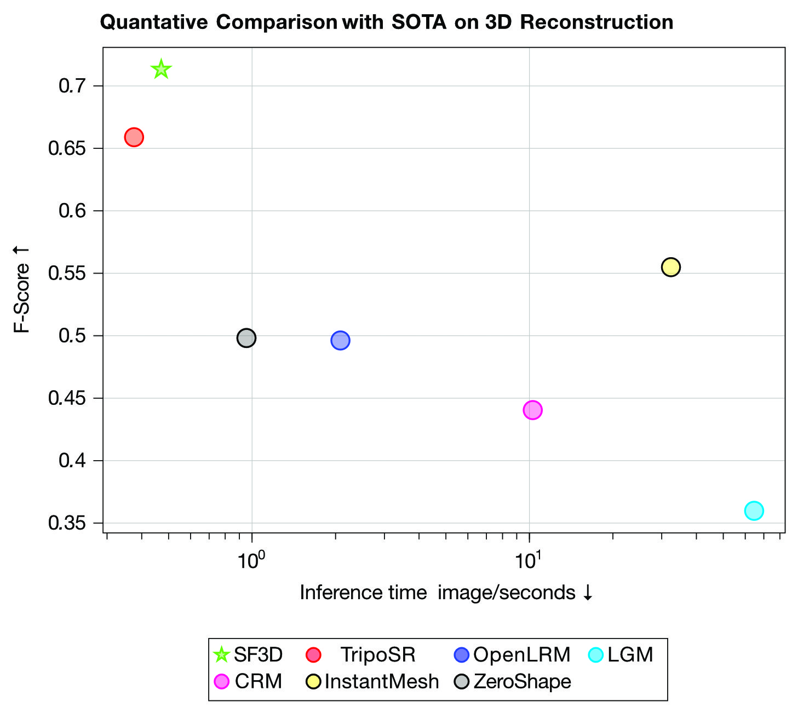

**下一周的todo-lists**

- [x] r3live或者immesh、voxelmap、voxelmap++的可展示文件 | 在voxelmap以及plus版本里面，plane的色彩信息表示什么? 
- [ ] voxelmap与voxelmap++这两个算法在 里程计精度以及运行时间上面的比较 | 以及这两个算法是不是都提到了关于精度的改进工作
- [x] 视觉建图与lidar建图的融合

  - r3live中视觉渲染部分能不能单独取出来(形成一个独立的模块) | 还要读完整个r3live中利用视觉进行渲染的 pipeline

  - **本周最重要的工作是完成实时mesh图的重建工作**
- [ ] 调研一下mesh的重建工作 | 需要其与RGB-D融合

现在的两个方案 (1) 生成mesh之后在贴图做优化 (2) 还是在生成mesh的时候就直接使用color信息融合

- lvisam(直接使用m2DGR-plus数据集运行) —— 现在可以将lvisam与Immesh结合作为下一步工作的baseline (但是需要确定其效果不好的部分是什么原因导致的-是一些参数没有调整好，还是算法本身的问题 - 这部分最重要!! ) | 使用的数据集最好是m2DRG-plus 

1. https://github.com/HViktorTsoi/rs_to_velodyne 关于m2DGR-plus数据集中的lidar处理
2. https://github.com/Livox-SDK/LIO-Livox livox中有一个动态点云剔除的操作(做的还是比较好) | 无论是定位还是建图都是需要使用的部分
3. 骏杰之前提到了一种泊松分布的方法其对应的Mesh的重建结果会好一些 (现在这个方法暂时有一点问题)
4. 小六的学习小组里面会有在m2DGR数据集中使用的lvisam算法 (比之前使用的lvisam_easy_used的效果要好一些) | 这样的好处是能再运行更多的序列测试算法的效果

ImMesh中使用本身的方法与当前存在的mesh重建方法： 

- TSDF-based(PCL中使用的)
- OpenMVS
- Poisson surface reconstruction

ImMesh中的对比实验：mesh重建对比都使用Ground-truth的位姿进行offline reconstruction。

r3live中需要全局点云数据的线程

- mesh 线程
- rendering 线程
- Pub线程

如果里程计部分直接将点云数据送入到全局点云数据中，而不是现在的将数据进行打包发送，那么将会出现第四个线程需要全局线程。这样感觉会导致部分线程耽误了其他线程的运行。

7.14 

下一周需要的work

- 群里面对应的论文
- 尝试给车上面装各种传感器
- 测试各个模块运行时间 - 判断一下这些模块运行的时间情况

注意在C++调试过程中，如果cmakelists.txt 中使用 release 以及在set选项的时候使用 O0 优化设置 —— 在这种情况下 会让整个程序在debug的时候程序实际停留的位置与断点的位置不一致。

https://xueshi.io/2022/12/03/shared-ptr-data-race-with-multithread/

7.22 修改mesh可视化结果

- [x] 对目前的运行时间进行log读取 - 增加log文件的输出来应对更多情况
- [ ] m2DGR hall-05 数据 | 在室内环境中调试 color-mesh | openGL color-mesh保存

    - imu 部分需要增加适配性 | 需要增加voxelmap中velodyne lidar的适配性

    - 是不是扫描到的点云过于复杂了 —— 导致最后的的mesh很杂乱, 效果都不是很好
    - 调试immesh中的参数, 使mesh生成的效果更好一些
- [ ] 学习初始化部分的代码 —— 这样后续也可以使用在 multi-SLAM 中使用
- [x] C++ 调试部分 | 按理这部分应该不是很重要 ( 调节可视化不需要这一步的操作, 使用离线的单线程运行就可以 ) | 周四还在看这个部分, 因为不管是单线程还是多线程都会碰到shared_ptr的问题, 具体原因是hash表get_data之后获得的数据存在一点问题 | 周四晚上好像找到了对应的部分
    - hash表的使用 —— 数据在hash中保存会不会改变shared_ptr的use_count
    - shared_ptr的数据的use_count以及weak_count的作用是什么
    - weak_ptr做hash表中储存的数据与shared_ptr做hash表数据有什么区别
- [ ] 关于switch-slam中的切换方案进行整理 —— 毕竟还是需要进行corner detection

PS:

- 内存分析工具有点小问题 | GUI关闭之后程序也死了是什么鬼, 导致我离线分析一直有问题
- 互斥锁本身就是线程安全的，多线程访问互斥锁也没有关系

- m2DGR hall 05 数据集中只会使用lidar传感器，没有使用imu —— 所以导致出现里程计漂移的问题 | 之前能运行的m2DGR walk出现问题应该是里程计部分计算的频率下降导致的漂移问题 (从处理速度上获取信息)

- https://blog.csdn.net/p942005405/article/details/103766900 感觉这部分对应的就是mesh重建中使用image渲染的tutorial

- [x] 现在使用单线程状态来进行可视化部分调试 —— 具体实现起来比较难受, 因为实在不知道r3live那几个数据集为什么都崩溃了, 但是其对应的m2DGR稳定了(这种情况很多次了，有时候非常正常，但是有时候就直接崩了) | TM的，用roslaunch貌似没有问题,直接在clion里面打开就报错。什么恶心人的bug.... | 尝试的解决方案:

    - 重新换乘openCV里面阅读yaml文件的方法 (就直接跳过ros的参数服务器读参数) —— 完成

    - 测试clion里面运行与roslaunch运行数据的帧率 (增加log) —— 直接glog读取就可以

    - 调试可视化部分

- [ ] 查询immesh设置的界面上的 openGL 参数是什么

     

**神奇bug**

- m2DGR —— 如果只使用lidar做里程计的话，odom直接崩了。但是对于r3live 基本mesh重建可以实现实时(基本只差一s)

关于将mesh中的里程计更换成为r3live(正好可以将其他数据集做m2DGR的适配)

- mesh中的include对应的是r3live中的loam
- 在r3live上面做mesh比较简单 | 大致的代码部分已经移植过来编译完成了, r3live的部分经过测试是不会受到影响的，但是mesh以及gui部分还需要进一步的设置
    - 先做gui的移植
    - mesh移植
    - 然后再rendering之后的部分即可以进行mesh重建 | 或者新建一个线程做mesh的重建任务(service_mesh_reconstruction也开始可以的 —— 估计其要等待appending_points这个线程结束, 正好r3live里面有一个wait_thread的操作，这样就能串起来了，一个线程池就能完成多种操作)

学习到了一种采集数据集真实值的操作  | 使用全站仪做slam的定位, 但是其只能实现位置的计算，不能实现位姿(这种成本会比使用高精度的GNSS+IMU的操作更节省一点)

**r3live+mesh重建**

1. r3live中的全局地图构造函数中选择start_service来确定是不是 选择开启投影点以及img对应的函数

2. 在里程计(service_lio_update)的最后部分 将当前帧的点云输送到全局地图中去 | 在VIO线程中实现render

1. 在显示的时候，imGUI出现视角的跳变，原因一定是计算窗口位姿的部分出现了问题

2. 目前在运动的时候，出现了部分镜像出现导致整个点云处理的时候出现了不正常的显示(可能需要去滤除一部分点来处理)  —— 按照强度进行滤波的时候没考虑对齐的处理，导致出现的问题没有成功修改

（1） 右侧出现重影(因为中心的位置上是一个玻璃平面) （2）中心移动的位置上出现震荡的状态，我感觉是因为里程计不够准确导致的问题 —— 之前使用lvisam的时候也没有出现过这种情况(不知道是哪里出现了问题)

LIO发布的部分Topic如下：

- /cloud_registered：发布经过imu去畸变后的当前feats_undistort或降采样后的点云，已转换到全局坐标系
- /aft_mapped_to_init ：发布对应激光雷达频率的里程计，注意是imu位姿
- /path：发布imu轨迹
- cloud_effected：发布最后一次ESIKF更新时的当前帧有效特征点（即能匹配到地图中的有效平面，且残差小于阈值）
- /Laser_map：发布ikdtree中保存的激光点云

**其余程序**

- SF3D: Stable Fast 3D Mesh Reconstruction with UV-unwrapping and Illumination Disentanglement (看起来还不错)

    

- MeshLRM: Large Reconstruction Model for High-Quality Meshes

- Point2Mesh
- Fast Point Cloud to Mesh Reconstruction for Deformable Object Tracking
- PointDreamer: Zero-shot 3D Textured Mesh Reconstruction from Colored Point Cloud by 2D Inpainting
- Voxel Structure-Based Mesh Reconstruction From a 3D Point Cloud

周二: 

1. Lidar的nerf论文 —— 除了nerf使用的其余部分应该明白
2. groundfusion的部分需要跟岩哥确认一下

3. r3live自己的里程计 - 尝试对i值进行处理

voxelmap的pose应该与r3live生成的pose对比，这样的话可以比较清楚地观察哪些地方出现问题。voxelmap自己本身就会比r3live稳定，在hku_park_01.bag这个数据集上面本身表现应该就是比r3live要好，虽然也有一些震荡，但是不明显(所以voxelmap我个人感觉可以直接使用在本项目的里程计中)。

**一些剩余问题....**

PS: 对比一下voxelmap以及immesh中的plane生成，为什么这里有这么大的区别(原版的voxelmap非常不好用) | 而且进行图像信息生成的时候, 应该先从一帧中读取

点云的配准形式使用的数据结构

- voxelmap: 用的是voxel中估计plane那一套来进行位姿计算

- ikd-tree: Fastlio实现路线

PS：ig-lio: An incremental gicp-based tightly-coupled lidar-inertial odometry

关于退化场景又专门的detectin modular

至少介绍了三篇方法来帮助使用退化场景的detection，本文自己也使用了一种方法来实现退化场景的检测

对于lidar的退化场景是不是存在groundtruth来判断corner detection检测的是否正确

- 因为VIO在帮助定位上面是有一些鸡肋的，所以这里会给VIO加入odom传感器进行一些处理。但是在实际进行测试的时候，可以使用多种开源数据集进行测试，比如m2DGR/m2DGR-plus数据集进行without/without odom的数据集。

- 主动测试退化场景的方法 | mm-lins上面对于退化场景的表示还是比较局限的，因为其只是使用了一个lidar被包裹的情况来说明退化场景出现了。而正常的退化场景应该是在长直道这些场景下出现lidar里程计的退化。
- 目前想使用的groundfusion+voxelmap或者lio做为子系统来相互调用，来解决corner case下的作用 —— corner case的部分可以作为第四个创新点来实现

没想到8月份就要开始写论文，实在是太早了，2~3天更新一版的话，这种文字什么的肯定会表示的更好

## 自采数据集

包含 RGB depth infra imu wheel odom 以及lidar GPS

### 测试 viw-fusion  | vinsfusion| groundfusion

1. vinsfuison 
   - RGB imu
   - RGBD imu
2. viw-fusion
   - RGB imu
   - RGB wheel

3. groundfusion 明显感受到从RGB imu开始，无论是加入wheel还是加入depth都能有效提升算法的定位精度，但是整个算法在z轴上一直存在偏差

   - RGB imu

     

   - RGBD imu

     轨迹上失效，在一些转弯处出现问题

     

     甚至出现这个地方卡死

     

   - RGB imu wheel

     在高度上差很多，但是轨迹的大致形状是保持了

     

   - RGBD imu wheel

     在高度上也是存在着一些差值，但并不大

     

     z轴上的差距明显变小

PS: 有些包的效果不好的原因我也知道了，有些包是需要静态初始化，但是有些包是需要动态初始化的，所以这些不同的初始化部分会导致定位误差不一样

