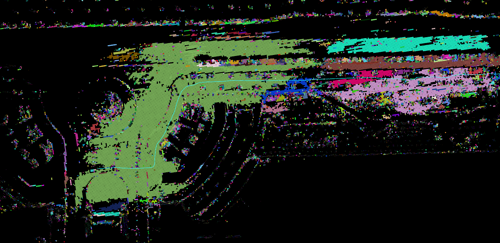

**下一周的todo-lists**

- [x] r3live或者immesh、voxelmap、voxelmap++的可展示文件 | 在voxelmap以及plus版本里面，plane的色彩信息表示什么? 
- [ ] voxelmap与voxelmap++这两个算法在 里程计精度以及运行时间上面的比较 | 以及这两个算法是不是都提到了关于精度的改进工作
- [ ] 视觉建图与lidar建图的融合

  - r3live中视觉渲染部分能不能单独取出来(形成一个独立的模块) | 还要读完整个r3live中利用视觉进行渲染的 pipeline

  - **本周最重要的工作是完成实时mesh图的重建工作**
- [ ] 调研一下mesh的重建工作 | 尽量不要走网络 | 但是需要其与RGB-D融合

**1/2.  结果展示**

pcd文件读取使用pcl, mesh文件使用meshlab读取

- Immesh中 点云(pcd文件) mesh(ply文件)
- r3live 保存成为pcd文件

**plane色彩信息对应的为不确定性**

**voxelmap:**

- m2DGR walk.bag

蓝色平面为确定性比较高的平面(生成的plane基本都在地面上，其他区域plane数量比较少)

**完整一帧运行时间(ms)**

feats size:39029, down size:7048
[ Time ]: average undistort: 0.00733234
[ Time ]: average down sample: 1.60856
[ Time ]: average calc cov: 0.48117
[ Time ]: average scan match: 12.4769
[ Time ]: average solve: 4.21935
[ Time ]: average map incremental: 23.0096
[ Time ]:  average total 41.803

**voxelmap++**

**完整一帧的运行时间(ms)**

feats size:38777, down size:6441
pos:197.299 42.9551 4.75867
[ Time ]: average undistort: 2.80849
[ Time ]: average down sample: 1.69304
[ Time ]: average calc cov: 0.409475
[ Time ]: average scan match: 5.89106
[ Time ]: average solve: 2.3585
[ Time ]: average map incremental: 6.0728
[ Time ]:  average total 19.2334

****

**3. mesh重建**

关于mesh重建的代办

(1) 给myvoxel加上glog方便调试(完成) + mesh的部分读取参数使用config的格式

(2) 将mesh的部分移植到myvoxel中进行移植的时候，读取的参数应该直接读取yaml文件(最好是弄成clion中的一个node这样方便与clion一起调试) | mesh类型的数据是不是能够在rviz中进行可视化(kimera中的显示不知道是什么实现的) | 是不是open3D是不是可以将这个数据可视化出来

(3)  移植immesh中的GUI部分

PS: 对比一下voxelmap以及immesh中的plane生成，为什么这里有这么大的区别(原版的voxelmap非常不好用)

加上plane的显示(为什么在这里使用voxelmap不会卡?) —— 比较一下具体的实现逻辑

voxelmap部分

m_max_layer  在新建voxelmap以及计算残差的部分都会使用这个layer

OctoTree 结构类型 : 点云数据 + 体素中包含的plane平面以及八个子结点数据

整理一下其中包含的class对象

1.  RGB_Voxel : 中心点+这个体素中包含的RGB点(RGB_pt_ptr) | 应该还包含了一些二维三角形信息
2.  RGB_pts ：对应RGB点的信息

3. Global_map ：RGB点+ RGB_voxel对应的Gloabl全局地图
4. Triangle_manager : 指向全局地图(估计需要全局地图中的点云信息来投影) + 快速访问triangle的Hash + Sync_triangle_set(目前需要被更新的三角形的集合)
5. Triangle ：保留三角形的主要结构(三个点坐标 + 平面法向量)
6. Sync_triangle_set: 需要被更新的三角形集合
7. Region_triangles_shader : 这种类感觉就需要与openGL结合起来，估计是对一个region使用一个shader来进行管理
8. 

1. g_thread_pool_rec_mesh 线程

2. g_rec_mesh_data_package_list 打包好的数据 —— 对应好 点云数据 + 旋转 + 平移(一帧一帧进来)

3. 

PS:

- CPP中new出来的部分一定要delete么, 不记得Cpp这部分是怎么处理的(如果是使用智能指针来处理的部分是不是就不需要设置) | 在新建线程之后，我好像没有看到几个框架里面在调用delete删除新建出来的线程
- CGAL 在整个程序中大量出现，其作用就是方便几何结构的表示

****

## mesh + RGBD

### kimera

与mesh相关的部分有三个

- Per-frame mesh
- Multi-frame mesh
- global mesh

### ImMesh

- depth信息是如何获取的

- 

