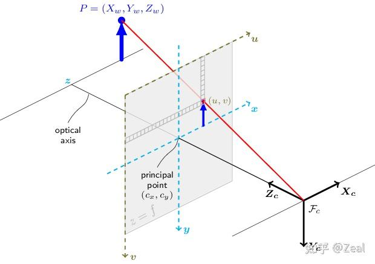
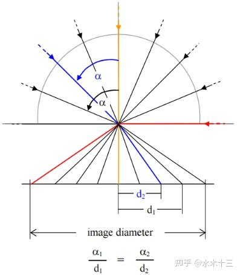
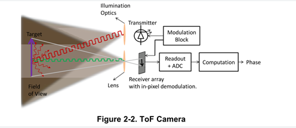

# 传感器原理

- SLAM中最常用的传感器为IMU,相机以及激光雷达；在无人机最常用的传感器为气压计，定高雷达，磁力计，空速管，光流计等；无人车一般会搭载毫米波雷达。下面是各种传感器的基本工作原理：

## IMU

- IMU常用的为mems IMU，成本低发散快，主要关心的参数为零偏，测量噪声等。这里说的零偏实际上是一种随机游走量，其导数是一个高斯白噪声。mems IMU 对应的测量方程为：
  $$
  \begin{aligned}
  	a_m&=R_{G}^{B}\left( a^G-g^G \right) +b_a+ n_a\\
  	w_m&=w+b_g+ n_g\\
  \end{aligned}
  $$
  其中$b_g$与$b_a$对应着陀螺仪以及加速度计的偏置项，其被建模成随机游走信息，其导数是一个高斯白噪声，定义为$n_{bg}$以及$n_{ba}$。陀螺仪与加速度计的测量噪声也为高斯白噪声$n_g$以及$n_a$

## 相机

- 常见相机有RGB，RGBD，鱼眼，全景相机等，快门有全局快门以及卷帘快门两种，与其他传感器一同使用时可考虑采用外部触发的方法进行时间同步。常见品牌为奥比中光，intel realsense，黑森科技，肇观电子等等。

### RGB/RGBD

- RGB/RGBD相机主要指的是彩色相机以及能同时输出彩色以及深度信息的相机，其输出图像展示如下：

  

- RGB相机的投影模型为针孔模型，其成像原理比较简单。直接将世界系中的一个点$P$投影到二维像素平面上，P点在相机系中的位置坐标为 $(X,Y,Z)^T$，投影点为$(u,v)$，相机内参矩阵为K。由于其投影方式是沿直线投影，所以其能观察到的视野是受限的。其原理如下：
  $$
  \left( \begin{array}{c}    u\\    v\\    1\\\end{array} \right) =\frac{1}{Z}\left( \begin{matrix}    f_x&        0&      c_x\\    0&      f_y&        c_y\\    0&      0&      1\\\end{matrix} \right) \left( \begin{array}{c}    X\\    Y\\    Z\\\end{array} \right) \xrightarrow{\Delta}\frac{1}{Z}KP.
  $$

### 鱼眼相机

- 鱼眼相机的视野范围比RGB相机要更大，如果仍使用上述的投影原理，当相机的视场角快达到180°时，成像图像会变成无穷大。

  

- 鱼眼相机投影模型对应的入射角要小于出射角，跟据后续投影模型的投影原理不同可以分为等距投影模型、等立体角投影模型、正交投影模型和体视投影模型四种。

  

  

### 全景相机

- 全景相机投影模型中并不会存在畸变，其投影模型可以用世界地图进行类比。**相当于真实世界投影到一个单位圆上，再将该单位园展开成为一个矩阵，即成为等距投影模型**。投影原理为相机坐标系中的一个点，按照圆球模型转换成为 $(\theta, \phi)$，最终计算其对应的像素坐标$(u, v)$。

  - 假设当前世界系中一点 $p^w$, 需将其转换到相机坐标系对应的单位圆上的b。

  $$
  p^c=R_{b}^{c}R_{w}^{b}p^w\\b=\frac{p^c}{\left\| p^c \right\|}
  $$

  - 单位圆b点转换成为球体坐标$(\theta, \phi)$
    $$
    \\\phi =-\mathrm{arc}\sin \left( b_y \right) , \phi \in \left( -\frac{\pi}{2},\frac{\pi}{2} \right] \\\theta =\mathrm{atan 2}\left( b_x,b_z \right) , \theta \in \left( -\pi ,\pi \right] \\u=\frac{\theta +\pi}{2\pi}
    $$

  - 球体坐标转换成为成像平面的像素坐标

$$
u\in \left[ 0,1 \right] \\v=\frac{\pi -2\phi}{2\pi}, v\in \left[ 0,1 \right]
$$

### 深度相机

### 相机快门

- 相机快门方式主要有两种：全局快门以及卷帘快门。
  - 卷帘快门：像素逐行（或逐列）顺序曝光，每行之间有微秒级延迟（如从顶部到底部扫描）。曝光和读取同步进行，当前行在读出的同时，下一行开始曝光，所以其获取图像的速度相比全局快门更快。
    - 问题：**时间错位导致运动物体畸变（[果冻效应](https://zhida.zhihu.com/search?content_id=259910421&content_type=Article&match_order=1&q=果冻效应&zhida_source=entity)）或闪光灯曝光不均。**
  - 全局快门：同步曝光所有像素点的特性，确保每帧图像采集时所有像素同时开始和结束曝光，其可以用于高速运动检测等等。
    - 问题：价格价高，相同分辨率下全局快门相机价格可能是卷帘快门的2-5倍。
- 快门对比：卷帘快门图像出现扭曲，在SLAM中更倾向于使用全局快门相机，其对应的视觉算法定位精度，渲染质量都更好。

- 深度相机：常见原理有双目/结构光/ToF

  - 双目即利用三角测量原理确定深度，基线越大，能观察的范围就越远。

    

  - 结构光利用一束光源（通常是红外线）来照亮物体表面，并通过相机镜头来捕捉反射回来的光线计算深度，其受实际场景中的光照影响比较大。

  - toF属于主动发送光束(通常为红外线)，跟据其返回时间计算距离，其测量距离较远但是也会收到光照影响。

    

### 同步方法

- 不同传感器往往拥有独立的时钟源。即使激光雷达和相机名义上同为 10 Hz，启动时刻差异等也会导致二者输出的数据在时间轴上产生不可忽略的偏差。常见的同步方法有如下两种：

  - 硬同步：通过外部同源时钟同时触发相机与激光雷达，使二者在「触发时刻」严格对齐。需要相机和激光雷达均支持外部触发接口，**但是触发对齐 ≠ 数据对齐。传感器内部的数据采集链路（如相机曝光、激光雷达扫描周期）会引入额外的固定或随机延迟，最终时间戳仍可能存在毫秒级差异**。

  - 软同步：仅在软件层面对两类数据的时间戳进行后处理，比如将最近的相机与雷达数据进行同步。

  

## 激光雷达

- 常见激光雷达有机械式激光雷达，固态激光雷达等。无人机上安装的激光雷达为一些低成本小体积的激光雷达，如MID360等，速腾，禾赛等公司目前也在出产相似的激光雷达产品，但目前产品效果较差。**激光雷达在短时间内可以获取大量的位置点信息（或者称为激光点云），1秒内可以生成的点的数量从几十万到数百万不等，除了获得位置信息外，激光信号的反射率可以区分目标物质的不同材质。**

### 测量原理

- 机械雷达：

  - 常见波长：波长更长的近红外激光的穿透性更好，且更不容易受太阳光影响，因此更多的应用在了远距离的激光雷达中。常见的波长有850nm，905nm和1550nm.

  - 机械：在水平方向采用机械结构进行 360°的旋转扫描，在垂直方向采用定向分布式扫描。属于重复式扫描，即随着时间变长，扫描到的点云不会增加。

  - 半固态/固态：半固态的发射器和接收器固定不动，只通过少量运动部件实现激光束的扫描。固态的内部完全没有运动部件，使用半导体技术实现光束的发射、扫描和接收。其都是非重复式的扫描，随着时间变长，点云会越来越多。

- 固态雷达

### 易出现的问题

- 影响LiDAR点云质量的原因：

  - 强光照射(有一些激光雷达数据集特意录制强光照射场景)，在有强光照射时，激光雷达的测量距离和点云数量大幅减少。

  - 雨雾干扰：会出现很多噪点，激光雷达的测距性能发生衰减。

    

  - 地面积水：即发生镜面反射导致出现多余点云。

## 毫米波雷达

## 气压计

- **气压计是一种利用大气压力测量高度的设备（相对于海平面的高度）**。因为天气、温度等原因会导致不同时刻同一地点气压不同。故其测量高度变换比较准确，测量一个位置的高度是不准的，气压与高度的转换关系如下，其中p表示当前压力, p0表示海平面的压力（该公式假设大气温度恒定15度）。
  $$
  h=44300(1-(p/p_0)^{0.19})
  $$
  

## 光流计

- 光流传感器是一种用于测量当前相对于周围环境的运动的设备。它通过检测周围光线的变化来计算出物体的运动方向和速度。

## 空速管

- https://zhuanlan.zhihu.com/p/619612033

# 传感器标定

- 由于SLAM中输出位姿基本都是当前帧IMU到世界系的位姿，那么如果想使用其他传感器输出的定位结果与IMU进行融合，那么就需要进行一定的外参标定，使得不同传感器输出的位姿表示在同一个坐标系下。根据SLAM中所使用的传感器类型不同，标定方法就存在不同

### LiDAR IMU

- 

### LiDAR Camera

- 目前雷达与相机标定算法可大致分为两种方法，基于目标以及无目标的标定方法。基于目标的标定方法指的是基于一些特定的标定板进行标定，无目标的标定方法指的是基于自然场景的进行标定。

#### 基于目标的标定方法（Target-based Calibration）

- 其核心思想是：通过一组已知几何参数的标定目标（如平面棋盘格、球阵列或立体标靶）建立跨模态的对应关系，进而求解外参矩阵。依据对应关系的维度，可细分为 2D–3D 与 3D–3D 两种策略。常见标定板为：

  

  - 2D–3D 策略：直接利用图像中提取的 2D 特征点与其在 LiDAR 点云中对应的 3D 点构建对应。2D特征点可以直接利用图像特征提取方法进行提取，或者是使用手动选点的方法进行选择。3D特征点可以使用提取角点的方法进行提取，或者是使用手动选点的方法进行选择。
  - 3D–3D 策略：该策略与2D-3D策略最大的区别就是其需要先在图像中通过三角测量或深度传感器获得2D特征点的深度信息，后再进行计算。

#### 无目标的标定方法（Target-less Calibration）

- 其核心思想是其不会使用特定的标定板，而是直接使用自然场景中的特征进行计算。其中目前最常用的方法为direct_visual_lidar_calibration，该方法可以支持RGB相机，全景相机与激光雷达之间的标定。其本质上是由雷达转换出的强度图像与RGB转换出的灰度图像之间提取特征，然后进行外参的计算。在实验室环境标定结果如下：

参考链接：https://zhuanlan.zhihu.com/p/404762012

### Camera IMU

### GPS IMU

- GPS与IMU之间的标定相对较为困难，因此在一些融合GPS数据的SLAM定位算法中，通常不会考虑GPS与IMU之间的外参。然而，实际上GPS测量的位置对应的是天线相位中心的位置，而该位置与IMU的安装位置之间往往存在一定的空间偏差。如果忽略这一差值，可能会影响融合结果的精度。因此，建议在进行数据融合前，优先对GPS与IMU之间的外参进行标定，以提升系统整体的定位准确性。

- 目前在SLAM中进行GPS与IMU进行融合的方法为：计算GPS输出轨迹与VIO或者LIO之间输出轨迹，其轨迹对应的转换关系即为两者的外参。

## 传感器选型

不同传感器的在不同平台适配

- 无人机
- 无人车

#### 无人车选型

- 

- 平台选型： 九识，文源，萝卜，新石器。在轨无人车

- 机器人
- 

