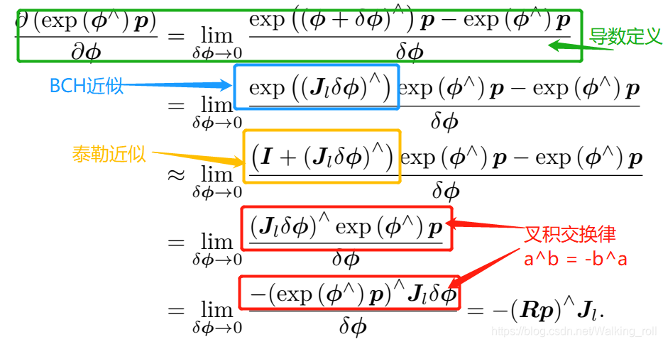

# Week1

## FAST-LIO以及FAST-LIO-LOC

提供全局的定位数据以及初始状态提供巡检，初始状态为xyzypr(yaw / pitch / row )

- FAST-LIO
  - 输入：LiDAR点云以及IMU数据
  
  - 输出：/cloud_registered以及/Odometry 
  
  - **以FAST-LIO1为例，主要是分析IMU递推方程/LiDAR测量方程以及/去除运动畸变三者**。
    
    - IMU递推方程: 在递推过程中主要使用的是**误差状态**进行后续的递推
    
    - 运动补充(去畸变)
    
    - LiDAR测量方程
    
      - 整个方程需要从非线性转换到线性， H是测量方程h()在估计状态$\hat{x}$的雅克比矩阵。
      - 定义测量值 $z=n^Tq$， 测量方程为$h(x)=n^T(Rp+t)$其中R,t是通过IMU递推获取到的状态量, Fast-LIO与Voxelmap不同在于其没有考虑测量点p, 平面法向量n以及平移量t的误差。**Voxelmap由于包含更多的误差量，其最后推导的噪声v就不仅仅只包含测量噪声**
    
      $$
      \begin{align}
      z & = h\left ( x  \right ) + v \\
        & = h\left ( \hat{x} \oplus \delta x \right )+v \\
        & = h\left ( \hat{x}  \right ) + H\delta x + v
      \end{align}
      $$
    
      ​	其中$z - h\left ( \hat{x}  \right )$即表示为点到平面距离, **但是目前应该仍然有一个负号误差没有解决**
      $$
      z - h\left ( \hat{x}  \right ) = H\delta x + v
      $$
    
    - 状态更新: 个人感觉是否进行迭代对整体的影响不大，可以手动修改确定一下
    
    
  
- FAST-LIO-LOC
  - 输入：LiDAR点云以及IMU数据
  - 输出：/cloud_registered以及/Odometry 
  - **整体逻辑为:** 计算$T_{base\_link}^{map}$即计算在map坐标系中，base_link系或者称为LiDAR系的位姿。对于$T_{base\_link}^{map}$的计算主要是分为$T^{map}_{odom}$以及$T^{odom}_{base\_link}$。。在FAST-LIO通过初始化自行确定的坐标系odom中，计算每个时刻的状态$T^{odom}_{base\_link}$。利用FAST-LIO输出的转换到odom系中的LiDAR点云与全局点云配准计算$T^{map}_{odom}$，其可以补偿FAST-LIO计算出的$T^{odom}_{base\_link}$可能出现的误差。**$T^{map}_{odom}$**的初始值可以人为确定, 其值会被**ICP或者其余的点云匹配算法优化**
    - python脚本中的坐标系 map | odom | base_link 分别表示 全局坐标系，里程计坐标系(即fastlio确认的坐标系)以及固定在无人机上的坐标系
      - 初始状态：指定初始的位姿状态，即绕固定轴 roll->pitch->yaw的顺序转换四元数发送
      - 全局定位：
        - 接收：
          - /cloud_registered以及/Odometry 即从fastlio中获取到的点云以及位姿 
          - **/initial_pose 表示 odom到map系中的转换关系, 即表示odom系在map系中的什么位置，即指定了当前无人机(base_linke系)在map系中的出发位置**
        - 发布：/cur_scan_in_map | /submap | /map_to_odom
          - /submap 表示 当前map系中按照FOV裁剪出来的点
          - cur_scan_in_map 表示  odom系中的当前帧点云**(修改了坐标系以及时间戳)**
          - /map_to_odom **不断修正的odom系到map系的转换关系**
        - 函数流程
          - 点云裁剪： 利用上一帧的 $T_{odom}^{map}$以及话题接收到的$T^{odom}_{base\_link}$将全局地图转换到当前局部系base_link中进行点云裁剪，以减小点云量加速匹配**(这里是一直进行的，但按理来说odom到map的转换关系在初始状态就可以固定，后续只是修正)**  最终输出在map系中的点云数据
          - 粗匹配/静匹配 registration_at_scale：调用open3D来实现odom系到map系之间的点云匹配, 不同scale控制粗细，并返回匹配精度方便衡量
          - 发布以odometry的格式发布点云匹配结果即 $T_{odom}^{map}$
        - 融合部分：
          - 接收 /Odometry以及/map_to_odom 发送 /localization 
            - 即利用 $T_{base\_link}^{odom}$与$T_{odom}^{map}$实现整体的$T_{base\_link}^{map}$即输出最终的map系中的位置数据

- 潜在的bug：但是我逻辑是分析是没有，但不确定重力加速度g在其中的作用(用FAST-LIO1而不是用FAST-LIO2) 
  - 如果直接在FAST-LIO-LOC这个部分修改位姿, 将点云匹配修改成为map与base_link系之间，那么LiDAR量测获取到的就是 $T^{map}_{base\_link}$。 在IMU实现递推的时候，对应的应该是两个时刻base_link之间的转换，再加上前一个时刻中的$T^{map}_{base\_link}$其实也是获取到当前时刻的$T^{map}_{base\_link}$，递推与量测对应相同的内容，即可以实现融合定位。

- 李群/李代数：李群与李代数之间可以通过罗德里格斯公式转换

  - 旋转矩阵 3*3 可认为是一个李群 

  - 旋转向量 3*1 可认为是一个李代数

  - **旋转矩阵自身是带有约束的（正交且行列式为 1）。它们作为优化变量时，会引入额外的约束，使优化变得困难**。在后续求导中，使用扰动模型比直接使用李代数进行求导方便

    

    

PS: 这里为什么需要求导：是不是指定一个误差函数需要迭代的时候会求导，并且一阶展开的时候会进行求导(EKF 转换测量方程)

Fast-LIO的推导部分  

- https://zhuanlan.zhihu.com/p/538975422 该链接中介绍的测量方程很受用

- [https://blog.csdn.net/weixin_44382195/article/details/110677858](https://link.zhihu.com/?target=https%3A//blog.csdn.net/weixin_44382195/article/details/110677858) 计算R关于时间导数 
- https://zhuanlan.zhihu.com/p/561877392 非常简明的Fast-LIO推导, 但是在这个测量方程上写的不是特别详细
- https://zhuanlan.zhihu.com/p/441182819 简明ESKF推导

除去Fast-LIO定义的状态变量，ctlio也实现了这种基于流型的kalman滤波来进行状态估计, 利用ICP计算量测。

- 除去Fast-LIO定义的状态变量，ctlio也实现了这种基于流型的kalman滤波来进行状态估计, 利用ICP计算量测。

  - ct-lio中测量值z直接就是ICP计算出来的R与t, 所以对应的观测模型h()也是直接获取到R,t。**注意无论是fastlio计算的点面残差还是ctlio的ICP测量值，其对应$h(\hat{x})$都是基于IMU递推到这个时刻计算得到的**。ct-lio本质上就是高翔的简明ESKF推导内容，IMU递推获取到$\delta x$的估计值以及协方差，LiDAR测量部分方程获取到对$\delta x$的H矩阵，后调用ESKF公式就可以直接计算增益K。**注意最后需要reset $\delta x$并且需要更新P矩阵**

  $$
  \begin{align}z & = h\left ( x  \right ) + v \\  & = h\left ( \hat{x} \oplus \delta x \right )+v \\  & = h\left ( \hat{x}  \right ) + H\delta x + v\end{align}
  $$

后续可以查看渲染部分: https://github.com/ZikangYuan/sr_livo | 关于定位可以直接使用hm-lio (其也是直接基于高翔的ESKF进行修改的) 就是目前需要更改的部分只有两个 (1) 初始状态 (2) 匹配方程

