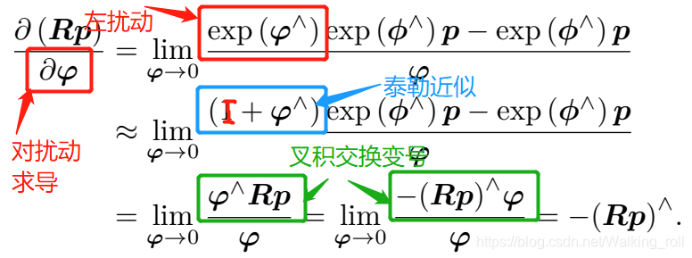

# Week2

## FAST-LIO

- 执行流程：

  | 流程          | 执行内容                                                     | 对应函数                             |
  | ------------- | ------------------------------------------------------------ | ------------------------------------ |
  | 输入          | LiDAR点云(10HZ)以及IMU数据(200HZ)                            |                                      |
  | 数据整理      | 整理每一帧雷达测量时间中的所有IMU测量值，打包输出            | sync_packages()                      |
  | 初始化        | 静止, 计算初始状态                                           | IMU_init()                           |
  | IMU前向推导   | 利用递推公式输出每一帧IMU测量时刻的估计状态                  | Process()                            |
  | LiDAR运动补偿 | 利用IMU递推出的状态计算每一个LiDAR点对应位姿，输出运动补偿后的点云 | UndistortPcl()                       |
  | LiDAR量测方程 | 利用地图结构ikd-tree查找点云，构建LiDAR测量方程，利用Kalman滤波估计状态 | update_iterated_dyn_share_modified() |
  | 地图更新      | 当前帧点云补充到地图结构中                                   | map_incremental()                    |
  | 输出          | 输出里程计状态以及点云                                       |                                      |
  
  

- **以FAST-LIO1为例，主要是分析IMU递推方程/LiDAR运动补偿/LiDAR测量方程以及三者**。

  - IMU测量模型：IMU测量得到的角速度/加速度都是针对当前时间的Body系(或者是称为IMU系)的测量结果，不过由于加速度计会受到重力加速度的影响，在FAST-LIO中会通过静止100帧获取到一个重力加速度的估计值(即获取到全局系G中的重力值$g^G$), 计算$a_m$就非常方便，其中$b_g$与$b_a$对应着陀螺仪以及加速度计的偏置项，其被建模成随机游走信息，其导数是一个高斯白噪声，定义为$n_{bg}$以及$n_{ba}$。陀螺仪与加速度计的测量噪声也为高斯白噪声$n_g$以及$n_a$。
    $$
    \begin{aligned}
    	a_m&=R_{G}^{B}\left( a^G-g^G \right) +b_a+ n_a\\
    	w_m&=w+b_g+ n_g\\
    \end{aligned}
    $$

    - IMU基本参数的确定: **需要确定的参数为实际重力加速度g，加计的偏置以及噪声，陀螺仪偏置以及噪声**，**bias_acc与bias_gyro对应的是偏置值的噪声**。FAST-LIO的初始化方案为静止初始化。偏置以及以及噪声协方差的计算如下，其中$\circ$表示按逐元素乘积。
      $$
      \begin{array}{c}
      	\mu _{a,N}=\mu _{a,N-1}+\frac{1}{N}\left( a_N-\mu _{a,N-1} \right)\\
      	\mu _{g,N}=\mu _{g,N-1}+\frac{1}{N}\left( g_N-\mu _{g,N-1} \right)\\
      \end{array}
      $$
    
      $$
      \begin{array}{c}
      	\sigma _{a,N}^{2}=\sigma _{a,N-1}^{2}\frac{N-1}{N}+\left( a_N-\mu _{a,N} \right) \circ \left( a_N-\mu _{a,N} \right) \frac{N-1}{N}\\
      	\sigma _{g,N}^{2}=\sigma _{g,N-1}^{2}\frac{N-1}{N}+\left( g_N-\mu _{g,N} \right) \circ \left( g_N-\mu _{g,N} \right) \frac{N-1}{N}\\
      \end{array}
      $$
    
      | 参数              | 计算方法                                                     |
      | :---------------- | :----------------------------------------------------------- |
      | $b_a$             | 初始值为0, 在后续Kalman过程中被更新 (其他算法在初始化部分按照重力的模值将其剔除的方法) |
      | $b_g$             | 静止100帧后获取到的陀螺仪测量值平均值                        |
      | $\sigma _{a}^{2}$ | 静止100帧后获取到的加速度计协方差 (用于测量方程)             |
      | $\sigma _{g}^{2}$ | 静止100帧后获取到的陀螺仪协方差 (用于测量方程)               |
      | $g^G$             | 静止100帧后获取到的加速度测量值平均值, 一般取负方便后续计算(初始包含bias_a，需要手动减) |
      | $n_{ba}$          | 加速度偏置对应噪声 (直接设置Eigen::Vector3d(0.0001, 0.0001, 0.0001)) |
      | $n_{bg}$          | 陀螺仪偏置对应噪声 (直接设置Eigen::Vector3d(0.0001, 0.0001, 0.0001)) |
    
    - 关于LiDAR的测量噪声也没有进行建模分析，而是直接给定一个经验值**LASER_POINT_COV (0.0015)**作为LiDAR测量噪声的协方差，并且FAST-LIO2中引入了对于LiDAR与IMU外参的估计，因为测量方程中包含了从LiDAR系到IMU系的转换的外参，所以其可以被LiDAR测量方程更新。
    
    
    
  - IMU递推方程: IMU作为每两LiDAR帧之间的状态估计工具，涉及到状态以及协方差的递推。FAST-LIO中利用的是误差状态向量进行推导，但是由于误差状态计算公式中仍然需要名义状态，所以这里需要对误差状态以及名义状态同时参与推导。**名义状态就是在递推过程中不包含噪声的估计结果, 误差状态向量即作为真实状态与名义状态之间的差值**。

    - 在实际推导过程中，会涉及到非线性方程到线性方程的转换，即需要进行一阶线性化处理。在这里应该是有**三种推导方式**，主要在于采用的线性化方式不同，FAST-LIO中使用方法2线性化，但是方法3的推导过程更加简洁，并且线性化点以及最终结果与FAST-LIO非常类似，故重点分析方法3。

      1. 在估计状态处线性化，即在线性化点选择当前状态直接线性化(严老师Kalman书的推导过程)，其中$J$是$f(x)$在线性化点$\hat{x}_{k}$处进行的线性化结果(即类似于常规的EKF线性化处理)，即雅可比矩阵。$f\left( \hat{x}_{k} \right)$即可以认为是不考虑噪声的最优一步预测$\hat{x}_{k+1/k} $。最终对应的方程表示从上一步的误差估计值，只利用IMU递推到下一个时刻的最优一步预测，后续会被测量方程进行优化。
         $$
         \begin{aligned}
         	x_{k+1}&=f\left( x_{k} \right) +w_{k}\\
         	&\approx f\left( \hat{x}_{k} \right) +J\left( x_{k}-\hat{x}_{k} \right) +w_{k}\\
         	\delta \hat{x}_{k+1/k}&=J\delta \hat{x}_{k}+w_{k}\\
         \end{aligned}
         $$

      2. 从连续状态直接线性化推导结果，即在FAST-LIO中使用的从连续状态到离散状态的推导过程。FAST-LIO中的递推方程可以表示如下，输入量$u_i$其实就是加速度以及角速度
         $$
         f\left( x_i,u_i,w_i \right) =\left[ \begin{array}{c}
         	\omega _{m_i}-b_{\omega _i}-n_{\omega _i}\\
         	^Gv_{I_i}\\
         	^GR_{I_i}\left( a_{m_i}-b_{a_i}-n_{a_i} \right) +^Gg_i\\
         	n_{b\omega _i}\\
         	n_{ba_i}\\
         	0_{3\times 1}\\
         \end{array} \right]
         $$
         后续推导过程即需要将下面这部分线性化，其表示下一帧状态与这一帧状态的变换关系，$\boxplus$与$\boxminus$是为了描述旋转上的加减关系，是一种流形上的加减法
         $$
         x_{i+1}=x_i\boxplus \left( f\left( x_i,u_i,w_i \right) \varDelta t \right)
         $$
         下一步就是非常复杂的计算，将真实状态$x_{i}$拆分成为$x_i\boxminus \hat{x}_{i}$，$\hat{x}_{i}$就没有考虑噪声的推导结果。**在整个推导过程中涉及到很多在流形上的计算性质使用，麻烦而且没有必要。**
         $$
         \begin{aligned}
         	\tilde{x}_{i+1}&=x_{i+1}\boxminus \hat{x}_{i+1}\\
         	&=\left( \left( x_i\boxplus f\left( x_i,u_i,w_i \right) \varDelta t \right) \right) \boxminus \left( \left( \hat{x}_i\boxplus f\left( \hat{x}_i,u_i,0 \right) \varDelta t \right) \right)\\
         	&=F_{\tilde{x}}\tilde{x}_i+F_ww_i\\
         \end{aligned}
         $$

      3. 从连续状态推导误差状态的导数，再离散化获取结果 **(推导上最简单，方法1实际上没有考虑到ESKF由于是针对误差状态的分析方法，所以线性化点会选择零点，在数值上更加稳定的优势。方法1对应的ESKF在名义状态处，其离散化方式就与EKF相同，体现不出来ESKF优势。2、3这两种推导方法其线性化点都是对$\delta x$， 也就是零点)**。首先计算各状态的导数形式。速度导数就是加速度，关于旋转的导数即使用右扰动模型进行推导，可以参考 https://blog.csdn.net/weixin_44382195/article/details/110677858。
         $$
         \begin{aligned}
         	\dot{p}&=v\\
         	\dot{v}&=R\left( a_m-b_a-n_a \right) -g\\
         	\dot{R}&=R\left( \omega_m-b_g-n_g \right) ^{\land}\\
         	\dot{b}_g&=n_{bg}\\
         	\dot{b}_a&=n_{ba}\\
         	\dot{g}&=0\\
         \end{aligned}
         $$
         对于真实状态${x}_{k+1}$，其与名义状态$x_{k+1}^n$、误差状态$\delta x_{k+1}$的关系为: 
         $$
         x_{k+1} = {x}_{k+1}^{n} + \delta {x}_{k+1} \rightarrow \begin{array}{l}
         	p=\hat{p}+\delta p\\
         	v=\hat{v}+\delta v\\
         	R=\hat{R}\delta R\\
         	b_g=\hat{b}_g+\delta b_g\\
         	b_a=\hat{b}_a+\delta b_a\\
         	g=\hat{g}+\delta g\\
         \end{array}
         $$
         其中名义状态${x}_{k+1}^{n}$在递推中是不考虑噪声的，所以其求导结果也是不包含噪声，其对应的递推公式为
         $$
         \begin{aligned}
         	\hat{p}_{k+1}&=\hat{p}_k+\hat{v}_k\varDelta t\\
         	\hat{v}_{k+1}&=\hat{v}_k+\hat{R}_k\left( a_m-\hat{b}_{a,k} \right) \varDelta t-\hat{g}_k\varDelta t\\
         	\hat{R}_{k+1}&=\hat{R}_k\mathrm{Exp}\left( \left( \omega _m-\hat{b}_{g,k} \right) \varDelta t \right)\\
         	\hat{b}_{g,k+1}&=\hat{b}_{g,k}\\
         	\hat{b}_{a,k+1}&=\hat{b}_{a,k}\\
         	\hat{g}_{k+1}&=\hat{g}_k\\
         \end{aligned}
         $$
         对上面公式左右同时求导，那么就可以获取到各个误差状态的导数。这里的$\theta$是旋转相关的李代数，即旋转矩阵可以认为是一个李群，旋转向量就可以认为是一种李代数(**实际上应该是旋转向量的反对称矩阵为李代数**)，利用旋转向量表示一个小的旋转会更加简单，求导也简单(**利用罗德里格斯公式**)。噪声$n_v$与$n_{\theta}$就是加速度测量噪声$n_a$与角速度噪声$n_g$离散化之后乘以时间值$\varDelta t$，其中$n_{b\_g}$与$n_{b\_a}$表示随机游走白噪声离散化结果。
         $$
         \begin{aligned}
         	\delta \dot{p}&=\delta v\\
         	\dot{\delta}v&=-\hat{R}\delta b_a-\hat{R}\left( a_m-\hat{b}_a \right) ^{\land}\delta \theta -\delta g-n_a\\
         	\dot{\delta}\theta &=-\left( w_m-\hat{b}_g \right) ^{\land}\delta \theta -\delta b_g-n_g\\
         	\delta \dot{b}_g&=n_{bg}\\
         	\delta \dot{b}_a&=n_{ba}\\
         	\delta \dot{g}&=0\\
         \end{aligned}\rightarrow \begin{aligned}
         	\delta p_{k+1}&=\delta p_k+\delta v_k\varDelta t\\
         	\delta v_{k+1}&=\delta v_k+\left( -\hat{R}_k\left( a_m-\hat{b}_{a,k} \right) ^{\land}\delta \theta _k-\hat{R}_k\delta b_{a,k}+\delta g_k \right) \varDelta t+n_v\\
         	\delta \theta _{k+1}&=\mathrm{Exp}\left( -\left( w_m-\hat{b}_{g,k} \right) \varDelta t \right) \delta \theta _k-\delta b_{g,k}\varDelta t-n_{\theta}\\
         	\delta b_{g,k+1}&=\delta b_{g,k}+n_{b\_g}\\
         	\delta b_{a,k+1}&=\delta b_{a,k}+n_{b\_a}\\
         	\delta g_{k+1}&=\delta g_k\\
         \end{aligned}
         $$
         对于噪声值对应的协方差的变换关系如下，这里的$\sigma _a$以及$\sigma _g$都是测量方程噪声离散化之后对应的协方差
         $$
         \sigma \left( n_v \right) =\Delta t\sigma _a,\sigma \left( n_{\theta} \right) =\Delta t\sigma _g,\sigma \left( n_{b\_g} \right) =\sqrt{\Delta t}\sigma _{bg},\sigma (n_{b\_a})=\sqrt{\Delta t}\sigma _{ba}
         $$
         后直接离散化就可以推导出$\delta x_k$的递推公式
         $$
         \delta x_{k+1}=F_x\delta x_k+F_ww
         $$
         
         $$
         \begin{aligned}
         	w&=\left[ n_{v}^{T}\quad n_{\theta}^{T}\quad n_{b\_g}^{T}\quad n_{b\_a}^{T} \right] ^T\sim N(0,Q)\\
         	F_x&=\left[ \begin{matrix}
         	I&		I\bigtriangleup t&		0&		0&		0&		0\\
         	0&		I&		-\hat{R}(f^b-b_a)\times&		0&		-\hat{R}\bigtriangleup t&		I\bigtriangleup t\\
         	0&		0&		\mathrm{Exp(}-(\omega ^b-b_g)\bigtriangleup t)&		-I\bigtriangleup t&		0&		0\\
         	0&		0&		0&		I&		0&		0\\
         	0&		0&		0&		0&		I&		0\\
         	0&		0&		0&		0&		0&		I\\
         \end{matrix} \right]\\
         	F_w&=\left[ \begin{matrix}
         	0&		0&		0&		0\\
         	-I\bigtriangleup t&		0&		0&		0\\
         	0&		-I\bigtriangleup t&		0&		0\\
         	0&		0&		I\bigtriangleup t&		0\\
         	0&		0&		0&		I\bigtriangleup t\\
         	0&		0&		0&		0\\
         \end{matrix} \right]\\
         \end{aligned}
         $$

    - 在后续过程中，利用误差状态递推方程就可以不断获取到当前估计状态与真实状态之间的差值，并且这个误差状态估计在后续也可以被测量方程进行优化。误差状态的协方差递推过程可以表示如下，**但是由于每一次更新的时候都会将$\delta x_k$更新为0 (即用于估计的$\delta \hat{x}_k$)，所以只计算协方差就可以了**。**下面方程对应的是对下一帧误差状态的预测。**

  $$
  \begin{aligned}
  	\delta \hat{x}_{k+1/k}&=F_x\delta \hat{x}_k\\
  	\hat{P}_{k+1/k}&=F_x\hat{P}_kF_{x}^{T}+F_wQF_{w}^{T}\\
  \end{aligned}
  $$

- 运动补偿

  - 由于每一帧的LiDAR测量是一个连续的时间段，在这个时间中LiDAR可能是在移动状态，导致测量得到的点云出现重影等问题。对于这种问题就可以使用IMU测量去除每一个点的移动，并将当前帧所有的点云**反投影**到LiDAR帧的结束时间，实现点云的运动补偿。

    - 点云排序: livox的点云包含了offset_time属性，可按照该时间进行排序。
    - IMU前向递推: 基于LiDAR采集开始到结束时间，利用Kalman滤波中的前向递推，可以获取到每一个IMU测量值时对应的位置，姿态，加速度，角速度等信息**(这里是利用前后两帧做平均)**
    - 点云反投影:  根据前向传播可以获取到LiDAR最后时刻对应的位置以及姿态。**每一个IMU段中的所有点云，都可以基于其前面一个IMU状态进行递推计算出其对应的在世界系中的位置以及旋转**(相对时间间隔也可以计算)，根据其相对最后时刻的位姿变换，再将其转换到LiDAR系下，即获取到运动补偿之后的LiDAR系点云，其计算公式与名义状态递推相同。

    

- LiDAR测量方程

  - 整个方程需要从非线性转换到线性， H是测量方程h()在零点线性化获取的雅克比矩阵。
  - 定义测量值 $z=n^Tq$， 测量方程为$h(x)=n^T(Rp+t)$其中R,t是通过IMU递推获取到的状态量, FAST-LIO与Voxelmap不同在于其没有考虑测量点p, 平面法向量n以及平移量t的误差。**Voxelmap会推导更多的误差量，其最后推导的噪声v就不仅仅只包含测量噪声(具体计算会更加复杂)**

  $$
  \begin{align}
  z & = h\left ( x  \right ) + v \\
    & = h\left ( \hat{x} \boxplus \delta x \right )+v \\
    & = h\left ( \hat{x}  \right ) + H\delta x + v
  \end{align}
  $$

  ​	其中$z - h\left ( \hat{x}  \right )$即表示为点到平面距离
  $$
  \begin{array}{c}
  	z-h\left( \hat{x} \right) =H\delta x+v\\
  	\delta z=H\delta x+v\\
  \end{array}
  $$

​		由于$h(x)=n^T(Rp+t)$, 那么$h(\hat{x} \boxplus \delta x)=n^T(R\delta Rp+t+\delta t)$对于$\delta x$在线性化点处的雅可比矩阵可表示如下, 其中$\delta x=\left[ \delta p,\delta v,\delta \theta ,\delta b_g,\delta b_a,\delta g \right] ^T$这里的$\theta$就直接表示为每一时刻旋转对应的李代数。由于$Exp\left( \delta \theta \right)=I+(\delta \theta)^{\land}$, 并且$(\delta \theta)^{\land}p=-p^{\land}\delta \theta$，可以将后续推导为:
$$
\small{H=\frac{\partial h\left( \hat{x}\boxplus \delta x \right)}{\partial \delta x^T}}=\frac{\partial n^T(RExp\left( \delta \theta \right) p+t+\delta t)}{\partial \delta x^T}=\left[ n^T,0,-n^TRp^{\land},0,0,0 \right]
$$

​		**那么k+1的测量方程可以表示成为: **
$$
\delta z_{k+1}=H\delta x_{k+1}+v_{k+1}\\
$$

- 状态更新:  核心是对于Kalman滤波中增益的计算，以及对真实状态的更新以及相关协方差的计算。$P_{pred}$作为IMU一直递推过程计算出来的协方差矩阵，H是h()对$\delta x$的雅可比矩阵，其中所使用R、t等属于状态向量的参数都是利用IMU方程递推到当前时刻的状态计算结果。**因为测量方程中只会包含旋转与平移信息，所以这里的$\delta x$**只会包含对旋转平移的更新

$$
\begin{aligned}
	K&=\hat{P}_{k+1/k}H^T\left( H\hat{P}_{k+1/k}H^T+V \right) ^{-1}\\
	\delta \hat{x}_{k+1}&=K\left( \delta z_k - H\hat{x}_{k+1/k} \right)\\
	\hat{P}_{k+1}&=\left( I-KH \right)\hat{P}_{k+1/k}\\
\end{aligned}
$$

​	最后使用递推到该时刻的名义状态以及被估计的误差状态叠加计算最终的估计值。**在每一次更新之后(即使用测量方程修正)，误差状态会被置零，估计状态对应的协方差P也应该有一个切空间变换，但是影响不大可以忽略不计算，直接用上一步计算的P也是可以的**。这里的$\hat{x}_{k+1}^{n}$实际上是通过IMU递推到该测量时刻的名义状态。
$$
\hat{x}_{k+1} = \hat{x}_{k+1}^{n} + \delta \hat{x}_{k+1}
$$

## 补充

- 李群/李代数：李群与李代数之间可以通过罗德里格斯公式转换

  - 旋转矩阵 3*3 可认为是一个李群 

  - 旋转向量 3*1 可认为是一个李代数

  - **旋转矩阵自身是带有约束的（正交且行列式为 1）。它们作为优化变量时，会引入额外的约束，使优化变得困难**。在后续求导中，使用扰动模型比直接使用李代数进行求导方便

    

    

- 关于使用测量方程h()不同，其H矩阵的形式就有所不同。FAST-LIO是计算点向量与平面法向量之间的乘积，ctlio也实现了这种基于流型的kalman滤波来进行状态估计, 利用ICP计算量测——对应的量测就直接是R,t结果。**注意无论是fastlio计算的点面残差还是ctlio的ICP测量值，其对应$h(\hat{x})$都是基于IMU递推到这个时刻计算得到的**。ct-lio本质上就是高翔的简明ESKF推导内容，IMU递推获取到$\delta x$的估计值以及协方差，LiDAR测量部分方程获取到对$\delta x$的H矩阵，后调用ESKF公式就可以直接计算增益K。**注意最后需要将$\delta x$置0**
  $$
  \begin{align}
  z & = h\left ( x  \right ) + v \\
    & = h\left ( \hat{x} \oplus \delta x \right )+v \\
    & = h\left ( \hat{x}  \right ) + H\delta x + v
  \end{align}
  $$

  - 这里的H矩阵的计算方式如下

$$
H=\frac{\partial h\left( x \right)}{\partial x} \frac{\partial x }{\partial \delta x}
$$

- Kalman滤波中，噪声的来源都是测量时会受到测量噪声的影响，所以不考虑噪声的估计值与真实值的差距越来越大。**预测方程中是IMU测量值导致的，其也是会受到噪声的影响(IMU作为控制输入)，所以只有最优估计也会越来越大(这种就会直接觉得对控制量是绝对已知的)，而且这里的控制输入直接被当成常数量写在每一帧的推导上，所以递推方程里面就没写控制部分**。

- https://zhuanlan.zhihu.com/p/538975422 该链接中介绍的测量方程很受用
- [https://blog.csdn.net/weixin_44382195/article/details/110677858](https://link.zhihu.com/?target=https%3A//blog.csdn.net/weixin_44382195/article/details/110677858) 计算R关于时间导数
- https://zhuanlan.zhihu.com/p/561877392 非常简明的Fast-LIO推导, 但是在这个测量方程上写的不是特别详细
- https://zhuanlan.zhihu.com/p/441182819 简明ESKF推导

# Week3

- 整理目前基于先验地图的匹配方法。提供全局的定位结果以及初始状态来实现巡检，初始状态指定为xyzypr(yaw / pitch / row )

| **FAST-LIO-localization** 比较粗糙, ICP匹配速度较慢          |
| ------------------------------------------------------------ |
| **Lidar_IMU_Localization** 多重约束: lio以及全局地图约束(不太理解怎么实现的, 因为LIO跟Map两个部分的约束感觉应该是同等效力， 如何设置权重?) |
| LOL: Lidar-only Odometry and Localization in 3D point cloud maps 纯激光雷达，时间比较久了，先不看这个 |
| liorf_localization 基于lio-sam的，但是lio-sam本身配置比较麻烦(不知道会不会好用一些) |
| fast-lio2-map-based-localization 跟第一个方法类似，只是更换了匹配方式 |
| ELiMaLoc(**EKF-based LiDAR-Inertial Map matching Localization**) 本质还是ICP, 但是会利用cuda加速匹配实现一种还不错的效果 |
| LiDAR_Localization_100FPS 彷佛非常高效计算                   |
| **Long-Term Mapping with 3D LiDAR and Reference Map Integration** |
| A Base Map-Guided Global Localization Solution for Heterogeneous Multi-Robot Systems Using a Co-View Context Descriptor 流程图写的非常复杂, 具体不了解 |
| SLAM-Map-Compression 2023年的CVPR 地图压缩, 不知道其能否有一个很好定位效果，也是使用C++实现 |
| multi_sensor_loclization_and_mappin:  NDT-based map matching, 使用的传感器好像比想象中多 |
| Globally Consistent and Tightly Coupled 3D LiDAR Inertial Mapping |

## FAST-LIO-LOC

- 输入：LiDAR点云以及IMU数据
- 输出：/cloud_registered以及/Odometry 
- **整体逻辑为:** 计算$T_{base\_link}^{map}$即计算在map坐标系中的base_link系或者称为LiDAR系的位姿。对于$T_{base\_link}^{map}$的计算主要是分为$T^{map}_{odom}$以及$T^{odom}_{base\_link}$。在FAST-LIO会通过初始化自行确定坐标系odom，并计算每个时刻的状态$T^{odom}_{base\_link}$。对于$T^{map}_{odom}$的计算是需要通过map系点云以及odom点云进行ICP，由于odom系的点云是通过FAST-LIO计算的$T^{odom}_{base\_link}$进行转换的，那么**该ICP实际上就是将$T^{map}_{odom}$(按照上一次ICP计算结果作为初始值)以及$T^{odom}_{base\_link}$同时进行优化，从而补偿了FAST-LIO算法中可能出现的漂移。**$T^{map}_{odom}$的初始值可以人为确定, 即作为base_link系在map系中初始状态。 
  - python脚本中的坐标系 map | odom | base_link 分别表示 全局坐标系，里程计坐标系(即fastlio确认的坐标系)以及固定在无人机上的坐标系
    - 初始状态：指定初始的位姿状态，即绕固定轴 roll->pitch->yaw的顺序转换四元数发送
    - 全局定位：
      - 接收：
        - /cloud_registered以及/Odometry 即从fastlio中获取到的点云以及位姿 
        - **/initial_pose 表示 odom到map系中的转换关系, 即表示odom系在map系中的什么位置，即指定了当前无人机(base_linke系)在map系中的出发位置**
      - 发布：/cur_scan_in_map | /submap | /map_to_odom
        - /submap 表示 当前map系中按照FOV裁剪出来的点
        - cur_scan_in_map 表示  odom系中的当前帧点云**(修改了坐标系以及时间戳)**
        - /map_to_odom **不断修正的odom系到map系的转换关系**
      - 函数流程
        - 点云裁剪： 利用上一帧的 $T_{odom}^{map}$以及话题接收到的$T^{odom}_{base\_link}$将全局地图转换到当前局部系base_link中进行点云裁剪，以减小点云量加速匹配**(这里是一直进行的，但按理来说odom到map的转换关系在初始状态就可以固定，后续只是修正)**  最终输出在map系中的点云数据
        - 粗匹配/静匹配 registration_at_scale：调用open3D来实现odom系到map系之间的点云匹配, 不同scale控制粗细，并返回匹配精度方便衡量
        - 发布以odometry的格式发布点云匹配结果即 $T_{odom}^{map}$
      - 融合部分：
        - 接收 /Odometry以及/map_to_odom 发送 /localization 
          - 即利用 $T_{base\_link}^{odom}$与$T_{odom}^{map}$实现整体的$T_{base\_link}^{map}$即输出最终的map系中的位置数据

## Lidar_IMU_Localization

- 

PS：毕设的第四章可以做基于全局地图的匹配——可以比较只有部分点云地图 / 以及全局先验地图的匹配，即设计一个模块来衡量全局地图以及自身LIO输出轨迹的权重值，最终输出位姿结果 **(还不确定，因为这里全局跟LIO我觉得本身描述的不是同一种匹配关系)** 

## hm-lio

- hm-lio的主体部分与ct-lio非常相似，但是其在占用内存上是非常小的(200MB以下)，FAST-LIO运行内存在300MB左右，ct-lio占用内存在10G左右，测试数据为15分钟的长序列，雷达为livox avia。**其相比于FAST-LIO以及ct-lio主要的更改在于使用了哈希体素地图**：

  - **voxelHashMap: **
    - 地图更新: voxel中点大于20就停止更新; 并且新来点在这里的点距离voxel中的距离要均大于设定的阈值，对应**map_incremental()中的addPointToMap()函数**
    - voxel距离当前位置大于设定阈值则被删除, 用于节省内存，对应**lasermap_fov_segment()**

  -  具体逻辑为: 获取IMU/LiDAR数据之后，进行运动补偿，IMU递推。LiDAR计算点面残差，这里的平面拟合方法为按照点的位置信息查找附近的voxel体素(xyz前后左右各一个)(体素中的点要大于设定的阈值, 初始为1)中的距离最近的20个点。后续利用最近的点来计算点面距离作为测量值。**法向量计算方法仍与之前相同**。

- 调节参数:

  | 调节参数           | 参数变化                                                     |
  | ------------------ | ------------------------------------------------------------ |
  | IESKF中的迭代次数  | 初始值为8, 修改迭代次数为1以及4, 影响不大, 系统保证均可实时。 |
  | voxel_neighborhood | 初始值为1，修改为3之后严重影响实时性                         |
  |                    |                                                              |

一帧的运行时间在100ms，无法继续提升速度，主要耗费在时间在于优化部分。并且lasermap_fov_segment()函数只会保留靠近一段区域中的voxel， 导致其天然不适合做回环类似的工作，回环还需要利用其他操作。

对于地图的更新策略也是比较复杂的，这里在更新地图的时候，一个voxel会判断其是否满 (20个点之后就不会继续补充)，并且新加入的点要与voxel中的其他点的距离均要大于一个阈值。不存在这个voxel才会被新建。

### 全局定位

- 将点云匹配修改成为map与base_link系之间，那么LiDAR量测获取到的就是 $T^{map}_{base\_link}$。 在IMU实现递推的时候，对应的应该是两个时刻base_link之间的转换，再加上前一个时刻中的$T^{map}_{base\_link}$估计值其实也是获取到当前时刻的$T^{map}_{base\_link}$，递推与量测对应相同的状态，即可以实现融合定位。**初始状态: 基于全局地图与当前启动时的xyzrpy进行计算初始状态。**

- 自适应初始化策略：

  - 将整个全局map进行分割成一个一个的region，在这些region中是否能使用一些点云特征加速region与当前local map的筛选策略，最后直接用该策略筛选出最有可能的region进行后续的ICP策略

    | LiDAR特征提取方法                                            | 效果 |
    | ------------------------------------------------------------ | ---- |
    | [scanContext++](https://github.com/gisbi-kim/scancontext_tro) |      |
    | [BoW3D](https://github.com/YungeCui/BoW3D)                   |      |
    |                                                              |      |

    

  - ICP处理方法: (是不是尝试一些学习的方法或者非学习的方法或者线程加速的方法) | 最简单的就是每个点找最近的voxel中的最近点进行ICP(直接调用HM-LIO中的查找函数)

    | 点云匹配策略                                   | 效果                                                         |
    | ---------------------------------------------- | ------------------------------------------------------------ |
    | [kiss-icp](https://github.com/PRBonn/kiss-icp) |                                                              |
    | [ct-icp](https://github.com/jedeschaud/ct_icp) |                                                              |
    | https://github.com/koide3/fast_gicp            | FastVGICP 在多线程以及体素化的基础上可以实现70FPS, 并且如果使用CUDA加速的甚至可以更快(但是c++中部署模型等会更复杂一些) |
    | https://github.com/koide3/small_gicp           | 只包含了C++头文件实现的ICP方法                               |
    | https://github.com/isl-org/Open3D              | open3D的C++ 版本                                             |

    

目前问题:

- voxel的删除策略是否有问题, 全局地图获取成了voxel, 但是随着车辆的移动, 会按照距离删除voxel. 对于全局地图生成的voxel是否不能进行删除, 要不然运行第一帧就会删除一部分
- 对voxel更新的问题, 新加入的voxel的点云是否能直接更新voxel中的点,毕竟对于巡检任务是需要考虑地图更新策略的

后续可以查看渲染部分: https://github.com/ZikangYuan/sr_livo 看一些效果是否会比r3live的效果更好, 配置上比较简单，需要重新安装一下ceres1.14

- 对于目前缺少数据集的问题: 可以将数据集前半部分建立pcd地图，然后数据集的后半部分作为新bag运行。

## 无人机基础

- 机架: 一般都是按照轴距(对角电机的距离)进行区分，常见的入门机架即450/550等这些

- PX4属于是自动控制仪，对应的硬件为pixhawk。更像是一个中转站，上层指令(程序或者控制器)给定PX4，PX4通过硬件来控制无人机/无人车。
  - Pixhawk的构造：PIXHAWK拥有168MHz的运算频率，其中主处理器为STM32F427，协处理器STM32F103，主处理器和协处理器之间采用串口通信方式。为内置两套陀螺和加速度计MEMS传感器，互为补充矫正，内置三轴磁场传感器并可以外接一个三轴磁场传感器，同时可外接一主一备两个GPS传感器，在故障时自动切换。

- 关于 QGC | MAVROS | MAVLink使用

  - QGC地面站，一般是直接连接基站，通过MAVlink协议将地面站RTK数据(即RTCM数据)发送给移动端

  - MAVROS 在移动端电脑配置，用于读取飞控数据

  - MAVLink相当于是一种通讯协议，用于连接地面站与MAVROS

ROS with Gazebo Simulation

## 问题

- Kalman滤波中的可观性一般指的是什么，如果测量方程并没有直接对状态向量中的部分内容进行测量，那么该测量方程会对这部分进行修正么。

  
