# 操作系统

- unix操作系统作为windows/linux/mac系统的基础，其发布时间作为目前所有操作系统的起始时间，即1970年0时0分

## 芯片架构

- CISC复杂指令集以及RISC精简指令集，其中CISC的指令数量要远多于RISC
  - x86: 基于CISC，Intel以及AMD都是x86架构，主要是桌面和服务器
  - ARM：基于RISC
  - RISC-V：基于RISC，具有后发优势，一个比较新的新架构

- **冯诺依曼/哈佛**是更底层的**硬件实现架构**，描述的是CPU、内存、总线等的物理组织方式，两者的区别就是读取指令以及数据是否会使用相同总线


## 补充

- 一个进程在用户态以及内核态中的流程：当一个进程需要调用一个内核服务时，它会调用一个系统调用，这是操作系统接口中的一个调用。系统调用进入内核；内核执行服务并返回。因此，一个进程在用户空间和内核空间之间交替执行。**这种进程仍然是用户进程而不是内核线程**

  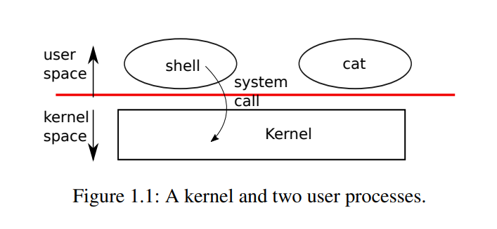

- 进程 fork()

  - wait函数使用. 

    - NULL在C中为(void*) 0, void\*可以直接转换成任意类型的指针, 可以满足这里的编译器检查。(int\*)0即表示将一个0转换成为int \*类型的指针，然后将其赋值给status。在status中其接受的也是一个int\*类型的指针，即status = 0，status这个指针对应的内存地址就为0了，即完成了NULL的使用
    - 任何类型的指针转换成为(void\*)也全部允许
    
    ```cpp
    // 函数原型
    int wait(int *status);
    // 后续这里可以使用NULL | 使用(int*)0表示目前并不会关心status的取值(即这个)
    pid = wait((int *) 0); 
    ```
    


## CPU 

### 中断

- 中断是系统用来响应硬件设备请求的一种机制，操作系统收到硬件的中断请求，会打断正在执行的进程，然后调用内核中的中断处理程序来响应请求。其会分成软中断与硬中断两种：
  - 不同的硬中断有不同的优先级，比如定时器中断优先级比较高，其要维持CPU的时间片调度，在执行中断的时候，CPU会保存当前的上下文然后跳转到中断处理程序，后执行完毕之后再回复之前程序的上下文


## 内存

- 虚拟内存: 这是一种操作系统层面的机制, 其与使用Java还是C++都没有关系。单片机上没有操作系统，其运行的程序是直接操作物理内存。

  - 单片机要想在内存中同时运行两个程序是不可能的。如果第一个程序在 2000 的位置写入一个新的值，将会擦掉第二个程序存放在相同位置上的所有内容，所以同时运行两个程序是根本行不通的。

  

  - 操作系统可以为每一个进程分配一套独立的虚拟内存，并且保证每个进程都不会去访问物理地址。**操作系统会提供一种机制，将不同进程的虚拟地址和不同内存的物理地址映射起来。**该机制主要是在MMU中实现的，其具体的实现逻辑是下面的**内存分段与内存分页**

    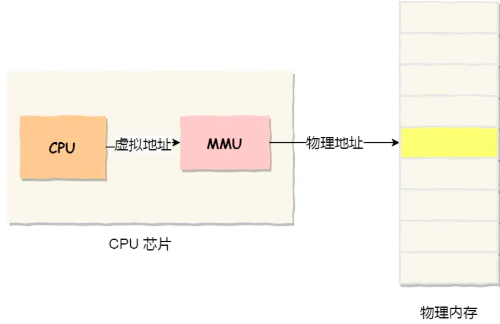

### 内存分段

- 程序是由若干个逻辑分段组成的，如可由代码分段、数据分段、栈段、堆段组成。**不同的段是有不同的属性的，所以就用分段（\*Segmentation\*）的形式把这些段分离出来**。

  - 段选择因子:  对应了一个段表中的描述符，获取段基地址以及段界限
  - 段内偏移量：在当前段基地址 + 段内偏移量，其只要没有超出段界限即可以找到其对应的物理内存

  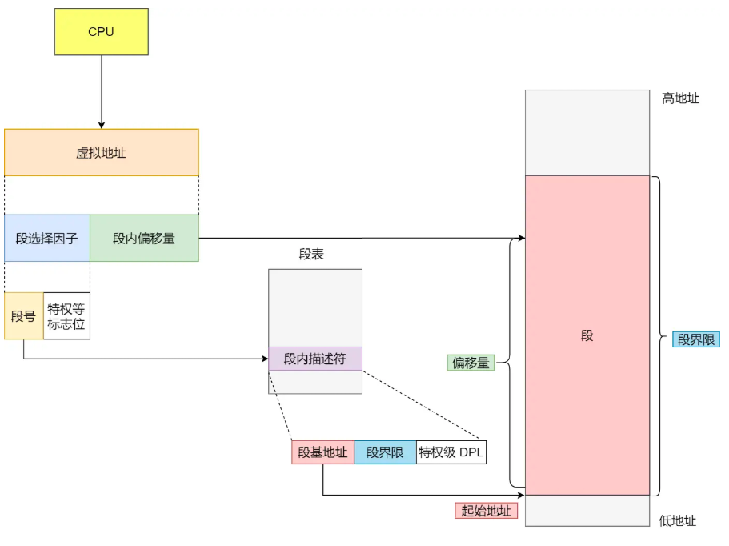

  - 分段机制会将虚拟地址分成四个段，每一个段都能在段表中有一项，在这一项中找到段的基地址，再补充上偏移量就能找到物理内存地址

  

- **内存分段问题：**

  - 内存分段要求的是段内连续但是段与段之间是可以不连续的。即对于一个进程来说，分配给其的内存是按照段分成了堆段、栈段、代码段、数据段等等。由于这种段之间可能不连续的情况，即容易出现外部内存碎片出现。

  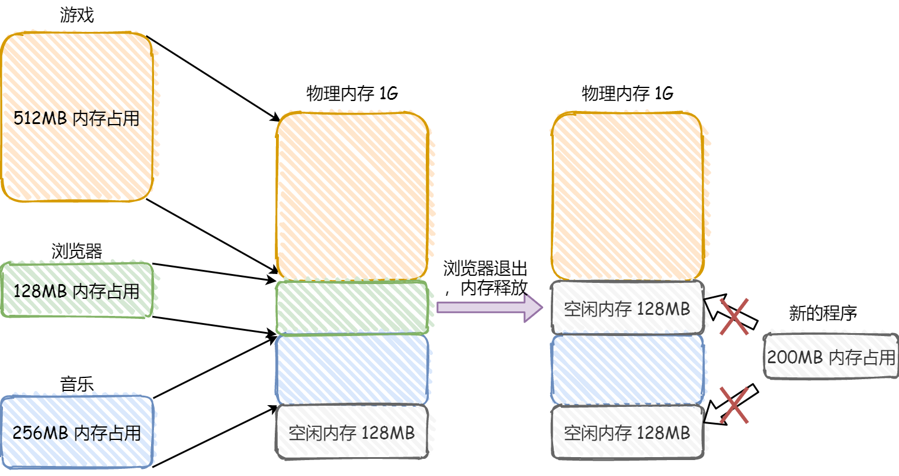

  - 内存碎片
    - 内部内存碎片: 是已经被分配出去（能明确指出属于哪个进程）却不能被利用的内存空间，占有这些区域或页面的进程并不使用这个存储块。而在进程占有这块存储块时，系统无法利用它。直到进程释放它，或进程结束时，系统才有可能利用这个存储块
    - 外部内存碎片: 是还没有被分配出去（不属于任何进程），但由于太小了无法分配给申请内存空间的新进程的内存空闲区域，这些存储块的总和可以满足当前申请的长度要求，但是由于它们的地址不连续或其他原因，使得系统无法满足当前申请
  - 内存交换
    - 其主要是为了解决**外部内存碎片**设计的方法，仍然按照上述的案例：
      - 可以把音乐程序占用的那 256MB 内存写到硬盘上，然后再从硬盘上读回来到内存里。不过再读回的时候，我们不能装载回原来的位置，而是紧紧跟着那已经被占用了的 512MB 内存后面。这样就能空缺出连续的 256MB 空间，于是新的 200MB 程序就可以装载进来，这个内存交换空间，在 Linux 系统里，也就是我们常看到的 Swap 空间，用于内存与硬盘的空间交换。
      - **其对应的问题就是效率低： **硬盘与内存数据交互是非常耗费时间的，访问硬盘慢。


### 内存分页

- 内存分页实际上将虚拟内存与物理内存进行分页，其通过页表进行对应。那么**在实际使用中，进程对应的物理内存页是可以不连续的，这样就避免了内存分段中段内存必须连续的限制，从而杜绝了外部内存碎片的问题**。页表实际上存储在 CPU 的**内存管理单元(MMU)** 中，于是 CPU 就可以直接通过 MMU，找出要实际要访问的物理内存地址。

  - 这样一个连续并且尺寸固定的内存空间，我们叫**页**,  其可以解决内存分段效率低的问题。


    - 在 Linux 下，每一页的大小为**4KB**


    - 类似与内存分段，虚拟地址与物理地址之间通过**页表**映射
    
      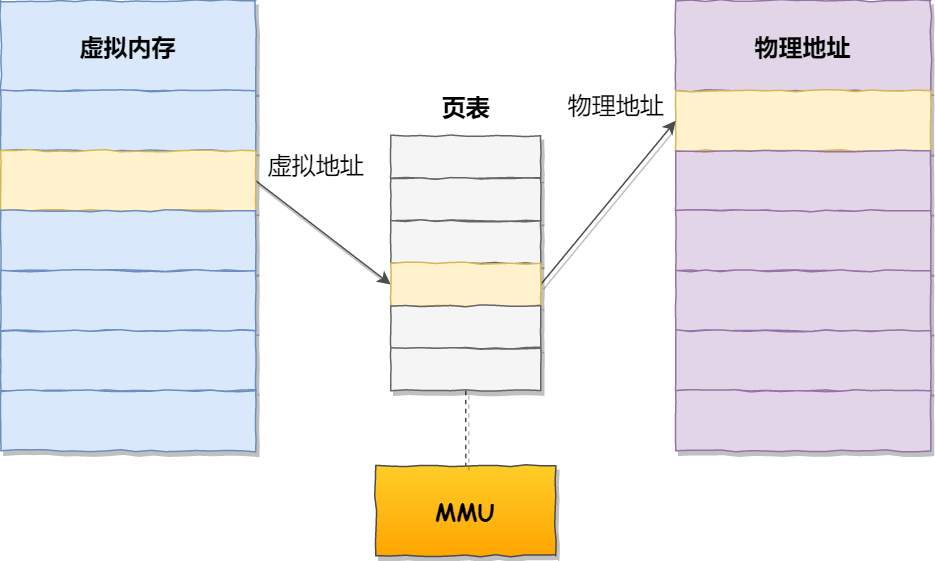


- 如果内存空间不够，操作系统会把其他正在运行的进程中的「最近没被使用」的内存页面**换出**（*Swap Out*）到硬盘上。一旦需要的时候，再加载进来，称为**换入**（*Swap In*）。所以，一次性写入磁盘的也只有少数的一个页或者几个页，不会花太多时间，**内存交换的效率就相对比较高。**

  

- **虚拟地址与物理地址对应关系: **

  - 虚拟地址中保存了一个页号与偏移量，这个基地址与页内偏移的组合就形成了物理内存地址。跟据虚拟页号可得到其对应的物理页号，最后加上偏移量就可以获取到物理内存地址

  

  - 上述分页表示的问题在于操作系统可以运行非常多的线程，这种操作最终导致了页表非常庞大！！

    - 32位系统表示其可以使用32位来表示地址，即1GB = 1024MB | 1MB = 1024KB | 1KB = 1024B，合并起来是1G = $2^{30}$B, 所以32位对应4GB

    

    - 其对应的解决方法即为多级页表, 即将32位对应的虚拟地址分成一级页号、二级页号以及页内偏移三者。一级页号即查找对应的**二级页表**地址，从二级页号查找对应物理页号，再补充上地址偏移即可以完成查找。

      - 因为物理页的每一页都要有其能直接对应的虚拟页，一级页表就能覆盖整个物理内存，后面观察虚拟内存地址中有多少一级内存页的部分才会创建其对应的二级内存页，二级内存页与物理内存页是完全的对应关系
      - **对于64位系统，其对应的这种内存分页的级数更多**

      

      

#### TLB

- 多级页表虽然解决了空间上的问题，但是虚拟地址到物理地址的转换就多了几道转换的工序，这显然就降低了这俩地址转换的速度，也就是带来了时间上的开销。

  - CPU 芯片中，加入了一个专门存放程序最常访问的页表项的 Cache，这个 Cache 就是 TLB，通常称为页表缓存、转址旁路缓存、快表等。

    


### 段页式内存管理

- 先将程序划分成为多个有逻辑意义的段，再将这个段划分成页。对于每一段都对应一个页表，读取其对应的页内位移找到其对应的物理地址。地址结构就由**段号、段内页号和页内位移**三部分组成。

  

## Linux 内存

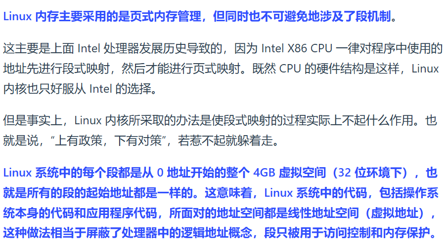

- 这里我的理解是这里将所有的段都定义在0~4GB的虚拟空间中，段的概念在这里只进行一些内存上的保护(还不是很清楚)

- 交换空间：是硬盘上的区域而不是内存上的区域，其是一种硬盘上的特殊空间，用于扩展系统的虚拟内存，当系统的物理内存(RAM)到达最大容量之后，linux会利用交换空间来保存那些暂时不活跃的进程，从而为其他进程腾出物理内存


### 内核空间和用户空间

- 进程在用户态时，只能访问用户空间内存 | 只有进入内核态后，才可以访问内核空间的内存；

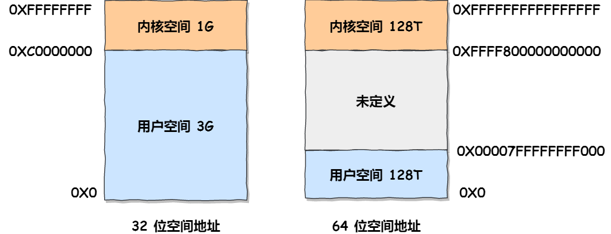

- 补充：用户在用户态其执行的代码会收到CPU检查，其只能访问用户态中能访问页面的虚拟地址。这些多进程实际上会映射到同一块物理内存，因为内核需要统一管理系统资源(设备驱动等等)，是不需要单独拷贝给多个进程。

  - **并且区分用户态以及内核态本质上是为了提升整个系统的稳定性！！！**

  

- 在用户空间中，其对应的数据可以表示为

  

- **注意：对于多进程环境而言，进程之间的内存地址不受影响，相互隔离，故操作系统可以为每个线程分配一套虚拟内存地址空间**

- 假设当前是一个32位的系统，其对应的虚拟内存大小是4GB, 那么在用户空间中的3GB空间中，堆是由程序员自行申请的，大小基本可以在2GB左右，栈的默认大小在8MB，当然栈的空间也可以在Linux中修改

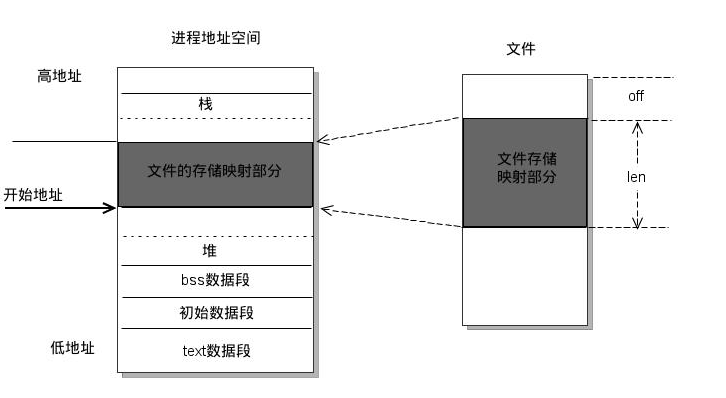

#### 用户态与内核态

- 用户态与内核态是对应着操作系统中的两种运行模式，其对应的权限不一样。应用程序执行在用户态，操作系统内核执行在内核态。**这种操作主要是为了保证安全，即应用程序的崩溃不会导致整个操作系统的崩溃**

  - 用户态：应用程序在用户态运行，权限低，不能直接访问硬件或者进行特权操作

  - 内核态：内核态是操作系统内核运行的模式，具有最高权限，可以直接访问硬件资源以及执行各种特权操作(**内存管理、进程调度**)

  - 用户态/内核态切换：

    - 切换时机：用户态可以通过系统调用/异常/硬件中断转换到内核态

    - 切换的过程为如下图。对于普通的线程以及进程来说，其的切换过程都存在用户态与内核态之前的转换，因为其都会涉及到一些寄存器等信息的转换，只有协程不需要，故其操作会比线程更加适合并发线程。

      - 切换的内部逻辑会涉及到用户栈与内核栈的转换逻辑，每一个进程都包含了一个用户栈与内核栈。当应用程序运行在用户态的时候，就会使用用户栈，当应用程序运行在内核态的时候，就会使用内核栈。

      


## 内存回收

- 在物理内存不够的情况下，会存在物理内存换出操作。但是同时操作系统也存在着内存回收机制，来保证内存足够使用（**个人理解换入换出操作本质上就是在内存回收机制中的一部分，其中的匿名页可以直接换到swap部分中**）
  - **后台内存回收: ** 在物理内存紧张的时候，会唤醒 kswapd内核线程来回收内存。这个回收内存的过程**异步**的，不会阻塞进程的执行
  - **直接内存回收**（direct reclaim）：如果后台异步回收跟不上进程内存申请的速度，就会开始直接回收，这个回收内存的过程是**同步**的，会阻塞进程的执行。
  - OOM: 上述的内存回收还无法满足持此物理内存的申请，即执行OOM过程。OOM Killer 机制会根据算法选择一个占用物理内存较高的进程，然后将其杀死，以便释放内存资源，如果物理内存依然不足，OOM Killer 会继续杀死占用物理内存较高的进程，直到释放足够的内存。
    - OOM方法中会为每一个进程有一个分数值，对于那些非常重要的进程，可以调整这里的得分来保证这些进程不会被OOM杀死
- 可回收的内存：
  - 文件页: 内核缓存的磁盘数据（Buffer）和内核缓存的文件数据（Cache）都叫作文件页
    - 干净页:  如果这些数据没有被进程修改，即可以直接释放，有需要再重新读取
    - 脏页: 有部分数据被进程修改，需要先将其拷贝一份到磁盘中，然后才能释放这部分内存
  - 匿名页: 这部分内存没有实际载体，不像文件缓存有硬盘文件这样一个载体，比如堆、栈数据等，这部分内存很可能还要再次被访问，所以不能直接释放内存，它们**回收的方式是通过 Linux 的 Swap 机制**，Swap 会把不常访问的内存先写到磁盘中，然后释放这些内存，给其他更需要的进程使用。再次访问这些内存时，重新从磁盘读入内存就可以了。
- 回收方法 —— LRU算法，其实际上维护着 active 和 inactive 两个双向链表，越接近链表尾部，就表示内存页越不常访问，回收的时间就优先回收不活跃内存。
  - **active_list** 活跃内存页链表，这里存放的是最近被访问过（活跃）的内存页
  - **inactive_list** 不活跃内存页链表，这里存放的是很少被访问（非活跃）的内存页


## 页面置换


- 如果出现缺页异常并且没有找到多余的空闲页，即需要将物理内存中页换入到磁盘中，节约出的空闲页用于执行对应的指令。如果想使得换入换出的次数尽可能地少，存在如下几种页面置换方法:

  - 最佳页面置换

    - 分析未来谁最长时间不被访问，这种方法很理想，基本不会被实现

  - 先进先出置换

    - 谁先来谁先被换出去

  - 最近最久未使用置换 (LRU):

    - 跟据历史计算一个最近最久没有被访问的页面，依据是时间。LRU的消耗比较大

  - 时钟页面置换

    - 把所有的页面都保存在一个类似钟面的「环形链表」中，一个表针指向最老的页面。如果最近访问，则访问位为1，如果当前内存已经满了，并且还是新来的页，当前这个环形链表中的所有页访问位都是1，其类似于时钟指针移动的过程，如果当前页访问位是1，修改成0继续往前走。如果找到一个0，那么就直接将新页替换到这一页处。

      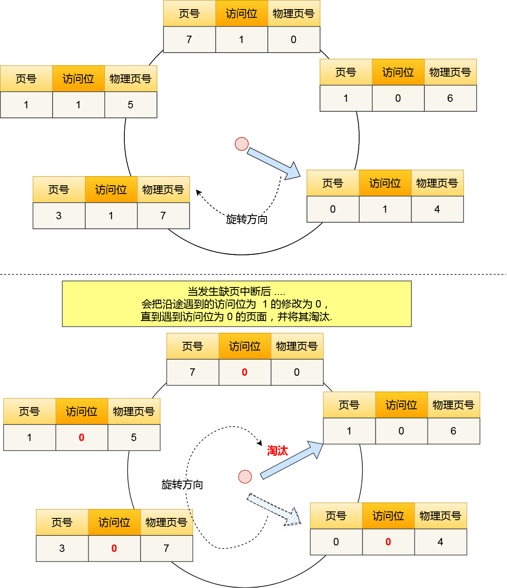

  - 最不常用算法

    - 跟据历史计算一个访问频率最低没有的页面，依据是频率


## 补充

- 为什么需要虚拟内存

  - 首先虚拟内存是一个与系统位数有关的量，32位就对应4GB，其与实际物理内存无关。但对于一个进程而言，其直接相关的部分应该是虚拟内存，所以我认为**一个进程对应的虚拟内存不应该比实际运行该进程需要的内存数小(确实是这样，32位对应的内存空间最大就是4GB，换入换出针对的是物理内存不够的情况，不是虚拟内存不够的情况)**
  - 如果物理内存小于实际运行进程所需要的内存，操作系统会选择一些最近没有被使用的页面(也就是实际物理内存对应的部分)，将其数据换入到磁盘中（这时是会修改页表中的数据的）。当后续访问这个被换出部分对应的虚拟地址的时候，会触发**缺页中断**，操作系统从磁盘重新加载数据到物理内存，并更新页表数据，指向新的物理内存。
  - 如果当前处理的虚拟地址(其实就是虚拟内存)在页表中没有查询到，系统会产生一个**缺页异常(即一个中断操作)**，进入系统内核空间分配物理内存、更新进程页表，最后继续执行这个进程。

  

  

- malloc申请内存，实际上其申请的是虚拟内存，如果当前这个虚拟内存没有对应的物理内存，就触发缺页中断，如果有空闲内存则直接分配内存，如果没有就开始回收内存。


## 线程与进程

- 进程与线程实际上都是可以**并发执行的**，但是在实际使用中两者还是存在一定的区别
  - 进程：是程序的一次**动态执行实例**，拥有独立的**内存空间**和系统资源（如文件句柄、CPU 时间片等），操作系统以**进程**为单位分配资源（内存、CPU等），进程之间相互隔离，互不干扰。
    - 一般直接执行的main()函数是一个进程(简单程序, 不涉及手动开启子进程)，网页上多网页实际上也可以简单认为是一种多进程(因为多个网页上的内容互不影响，一个网页崩溃其他网页仍然正常)
  - 线程：是**进程内的一个执行单元**。一个进程可以包含多个线程，这些线程**共享进程的资源**（如内存、文件等），但每个线程有独立的**执行栈**和程序计数器。

- 并发与并行
  - 一般来讲，目前将并发与并行都称之为并发。如果要进行区分 
    - 并发可以认为多个任务交替使用处理器 
    - 并行是这些任务可以同时在处理器中同时执行 (**即该设备是一个多处理器设备**)


- 多线程/多进程

  - 多进程与多线程状态下，堆与栈内存是否可以被共享。

    - 对于多进程，默认内存是独立的即堆栈都是独立的，但是可以通过IPC显式进行**内存的共享**，栈内存是互相独立的

    - 对于多线程，栈内存也是独立的，但是对于堆内存而言，其可以直接被所有线程访问。

      - **对于多线程，所有线程共享一块堆内存，就算是能在每一个线程中使用new开辟一块堆内存，但是其只能是在逻辑上属于这个线程，本质上开辟的堆内存还是多线程中共有的数据。当然也可以使用TLS技术实现堆内存的“逻辑私有“**

      ```cpp
      #include <thread>
      int* ptr = new int(0); // 堆内存
      void unsafe_increment() {
          for (int i = 0; i < 1000; ++i) {
              (*ptr)++; // 多线程同时修改同一块堆内存，导致未定义行为
          }
      }
      
      int main() {
          std::thread t1(unsafe_increment);
          std::thread t2(unsafe_increment);
          t1.join();
          t2.join();
          delete ptr;
          return 0;
      }
      ```

  - 切换以及安全性

    - 每个进程都有自己独立内存空间，所以其创建与销毁都比较耗费时间，切换也比较耗费时间。线程共享内存空间，创建与销毁线程的开销比较小，切换时间开销也小。
    - **一个进程崩溃不会影响其他进程，一个线程崩溃会影响整个进程的稳定性**


## 进程

- 进程状态有如下三种: 运行 就绪 等待(阻塞) ,还有两种基本状态 (1) 创建状态 (2) 结束状态 

  

  - 对于大量阻塞线程同时出现的情况，其可能导致物理内存空间被大量占用的情况。解决这种情况就可以将阻塞状态的物理内存空间换出到硬盘，等需要再次运行的时候，再从硬盘换入到物理内存。这种进程状态即可以称为**挂起状态**

    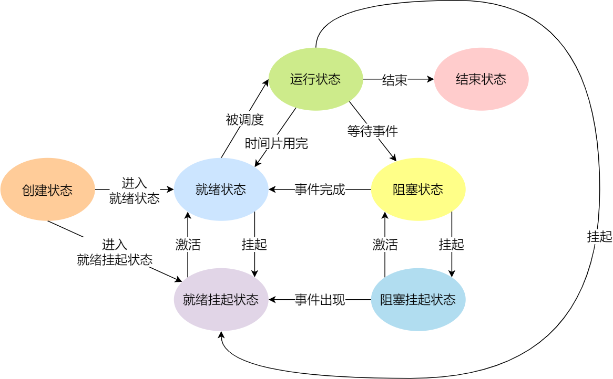

### 进程控制结构

- 操作系统中使用**进程控制块(PCB)**这种数据结构来描述进程。PCB作为进程存在的唯一标识, 其可以包含:

  - 寄存器主要包含 (1) 通用寄存器 —— 用于保留进程运行的中间结果 (2) 程序计数器 —— 记录下一条执行指令的地址等等寄存器

  

  - PCB的组织结构

    - pcb通常是直接使用链表的方式进行组织，把具有相同状态的进程链接在一起，组成各种队列。
      - 就绪队列/阻塞队列 : 所有处于就绪状态的进程链表/所有处于阻塞状态的队列

    

    - **进程创建，销毁等调度导致进程状态发生变化，所以链表能够更加灵活的插入和删除**

- 进程上下文切换：**这里进程上下文切换中，一般会将需要交换的数据保存在进程的PCB中，运行另一个线程就需要在这个进程对应的PCB取出来对应的CPU上下文然后继续执行这个线程**

  

### 进程通信

- 进程中的用户空间是独有的，内核空间是每个进程共享的，故进程之间的通讯必须通过内核。其对应的进程通讯方法有多种：

  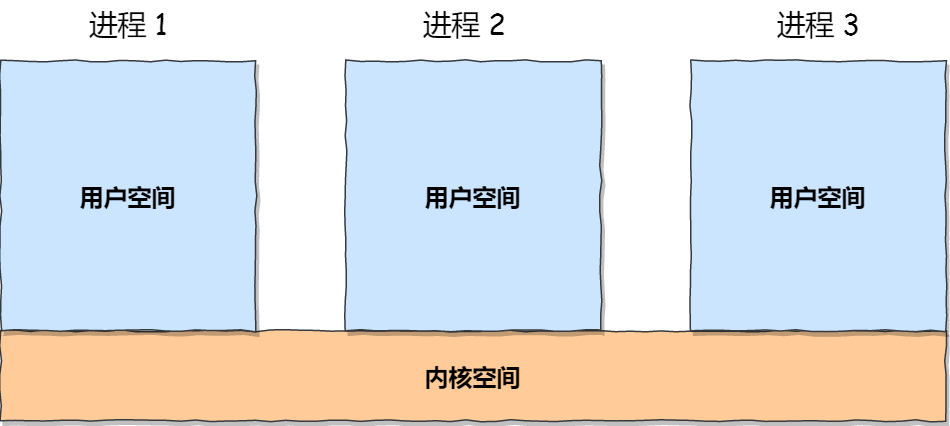

  - 管道: 传递数据是单向的，可分为匿名管道以及命名管道。匿名管道是特殊的文件，只保存在内存中，不存在文件系统中。

    - 在创建子进程的时候，子进程会复制父进程的**文件描述符**，就可以实现两个进程中各有一个写端以及读端。管道只能从一端写入一端读出，所以一般来说父进程关闭读取，子进程关闭写入。

    - **匿名管道与命名管道之间的区别就是在于匿名管道只能在有关系的进程中使用 (相当于子进程继承父进程的文件描述符，从而实现利用管道在进程中通信)**。命名管道可以在不相关的进程之间互相通讯。

    - 不管是匿名管道还是命名管道，进程写入的数据都是缓存在内核中，另一个进程读取数据时候自然也是从内核中获取，同时通信数据都遵循**先进先出**原则。

      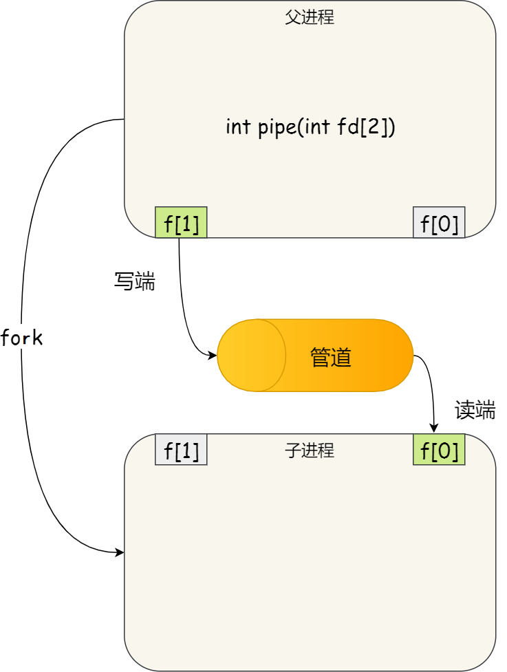

  - 消息队列

    - **消息队列是保存在内核中的消息链表**，在发送数据时，会分成一个一个独立的数据单元，也就是消息体（数据块）。如果进程从消息队列中读取了消息体，内核就会把这个消息体删除。

    - **消息队列不适合比较大数据的传输**，因为在内核中每个消息体都有一个最大长度的限制，同时所有队列所包含的全部消息体的总长度也是有上限。

    - **消息队列通信过程中，存在用户态与内核态之间的数据拷贝开销**，因为进程写入数据到内核中的消息队列时，会发生从用户态拷贝数据到内核态的过程，同理另一进程读取内核中的消息数据时，会发生从内核态拷贝数据到用户态的过程。

  - 共享内存

    - 共享内存，即利用虚拟内存中的一块空间，将其映射到相同的物理内存中。这样该进程中写入的东西，另外一个进程立刻就观察到了，都不需要进行拷贝进行数据交互。

      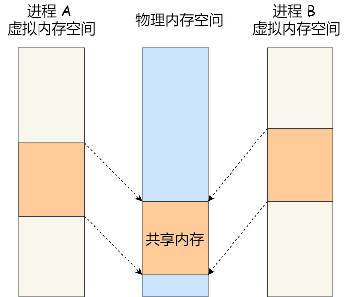

  - 信号量

    - 共享内存的问题在于如果两个进程同时写入一个地址，会出现安全上的问题！为了防止多进程竞争共享资源，就需要使用**信号量**实现保护机制。

    - 控制信号量主要是两种原子操作P以及V操作，两者是成对出现的。写操作之前进行P操作，结束的时候进行V操作。其可以保证共享内存在任何一个时刻只有一个进程进行访问，即完成共享内存的保护

      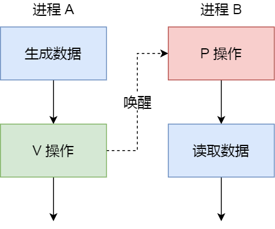

  - 信号

    - 在异常情况下工作模式，就需要用信号的方式来通知进程。比如使用键盘上的ctrl+alt+C来杀死进程。**信号是进程间通信机制中的唯一的异步通讯机制**。所谓"异步"就是信号由内核主动向进程发送，其不依赖于接收进程的状态。

  - Socket (套接字)

    - **跨网络与不同主机**上的进程进行通讯，或者在同主机上的进程进行通讯，都可以使用socket.


### 线程开辟

- 一个进程能开辟的线程数是有限的，一个比较粗犷的方法就是一个线程对应的栈内存为8M, 对于一个32位系统，用户空间为3G，那么其可以分配的栈内存即可以认为是 3G/8M = 384.
  - 用户空间对应的内存段就可以直接保存线程开辟的栈数据。


### 进程调度

- 进程调度也成为CPU的调度算法，当 CPU 空闲时，操作系统就选择内存中的某个「就绪状态」的进程，并给其分配 CPU。

  - 时间片: 即CPU分配给各个进程的时间。一种进程调度算法即**时间片轮转调度算法**。每个进程被分配一个时间段，称作它 的时间片，即该进程允许运行的时间。如果在时间片结束时进程还在运行，则CPU将被剥夺并分配给另一个进程。如果进程在时间片结束前阻塞或结束，则CPU 当即进行切换。调度程序所要做的就是维护一张就绪进程列表，当进程用完它的时间片后，它被移到队列的末尾

    - 进程切换需要更新寄存器、表格队列等等数据，所以时间片设得太短会导致过多的进程切换，降低了CPU效率；而设得太长又可能引起对短的交互请求的响应变差。

  - **先来先服务**

    - 即谁先来运行，后来的不会抢占之前的进程

  - **最短作业优先** 

    - 有限处理短时间任务，其可能导致长时间进程的"饿死"，即短时间的任务一直在被优先执行，但是对于长时间的进程任务却一直没有执行

  - **高响应比优先**

    - 一种理想方法，主要是权衡需要的服务时间以及等待时间。

      

  - **最高优先级**

    - 可以是静态决定优先级，也可以是动态决定优先级。静态即创建的时候就确定好的优先级，动态即优先级随着等待时间的增加优先级变高

  - **多级反馈队列调度**

    - 时间片轮转算法和优先级算法的综合和发展。新进程来的时候进入优先级最高的队列中执行任务，如果在其对应的时间中没有执行完毕，其直接进入队列2中重新排队。以此类推，虽然一个进程的等待时间变成了，但是其对应的处理时间也变长了，最终实现平衡。

      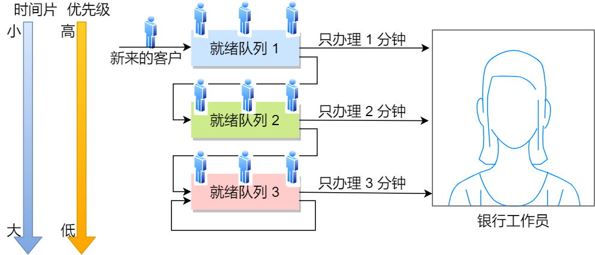

  

  

### 进程同步/互斥

- 进程同步是指多个并发执⾏的进程之间协调和管理它们的执行顺序。由于进程在执行时是异步执行的，但有时候我们需要多个进程按照一定的顺序来执行，如使用管道通信，只有写进程开始之后才能指向读进程。
- 互斥主要是避免多进程同时访问相同的资源。

#### 实现方法

- 信号量 - 即可以实现互斥又可以实现同步

  - 互斥：  s初始值定义为1，后执行PV操作即可
    - P操作 先执行s-1操作，如果s<0则阻塞当前进程/线程
    - V操作 先执行s+1操作，如果s<=0则唤醒一个进程/线程工作


  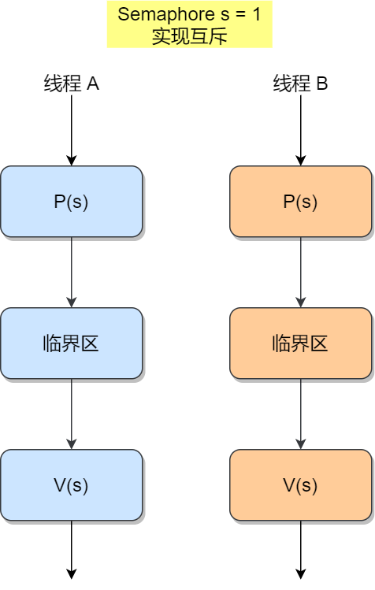

  - 同步：需要定义两个信号量，进行同步处理 (具体实现比较复杂)

    - 一个典型的信号量实现案列就是**生产者-消费者问题**，既需要实现进程的同步 (只有生产者生产完数据之后，在消费者进程才能读取这部分数据)，同时其也是一种互斥操作，即消费者生产者不能同时去操作缓冲区。
      - 参考链接: https://xiaolincoding.com/os/4_process/multithread_sync.html#%E4%BA%92%E6%96%A5%E4%B8%8E%E5%90%8C%E6%AD%A5%E7%9A%84%E5%AE%9E%E7%8E%B0%E5%92%8C%E4%BD%BF%E7%94%A8


    
    
    - 另外一个经典案例就是哲学家吃饭问题 - 如果直接使用信号量PV操作会导致死锁的问题出现 
    
      - 限定条件为只有哲学家同时拿起两边的叉子才能吃饭，如果直接使用信号量PV，会出现哲学家如果同时拿起左边叉子之后，在拿起右侧叉子时所有的P都小于0，则线程全部被堵塞，即导致死锁问题。


​        

    - 另一个经典案例就是读者-写者问题 ：其主要是分为三种操作 (具体解决方法没有准备)
    
      - 读-读 其可以多线程同时处理
      - 读-写 其是互斥操作
      - 写-写 其也是互斥操作

- 互斥锁 (其在多线程以及多进程中均可以使用)

- 条件变量：其主要与互斥锁一起使用来实现同步。个人理解就是当条件变量不满足时，线程/进程会进入等待状态，并且释放自己的互斥锁，直到条件满足之后恢复，继续获取互斥锁执行。


### 死锁

- 互斥锁应用不当，导致线程互相等待对方释放锁，在没有外界干扰的情况下，线程一直互相等待，没有办法继续运行。但死锁需要满足下面四个条件才会发生：

  - 互斥条件：多个线程不能同时使用同一个资源

  - 持有并等待条件：A线程在占用资源后，B线程如果也想使用这部分资源，需要等待A的释放之后，才能使用这部分资源

  - 不可剥夺条件：A线程占用资源时，这部分资源在自己使用完之前不能被其他线程获取

  - 环路等待条件：即A线程占用资源1, 等待资源2； B线程占用资源2，等待资源1，这就形成了资源请求等待的环形图。

    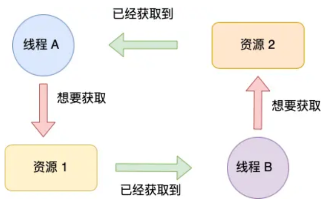

- 对应的解决方法最常见的就是解决环路等待，即AB线程都先去占用资源1，两者中只有一个能进行下一步的执行。**破坏这四个条件实际上是死锁问题的解决方法。**另外的解决方法就是**超时机制** 线程在指定时间内未能获得锁，或持有锁超过允许时间，系统会强制释放资源，避免无限等待。

  ```cpp
  #include <iostream>
  #include <thread>
  #include <mutex>
  #include <chrono>
  
  std::timed_mutex mtx;
  
  void worker(int id) {
      // 尝试获取锁，最多等待 1 秒
      if (mtx.try_lock_for(std::chrono::seconds(1))) {
          std::cout << "Thread " << id << " 成功获取锁\n";
          std::this_thread::sleep_for(std::chrono::seconds(2)); // 模拟耗时操作
          mtx.unlock(); // 手动释放锁
      } else {
          std::cout << "Thread " << id << " 获取锁超时，放弃操作\n";
      }
  }
  
  int main() {
      std::thread t1(worker, 1);
      std::thread t2(worker, 2);
      t1.join();
      t2.join();
      return 0;
  }
  ```

- PS: 线程使用互斥锁时忘记释放锁可能会间接导致死锁，死锁问题要满足以上四个条件。**面试的时候碰到了面试官让手写一种死锁的情况，这里进行代码部分的补充。** 忘记释放锁的这种情况一定不是面试官想看到的部分！！！

  - 关于头文件的使用主要是 <mutex>(对应着锁的头文件)， <thread>(对应着线程的使用)。mutex即互斥锁，为了避免忘记释放锁可以直接使用lock_guard<mutex>声明一个对象，这个对象的生命周期就是锁的占用时间。
  - **线程开辟：**std::thread t1(function_1, std::ref(log)); 这里是需要使用这个类对象的函数，所以这里不仅要给函数名称，还需要指定上对象的引用。
    - 线程开辟是需要一定时间的，所以这里会先执行主线程后面的代码，当然这里也可以让主线程等待一段时间之后才继续执行，即std::this_thread::sleep_for(std::chrono::milliseconds(10))。

  - **线程结束：**对应 join() 与 detech()
    - join() 主线程等待子线程执行完毕，即子线程可以直接使用主线程中的变量，不用担心主线程结束导致子线程不能使用

    - detech() 子线程与主线程没有关系，主线程自己执行完就结束掉自己的变量等等，子线程这时候绝不能使用主线程的数据，很有可能出现未定义的情况

  - **结束死锁：**结束死锁需要修改的是两个线程中对应函数的锁的抢占顺序。

  ```cpp
  #include <iostream>
  #include <thread>
  #include <string>
  #include <mutex>
  #include <fstream>
  using namespace std;
  
  class LogFile {
  public:
      LogFile() {
          f.open("log.txt");
      }
      ~LogFile() {
          f.close();
      }
      void shared_print(string msg, int id) {
          std::lock_guard<std::mutex> guard(_mu);
          std::lock_guard<std::mutex> guard2(_mu2);
          f << msg << id << endl;
          cout << msg << id << endl;
      }
      void shared_print2(string msg, int id) {
          std::lock_guard<std::mutex> guard(_mu2);
          std::lock_guard<std::mutex> guard2(_mu);
          f << msg << id << endl;
          cout << msg << id << endl;
      }
  
  private:
      std::mutex _mu;
      std::mutex _mu2;
      ofstream f;
  };
  
  void function_1(LogFile& log) {
      for(int i=0; i>-3000; i--)
          log.shared_print2(string("From t1: "), i);
  }
  
  int main()
  {
      LogFile log;
      std::thread t1(function_1, std::ref(log));
  //    std::this_thread::sleep_for(std::chrono::milliseconds(10));
  
      for(int i=0; i<3000; i++)
          log.shared_print(string("From main: "), i);
  
  
  
      // note join()作用是main线程等待子线程
      t1.join();
      system("pause");
      return 0;
  }
  ```

  - 一个不太好的死锁案例即忘记释放锁，虽然确实导致了死锁的出现... | 注意锁的状态与线程无关，线程结束之后不关锁一样会出现问题。

  ```cpp
  #include <iostream>
  #include <vector>
  #include <mutex>
  #include <thread>
  using namespace std;
  
  mutex a;
  void A()
  {
      a.lock();
      cout <<"A working"<< endl;
  
  }
  
  void B()
  {
      a.lock();
      cout <<"B working"<< endl;
      a.unlock();
  }
  
  // note 互斥锁的状态是独立于线程之外的, 即线程终止时如果没有释放锁, 行为时未定义的 - 通常表现为会导致其他线程的一个永久堵塞
  int main()
  {
      thread t1(A);
      thread t2(B);
      t1.join();
      t2.join();
      cout <<"Ending"<< endl;
      system("pause");
      return 0;
  }
  ```

  

## 线程

- 同一个进程内多个线程之间可以共享代码段、数据段、打开的文件等资源，**但是其有独立的寄存器以及栈，其可以确保线程是独立运行的**.
  - PS：我个人的理解就是程序执行就是需要寄存器保留一些中间结果或者是下一步需要执行的函数语句，栈内存其是每一个线程独有的部分

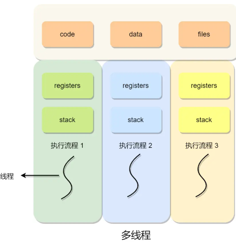

- 线程同样具有就绪、阻塞、执行三种基本状态，同样具有状态之间的转换关系 
- 线程创建/终止/切换都要更快, 同一个进程中的线程切换，该进程对应的虚拟内存这些资源都是共享的，只需要切换线程的寄存器数据等私有数据，相比进程切换其开销要小很多


### 线程通信

- 虽然这里说是在进行线程的通信，但是线程的通信实际上是为了实现线程同步, 其对应的常见方法主要是
  - 互斥锁 + 条件变量 
    - 条件变量可以将一个/多个线程在等待条件变量时保持阻塞状态(睡眠 此时不占用CPU资源), 当其他线程对条件变量发出信号时, 这些等待对应条件变量的线程就会被唤醒.
  - 信号量(还是PV操作)


### 锁类型

- 互斥/读写/悲观/乐观

  - 关于自旋锁与互斥锁，其在使用上是类似的，但两者的实现逻辑完全不同。两者都能保证只有一个线程能访问对应的资源，保证了一种互斥操作。
    - 自旋锁：当一个线程执行的时候发现资源被另外一个线程占用了，该线程直接进入忙等待状态，即不释放自己的CPU资源，不断地循环查询锁是否被释放。其一般用于**临界区代码执行时间极短的情况(临界区即这段能访问共享资源的代码块)**，线程的上下文切换时间要比线程持有锁的时间要更长才会使用自旋锁。
    - 互斥锁：当一个线程执行的时候发现资源被另外一个线程占用了，CPU会直接进行线程切换(即发生了上下文切换)，直到另外的线程释放资源之后才会去执行当前线程。


## 协程

- 协程相当于是用户态的线程（其对应的切换再只会在用户态切换，非常简洁）。因为对线程以及进程而言，切换线程与进程都会涉及到用户态与内核态的切换。
  - **协程并没有增加线程数量，只是在线程的基础之上通过分时复用的方式运行多个协程**，而且协程的切换在用户态完成，切换的代价比线程从用户态到内核态的代价小很多


## IO

- IO本身就是一种输入输出操作，比如磁盘IO就是指将数据从磁盘中输入到内存中或者从内存输出到磁盘中。常见的IO模型包括同步/异步IO，阻塞/非阻塞IO等等

- 在操作系统中实际上就是一种数据的迁移过程，其包含IO调用与IO执行 

  - IO调用：应用程序进程向操作系统内核发起调用

  - IO执行：操作系统内核完成IO操作

  - 操作系统完成IO操作还分为两个阶段 :准备数据阶段以及拷贝数据阶段

    - 准备数据阶段： 内核等待IO设备准备好数据，数据是进入到内核缓冲区

    - 拷贝数据阶段：数据从内核缓冲区拷贝到用于进程缓冲区

      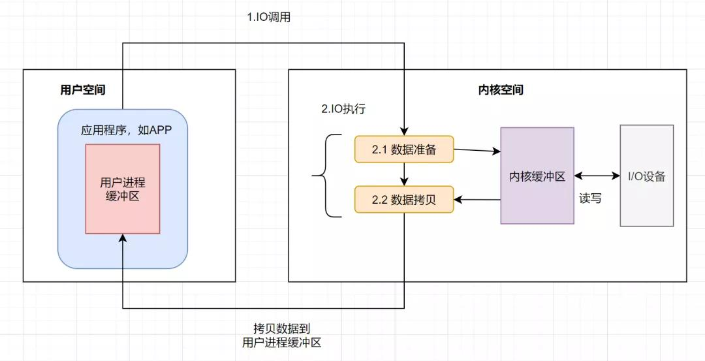

  

  ### 常见IO

  - 阻塞/非阻塞IO，同步/异步IO

    - 对于阻塞/非阻塞IO来说，其指的是发生IO调用之后，线程是否会被阻塞。非阻塞IO会通过轮询的方式来确定数据是否已经准备好。

    - 对于同步/异步IO来说，其指的是内核缓冲区中的数据拷贝到用户缓冲区的过程中是否需要等待这个拷贝完成。异步IO是不需要等待这个拷贝过程完成的。

      

      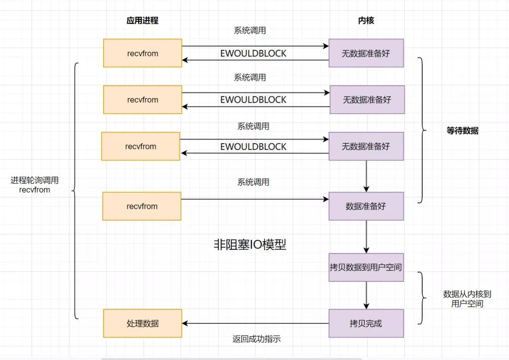

  

  - 多路复用IO(select/epoll) :  其也是一种非阻塞式IO的方法，其本质上是一种同步IO

    - **首先解释文件描述符FD的作用: ** 文件描述符是一种用于标识与管理进程打开资源的“句柄”。其在打开资源时生成，数据就绪之后内核就可以通过FD状态变换通知进程可以执行IO操作。

    - 多路复用I/O是一种允许单个线程或进程同时监视多个文件描述符（FD）的机制，当其中任意一个FD就绪（可读、可写或异常）时，程序便能进行进行相应的操作（事件驱动），主要的实现手段是select与epoll

      - select只能水平触发。简要描述一下select的实现逻辑
        - (1) 用户进程对应的PCB数据中是保留了一个对应的文件描述符FD集合，每次查询的时候都需要将文件描述符集合从用户空间拷贝到内核空间中 
        - (2) 内核遍历FD集合，检查是否有事件产生 —— 有事件产生则整个文件描述符集合都需要从内核拷贝到用户进程中 
        - (3) 用户进程再遍历这个集合去确定找到可读或者可写的文件描述符
        - 但是select的最大文件描述符集合是1024大小，即其使用的是一个固定大小的线程数据来维护文件描述符，poll本质上与select没有区别，只不过其使用了一个链表来维护文件描述符

      - epoll的两种工作模式 : 水平触发以及边缘触发。其实现逻辑简单，其会在内核中维护一个红黑树(只需要最开始的时候注册一次)，并将检测到状态变化的FD数据组成链表给用户进程
        - 水平触发：只要FD处于就绪的状态，epoll_wait()每次都会通知用户，如果这次没有处理完数据，之后下次epoll_wait还会继续通知
        - 边缘触发：只会在FD状态变换的时候通知，只会通知一次，所以程序要一次性处理完所有的数据。但这种不会重复通知，效率比较高

      


## 常见问题

- 每一次IO都会涉及到用户态与内核态的转换(因为操作硬件资源必须是内核态)，那么频繁使用IO就会导致较大的开销，因为用户态与内核态转换也是一种上下文切换，对应的解决方案就是使用缓冲区，将多次的小操作合并到一次大操作进行，避免频繁切换。

  - 用户进程缓冲区
  - 内核进程缓冲区

- 减小锁的使用为什么可以减小上下文切换的频率

  - 首先锁的使用本身是不会导致上下文切换的，但是对于一个线程A如果其先获取到了锁，那么B线程想使用该锁的时候（A未释放）会导致B线程进入到了一种阻塞状态，其对应的CPU、内存等等资源就需要被回收或者保存，换另外的线程来执行，这个换的操作就会导致上下文切换。解决方法就是使用无锁结构或者自旋锁、乐观锁来处理。

- CPU负载以及CPU使用率

  - 使用率对应的主要是时间，负载主要对应的是任务

  

  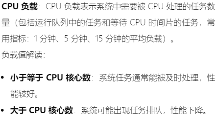

- 物理地址与逻辑地址

  - 物理就是实际对应的物理内存上的地址
  - 逻辑就是实际对应的虚拟内存上的地址，即虚拟地址

- CFS 全公平调度器

  - 每一个进程按照其优先级占用CPU，尽可能公平地分配CPU资源。优先级是按照虚拟运行时间来衡量每个任务的CPU时间，越低优先级越高。内部使用的是一个红黑树逻辑。


## eBPF 

- 补充eBPF技术的介绍，其是Linux中一种无需重启内核即可以插入代码的技术，主要用于网络监控、性能调优等场景


## 内存池

- 内存池是解决在堆中频繁的创建以及释放内存时导致的堆内存碎片化问题，属于是虚拟内存的碎片化问题；对于实际物理内存的外部碎片化，主要是使用页表方法来解决。
  - 操作系统本身一般不会直接管理堆内存碎片，堆内存在C++中是直接使用new/delete进行分配/销毁，其背后会对应一个分配器（如 ptmalloc、jemalloc、TCMalloc等等）。分配器自己会合并空闲块来减少堆内存碎片


线程池可以看看这部分的内容

https://zhuanlan.zhihu.com/p/367309864

https://github.com/ChunelFeng/CGraph

配套的阅读部分 

https://mp.weixin.qq.com/s?__biz=MzIxNjA5ODQ0OQ==&mid=2654703194&idx=1&sn=5b411b7d8a3a552e41a6a5a97fa4eeec&scene=21#wechat_redirect

常见的C++并行计算库

openmp | tbb


## 线程池

- 线程池即提前开辟线程，避免实际使用中频繁创建以及销毁线程带来的性能损耗。

### 实现

- 单一任务队列 + 多线程实现

  - 多个线程都需要去抢占任务队列的锁，从而去获取任务，其是一种one-by-one的逻辑，即所有的空闲线程都会去抢占这个锁，但只有一个线程能拿到锁后去读取任务，其他空闲线程需要在锁释放之后继续去抢占锁资源，这种争抢过程会导致性能损失

    

  - 常见实现会利用 future + async

    - async 开启一个异步任务并在支持之后在某个时刻获取结果。返回对象为future类型，在需要获取结果的部分调用get()，其会阻塞当前线程等待异步结果的返回

      ```cpp
      int slow_add(int a, int b) {
          std::this_thread::sleep_for(std::chrono::seconds(2)); // 模拟慢计算
          return a + b;
      }
      
      // 原型 std::future<返回类型> f = std::async(启动策略, 要执行的函数, 参数...);
      
      // std::launch::async 立刻创建一个新线程进行执行
      std::future<int> fut = std::async(std::launch::async, slow_add, 2, 3);
      
      // std::launch::deferred 直到调用get()的时候才会执行，不会立刻执行
      std::future<int> f = std::async(std::launch::deferred, square, 5); // 直到 .get() 才执行
      ```

    - future 就是async对应的返回值类型 future<T>


**简易实现线程池**：问题在于多个线程都需要去抢占任务队列的锁，从而去获取任务，其对应了一种one-by-one的逻辑，即所有的空闲线程都会去抢占这个锁，但只有一个线程能拿到锁后去读取任务，其他空闲线程需要在锁释放之后继续去抢占锁资源，这种争抢过程会导致性能损失。

- 一个线程拿到锁后，其他想执行lock()的线程会进入阻塞阶段等待锁的释放


简单线程池

```cpp
#include <iostream>
#include <vector>
#include <chrono>
#include <future>
#include <thread>
#include <queue>
#include <mutex>
#include <functional>

class threadPool
{
private:
    std::vector<std::thread> workers;
    std::deque<std::function<void()>> tasks;
    std::mutex m_mutex;
    std::condition_variable m_cv;
    bool stop;

public:
    // 只提供接口方便给任务队列放数据
    inline threadPool(int n) : stop(false)
    {
        // lambda表达式默认不会捕获this指针, 必须要进行显式捕获 —— 捕获得到的this指针(后续函数如果改变类的数据, 利用该this指针可以很快进行改变数据)
        for(int i = 0; i < n; ++i)
        {
            workers.emplace_back(
                [this](){
                    while(true)
                    {
                        std::function<void()> task;
                        {
                            // note 1. 首先在该工作线程中就需要抢占锁, 获取不到就需要阻塞等待锁的获取
                            std::unique_lock<std::mutex> lock(this->m_mutex);
                            // note 2. 该步执行时一定是获取到锁资源了, 那么会判断当前条件是否成立 (1) 不成立, 进入阻塞，并释放锁资源 —— 后续需要等待其他线程的notify_all()或者notify_one()唤醒后，判断条件是否成立，成立则恢复锁的使用并且继续执行 (2) 成立, 不阻塞直接执行后续逻辑
                            // 等待唤醒 —— 析构时会将线程池如果当前任务队列为空, 就手动调用stop来让每一个线程执行到return部分
                            m_cv.wait(lock,[this](){
                                    return this->stop || !this->tasks.empty();
                                });

                            // 任务队列为空但线程不停止工作会继续循环
                            if(tasks.empty() && this->stop)
                                return;

                            task = this->tasks.front();
                            tasks.pop_front();
                        }
                        task();
                    }
                }
            );
        }
    }

    // note 该函数接受一个函数对象以及其对应的参数，并且将其打包给线程池使用 | tasks工作队列中指定类型为function<void()>类型，说明放入tasks的应该是无参数函数(这里是使用lambda表示)
    template<typename Func, typename ...Args>
    auto commit(Func&& f, Args&&...args) -> std::future<typename std::result_of<Func(Args...)>::type>
    {
        using  result_type = typename std::result_of<Func(Args...)>::type;

        // 创建一个task对象 | packaged_task接受一个可调用的对象, 但是其不会去执行这个对象, get_future也只是一个占位符，其实际执行是调用task()的时候
        auto task = std::make_shared< std::packaged_task<result_type()> > (
            std::bind(std::forward<Func>(f) , std::forward<Args>(args)...)
        );

        // note 为什么要返回res: 因为get_future()是生成一个future<result_type()>的结果, 目前只是一个占位符, 当函数执行完之后(在工作队列中执行), 结果就给到了这个对象中, 那么commit函数就可以返回被调用函数的结果
        auto res = task->get_future();
        // 限制锁作用域
        {
            std::unique_lock<std::mutex> lock(m_mutex);

            // 停止后禁止向线程池中补充内容
            if(stop)
                throw std::runtime_error("enqueue on stopped ThreadPool");

            // 任务队列中直接保留task，方便后续直接按无参数类型直接调用
            tasks.emplace_back( [task](){(*task)();} );
        }
        m_cv.notify_one();
        return res;
    }

    inline ~threadPool()
    {
        {
            std::unique_lock<std::mutex> lock(m_mutex);
            stop = true;
        }

        // note 这里所有在wait的所有阻塞线程都会被唤醒, 目前不在wait的线程结束完任务执行之后也不会在wait出阻塞
        m_cv.notify_all();
        for(auto& t : workers)
            t.join();
    }

};
```


throw std::runtime_error 提示异常，当前函数会立刻终止，并跳出作用域


future / async / packaged_task

对应的方法还有get()以及get_future()

- future<T> 会即接受 async或者packaged_task对应调用对象的返回值，async一般是系统自己创建一个线程来进行异步执行。对于package_task主要是在线程池这些情况中进行执行的

  - async对应的调用对象的返回值，根据创建async时是一个立即执行还是调用get的时候才会执行的有所区别
  - get_future其主要是在packaged_task，代表一种占位符，即这个变量什么时候能有结果并不确定，需要看我们实现的逻辑中什么时候可以运算完。所以如果需要获取到结果才能进行下一步的执行需要调用get来等待计算完成。

  ```cpp
  #include <iostream>
  #include <future>
  #include <thread>
  #include <chrono>
  
  int slow_func() {
      std::this_thread::sleep_for(std::chrono::seconds(2));
      return 42;
  }
  
  int main() {
      std::packaged_task<int()> task(slow_func);
      std::future<int> fut = task.get_future();
  
      std::thread t(std::move(task)); // 在新线程运行
  
      // 在这里，future还没有结果，get()会阻塞直到任务完成
      std::cout << "Waiting for result..." << std::endl;
      int result = fut.get(); // 阻塞直到 slow_func 完成
      std::cout << "Result: " << result << std::endl;
  
      t.join();
      return 0;
  }
  ```

  

bind ：主要是将函数与对应的参数绑定，可以全部绑定，也可以只绑定一个。当然也可以使用bind实现一个无参数的仿函数，在线程池中就是这种逻辑

```cpp
#include <functional>
#include <iostream>

int add(int a, int b) { return a + b; }

int main() {
    // std::placeholders::_1 表示第一个参数
    auto add_five = std::bind(add, 5, std::placeholders::_1); // 绑定第一个参数为5
    std::cout << add_five(3) << std::endl; // 输出 8
}
```

```cpp
   // std::function对象使用
    std::cout << "------------------------------------" << std::endl;
    std::function<int(int, int)> res = [](int i, int j) -> int{ return i + j; };
    std::cout << res(5, 10) << std::endl;

    std::function<int()> res2 = std::bind([](int i, int j) -> int{ return i + j; }, 5, 10);
    std::cout << res2() << std::endl;
```


C++ 11中引入的尾返回类型，即使用->指定一个函数的返回类型，主要常见于模板函数或者一些返回类型直接定义成为auto的类型

```cpp
auto func(...) -> 返回类型
```

```cpp
// 不能写成 decltype(t + u) add(T t, U u){ } 因为在函数声明时，t和u还没有“出现”，编译器不知道它们的类型
template<class T, class U>
auto add(T t, U u) -> decltype(t + u) {
    return t + u;
}
```


注意一下将func会被自动推导成为 std::function<double(int, double)>, 是一个可调用的对象

```cpp
auto func = [](int a, double b) -> double { return a + b; };
```


condition_variable 会对应两种唤醒函数以及三种wait函数，以及虚假唤醒的情况

- 条件变量调用wait()，当不满足wait条件会阻塞线程，线程会释放它持有的互斥锁；如果满足条件会继续执行。当阻塞时，该线程会被其他线程使用的notify_one()或者notify_all()进行唤醒，如果满足wait()条件之后，会获取到锁继续执行

- 关于lock_guard以及unique_lock的使用

  - lock_guard 只保证独占性，在该变量对应的生命周期中其不会释放锁
  - unique_lock 可以实现锁的释放以及锁的重新获取，这样其才方便与条件变量的wait()函数联合使用，其在使用中会跟据条件来重新获取锁或者释放锁

  


虚假唤醒：一个线程在等待某些条件时，即使条件尚未满足，线程也可能被唤醒，即会有意料之外的notify_one()以及notify_all()被执行，所以就需要考虑一些操作来避免这种虚假唤醒

- 问题出现：

  ```cpp
  // 直接假设条件成立 —— 即直接被通知之后就会获取锁
  cv.wait(lock);
  ```

- 解决逻辑

  - 在唤醒的基础上，又补充条件判断

  ```cpp
  std::unique_lock<std::mutex> lock(mtx);
  // 推荐写法, 其对应的唤醒条件是 即要又其他线程notify,又需要后面的lambda表达式返回true
  cv.wait(lock, []{ return 条件成立; }); 
  ```

  ```cpp
  std::unique_lock<std::mutex> lock(mtx);
  while (!条件成立) {
      // 每次调用wait都会使整个线程阻塞，等待其他线程的notify
      cv.wait(lock);
  }
  ```


C++中的可调用对象存在五种：函数 / 函数指针 / lambda / bind / 函数对象，对于这种多的函数对象，C++中实现的一种统一的函数调用器为function (其保存在<functional>头文件中)

std::function<T> 其可以保留一个函数对象，可以在线程池中的任务队列保留这个部分之后直接执行

```cpp
#include <iostream>
#include <functional>
#include <queue>

void myFunc() { std::cout << "func called\n"; }

struct MyFunctor {
    void operator()() const { std::cout << "functor called\n"; }
};

int main() {
    // std::function<T> 类型的对象即C++中的泛用的可调用对象, 其可以接受lambda表达式/普通函数等等
    // T为void()即表示当前对应的函数均时void()类型的
    std::queue<std::function<void()>> tasks;
    tasks.push(myFunc); // 普通函数
    tasks.push([](){ std::cout << "lambda called\n"; }); // lambda
    tasks.push(MyFunctor()); // 仿函数

    while (!tasks.empty()) {
        auto task = tasks.front();
        tasks.pop();
        task(); // 执行(如果一个functional对象定义完之后使用起来非常方便)
    }
    system("pause");
    return 0;
}
```


关于lambda的一个实现用例：这里实际表示了lambda在创建时，其内部对应的参数就直接被确定了，后续修改对齐没有影响，除非lambda在创建的时候使用的引用捕获。但是引用捕获极容易出现问题的部分在于需要确定捕获对象的生命周期要在lambda被执行的时候一直存在，否则会出现问题！！！

```cpp
#include <iostream>
#include <functional>

class Demo {
public:
    int value = 42;
    std::function<void()> func;

    void setLambda() {
        func = [this]() {
            std::cout << value << std::endl;
        };
    }
};

int main() {
    Demo d;
    d.setLambda();  // 绑定lambda
    d.value = 100;  // 修改成员变量
    d.func();       // 输出 100，而不是 42
    system("pause");
}
```

```cpp
void submit_task(std::deque<std::function<void()>>& tasks) {
    int temp = 42;
    tasks.push_back([&temp]{ foo(temp); }); // 按引用捕获
    // temp 变量到这里就析构了
}
// 线程池稍后执行
auto task = tasks.front();
task(); // 错误！此时 temp 已经不存在
```


关于模板的使用，模板代码对应的内容是编译器确定还是在运行期确定，尤其是模板还包含了模板函数以及模板类两种方式。**模板中定义的部分实际上都是占位符，这个占位符会被自动类型推导，在代码中可以被直接使用**

- 模板函数

  ```cpp
  template <typename type> ret-type func-name(parameter list)
  {
     // 函数的主体
  }
  ```

- 模板类

  ```cpp
  template <class type> class class-name 
  {
  	// 类主体
  };
  ```


- 实际使用案例：

  - 在Args属于是一种元编程例子，即模板使用 typename... Args, 函数中使用Args&&... args 

  ```cpp
  template<typename Func, typename... Args>
  // 函数模板表示commit接受的是一个函数类型
  auto commit(Func&& f, Args&&... args) {
      // 这里在return之前调用了这个函数(所有的参数使用完美转发进行调用)
      return std::forward<Func>(f)(std::forward<Args>(args)...);
  }
  ```

  


在CGraph中引入了整个线程池的优化逻辑，在性能上会好于之前简单的线程池，主要是引入了优化机制来提升性能


- 线程池的作用是维护了一个线程队列以及任务队列，**每一个线程都会循环获取一个task然后执行，即实现了复用线程来执行不同的task**。内部逻辑是典型的生产者-消费者模型，所以同步使用的是互斥锁+条件变量。

- 因为频繁的创建线程以及销毁线程比较耗费时间，线程池就是将线程创建出来，用于减少线程创建以及销毁的开销，通过复用线程完成任务。

  - 线程队列：

    - 每一个队列创建完之后就会循环读取task来进行执行

    ```cpp
    inline ThreadPool::ThreadPool(size_t threads)
            :   stop(false)
    {
        // 这里应该是对于每一个线程都在执行循环，不断地读取tasks来执行(更像是一个生产者-消费者模型, 但是有多个消费者，只有一个生产者, 所以需要利用互斥锁+条件变量 实现互斥+同步)
        for(size_t i = 0;i<threads;++i)
            workers.emplace_back(
                    [this]
                    {
                        // note 这里是一个死循环, 等待enqueue中将数据放入tasks中等待处理数据
                        for(;;)
                        {
                            std::function<void()> task;
    
                            {
                                std::unique_lock<std::mutex> lock(this->queue_mutex);
                                this->condition.wait(lock,
                                                     [this]{ return this->stop || !this->tasks.empty(); });
                                if(this->stop && this->tasks.empty())
                                    return;
    
                                // 将task()读取出来后执行
                                task = std::move(this->tasks.front());
                                this->tasks.pop();
                            }
    
                            task();
                        }
                    }
            );
    }
    ```

  - 任务队列：

    - 将数据commit进入task队列，并且返回一个future量来保存task()函数的返回值

    ```cpp
    // add new work item to the pool
    template<class F, class... Args>
    auto ThreadPool::enqueue(F&& f, Args&&... args)
    -> std::future<typename std::result_of<F(Args...)>::type>
    {
        using return_type = typename std::result_of<F(Args...)>::type;
    
        auto task = std::make_shared< std::packaged_task<return_type()> >(
                std::bind(std::forward<F>(f), std::forward<Args>(args)...)
        );
    
        // res可以在后续使用res.get()来获取到这个线程最后的执行结果
        std::future<return_type> res = task->get_future();
        {
            std::unique_lock<std::mutex> lock(queue_mutex);
    
            // don't allow enqueueing after stopping the pool
            if(stop)
                throw std::runtime_error("enqueue on stopped ThreadPool");
    
            // 给tasks队列补充任务
            tasks.emplace([task](){ (*task)(); });
        }
        condition.notify_one();
        return res;
    }
    
    ```

  - 互斥锁 + 条件变量 ：task有新任务之后会通知线程来处理，实际上是一个生产者 + 消费者的模型，只不过消费者是多个，其需要一个同步+互斥机制来维护

  

### 复杂实现

- 对于上述是一种比较简单的场景，任务队列没有考虑上限，并且所有的线程都是在一开始的时候就创建好，只有在析构线程池的时候线程才会被释放掉
  - 核心线程：线程池一开始的时候就会创建的线程，只有在析构整个线程池的时候才会去释放
  - 非核心线程：当核心线程与任务队列都满载之后，就需要临时创建非核心线程来解决这种任务激增的情况，直到非核心线程的数量也超过设置的上限了（会抛异常或者阻塞）。当非核心线程空闲时间超过设置的时间阈值，其就会自动释放掉。
  - 有界队列：有上限的任务队列，当任务队列满了之后会出现：
    - 抛出异常
    - 阻塞提交任务的线程，直到队列有空闲位置
  - 无界队列：没有上限的任务队列，新来的任务会一直排队，不会触发线程池扩容，直到内存溢出


# xv6开发

- 内核调用函数：进程需要使用内核服务的时候会进行系统调用，系统调用会进入内核，内核执行服务并返回，即出现一个进程会在用户空间和内核空间交替执行

  

  

- 关于文件描述符

  - 进程可以通过打开一个文件、目录、设备，或创建一个管道，或复制一个已存在的描述符来获得一个文件描述符。为了简单起见，我们通常将文件描述符所指的对象称为**文件**

  - 每个进程都有自己的一张“文件描述符表”，这张表通常是一个数组。表的每个位置（下标）就是一个整数，称为“文件描述符”（file descriptor, fd），下标从0开始。进程与进程之间的文件描述表是互相独立的。

  - 约定俗成，

    fd 0 是标准输入(stdin)

    fd 1 是标准输出(stdout)

    fd 2 是标准错误(stderr)

    这也是为什么C语言的 `printf` 默认写到stdout，`scanf` 默认从stdin读，`fprintf(stderr, ...)` 写到stderr。

  

  - 关于写入写出数据

    - 在xv6这个系统中，write与read都会保留一个文件偏移值 (即下一次read与write真的开始位置)，可以利用read与write往标准输入以及输出中放入数据

    ```cpp
    char buf[512];
    int n;
    for (;;) {
        n = read(0, buf, sizeof buf);      // 从标准输入读取最多512字节
        if (n == 0)                        // 如果读到文件末尾，退出循环
            break;
        if (n < 0) {                       // 读取出错
            fprintf(2, "read error\n");    // 向标准错误输出错误信息
            exit(1);
        }
        if (write(1, buf, n) != n) {       // 将读到的数据写到标准输出
            fprintf(2, "write error\n");   // 写入出错
            exit(1);
        }
    }
    ```

    - read如果没有读取到末尾的话, 每一次返回都会返回读取的字节数, 但是如果读取到末尾则会返回0 | 并且read读取的对象如果没有数据的话, 会等待数据

    

`close`系统调用释放一个文件描述符，使其可以被未来使用的`open`、`pipe`或`dup`系统调用重用（见下文）。新分配的文件描述符总是当前进程中编号最小的未使用描述符。


在父子进程中(使用fork()进行数据交互)，父进程的文件描述符表会被子进程拥有，但是后续两者对于自己的文件描述符表的修改，都不会影响对方的文件描述符表的内容. 如果想使用管道实现两个进程之间的互相通信的话, 是需要两个管道,并且分别关闭自己的一个读端以及一个写端

```cpp
#include "kernel/types.h"
#include "kernel/stat.h"
#include "user/user.h"

int main(int argc, char* argv[])
{
    // 创建管道
    int p[2];
    int p2[2];
    // note 一个pipe对应两个文件描述符, 前者读取, 后者写入
    pipe(p);  // 父到子
    pipe(p2); // 子到父

    // 创建进程
    int pid = fork();
    if (pid > 0)
    {
        close(p[0]);
        close(p2[1]);

        int ping = 1;
        write(p[1], &ping, sizeof(ping));
        // note 避免终端输出时的缓冲区异常(即子进程的输出与父进程的输出混在一起), 调用wait()等待子进程先执行完毕 | read()函数本身也会实现等待, 即只有数据放入管道被读取之后才能继续往后执行
        wait((int*)0);
        // 等待子进程
        read(p2[0], &ping, sizeof(ping));
        printf("%d: received pong\n", getpid());

        close(p[1]);
        close(p2[0]);
    }
    else if (pid == 0)
    {
        // 子进程
        close(p[1]);
        close(p2[0]);
        // int pid = getpid();

        int pong = 1;
        // 写入随便的字节
        write(p2[1], &pong, sizeof(pong));
        read(p[0], &pong, sizeof(pong));

        printf("%d: received ping\n", getpid());
        close(p[0]);
        close(p2[1]);
    }
    else
    {
        printf("fork error");
    }
    exit(0);
}
```


- 父进程/子进程/孙子进程

  ```cpp
  pid1 = fork(); // 第一次 fork
  
  if (pid1 == 0) {
      // 子进程
      pid2 = fork(); // 第二次 fork
      if (pid2 == 0) {
          // 孙子进程
          printf("I am grandchild, pid=%d, ppid=%d\n", getpid(), getppid());
      } else {
          // 子进程
          printf("I am child, pid=%d, ppid=%d\n", getpid(), getppid());
      }
  } else {
      // 父进程
      printf("I am parent, pid=%d, ppid=%d\n", getpid(), getppid());
  }
  ```

  关于fork()生成的父子进程

  - pid = fork() 对于父进程来说, 其会返回pid号码 | 但是对于子进程而言会返回0, 即可以通过其来判断目前是父进程还是子进程
  
  - 子进程会保留一份父进程的内存空间数据(栈等等), 并且也会保留一份文件描述符表 **(父子进程是完全独立的, 后续改动只能在自身进程中起作用)**| 在fork()之后,父子进程执行的内容是完全相同的.
  
  - `close(fd)`会把**自己进程文件描述符表**中的`fd`项清空（置为未用）, 如果该fd引用的内核对象没有其他进程或文件描述符引用，内核才会回收资源
  
  - 现代操作系统通常用**写时复制（Copy-On-Write, COW）**优化，即fork时不立即复制所有内存，而是父、子进程初始共享物理内存，只有当某一方试图写时才实际分配并复制 | 但从用户代码视角看，fork之后，两边是**完全独立的内存副本**
  
    ```cpp
    int main(int argc, char* argv[])
    {
        // 这部分子进程会按照fork()之后父进程的代码继续执行，这里就是子进程会同样进入while循环创建进程 —— 每一次新生成的进程数以2^n次方进行暴涨
        while (1) {
            int pid = fork();
            if (pid == 0)
            {
                printf("%d\n", getpid());
            }
            else if (pid > 0)
            {
                printf("%d\n", getpid());
                // 或者直接继续循环
            }
            else
            {
                printf("error!!\n");
            }
        }
        exit(0);
    }
    ```
  
    
