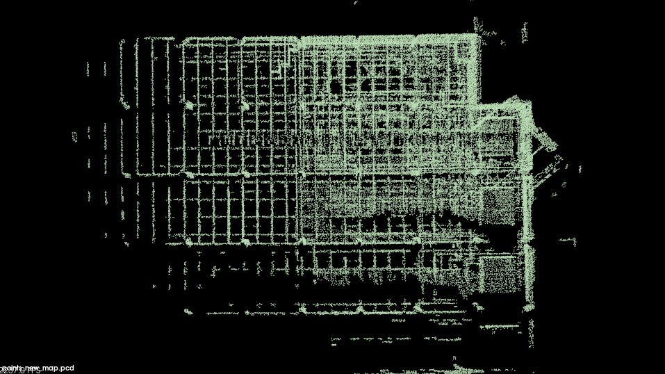
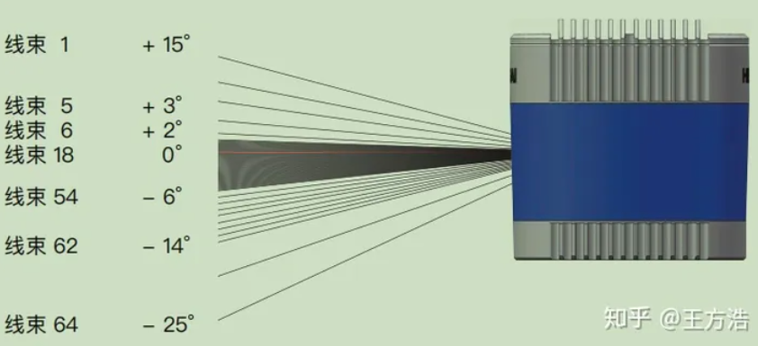
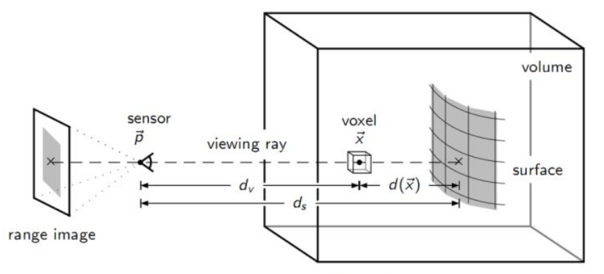
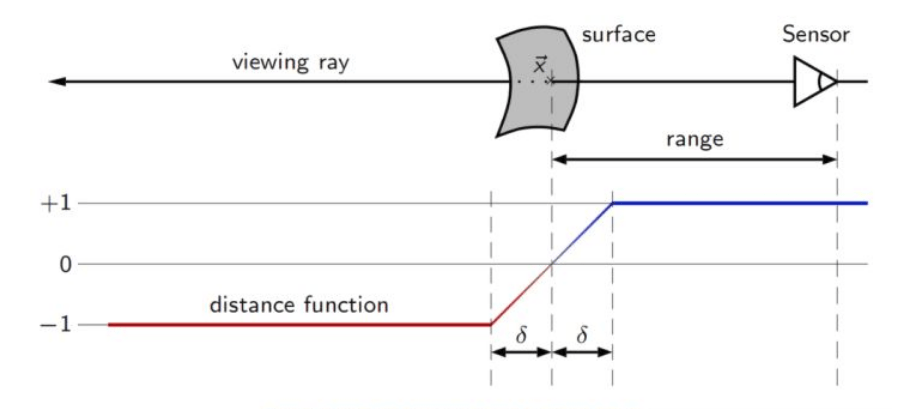

# Week2

## FAST-LIO

- 执行流程：

  | 流程          | 执行内容                                                     | 对应函数                             |
  | ------------- | ------------------------------------------------------------ | ------------------------------------ |
  | 输入          | LiDAR点云(10HZ)以及IMU数据(200HZ)                            |                                      |
  | 数据整理      | 整理每一帧雷达测量时间中的所有IMU测量值，打包输出            | sync_packages()                      |
  | 初始化        | 静止, 计算初始状态                                           | IMU_init()                           |
  | IMU前向推导   | 利用递推公式输出每一帧IMU测量时刻的估计状态                  | Process()                            |
  | LiDAR运动补偿 | 利用IMU递推出的状态计算每一个LiDAR点对应位姿，输出运动补偿后的点云 | UndistortPcl()                       |
  | LiDAR量测方程 | 利用地图结构ikd-tree查找点云，构建LiDAR测量方程，利用Kalman滤波估计状态 | update_iterated_dyn_share_modified() |
  | 地图更新      | 当前帧点云补充到地图结构中                                   | map_incremental()                    |
  | 输出          | 输出里程计状态以及点云                                       |                                      |
  
  

- **以FAST-LIO1为例，主要是分析IMU递推方程/LiDAR运动补偿/LiDAR测量方程以及三者**。

  - IMU测量模型：IMU测量得到的角速度/加速度都是针对当前时间的Body系(或者是称为IMU系)的测量结果，不过由于加速度计会受到重力加速度的影响，在FAST-LIO中会通过静止100帧获取到一个重力加速度的估计值(即获取到全局系G中的重力值$g^G$), 计算$a_m$就非常方便，其中$b_g$与$b_a$对应着陀螺仪以及加速度计的偏置项，其被建模成随机游走信息，其导数是一个高斯白噪声，定义为$n_{bg}$以及$n_{ba}$。陀螺仪与加速度计的测量噪声也为高斯白噪声$n_g$以及$n_a$。
    $$
    \begin{aligned}
    	a_m&=R_{G}^{B}\left( a^G-g^G \right) +b_a+ n_a\\
    	w_m&=w+b_g+ n_g\\
    \end{aligned}
    $$

    - IMU基本参数的确定: **需要确定的参数为实际重力加速度g，加计的偏置以及噪声，陀螺仪偏置以及噪声**，**bias_acc与bias_gyro对应的是偏置值的噪声**。FAST-LIO的初始化方案为静止初始化。偏置以及以及噪声协方差的计算如下，其中$\circ$表示按逐元素乘积。
      $$
      \begin{array}{c}
      	\mu _{a,N}=\mu _{a,N-1}+\frac{1}{N}\left( a_N-\mu _{a,N-1} \right)\\
      	\mu _{g,N}=\mu _{g,N-1}+\frac{1}{N}\left( g_N-\mu _{g,N-1} \right)\\
      \end{array}
      $$
    
      $$
      \begin{array}{c}
      	\sigma _{a,N}^{2}=\sigma _{a,N-1}^{2}\frac{N-1}{N}+\left( a_N-\mu _{a,N} \right) \circ \left( a_N-\mu _{a,N} \right) \frac{N-1}{N}\\
      	\sigma _{g,N}^{2}=\sigma _{g,N-1}^{2}\frac{N-1}{N}+\left( g_N-\mu _{g,N} \right) \circ \left( g_N-\mu _{g,N} \right) \frac{N-1}{N}\\
      \end{array}
      $$
    
      | 参数              | 计算方法                                                     |
      | :---------------- | :----------------------------------------------------------- |
      | $b_a$             | 初始值为0, 在后续Kalman过程中被更新 (其他算法在初始化部分按照重力的模值将其剔除的方法) |
      | $b_g$             | 静止100帧后获取到的陀螺仪测量值平均值                        |
      | $\sigma _{a}^{2}$ | 静止100帧后获取到的加速度计协方差 (用于测量方程)             |
      | $\sigma _{g}^{2}$ | 静止100帧后获取到的陀螺仪协方差 (用于测量方程)               |
      | $g^G$             | 静止100帧后获取到的加速度测量值平均值, 一般取负方便后续计算(初始包含bias_a，需要手动减) |
      | $n_{ba}$          | 加速度偏置对应噪声 (直接设置Eigen::Vector3d(0.0001, 0.0001, 0.0001)) |
      | $n_{bg}$          | 陀螺仪偏置对应噪声 (直接设置Eigen::Vector3d(0.0001, 0.0001, 0.0001)) |
    
    - 关于LiDAR的测量噪声也没有进行建模分析，而是直接给定一个经验值**LASER_POINT_COV (0.0015)**作为LiDAR测量噪声的协方差，并且FAST-LIO2中引入了对于LiDAR与IMU外参的估计，因为测量方程中包含了从LiDAR系到IMU系的转换的外参，所以其可以被LiDAR测量方程更新。
    
    
    
  - IMU递推方程: IMU作为每两LiDAR帧之间的状态估计工具，涉及到状态以及协方差的递推。FAST-LIO中利用的是误差状态向量进行推导，但是由于误差状态计算公式中仍然需要名义状态，所以这里需要对误差状态以及名义状态同时参与推导。**名义状态就是在递推过程中不包含噪声的估计结果, 误差状态向量即作为真实状态与名义状态之间的差值**。

    - 在实际推导过程中，会涉及到非线性方程到线性方程的转换，即需要进行一阶线性化处理。在这里应该是有**三种推导方式**，主要在于采用的线性化方式不同，FAST-LIO中使用方法2线性化，但是方法3的推导过程更加简洁，并且线性化点以及最终结果与FAST-LIO非常类似，故重点分析方法3。

      1. 在估计状态处线性化，即在线性化点选择当前状态直接线性化(严老师Kalman书的推导过程)，其中$J$是$f(x)$在线性化点$\hat{x}_{k}$处进行的线性化结果(即类似于常规的EKF线性化处理)，即雅可比矩阵。$f\left( \hat{x}_{k} \right)$即可以认为是不考虑噪声的最优一步预测$\hat{x}_{k+1/k} $。最终对应的方程表示从上一步的误差估计值，只利用IMU递推到下一个时刻的最优一步预测，后续会被测量方程进行优化。
         $$
         \begin{aligned}
         	x_{k+1}&=f\left( x_{k} \right) +w_{k}\\
         	&\approx f\left( \hat{x}_{k} \right) +J\left( x_{k}-\hat{x}_{k} \right) +w_{k}\\
         	\delta \hat{x}_{k+1/k}&=J\delta \hat{x}_{k}+w_{k}\\
         \end{aligned}
         $$

      2. 从连续状态直接线性化推导结果，即在FAST-LIO中使用的从连续状态到离散状态的推导过程。FAST-LIO中的递推方程可以表示如下，输入量$u_i$其实就是加速度以及角速度
         $$
         f\left( x_i,u_i,w_i \right) =\left[ \begin{array}{c}
         	\omega _{m_i}-b_{\omega _i}-n_{\omega _i}\\
         	^Gv_{I_i}\\
         	^GR_{I_i}\left( a_{m_i}-b_{a_i}-n_{a_i} \right) +^Gg_i\\
         	n_{b\omega _i}\\
         	n_{ba_i}\\
         	0_{3\times 1}\\
         \end{array} \right]
         $$
         后续推导过程即需要将下面这部分线性化，其表示下一帧状态与这一帧状态的变换关系，$\boxplus$与$\boxminus$是为了描述旋转上的加减关系，是一种流形上的加减法
         $$
         x_{i+1}=x_i\boxplus \left( f\left( x_i,u_i,w_i \right) \varDelta t \right)
         $$
         下一步就是非常复杂的计算，将真实状态$x_{i}$拆分成为$x_i\boxminus \hat{x}_{i}$，$\hat{x}_{i}$就没有考虑噪声的推导结果。**在整个推导过程中涉及到很多在流形上的计算性质使用，麻烦而且没有必要。**
         $$
         \begin{aligned}
         	\tilde{x}_{i+1}&=x_{i+1}\boxminus \hat{x}_{i+1}\\
         	&=\left( \left( x_i\boxplus f\left( x_i,u_i,w_i \right) \varDelta t \right) \right) \boxminus \left( \left( \hat{x}_i\boxplus f\left( \hat{x}_i,u_i,0 \right) \varDelta t \right) \right)\\
         	&=F_{\tilde{x}}\tilde{x}_i+F_ww_i\\
         \end{aligned}
         $$

      3. 从连续状态推导误差状态的导数，再离散化获取结果 **(推导上最简单，方法1实际上没有考虑到ESKF由于是针对误差状态的分析方法，所以线性化点会选择零点，在数值上更加稳定的优势。方法1对应的ESKF在名义状态处，其离散化方式就与EKF相同，体现不出来ESKF优势。2、3这两种推导方法其线性化点都是对$\delta x$， 也就是零点)**。首先计算各状态的导数形式。速度导数就是加速度，关于旋转的导数即使用右扰动模型进行推导，可以参考 https://blog.csdn.net/weixin_44382195/article/details/110677858。
         $$
         \begin{aligned}
         	\dot{p}&=v\\
         	\dot{v}&=R\left( a_m-b_a-n_a \right) -g\\
         	\dot{R}&=R\left( \omega_m-b_g-n_g \right) ^{\land}\\
         	\dot{b}_g&=n_{bg}\\
         	\dot{b}_a&=n_{ba}\\
         	\dot{g}&=0\\
         \end{aligned}
         $$
         对于真实状态${x}_{k+1}$，其与名义状态$x_{k+1}^n$、误差状态$\delta x_{k+1}$的关系为: 
         $$
         x_{k+1} = {x}_{k+1}^{n} + \delta {x}_{k+1} \rightarrow \begin{array}{l}
         	p=\hat{p}+\delta p\\
         	v=\hat{v}+\delta v\\
         	R=\hat{R}\delta R\\
         	b_g=\hat{b}_g+\delta b_g\\
         	b_a=\hat{b}_a+\delta b_a\\
         	g=\hat{g}+\delta g\\
         \end{array}
         $$
         其中名义状态${x}_{k+1}^{n}$在递推中是不考虑噪声的，所以其求导结果也是不包含噪声，其对应的递推公式为
         $$
         \begin{aligned}
         	\hat{p}_{k+1}&=\hat{p}_k+\hat{v}_k\varDelta t\\
         	\hat{v}_{k+1}&=\hat{v}_k+\hat{R}_k\left( a_m-\hat{b}_{a,k} \right) \varDelta t-\hat{g}_k\varDelta t\\
         	\hat{R}_{k+1}&=\hat{R}_k\mathrm{Exp}\left( \left( \omega _m-\hat{b}_{g,k} \right) \varDelta t \right)\\
         	\hat{b}_{g,k+1}&=\hat{b}_{g,k}\\
         	\hat{b}_{a,k+1}&=\hat{b}_{a,k}\\
         	\hat{g}_{k+1}&=\hat{g}_k\\
         \end{aligned}
         $$
         对上面公式左右同时求导，那么就可以获取到各个误差状态的导数。这里的$\theta$是旋转相关的李代数，即旋转矩阵可以认为是一个李群，旋转向量就可以认为是一种李代数(**实际上应该是旋转向量的反对称矩阵为李代数**)，利用旋转向量表示一个小的旋转会更加简单，求导也简单(**利用罗德里格斯公式**)。噪声$n_v$与$n_{\theta}$就是加速度测量噪声$n_a$与角速度噪声$n_g$离散化之后乘以时间值$\varDelta t$，其中$n_{b\_g}$与$n_{b\_a}$表示随机游走白噪声离散化结果。
         $$
         \begin{aligned}
         	\delta \dot{p}&=\delta v\\
         	\dot{\delta}v&=-\hat{R}\delta b_a-\hat{R}\left( a_m-\hat{b}_a \right) ^{\land}\delta \theta -\delta g-n_a\\
         	\dot{\delta}\theta &=-\left( w_m-\hat{b}_g \right) ^{\land}\delta \theta -\delta b_g-n_g\\
         	\delta \dot{b}_g&=n_{bg}\\
         	\delta \dot{b}_a&=n_{ba}\\
         	\delta \dot{g}&=0\\
         \end{aligned}\rightarrow \begin{aligned}
         	\delta p_{k+1}&=\delta p_k+\delta v_k\varDelta t\\
         	\delta v_{k+1}&=\delta v_k+\left( -\hat{R}_k\left( a_m-\hat{b}_{a,k} \right) ^{\land}\delta \theta _k-\hat{R}_k\delta b_{a,k}+\delta g_k \right) \varDelta t+n_v\\
         	\delta \theta _{k+1}&=\mathrm{Exp}\left( -\left( w_m-\hat{b}_{g,k} \right) \varDelta t \right) \delta \theta _k-\delta b_{g,k}\varDelta t-n_{\theta}\\
         	\delta b_{g,k+1}&=\delta b_{g,k}+n_{b\_g}\\
         	\delta b_{a,k+1}&=\delta b_{a,k}+n_{b\_a}\\
         	\delta g_{k+1}&=\delta g_k\\
         \end{aligned}
         $$
         对于噪声值对应的协方差的变换关系如下，这里的$\sigma _a$以及$\sigma _g$都是测量方程噪声离散化之后对应的方差
         $$
         \sigma \left( n_v \right) =\Delta t\sigma _a,\sigma \left( n_{\theta} \right) =\Delta t\sigma _g,\sigma \left( n_{b\_g} \right) =\sqrt{\Delta t}\sigma _{bg},\sigma (n_{b\_a})=\sqrt{\Delta t}\sigma _{ba}
         $$
         后直接离散化就可以推导出$\delta x_k$的递推公式
         $$
         \delta x_{k+1}=F_x\delta x_k+F_n n
         $$
         
         $$
         \begin{aligned}
         	n&=\left[ n_{v}^{T}\quad n_{\theta}^{T}\quad n_{b\_g}^{T}\quad n_{b\_a}^{T} \right] ^T\sim N(0,Q)\\
         	F_x&=\left[ \begin{matrix}
         	I&		I\bigtriangleup t&		0&		0&		0&		0\\
         	0&		I&		-\hat{R}(f^b-b_a)\times&		0&		-\hat{R}\bigtriangleup t&		I\bigtriangleup t\\
         	0&		0&		\mathrm{Exp(}-(\omega ^b-b_g)\bigtriangleup t)&		-I\bigtriangleup t&		0&		0\\
         	0&		0&		0&		I&		0&		0\\
         	0&		0&		0&		0&		I&		0\\
         	0&		0&		0&		0&		0&		I\\
         \end{matrix} \right]\\
         	F_n&=\left[ \begin{matrix}
         	0&		0&		0&		0\\
         	-I\bigtriangleup t&		0&		0&		0\\
         	0&		-I\bigtriangleup t&		0&		0\\
         	0&		0&		I\bigtriangleup t&		0\\
         	0&		0&		0&		I\bigtriangleup t\\
         	0&		0&		0&		0\\
         \end{matrix} \right]\\
         \end{aligned}
         $$

    - 在后续过程中，利用误差状态递推方程就可以不断获取到当前估计状态与真实状态之间的差值，并且这个误差状态估计在后续也可以被测量方程进行优化。误差状态的协方差递推过程可以表示如下，**但是由于每一次更新的时候都会将$\delta x_k$更新为0 (即用于估计的$\delta \hat{x}_k$)，所以只计算协方差就可以了**。**下面方程对应的是对下一帧误差状态的预测。**
    
      - 关于P的初始值：在初始值是直接给定的18*18维单位阵
      - Q中偏置变量对应的噪声是直接按照经验值直接给定的，加速度计与陀螺仪之间的噪声是在初始化过程中被估计计算的
    
  
  $$
  \begin{aligned}
  	\delta \hat{x}_{k+1/k}&=F_x\delta \hat{x}_k\\
  	\hat{P}_{k+1/k}&=F_x\hat{P}_kF_{x}^{T}+F_nQF_{n}^{T}\\
  \end{aligned}
  $$
  
  

- 运动补偿

  - 由于每一帧的LiDAR测量是一个连续的时间段，在这个时间中LiDAR可能是在移动状态，导致测量得到的点云出现重影等问题。针对该问题可以使用IMU测量值估计每一个点对应的位姿信息，最终**投影**到最后一个测量点对应的时间，实现点云运动补偿。

    - 点云排序: livox的点云包含了offset_time属性，可按照该时间进行排序。
    - IMU前向递推: 基于LiDAR采集开始到结束时间，利用Kalman滤波中的前向递推，可以获取到每一个IMU测量值时对应的位置，姿态，加速度，角速度等信息**(这里是利用前后两帧做平均)**
    - 点云反投影:  根据前向传播可以获取到LiDAR最后时刻对应的位置以及姿态。**每一个IMU段中的所有点云，都可以基于其前面一个IMU状态进行递推计算出其对应的在世界系中的位置以及旋转**(相对时间间隔也可以计算)，根据其相对最后时刻的位姿变换，再将其转换到LiDAR系下，即获取到运动补偿之后的LiDAR系点云，其计算公式与名义状态递推相同。

    

    - 具体公式推导为: 设有一个LiDAR测量点对应的时刻为$t_i$，对应位姿定义为$R_{w}^{i},  t_{w}^{i}$；其前一个IMU测量值时间为$t_k$，对应位姿定义为$R_{w}^{k}, t_{w}^{k}$；当帧LiDAR获取到的最后一个点云测量时间为$t_{end}$，对应位姿定义为$R_{w}^{end}, t_{w}^{end}$。该步骤所求先利用IMU量测获取到每一个测量点对应的LiDAR在世界系中的位姿，再求解其相对最后一个点测量时刻的位姿，最后再转换成LiDAR坐标系下，其相对变换关系可表示为: $T_{end}^{l}T_{i}^{end}T_{l}^{i}$，其中$T_{end}^{l}$与$T_{l}^{i}$都是LiDAR与IMU之间的转换关系，只不过是由于测量时间的不同表示成了不同形式。后续的推导过程为：
      $$
      T_{i}^{end}=T_{w}^{end}T_{i}^{w} \\
      T_{i}^{w}=\left[ \begin{matrix}
      	R_{i}^{w}&		t_{i}^{w}\\
      	0&		1\\
      \end{matrix} \right] \Longrightarrow \begin{array}{c}
      	R_{i}^{w}=R_{k}^{w}\mathrm{Exp}\left( w_k\varDelta t \right)\\
      	t_{i}^{w}=t_k+v_k\varDelta t+\frac{1}{2}a_k\varDelta t^2 \\
      \end{array} \\
      $$
    
      $$
      \begin{align*}
      T_{i}^{end}
          &= \left( T_{end}^{w} \right)^{-1} T_{i}^{w} \\
          &= \begin{bmatrix}
              \left( R_{end}^{w} \right)^T & -\left( R_{end}^{w} \right)^T t_{end}^{w} \\
              0 & 1
          \end{bmatrix}
          \begin{bmatrix}
              R_{i}^{w} & t_{i}^{w} \\
              0 & 1
          \end{bmatrix} \\
          &= \begin{bmatrix}
              \left( R_{end}^{w} \right)^T R_{i}^{w} & \left( R_{end}^{w} \right)^T ( t_{i}^{w} - t_{end}^{w} ) \\
              0 & 1
          \end{bmatrix}
      \end{align*}
      $$
    
    

- LiDAR测量方程

  - 整个方程需要从非线性转换到线性， H是测量方程h()在零点线性化获取的雅克比矩阵。
  - 定义测量值 $z=n^Tq$， 测量方程为$h(x)=n^T(Rp+t)$其中R,t是通过IMU递推获取到的状态量, FAST-LIO与Voxelmap不同在于其没有考虑测量点p, 平面法向量n以及平移量t的误差。**Voxelmap会推导更多的误差量，其最后推导的噪声v就不仅仅只包含测量噪声(具体计算会更加复杂)**。$n_l$为LiDAR测量方程的噪声，$n_l\sim N(0,V)$

  $$
  \begin{align}
  z & = h\left ( x  \right ) + n_l \\
    & = h\left ( \hat{x} \boxplus \delta x \right )+n_l \\
    & = h\left ( \hat{x}  \right ) + H\delta x + n_l
  \end{align}
  $$

  ​	其中$z - h\left ( \hat{x}  \right )$即表示为点到平面距离
  $$
  \begin{array}{c}
  	z-h\left( \hat{x} \right) =H\delta x+n_l\\
  	\delta z=H\delta x+n_l\\
  \end{array}
  $$

​		由于$h(x)=n^T(Rp+t)$, 那么$h(\hat{x} \boxplus \delta x)=n^T(R\delta Rp+t+\delta t)$对于$\delta x$在线性化点处的雅可比矩阵可表示如下, 其中$\delta x=\left[ \delta p,\delta v,\delta \theta ,\delta b_g,\delta b_a,\delta g \right] ^T$这里的$\theta$就直接表示为每一时刻旋转对应的李代数。由于$Exp\left( \delta \theta \right)=I+(\delta \theta)^{\land}$, 并且$(\delta \theta)^{\land}p=-p^{\land}\delta \theta$，可以将后续推导为:
$$
\small{H=\frac{\partial h\left( \hat{x}\boxplus \delta x \right)}{\partial \delta x^T}}=\frac{\partial n^T(RExp\left( \delta \theta \right) p+t+\delta t)}{\partial \delta x^T}=\left[ n^T,0,-n^TRp^{\land},0,0,0 \right]
$$

​		**那么k+1的测量方程可以表示成为: **
$$
\delta z_{k+1}=H\delta x_{k+1}+v_{k+1}\\
$$


- 状态更新:  核心是对于Kalman滤波中增益的计算，以及对真实状态的更新以及相关协方差的计算。$\hat{P}_{k+1/k}$作为IMU一直递推过程计算出来的协方差矩阵，H是h()对$\delta x$的雅可比矩阵，其中所使用R、t等属于状态向量的参数都是利用IMU方程递推到当前时刻的状态计算结果。**因为测量方程中只会包含旋转与平移信息，所以这里的$\delta x$**只会包含对旋转平移的更新。实际计算中V的取值同样是一个经验值，像ctlio这种测量结果直接是R,t来说的算法，这里V一般就是给6维向量(即姿态三维，位置三维)。

$$
\begin{aligned}
	K&=\hat{P}_{k+1/k}H^T\left( H\hat{P}_{k+1/k}H^T+V \right) ^{-1}\\
	\delta \hat{x}_{k+1}&=K\left( \delta z_k - H\delta \hat{x}_{k+1/k} \right)\\
	\hat{P}_{k+1}&=\left( I-KH \right)\hat{P}_{k+1/k}\\
\end{aligned}
$$

​	最后使用递推到该时刻的名义状态以及被估计的误差状态叠加计算最终的估计值。**在每一次更新之后(即使用测量方程修正)，误差状态会被置零，估计状态对应的协方差P也应该有一个切空间变换，但是影响不大可以忽略不计算，直接用上一步计算的P也是可以的**。这里的$\hat{x}_{k+1}^{n}$实际上是通过IMU递推到该测量时刻的名义状态。
$$
\hat{x}_{k+1} = \hat{x}_{k+1}^{n} + \delta \hat{x}_{k+1}
$$


### 目前问题

1. 关于协方差矩阵P矩阵计算： 
   - 按照kalman滤波的原理来讲，在上面计算的关于误差状态的kalman滤波中所有协方差矩阵P都是对误差状态而言的，那么对于估计状态的协方差矩阵可以等效成为误差状态的协方差矩阵。从这个公式$\hat{x}_{k+1} = \hat{x}_{k+1}^{n} + \delta \hat{x}_{k+1}$即可以分析出来：名义是一个常量，最终估计的协方差矩阵就是误差状态的协方差矩阵。
1. 观测问题：实际上在这里使用的测量方程只会对旋转与平移进行测量，但是在递推方程中定义的状态向量包含了6个三维状态向量，那么除去旋转与平移之外的其他旋转向量是否会继续修正。
   - 实际上是会的，对于递推方程中的F矩阵而言，F矩阵中旋转会受到旋转以及陀螺仪偏置项的影响，修正旋转的同时可以认为其也在修正陀螺仪偏置项，同理，修正位置项的同时也会对其他量做修正。


## 补充

- 李群/李代数：李群与李代数之间可以通过罗德里格斯公式转换

  - 旋转矩阵 3*3 可认为是一个李群 

  - 旋转向量 3*1 可认为是一个李代数

  - **旋转矩阵自身是带有约束的（正交且行列式为 1）。它们作为优化变量时，会引入额外的约束，使优化变得困难**。在后续求导中，使用扰动模型比直接使用李代数进行求导方便

    

    

- 关于使用测量方程h()不同，其H矩阵的形式就有所不同。FAST-LIO是计算点向量与平面法向量之间的乘积，ctlio也实现了这种基于流型的kalman滤波来进行状态估计, 利用ICP计算量测——对应的量测就直接是R,t结果。**注意无论是fastlio计算的点面残差还是ctlio的ICP测量值，其对应$h(\hat{x})$都是基于IMU递推到这个时刻计算得到的**。ct-lio本质上就是高翔的简明ESKF推导内容，IMU递推获取到$\delta x$的估计值以及协方差，LiDAR测量部分方程获取到对$\delta x$的H矩阵，后调用ESKF公式就可以直接计算增益K。**注意最后需要将$\delta x$置0**
  $$
  \begin{align}
  z & = h\left ( x  \right ) + v \\
    & = h\left ( \hat{x} \oplus \delta x \right )+v \\
    & = h\left ( \hat{x}  \right ) + H\delta x + v
  \end{align}
  $$

  - 这里的H矩阵的计算方式如下

$$
H=\frac{\partial h\left( x \right)}{\partial x} \frac{\partial x }{\partial \delta x}
$$


- Kalman滤波中，噪声的来源都是测量时会受到测量噪声的影响，所以不考虑噪声的估计值与真实值的差距越来越大。**预测方程中是IMU测量值导致的，其也是会受到噪声的影响(IMU作为控制输入)，所以只有最优估计也会越来越大(这种就会直接觉得对控制量是绝对已知的)，而且这里的控制输入直接被当成常数量写在每一帧的推导上，所以递推方程里面就没写控制部分**。

- https://zhuanlan.zhihu.com/p/538975422 该链接中介绍的测量方程很受用
- [https://blog.csdn.net/weixin_44382195/article/details/110677858](https://link.zhihu.com/?target=https%3A//blog.csdn.net/weixin_44382195/article/details/110677858) 计算R关于时间导数
- https://zhuanlan.zhihu.com/p/561877392 非常简明的Fast-LIO推导, 但是在这个测量方程上写的不是特别详细
- https://zhuanlan.zhihu.com/p/441182819 简明ESKF推导


# Week3

- 整理目前基于先验地图的匹配方法。提供全局的定位结果以及初始状态来实现巡检，初始状态指定为xyzypr(yaw / pitch / row )


| **FAST-LIO-localization** 比较粗糙, ICP匹配速度较慢          |
| ------------------------------------------------------------ |
| **Lidar_IMU_Localization** 多重约束: lio以及全局地图约束     |
| LOL: Lidar-only Odometry and Localization in 3D point cloud maps 纯激光雷达，时间比较久了，先不看这个 |
| liorf_localization 基于lio-sam的，但是lio-sam本身配置比较麻烦(不知道会不会好用一些) |
| fast-lio2-map-based-localization 跟第一个方法类似，只是更换了匹配方式 |
| ELiMaLoc(**EKF-based LiDAR-Inertial Map matching Localization**) 本质还是ICP, 但是会利用cuda加速匹配实现一种还不错的效果 |
| LiDAR_Localization_100FPS 彷佛非常高效计算                   |
| **Long-Term Mapping with 3D LiDAR and Reference Map Integration** |
| A Base Map-Guided Global Localization Solution for Heterogeneous Multi-Robot Systems Using a Co-View Context Descriptor 流程图写的非常复杂, 具体不了解 |
| SLAM-Map-Compression 2023年的CVPR 地图压缩, 不知道其能否有一个很好定位效果，也是使用C++实现 |
| multi_sensor_loclization_and_mappin:  NDT-based map matching, 使用的传感器好像比想象中多 |
| Globally Consistent and Tightly Coupled 3D LiDAR Inertial Mapping |


## FAST-LIO-LOC

- **整体逻辑为:** 计算$T_{base\_link}^{map}$即计算在map坐标系中的base_link系或者称为LiDAR系的位姿。对于$T_{base\_link}^{map}$的计算主要是分为$T^{map}_{odom}$以及$T^{odom}_{base\_link}$。在FAST-LIO会通过初始化自行确定坐标系odom，并计算每个时刻的状态$T^{odom}_{base\_link}$。对于$T^{map}_{odom}$的计算是需要通过map系点云以及odom点云进行ICP，由于odom系的点云是通过FAST-LIO计算的$T^{odom}_{base\_link}$进行转换的，那么**该ICP实际上就是将$T^{map}_{odom}$(按照上一次ICP计算结果作为初始值)以及$T^{odom}_{base\_link}$同时进行优化，从而补偿了FAST-LIO算法中可能出现的漂移。**$T^{map}_{odom}$的初始值可以人为确定, 即作为base_link系在map系中初始状态。 
  - python脚本中的坐标系 map | odom | base_link 分别表示 全局坐标系，里程计坐标系(即fastlio确认的坐标系)以及固定在无人机上的坐标系
    - 初始状态：指定初始的位姿状态，即绕固定轴 roll->pitch->yaw的顺序转换四元数发送
    - 全局定位：
      - 接收：
        - /cloud_registered以及/Odometry 即从fastlio中获取到的点云以及位姿 
        - **/initial_pose 表示 odom到map系中的转换关系, 即表示odom系在map系中的什么位置，即指定了当前无人机(base_linke系)在map系中的出发位置**
      - 发布：/cur_scan_in_map | /submap | /map_to_odom
        - /submap 表示 当前map系中按照FOV裁剪出来的点
        - cur_scan_in_map 表示  odom系中的当前帧点云**(修改了坐标系以及时间戳)**
        - /map_to_odom **不断修正的odom系到map系的转换关系**
      - 函数流程
        - 点云裁剪： 利用上一帧的 $T_{odom}^{map}$以及话题接收到的$T^{odom}_{base\_link}$将全局地图转换到当前局部系base_link中进行点云裁剪，以减小点云量加速匹配**(这里是一直进行的，但按理来说odom到map的转换关系在初始状态就可以固定，后续只是修正)**  最终输出在map系中的点云数据
        - 粗匹配/静匹配 registration_at_scale：调用open3D来实现odom系到map系之间的点云匹配, 不同scale控制粗细，并返回匹配精度方便衡量
        - 发布以odometry的格式发布点云匹配结果即 $T_{odom}^{map}$
      - 融合部分：
        - 接收/Odometry(10HZ)以及/map_to_odom(0.5HZ)发送 /localization(50HZ)                                                                                                                                                                                                                                                                                                                                                                                                                                                                                                                                                                                                                                                                      
          - 即利用 $T_{base\_link}^{odom}$与$T_{odom}^{map}$实现整体的$T_{base\_link}^{map}$即输出最终的map系中的位置数据
- 这里输出的 /localization频率过高，但实际上其输出的位姿是包含了重复的内容，即50HZ输出的轨迹，其中每5帧的内容是重复的。


## hm-lio(全局地图)

- hm-lio的主体部分与ct-lio非常相似，但是其在占用内存上是非常小的(200MB以下)，FAST-LIO运行内存在300MB左右，ct-lio占用内存在3G左右，测试数据为15分钟的长序列，雷达为livox avia。**其相比于FAST-LIO主要更改在于使用了哈希体素地图**：

  - **voxelHashMap: **
    - 地图更新: voxel中点大于20就停止更新; 并且新来点在这里的点距离voxel中的距离要均大于设定的阈值，对应**map_incremental()中的addPointToMap()函数**
    - voxel距离当前位置大于设定阈值则被删除, 用于节省内存，对应**lasermap_fov_segment()**

  -  具体逻辑为: 获取IMU/LiDAR数据之后，进行运动补偿，IMU递推。LiDAR计算点面残差，这里的平面拟合方法为按照点的位置信息查找附近的voxel体素(xyz前后左右各一个)(体素中的点要大于设定的阈值, 初始为1)中的距离最近的20个点**(实际上并没有限制数量)**。后续利用最近的点来计算点面距离作为测量值。**法向量计算方法仍与之前相同**。

- 调节参数:

  | 调节参数           | 参数变化                                                     |
  | ------------------ | ------------------------------------------------------------ |
  | IESKF中的迭代次数  | 初始值为8, 修改迭代次数为1以及4, 影响不大, 系统保证均可实时。 |
  | voxel_neighborhood | 初始值为1，修改为3之后严重影响实时性                         |
  
- 运行时间：一帧大约40ms主要耗费在时间在于优化环节，即迭代卡尔曼那部分


### 全局定位

- 将点云匹配修改成为map与base_link系之间，那么LiDAR量测获取到的就是 $T^{map}_{base\_link}$。 在IMU实现递推的时候，对应的应该是两个时刻base_link之间的转换，再加上前一个时刻中的$T^{map}_{base\_link}$估计值其实也是获取到当前时刻的$T^{map}_{base\_link}$，递推与量测对应相同的状态，即可以实现融合定位。**初始状态: 基于全局地图与当前启动时的xyzrpy进行计算初始状态。**

- 全局地图获取:

  - 利用回环检测等方法尽可能提升LIO系统的定位精度，并简历全局地图。

- 自适应初始化策略：

  - 将整个全局map进行分割成一个一个的region，在这些region中使用一些点云特征加速region与当前local map的筛选策略，最后直接用该策略筛选出最有可能的region进行后续的匹配策略。对于点云提取特征的方法如下：

    | LiDAR特征提取方法                                            | 效果                                                         |
    | ------------------------------------------------------------ | ------------------------------------------------------------ |
    | [scanContext++](https://github.com/gisbi-kim/scancontext_tro) | TRO实现的特征提取，已经开源                                  |
    | [BoW3D](https://github.com/YungeCui/BoW3D)                   | 仿照词袋模型的点云词袋                                       |
    | TCF https://github.com/ShiPC-AI/TCF#:~:text=TCF%20(Two%2Dstage%20Consensus%20Filtering) | 直接使用三步RANSAC实现整体的逻辑                             |
    | https://github.com/ShiPC-AI/LiDAR-Localization-100FPS?tab=readme-ov-file | 这里也会形成简单的描述子结构，对应着**LiDAR-ReLoc**中的内容，并且这里的描述子就是到单独生成的bin文件 |

    参考LiDAR-ReLoc，描述子是否直接按照中心区域中的占据情况直接生成，但是问题就在于是否能匹配上，region的大小会直接影响到精度的问题

    - region选取: 基于当前帧的尺寸大小，直接进行确定map中的region的大小
    - 简单的ICP方法似乎无法直接解决变换90°角的情况，需要查找更强力的匹配方法
  
  - ICP处理方法: 目前是利用已经证明精度的开源ICP方法来保证系统运行
  
    | 点云匹配策略                         | 效果                                                         |
    | ------------------------------------ | ------------------------------------------------------------ |
    | https://github.com/koide3/fast_gicp  | 效果比较差, 10度的yaw角偏差也没完成修正                      |
    | https://github.com/koide3/small_gicp | 配置简单，只使用头文件就能使用。配置过程中出现bug (估计是需要更新PCL1.10到1.11) |
    | https://github.com/isl-org/Open3D    | open3D的C++ 版本，效果一般                                   |

#### 定位结果

- 目前假定初始位姿正确，不需要进行多余的ICP操作，只进行了相对全局地图的定位

  - 指定全局PCD文件——由FSAT-LIO输出PCD文件

  - 指定初始位姿——位置xyz以及欧拉角rpy

  - 指定是否使用全局定位，即是否读取全局PCD文件进行全局定位

  - 指定是否使用全局地图更新，即新获取到的LiDAR帧是否更新全局地图

  - 指定是否部署nx(TODO)，即nx部署关闭一些用于debug的输出信息

  ```yaml
  global:
    pcd_path: /home/supercoconut/Myfile/ROS/myProject/src/hm-lio/PCD/map1.pcd
    initial_pose: [0.0, 0.0, 0.0, 0.0, 0.0, -90.0]       # xyz | rpy | 全部是LiDAR相对map的转换关系
    is_used: true     # 是否开启全局定位
    is_update: true   # 当前帧是否更新全局地图 (全局定位关闭这里必须开启)
    is_deploy: false  # 后续设置如果部署到nx端需要手动去除rviz展示这些内容(TODO)
  ```

- 原始全局地图

  

- 里程计更新后的全局地图，即新的LiDAR量测点云不断地更新当前地图，点云越来越稠密。

  


目前问题：

- voxel的删除策略有问题。 直接从全局地图会获取voxel, 但是hm-lio中的原始思路是随着车辆的移动, 会按照距离删除voxel。对于全局地图生成的voxel不能进行删除, 要不然运行第一帧就会删除一部分，并且这种策略也不能保证回环。
- 对voxel更新的问题, 新加入的voxel的点云是否能直接更新voxel中的点。
- 启动顺序: 先启动程序再启动雷达, 因为读取整个PCD文件目前耗时1s

-  ICP匹配问题: 如何进行小规模点云与大规模点云之间的匹配。前者为LiDAR帧， 后者为整体的map地图。随着map体量的增加，带来的问题会越来越多，导致匹配的难度会越来越大。所以必须要进行全局地图的筛选策略，直接利用点到点来筛选ICP肯定是不可以的，最好还是使用几何结构来解决问题。里程计LiDAR帧简单累积之后使用多线程ICP匹配的效果较差。

  - 累积LiDAR帧(5帧)

    

  - 完整地图点云

    

  - 匹配结果如下，两者初始位姿yaw角相差90度，ICP并不能匹配

    
  
  - 结论是: ICP修正角度的能力并不强，解决的方法有两种 
  
    - 提取特征分析，即采用更强劲地ICP匹配方法来完成匹配 
    - 旋转角度匹配，即直接手动旋转角度查找哪一次ICP匹配的效果更好即可。上述使用的small_icp以及fast_icp的方法都未能实现大角度偏差的匹配，原因应该是ICP是一种选择最近距离点之间的匹配方式，在上述的匹配中，匹配点肯定是很好找到的，但是这里匹配点应该都不正确。


# Week4

## 点云匹配

- 如果直接将局部地图以及全局地图中的所有点云都给ICP模块，会出现的问题有 (1) 误匹配：由于对应的场景很可能是一些对称或者几何关系高度相似的场景，在实际计算中就可能找错了匹配位置 (2) 计算时间非常长，点云量变大自然会导致时间变长。下图是直接输入原始点云数据进行匹配，耗费时间非常长，虽然最终输出的是较为正确的匹配结果。

  

- PCD测试结果：

  - 人为引入初始位姿误差，利用**3D Registration with Maximal Cliques**该方法对LiDAR获取的点云(初始帧)与全局地图形成的PCD地图进行匹配，耗时大概在1.2s左右，可修正较大角度的初始误差。PCD点云地图不属于实时计算的方法，处理起来比较简单，主要用于测试方法的有效性

    - 初始偏差大致15度：左侧为global map对应的地图，右侧为local map对应的地图，计算两者之间的变换关系，并且输出结果。两者都是保存从原点附近-5~5m之内的点云进行匹配。

      

      

    - 角度偏差大致20度/45度/60度/90度均可以实现匹配, 耗费时间略长。可考虑对当前帧形成的local map进行降采样(整体代码的编译方式为release编译，开启了O3优化)。如果使用debug的编译方式，匹配耗费时间会显著增加。


- hm-lio测试匹配测试，其中将初始位姿配准方法与全局地图配准方法合并，并进行消融实验证明上述方法的可行性。

  - 未进行初始位姿配准：定位直接发散

    

  
    - 进行初始位姿对准：正常定位
  
      
  


- 目前问题：上述3D Registration with Maximal Cliques方法只是一种粗匹配的方法，在实际仓库环境中进行测试发现在有些情况下匹配效果较差，其对应的解决方法有三种：

  - 更改区域选择的距离：参数从5m更改8m，效果确实提升，但是误差依然出现。距离值从5m, 8m, 12m选择后都可以较为稳定运行，但是10m处误差突然变大，说明该方法不能解决类似问题。

  - 使用更多的点云帧来进行匹配：目前是只使用首帧进行初始匹配，初始化状态是静止即是可以不考虑点云畸变来匹配，即直接认为LiDAR扫描到的点云可以按照初始值可以直接叠加。

  - 补充ICP提供更加精细的匹配结果：已经完成，效果不错。并且定性地分析了这种匹配结果的有效性。

    - 未进行ICP精细匹配：在中间这个部分中，仓库的支撑柱并不能严格对齐，出现了重影，即说明初始位姿并没有完成对准。

      
    
    - 进行ICP精细初始化匹配：重影问题消失。
    
      


## 补充

- 关于旋转矩阵以及欧拉角之间的转换

  - 欧拉角：简单来说欧拉角就是绕三个轴的角度，但是由于绕轴的不同(自身轴或者固定轴)以及绕轴的先后顺序会生成不同的旋转矩阵。

    - 内旋：内旋就是绕自身轴进行旋转，即旋转完第一个角之后，第二个角的旋转是绕第一个角旋转之后的轴进行。**对应旋转矩阵为右乘形式**。
    - 外旋：外弦就是绕固定不动的轴进行旋转。**对应旋转矩阵为左乘形式**。

  - 全局定位模块中要求给定初始状态的欧拉角。实际使用中会将给定的欧拉角转换成为旋转矩阵来作为初始状态，具体流程为按照内旋ZYX的顺序读取欧拉角并将其转换成为旋转矩阵，即按照先绕机体Z轴，机体Y轴，机体X轴的顺序旋转。

    ```cpp
    // 输入欧拉角为角度
    template <typename T>
    Eigen::Matrix<T, 3, 3> EulerToRotM(const Eigen::Matrix<T, 3, 1> &euler)
    {
        const T deg2rad = M_PI / 180.0;
        T x = euler(0) * deg2rad;
        T y = euler(1) * deg2rad;
        T z = euler(2) * deg2rad;
        Eigen::Matrix<T, 3, 3> Rx, Ry, Rz;
        Rx << 1, 0, 0,
              0, cos(x), -sin(x),
              0, sin(x), cos(x);
        Ry << cos(y), 0, sin(y),
              0, 1, 0,
              -sin(y), 0, cos(y);
        Rz << cos(z), -sin(z), 0,
              sin(z), cos(z), 0,
              0, 0, 1;
        return Rz * Ry * Rx;
    }
    ```

    - 旋转矩阵转欧拉角：转换之后的结果对应按照内旋ZYX顺序形成的欧拉角

    ```cpp
    template <typename T>
    Eigen::Matrix<T, 3, 1> RotMtoEuler(const Eigen::Matrix<T, 3, 3> &rot)
    {
        T sy = sqrt(rot(0, 0) * rot(0, 0) + rot(1, 0) * rot(1, 0));
        bool singular = sy < 1e-6;
        T x, y, z;
        if (!singular)
        {
            x = atan2(rot(2, 1), rot(2, 2));
            y = atan2(-rot(2, 0), sy);
            z = atan2(rot(1, 0), rot(0, 0));
        }
        else
        {
            x = atan2(-rot(1, 2), rot(1, 1));
            y = atan2(-rot(2, 0), sy);
            z = 0;
        }
        Eigen::Matrix<T, 3, 1> ang(x, y, z);
        return ang;
    }
    ```

  - PS：内旋与外旋只是一种欧拉角旋转形式上的区别，在这里都统一按照内旋ZYX顺序进行理解与设置。**并且内旋ZYX与外旋XYZ最终形成的旋转矩阵是完全一样的**。

- 旋转矩阵的理解：根据实际物理意义的不同，旋转矩阵可以表示AB两个坐标系中向量的坐标转换，或者表示在同一个坐标系中的向量旋转。这两种方式生成的旋转矩阵形式也有所不同。**在SLAM中基本都是表示坐标系之间的向量转换。**


# Week5

地图更新

- PCD地图保存：每次运行之后都需要将新获取到的体素地图进行保存，这里尝试了两种地图保存策略

  - 直接从原始点云中保留点云：只能利用手动跳点的方式降采样(即每隔几个点保留一个点)，整体获取到的点云还是过多，PCD地图过大，而且保存点具有随机性

  - 从体素地图中保存点云：捕获ctrl+c信号，当程序终止之后进行体素地图的遍历，进行地图的保存。

- 最终使用的方法为第二种，每次保留下来的PCD文件大小在8M，原始的bag文件为深国际录制的，大小为400M。


- 与fastlio精度对比 复杂/空旷 —— 需要录制新的数据进行更加严格的对比，主要是实际仓储情况的数据(TODO, 数据刚刚完成了采集)


## 调参

调参 (针对nx无法实时运行的解决方法) 即处理一帧的时间必须要在100ms以内

- 参数分析：

  - max_number_neighbors 
  - min_number_neighbors
    - 两者调试需要一起调试，相邻点的作用是用于拟合平面，不能继续下降
      - 全部修改为20：原始参数，平均一帧的处理时间为160ms
      - 全部修改为10：平均一帧的处理时间为120ms
      - 全局修改为5：平均一帧的处理时间为115ms

  - sampling_rate

  - surf_res

    - 两者调试也需要一起调试，其相乘表示表示降采样的体素大小，在点云降采样中一帧点云中的点在每一个体素中只会选择一个点
      - 分别修改为0.5*1.5：原始参数，平均一帧的处理时间为130ms
      - 分别修改为0.5*1.7：平均一帧的处理时间为114ms
      - 分别修改为0.5*2.0：平均一帧的处理时间为110ms，定位出现漂移！！

  - max_num_points_in_voxel

    - 体素地图中一个体素中的最大包含点的多少
      - 修改为20：原始参数，平均一帧处理时间为
      - 修改为15：平均一帧处理时间为106ms
      - 修改为10：平均一帧处理时间为95ms

  - num_max_iterations

    - 表示kalman滤波过程中对应的迭代次数
      - 修改为4: 原始参数，平均一帧处理时间为95ms
      - 修改为3: 平均一帧处理时间为86ms

  - max_dist_to_plane_icp

    - 表示计算点面距离中初始距离的最高阈值，高于该值的点都不会加入测量方程
      - 修改为0.3：原始参数，平均一帧处理时间为95ms
      - 修改为0.2：平均一帧处理时间为95ms

  - size_voxel_map

    - 表示提速地图中一个体素的大小
      - 修改为1.m：原始参数，平均一帧处理时间为95ms
      - 修改为0.8m：平均一帧处理时间为100ms
      - 修改为0.2m: 平均一帧处理时间为105ms
      - 修改为1.2m：平均一帧处理时间为90ms
      - 修改为1.4m：平均一帧处理时间为89ms

  - 临时线程数

    - 即做点云转换时对应的临时线程数量

      - 修改为8(原始为4)：平均一帧处理时间为95ms

      

- 最终效果：nx部署的参数可以实现平均一帧的处理时间在80ms左右，精度仍需要后续测量，并且甚至可以关闭当前帧对于全局地图的更新，在这种条件下平均一帧的处理时间为70ms，此时定位并不会发散。


- 目前已解决问题:

  - LiDAR第一帧并不应该直接导入到voxel_map中，从体素地图中保存PCD文件的时候出现了类似的错误，已修改为禁止将未经过位姿优化的LiDAR数据导入到体素地图中。

    

  - 前几帧位姿不稳定会导致里程计震荡，已修改为等待位姿稳定后再输出位姿

    


# Week6

## 定位精度对比

- 在京东大厦环境下，对比fastlio与hmlio(原版)精度，衡量标准为从出发点到结束点之间的距离以及yaw角的偏差。**该两者算法的编译选项全部为O3条件的优化，release编译，测试平台为实际仓储物流飞机机载电脑orin nx**。

  | 数据集 | 算法            | 平均角度误差(度) | 平均定位误差(米) |
  | ------ | --------------- | ---------------- | ---------------- |
  | map3   | fastlio         | 3.34             | 0.312            |
  | map3   | hmlio           | 0.17             | 0.003            |
  | map3   | fastlio_loc     | 0.73             | 0.001            |
  | map3   | hmlio(全局定位) | 0.28             | 0.004            |
  
  | 数据集 | 算法            | 内存占用(MB) | 平均一帧耗费时间(ms) |
  | ------ | --------------- | ------------ | -------------------- |
  | map3   | fastlio         | 450          | 7                    |
  | map3   | hmlio           | 40           | 18                   |
  | map3   | fastlio_loc     | 143          | 104                  |
  | map3   | hmlio(全局定位) | 262          | 21                   |
  
  - 具体分析
    - 对于map3数据集，其是在京东大厦16楼围绕一圈录制的，出发点与结束点在同一个位置处，以此来衡量算法的定位精度。对于hmlio来说，整体运行比较平稳，姿态误差与位置误差都比较小；但是对于fastlio来说，其误差主要来自于z轴上的误差，甚至到了0.76m。将hmlio运行的点云地图降采样保存成为PCD文件，利用其进行定位，最终的定位误差反而有所增加。并且如果采用全局定位，hmlio在运行之前需要将全局的PCD地图进行读取，并且无法执行按照距离删除最远点云的操作，故占用的内存大小要更多一些。对于fastlio_loc，虽然其时间占用是比较长的，但其属于是定期计算的策略，这里与实际的位姿计算不属于同一个进程，并且使用的先验地图都是由hmlio生成的。
    
      - fastlio运行结果，左右两侧高度不对应，实际左右两侧应该是相同高度。
    
        
    
      - hmlio运行结果，左右两侧高度一致。
    
        
    
    
    
  
  | 数据集             | 算法            | 平均角度误差(度) | 平均定位误差(米) |
  | ------------------ | --------------- | ---------------- | ---------------- |
  | map3(30度角度误差) | fastlio_loc     | 0.115            | 0.008            |
  | map3(30度角度误差) | hmlio(全局定位) | 0.114            | 0.001            |
  | map3(3m位置误差)   | fastlio_loc     | 0.401            | 0.014            |
  | map3(3m位置误差)   | hmlio(全局定位) | 0.172            | 0.004            |
  | map3(3m/30度误差)  | fastlio_loc     | 0.745            | 0.001            |
  | map3(3m/30度误差)  | hmlio(全局定位) | 0.116            | 0.005            |
  | map3(3m/60度误差)  | fastlio_loc     | 0.005            | 0.381            |
  | map3(3m/60度误差)  | hmlio(全局定位) | 0.057            | 0.006            |
  
  - 具体分析：这里主要是测量在给定的初始状态存在一定的误差的情况下，定位算法的定位精度，测试的数据为在京东大厦16楼录制的数据集，实际的初始位姿应该是[0,0,0,0,0,0]。利用该数据集，人为给定初始位姿误差(yaw角角度误差以及z轴位置误差)，对比基于全局定位的hmlio以及fastlio_loc，可以得出hmlio的定位误差更小，并且鲁棒性更好。**目前基于全局地图的hmlio算法可以实现在180度角度误差的位姿修正，而fastlio_loc无法应对较大的初始角度误差。**


## 总结

- 本周主要完成了室内数据的采集，以及在室内环境下完成了基于全局地图的hmlio以及fastlio_loc算法的定位误差的比较，主要是在初始位姿准确，有30度/60度角度误差，有3m位置误差以及角度误差与位置误差同时存在的情况下，比较两种算法的定位误差，定性分析出目前基于全局地图的hmlio定位算法的性能要更好，其平均一帧激光雷达数据的处理时间在20ms，占用内存在260MB，并且角度误差小于1度，定位误差小于0.1m。

- 下周的主要任务为
  - 在深国际机场中实际录制数据进行算法测试，比较。
  - 对全局地图引入噪声，测试算法的抗干扰能力。


# 交流分享

## 常见传感器以及原理

- 相机
  - 投影模型 (RGB/全景/深度/鱼眼相机)
    - RGB相机：基于相似三角形可以计算，直接将世界系中的一个点投影到二维像素平面上，由于其投影方式是沿直线投影，所以其能观察到的视野是受限的。其原理如下：
      $$
      \left( \begin{array}{c}
      	u\\
      	v\\
      	1\\
      \end{array} \right) =\frac{1}{Z}\left( \begin{matrix}
      	f_x&		0&		c_x\\
      	0&		f_y&		c_y\\
      	0&		0&		1\\
      \end{matrix} \right) \left( \begin{array}{c}
      	X\\
      	Y\\
      	Z\\
      \end{array} \right) \xrightarrow{\Delta}\frac{1}{Z}KP.
      $$
      
      
    - 鱼眼相机：鱼眼相机的视野范围比RGB相机要更大，如果仍燃用上述的投影原理，当相机的视场角快达到180°时，成像图像要无穷大。
    
      
    
      鱼眼相机对应的入射角要小于出射角，跟据后续投影模型的投影原理不同可以分为等距投影模型、等立体角投影模型、正交投影模型和体视投影模型四种。
    
      
    
    - 全景相机: 全景相机的投影模型不存在畸变，相当于先将真实世界投影到一个单位圆上，再将这个单位圆展开成为一个矩阵投影，即成为等距投影模型(类似于世界地图)，投影原理为计算在相机坐标系中的一个点，归一化后计算其对应的角度，最终计算其对应的像素坐标。
      $$
      p^c=R_{b}^{c}R_{w}^{b}p^w
      \\
      b=\frac{p^c}{\left\| p^c \right\|}
      \\
      \phi =-\mathrm{arc}\sin \left( b_y \right) , \phi \in \left( -\frac{\pi}{2},\frac{\pi}{2} \right] 
      \\
      \theta =\mathrm{atan 2}\left( b_x,b_z \right) , \theta \in \left( -\pi ,\pi \right] 
      \\
      u=\frac{\theta +\pi}{2\pi}, u\in \left[ 0,1 \right] 
      \\
      v=\frac{\pi -2\phi}{2\pi}, v\in \left[ 0,1 \right]
      $$
    
    - 深度相机：常见原理有双目/结构光/ToF
    
      - 双目即利用三角测量原理确定深度，基线越大，能观察的范围就越远。
    
        
    
      - 结构光利用一束光源（通常是红外线激光）来照亮物体表面，并通过相机镜头来捕捉反射回来的光线计算深度，其受实际场景中的光照影响比较大。
    
      - toF属于主动发送光束(通常为红外线)，跟据其返回时间计算距离，其测量距离较远但是也会收到光照影响。
    
        
    
  - 快门方式
    - 卷帘快门：通过Sensor逐行曝光的方式实现的。在曝光开始的时候，Sensor逐行扫描逐行进行曝光，直至所有像素点都被曝光。
      - 卷帘快门速度更快
      - 常见的问题为**果冻效应**：即在相机或者被拍摄对象移动速度较快的情况下，图像会出现畸变。
    - 全局快门：整幅场景在同一时间曝光实现的。Sensor所有像素点同时收集光线，同时曝光，其与卷帘相机的比较如下
    
    
    
    - 在SLAM或者基于相机的定位方法中，基于全局快门的图像数据更清楚，所以定位效果就会更好。
  
- 激光雷达
  - 机械：在水平方向采用机械结构进行 360°的旋转扫描，在垂直方向采用定向分布式扫描。属于重复式扫描，即随着时间变长，扫描到的点云不会增加。
  
    
  
  - 半固态/固态：半固态的发射器和接收器固定不动，只通过少量运动部件实现激光束的扫描。固态的内部完全没有运动部件，使用半导体技术实现光束的发射、扫描和接收。其都是非重复式的扫描，随着时间变长，点云会越来越多。
  
    
  
  - 影响LiDAR点云质量的原因：
  
    - 强光照射(有一些激光雷达数据集特意录制强光照射场景)，在有强光照射时，激光雷达的测量距离和点云数量大幅减少。
  
    - 雨雾干扰：会出现很多噪点，激光雷达的测距性能发生衰减。
  
      
  
    - 地面积水：即发生镜面反射导致出现多余点云。
  
    
  
- 标定方法

  - 有目标/无目标标定：标定激光雷达与激光雷达之间外参或者是激光雷达与相机之间的外参。


## 机器人分享

- 常见构型

  - 四足：常见为机器狗，其自身搭载的传感器为激光雷达。在云深处的绝影x30上搭载两个mid360激光雷达，在宇树的go2上搭载的是自研的超广角激光雷达L2。除去四足之外，还有四轮机器狗的构型。

    - 应用场景主要为：针对电站、工厂、管廊巡检以及一些应急场景；宇树的go2机器狗搭载了openAI的GPT模型，还可以进行一些问答互动等等。

      

      

  - 人形机器人

    - 人形机器人控制策略上要更加复杂，更难落地，目前宇树、智远、星海图、星动纪元等公司都推出了类似的人形机器人产品。

      - 智元

      

      - 宇树

        

    

  - 轮式+双臂(主要为服务机器人)，手臂末端可以安装夹爪或者为灵巧手或者其他的执行机构，比如焊枪等等。

    - 星海图: 主要做灵巧手的开发，其机器人定位主要是利用底盘上搭载的激光雷达定位(1-2个)，头部搭载一个双目相机，胸部可选配双目相机。大部分公司都会推出类似的产品。

    

  - 双足机器人: 目前只见到了一款TRON 1，其在icra2025的会场进行了展示，能够保证观众踢、踹、拉、扯的干扰下保持稳定或者是在摔倒后仍可以自动起立。

    

  

- 技术栈: 目前在机器人方面有两个方向是比较热门，即vla(vision language action)以及vln(vision language navigation)

  - vln即利用视觉语言模型去直到机器人或者无人车/无人机来到达目标位置，不同于传统的SLAM方法，其并不关系机器人所处的位置，所有的工作只需要确保目标能够到达或者能去找到，而非一定要知道其在世界系中的位置。由于该技术需要使用语言大模型，故引出了一些对于语言存在歧义问题的处理算法。

    

  - vla相比于vln要更加困难，其是直接需要输出机器人的执行动作，也讲作为下一代的自动驾驶/机器人操练的解决方案。
  - 仿真环境：上述两者的内部逻辑都依赖于深度学习，故需要大量的数据来进行模型的训练，但是如果使用实际机器人或者车辆来录制数据，其成本要非常高，目前的解决方法是搭建虚拟环境进行仿真数据的获取。常用的仿真工具即为mujoco以及issac sim。前者是一种高效的物理仿真工具，对计算平台的要求较小(2080即可以使用)后者是英伟达新推出的仿真平台，充分利用 NVIDIA GPU，实现高效的机器人仿真、AI训练和部署(4090)。

  

- 常用灵巧手/机械臂的驱动方式(线驱动以及电机驱动)

  - 无论是灵巧手还是机械臂，其驱动方式都有两种: 电机驱动以及线驱动。机械臂上使用线驱动的的比较少见，灵巧手上使用线驱动的好处在于更加灵活。线可以理解成为类似于肌腱。**电机驱动带动机械的转动时线性的，而线驱动是一种非线性的转动。**

    

  

- 在icra2025的会场，机器人方面也出现很多其他的demo：

  - 书籍翻页

    

  - 相机拍照

    

  - 面部仿生

    


## 常见地图

- 点云：点云地图属于是最简单的地图形式，只需要知道每一帧点云对应的位姿就可以将其加入到点云地图中，其常见管理点云地图的结构为 kd-tree/ikd-tree/voxel。

  - kd-tree简称k维树，是一种空间划分的数据结构，可以将无序点云转换有序点云，常使用的函数为:
    - 最近邻搜索：找到最近的点，主要是点云匹配中使用，如ICP
    - 按照距离范围搜索：找到一定范围内的最近点云

  - ikd-tree主要是解决传统的静态 kd-tree 结构存在着大量数据增删的情况下变得 unbalanced，导致深度不均衡和搜索效率下降的问题。
  
  - voxel即体素，其主要与哈希结构一起使用，方便快速查找。
- 体素：体素是另外一种常见的地图结构，类似于图像中的像素点，其可以被认为是三维世界中的最小区域，可以利用其来管理点云数据。
- 栅格：栅格主要是用于避障，来衡量一个区域中是否能通过，如占据栅格地图(Occupany Grid Map)。
  - 占据栅格地图将环境划分为离散的栅格，对于每一个栅格维护一个占据状态以及不占据状态的概率值。目标是通过传感器观测数据（如激光雷达、深度相机等），逐步更新每个栅格的占据概率。具体的更新公式主要是使用贝叶斯公式进行更新的。跟据计算出来的P(m=1)的情况会计算一个阈值，概率值大于这个阈值的时候会认为是占据状态。m=1代表占据状态，m=0代表无占据状态。

  - **占据栅格地图是非常稠密的，占用的内存会很大**
  
    
  


- 八叉树地图

  - 环境中没有障碍物的地方，就用大的方块表示，当大方块里面有小部分有障碍物，就递归地切分下去，直到包含了障碍物为止。**相当于是对于占据地图的一种改进，其保存的体素数量可以变小**

- 欧式有符号距离函数 ESDF

  - 类似于下面的TSDF方法，不过其没有进行距离的截取，其体素中直接保存一种欧式距离，由于其对应的是一种信息，可以用于全局的路径规划。
    - **通过利用体素以及其周围的体素的取值是可以计算下降梯度，该梯度可以引导路径规划，使得获取到的路径远离障碍物**

- 截断有符号距离 TSDF 

  - 利用传感器的量测数据可以获取环境中物体表面的位置，那么靠近当前传感器的一侧符号为正，另一侧的符号为负。假设相机光心到表面的距离为d_s，到射线上体素x距离为d_v，则符号距离就是SDF(x)=d_s - d_v。显然SDF(x)的取值为正数代表在表面的前面，取值为负数代表在表面的后面。

  - TSDF就是将SDF距离归一化到[-1,1]这个区间中，距离1或者-1都代表距离物体比较远，相当于变相地获取到距离值。

    

    


之后可以介绍点云匹配


## 无人机基础

- 机架: 一般都是按照轴距(对角电机的距离)进行区分，常见的入门机架即450/550等这些

- PX4属于是自动控制仪，对应的硬件为pixhawk。更像是一个中转站，上层指令(程序或者控制器)给定PX4，PX4通过硬件来控制无人机/无人车。
  - Pixhawk的构造：PIXHAWK拥有168MHz的运算频率，其中主处理器为STM32F427，协处理器STM32F103，主处理器和协处理器之间采用串口通信方式。为内置两套陀螺和加速度计MEMS传感器，互为补充矫正，内置三轴磁场传感器并可以外接一个三轴磁场传感器，同时可外接一主一备两个GPS传感器，在故障时自动切换。


- 关于 QGC | MAVROS | MAVLink使用

  - QGC地面站，一般是直接连接基站，通过MAVlink协议将地面站RTK数据(即RTCM数据)发送给移动端

  - MAVROS 在移动端电脑配置，用于读取飞控数据

  - MAVLink相当于是一种通讯协议，用于连接地面站与MAVROS


滤波参数

内环/外环参数 位置/速度/姿态/

传感器还可以设置设置低通滤波


- 飞控内环: 频率高, 针对角度以及角速度控制
- 飞控外环: 频率低, 针对速度以及位置控制
- 定点/定高/增稳/特技: 一般可以使用这四种方法来进行参数的调节，其中增稳一般来说是增稳角度，从飞行感受上肯定要比定高以及定点困难，对应的调节参数主要是内环参数。定高以及定点主要是调节速度以及位置换的参数，定高主要是控制垂直通道上的速度环以及位置环参数，定点主要是调节水平方向上的速度环以及位置环参数。


ROS with Gazebo Simulation

offboard 模式 即程序控制飞控而不是遥控器或者之前设置的模式来控制飞控


尝试固定起始一段时间的LiDAR帧，并且在该状态下停止利用IMU递推过程


后续可以查看渲染部分: https://github.com/ZikangYuan/sr_livo 看一些效果是否会比r3live的效果更好, 配置上比较简单，需要重新安装一下ceres1.14

- 对于目前缺少数据集的问题: 可以将数据集前半部分建立pcd地图，然后数据集的后半部分作为新bag运行。


PS：毕设的第四章可以做基于全局地图的匹配——可以比较只有部分点云地图 / 以及全局先验地图的匹配，即设计一个模块来衡量全局地图以及自身LIO输出轨迹的权重值，最终输出位姿结果 **(还不确定，因为这里全局跟LIO在目前的实现逻辑中是同一种匹配关系)** 


ct-lio中运行long_time_01中在目前修改参数后: (1) 内存占用400MB (2) rviz反而占用了20G，非常占用内存


关于位置重定位的方法: BTC: A Binary and Triangle Combined Descriptor for 3D Place Recognition


目前关于ctlio中存在的问题

- 轨迹输出最终是从哪一个算法中进行输出的
- LiDAR输出的点云如何降采样来实现实时计算


- 整理相关camera如何与LiDAR进行融合
- 目前mid360用于建图效果会比较差，在室内场景中的效果还是比较好的，但是对于室内场景的话，效果会非常差。但是对于一些没有办法被渲染上的点，会出现较多的白色点，可能的处理方法：
  - 图像增强
  - M2mapping这种方法是否需要重新训练以符合要求
  - 是否会有其他的用于提升渲染结果的方法
- 对比精度 需要在固定出发点的情况下进行处理，最好是录制较长时间下的数据包进行处理，并且效果要尽可能好，应该会涉及到一些参数的修改等等问题

- 关于硬同步的策略: GPS脉冲或者单片机的PWM信号来做硬触发

- 一般来说工业相机的价格会贵一些，但是RGB工业相机的价格也就在2000元以内

